# 模板

[TOC]

## **泛型编程**Generic programming  

​	独立于任何特定数据类型的编程，这使得不同类型的数据(对象)可以被**相同的代码**操作

​	泛型编程是一种**编译时多态性（静态多态）**  

​	在c++中，使用**模板（template）** 来进行泛型编程，包括：

- ***函数模板（Function template）***
- ***类模板（Class template）***

​	**实例化（Instantiation）** ：由**编译器**将通用**模板代码**转换为不同的**实例代码**的过程称为实例化


## 函数模板

### 语法

```
template <模板的形参列表>
返回值类型 函数名 (函数形参列表)
{
	函数体
}
```

比如：

```cpp
template <typename T>
void mySwap(T& v1,T& v2)
{
    T temp;
    temp=v1;
    v1=v2;
    v2=temp;
    cout<<"template <typename T> void mySwap(T& v1,T& v2)"<<endl;
}
```

### 实例化的语法

与**非模板函数的调用方法**相同

```cpp
int iv1=10,iv2=20;
Swap(iv1,iv2);
```

### 调用函数模板的过程（函数模板实例化过程）

1. **模板实参推断（template argument deduction）**：编译器根据函数调用中所给出的**实参的类型**，确定相应的模板实参。

2. **函数模板的实例化（instantiation）**：模板实参确定之后，**编译器**就使用**模板实参代替相应的模板形参**，产生并编译函数模板的一个特定版本（称为函数模板的一个实例（instance））（注意：此过程中不进行常规隐式类型转换）

### 显式模板特化  

作用：对于模板中的**特殊类型进行特殊操作**

语法：`template<>`，然后写一个具体的函数代码。

比如：

```cpp
//显式模板特化
template <>
void mySwap(double& v1,double& v2)
{
    double temp=v1;
    v1=2*v2;
    v2=2*temp;
    cout<<"template <> void mySwap(double& v1,double& v2)"<<endl;
}
```


### 函数模板重载

对函数模板进行**重载**共有2种方式：

1. 定义名字相同而**函数形参表不同**的函数模板
2. 定义与函数模板同名的**非模板函数**(正常函数)，在其函数体中完成不同的行为

比如：

```cpp
//函数名相同但是形参列表不同的函数模板
template <typename T>
void mySwap(T& v1,T& v2,T& v3)
{
    T temp=v1;
    v1=v3;
    v3=temp;
    cout<<"template <typename T> void mySwap(T& v1,T& v2,T& v3)"<<endl;
}

//同名的非模板函数
void mySwap(int& v1,int& v2)
{
    int temp=v1;
    v1=v2;
    v2=temp;
    cout<<"void mySwap(int& v1,int& v2)"<<endl;
}
```


### 函数调用的静态绑定规则（重载协议）

——如何确定调用哪个函数？

**Step1:** 如果某一**同名非模板函数**(指正常的函数)的形参类型正好与函数调用的实参类型匹配(完全一致)，则调用该函数。否则，进入第2步

**Step2:** 如果能从**同名的函数模板**实例化一个函数实例，而该函数实例的形参类型正好与函数调用的**实参类型匹配(完全一致)**，则调用该函数模板的实例函数。否则，进入第3步

- 在Step2中：***首先*** 匹配**函数模板的特化**，***再***匹配非指定特殊的函数模板（**通用模板**）

**Step3:**  对函数调用的实参进行**隐式类型转换**后与**非模板函数**再次进行匹配，若能找到匹配的函数则调用该函数。否则，进入第4步

**Step4:** 提示**编译错误**

示例：

```cpp
#include<iostream>
#include<string>
using namespace std;

template <typename T>
void mySwap(T& v1,T& v2)
{
    T temp;
    temp=v1;
    v1=v2;
    v2=temp;
    cout<<"template <typename T> void mySwap(T& v1,T& v2)"<<endl;
}

//显式模板特化
template <>
void mySwap(double& v1,double& v2)
{
    double temp=v1;
    v1=2*v2;
    v2=2*temp;
    cout<<"template <> void mySwap(double& v1,double& v2)"<<endl;
}

//函数名相同但是形参列表不同的函数模板
template <typename T>
void mySwap(T& v1,T& v2,T& v3)
{
    T temp=v1;
    v1=v3;
    v3=temp;
    cout<<"template <typename T> void mySwap(T& v1,T& v2,T& v3)"<<endl;
}

//同名的非模板函数
void mySwap(int& v1,int& v2)
{
    int temp=v1;
    v1=v2;
    v2=temp;
    cout<<"void mySwap(int& v1,int& v2)"<<endl;
}


int main()
{
    string s1("yhw"),s2("why");
    float fa=1.1,fb=2.2,fc=3.3;
    int ia=1,ib=2;
    double da=1.1,db=2.2;
    mySwap(s1,s2);
    cout<<"s1:"<<s1<<" s2:"<<s2<<endl;
    mySwap(fa,fb,fc);
    cout<<"fa:"<<fa<<" fb:"<<fb<<" fc:"<<fc<<endl;
    mySwap(ia,ib);
    cout<<"ia:"<<ia<<" ib:"<<ib<<endl;
    mySwap(da,db);
    cout<<"da:"<<da<<" db:"<<db<<endl;
    return 0;
}
```


## 类模板

### 类模板的语法

```c++
template <typename T>
class ClassName {
public:
    T value;  // 成员变量类型是 T（模板类型）

    ClassName(T v) : value(v) {}  // 构造函数

    T getValue() const { return value; }  // 返回类型是 T（模板类型）

    void setValue(T v) { value = v; }  // 参数类型是 T（模板类型）
};
```

- `template <typename T>`：定义一个模板类，`T` 是一个**模板类型参数**，它在类的实现中代表某个**数据类型**
- `ClassName`：类的名字
- `T value`：类成员变量的类型是 `T`，这个 `T` 是模板类型，在实例化时将根据传入的类型来确定。
- `T getValue()` 和 `void setValue(T v)`：成员函数的参数和返回值类型也使用模板类型 `T`。


### 类模板的实例化

#### 语法

```
类模板名 <模板实参表> 具体类名
```


#### 示例：使用 `MyClass` 类模板

```c++
#include <iostream>
using namespace std;

int main() {
    MyClass<int> obj1(10);  // 创建 MyClass<int> 类型的对象
    MyClass<double> obj2(3.14);  // 创建 MyClass<double> 类型的对象
    
    cout << "obj1 value: " << obj1.getValue() << endl;  // 输出 10
    cout << "obj2 value: " << obj2.getValue() << endl;  // 输出 3.14
    
    obj1.setValue(20);  // 修改 obj1 的值
    cout << "obj1 new value: " << obj1.getValue() << endl;  // 输出 20
    
    return 0;
}
```


### 类模板的成员函数定义

> [!WARNING]
>
> 类模板的成员函数**在类定义外部**进行定义时，要提供**模板参数列表**。
>
> 这是因为模板类和模板成员函数是独立的，必须显式地告知编译器这个函数是模板成员函数。
>
> **构造函数**也是如此。


```c++
template <typename T>
class MyClass {
private:
    T value;
public:
    //构造函数
    MyClass(T v) : value(v) {}
    
    // 声明成员函数
    T getValue() const;
};

// 在类外部定义成员函数
template <typename T>
T MyClass<T>::getValue() const {
    return value;
}
```


#### **Compare：**

1.**类模板**在外部的成员函数定义

```c++
template <typename T>//多了模板参数列表
T MyClass<T>::getValue() const //类名处多了<T>
{
    return value;
}
```

2.**普通类**在外部的成员函数定义

```c++
T MyClass::getValue() const 
{
    return value;
}
```


> [!NOTE]
>
> 如果**返回值类型**就是**类模板本身**，则也要有**`<T>`**
>
> 示例：
>
> ```c++
> template <typename T>
> const Queue<T>& Queue<T>::operator = (const Queue<T> &rhs)//返回值类型是Queue<T>，带有<T>
> {
>     for(int i=0;i<maxsize;i++)
>     {
>         array[i]=rhs.array[i];
>     }
>     frontEntry=rhs.frontEntry;
>     rearEntry=rhs.rearEntry;
>     return *this;
> }
> ```


### 类模板的参数设置

#### 1.可以定义具有**多个模板参数**的类模板

```c++
template <typename T, typename U>//2个模板参数
class Pair {
private:
    T first;
    U second;

public:
    Pair(T f, U s) : first(f), second(s) {}

    T getFirst() const { return first; }
    U getSecond() const { return second; }

    void setFirst(T f) { first = f; }
    void setSecond(U s) { second = s; }
};
```

#### 2.可以为类模板的类型参数提供**默认值**

```c++
template <typename T = int>  // 默认类型为 int
class Box {
private:
    T value;
public:
    Box(T v) : value(v) {}
    
    T getValue() const { return value; }
};
```


## 模板形参

模板中的形参有2类，**类型模板形参**和**非类型模板形参**  

### 1. 类型模板形参（Type Template Parameters）

```cpp
template<typename T> //typename 不能漏
```


### 2. 非类型模板形参（Non-type Template Parameters）

注意：这种形参用于表示一个**值**，而不是类型。

- 相当于模板内部的常量
- 形式上类似于普通的函数形参
- 对模板进行实例化时，非类型形参由相应模板实参的值代替
- 对应的模板**实参**必须是**编译时常量表达式**

比如：

```cpp
template <typename ElementType, int N>//N是非类型模板形参
class Stack {
...
};

int main()
{
	Stack<int, 10> stack; // 实例化一个保存int型元素的栈，N对应的模板实参是 编译时常量表达式 10
}
```


#### 非类型模板形参与数组

示例

```cpp
#include<iostream>
using namespace std;

/* 非类型模板形参实例1 */
template <typename T, int N>
void printValues1(T (&arr)[N]) {
    for (int i = 0; i != N; ++i)
        cout<< arr[i] << ' ';
    cout<<endl;
}

/* 非类型模板形参实例2 */
template <typename T, int N>
void printValues2(T (*arr)[N]) {
    for (int i = 0; i != N; ++i)
        cout<< (*arr)[i] << ' ';
    cout<<endl;
}

int main()
{
    int intArr1[6] = {1, 2, 3, 4, 5, 6};
    double dblArr1[4] = {1.2, 2.3, 3.4, 4.5};
    // 生成函数实例printValues1(int (&) [6])
    printValues1(intArr1);
    // 生成函数实例printValues1(double (&) [4])
    printValues1(dblArr1);

    int intArr2[6] = {1, 2, 3, 4, 5, 6};
    double dblArr2[4] = {1.2, 2.3, 3.4, 4.5};
    // 生成函数实例printValues2(int (&) [6])
    printValues2(&intArr2);
    // 生成函数实例printValues2(double (&) [4])
    printValues2(&dblArr2);
    return 0;
}
```

解释：

1.形参是 `T (&arr)[N]`

表示对一个**大小为 N 的数组的 *引用***！

优点：

- 可以**自动**从实参中推导出 `N`（数组大小）。
- **不会退化为指针**，可以准确知道数组长度。

2.形参是 `T (*arr)[N]`

表示一个**指向含 N 个元素的数组的 *指针***！

调用时通常需要**取地址**传入

可以自动从实参中推导出 `N`（数组大小）。

对比：

| 形参类型                     | 数组引用 `T (&arr)[N]` | 数组指针 `T (*arr)[N]`                 |
| ---------------------------- | ---------------------- | -------------------------------------- |
| 是否**自动**推导出数组大小？ | ✅                      | ✅                                      |
| 使用方法                     | 直接传数组`array`      | 显式**取地址**，使用 **`&array`** 形式 |


#### 有非类型模板形参的显式模板特化

模板形参列表中，要***保留* 非类型模板形参**

比如：把 `template <typename T, int N> `改成 `template <int N> `即可


## 模板的文件组织形式

### 包含编译模式（inclusion compilation model）

要求： 在函数模板或类模板成员函数的调用点，相应函数的定义对编译器必须是可见的。简述为：**模板定义在调用点可见**。

实现方式： 

- 模板的**定义**必须都在头文件中完成，
- 模板类的使用（包括对象声明），在头文件或同一 `.cpp` 文件中包含了定义的头文件
- 在头文件中用`#include`包含实现文件（也可将模板的实现代码直接放在头文件中）

### 分离编译模式（separate compilation model）

要求： **声明和定义分离**，程序员在实现文件中使用保留字**`export`**告诉编译器，需要记住哪些模板定义。

> [!NOTE]
>
> 不是所有编译器都支持该模式


# Standard Template Library, STL

>STL中共包含3中库：
>
>容器库 Containers library  
>
>迭代器库 Iterators library  
>
>算法库 Algorithms library  


STL在编译时

由于C++模板的限制， STL以**头文件**方式分发。

这也就是说，编译STL时首先会将STL里的所有内容都复制粘贴到源文件中


## 容器

>容器分为四种：  
>
>序列式容器（顺序容器）
>
>关联式容器
>
>无序关联式容器
>
>容器适配器，如：stack、queue、priority_queue

### 顺序容器

>数据结构
>
>| 数据结构       | 名称         |
>| -------------- | ------------ |
>| 静态的连续数组 | array        |
>| 动态的连续数组 | vector       |
>| 双端队列       | deque        |
>| 单链表         | forward_list |
>| 双链表         | list         |


#### 构造函数

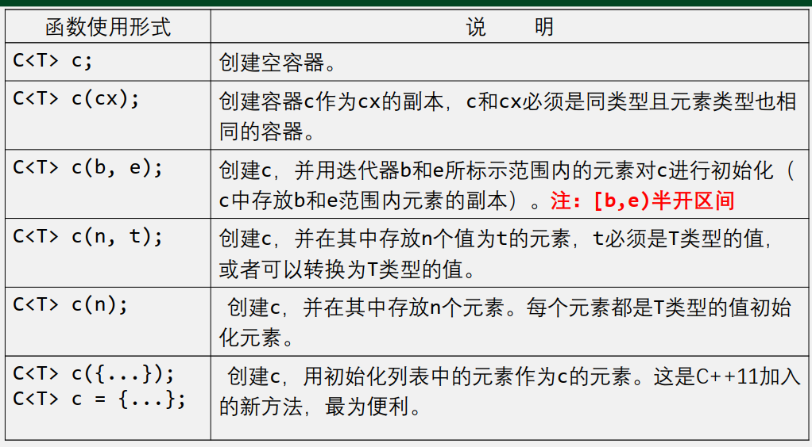

比如：

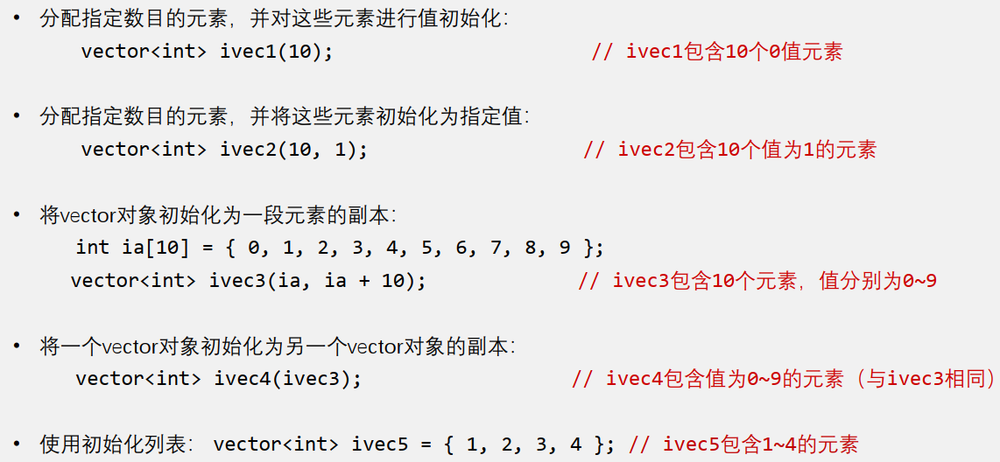

#### 访问方式

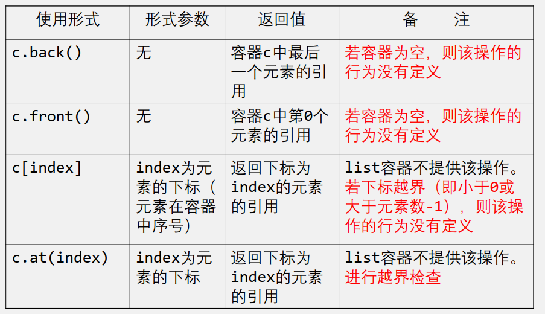


#### 迭代器

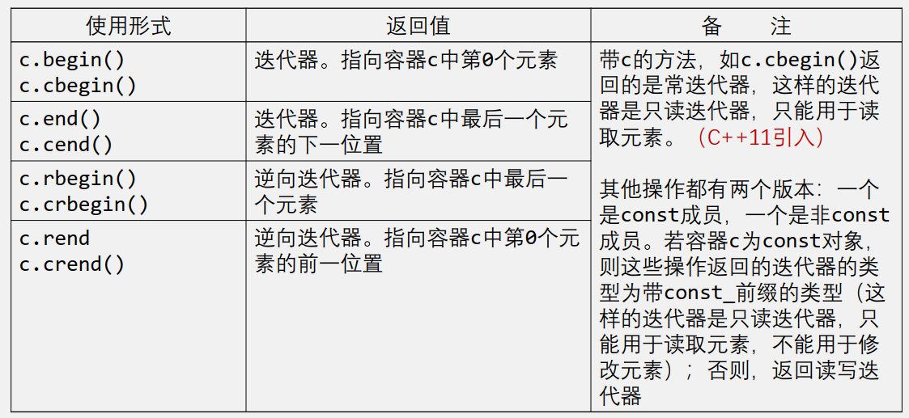

#### 插入元素

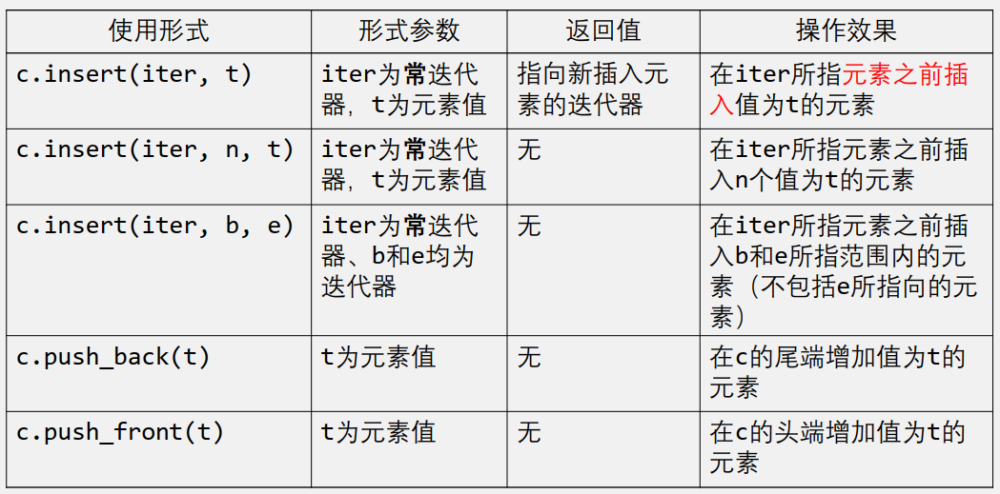

#### 比较

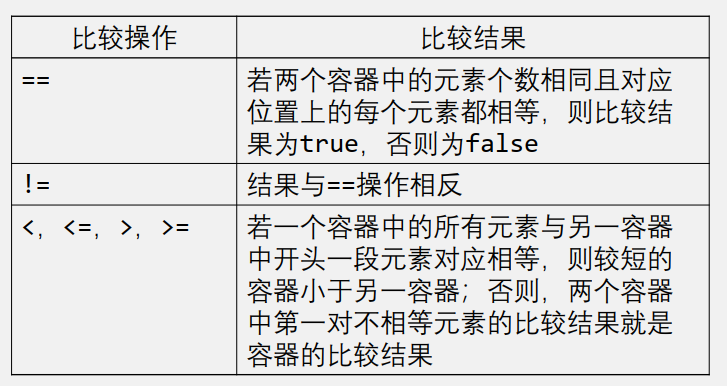

#### 容量操作

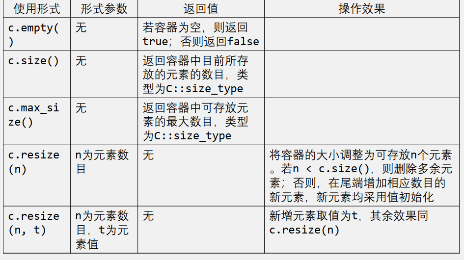

注意：`resize`仅改变`size`，不改变`capacity`

| `c.reverse`(m) | m为预分配的元素个数 | 无返回值 | 预分配至少能容纳 `m` 个元素的内存，但是不会增加元素 |
| -------------- | ------------------- | -------- | --------------------------------------------------- |


#### vector的内存管理

扩容方式：以**成倍增长**的方式扩容

见以下例子：

例1：

```cpp
#include <iostream> 
#include <vector> 
 
using namespace std; 
 
int main() 
{ 
    vector<int> v; 
    for (int i = 1; i <= 5; i++) 
    {
        v.push_back(i); 	
    }
    /*
    	一共输入了5个数：
    	输入1时，内存不足，扩容：0 -> 1
    	输入2时，内存不足，扩容：1 -> 2
    	输入3时，内存不足，扩容：2 -> 4
    	输入5时，内存不足，扩容：4 -> 8
    */
    cout<<v.capacity()<<endl;// 输出：8
    v.resize(4);			 // 调整size变成4,删除多余的元素5。但是capacity不变
    cout<<v.capacity()<<endl;// 输出：8
    return 0; 
}
```

例2：

```cpp
#include <iostream> 
#include <vector> 
 
using namespace std; 
 
int main() {
	int n = 17; 
    vector<int> a;
    for (int i = 0; i < n; i++){
        a.push_back(i);
    }
    /*
    	一共输入了17个数：
    	输入1时，内存不足，扩容：0 -> 1
    	输入2时，内存不足，扩容：1 -> 2
    	输入3时，内存不足，扩容：2 -> 4
    	输入5时，内存不足，扩容：4 -> 8
    	输入9时，内存不足，扩容：8 -> 16
    	输入17时，内存不足，扩容：16 -> 32
    */
    cout<<a.capacity()<<" ";// 输出：32
    a.shrink_to_fit();
    /*
    	剔除多余的内存，使得内存刚好能容纳现有的元素
    	容量变化：32 -> 17
    */
    a.push_back(n+1);
    /*
    	内存不足，扩容：17 ->34
    */
    cout<<a.capacity();// 输出：34
    return 0; 
}
```

例3：

```cpp
#include <iostream> 
#include <vector> 
 
using namespace std; 
 
int main() {
	int n = 16; 
    vector<int> a;
    for (int i = 0; i < n; i++){
        a.push_back(i);
    }
    /*
    	一共输入了16个数：
    	输入1时，内存不足，扩容：0 -> 1
    	输入2时，内存不足，扩容：1 -> 2
    	输入3时，内存不足，扩容：2 -> 4
    	输入5时，内存不足，扩容：4 -> 8
    	输入9时，内存不足，扩容：8 -> 16
    */
    cout<<a.capacity()<<" ";//输出：16
    int m=50;
    a.reserve(m);//预分配m个容量的内存
    /*
    	预分配50个容量的内存
    	容量变化：16 -> 50
    */
    cout<<a.capacity()<<" ";//输出：50
    for (int i = 0; i < m; i++){
        a.push_back(i);
    }
    /*
    	输出50个数：
    	内存不足，扩容：50 -> 100
    */
    cout<<a.capacity();//输出：100
    return 0; 
}
```


#### 赋值和交换

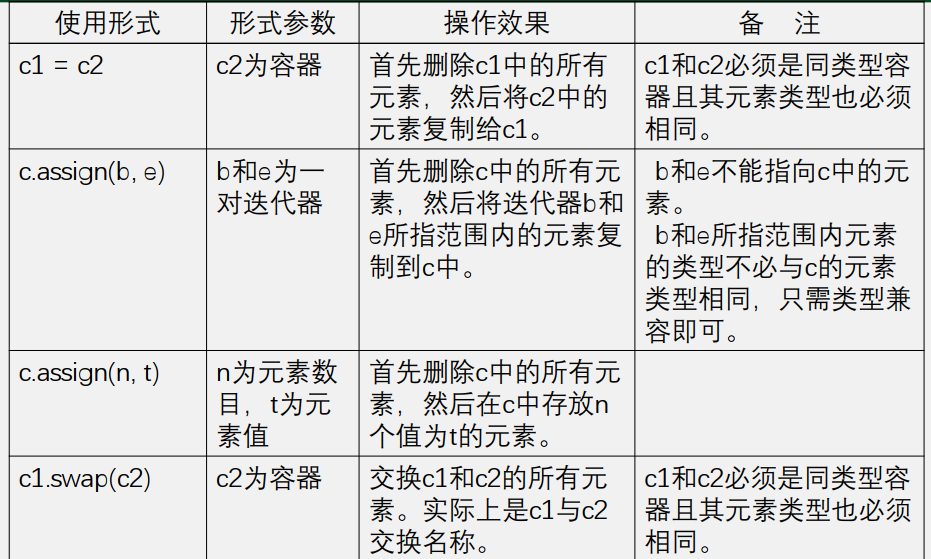


### 关联式容器

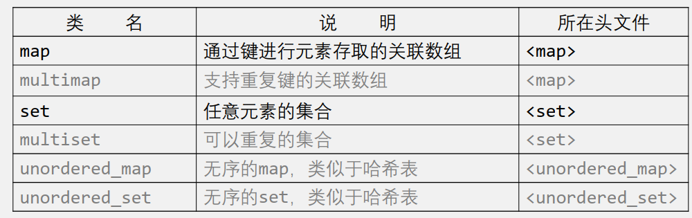

#### map

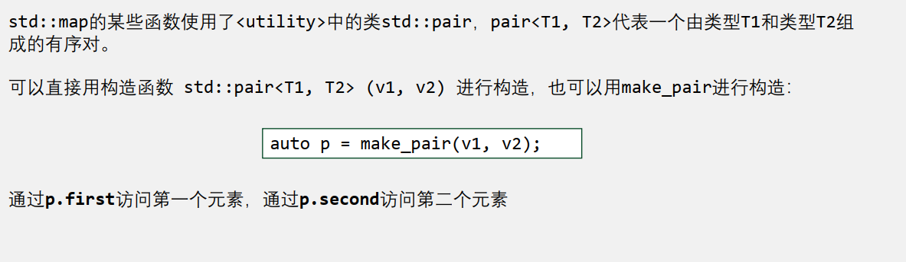

##### 构造函数

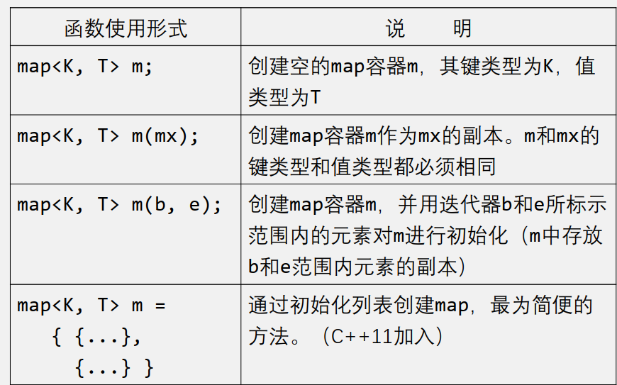

##### 寻找元素

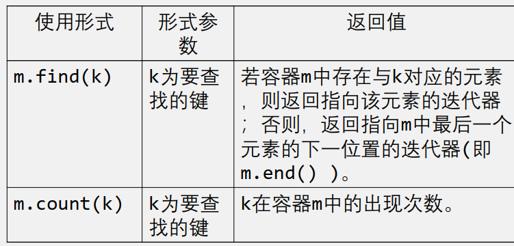

##### 删除元素

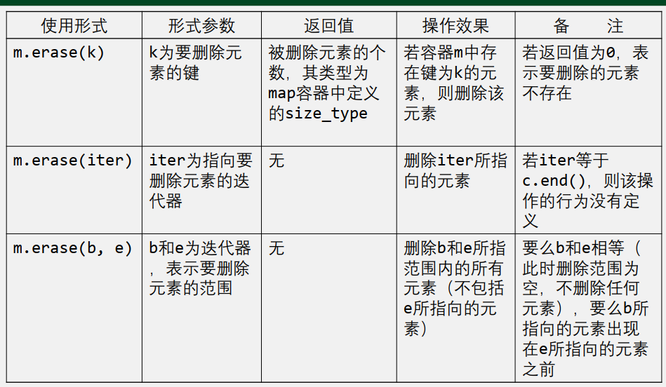


#### multimap 的特别之处

- 不支持下标操作。
- insert操作每调用一次都会增加新的元素（multimap容器中，键相同的元素相邻存放）
- 以键值为参数的erase操作删除该键所关联的所有元素，并**返回被删除元素的数目**。
-  count操作返回指定键的出现次数。
- find操作返回的迭代器指向与被查找键相关联的**第一个**元素。
- 结合使用count和find操作依次访问multimap容器中与特定键关联的所有元素

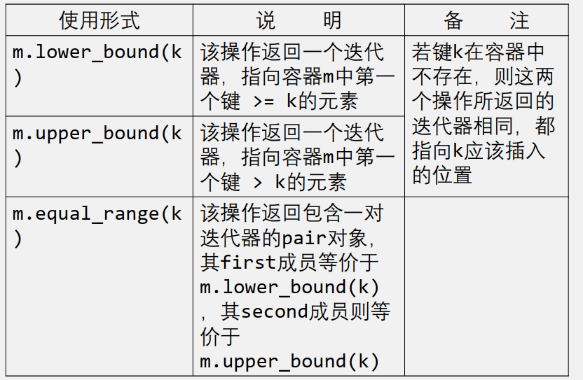


#### set的特别之处

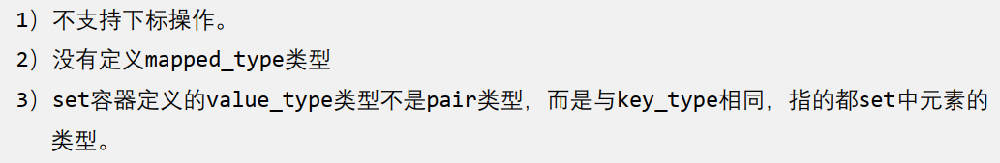


### 容器适配器

#### stack 栈

特点：后进先出

头文件： `<stack>`

创建：`stack<typename> s;`

主要操作：

1. 压栈：`push(typename T)` 
2. 出栈：`pop() `  **注意：*无* 返回值！**
3. 获得栈顶元素：`top()`
4. 判空：`empty()`
5. 大小：`size()`


#### queue 队列

特点：先进先出

头文件： `<queue>`

创建：`queue<typename> q;`

主要操作：

1. 入队：`push(typename T)`
2. 出队：`pop()` **注意：*无* 返回值！**
3. 获得队首元素：`front()`
4. 获得队尾元素：`back()`
5. 判空：`empty()`
6. 大小：`size()`


#### priority_queue 优先队列

特点：按优先级排序，**默认采用最大堆（从大到小）**

头文件： `<queue>`

创建：`priority_queue<typename> q;`

主要操作：

1. 入队：`push(typename T)`
2. 出队：`pop()` **注意：*无* 返回值！**
3. 获得队首元素：`top() `  **注意：不是用`front()`**
4. 判空：`empty()`
5. 大小：`size()`


#### 容器适配器的底层实现方式

（1）标准库中定义的容器适配器都是基于**顺序容器**建立的。

（2）程序员在创建适配器对象时可以自己选择相应的基础容器类。

- stack适配器可以建立在vector、 list或deque容器上。
- queue适配器只能建立在list或deque容器上。
- priority_queue适配器只能建立在vector或deque容器上。

（3）如果创建适配器对象时不指定基础容器，则**stack**和**queue**默认采用**deque**实现，而**priority_queue**则默认采用**vector**实现

例如：stack在头文件 `<stack>`中的定义：

```cpp
template<
class T,
class Container = std::deque<T>  //默认使用deque实现
> class stack;
```


#### 容器适配器的构造函数

```cpp
#include <stack>
#include <deque>
#include <iostream>
int main()
{
    //默认初始化
    std::stack<int> c1;
    c1.push(5);
    std::cout << c1.size() << '\n';
    
    //拷贝初始化
    std::stack<int> c2(c1);
    std::cout << c2.size() << '\n';
    
    //利用容器初始化
    std::deque<int> deq {3, 1, 4, 1, 5};
    std::stack<int> c3(deq);
    std::cout << c3.size() << '\n';
}
```

