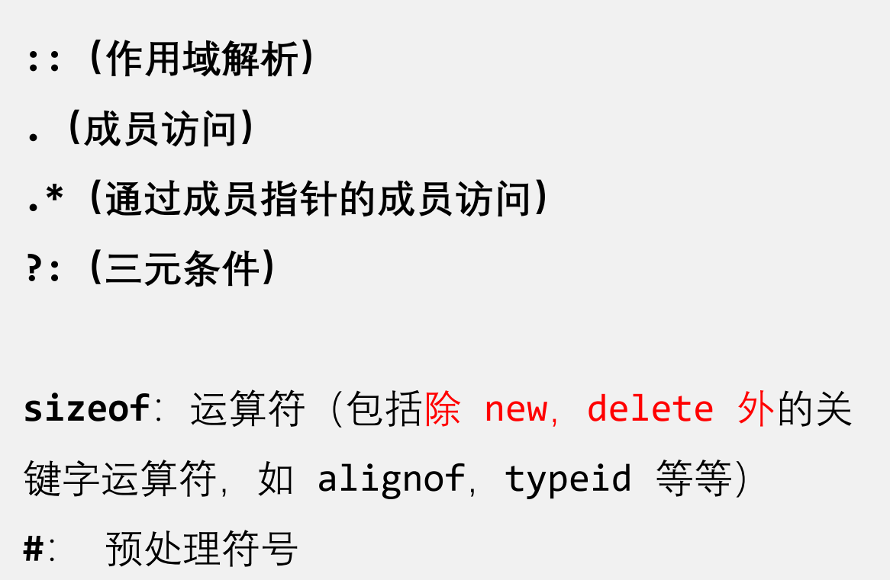

# C++的类


## 简介

类中包含：

- **属性** 又称 成员属性、成员变量
- **行为** 又称 成员函数、成员方法

**属性**和**行为**统称为**成员**

```c++
class Student{
    public:
    
    //属性 又称 成员属性、成员变量
    string name;
    string number;

    //行为 又称 成员函数、成员方法
    void show()
    {
        cout<<"name:"<<name<<endl;
        cout<<"number:"<<number<<endl;
    }
};
```


## 访问权限

共有 **3** 种

| 访问权限            | 类内可否访问 | 类外可否访问 | （继承中）儿子可否访问父亲的内容 |
| ------------------- | ------------ | ------------ | -------------------------------- |
| 公共权限`public`    | Yes          | Yes          | Yes                              |
| 保护权限`protected` | Yes          | No           | Yes                              |
| 私有权限`private`   | Yes          | No           | No                               |


## struct vs class

**C 语言**的 `struct` 只能包含 **变量**，**不能包含函数**。

在 **C++** 中，`struct` 和 `class` **几乎一样**，它们都可以包含 **变量（数据成员）** 和 **函数（成员函数）**，主要的区别在于 **默认访问权限不同**。

1. `struct` 默认是公共权限`public`
2. `class`默认是私有权限`private`

示例：

```c++
struct Person1{
    string name;//默认是公共权限 public
};

class Person2{
    string name;//默认是私有权限 private
};

int main()
{
    Person1 p1;
    Person2 p2;
    string myName="aaa";

    p1.name=myName;//公共权限，可以访问
    p2.name=myName;//私有权限，不可以访问，会报错！

    return 0;
}
```


好处：

- 可以控制访问权限（可不可以读、写）
- 可以检测写入值的有效性

示例

```c++
class Person{
private:
    string name;
    int age;
public:
    string getName()//读name
    {
        return name;
    }

    void setAge(int in_age)//写age
    {
        //检测写入值的有效性
        //不满足条件，则不能写入
        if(in_age<0)
        {
            cout<<"输入异常"<<endl;
        }
        age=in_age;
    }
    int getAge()//读age
    {
        return age;
    }
};
```


## 例子

> Point类
>
> 有一个构造函数
>
> 有一个**静态**数据成员，count，记录了一共创建了多少个point对象
> 有两个基本属性x，y，分别记录了x和y轴的坐标，x，y的初始值为0；
> 有2个方法：
>
> - judge可以判断三个点是否在一条直线上
> - print可以打印出点的坐标(x,y)
>
> 调用方式：
>
> - `Point p1(x, y);`
> -  `Point::count`
> -  `p1.judge(p2, p3)`
> - `p1.print();`


```c++
class Point
{
private:
	double x, y;
	
public:
	Point(double x0,double y0):x(x0),y(y0)
	{
		count++;
	}//构造函数
	
	bool judge(Point p2, Point p3);
	void print();
    
	static int count;//静态数据成员
};

int Point::count = 0;//类内定义的变量要在类外初始化

bool Point::judge(Point p2, Point p3)//判断3点是否共线
{
	if ((y - p2.y) * (x - p3.x) == (y - p3.y) * (x - p2.x))
	{
		return true;
	}
	else
	{
		return false;
	}
}

void Point::print()
{
	std::cout << '(' << x << ',' << y << ')' << std::endl;
}
```


# 各部分详细介绍


## 构造函数and析构函数

### 1. **构造函数（Constructor）**
#### 作用：

构造函数是在创建对象时**自动调用**的函数，用于**初始化**对象的成员变量，分配资源等。每次创建对象时，构造函数都会被调用一次。

#### 特点：
- **名称**：构造函数的名称与**类名相同**。

- **返回类型**：构造函数**没有返回类型，也不返回任何值**。也**不用写void**

- **调用时机**：构造函数在对象**创建时** **自动**调用。

- **参数**：构造函数可以有参数，也可以没有参数（无参构造函数）。因此可以发生**重载**

  

#### 种类：
- **无参构造函数**（默认构造函数）：没有参数，创建对象时自动调用。

- **有参构造函数**：带有一个或多个参数，用于根据不同的参数初始化对象。

- **拷贝构造函数**：用于复制已有对象的内容来创建一个新对象，通常由编译器自动调用，或者你可以自定义它。


#### 初始化方法：

>因为类是通过它的构造函数来初始化的，
>
>所以，类的初始化方法也就是构造函数的写法

对于**无参构造函数**和**有参构造函数**，有2种写法：


##### 写法一：逐一赋值法（传统写法）

```c++
MyClass(){
        x=0;
        y=0;
    }
MyClass(int xx,int yy){
        x=xx;
        y=yy;
    }
```


##### 写法二：初始化列表

```c++
MyClass():x(0),y(0){}
MyClass(int xx,int yy):x(xx),y(yy){}
```

> [!NOTE]
>
> 成员是按照他们在**类中声明的顺序**进行初始化的，而不是按照他们在初始化器列表出现的顺序初始化的  
>
> 
>
> 如果顺序不当，可能会报错，例如：
>
> 

> [!IMPORTANT]
>
> **必须使用 *成员初始化列表* 的情形**
>
> 1.常量成员，因为常量只能初始化不能赋值，所以必须放在初始化器列表里面
>
> 2.引用类型，引用必须在定义的时候初始化，并且不能重新赋值，所以也要使用初始化器
>
> 3.没有无参构造函数的类成员，使用初始化器列表可以使用有参构造函数初始化


#### 调用方式：

- 括号法   注意：对于**无参**构造函数，**不需要加括号！**
- 显式法（先创建**匿名对象**，再把它赋值给一个**新**的**有变量名**的对象）
- 隐式转换法

#### 示例：

```c++
#include<iostream>
using namespace std;

class MyClass{
private:
    int age;
public:
    MyClass()
    {
        cout<<"无参构造函数"<<endl;
        age=0;
    }
    MyClass(int a)
    {
        cout<<"有参构造函数"<<endl;
        age=a;
    }
    MyClass(const MyClass& mc)
    {
        cout<<"拷贝构造函数"<<endl;
        age=mc.age;
    }
    ~MyClass()
    {
        cout<<"析构函数"<<endl;
    }
};

void test1()
{
    //调用方式
    //1.括号法
    MyClass mc1;               //调用无参构造函数
    MyClass mc2(100);          //调用有参构造函数
    MyClass mc3(mc2);          //调用拷贝构造函数
}

void test2()
{
    //2.显式法
    MyClass mc1;               //调用无参构造函数
    MyClass mc2=MyClass(100);  //调用有参构造函数
    MyClass mc3=MyClass(mc2);  //调用拷贝构造函数

    MyClass(100);              //匿名对象
}

void test3()
{
    //3.隐式转换法
    MyClass mc1=100;           //调用有参构造函数
    MyClass mc2=mc1;           //调用拷贝构造函数

}

int main()
{
    test1();
    test2();
    test3();
    return 0;
}
```

运行结果：

```c++
//test1
无参构造函数
有参构造函数
拷贝构造函数
析构函数
析构函数
析构函数
    
//test2
无参构造函数
有参构造函数
拷贝构造函数
有参构造函数
析构函数
析构函数
析构函数
析构函数
    
//test3    
有参构造函数
拷贝构造函数
析构函数
析构函数
```


#### 拷贝构造函数的调用方式

特别地，下面介绍拷贝构造函数的调用方式，共有**3种**：


##### 1.初始化时：用一个已经创建的对象来初始化另一个对象

本质：把***已经创建的对象*** 拷贝到 ***新的对象***

```c++
void test1()
{
    MyClass mc1(100);          
    MyClass mc2(mc1);          //调用拷贝构造函数
}
```


##### 2.值传递：以值传递的方式给函数形参传值

本质：把***实参的对象*** 拷贝到 ***形参的对象***

```c++
void func(MyClass mc){
    cout<<"func(MyClass mc)"<<endl;
}
void test2()
{
    MyClass mc1=100;
    func(mc1);
}
```


##### 3.函数返回值：函数返回局部变量的值

本质：把***局部变量*** 拷贝到 ***返回值***

```c++
//函数返回局部变量的值
MyClass func2(){
    cout<<"func2(MyClass mc)"<<endl;
    MyClass mc=100;
    return mc;
}
void test5()
{
    MyClass mc=func2();     //返回时会调用拷贝构造函数
}
```


### 2. **析构函数（Destructor）**
#### **作用**：

析构函数是在对象**生命周期结束时**自动调用的函数，主要用于释放资源，例如释放内存、关闭文件句柄、销毁对象持有的外部资源等。


#### 特点：
- **名称**：析构函数的名称与**类名相同**，但前面有一个**波浪号**（`~`）。
- **返回类型**：析构函数**没有返回类型，也不返回任何值**，也不写`void`。
- **调用时机**：析构函数**不能被显式调用**，只能在对象**销毁时** **自动**调用（例如，局部变量超出作用域时，或者通过 `delete` 删除动态分配的对象时）。
- 每个类**最多只能有一个析构函数**。
- 析构函数**没有参数**，因此**不能**发生**重载**。


> [!CAUTION]
>
> 析构函数可以是 `private`
>
> 一般用于：
>
> 1. 单例模式：防止外部 `delete`对象
> 2. 禁止对象在栈上创建，但允许用 `new` 来创建，并由类内部管理 `delete`


#### 示例：
```cpp
class MyClass {
public:
    int x;

    // 构造函数
    MyClass(int value) : x(value) {
        std::cout << "构造函数被调用，x = " << x << std::endl;
    }

    // 析构函数
    ~MyClass() {
        std::cout << "析构函数被调用，x = " << x << std::endl;
    }
};

int main() {
    MyClass obj(10);  // 创建对象时调用构造函数
}  // 程序结束时，obj 超出作用域，调用析构函数
```

输出：
```
构造函数被调用，x = 10
析构函数被调用，x = 10
```


#### 析构的顺序

```cpp
#include <iostream>
using namespace std;

class A {
    string name;
public:
    A(string name) {
        this->name = name;
        cout << "A(" << name << ")" << endl;
    }
    ~A() {
        cout << "~A(" << name << ")" << endl;
    }
};

int main() {
    A a1("a1"), a2("a2");
    return 0;
}
```


```bash
A(a1)
A(a2)
~A(a2)
~A(a1)
```

由于局部变量存储在**栈** ，根据栈 ***后进先出*** 的特点：**后生成的变量先销毁**


### 3. **构造函数与析构函数的主要区别**

| **特性**           | **构造函数**                               | **析构函数**                                               |
| ------------------ | ------------------------------------------ | ---------------------------------------------------------- |
| **调用时机**（异） | 对象**创建时**自动调用                     | 对象**销毁时**自动调用（如超出作用域或通过 `delete` 删除） |
| **作用**（异）     | 初始化对象，分配资源                       | 清理资源，释放对象占用的内存或外部资源                     |
| **返回类型**（同） | 没有返回类型                               | 没有返回类型                                               |
| **参数**（异）     | 可以**有**参数（有参构造函数），也可以没有 | **没有**参数                                               |
| **数量**（异）     | 每个类可以有多个构造函数（构造函数重载）   | 每个类最多只有一个析构函数                                 |
| **调用方式**（异） | 构造函数由编译器在**对象创建时**自动调用   | 析构函数由编译器在**对象销毁时**自动调用                   |
| **显式调用**（异） | **可以显式**调用（通过创建对象）           | **不能**显式调用，**系统自动调用**                         |

构造函数和析构函数都是必须有的，如果程序员没有提供，编译器会提供一个**空实现**的构造函数和析构函数


### 4.编译器创建函数功能

#### 4.1编译器自动创建函数功能

1. 一旦创建一个类，编译器就会自动创建至少3个函数：

   - 默认构造函数（空实现）
   - 拷贝构造函数（值拷贝）
   - 析构函数（空实现）

2. 如果我们提供了有参构造函数，那么编译器就**不**自动创建***默认构造函数***，但是仍会自动创建 ***拷贝构造函数***、***析构函数***

3. 如果我们提供了拷贝构造函数，那么编译器就**不**自动创建***普通构造函数***

   

> [!WARNING]
>
> 鉴于编译器自动创建函数功能，
>
> 在写类时，
>
> 1. 如果我们提供了***有参构造函数***，就也要提供***默认构造函数***
> 2. 如果我们提供了***拷贝构造函数***，就也要提供***默认构造函数***和***有参构造函数***，


#### 4.2人为指定编译器创建函数

##### **`=default`**

作用：令编译器为某个类生成**特殊成员函数**或比较运算符的显式指令

仅仅用于编译器能自动生成的特殊成员函数  

> 特殊成员函数
>
> 包括：
>
> - 默认构造函数:T()
> - 析构函数:~T()
> - 拷贝构造函数:T(const T&)
> - 赋值运算:operator=(const T&) 

语法：

`=default` 必须在函数声明后，让编译创建该构造函数

使用后该函数不能再自定义实现  


##### `=delete   `

作用：把函数定义为弃置的（deleted）  

任何弃置函数的使用都是非良构的（程序无法编译）   

语法：

删除的函数定义必须是函数的**首次声明**  


### 5.类对象作为成员变量

例如：类A是类B的成员变量

那么创建类B的对象时，先调用类A的构造函数-->创建出一个类A的对象-->再调用类B的构造函数

而在删除类B的对象时，先调用类B的析构函数-->再调用类A的析构函数


## 浅拷贝与深拷贝

### 1.浅拷贝：

**浅复制策略**只按申明顺序复制成员的**值**，**不**复制**指针指向的对象实体**  

两个对象所指向的堆区地址**相同**，因此在析构时**会** **重复释放**这个堆区地址的内存，造成**报错！**


解决方法：使用深拷贝


### 2.深拷贝：

两个对象所指向的堆区地址不同，因此在析构时**不会**像浅拷贝那样 重复释放堆区的内存


#### 具体代码

```c++
class MyClass{
public:
    int age;
    int *pt;

    MyClass(const MyClass& mc){
        age=mc.age;
        pt=mc.pt;//浅拷贝
    }
}
```

```c++
class MyClass{
public:
    int age;
    int *pt;
	
    //深拷贝构造函数
    MyClass(const MyClass& mc){
        age=mc.age;
        pt=new int(*mc.pt);//深拷贝
    }
}
```


#### 深拷贝的实现：

深拷贝不仅能在**构造函数**中实现，还可以在**重载赋值运算符`=`**中实现

但是要注意二者的使用方式不同！

```cpp
#include<iostream>
#include <cstring>
#include <string>
using namespace std;
class String{
private:
    char* data;
    int length;
public:
    String(const char* s){
        int i;
        for(i=0;s[i]!='\0';i++);
        length=i;
        data=new char[length];
        for(i=0;s[i]!='\0';i++)
        {
            data[i]=s[i];
        }
    }
    String() =default;
	
    //深拷贝构造函数
    String(const String& s2){
        length=s2.length;
        data=new char[length];
        memcpy(data,s2.data,sizeof(char)*length);
    }
	
    //深拷贝赋值
    String& operator=(const String& s2)
    {
        if (this!=&s2)
        {
            delete[] data;
            length=s2.length;
            data=new char[length];
            memcpy(data,s2.data,sizeof(char)*length);
        }
        return *this;
    }

    ~String(){
        delete[] data;
    }

    void print() const
    {
        for(int i=0;i<length;i++)
        {
            cout<<data[i];
        }
    }

};
int main()
{
    char char_string[100]={'\0'};
    cin.getline(char_string,100); //最多读取100个字符
    
    String s1(char_string);
    
    //使用方式
    String s2;
    s2=s1;			//调用深拷贝赋值
    
    String s3=s1;   //调用深拷贝构造函数
    
    cout<<"s1: ";
    s1.print();
    cout<<endl;

    cout<<"s2: ";
    s2.print();
    cout<<endl;
    
	cout<<"s3: ";
    s3.print();
    cout<<endl;
    
    return 0;
}
```


#### 注意事项：

1.要在**析构函数**中把堆区的内存释放干净

示例代码

```c++
~MyClass()
{
	if(pt!=NULL)
	{
		delete pt;
		pt=NULL;
	}
}
```


2.**拷贝构造函数**中的参数按**引用**方式传递

原因：如果不是引用的方式，而是**值**传递。由于传值的方式会调用该类的拷贝构造函数，那么参数进行值传递时会无穷地调用拷贝构造函数。因此拷贝构造函数的参数必须是一个引用。


3.**拷贝构造函数**只有**1个**

原因：拷贝构造函数的参数只有1个，那就是被拷贝的对象，所以无法进行重载。


## 静态成员

### 静态成员变量

#### 特点：

1. 所有对象共用一份数据，并不单独属于某个对象
2. 在编译阶段分配内存，分配在全局区
3. 类内声明，**类外初始化**

> [!CAUTION]
>
> 静态成员变量**类外初始化**时，**不用**再写 `static`
>
> 只有在**类内声明**时，才写 `static`

> [!WARNING]
>
> 静态成员变量 **不能** 在 **构造函数** 中初始化，因为它是 **所有对象共享** 的，不能为每个对象单独初始化。


#### 访问方式：（2种）

##### 1.通过**对象**来访问

语法：`对象名.静态成员变量名`

例如：`p1.s_a`

##### 2.通过**类名**来访问

语法：`类名::静态成员变量名`

例如：`Person::s_a`

有这种语法的原因：因为静态成员变量是该类中所有对象**公共**的


#### 示例代码：

```c++
#include<iostream>
using namespace std;

class Person{
public:
    int a;//非静态成员变量
    static int s_a;//静态成员变量
};

int Person::s_a=100;//静态成员变量 要 类外初始化

void test1()
{
    Person p1;
    p1.a=1;
    cout<<"p1.a="<<p1.a<<"  地址:"<<&(p1.a)<<endl;
    cout<<"p1.s_a="<<p1.s_a<<"  地址:"<<&(p1.s_a)<<endl;

    Person p2;
    p2.a=2;
    p2.s_a=111;
    cout<<"p1.a="<<p1.a<<"  地址:"<<&(p1.a)<<endl;
    cout<<"p2.a="<<p2.a<<"  地址:"<<&(p2.a)<<endl;
    
    cout<<"p1.s_a="<<p1.s_a<<"  地址:"<<&(p1.s_a)<<endl;
    cout<<"p2.s_a="<<p2.s_a<<"  地址:"<<&(p2.s_a)<<endl;
    cout<<"Person::s_a="<<Person::s_a<<"  地址:"<<&(Person::s_a)<<endl;
}
}

int main()
{
    test1();
    return 0;
}
```

运行结果：

```cmd
p1.a=1  地址:0x62fe1c
p1.s_a=100  地址:0x403010
p1.a=1  地址:0x62fe1c
p2.a=2  地址:0x62fe18
p1.s_a=111  地址:0x403010
p2.s_a=111  地址:0x403010
Person::s_a=111  地址:0x403010
```

由此可见，

- 对象`p1`,`p2`的成员变量`a`分配在不同的内存单元。而，对象`p1`,`p2`的静态成员变量`s_a`是同一个数据
- 成员变量`a`在不同对象之间不能互相访问，但是静态成员变量`s_a`可以被**这个类的所有对象**共同访问


> [!CAUTION]
>
> 静态成员变量的**作用域**
>
> **不是**“仅限于定义它的文件”，而是**整个程序**
>
> ```cpp
> class Test {
> public:
>     static int x;  // 变量声明
> };
> 
> int Test::x = 10;  // 变量定义（可以在其他文件访问）
> ```


### 静态成员函数

#### 特点：

1. 所有对象**共享**同一个函数
2. 静态成员函数**只**能访问**静态成员变量**

> [!CAUTION]
>
> 与 静态成员变量 类似
>
> 静态成员函数**类外定义**时，**不用**再写 `static`。只有在**类内声明**时，才写 `static`
>
> 或者 在**类内定义**静态成员函数，要写`static`。
>
> 
>
> 总之，**类内要写`static`，类外不用写**

#### 访问方式：（2种）

##### 1.通过**对象**来访问

语法：`对象名.静态成员函数名`

例如：`p1.func`

##### 2.通过**类名**来访问

语法：`类名::静态成员函数名`

例如：`Person::func`

有这种语法的原因：因为静态成员函数是该类中所有对象**共享**的


#### 示例代码：

```c++
static void func()
{
    s_a=1;//静态成员函数 可以访问静态成员变量
    //a=1;//静态成员函数 不可以访问非静态成员变量 报错！
    cout<<"调用 static void func()"<<endl;
}
```


> [!IMPORTANT]
>
> 静态成员函数 只可以访问静态成员变量，**不可以**访问**非静态成员变量**
>
> 但是!
>
> **非静态成员函数** 既可以访问**静态成员变量**，又可以访问**非静态成员变量**
>
> 
>
> **原因解释：**
>
> 静态成员函数是所有对象公共的。如果它要访问非静态成员变量，那么就编译器不知道 具体是要访问哪个对象的非静态成员变量
>
> 非静态成员函数是每个对象私有的。访问非静态成员变量时，可以明确知道要访问哪个对象的非静态成员变量；当然也可以访问静态成员变量


## 成员变量与成员函数的存储

内存空间的计算：

- **只算非静态成员变量，**
- 不算静态成员变量；

- 不算非静态成员函数，

- 也不算静态成员函数


计算方式：

- **只算非静态成员变量，**还要考虑**对齐方式**，与结构体占用内存的计算方法一致


### 空对象

> [!WARNING]
>
> 什么是空对象？
>
> 没有**非静态成员变量**的类所创建的对象

内存空间：1个字节

C++编译器会给每个空对象分配 1个字节的内存空间，目的是区分空对象所占的内存的位置。

每个空对象也有1个独一无二的内存地址。


示例代码

```c++
class Person1{

};

int main()
{
    //空对象
    Person1 p1;
    cout<<"sizeof(p1)="<<sizeof(p1)<<endl;
    return 0;
}
```

```cmd
sizeof(p1)=1
```


### 非空对象

> [!WARNING]
>
> 什么是空对象？
>
> 有**非静态成员变量**的类所创建的对象

示例代码

```c++
class Person2{
    int a;//非静态成员变量
    static int s_a;//静态成员变量
    void func()//非静态成员函数
    {
        
    }
    static void func2()//非静态成员函数
    {
        
    }
};

int main()
{
    //非空对象
    Person2 p2;
    cout<<"sizeof(p2)="<<sizeof(p2)<<endl;
    return 0;
}
```

```cmd
sizeof(p2)=4
```


所以，每一个非静态成员函数只会产生**1份函数实例**，即：同一个类下的**所有对象的非静态成员函数**是占用**同一块内存**的


## this指针

>由前文“成员变量与成员函数的存储”中得知，“同一个类下的**所有对象的非静态成员函数**是占用**同一块内存**的”
>
>那么，这一块代码是如何区分是哪一个对象调用自己呢？
>
>
>
>回答：
>
>利用**this指针**
>
>**this指针**指向调用非静态成员函数的**对象**
>
>**this指针**隐含在每一个非静态成员函数内，不需要定义，可以直接使用
>
>（底层原因：编译器自动默认向非静态成员函数传了一个形参`类名 *this`）


### this指针的本质：指针常量

> [!IMPORTANT]
>
> this指针的本质：指针常量
>
> 即：`类名 *const this` 
>
> 所以：this指针 本身的值不能修改（也就是不能修改this指针**指向谁**），`this=NULL;//错`
>
> 但是能修改 this指针 所指向变量的值（也就是能修改this指针**指向对象的属性**）`this->age=a;//对`


### 语法：

例如：

```c++
class Person{
    int age;
    void setAge(int a)
    {
        this->age=a;//等价于age=a;
    }
};

```


### 作用：

- 当成员变量与形参**同名**时，用**this指针**来区分

例如：下面的`isSameAge`函数

```c++
class Person{
    int age;

    bool isSameAge(int age)
    {
        if( this->age==age)//当成员变量与形参同名时，用**this指针**来区分
        {
            return true;
        }
        else
        {
            return false;
        }
    }
};
```


- 非静态成员函数中**返回对象本身**，用`return *this`，而且函数类型为 `类名&`

```c++
class Person{
public:
    int age;

    Person (int a): age(a){}

    //非静态成员函数
    Person& addAge(Person &p)
    {
        this->age+=p.age;
        return *this;//返回值为对象本身
    }
};

int main()
{
    Person p1(10),p2(1);

    p2.addAge(p1).addAge(p1).addAge(p1);

    cout<<p2.age<<endl;
    return 0;
}
```

运行结果：

```cmd
31
```

解释：

`p2.addAge(p1).addAge(p1).addAge(p1);`每一次调用`addAge(p1)`，返回的都是p2本身，

然后 后一次调用`addAge(p1)`，又作用于p2本身，

所以最终 `p2.age=p2.age+p1.age+p1.age+p1.age=31`


如果把函数类型 从  `类名&` 改为  `类名`

即：从  `Person& addAge(Person &p)` 改为`Person addAge(Person &p)` ，

见下方代码：

```c++
class Person{
public:
    int age;

    Person (int a): age(a){}

    Person addAge(Person &p)
    {
        this->age+=p.age;
        return *this;//返回值为对象的一个拷贝
    }
};

int main()
{
    Person p1(10),p2(1);

    p2.addAge(p1).addAge(p1).addAge(p1);

    cout<<p2.age<<endl;
    return 0;
}
```

运行结果：

```cmd
11
```

解释：

`p2.addAge(p1).addAge(p1).addAge(p1);`

第1次调用`addAge(p1)`，`p2.age`变成11，返回`p2`的拷贝`p2'`

第2次调用`addAge(p1)`，本质是`p2'`调用`addAge(p1)`，`p2'.age`变成21，返回`p2'`的拷贝`p2''`

第3次调用`addAge(p1)`，本质是 `p2''`调用`addAge(p1)`，`p2''.age`变成31，返回`p2''`的拷贝`p2'''`

所以，实际上`p2.age`只在第1次调用`addAge(p1)`时被修改成11


## 空对象指针访问成员函数

> 在实际使用中，经常使用**对象指针**来对 对象 进行操作，这样可以**避免对象的多次拷贝，减少内存占用**
>
> 这时，要小心***空对象指针***


示例代码：

```c++
class Person{
public:
    int age;

    void func1()
    {
        cout<<"void func1() is called"<<endl;
    }
    void func2()
    {
        cout<<"void func2() is called"<<endl;
        cout<<"age="<<this->age<<endl;//或者把‘this->age’换成‘age’，效果也一样
    }
};

int main()
{
    Person *p=NULL;//空指针
    p->func1();//不报错
    p->func2();//报错
    return 0;
}
```

解释：

1.`p->func1();`不需要用到**对象本身**，因此也不需要用到**this指针**，所以：虽然p是**空指针**，也***不报错***

2.`p->func2();`需要用到**对象本身**，因此也需要用到**this指针**，所以：由于p是**空指针**，`this->age`没有相应的值，所以***报错***


### 解决方法：

把`func2()`改为以下形式，能够提高代码的健壮性

```c++
    void func2()
    {
        //如果this为空指针，则直接退出，从而不会报错
        if(this==NULL)
        {
            return;
        }
        
        cout<<"void func2() is called"<<endl;
        cout<<"age="<<this->age<<endl;
    }
```


## `const`与类

### 常变量（用`const`修饰的成员变量）

常非静态成员 必须由**默认初始化器**或**初始化器列表**初始化  


### 常函数（用`const`修饰的成员函数）

#### What：

成员函数+`const`=>**常函数**

#### 作用：

常函数内**不可以**修改成员属性（成员变量）

如果成员属性在声明时加**关键字mutable修饰**后，在常函数中仍**可以修改**

#### **语法**：

`返回值类型 函数名( ) const`


> [!IMPORTANT]
>
> > 由前文的“this指针”得知：this指针的本质：指针常量，即：`类名 *const this` 
> >
> > this指针 本身的值不能修改（也就是不能修改this指针**指向谁**），`this=NULL;//错`
> >
> > 但是能修改 this指针 所指向变量的值（也就是能修改this指针**指向对象的属性**）`this->age=a;//对`
>
> 
>
> 那么，如果想让 ***this指针 所指向变量的值*** 也不能修改，
>
> 就应该用`const 类名* const this` （或者说：this指针的类型应该为：`const 类名* const`）
>
> 
>
> 问题来了：这个**多加的`const`**,在函数声明(或者函数定义的第一行)中，应该放在哪里呢？
>
> | 函数声明(或者函数定义的第一行)： | A    | 返回值类型 | 函数名 | （B） | C    |
> | -------------------------------- | ---- | ---------- | ------ | ----- | ---- |
>
> 若放在A位置，容易误以为是修饰返回值的
>
> 若放在B位置，容易误以为是修饰形参的
>
> 若放在C位置，无歧义，所以最终规定放在C位置
>
> 
>
> 所以，**常函数**的声明(或者函数定义的第一行)的**语法**：
>
> `返回值类型 函数名( ) const`


示例代码：

```c++
class Person{
public:
    int m_a;//在常函数中仍**不可以修改**
    mutable int m_b;//加**关键字mutable修饰**，在常函数中仍**可以修改**

    void func() const//常函数
    {
        //this->m_a=10;//或者 ‘m_a=10;’//都报错
        this->m_b=10;//或者 ‘m_b=10;’//都不报错
    }
};
```


### 常对象（用`const`修饰的对象）

#### What：

`const`+对象=>**常对象**

#### 作用：

- 常对象只可以修改 加**关键字mutable修饰**的成员属性；不可以修改普通成员属性。
- **常对象只能调用常函数**；不能调用普通成员函数，因为普通成员函数可以修改普通成员属性。

#### 语法：

`const 类名 对象名`

示例代码：

```c++
class Person{
public:
    int m_a;
    mutable int m_b;

    Person():m_a(0),m_b(0){}
    void func1() const
    {
        //this->m_a=10;//或者 ‘m_a=10;’//都报错
        this->m_b=10;//或者 ‘m_b=10;’//都不报错
    }
    void func2()
    {
        cout<<"func2"<<endl;
    }

};

void test()
{
    const Person p; //常对象
    p.m_b=1;//常对象可以修改 加**关键字mutable修饰**的成员属性
    //p.m_a=100;//常对象不可以修改普通成员属性，所以报错

    p.func1();//常对象只能调用常函数
    //p.func2();//常对象不能调用普通成员函数，所以报错
    cout<<"p.m_a="<<p.m_a<<endl;
    cout<<"p.m_b="<<p.m_b<<endl;
}

int main()
{
    test();
    return 0;
}
```

运行结果：

```cmd
p.m_a=0
p.m_b=10
```


## 类中static与const关键字的对比


## 友元

>**概念**：让类外的函数或者其他类**也能访问私有属性**

### 3种实现方式：

| 3种实现方式                     | 友元声明的语法                 | 示例                                      |
| ------------------------------- | ------------------------------ | ----------------------------------------- |
| **全局函数** 做友元             | `friend 全局函数普通的声明;`   | `friend void printMoney(Person p);`       |
| **其他类 **做友元               | `friend class 类名;`           | `friend class Parent;`                    |
| **其他类中的*成员函数*** 做友元 | `friend 成员函数在类外的声明;` | `friend void Bank::checkMoney(Person p);` |

无论哪种实现方式，本质上都是 `friend `+ `声明`；

示例代码：

```c++
#include<iostream>
#include<string>
using namespace std;

//类的声明，可以避免类定义时的顺序造成报错的问题
class Person;
class Parent;
class Bank;

class Bank{
public:
    string m_BankName;
    Bank(string name):m_BankName(name){}

    void checkMoney(Person p);//先声明，后实现，从而避免 “Person类不完整实现“ 的报错
};

class Person{
    //友元声明
    friend void printMoney(Person p);        //**全局函数** 做友元
    friend class Parent;                     //**其他类** 做友元
    friend void Bank::checkMoney(Person p); //**其他类中的*成员函数*** 做友元

public:
    string m_name;
private:
    int m_money;
public:
    Person(string name,int money):m_name(name),m_money(money){}
};

class Parent{
public:
    string m_ParentName;
    Parent(string name):m_ParentName(name){}
    
    void checkMoney(Person p)
    {
        cout<<p.m_name<<" has "<<"$"<<p.m_money <<endl;
    }
};

//先在前面Bank类的实现中声明，后面才实现，从而避免 “Person类不完整实现“ 的报错
void Bank::checkMoney(Person p)
{
    cout<<p.m_name<<" has "<<"$"<<p.m_money <<" in "<<m_BankName<<endl;
}

//全局函数
void printMoney(Person p)
{
    cout<<p.m_name<<" has "<<"$"<<p.m_money <<endl;
}

int main()
{
    Person p1("ppp",100);
    printMoney(p1);
    Parent par1("par");
    par1.checkMoney(p1);
    Bank b1("bbb");
    b1.checkMoney(p1);
    return 0;
}
```

运行结果：

```cmd
ppp has $100
ppp has $100
ppp has $100 in bbb
```


## 运算符重载

> What
>
> 运算符重载是允许你为自定义类型（比如类）定义标准运算符（如 `+`, `-`, `[]`, `*` 等）在特定类型上的行为。
>
> 通过运算符重载，可以让**自定义类型**像内建类型一样**使用常见的运算符**。


### 可以重载的运算符


### 不可以重载的运算符




### 其他限制：

- 不能创建新运算符，例如 ******、 **<>**、 **&|**
- 运算符 **&&** 与 **||** 的重载失去短路求值
- 重载的运算符 **->** 必须要么返回裸指针，要么（按引用或值）返回同样重载了运算符 **->** 的对象
- **不能更改**运算符的**优先级**、**结合方向(结合性)**或**操作数的数量**，可以改变**操作数的类型**


### 重载运算符的2种方式：

- 方法一：通过**成员函数**来重载运算符
- 方法二：通过**全局函数**来重载运算符

> [!IMPORTANT]
>
> 特别地，
>
> `=`、`[]`、`()`、`-＞`、类型转换 运算符的重载函数必须是**类成员函数**
>
> `<<`、`>>`为了能够符合惯用的调用方式 `cout<<a`，所以要使用**友元函数**来重载。但其实也可以用类成员函数来重载，只是调用方式不符合习惯。


### 常见的运算符重载示例

#### 1. 重载 `+` 运算符：

方法一：通过**成员函数**来重载运算符+

调用方法：

方法1（简化方法）：`c3=c1+c2;`
方法2： `c3=c1.operator+(c2);`


方法二：通过**全局函数**来重载运算符+

调用方法：

方法1（简化方法）：`c3=c1+c2;`

方法2： `c3=operator+(c1,c2);`

> [!NOTE]
>
> `-` `*`等运算符的重载类似


##### 示例：表示复数的加法

方法一：通过**成员函数**来重载运算符+

```c++
#include<iostream>

using namespace std;

class Complex{
public:
    double real;
    double imag;
    Complex(double r=0,double i=0):real(r), imag(i){}

    Complex operator+(Complex& c2)//通过成员函数来重载运算符+
    {
        return Complex(real+c2.real,imag+c2.imag);
    }

    void printComplex()
    {
        cout<<real<<'+'<<imag<<'i'<<endl;
    }
};

int main()
{
    Complex c1(0.3,0.4),c2(3,4);

    //调用方法：
    Complex c3=c1+c2;//方法1：简化
    //Complex c3=c1.operator+(c2);//方法2
    
    c3.printComplex();
    return 0;
}
```

在这个例子中，`operator+` 被用来重载 `+` 运算符，表示两个复数的加法。

- `Complex operator+ (Complex& other)` 是 `operator+` 运算符的重载版本，它定义了两个复数相加的行为。
- 在 `main()` 函数中，`c1 + c2` 就会调用 `operator+`，并返回一个新的复数对象 `c3`。


方法二：通过**全局函数**来重载运算符+

```c++
#include<iostream>
#include<string>
using namespace std;

class Complex{
public:
    double real;
    double imag;
    Complex(double r=0,double i=0):real(r), imag(i){}

    void printComplex()
    {
        cout<<real<<'+'<<imag<<'i'<<endl;
    }
};

Complex operator+(Complex& c1,Complex& c2)//通过全局函数来重载运算符+
{
    return Complex(c1.real+c2.real,c1.imag+c2.imag);
}

int main()
{
    Complex c1(0.3,0.4),c2(3,4);

    //调用方法：
    Complex c3=c1+c2;//方法1：简化
    //Complex c3=operator+(c1,c2);//方法2
    
    c3.printComplex();
    return 0;
}
```

两种方法最终的效果相同


##### 两种方法的对比

| 比较项目             | 通过**成员函数**来重载运算符+ | 通过**全局函数**来重载运算符+        |
| -------------------- | ----------------------------- | ------------------------------------ |
| 同：简化的调用方法   | `c3=c1+c2;`                   | `c3=c1+c2;`                          |
| 异：非简化的调用方法 | `c3=c1.operator+(c2);`        | `c3=operator+(c1,c2);`               |
| 异：访问权限         | 可以访问私有属性              | 不可以访问私有属性，除非进行友元声明 |

相比之下，通过**成员函数**来重载运算符+ 更加方便，可以访问所有私有属性


#### 2.重载 `<<` 运算符：用于输出

```c++
#include<iostream>
#include<string>
using namespace std;

class Person{
    friend ostream& operator<<(ostream& out,Person& p);//友元声明
private:
    int age;
    string name;
public:
    Person(int a=0,string n=""):age(a),name(n){}
};

//利用全局函数重载<<
ostream& operator<<(ostream& out,Person& p)
{
    out<<p.name<<" is "<<p.age<<" years old.";
    return out;
}

int main()
{
    Person p1(10,"whY");
    cout<<p1<<endl;
    return 0;
}
```

> [!CAUTION]
>
> **注意事项：**
>
> 1.输出流类型：***ostream***
>
> 
>
> 2.返回值类型：***ostream***&
>
> Why?
>
> 如果返回值类型是***void***
>
> 那么调用只能是 `cout<<p1`,而不能是 `cout<<p1<<endl` 或 `cout<<p1<<"Hello"<<endl`
>
> 因为只有当返回值是输出流***ostream***时，才能**不断输出**
>
> 
>
> 3.由于输入输出流分别都**只有1个**，所以**形参**和**返回值**必须都是**引用&**
>
> 
>
> 4.函数中输出流的名称可以任意
>
> 也就是说：下面代码中的`out`，可以换成其他名称
>
> 因为，这只是一个引用
>
> ```c++
> ostream& operator<<(ostream& out)
> {
>  out<<name<<" is "<<age<<" years old.";
>  return out;
> }
> ```
>
> 
>
> 5.最好用**全局函数**重载<<，而不是用**成员函数**
>
> Why?
>
> 其实也可以利用成员函数重载<<
>
> ```c++
> //利用成员函数重载<<
> ostream& operator<<(ostream& out)
> {
>  out<<name<<" is "<<age<<" years old.";
>  return out;
> }
> ```
>
> 但是，在调用时，cout在右边
>
> ```c++
> p1<<cout;//'p1.operator<<(cout)'的简化版
> ```
>
> 与我们**习惯的cout在左边**不同
>
> 
>
> 但是用**全局函数**重载<<，则可以实现cout在左边
>
> 
>
> 所以，最好用**全局函数**重载<<


#### 3.重载`>>`运算符：用于输入

重载`>>`,`<<`的比较

|        | >> 用于输入  | << 用于输出                          | 异同点                                                       |
| ------ | ------------ | ------------------------------------ | ------------------------------------------------------------ |
| 返回值 | `istream&`   | `ostream&`                           | 同：都要返回 **输入流或输出流的引用**，因为输入流输出流只有1个 |
| 形参1  | `istream&`   | `ostream&`                           | 同：**输入流或输出流的引用** 作为第一个形参                  |
| 形参2  | `classname&` | `const classname&` 或者 `classname&` | 同：都是类名的引用。异：重载`>>`不能传入`const`，否则无法修改 |

示例：

```cpp
istream& operator>>(istream& cin,Quaternary& number)
{
    cin>>number.quat_num;
    return cin;
}

ostream& operator<<(ostream& cout,const Quaternary& number)
{
    cout<<number.quat_num;
    return cout;
}
```


#### 4.重载 `++` 运算符：


|          | 前置++                    | 后置++                                          |
| -------- | ------------------------- | ----------------------------------------------- |
| 语法     | `classname& operator++()` | `classname operator++(int)`   （int是占位参数） |
| 返回     | 引用                      | 值                                              |
| 函数实现 | 先递增，再返回`*this`     | 先暂存当前值为`temp`，再递增，最后返回`temp`    |


##### 示例：自定义整数

```c++
#include<iostream>
#include<string>
using namespace std;

class MyInteger{
    friend ostream& operator<<(ostream& out,const MyInteger& i);
private:
    int num;
public:
    MyInteger(int n=0):num(n){}

    //重载前置++运算符
    //返回的是引用
    MyInteger& operator++()
    {
        //先递增
        num++;

        //后返回自身
        return *this;
    }

    //重载后置++运算符
    //int是占位参数，用来区分前置和后置递增
    //返回的是值
    MyInteger operator++(int)
    {
        //先记录当前的值
        MyInteger temp=*this;

        //再递增
        num++;

        //最后返回temp
        return temp;
    }
};

ostream& operator<<(ostream& out,const MyInteger& i)
{
    out<<i.num;
    return out;
}

void test1()
{
    int i1=0;
    MyInteger my_i1(0);
    cout<<"++(++i1):"<< ++(++i1) <<endl;
    cout<<"i1:"<< i1 <<endl;
    cout<<"++(++my_i1):"<< ++(++my_i1) <<endl;
    cout<<"my_i1:"<< my_i1 <<endl;

    int i2=0;
    MyInteger my_i2(0);
    cout<<"i2++:"<< i2++ <<endl;
    cout<<"i2:"<< i2 <<endl;
    cout<<"my_i2++:"<< my_i2++ <<endl;
    cout<<"my_i2++:"<< my_i2 <<endl;

}

int main()
{
    test1();
    return 0;
}
```

运行结果

```cmd
++(++i1):2
i1:2
++(++my_i1):2
my_i1:2
i2++:0
i2:1
my_i2++:0
my_i2++:1
```


> [!CAUTION]
>
> 重载**前置**++运算符的**注意事项：**
>
> ```c++
> //重载前置++运算符
> //返回的是引用
> MyIntegar& operator++()
> {
>     //先递增
>     num++;
> 
>     //后返回自身
>     return *this;
> }
> ```
>
> 
>
> 1.返回的是**引用**
>
> Why?
>
> 如果返回的不是引用`MyIntegar&`，而是值`MyIntegar`
>
> ```c++
> //重载前置++运算符
> //如果返回的是值
> MyIntegar operator++()
> {
>     //先递增
>     num++;
> 
>     //后返回自身
>     return *this;
> }
> ```
>
> 则会导致**链式调用**`++(++my_i1)`时，**无法修改自身的值**
>
> ```c++
> ++(++my_i1):2
> my_i1:1
> ```


> [!CAUTION]
>
> 重载**后置**++运算符的**注意事项：**
>
> ```c++
> //重载后置++运算符
> //int是占位参数，用来区分前置和后置递增
> //返回的是值
> MyIntegar operator++(int)
> {
>     //先记录当前的值
>     MyIntegar temp=*this;
> 
>     //再递增
>     num++;
> 
>     //最后返回temp
>     return temp;
> }
> ```
>
> 1.返回的是**值**，而**不是*引用***
>
> Why?
>
> 如果返回引用，那么就是返回了**局部变量`temp`的引用**，会报错！
>
> 
>
> 2.如何区分前置和后置递增？
>
> int是**占位参数**，用来区分前置和后置递增
>
> **只能**用`int`,
>
> `double`,`float`,`char`**都不可以**
>
> 
>
> 3.这时的重载`<<`运算符 所传入的对象要加`const`
>
> ```
> ostream& operator<<(ostream& out,const MyIntegar& i)
> {
>     out<<i.num;
>     return out;
> }
> ```
>
> Why用`const MyIntegar& i`，而不能用`MyIntegar& i`?
>
> 加了`const`，确保不会修改传入的对象，并且可以处理**常量对象**和**临时对象**。（在这里是为了处理**临时对象**）
>


#### **5. **重载`=`运算符

>在创建一个类时，编译器会自动加上4个函数：
>
>1. 默认构造函数（前文已讲）
>2. 有参构造函数（前文已讲）
>3. 拷贝构造函数（前文已讲）
>4. 重载`=`运算符，见以下代码：
>
>```c++
>class Person{
>public:
>    int *m_Age;
>    Person(int age)
>    {
>        m_Age=new int (age);//在堆区开辟一块内存
>    }
>    ~Person()
>    {
>        if(m_Age!=NULL)
>        {
>            delete m_Age;
>            m_Age=NULL;
>        }
>    }
>};
>void test1()
>{
>    Person p1(18);
>    Person p2(100);
>    p2=p1;//编译器提供了一个重载=运算符的函数
>    cout<<"p2's age is "<<*p2.m_Age<<endl;
>}
>int main()
>{
>    test1();
>    return 0;
>}
>
>```
>
>由`p2=p1;`可见，编译器会自动提供了一个重载=运算符的函数，用于同一类的不同对象之间的赋值
>
>
>
>但是，这样做会带来问题：
>
>**编译器**提供的重载`=`运算符的函数，只实现**浅拷贝**
>
>也就是`p2=p1;`本质上是**浅拷贝**，`p2.m_Age`和`p1.m_Age`指向的是**同一块内存**
>
>**所以在释放内存时，会导致内存重复释放**
>
>
>
>**解决方法：**
>
>自己写一个重载`=`运算符的函数，实现**深拷贝**


重载`=`运算符，实现**深拷贝**

```c++
Person& operator=(Person& p2)
{
    // //浅拷贝的代码
    // m_Age=p2.m_Age; 

    //先把堆区内存释放干净
    if(m_Age!=NULL)
    {
        delete m_Age;
        m_Age=NULL;
    }

    //深拷贝
    m_Age=new int (*p2.m_Age);

    //返回对象自身
    return *this;
}
```

> [!CAUTION]
>
> **注意事项：**
>
> 1.在进行深拷贝之前，先把堆区内存释放干净！
>
> 
>
> 2.返回值是**对象自身**的引用
>
> 才能实现**链式赋值**，比如：`p3=p2=p1;`
>


#### 6.重载关系运算符：用于比较

```c++
#include<iostream>
using namespace std;

class Complex{
private:
    double real;
    double imag;
public:
    Complex(double r=0,double i=0):real(r),imag(i){}

    //重载==运算符
    bool operator==(Complex& c2)
    {
        if(this->real==c2.real && this->imag==c2.imag)
        {
            return true;
        }
        return false;
    }

    //重载！=运算符
    bool operator!=(Complex& c2)
    {
        if(this->real==c2.real && this->imag==c2.imag)
        {
            return false;
        }
        return true;
    }
};

int main()
{
    Complex c1(1,2);
    Complex c2(1,2);
    Complex c3(1,3);

    if(c1==c2) cout<<"c1==c2"<<endl;
    else cout<<"c1!=c2"<<endl;

    if(c1!=c3) cout<<"c1!=c3"<<endl;
    else cout<<"c1==c3"<<endl;

    return 0;
}
```

> [!CAUTION]
>
> **注意事项：**
>
> 1.返回值类型是：***bool***


#### 7.**重载 `[]` 运算符：表示数组的访问（返回元素引用）**


假设我们有一个 `SqList` 类，表示一个整型数组，我们想要通过 `[]` 运算符访问数组的元素：

```c++
#include <iostream>
#include <vector>
using namespace std;

class SqList {
private:
    vector<int> data;

public:
    // 构造函数，初始化一个数组
    SqList(size_t size) : data(size) {}

    // 重载 [] 运算符（非const 版本），返回元素的引用。
    // 用于修改列表中的元素
    int& operator [] (size_t i) {
        if (i >= data.size()) {
            throw out_of_range("Index out of range");//throw:用于抛出异常的关键字
        }
        return data[i];  // 返回元素引用
    }

    // 重载 [] 运算符（const 版本），仅返回元素的值，不能修改该元素
    int operator [] (size_t i) const {
        if (i >= data.size()) {
            throw out_of_range("Index out of range");
        }
        return data[i];  // 返回元素值
    }
};

int main() {
    SqList sq(5);  // 创建一个大小为 5 的数组

    //下面两行运用的是：非 const 版本 (operator[])
    sq[0] = 10;  // 修改第 0 个元素
    sq[1] = 20;  // 修改第 1 个元素

    //下面运用的是：const 版本 (operator[])
    // 输出数组中的元素
    cout << "sq[0]: " << sq[0] << endl;  // 10
    cout << "sq[1]: " << sq[1] << endl;  // 20

    const SqList csq(3);
    cout << "csq[0]: " << csq[0] << endl;  // 输出 0

    return 0;
}
```


> [!IMPORTANT]
>
> 重载 `[]` 运算符中 **非`const`** 版本与 **`const`**版本的比较
>
> -  **非`const`** 版本：`int& operator[](size_t i)`：这是一个返回元素引用的 `operator[]`，**允许修改数组中的元素**。
> -  **`const`**版本：`int operator[](size_t i) const`，这是一个 `const` 版本的 `operator[]`，它保证**不能修改 `const` 对象中的元素，只能读取它们**。


#### 8.重载`()`运算符

重载后的使用方式非常像函数的调用，所以称为“**仿函数**”

```c++
#include<iostream>
#include<string>
using namespace std;

//类
class MyPrint_class{
public:
    //重载`()`运算符
    void operator()(string text)
    {
        cout<<text<<endl;
    }
};

//函数
void MyPrint_func(string text)
{
    cout<<text<<endl;
}

int main()
{
    //用普通的对象来调用
    MyPrint_class myprint_class;
    myprint_class("Hello wolrd");

    //用匿名对象来调用
    MyPrint_class()("Hello wolrd");
	
    //函数调用
    MyPrint_func("Hello wolrd");
    return 0;
}
```

运行结果：

```cmd
Hello wolrd
Hello wolrd
Hello wolrd
```

由此可见，3种方式的效果相同


#### 9.重载类型转换运算符

具体可以参见 [c++运算符重载（6） -- 类型转换_c++ 重载类型转换-CSDN博客](https://blog.csdn.net/weixin_68026222/article/details/135970510?ops_request_misc=&request_id=&biz_id=102&utm_term=c++ 类型转换重载&utm_medium=distribute.pc_search_result.none-task-blog-2~all~sobaiduweb~default-0-135970510.142^v102^pc_search_result_base1&spm=1018.2226.3001.4187)

##### 类型转换方向：

- 自定义类 -> 基本类型

- 自定义类 -> 自定义类


##### 语法：

`operator 目标类型名()`

> [!CAUTION]
>
> 注意：**不用写返回值类型**，但是有返回值
>
> 因为 **类型名 就是 返回值类型**


示例：Complex转化为double

重载double类型转换

```cpp
Complex::operator double()
{
    cout<<"Complex->double"<<endl;
    return real;
}
```

调用方式

```cpp
double real_part=double(complex2);

double real_part2=(double) complex2;
```


### 总结

#### 需要返回引用的运算符重载

- `>>`的重载: 返回 `istream&`
- `<<`的重载: 返回 `ostream&`

- 前置 `++`的重载: 返回 `*this`

- `=`的重载: 返回`*this`
- 所有带有 `=`的重载，包括: `+=`,`-=`,`*=`等 ：返回`*this`


# 继承

## 简介

好处：减少重复代码

语法：`class 子类名称： 继承方式 父类名称`

- 父类 又称为：基类
- 子类 又称为：派生类

例如：`class Derived: public Base`

称为：`Base` ***派生*** 出 `Derived`，或者  `Derived` ***继承*** 了`Base`

示例代码

```c++
#include<iostream>
#include<string>
using namespace std;

class Base
{
public:
    void row()
    {
        cout<<"_______"<<endl;
    }
    void col()
    {
        cout<<"|";
    }
};

class showA:public Base
{
public:
    void printA()
    {
        cout<<"  A  ";
    }
};

class showB:public Base
{
public:
    void printB()
    {
        cout<<"  B  ";
    }
};

int main()
{
    showA a1;
    
    a1.row();
    a1.col ();
    a1.printA();
    a1.col ();
    cout<<endl;
    a1.row();

    showB b1;
    b1.row();
    b1.col ();
    b1.printB();
    b1.col ();
    cout<<endl;
    b1.row();
    return 0;
}
```


## 继承方式

共3种：

- 公共继承`public`
- 保护继承`protected`
- 私有继承`private`（缺省时，默认为`private`）


具体作用见下图


不同继承方式下，父类与子类之间的关系表

| 继承方式            | 父类：公共权限`public`             | 父类：保护权限`protected`             | 父类：私有权限`private` |
| ------------------- | ---------------------------------- | ------------------------------------- | ----------------------- |
| 公共继承`public`    | 子类：公共权限`public`**（same）** | 子类：保护权限`protected`**（same）** | 不可访问                |
| 保护继承`protected` | 子类：保护权限`protected`          | 子类：保护权限`protected`**（same）** | 不可访问                |
| 私有继承`private`   | 子类：私有权限`private`            | 子类：私有权限`private`               | 不可访问                |

> [!WARNING]
>
> 父类中的私有权限`private`虽然访问不到，
>
> 但是仍然被继承下去了，只是编译器把它隐藏了


父类中所有的**非静态成员属性**都会被子类继承，

父类中的私有属性 是被编译器隐藏了，因此访问不到。但是真的被继承了

```c++
class Base
{
public:
    int a;
protected:
    int b;
private:
    int c;
};

class Son1: public Base
{
public:
    int d;
};

int main()
{
    cout<<sizeof(Son1)<<endl;//输出结果是16，说明父类Base中的属性a,b,c都被子类Son1继承了
    return 0;
}
```


> [!CAUTION]
>
> 注意：
>
> 父类的构造函数是 `protected`的，也可以被子类使用，但是不能被其他地方访问。
>
> ```cpp
> #include<iostream>
> using namespace std;
> 
> class Base {
> protected://换成private必定不行！
>     Base() { cout << "A new Base" << endl; }
> };
> 
> class Derived : public Base {
> public:
>     Derived() { cout << "A new Derived" << endl; }
> };
> int main() {
>     Derived d;
>     //Base b;//报错！
>     return 0;
> }
> ```
>
> 在 `main`函数中，
>
> 1.`Derived d;`能成功构造一个`Derived`对象，因为它的构造函数是 `public`的，而它的父类 `Base`的构造函数是 `protected`的，子类可以访问得到。但是如果基类 `Base`的构造函数换成 `private`的，则必定不行！
>
> 2.`Base b;`会报错！因为基类 `Base`的构造函数是 `protected`的，无法访问。


## 恢复访问控制方式


> [!CAUTION]
>
> 基类中的`private`成员，使用这种方式无法恢复原来的访问控制方式，即：派生类仍然不可以访问基类中的`private`成员


## 一定不被继承

- 友元关系 
- 私有成员
- 构造函数与析构函数


## 派生类对象的存储

派生类的对象总是 在**前**面 存放**基类**中定义的非静态数据成员，

在其之后 存放派生类中定义的非静态数据成员。

即：派生类总是先进行基类部分的初始化，默认使用基类无参构造  


## 派生类对象的构造与析构

### 派生类对象的构造

基类的构造函数不被继承，派生类中需要声明自己的构造函数  

派生类的构造函数中：

- **只**需要对本类中**新增成员进行初始化**。
- 对继承而来的基类成员的初始化是通过编译在派生类构造函数初始化器中 **自动使用无参构造函数（或拷贝构造）**完成。

> [!CAUTION]
>
> 1.如果基类没有默认构造（包括 =delete）， 则**编译错误**  
>
> 2.在派生类构造函数初始化器中，可以**显式**调用基类的默认构造函数（或拷贝构造）；**也可以不显式调用。**
>
> ​    如果不显式调用，那么编译器会**自动隐式地**调用基类的默认构造函数（或拷贝构造）


- 派生类的构造函数需要使用基类的**有参**构造函数，必须**显式**在**初始化器列表**中申明。 

  注意：***不能在构造函数内调用！***


### 派生类对象的构造与析构顺序

#### 构造顺序

1. 首先调用其**基类的构造函数**（多重继承：调用顺序按照基类被继承时的声明顺序（从左向右））。
2. 然后调用**本类对象 *成员* 的构造函数**（调用顺序按照对象成员在类中的声明顺序）。
3. 最后调用**本类的构造函数**。

> [!TIP]
>
> ```cpp
> //多重继承例子
> #include<iostream>
> using namespace std;
> 
> class X {
> public:
>     X() { cout << "X"; }
> };
> class Y {
> public:
>     Y() { cout << "Y"; }
> };
> class Z : public Y, public X {
> public:
>     Z() { cout << "Z"; }
> };
> int main() {
>     Z z;
> }
> ```
>
> 输出为：`YXZ`


#### 析构顺序

与构造函数的调用次序相反  

1. 首先调用**本类的析构函数**
2. 然后调用**本类对象成员的析构函数**
3. 最后调用其**基类的析构函数**

```c++
#include<iostream>
#include<string>
using namespace std;

class Base
{
public:
    Base()
    {
        cout<<"Constructor of Base"<<endl;
    }
    ~Base()
    {
        cout<<"Deconstructor of Base"<<endl;
    }
};

class Son: public Base
{
public:
    Son()
    {
        cout<<"Constructor of Son"<<endl;
    }
    ~Son()
    {
        cout<<"Deconstructor of Son"<<endl;
    }
};

void test()
{
    Son s1;
}

int main()
{
    test();
    return 0;
}
```

运行结果

```cmd
Constructor of Base
Constructor of Son
Deconstructor of Son
Deconstructor of Base
```


由此可见，继承时

先构造父类，再构造子类

先析构子类，再析构父类


## 派生类 的new与delete

```cpp
#include<iostream>
using namespace std;

class A {
public:
    A() { cout << "A "; }
    ~A() { cout << "~A "; }
};
class B : public A {
public:
    B() { cout << "B "; }
    ~B() { cout << "~B "; }
};
int main() {
    A* p = new B();
    delete p;
}
```

输出结果为：`A B ~A`

>解释：
>
>`A* p = new B();`
>
>创建 `B` 对象时，基类 `A` 的构造函数先执行（输出 `A`），然后派生类 `B` 的构造函数执行（输出 `B`）
>
>
>
>`delete p;`
>
>- 删除的是 `A*` 指针，但基类 `A` 的析构函数**不是虚函数**！
>- 所以只会调用 `A` 的析构函数，**不会调用 `B` 的析构函数**。
>- 所以输出：`~A`

在 `~A() { cout << "~A "; }`前加上 `virtual` ，使得基类 `A` 的析构函数变成**虚函数**

输出结果为：`A B ~B ~A`


## 继承时调用成员的顺序

### 如果成员不同名

无论是 父类的成员 或是 子类的成员

直接用 `类名.成员变量名 `或者 `类名.成员函数(...) `就可以调用到相应的成员变量 或 成员函数


### 如果成员同名

- 访问子类的同名成员，**直接访问**即可
- 访问父类的同名成员，要加**作用域**


> [!IMPORTANT]
>
> **原因解释：**
>
> 一旦出现**同名成员**，子类中的同名成员会 ***隐藏*** 父类中**所有**的同名成员（包括父类中各种重载的成员函数，只要同名，一律隐藏）
>
> 所以**直接访问**只能访问到子类中的成员
>
> 如果要访问父类的同名成员，要加**作用域**


> [!NOTE]
>
> 如果是**静态成员**，还可以通过**类名**来访问
>
> - 访问子类的同名成员，`子类名::成员变量名` 或 `子类名::成员函数(...)`
> - 访问父类的同名成员，`子类名::父类名::成员变量名` 或 `子类名::父类名::成员函数(...)`


```c++
#include<iostream>
using namespace std;

class Base
{
public:
    int a;
    static int s_a;//静态成员变量
    Base(){
        a=1;
    }

    void func()
    {
        cout<<"Base 中的 void func()"<<endl;
    }
    void func(int x)
    {
        cout<<"Base 中的 void func(int x)"<<endl;
    }

    static void s_func()//静态成员函数
    {
        cout<<"Base 中的 void s_func()"<<endl;
    }
};
int Base::s_a=11;

class Son:public Base
{
public:
    int a;
    static int s_a;//静态成员变量
    Son(){
        a=2;
    }

    void func()
    {
        cout<<"Son 中的 void func()"<<endl;
    }

    static void s_func()//静态成员函数
    {
        cout<<"Son 中的 void s_func()"<<endl;
    }
};
int Son::s_a=22;

int main()
{
    Son s1;

    //访问非静态成员
    //访问非静态成员变量
    cout<<"Son中的a: "<<s1.a<<endl;//访问子类的同名成员变量
    cout<<"Base中的a: "<<s1.Base::a<<endl;//访问父类的同名成员变量

    //访问非静态成员函数
    s1.func();//访问子类的同名成员函数
    s1.Base::func();//访问父类的同名成员函数
    s1.Base::func(100);//访问父类的同名成员函数


    //访问静态成员
    //通过对象来访问静态成员变量
    cout<<"Son中的s_a: "<<s1.s_a<<endl;
    cout<<"Base中的s_a: "<<s1.Base::s_a<<endl;

    //通过类名来访问静态成员变量
    cout<<"Son中的s_a: "<<Son::s_a<<endl;
    cout<<"Base中的s_a: "<<Son::Base::s_a<<endl;

    //通过对象来访问静态成员函数
    s1.s_func();
    s1.Base::s_func();

    //通过类名来访问静态成员函数
    Son::s_func();
    Son::Base::s_func();
    return 0;
}
```


## 多继承

作用：一个类继承多个类

语法：`class 子类名称: 继承方式1 父类名称1, 继承方式2 父类名称2,...  `

例如：`class child: public base1, public base2, protected base3`

注意：如果两个父类中有同名的成员，那么在调用时，**一定要加作用域**来区分

例如：下面代码的变量a，加了作用域，能够正确编译；而变量b，没有加作用域，编译错误，会产生歧义（不知道指的是具体哪一个）。


```c++
/*多重继承*/

#include<iostream>
using namespace std;

class Base1
{
public:
    int a;
    int b;
    Base1()
    {
        a=1;
        b=1;
    }
};

class Base2
{
public:
    int a;
    int b;
    Base2()
    {
        a=2;
        b=2;
    }
};

class Son:public Base1,public Base2
{
public:
    int c;
    Son(){
        c=3;
    }
};

int main()
{
    Son s1;
    
    cout<<"Base1中的a:"<<s1.Base1::a<<endl;
    cout<<"Base2中的a:"<<s1.Base2::a<<endl;
    // cout<<s1.b<<endl; //编译错误，会产生歧义
    cout<<"c:"<<s1.c<<endl;
    return 0;
}
```

运行结果：

```cmd
Base1中的a:1
Base2中的a:2
c:3
```


## 菱形继承

例如：


```c++
#include<iostream>
using namespace std;

class Top
{
private:
    int data_private;
public: 
    int data_public;
};

//虚继承virtual
class Middle1:public Top {};

class Middle2:public Top{};

class Bottom: public Middle1, public Middle2{};

int main()
{
    Bottom st;
    //菱形继承时，两个父类拥有相同的数据，需要加作用域来区分
    st.Middle1::data_public=20;
    st.Middle2::data_public=10;
    cout<<"st.Middle1::data_public is "<<st.Middle1::data_public<<endl;
    cout<<"st.Middle2::data_public is "<<st.Middle2::data_public<<endl;
    return 0;
}
```

运行结果：

```cmd
st.Middle1::a is 20
st.Middle2::a is 10
```


### 解决方法：虚继承

在继承访问控制前  加上关键字：***virtual***

```c++
#include<iostream>
using namespace std;

class Top
{
private:
    int data_private;
public: 
    int data_public;
};

//虚继承virtual
class Middle1:virtual public Top 
{

};

class Middle2:virtual public Top
{

};

class Bottom: public Middle1, public Middle2
{

};

int main()
{
    Bottom st;
    //菱形继承时，两个父类拥有相同的数据，需要加作用域来区分
    st.Middle1::data_public=20;
    st.Middle2::data_public=10;
    cout<<"st.Middle1::data_public is "<<st.Middle1::data_public<<endl;
    cout<<"st.Middle2::data_public is "<<st.Middle2::data_public<<endl;
    cout<<"st.data_public is "<<st.data_public<<endl;
    //然而，这份数据只需要1份就够，菱形继承会导致有2份数据，资源浪费
    return 0;
}
```

运行结果：

```cmd
st.Middle1::a is 10
st.Middle2::a is 10
st.a is 10
```


> [!IMPORTANT]
>
> **虚继承的本质**：
>
> 在Bottom类的内存中，
>
> 其实只创建1个 `int a`
>
> 另外的 `Middle1`， `Middle2`作用域下的`a`,编译器把他们都定义为指向 `int a`的指针
>
> 
>
> 所以，以下3种方式都是在访问同一块内存的数据
>
> - `st.Middle1::a`
> - `st.Middle2::a`
> - `st.a`


### 虚基类及其使用

> 通过虚继承，即 在继承访问控制前添加保留字“`virtual`”  的基类，称为“虚基类”。（上面的例子就是虚基类）

#### 虚基类的作用

（虚基类的作用，也就是 `virtual`关键字的作用）

保证了虚基类的唯一副本只被初始化一次，从而达到共享的效果。

> 普通基类与虚基类之间的唯一区别 ：只有在派生类重复继承了某一基类时才表现出来  


#### 创建派生类对象时构造函数的调用次序：

1. 最先调用**虚基类**的构造函数；
2. 其次调用**普通基类**的构造函数，多个基类则按派生类声明时列出的次序、**从左到右调用**，而**不是初始化列表中的次序**；
3. 再次调用**对象成员的构造函数**，按类声明中对象成员出现的次序调用，而不是初始化列表中的次序
4. 最后执行**派生类**的构造函数。


#### 使用的注意点：

- 若派生类有一个虚基类作为祖先类，则在派生类构造函数中需要列出对虚基类构造函数的调用（否则，调用虚基类的默认构造函数）
- 对虚基类构造函数的调用总是先于普通基类的构造函数。


### 菱形继承的构造、析构顺序

```c++
#include<iostream>
using namespace std;

struct A { 
    A() { std::cout << "A "; } 
    ~A() { std::cout << "~A "; } 
};
struct B : virtual A { 
    B() { std::cout << "B "; }
    ~B(){std::cout<<"~B ";}
};
struct C : virtual A { 
    C() { std::cout << "C "; } 
    ~C() { std::cout << "~C "; } 
};
struct D : B, C { 
    D() { std::cout << "D "; } 
    ~D() { std::cout << "~D "; } 
};
int main() { D d; }

```

输出结果：

```cpp
A B C D ~D ~C ~B ~A
```


## 类型兼容性

### 1.赋值运算的类型兼容性  

可以将后代类的对象赋值给祖先类对象，反之不可  

```c++
Base base;
Son son;//Base的子类
// son=base;//错误
base=son;//正确
```


### 2.指针的类型兼容性

祖先类的指针 存储 后代类对象的地址，可以

后代类的指针 存储 祖先类对象的地址，不可以！

```cpp
Base base;
Son son;//Base的子类

Base* p_base;
Son* p_son;//Base的子类

p_base=&base;//正确
p_base=&son;//正确
// p_son=&base;//错误
p_son=&son;//正确
```

### 3.类型兼容性总结

派生类兼容基类：派生类 对象/指针 => 基类 对象/指针 :white_check_mark:  

基类不兼容派生类：基类 对象/指针 => 派生类 对象/指针 :x:


## 类型转换

### 隐式转换规则

***向上兼容，向基类兼容***

父类不可以向子类转换

但是子类可以向父类转换


### 显式转换规则

#### 1. `dynamic_cast`

##### **用途**：

- 运行时***向下兼容，向派生类兼容***
- **多态类型检查**：验证对象实际类型是否与目标类型兼容。

##### **语法**：

```cpp
TargetType* p = dynamic_cast<TargetType*>(source_ptr);
```

##### **特点**：

- **运行时检查**：依赖 RTTI（Runtime Type Information）验证类型兼容性。
- **多态要求**：基类必须至少有一个虚函数（否则编译错误）。
- **性能开销**：比 `static_cast` 慢（涉及运行时类型查询）。

##### 转换方向：向上、向下、侧向


##### 转换失败

若转型失败：

且 新类型 是**指针**类型，则它返回该类型的**空指针**。

且 新类型 是**引用**类型，则它抛出与类型**std::bad_cast 的处理块匹配的*异常***

##### **示例**：

```cpp
class Base {
public:
    virtual ~Base() {} // 必须有多态（虚函数）
};

class Derived : public Base {};

Base* base_ptr = new Derived();

// 安全的向下转换
Derived* derived_ptr = dynamic_cast<Derived*>(base_ptr);
if (derived_ptr) {
    // 转换成功，可以安全使用
} else {
    // 转换失败
}
```


#### **2. `static_cast`**

##### **用途**：

- **编译时类型转换**：在编译时完成类型检查，不涉及运行时开销。
- 适用范围：
  - **基础类型转换**（如 `int` → `double`，`enum` → `int`）。
  - **类层次结构中的上行转换**（派生类指针/引用 → 基类指针/引用）。
  - **显式类型转换**（如 `void*` → `T*`，但需开发者确保安全性）。
  - **相关类型间的转换**（如 `int*` → `void*` → `float*`）。

##### **语法**：

```cpp
TargetType* p = static_cast<TargetType*>(source_ptr);
```

##### **特点**：

- **无运行时检查**：转换的安全性完全由开发者保证。
- **强制转换**：即使类型不兼容，编译器也可能允许转换（可能导致未定义行为）。
- **高效**：无运行时类型信息（RTTI）开销。

##### **示例**：

```cpp
int a = 10;
double b = static_cast<double>(a); // 基础类型转换

Base* base_ptr = static_cast<Base*>(derived_ptr); // 上行转换（安全）
```


#### 3.`const_cast`

在 C++ 中，`const_cast` 是一个用于操作 `const` 或 `volatile` 限定符的类型转换运算符。它主要有以下两个核心用途：

------

##### 用途1：去除 `const` 或 `volatile` 限定符

- **用途**：将 `const` 或 `volatile` 修饰的变量转换为非限定类型。
- **场景**：当需要修改一个逻辑上本应为非 `const` 但被错误声明为 `const` 的变量时（谨慎使用）。

###### 示例代码

```cpp
void updateValue(int* ptr) {
    *ptr = 42; // 需要非 const 指针
}

int main() {
    const int x = 10;
    // updateValue(&x); // 错误：无法将 const int* 转换为 int*
    
    int* px = const_cast<int*>(&x); // 去除 const 限定符
    updateValue(px); // 编译通过，但修改 x 会导致未定义行为（UB）！
    // 注意：x 原为 const，此处修改是危险的！
}
```

##### 用途2：添加 `const` 或 `volatile` 限定符

- **用途**：将非 `const` 或非 `volatile` 变量转换为限定类型。
- **场景**：将变量传递给只接受 `const` 参数的函数。

###### 示例代码

```cpp
void printValue(const int* ptr) {
    std::cout << *ptr << std::endl;
}

int main() {
    int x = 10;
    int* px = &x;
    printValue(px);          // 隐式转换：int* → const int*
    printValue(const_cast<const int*>(px)); // 显式添加 const
}
```

------

##### **核心注意事项**

1. **不改变底层对象的常量性**
   若原始对象本身是 `const` 的（如 `const int x = 10;`），通过 `const_cast` 去除 `const` 后修改它会导致 ​**​未定义行为（UB）​**​。

   ```cpp
   const int x = 10;
   int* px = const_cast<int*>(&x);
   *px = 20; // UB：x 是真正的常量，不可修改！
   ```

2. **仅用于指针或引用**
   `const_cast` 不能直接操作值类型（如 `int`），只能作用于指针或引用：

   ```cpp
   const int x = 10;
   int y = const_cast<int>(x); // 错误：无法转换值类型
   ```

3. **不用于跨类型转换**
   `const_cast` 只能修改 `const`/`volatile` 限定符，无法转换实际类型：

   ```cpp
   const double* pd = nullptr;
   int* pi = const_cast<int*>(pd); // 错误：类型不匹配
   ```


# 多态Polymorphism

## 重载vs重写vs隐藏

### **重载overloading**

定义：在**同一作用域**内，**函数名**都***相同***，但是**形参列表*不同***

易错：**有无const，也算是重载**

注意：

- 函数返回值类型 与 重载无关
- 类的静态成员函数与普通成员函数可以形成重载


### **隐藏 overwriting**

定义：**不同作用域**中，定义的**同名函数**构成隐藏

注意：

- ***不要求*** **函数返回值**和**函数参数类型**相同
- 不是虚函数

实质：在函数查找时，名字查找先于类型检查。编译器首先在相应作用域中查找函数，如果找到名字一样的则停止查找；如果没有找到，再到其他类型中去寻找具有这个名字的函数


### **重写/覆盖overriding**

定义：派生类与基类中，**函数返回值类型、函数名、形参列表**全部都***相同*** 的虚函数，构成虚函数重写/虚函数重载

注意：

- 必须是**虚函数**，即：基类或非直接基类，至少有一个成员函数被 **virtual** 修饰 


作用：**派生类**对象指针（或引用）被转型到**基类**指针（或引用），如果有函数**覆盖**，则调用**该派生类对象**的虚函数，而不是调用**基类**的虚函数


具体代码示例：

```cpp
//...
void do_print1(Base &b)//基类引用
{
    b.print();
}
//...
int main()
{
    Base b1;
    Derived d1;

    do_print1(b1);
    do_print1(d1);
}
```

代码分析：

- 如果print()是虚函数，则派生类的`print()`函数**重写**基类的`print()`函数，那么 `do_print1(d1)`会调用派生类 `Derived`的print()函数；

- 如果print()不是虚函数，则派生类的`print()`函数**隐藏**基类的`print()`函数，那么 `do_print1(d1)`会：
  1. 先把 派生类指针（或引用）转换为基类指针（或引用）
  2.  然后调用基类 `Base`的print()函数；


### 三者对比

|           | 作用域 | 是否为虚函数 | 函数名 | 返回值 | 形参列表 | 函数签名（函数名+形参列表） |
| :-------: | :----: | :----------: | :----: | :----: | :------: | :-------------------------: |
|   重载    |   同   |     均可     |   同   |  均可  |   不同   |            不同             |
|   隐藏    |  不同  |      否      |   同   |  均可  |   均可   |            均可             |
| 覆盖/重写 |  不同  |      是      |   同   |   同   |    同    |             同              |


> [!NOTE]
>
> **函数签名（Function Signature）**指函数的名称及其参数类型的组合。
>
> 组成部分：
>
> - 函数名称
> - 参数类型：函数参数的类型列表，包括参数的顺序。
>
> 不包括：
>
> - 不包括返回类型
> - 也不包括参数的名字。
>
> 作用：函数签名用于标识和区分不同的函数。两个函数如果名称相同且参数类型（及其顺序）相同，那么它们的函数签名是相同的。


示例：

```cpp
/*覆盖/重写 override,与重载overload*/

#include<iostream>
using namespace std;

class Base{
public:
    virtual void print();
};
void Base::print()
{
    cout<<"Base"<<endl;
}

class Derived:public Base{
public:
    void print();
};
void Derived::print()
{
    cout<<"Derived"<<endl;
}
void do_print1(Base &b)
{
    b.print();   
}
void do_print2(Derived &d)
{
    d.print();
}

int main()
{
    Base b1;
    Derived d1;
    cout<<"============do_print1=============="<<endl;
    do_print1(b1);//正确
    do_print1(d1);//正确
    cout<<"==================================="<<endl;

    cout<<"============do_print2=============="<<endl;
    // do_print2(b1);//报错
    do_print2(d1);//正确
    cout<<"==================================="<<endl;

    return 0;
}
```


```python
/*覆盖/重写 override*/

#include<iostream>
using namespace std;

class Base{
public:
    virtual void print();//虚函数
};
void Base::print()
{
    cout<<"Base"<<endl;
}

class Derived:public Base{
public:
    void print();
};
void Derived::print()
{
    cout<<"Derived"<<endl;
}
void do_print1(Base &b)
{
    b.print();   
}
void do_print2(Derived &d)
{
    d.print();
}

int main()
{
    Base b1;
    Derived d1;
    cout<<"============do_print1=============="<<endl;
    do_print1(b1);//正确
    do_print1(d1);//正确
    cout<<"==================================="<<endl;

    cout<<"============do_print2=============="<<endl;
    // do_print2(b1);//报错
    do_print2(d1);//正确
    cout<<"==================================="<<endl;

    return 0;
}
```


## 虚函数

语法：在函数名前面加 `virtual`

> [!CAUTION]
>
> 1.类的静态成员函数 ***不*** 能是 虚函数，因为虚函数是通过对象指针 `this` 来调用的。
>
> 2.构造函数不能声明为虚函数
>
> 原因：
>
> - 构造函数用于初始化对象本身，在对象构造过程中**虚表尚未建立**，虚机制尚未生效。
> - 虚函数的多态依赖于虚表，而在构造阶段，虚表还未完全设置好


### 纯虚函数

```cpp
virtual void draw() = 0; // 纯虚函数
```

纯虚函数的定义中 **不能包含 *函数体***，只能以 `=0`结尾

纯虚函数可以给定义，但不建议给定义。

如果纯虚函数是析构函数，则必须给定义。

### 虚析构函数

- 虽然**析构函数是不继承**的，但若基类声明其析构函数为 virtual，则派生的析构函数始终**覆盖**它。这使得可以通过指向基类的指针 delete 动态分配的多态类型对象。
- 任何包含虚函数的基类的析构函数必须为公开且虚，或受保护且非虚。 否则很容易导致内存泄漏


## 抽象类

定义：包含至少一个纯虚函数的类，叫作“***抽象类***”

（这个纯虚函数可以是抽象类自己**定义**的，也可以是**继承**而来的）

```cpp
class Shape {//Shape是抽象类
public:
    virtual void draw() = 0; // 纯虚函数
};
```

> [!CAUTION]
>
> - ***不能*** 直接**实例化**对象。
> - 派生类必须**实现*所有*纯虚函数**才能实例化。
> - 可以包含普通成员函数、数据成员和**非纯虚函数**  （抽象类中，并不是所有函数都是纯虚函数）
> - **虚析构函数**：析构函数应声明为**虚函数并提供实现**，避免资源泄漏

### 接口

>C++中没有接口，只是仿照Java的接口实现类似的效果。

要求：

- 成员函数***都***是**纯虚函数**
- 可以包含**静态成员**，不包含任何自己的数据
- 可以有虚析构函数，但不需要构造函数
- 被虚继承保证唯一，多继承也不会命名冲突

### 抽象类vs接口

|          | 抽象类                                    | 接口                                     |
| -------- | ----------------------------------------- | ---------------------------------------- |
| 函数类型 | 至少包含1个纯虚函数，可以包含普通成员函数 | 只有纯虚函数                             |
| 成员类型 | 都可以有                                  | 除了静态数据成员外，不包含非静态数据成员 |
| 被继承   | 可以                                      | 可以                                     |


## 多态的种类

### 1.静态多态（编译时多态）

1.通过**重载**来实现（具体见前文的重载）：**函数重载** 和 **运算符重载** 属于静态多态，共同特点是复用函数名

函数地址**早**绑定，即：**编译**阶段确定函数地址

2.通过**模板**来实现

### 2.动态多态（运行时多态）

通过**重写**来实现（具体见前文的重写）：利用**派生类和虚函数**

函数地址**晚**绑定，即：**运行**阶段确定函数地址


示例

```c++
#include<iostream>
using namespace std;

class Animal{
public:
    void bark()
    {
        cout<<"Animal is barking"<<endl;
    }
};

class Cat:public Animal
{
public:
    void bark()
    {
        cout<<"Cat is barking"<<endl;
    }
};

//地址早绑定，即在编译阶段就已经确定了函数的地址
void doBark1(Animal & animal) //cpp中，允许父类与子类之间的转换。所以，可以有Animal & animal=cat
{
    animal.bark();
}

int main()
{
    Cat cat;
    doBark1(cat);
    return 0;
}
```

运行结果：

```cmd
Animal is barking
```


> [!CAUTION]
>
> 将上述代码进行以下改动：
>
> - 在父类`Animal`的`bark`函数左边，加上virtual关键字，变成**虚函数**
>
> 其他不变
>
> 即可实现**动态多态**


```c++
#include<iostream>
using namespace std;

class Animal{
public:
    virtual void bark()//在最左边加上virtual关键字，变成虚函数
    {
        cout<<"Animal is barking"<<endl;
    }
};

class Cat:public Animal
{
public:
    void bark()
    {
        cout<<"Cat is barking"<<endl;
    }
};

//动态多态，地址晚绑定，即在运行阶段确定了函数的地址
void doBark2(Animal & animal) //cpp中，允许父类与子类之间的转换。所以，可以有Animal & animal=cat
{
    animal.bark();
}

int main()
{
    Cat cat;
    doBark2(cat);//调用的是Cat的bark()
    return 0;
}
```

运行结果：

```cmd
Cat is barking
```


## 与多态相关的关键字

### `=0`

```cpp
virtual double calculatePower() const = 0;
```

`=0`：表示这是一个**纯虚函数**，没有实现，需要**子类实现它**

### `override`

```cpp
class B
{
	virtual void f1( int ) const;
	virtual void f2();
	void f3();
};
class C : B
{
	void f1( int ) const override;	//正确，f1与基类中的f1匹配
	void f2( int ) override;		//错误：B没有形如f2（int）的函数
	void f3() override;			//错误：f3不是虚函数
	void f4() override;			//错误：B中没有名为f4的函数
};

```

`override`： 标记了某个函数，但该函数并没有覆盖已存在的虚函数，此时编译器将报错

注意：用于派生类中

### `final`

作用：

1.指定某个**虚函数** 不能在子类中被覆盖，

2.或者某个**类** 不能被子类继承。 


### `typeid`

```cpp
#include <iostream>
#include <typeinfo>

class Base { virtual void func() {} };     // 多态基类
class Derived : public Base {};            // 派生类

int main() {
    Base* ptr = new Derived();
    std::cout << typeid(ptr).name() << std::endl;
    std::cout << typeid(*ptr).name() << std::endl;
    return 0;
}
```

>***解析：***
>
>#### `typeid(ptr).name()`
>
>- `ptr` 是一个 `Base*` 类型的指针。
>- 编译期类型就是 `Base*`，因此输出的是 **`P4Base`**（表示 "pointer to Base"，`P` = pointer，`4Base` = Base 类名长度+名称）。
>- **与对象实际类型无关**。
>
>#### `typeid(*ptr).name()`
>
>- 由于 `Base` 有 **虚函数**，这是一个 **多态类型**。
>- 所以 `typeid(*ptr)` 会触发 **RTTI（运行时类型识别）**。
>- `*ptr` 实际上指向的是一个 `Derived` 类型对象，因此输出的是 **`7Derived`**（表示类名长度+名称）。
