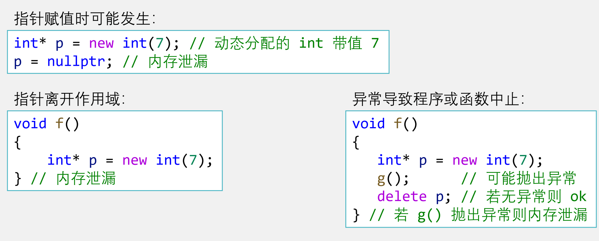

# new and delete

## 基本概念

new在堆区申请内存空间

delete删除由new申请的内存空间

> [!CAUTION]
>
> 用delete释放空间后， 
>
> 指针的值仍是原来指向的地址， 但指针已无效（重复释放将出错）


## 比较new/delete与malloc/free

### 返回值

new操作符内存分配成功时，返回的是对象类型的指针，类型严格与对象匹配，无须进行类型转换，故new是符合类型安全性的操作符。
malloc内存分配成功则是返回`void*` ，需要通过**强制类型转换**将`void*`指针转换成我们需要的类型。

所以在C++程序中使用new会比malloc安全可靠。

### 是否调用构造函数、析构函数

`malloc` 仅分配内存，但不调用构造函数，因此分配的内存内容是未初始化的。

`free` 只释放内存，不调用对象的析构函数。

`new` **分配内存**并同时**调用构造函数**，因此分配的内存是已初始化的。

`delete`会**调用析构函数**，并**释放内存**。

### 内存分配失败的处理方式

`malloc`  如果内存分配失败，则返回**`NULL`**

`new` 如果内存分配失败，则会抛出**异常**，而不是返回**`NULL`**


## 申请与释放的语法

### 单个变量

#### 申请

申请单个变量的空间，返回指向这个变量的指针

语法：`new type` 或 `new type(initial_value)`

比如：`int *p = new int;`

#### 释放

语法：`delete pointer`

比如：`delete p;`


### 数组

#### 申请

申请数组空间，返回指向这个数组首地址的指针

语法：`new type[length_of_array]{initialized_list}`

比如：

```cpp
int length;
cin>>length;
int *p = new int[length]{1,3,5};
```

#### 释放

语法：`delete []pointer`

比如：`delete []p;`

> [!WARNING]
>
> ***易错点：***
>
> 如果动态分配了一个数组， 但是却用`delete p`的方式释放， 没有用`delete []p`， 则**编译时没有问题， 运行时可能不会发生错误**， 但实际上会导致动态分配的数组**没有被完全释放**


### 指针的指针

#### 申请

```cpp
int** data;

data=new int*[m];//先创建 int* 类型的指针数组，让data指向它
for(int i=0;i<m;i++){
    data[i]=new int[n];//再创建 int 类型的数组，让data[i]指向它
}
```


#### 释放

```cpp
for(int i=0;i<m;i++){
    delete [] data[i];//先释放data[i]
}
delete []data;//再释放data
```


> [!CAUTION]
>
> 注意：使用`new`为**基本数据类型**分配内存时，
>
> `new int;` 不会初始化值； `new int();` 才会将值初始化为 `0`。
>  对于数组，`new int[10];` 不会初始化；需要使用 `new int[10]()` 才会全部初始化为0。
>
> 总结：对于基本数据类型，需要在后面加个`()`,才能初始化为0


## 内存泄漏

> **概念：**指 new 的空间失去了指针或引用永远无法释放。导致资源耗尽！  

#### 具体情况：




