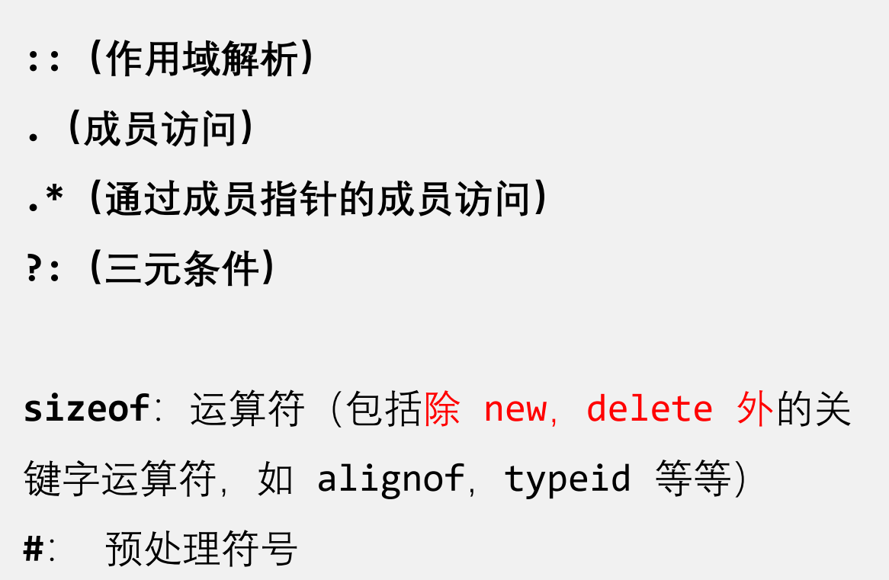

# 易错总结

## 运算符重载

### 不可以重载的运算符



### 其他限制：

- 不能创建新运算符，例如 ******、 **<>**、 **&|**
- 运算符 **&&** 与 **||** 的重载失去短路求值
- 重载的运算符 **->** 必须要么返回裸指针，要么（按引用或值）返回同样重载了运算符 **->** 的对象
- **不能更改**运算符的**优先级**、**结合方向(结合性)**或**操作数的数量**，可以改变**操作数的类型**


### 重载运算符的2种方式：

- 方法一：通过**成员函数**来重载运算符
- 方法二：通过**全局函数**来重载运算符

重载方式唯一的运算符

`=`、`[]`、`()`、`-＞`、**类型转换** 运算符的重载函数必须是**类成员函数**

`<<`、`>>`为了能够符合惯用的调用方式 `cout<<a`，所以要使用**友元函数**来重载。但其实也可以用类成员函数来重载，只是调用方式不符合习惯。


### 重载`++`

|          | 前置++                    | 后置++                                          |
| -------- | ------------------------- | ----------------------------------------------- |
| 语法     | `classname& operator++()` | `classname operator++(int)`   （int是占位参数） |
| 返回     | 引用                      | 值                                              |
| 函数实现 | 先递增，再返回`*this`     | 先暂存当前值为`temp`，再递增，最后返回`temp`    |

比如：

```cpp
Quaternary& operator++();
Quaternary operator++(int);
```


### 重载输入`>>`、输出`<<`

重载`>>`,`<<`的比较

|        | >> 用于输入  | << 用于输出                          | 异同点                                                       |
| ------ | ------------ | ------------------------------------ | ------------------------------------------------------------ |
| 返回值 | `istream&`   | `ostream&`                           | 同：都要返回 **输入流或输出流的引用**，因为输入流输出流只有1个 |
| 形参1  | `istream&`   | `ostream&`                           | 同：**输入流或输出流的引用** 作为第一个形参                  |
| 形参2  | `classname&` | `const classname&` 或者 `classname&` | 同：都是类名的引用。异：重载`>>`不能传入`const`，否则无法修改 |

示例：

```cpp
istream& operator>>(istream& cin,Quaternary& number)
{
    cin>>number.quat_num;
    return cin;
}

ostream& operator<<(ostream& cout,const Quaternary& number)
{
    cout<<number.quat_num;
    return cout;
}
```

### 重载`[]`

只能是**成员函数**重载

**非`const`** 版本:

返回**引用**，因为**可修改**

```cpp
// 重载 [] 运算符（非const 版本），返回元素的引用。
// 用于修改列表中的元素
int& operator [] (size_t i) {
    if (i >= data.size()) {
        throw out_of_range("Index out of range");//throw:用于抛出异常的关键字
    }
    return data[i];  // 返回元素引用
}
```

**`const`**版本：

返回**值**，因为**不可修改**，所以没必要返回引用

```cpp
// 重载 [] 运算符（const 版本），仅返回元素的值，不能修改该元素
int operator [] (size_t i) const {
    if (i >= data.size()) {
        throw out_of_range("Index out of range");
    }
    return data[i];  // 返回元素值
}
```


### 特殊要求

1. **`<<`**的重载最好是友元函数重载。若是成员函数重载，则导致位置反了（比如： `a<<cout`）

2. `[]`只能是成员函数重载

3. #### 需要返回引用的运算符重载

   - `>>`的重载: 返回 `istream&`
   - `<<`的重载: 返回 `ostream&`

   - 前置 `++`的重载: 返回 `*this`

   - `=`的重载: 返回`*this`
   - 所有带有 `=`的重载，包括: `+=`,`-=`,`*=`等 ：返回`*this`

## 指针的指针作为成员变量

例如：

```cpp
private:
    int m,n;
    int** data;//指针的指针
```


构造函数

```cpp
Matrix(int mm,int nn):m(mm),n(nn){
    data=new int*[m];		//先创建 int* 类型的指针数组，让data指向它
    for(int i=0;i<m;i++){
        data[i]=new int[n]; //再创建 int 类型的数组，让data[i]指向它
    }
}
```

析构函数

```cpp
~Matrix(){
    for(int i=0;i<m;i++){
        delete [] data[i];	//先释放data[i]
    }
    delete []data;			//再释放data
}

```


## 带有 默认参数 的函数

**函数声明**与**函数实现**只能有**一者**有默认参数


## 构造/析构函数的调用顺序

### 情况1：多个对象在同一作用域

```cpp
#include <iostream>
using namespace std;

class A {
    string name;
public:
    A(string name) {
        this->name = name;
        cout << "A(" << name << ")" << endl;
    }
    ~A() {
        cout << "~A(" << name << ")" << endl;
    }
};

int main() {
    A a1("a1"), a2("a2");
    return 0;
}
```


```bash
A(a1)
A(a2)
~A(a2)
~A(a1)
```

由于局部变量存储在**栈** ，根据栈 ***后进先出*** 的特点：**后生成的变量先销毁**


### 情况2：类对象作为成员变量

例如：类A是类B的成员变量

#### 构造顺序

那么创建类B的对象时，先调用类A的构造函数-->创建出一个类A的对象-->再调用类B的构造函数

**从内到外**

#### 析构顺序

而在删除类B的对象时，**先**调用类**B的析构函数**-->**再**调用类**A的析构函数**

**从外到内**


### 情况3：派生类中

#### 构造顺序

1. 首先调用其**基类的构造函数**（多重继承：调用顺序按照基类被继承时的声明顺序（从左向右））。
2. 然后调用**本类对象 *成员* 的构造函数**（调用顺序按照对象成员在类中的声明顺序）。
3. 最后调用**本类的构造函数**。

**从父到子**

```
//多重继承例子
#include<iostream>
using namespace std;

class X {
public:
 X() { cout << "X"; }
};
class Y {
public:
 Y() { cout << "Y"; }
};
class Z : public Y, public X {
public:
 Z() { cout << "Z"; }
};
int main() {
 Z z;
}
```

输出为：`YXZ`

#### 析构顺序

与构造函数的调用次序相反  

1. 首先调用**本类的析构函数**
2. 然后调用**本类对象成员的析构函数**
3. 最后调用其**基类的析构函数**

**从子到父**

```c++
#include<iostream>
#include<string>
using namespace std;

class Base
{
public:
    Base()
    {
        cout<<"Constructor of Base"<<endl;
    }
    ~Base()
    {
        cout<<"Deconstructor of Base"<<endl;
    }
};

class Son: public Base
{
public:
    Son()
    {
        cout<<"Constructor of Son"<<endl;
    }
    ~Son()
    {
        cout<<"Deconstructor of Son"<<endl;
    }
};

void test()
{
    Son s1;
}

int main()
{
    test();
    return 0;
}
```

运行结果

```cmd
Constructor of Base
Constructor of Son
Deconstructor of Son
Deconstructor of Base
```


## 深拷贝

### 1.深拷贝构造函数

```cpp
//深拷贝构造函数🌟
String(const String& s2){
    length=s2.length;
    data=new char[length];
    memcpy(data,s2.data,sizeof(char)*length);
}
```

### 2.深拷贝赋值

```cpp
//深拷贝赋值🌟
String& operator=(const String& s2)
{
    if (this!=&s2)
    {
        delete[] data;//先释放原来分配在堆区上的内存
        length=s2.length;
        data=new char[length];
  		memcpy(data,s2.data,sizeof(char)*length);
    }
    return *this;
}
```

### 析构函数也要改！

把堆区内存释放干净。

```cpp
~String(){
    delete[] data;
}
```

## 静态成员

1.静态成员变量：类内声明（有`static`），类外初始化（无`static`）

2.静态成员函数：

- 类内声明（有`static`），类外初始化（无`static`）
- 或者：类内定义（有`static`）

3.访问能力：

静态成员函数 只可以访问静态成员变量，**不可以**访问**非静态成员变量**

但是!

**非静态成员函数** 既可以访问**静态成员变量**，又可以访问**非静态成员变量**

## 常量成员

1.常变量

常非静态成员 必须由**默认初始化器**或**初始化器列表**初始化  

2.常函数

- 常函数内**不可以**修改成员属性（成员变量）

- 如果成员属性在声明时加**关键字mutable修饰**后，在常函数中仍**可以修改**

#### **语法**：

`返回值类型 函数名( ) const` 修饰常函数的`const`放在**最后面**！

加在最前面的`const`是修饰 **返回值** 的（比如`const返回值类型 函数名( ) `）

3.常对象

- 常对象只可以修改 加**关键字mutable修饰**的成员属性；不可以修改普通成员属性。
- **常对象只能调用常函数**；不能调用普通成员函数，因为普通成员函数可以修改普通成员属性。

#### 语法：

`const 类名 对象名`


## 抽象类

定义：包含**至少一个纯虚函数**的类，叫作“***抽象类***”

## 接口

只有纯虚函数，可以有静态数据成员，不能有非静态数据成员

### 抽象类vs接口

|            | 抽象类                                        | 接口                                         |
| ---------- | --------------------------------------------- | -------------------------------------------- |
| 函数类型   | **至少包含1个纯虚函数**，可以包含普通成员函数 | **只有纯虚函数**                             |
| 成员类型   | 都可以有                                      | 除了静态数据成员外，**不包含非静态数据成员** |
| 可否被继承 | 可以                                          | 可以                                         |


## 模板

### 函数调用的静态绑定规则（重载协议）

——如何确定调用哪个函数？

**Step1:** 如果某一**同名非模板函数**(指正常的函数)的形参类型正好与函数调用的实参类型匹配(完全一致)，则调用该函数。否则，进入第2步

**Step2:** 如果能从**同名的函数模板**实例化一个函数实例，而该函数实例的形参类型正好与函数调用的**实参类型匹配(完全一致)**，则调用该函数模板的实例函数。否则，进入第3步

- 在Step2中：***首先*** 匹配**函数模板的特化**，***再***匹配非指定特殊的函数模板（**通用模板**）

**Step3:**  对函数调用的实参进行**隐式类型转换**后与**非模板函数**再次进行匹配，若能找到匹配的函数则调用该函数。否则，进入第4步

**Step4:** 提示**编译错误**

# 易错题

## `fixed`

以下代码的输出结果是什么？

```cpp
cout << fixed << 3.14159 << endl;
```

A.3.14159

B.3.14

C.3.141590

D.314159e+00


答案：C

> [!CAUTION]
>
> `fixed` 一旦设置，就强制以小数形式显示数字，并且 **默认保留小数点后 6 位**，除非用 `setprecision` 显式更改。


## 特别的输出

**下述语句的输出是：**

```cpp
cout << 1 + "20.24" << endl << 20.24;
```

A.120.2420.24

B.1\n20.24

C.120.24\n20.24

D.0.24\n20.24


答案：D

> [!CAUTION]
>
> 关键理解点：
>
> 1. `"20.24"` 是一个**字符串字面值**，类型是 `const char`（指向字符串第一个字符的指针）
>
> 2. `1 + "20.24"` 表示：
>
> - 把 `"20.24"` 这个字符串常量的指针加上 1，即**跳过第一个字符** `'2'`。
> - 所以 `1 + "20.24"` 相当于指向字符串 `"0.24"`（跳过了 `'2'`）
>
> 3. `cout << 1 + "20.24"` 的效果：
>
> - 等价于 `cout << "0.24"`，所以输出是 `0.24`
>
> 4. `endl` 输出一个换行符（`\n`）
> 4.  `cout << 20.24` 直接输出数字 `20.24`


**下面代码在输入2以后，输出为？**

```cpp
#include<iostream>
using namespace std; 
int main(){
	int cout;
	cin>>cout;
	std::cout<<(cout<<cout);
}
```

A.编译错误

B.2

C.4

D.8


答案：D

> [!CAUTION]
>
> 解释：
>
> 输出2之后，int cout=2
>
> 在`std::cout<<(cout<<cout);`这一句处：
>
> - 第一个`cout`是`std::cout`，即标准输出
> - 第二个和第三个`cout`没有使用作用域标识符`::`，所以默认是本作用域内的，所以值都是2
>
> 综上，`std::cout<<(cout<<cout);`这一句等价于`std::cout<<(2<<2);`
>
> 所以最后就是`std::cout<<8;`
>
> 所以输出8


## `string`库

**当find()方法找不到子串时返回：**

A.`None`

B.0

C.`string::npos`

D.`false`


答案：C

记


**哪个选项可以正确追加字符？**

A.

```
s.append('a');
```

B.

```
s += 'a';
```

C.

```
s.push_back("a");
```

D.

```
s.append("a", 0);
```


答案：B

> [!CAUTION]
>
> A.`append()` 期望的是一个 `const char*` 或 `std::string`，不是一个单个字符（`char`）,所以会报错
>
> B. `std::string` 支持用 `+=` 操作符来追加一个字符（`char` 类型）
>
> C. `push_back()` 期望的是一个 **`char`**，但 `"a"` 是一个字符串字面值（`const char*`）,所以会报错
>
> D. **`s.append("a", 0);`**
>
> -  **正确语法**，但 **不追加任何字符**
> - `"a"` 是字符串字面值，`0` 是要追加的字符数
> - 实际效果：`s` 没有改变，因为追加了 0 个字符


## `bool`变量

**将整数-5赋值给bool变量时：**

A.编译报错

B.转换为false

C.转换为true

D.需要显式类型转换


答案：C

> [!CAUTION]
>
> 编译器**不会报错**！
>
> 非零整数（无论正负）—> 转换为`true`
>
> 0 —> 转换为`false`


## `const`与`constexpr`

**在C++中，以下哪个关键字用于声明一个编译时常量？**

A. `const`

B. `static`

C. `constexpr`

D. `final`


答案：C

> [!CAUTION]
>
> `const` 运行时常量，强调**只读**
>
> `constexpr` **编译**时常量，强调**常量**
>
> 
>
> 例如：
>
> ### `const` 示例（运行期常量）：
>
> ```cpp
> const int x = getValue();  // getValue() 可是运行期函数
> int arr[x];                // 可能合法，取决于上下文和编译器
> ```
>
> ### `constexpr` 示例（编译期常量）：
>
> ```cpp
> constexpr int y = 10;
> int arr[y];  // 一定合法，因为 y 是编译时常量
> ```
>
> ------
>
> ##  `constexpr` 函数：
>
> 这个函数在编译器执行
>
> ```cpp
> constexpr int square(int x) {
>     return x * x;
> }
> 
> int arr[square(3)];  // 合法，square(3) 编译期可求值
> ```


## `auto`

**下列哪个选项是`auto`关键字的正确用法？**

A.

```
auto x;
```

B.

```
auto y = 3.14;
```

C.

```
auto z = "hello", w = 42;
```

D.

```
auto static arr = new int[5];
```


答案：B

> [!CAUTION]
>
> A. `auto` **必须要有初始化表达式**，编译器才能根据右侧的值推导出类型
>
> C. 定义在一个auto序列的变量必须始终推导成同一类型。但是这里的 `"hello"`和`42`是不同类型，所以编译错误
>
> D. 正确的关键字顺序应该是 `static auto arr = ...;`，不能写成 `auto static`


## class定义后面要有分号

下列C++代码的输出是什么

```cpp
#include <iostream>
using namespace std;
class TEST {
    int a, b, c; 
}
int main() {
    TEST test;
    cout << "In main()\n";
    return 0;
}
```


答案：编译错误！

原因：

```cpp
class TEST {
    int a, b, c; 
}  // ❌ 缺少分号
```


## new

关于使用new运算符动态分配内存，以下说法正确的是哪一项？

A. new运算符返回的始终是void*类型的指针，需要手动转换为目标类型指针

B. 如果new无法分配足够的内存空间，它会返回NULL

C. 使用new为基本数据类型分配内存时，所有元素会自动初始化为零

D. new运算符会返回该类型的指针，并且会为动态分配的对象调用构造函数


答案：D

> [!CAUTION]
>
> 易错：C
>
> 不会初始化为0


## 访问已经`delete`的内存

以下代码片段执行后的正确输出是什么？

```
int main() {

    int* ptr = new int(10);

    cout << "Before delete, ptr points to: " << *ptr << endl;

    delete ptr; 

    cout << "After delete, ptr points to: " << *ptr << endl;

    return 0;

}

```


A. Before delete, `ptr` points to: 10
After delete, ptr points to: 10

B. Before delete, `ptr` points to: 10
After delete, ptr points to: 0

C. Before delete, `ptr` points to: 10
After delete, `ptr` points to: garbage value

D. 程序将抛出异常并崩溃


答案：C

> [!CAUTION]
>
> 易错：D
>
> 访问被 `delete` 释放的内存，是**未定义行为（Undefined Behavior, UB）**。
>
> **"未定义行为" 并不意味着一定会崩溃或抛异常**。


## 初始化顺序不对

以下代码的正确输出是什么？

```cpp
class Example {

public:
    int a;
    int b;
    Example(int val) : b(val), a(b + 1) {cout << "a: " << a << ", b: " << b << endl;}

};

int main() {
    Example ex(5);
    return 0;
}
```

A.a: 6, b: 5

B.a: 5, b: 5

C.a: 未定义, b: 5

D.编译错误


答案：C


## 缺少无参构造函数

下列C++代码的输出是什么

```cpp
#include <iostream>
using namespace std;
class A{
private:
    int a, b, c; 
public:
    A(int a, int b, int c) {
        this->a = a;
        this->b = b;
        this->c = c;
        cout << "A" << endl;
    }
    ~A() {
        cout << "~A" << endl;
    }
};
int main() {
    A test;
    return 0;
}

```

A. A ~A

B. A

C. ~A

D.编译错误


答案：D

> [!CAUTION]
>
> 没有无参构造函数，所以编译错误


## 构造函数为私有

下列C++代码的输出是什么

```cpp
#include <iostream>
using namespace std;
class A{
    int a, b, c; 
    A() {
        cout << "A1" << endl;
    }
    A(int a, int b, int c) {
        this->a = a;
        this->b = b;
        this->c = c;
        cout << "A2" << endl;
    }
    ~A() {
        cout << "~A" << endl;
    }
};
int main() {
    A test;
    return 0;
}
```

A. A1 ~A

B. A2 ~A

C.  A1 A2 ~A

D.编译错误


答案：D

> [!CAUTION]
>
> class A里面没有写`public`关键字，说明，所有都默认是`private`，包括构造函数也是`private`，
>
> 所以无法初始化，报错！


## 内存布局

关于C++程序内存布局，以下说法正确的是？


A.类的非静态成员变量存放在全局数据区


B.虚函数指针存放在代码区


C.new创建的类实例在堆区，引用保存在栈区

D.类的成员函数存放在堆区


答案：C

> [!CAUTION]
>
> 解释：
>
> A：非静态成员变量放在对象所在的位置，可能是栈、堆或全局区，但它**本身不单独存在于全局数据区**
>
> B：虚函数指针（vptr）是每个对象的隐式成员，**存放在对象内存中**（栈或堆），不是代码区。
>
> D：类的成员函数（代码）存放在**代码区**

> [!IMPORTANT]
>
> 补充：
>
> **静态成员变量**放在**全局数据区**
>
> 静态成员函数放在全局数据区
>
> **非静态成员函数**放在**全局数据区**


## `const`成员函数

**关于`const`成员函数，以下说法错误的是？**

A.不能修改类的非静态成员变量

B.可以调用其他`const`成员函数

C.`this`指针类型为`const T* const`

D.非`const`对象不能调用`const`成员函数


答案：D

> [!CAUTION]
>
> 非`const`对象可以调用`const`成员函数
>
> 但是`const`对象只能调用`const`成员函数


**判断以下说法是否正确？**

该代码会出现错误，因为在该类的const成员函数中修改了该类对象的值。

```cpp
class Test {
public:
    int x;
    Test() {
        this->x = 1;
    }

    void change(Test& t) const {
        t.x = 0;
    }

};

int main() {
    Test t1;
    Test t2;
    t1.change(t2);
    return 0;
}
```


答案：错

> [!CAUTION]
>
> const成员函数里**不能修改对象自身**，
>
> 但是可以**修改外部传入的参数**。
>
> 所以，不会报错


## const 引用

**关于const引用的使用，下列说法错误的是：**

A.通过const引用传参可以避免不必要的对象复制，从而提高程序效率。

B.`const`引用作为函数参数可接受右值

C.`const`引用可以修改被引用对象

D.`const`应用作为返回值是返回临时对象的别名


答案：C（显然）

> [!CAUTION]
>
> B. `const`引用作为函数参数可接受右值
>
> 比如：
>
> ```cpp
> void f(const std::string& s);  
> f("hello");  // 字符串字面量是右值，可绑定到 const 引用
> ```


**下面说法是否正确？**

从自身可修改性、对数据的访问权限等角度考虑`a`的特性，`const int& a = b` 相当于 `const int* const a = &b`

A.正确

B.错误


答案：A

> [!CAUTION]
>
> `int& a = b`相当于`int* const a = &b`；
>
> `const int& a = b`相当于`const int* const a = &b`


## 对象作为函数返回值

**对象作为函数返回值时，现代编译器可能如何优化？**

A.禁止使用拷贝构造函数

B.直接在调用处构造对象，避免临时对象

C.强制使用深拷贝

D.将返回值存放在全局区


答案：B

记！否则用排除法


## 返回的不是引用，而是值

见下方代码：

```c++
class Person{
public:
    int age;

    Person (int a): age(a){}

    Person addAge(Person &p)
    {
        this->age+=p.age;
        return *this;//返回值为对象的一个拷贝
    }
};

int main()
{
    Person p1(10),p2(1);

    p2.addAge(p1).addAge(p1).addAge(p1);

    cout<<p2.age<<endl;
    return 0;
}
```

运行结果：

```cmd
11
```

解释：

`p2.addAge(p1).addAge(p1).addAge(p1);`

第1次调用`addAge(p1)`，`p2.age`变成11，返回`p2`的拷贝`p2'`

第2次调用`addAge(p1)`，本质是`p2'`调用`addAge(p1)`，`p2'.age`变成21，返回`p2'`的拷贝`p2''`

第3次调用`addAge(p1)`，本质是 `p2''`调用`addAge(p1)`，`p2''.age`变成31，返回`p2''`的拷贝`p2'''`

所以，实际上`p2.age`只在第1次调用`addAge(p1)`时被修改成11


## `explicit`关键字

下列描述关键词`explicit`最正确的是（）

A.允许隐式转换

B.提高代码的效率

C.减少代码的复杂性

D.禁止隐式转换


答案：D

记！


## 函数对象

使用函数对象的优点（）

A.可以很好的与STL算法结合

B.函数对象比函数指针快一点，有更高的运行效率

C.函数对象会支持状态

D.以上都是


答案：D

> [!CAUTION]
>
> A.STL 中很多算法（如 `std::sort`, `std::find_if`, `std::for_each` 等）都支持使用函数对象作为谓词或操作器
>
> B. 函数对象在调用时通常**可以被内联**，函数指针则不行。内联意味着**消除函数调用开销**，**提高性能**，尤其在模板中使用函数对象时优势明显。
>
> C. 函数对象是类的对象，它可以**保存状态**（成员变量）。例如可以记录调用次数、配置参数等，而函数指针不能做到。


## 运算符重载

下列关于类型转换运算符重载的声明中，正确的是（ ）。

A.

```
operator int() const;
```

B.

```
int operator() const;
```

C.

```
const operator int();
```

D.

```
operator int(const);
```


答案：A

> [!CAUTION]
>
> 类型转换运算符重载**不需要写返回值类型**，因为它的返回值类型就是被转换成的类型。


## 继承关系中的访问权限问题

**以下代码能否编译？**

```cpp
class Base {
protected:
    Base() {}
};
class Derived : public Base {
public:
    Derived() {}
};
int main() {
    Derived d;
    Base b;
}

```

A.能

B.不能


答案：B

> [!CAUTION]
>
> `Base`的构造函数是`protected`，不能被外部访问，只能被友元函数或派生类访问
>
> 在`main`函数中：
>
> `Derived d;`可以正常调用`Base`的构造函数，然后调用自己的构造函数，完成初始化；
>
> `Base b;`无法调用自己的构造函数（因为在外部），所以不能编译。因此，基类无法直接对象实例化。


**以下代码能否通过编译？**

```cpp
class Base {
private:
    int x;
protected:
    int y;
};
class Derived : public Base {
public:
    void func(Base& b) { 
        b.y = 5;   // ①
        y = 10;    // ②
    }
};
```

A.① 和 ② 均可编译

B.仅 ① 编译错误

C.仅 ② 编译错误

D.① 和 ② 均编译错误


答案：B

> [!CAUTION]
>
> 由于使用`public`方式继承，所以在派生类的成员函数中，可以访问基类的 `protected`权限的变量`y`,所以②正确
>
> 但是注意：
>
> **不能**访问**外部传入**的同类型参数的`y`
>
> 只能访问自己内部的`y`


## 继承关系中的构造与析构

**以下代码的输出是？**

```cpp
class A {
public:
    A() { cout << "A"; }
    A(const A&) { cout << "A_copy"; }
};
class B : public A {
public:
    B() { cout << "B"; }
};
int main() {
    B b1;
    B b2(b1);
}

```

A. `ABAB_copy`

B. `ABA_copy`

C. `ABB_copy`

D. `AB`


答案：B

> [!CAUTION]
>
> 在`main`函数中：
>
> `B b1;`是B的默认构造。在程序中，没有指定B的默认构造会调用A的哪个构造函数，所以默认会调用A的拷贝构造。
>
> 所以先调用A的默认构造，再调用B的默认构造
>
>  `B b2(b1);`是B的拷贝构造。由于程序中没有定义B的拷贝构造，所以编译器会自动生成一个，它默认会调用A的拷贝构造。
>
> 所以先调用A的拷贝构造，再调用B的拷贝构造


**以下代码的输出是？**

```cpp
class A {
public:
    A() { cout << "A"; }
    ~A() { cout << "~A"; }
};
class B : public A {
public:
    B() { cout << "B"; }
    ~B() { cout << "~B"; }
};
int main() {
    A* p = new B();
    delete p;
}
```

A. `AB~A`

B. `AB~B~A`

C. `A~A`

D.编译错误


答案：A

> [!CAUTION]
>
> 1.`new B()` 构造一个 `B` 对象：
>
> - 调用 `A()` → 输出 `A`
> - 然后调用 `B()` → 输出 `B`
>
> 2.`delete p`：
>
> 因为 `A` 的析构函数 **不是虚函数**！所以调用的是 `A` 的析构函数，而不是 `B` 的析构函数


## 类型转换

 不定项选择题

**以下哪种转换可能导致未定义行为？**

A.

```
int a = 10;
const int& x = a;
int& y = const_cast<int&>(x);
```

B. Derived继承自Base。有Base* base_ptr
`dynamic_cast<Derived*>(base_ptr)`

C.

```
reinterpret_cast<int*>(0x1234)
```

D.

```
static_cast<int>(3.14)
```


答案：B

> [!CAUTION]
>
> A. `const_cast`用于移除 `x` 的 const 属性，得到非const引用 `y`。正确。
>
> B. 如果 `Base` 类**不是多态**类型（**即没有虚函数**），使用 `dynamic_cast` 进行向下转换（downcast）会导致**未定义行为**
>
> C. **转换操作本身不会直接导致未定义行为**；它仅产生一个指针值。然而，如果 `0x1234` 不代表有效的内存地址（例如，未对齐或不可访问），**解引用或使用该指针时可能导致 UB**。
>
> D. 此转换将 `double` 值 `3.14` 转换为 `int`。浮点到整数的转换是定义良好的：值会被截断（`3.14` 变为 `3`），且 `3.14` 在 `int` 范围内。因此，此转换不会导致未定义行为。


## 多态

以下代码中，哪个选项正确描述运行时行为？

```cpp
class Base {
public:
    virtual void func() { std::cout << "Base"; }
};
class Derived : public Base {
public:
    void func() override { std::cout << "Derived"; }
};
Derived d;
Base b = d;
b.func();
```

A.输出“Derived”

B.输出“Base”

C.编译错误

D.运行时崩溃


答案：B

> [!CAUTION]
>
> ```cpp
> Derived d;
> Base b = d;
> ```
>
> 这里定义的`d`是派生类对象，而不是指针
>
> `b`也不是指针，而是基类对象。
>
> 因此，`b = d`会执行赋值操作。对派生类对象进行切片（object slicing），把`Base` 部分的信息赋值给`b`
>
> 
>
> `b.func();`虽然`func()` 是虚函数，但由于 **对象类型是 Base**，所以调用的是 `Base::func()`
>
> ⚠️ 虚函数机制（多态）只有在通过**指针或引用调用时**才会保留派生类行为。


## 多态中的析构函数

以下哪种情况会导致内存泄漏？

```
class Base {
public:
    virtual void func() = 0;
    // 析构函数定义见选项
};

class Derived : public Base {
private:
    int* data;
public:
    Derived() { data = new int[10]; }
    ~Derived() { delete[] data; }
    void func() override {}
};


```

A. `Base::~Base() { }`（非虚析构函数）

B. `virtual Base::~Base() { }`（虚析构函数）

C. `protected: ~Base() { }`（受保护非虚析构函数）

D. `virtual Base::~Base() = default;`（默认虚析构函数）


答案：A

> [!CAUTION]
>
> **A. `Base::~Base() { }`（非虚析构函数）**
> ✅ 会导致内存泄漏
> 原因：基类析构函数非虚。当使用 `Base* ptr = new Derived(); delete ptr;` 时：
>
> 1. 仅调用 `Base` 的析构函数（非虚）
> 2. **不会调用 `Derived::~Derived()`**
> 3. `Derived::data` 分配的内存无法释放 → **内存泄漏**
>
> 
>
> **B. `virtual Base::~Base() { }`（虚析构函数）**
> ❌ 不会泄漏
> 原因：虚析构函数确保多态销毁。执行 `delete ptr` 时：
>
> 1. 调用虚析构函数
> 2. 先执行 `Derived::~Derived()`（释放 `data`）
> 3. 再执行 `Base::~Base()`
>
> 
>
> **C. `protected: ~Base() { }`（受保护非虚析构函数）**
> ❌ ​**​直接阻止了内存泄漏的可能性​**​
> 原因：
>
> - 析构函数为 `protected` 且非虚
> - **无法直接通过基类指针删除对象**（`delete ptr` 编译失败）
> - **只能通过 `Derived` 指针删除对象**（调用完整析构链）
> - **强制安全用法，无泄漏风险**
>
> **D. `virtual Base::~Base() = default;`（默认虚析构函数）**
> ❌ 不会泄漏
> 原因：与选项 B 等效。虚析构函数保证调用 `Derived` 的析构函数释放内存。


## 优先队列

下列程序的输出是？

```c++
#include <iostream>
#include <queue>
#include <vector>

int main() {
    std::priority_queue<int> pq;
    pq.push(10);
    pq.push(30);
    pq.push(20);
    pq.push(5);
    std::cout << pq.top() << std::endl;
    pq.pop();
    std::cout << pq.top() << std::endl;
    return 0;
}
```

A.5 10

B.10 20

C.30 20

D.30 10


答案：C

> [!CAUTION]
>
> `priority_queue` 默认使用**最大堆（从大到小）**


## 异常处理

若一个类的构造函数在成功构造了其部分成员对象后，因某个操作（如动态内存分配）失败而抛出异常，以下哪项描述是正确的？

A. 该类的析构函数会被调用，以确保所有资源都被释放

B. 已完全构造的成员对象的析构函数和该类的析构函数都不会被调用

C. 已完全构造的成员对象的析构函数会被调用，但该类的析构函数不会

D. 所有在这个构造函数中分配的动态内存都会被C++运行时系统自动回收


答案：C


**以下程序的输出是什么？**

```cpp
#include <iostream>
#include <stdexcept>
using namespace std;

class DerivedException : public runtime_error {
public:
    DerivedException() : runtime_error("派生类异常") {}
    const char* what() const noexcept override {
        return "我是派生类!";
    }
};

int main() {
    try {
        throw DerivedException();
    } catch (runtime_error e) {
        cout << e.what() << endl;
    }
    return 0;
}

```

A.派生类异常

B.我是派生类!

C.编译错误

D.程序未捕获异常而终止


答案：A

> [!CAUTION]
>
> 解释：
>
> `DerivedException`继承自`runtime_error`
>
> ```cpp
> catch (runtime_error e) {
>         cout << e.what() << endl;
>     }
> ```
>
> 这里传入的参数类型是`runtime_error`所以会进行切片，
>
> 所以`DerivedException`另外定义的：
>
> ```
> const char* what() const noexcept override {
>         return "我是派生类!";
>     }
> ```
>
> 会被切掉。
>
> 因此输出的是 “派生类异常”
>
> 只有用**引用**或**指针**捕获才能保持**多态**


**以下程序的输出是？**

```cpp
#include <iostream>
#include <exception>
using namespace std;

class MyError : public exception {
public:
    const char* what() const noexcept override {
        return "E1";
    }
};

int main() {
    try {
        throw MyError();
    } catch (const exception& e) {
        cout << e.what();
    }
    return 0;
}

```

A. E1

B. 编译错误

C. 程序未捕获异常而终止

D. 无输出


答案：A

> [!CAUTION]
>
> `MyError`继承自`exception`
>
> ```cpp
> catch (const exception& e) {
>         cout << e.what();
>     }
> ```
>
> 这里传入的参数类型是`const exception&`，是引用！
>
> 所以会使用多态
>
> 所以`e.what()`会调用以下函数
>
> ```cpp
> const char* what() const noexcept override {
>         return "E1";
>     }
> ```
>
> 所以输出“E1”

