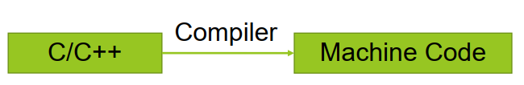
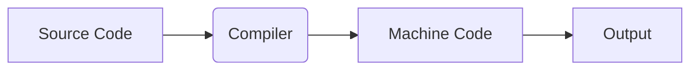
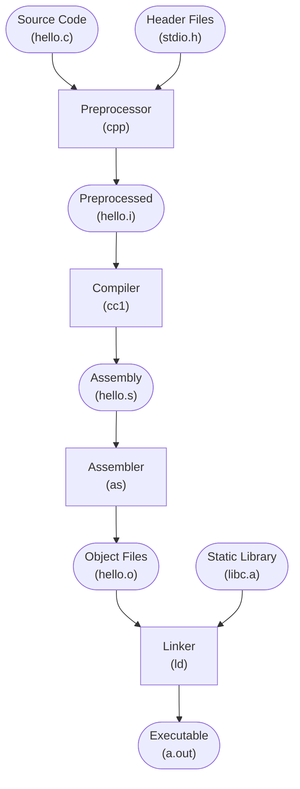
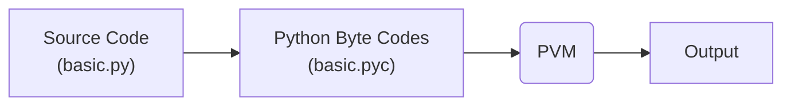
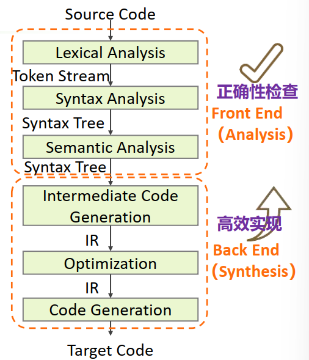
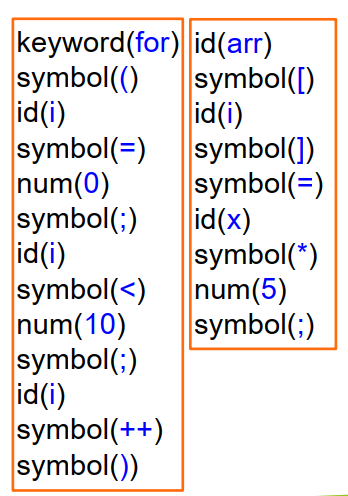
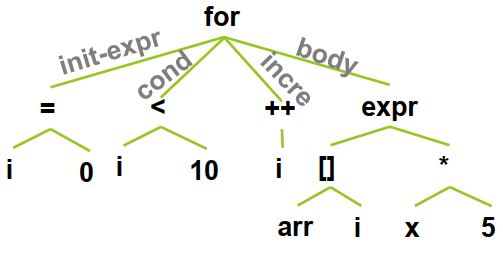
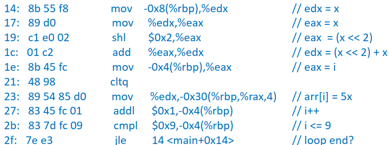
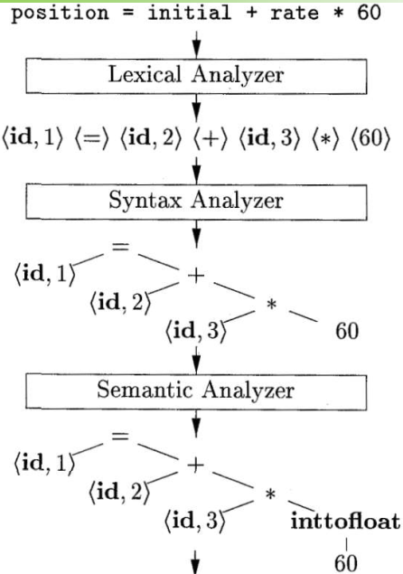
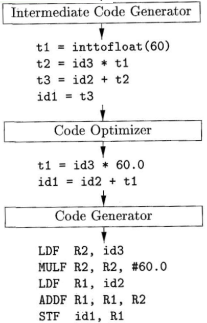

# Chapter 1: Overview

[TOC]

## What is compilation?

不同语言有不同的编译方式

- "底层"语言通常使用**编译**，如：C, C++
- "高级"语言通常使用**解释**，如：Python, Ruby
- 有些语言采用**混合**的方式，如：Java 使用编译+即时编译(JIT, Just-In-Time)




### 编译

> **编译**：
>
> 源程序翻译成机器语言，才能运行

特点：

- 目标程序独立于源程序
- 分析程序上下文，易于整体优化
- 性能更好 （因此，核心代码通常采用C/C++）



分类：

- **即时编译 (Just-In-Time Compiler, JIT)**: 在运行时执行程序编译操作，把翻译过的机器代码保存起来，以备下次使用
- **传统编译(Ahead-Of-Time, AOT)**: 先编译后运行

JIT vs AOT

1. JIT具备解释器的灵活性。
   - 只要有JIT编译器，代码即可运行
   - 动态优化
2. JIT性能上基本和AOT等同
   - JIT的运行时编译操作 带来一些性能上的损失
   - 但可以利用程序运行特征进行动态优化

#### Example: C 语言编译

C 语言编译包括以下4个阶段：

| 阶段序号 | 阶段名称 | Input file | Output file        | 核心操作                   | 对应命令                      |
| -------- | -------- | ---------- | ------------------ | -------------------------- | ----------------------------- |
| 1        | 预处理   | hello.c    | hello.i            | 展开宏，包含头文件         | `clang -E hello.c -o hello.i` |
| 2        | 编译     | hello.i    | hello.s            | 生成汇编代码               | `clang -S hello.i -o hello.s` |
| 3        | 汇编     | hello.s    | hello.o            | 生成机器指令（目标文件）   | `clang -c hello.s -o hello.o` |
| 4        | 链接     | hello.o    | hello (可执行文件) | 链接库文件，生成可执行文件 | `clang hello.o -o hello`      |

总的来说，C 语言编译将 **源程序(hello.c) $\rightarrow$​ 可执行文件(hello)**，对应的命令 `clang hello.c -o hello`




### 解释

> **解释**：
>
> 源程序作为输入，边解释边执行

特点：

- 不生成目标程序，可迁移性高
- 逐句执行，不易优化
- 性能通常不太好



## 编译过程

### 整体架构



#### 前端

主要功能：**分析**，即：对源程序分析，识别语法结构信息，理解语义结果，反馈出错信息

由3部分构成：

1. 词法分析 (Lexical Analysis)
2. 语法分析 (Syntax Analysis)
3. 语义分析 (Semantic Analysis)

#### 后端

主要功能：**综合**，即：综合分析结果，生成语义上等价于源程序的目标程序

由3部分构成：

1. 中间代码生成 (Intermediate Code Generation)：转换成中间表示(Intermediate Representation, IR)
2. 代码优化 (Code Optimization)
3. 目标代码生成 (Code Generation)


### 各部分简介

下面逐个介绍整体架构中的每个部分。

以红色框内的代码为例，


#### (1) 词法分析 (Lexical Analysis)

作用：扫描源程序字符流，识别并分解出由此法意义的单词或符号（token）

Input：源程序

Output：token序列

>**token**
>
>表示方式：`<类别, 属性值>`
>
>类别有：保留字、标示符、常量、运算符……

检查：token是否符合**词法规则**

例如：

```cpp
#include<iostream>

void main() {
  int 1a; //<- 1a 不符合cpp变量定义的形式（因为`1a`以数字1开头） 
}
```


对以上例子进行词法分析得：



#### (2) 语法分析 (Syntax Analysis)

作用：解析源程序对应的token序列，生成语法分析结构（语法分析树，Syntax tree）

Input：单词流(token序列)

Output：语法树

检查：输入程序是否符合**语法规则**

例如：

- else没有匹配的if
- 表达式缺少分号结尾  

对以上例子进行语法分析得：



#### (3) 语义分析 (Semantic Analysis)

作用：基于语法结果进一步分析语义，收集标识符的属性信息（type, scope等）

Input：语法树

Output：语法树+符号表

检查：输入程序是否符合**语义规则**

例如：

- 数组下标越界
- 声明和使用的函数未定义
- 重复声明
- 零作为除数

#### (4) 中间代码生成 (Intermediate Code Generation)

作用：生成等价于源程序的中间表示（Intermediate Representation, IR）

Input：语法树

Output：IR

生成IR的好处：建立源和目标语言的桥梁，易于翻译过程的实现， 利于实现某些优化算法  

IR的形式：通常为三地址码（TAC）


对以上例子进行中间代码生成得：

```
i := 0
loop:
	t1 := x*5
	t2 := &arr
	t3 := sizeof(int)
	t4 := t3*i
	t5 := t2 + t4
	*t5 := t1
	i := i + 1
	if i<10 goto loop
```


#### (5) 代码优化 (Code Optimization)

作用：加工变换中间代码使其**更好**（如: 代码更短、性能更高、内存使用更少）  

Input：IR

Output：优化后的IR

例如：

- 识别重复运算并删除；
- 循环不变代码外提；
- 强度削弱；
- 运算操作替换；
- 使用已知量
- ……  

> [!CAUTION]
>
> 这里的代码优化是**机器无关**的

对以上例子进行代码优化得：

```
t1 := x*5
t2 := &arr
t3 := sizeof(int)
i := 0
loop:
	t4 := t3*i
	t5 := t2 + t4
	*t5 := t1
	i := i + 1
	if i<10 goto loop
```


#### (6) 目标代码生成 (Code Generation)

作用：为特定机器产生目标代码（ e.g. 汇编）

Input：(优化后的) IR

Output：目标代码

主要职责：

- 寄存器分配：放置频繁访问的数据
- 指令选取：确定机器指令来实现IR操作
- 进一步做与**机器有关**的优化，例如：寄存器及访存优化

对以上例子进行目标代码生成得：



### 总结：完整的编译过程



