# Chapter 2: Grammer 文法

> **重点**：
>
> 1. [推导、归约](#推导-and-归约)
> 2. [文法定义的语言，给出文法，求描述了什么语言](#文法定义的语言)
> 3. [文法是否等价，如何判断](#语言相同=>文法等价)
> 4. [判断文法有无二义性](#文法的二义性(Ambiguity))
> 5. [4种文法类型及其特点](#文法类型)
> 6. [给出文法和一个句型，画语法树，找短语、直接短语（简单短语）、句柄](#找出短语、直接短语、句柄)

[TOC]


## 直观概念

### 语言

**程序设计语言** 包括：

- 语法（Syntax）

- 语义（Semantics）

> **语法**：一组规则，可以形成和产生一个合适的程序

> **语义**：定义程序的意义

语义：

- 静态语义：程序在语义上要遵守的规则
  - 数组下标越界
  - 声明和使用的函数未定义
  - 零作为除数
  - ......
- 动态语义：表明程序要做什么

### 文法（Grammer）

定义：是语言语法的描述工具，实现用**有穷的规则**把语言的**无穷句子集**描述出来

严格定义句子的结构， 是判断句子结构合法与否的依据


## 符号与符号串

### 字母表（Alphabet）

> **字母表（Alphabet）/符号集**
>
> 字母表是元素的非空有穷集合
>
> 别称：元素又称符号，字母表又称符号集

例子：$A=\{a,b,c\}, \Sigma = \{0,1 \}$

程序语言的字母表：由**字母、数字、和若干专用符号**组成


### 符号串（String）

> **符号串（String）**：
>
> 符号串是由字母表中的符号组成的任何有穷序列

例如：

a, ab, aaaca 是字母表$A=\{a,b,c\}$上的符号串

0, 00, 10, 011 是字母表 $\Sigma = \{0,1 \}$ 上的符号串

#### 特别的符号串

- **空串**：不含任何符号的符号串。用 $\varepsilon$ 表示

> [!CAUTION]
>
>  $\{\varepsilon\}$ 并不等于空集合 $\empty$

#### 符号串长度

> **符号串长度**：符号串中含有符号的个数

例如：

- $|abc|=3$
- $|\varepsilon|=0$

#### 符号串的头、尾、固有头、固有尾

> 头、尾**↔** 前缀、后缀
>
> 固有头、固有尾**↔** 真前缀、真后缀（不包含整个符号串）

例如：z=abc

- z的头：$\varepsilon$, a, ab, abc。除了abc之外，其他都是固有头。

- z的尾：$\varepsilon$, c, bc, abc。除了abc之外，其他都是固有尾。

#### 符号串的运算

- 连接
- 方幂

##### 符号串的连接

> 将两个符号串按顺序拼接在一起

例如：

- x="ST", y="abu", 则xy=“STabu”
- $\varepsilon x = x \varepsilon =x$

##### 符号串的方幂

> 幂次就是符号串的重复次数

例如：

- $a^0=\varepsilon, a^1 = a, a^2 = aa$
- 若$x=AB$, 则$x^0=\varepsilon,x^1=AB,x^2=ABAB$


### 符号串集合

> **符号串集合**：
>
> 若集合A中所有元素都是某字母表$\Sigma$上的符号串，则称A为字母表$\Sigma$上的符号串集合

#### 符号串的运算

- 符号串集合的乘积

- 符号串集合的方幂

##### 符号串集合的乘积

> 符号串集合A和B的乘积，是$AB = \{xy| x \in A \and y \in B\}$
>
> 其实就是笛卡尔积

例如：

若集合A={ab,cde}, B={0,1}

则 AB={ab0, ab1, cde0, cde1}

##### 符号串集合的方幂

> $A^0 = \{\varepsilon\}, A^1 = A, A^2 = AA, A^3=AAA$

例如：

若集合A={a, b} 则
$$
A^0=\{ \varepsilon \} \\
A^1=A=\{a,b\} \\
A^2=AA=\{aa,ab,ba,bb\} \\
A^3=AAA=\{aaa,aab,aba,abb,baa,bab,bba,bbb\}
$$

#### 集合的闭包运算

##### 集合的闭包

> 集合$\Sigma$的闭包$\Sigma^* = \Sigma^0 \cup \Sigma^1 \cup \Sigma^2 \cup \cdots$
>
> $\Sigma^*$ 表示 $\Sigma$ 上所有有穷长串的集合

例如：

字母表$\Sigma = \{0,1\}$, 则
$$
\begin{aligned}
\Sigma^* =& \Sigma^0 \cup \Sigma^1 \cup \Sigma^2 \cup \cdots \\
=& \{\varepsilon, 0,1,00,01,10,11, \cdots \}
\end{aligned}
$$

##### 集合的正闭包

> 集合$\Sigma$的正闭包$\Sigma^+ = \Sigma^1 \cup \Sigma^2 \cup \Sigma^3 \cup \cdots$
>
> $\Sigma^+$ 表示 $\Sigma$ 上除了空串外的所有有穷长串的集合

##### 计算关系

$$
\Sigma^* = \Sigma^0 \cup \Sigma^+
$$

$$
\Sigma^+ = \Sigma \Sigma^* = \Sigma^* \Sigma 
$$

### 字母表上的语言

> $\Sigma^+$上任意字符串的集合，均是该字母表$\Sigma$上的语言

例如：

假设$\Sigma=\{a,b \}, \Sigma^*=\{\varepsilon,a,b,aa,ab,ba,bb,aaa,aab,aba,abb,baa,bab,bba,bbb,\cdots \}$

则：

- 集合$\{ab,aabb,aaabbb,\cdots,a^n b^n ,\cdots  \}$是字母表$\Sigma$上的一个语言
- 集合$\{a, aa,aaa, \cdots \}$是字母表$\Sigma$上的一个语言
- 集合$\{ \varepsilon \}$是字母表$\Sigma$上的一个语言 
- 空集$\empty$ 即 $\{ \}$，是字母表$\Sigma$上的一个语言

> [!CAUTION]
>
> 集合$\{ \varepsilon \}$ （只含有空串的集合）、空集$\empty$ 即 $\{ \}$ 都是字母表$\Sigma$上的一个语言！


## 文法

### 文法的定义

文法G定义为四元组$(V_N,V_T,P,S)$

- $V_N$：非终结符集（Nonterminal）→ 可以派生出其他字符串
- $V_T$：终结符集（Terminal）→ 不可派生
- $P$：产生式集合（Production）
- $S$：开始符号或识别符号（Start）

说明：

- $V_N,V_T,P$是非空有穷集
- $V_N \cap V_T = \empty$
- $V = V_N \cup V_T$,  V称为文法G的**字母表**
- $S$ 是一个**非终结符**，且至少要在一条**产生式的左部**出现

#### 产生式形式

$\alpha \rightarrow \beta$

其中：

- $\alpha \in V^{+}$ 而且至少包含一个非终结符
- $\beta \in V^{*}$

> [!NOTE]
>
> 由于 $\varepsilon \notin V^{+}, \varepsilon \in V^{*}$，所以就说明$\alpha \neq \varepsilon$, 而$\beta$可以为$\varepsilon$

#### 文法的简化表示法

> 不用写出文法的四元组，只需要写出产生式

约定：

1. 默认第一条产生式的左部的符号是开始符号，或用**G[S]**表示**S**是开始符号；
2. 用大写字母（或用尖括号括起来）表示非终结符；
3. 用小写字母表示终结符；
4. 左部相同的产生式$A \rightarrow \alpha, A \rightarrow \beta$，可以记为：$A \rightarrow \alpha | \beta$

例如：

```
文法G[S]:
		S→A|SA|SD
 		A→a|b|…|z
		D→0|1|…|9
```


### 推导 and 归约

> **推导**：根据产生式 $\alpha \rightarrow \beta$ **从左到右**推
>
> **归约**：根据产生式 $\alpha \rightarrow \beta$ **从右到左**推

#### 直接推导 and 直接归约

假设 $\alpha \rightarrow \beta$ 是文法G的产生式，若有v，w满足：$v=\gamma \alpha \var, w=\gamma \beta \var$

则称：

- v**直接推导**到w（用产生式的右部$\beta$替换掉产生式的左部$\alpha$）
- w**直接归约**到v（用产生式的左部$\alpha$替换掉产生式的右部$\beta$）

记作：$v \Rightarrow w$

##### Example

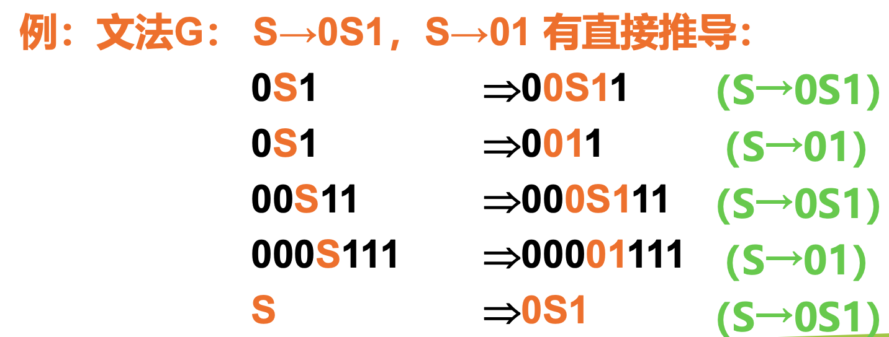

#### 推导 and 归约

若有$v \Rightarrow w_0 \Rightarrow w_1 \Rightarrow \cdots \Rightarrow w_n=w$ (v经过多步推导到w)

则称：

- v**推导**出w （从左到右）
- w**归约**到v （从右到左）

记作：$v =^{+}> w$

若有$v =^{+}> w$，或$v=w$，则记作$v =^{*}> w$

##### Example

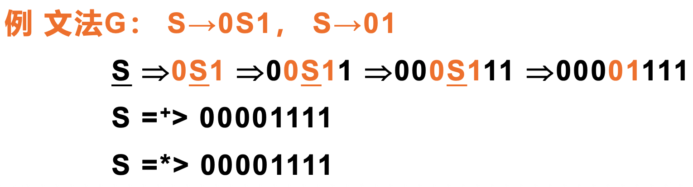

### 句型与句子

#### 句型

> **句型**：
>
> 由文法开始符号**S**推导出的符号串α（即S＝*＞α），称为文法G[S]的句型

#### 句子

> **句子**：仅由**终结符**组成的句型$\alpha$（即$S＝^{*}> \alpha，\alpha \in V_T^{*}$），称为文法G[S]的句子

##### Example

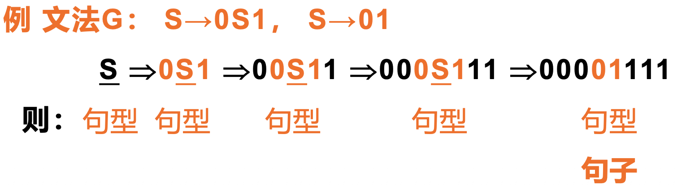

#### 辨析: 句型vs句子

|      | 符号串的组成       |
| ---- | ------------------ |
| 句型 | 终结符 or 非终结符 |
| 句子 | 终结符             |

### 文法定义的语言

> **语言**：
>
> 文法G[S]的一切**句子的集合**称为语言
>
> 记做L(G)

##### Example

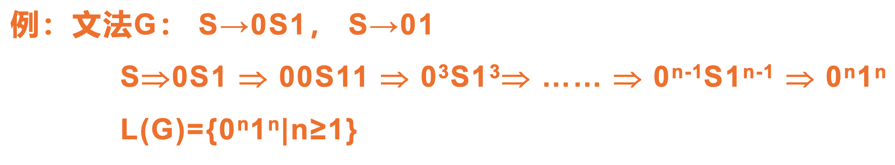

#### 语言相同=>文法等价

若L(G1)=L(G2)，即两个文法所定义的语言是一样的，则文法G1和G2是等价的

##### Example

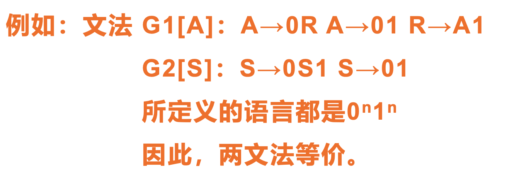

## 文法类型

文法有4种类型：

- 0型（短语文法）
- 1型（上下文有关文法）→ 0型文法的特例
- 2型（上下文无关文法）→ 1型文法的特例
- 3型（正规文法）→ 2型文法的特例

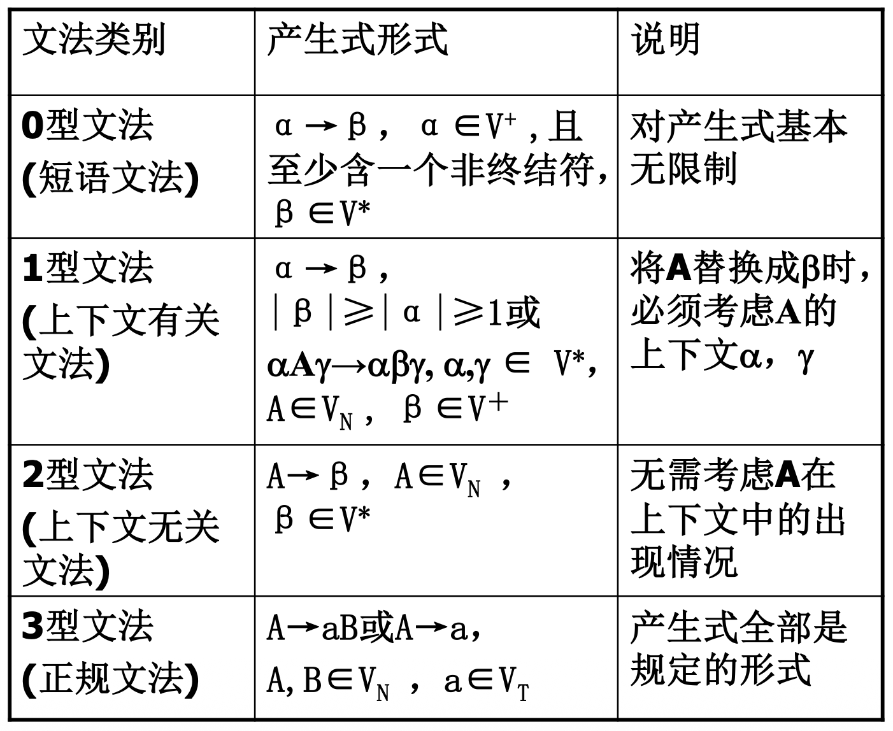

> [!NOTE]
>
> 任何文法都是**0型文法**

四种文法之间的关系

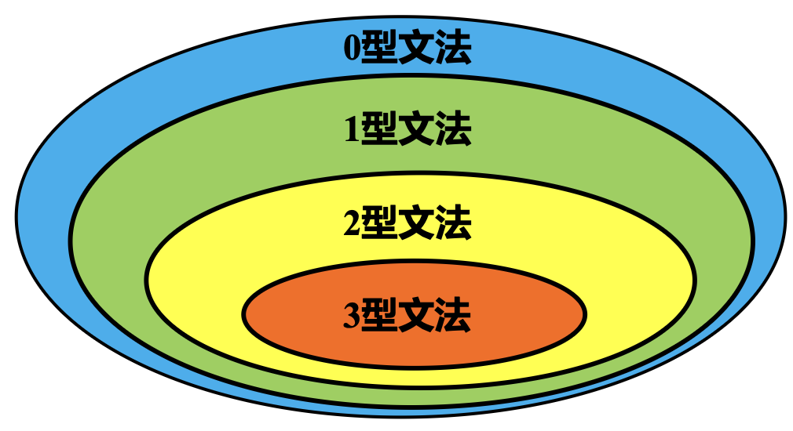


### 上下文无关文法（2型文法）

>只关心上下文无关文法形成的语言中的句子的分析

#### 最左推导 and 最右推导

对于推导中的**每一步**$\alpha \rightarrow \beta$（其中$\alpha,\beta$是句型）

如果都是对$\alpha$中的**最左非终结符**进行替换，则称为**最左推导**；

如果都是对$\alpha$中的**最右非终结符**进行替换，则称为**最右推导**

#### 规范推导

**最右推导**又被称为**规范推导**

#### 规范句型

由**规范推导所得的句型**称为规范句型（右句型）

##### Example

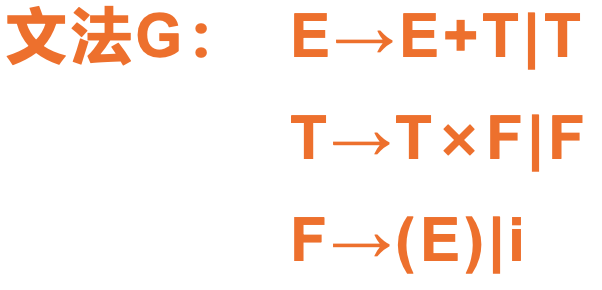

对于以上文法，推导句子 $i+i×i$：

###### Answer

最左推导：
$$
\begin{aligned}
E &\Rightarrow \textcolor{orange}{\underline{E}+T} \\
&\Rightarrow \textcolor{orange}{\underline{T}} + T \\
&\Rightarrow \textcolor{orange}{\underline{F}} + T \\
&\Rightarrow \textcolor{orange}{i}+\underline{T} \\
&\Rightarrow i + \textcolor{orange}{\underline{T} \cross F} \\
&\Rightarrow i + \textcolor{orange}{\underline{F}} \cross F \\ 
&\Rightarrow i + \textcolor{orange}{i} \cross \underline{F} \\ 
&\Rightarrow i + i \cross \textcolor{orange}{i}  \\ 
\end{aligned}
$$
最右推导：
$$
\begin{aligned}
E &\Rightarrow \textcolor{orange}{E+\underline{T}} \\
&\Rightarrow E + \textcolor{orange}{T \cross \underline{F}} \\
&\Rightarrow E + \underline{T} \cross \textcolor{orange}{i} \\
&\Rightarrow E + \textcolor{orange}{\underline{F}} \cross i \\
&\Rightarrow \underline{E} + \textcolor{orange}{i} \cross i \\
&\Rightarrow \textcolor{orange}{\underline{T}} + i \cross i \\
&\Rightarrow \textcolor{orange}{\underline{F}} + i \cross i \\
&\Rightarrow \textcolor{orange}{i} + i \cross i \\
\end{aligned}
$$

### 语法树(推导树,Parse Tree)

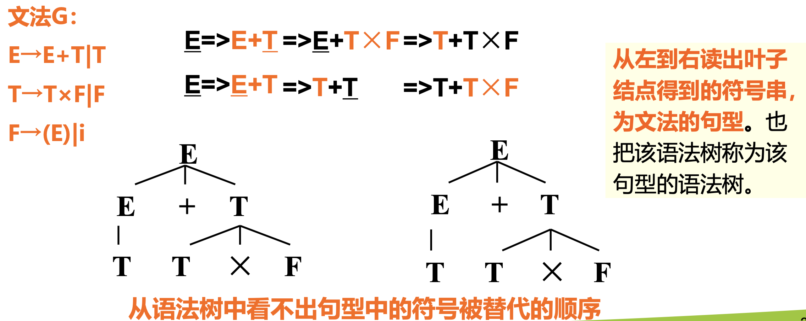


##### Example

给定文法：$S \rightarrow SS*|SS+|a$

通过此文法如何生成串**aa+a\***，并为该串构造语法树

###### Answer

$$
\begin{aligned}
S &\Rightarrow SS* \\
&\Rightarrow SS+S* \\
&\Rightarrow aS+S* \\
&\Rightarrow aa+S* \\
&\Rightarrow aa+a*
\end{aligned}
$$

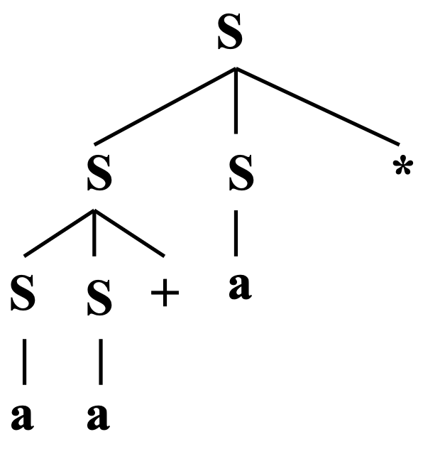

### 文法的二义性(Ambiguity)

> **文法的二义性(Ambiguity)**：
>
> 如果一个文法存在某个句子
>
> - 对应**两棵不同的语法树**，
> - 或 有**2个不同的最左推导**，
> - 或 有**2个不同的最右推导**，
>
> 则这个文法是二义的

例如：

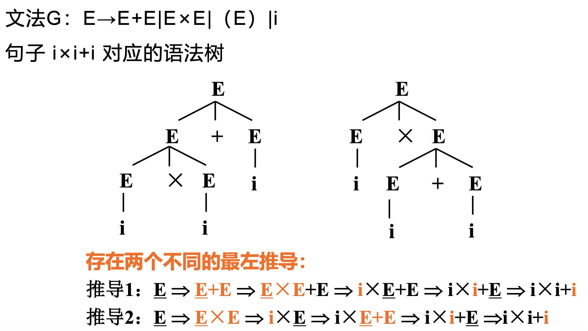

##### Example

考虑文法 S→aSbS|bSaS|ε，试说明此文法是二义性的。

提示：可以从对于句子abab有两个不同的最左推导来说明。

###### Answer

$$
\begin{aligned}
S &\Rightarrow \textcolor{orange}{a\underline{S}bS} \\
&\Rightarrow a \textcolor{orange}{b\underline{S}aS} bS \\
&\Rightarrow aba\underline{S}bS \quad(S\rightarrow \varepsilon) \\
&\Rightarrow abab\underline{S} \quad(S\rightarrow \varepsilon)\\
&\Rightarrow abab \quad(S\rightarrow \varepsilon)
\end{aligned}
$$

$$
\begin{aligned}
S &\Rightarrow \textcolor{orange}{a\underline{S}bS} \\
&\Rightarrow ab\underline{S} \quad(S \rightarrow \varepsilon) \\
&\Rightarrow ab\textcolor{orange}{a\underline{S}bS} \\
&\Rightarrow abab\underline{S} \quad (S \rightarrow \varepsilon) \\
&\Rightarrow abab \quad(S\rightarrow \varepsilon)
\end{aligned}
$$

存在两个不同的最左推导，所以该文法是二义的。

#### 二义性=>无二义性文法

任何一个二义性的文法，都可以转换成一个等价的无二义性文法。

例如：

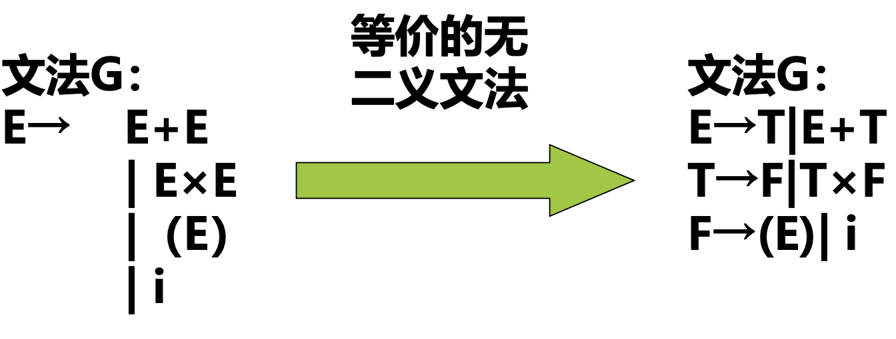


## 句型分析

> **句型分析的任务**：
>
> 识别一个符号串是否为某文法的句型。

判断方法：

- 按照句型的定义：如果能从文法的开始符号S**推导出符号串**，则该符号串是文法G[S]的句型
- 使用语法树：如果能根据文法**构造出该符号串的语法树**，则该符号串就是该文法的句型。

### 算法分类

- 自上而下分析法 (Top-Down parsing)

- 自下而上分析法 (Bottom-Up parsing)

> [!CAUTION]
>
> 无论哪种分析算法，都是**从左到右**地识别输入符号串


### 短语

> **短语(Phrase)**：
>
> 设$\alpha \beta \var$是文法G[S]中的一个句型。
>
> 如果有$S=^{*}>\alpha A \var$ 且 $A=^{+}>\beta$, 则称$\beta$是$\alpha \beta \var$相对于非终结符A的短语。

>**直接短语**：
>
>特别地，如果有$A \Rightarrow \beta$, 则称$\beta$是句型$\alpha \beta \var$ 相对于规则A→β的**直接短语**。

> [!CAUTION]
>
> 短语是相对于**非终结符**A而言的
>
> 直接短语是相对于**产生式**A→β而言的

> **句柄**：
>
> 一个句型的**最左**直接短语，称为该句型的句柄。
>
> 句柄就是 可归约串。

> [!CAUTION]
>
> 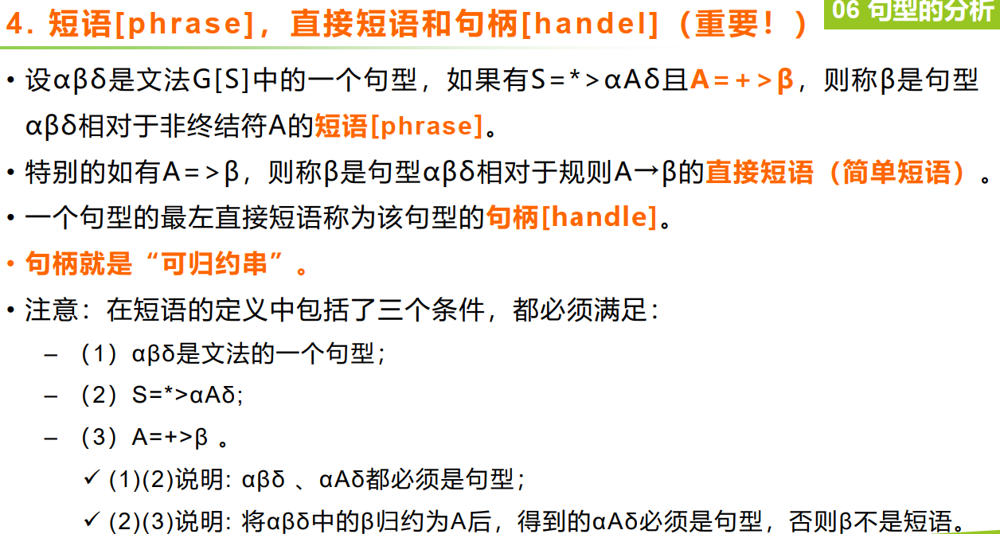


##### Example

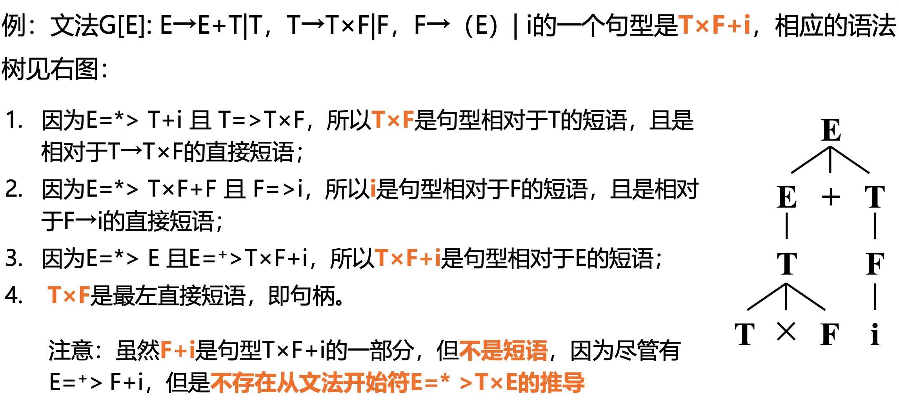


#### 短语与语法树的对应关系!

在语法树中，每棵子树的**末端结点**是相对于它的**子树根结点**的短语

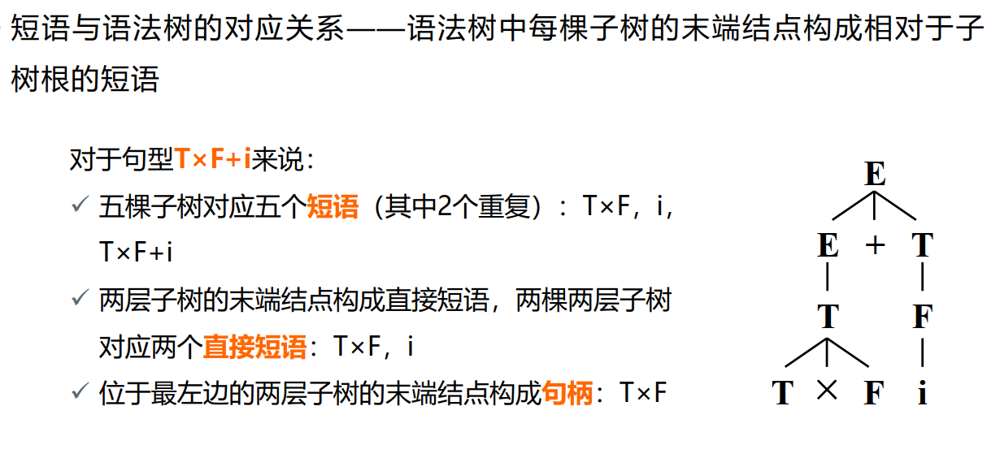

在以上语法树中，对于句型 T×F+i 来说：

有5棵子树，具体如下图所示：（圆圈是子树根结点，方框是对应的子树末端结点）

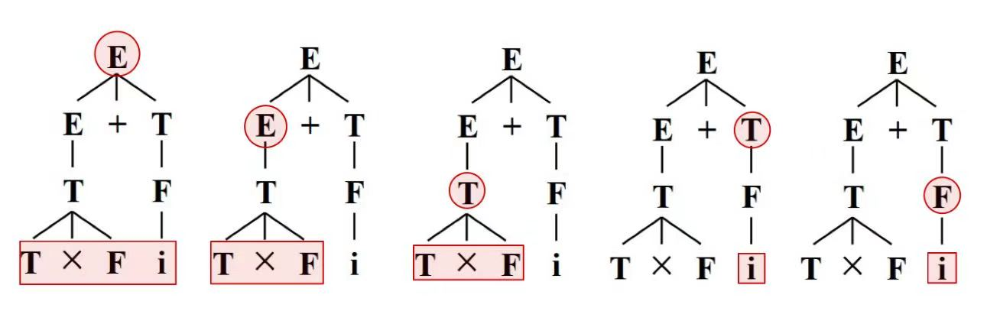

这5棵子树分别对应5个短语（其中有2个是重复的），分别是：

- T×F+i ($E=^*>E, E =^+> T \cross F+i$)
- T×F    ($E=^*>E+T, E=^+> T \cross F$)
- T×F    ($E=^*>T+T, T=^+> T \cross F$)
- i         ($E=^*>T \cross F +T, T=^+>i$)
- i         ($E=^*>T \cross F + F, F=^+>i$)

两层子树的末端结点分别对应直接短语，有：

- T×F
- i

其中最左边的直接短语 T×F 是句柄


#### 找出短语、直接短语、句柄

##### Example1

画出语法树，并指出短语、直接短语、句柄

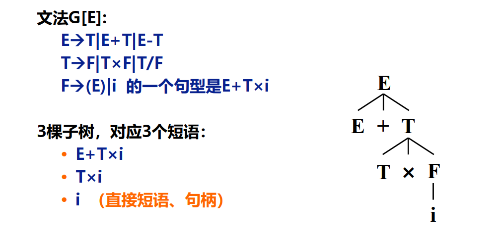

###### Answer

语法树如下：

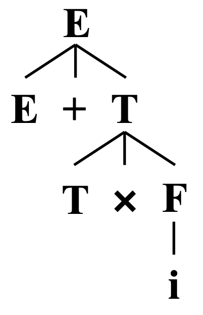

3棵子树，具体如下图所示：（圆圈是子树根结点，方框是对应的子树末端结点）

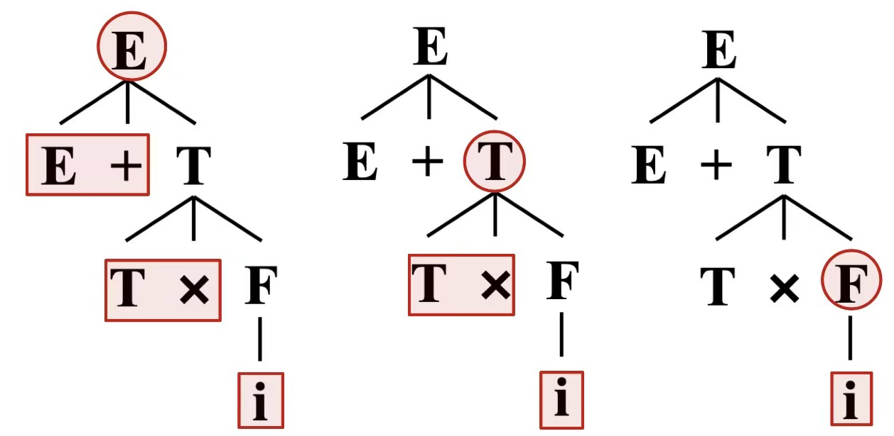


这3棵子树分别对应着3个短语，分别是：

- E+T×i ($E=^*> E, E=^+>E+ T \cross i$)
- T×i      ($E=^*> E+T, T=^+> T \cross i$)
- i          ($E=^*> E+T \cross F, F=^+> i$)

两层子树的末端结点对应直接短语，只有 i

句柄为 i


##### Example2

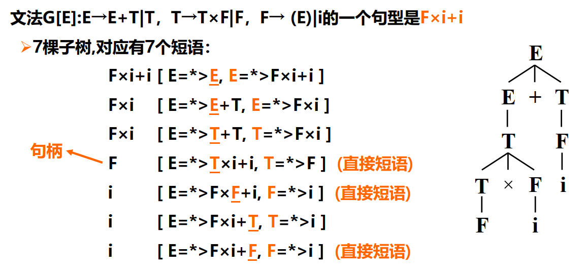


##### Example3

找出以下语法树的句型abbaa的短语、直接短语、句柄。

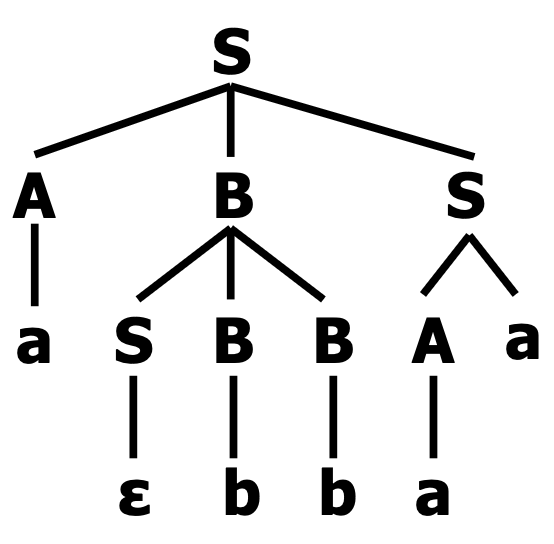

共有8棵子树，具体如下图所示：（圆圈是子树根结点，方框是对应的子树末端结点）

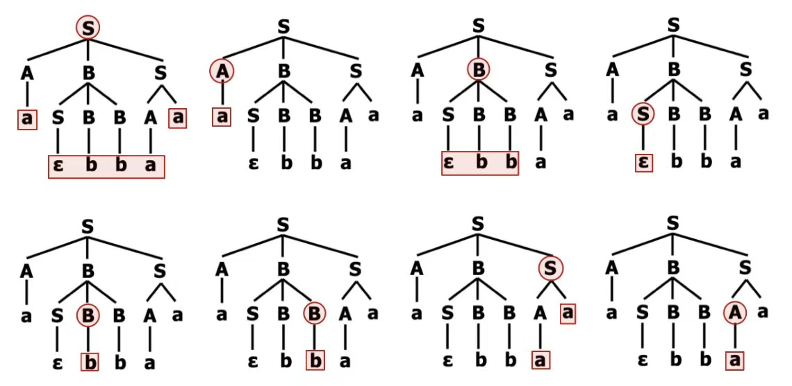

这8棵子树分别对应着8个短语，分别是：

- aεbbaa ($S=^*>S, S=^+> aεbbaa $)
- a            ($S=^*>ABS, A=^+> a $)   → 直接短语 → 句柄
- εbb        ($S=^*>aBS, B=^+> εbb $)

- ε             ($S=^*>aSBBS, S=^+> ε $) → 直接短语
- b             ($S=^*>aεBBS, B=^+> b $) → 直接短语
- b             ($S=^*>aεbBS, B=^+> b $) → 直接短语
- aa           ($S=^*>aεbbS, S=^+> aa $)
- a             ($S=^*>aεbbAa, A=^+> a $) → 直接短语


