# Chapter 3: Lexical Analysis 词法分析

[TOC]

词法分析的任务：

1. 将输入符号串分解成token
2. 识别每个token的类别

> [!NOTE]
>
> 在词法分析过程中，还会**丢弃无意义的词**
>
> 比如：空格、注释等

**token**: 最小意义单元

一个token是一个二元组 (class, lexeme)

**Lexeme 词素**：token类的实例

比如：'z', '=', '1'……

> [!CAUTION]
>
> 如果token类别是**无二义性**的，则可以在对输入字符串进行一次从左到右的扫描中识别标记
>
> 但token类别可能**有歧义**，这需要通过“向前看”（查看更大的上下文）来消除歧义。

## 正则表达式（Regular Expressions）

正则表达式又称为**正规式**

>**正规集**：
>
>正规式所能描述的语言集合

##### Example

令$\Sigma$={a，b}， $\Sigma$上的正规式和相应的正规集有:

| 正规式       | 正规集                                                       |
| ------------ | ------------------------------------------------------------ |
| a            | {a}                                                          |
| a\|b         | {a,b}                                                        |
| ab           | {ab}                                                         |
| (a\|b)(a\|b) | {aa,ab,ba,bb}                                                |
| a*           | {$\varepsilon$, a, aa, ... } (任意个a的串)                   |
| (a\|b)*      | {$\varepsilon$, a, b, aa, ab, ba, bb, ... } (任意由a和b组成的串) |

### 正则表达式的代数性质

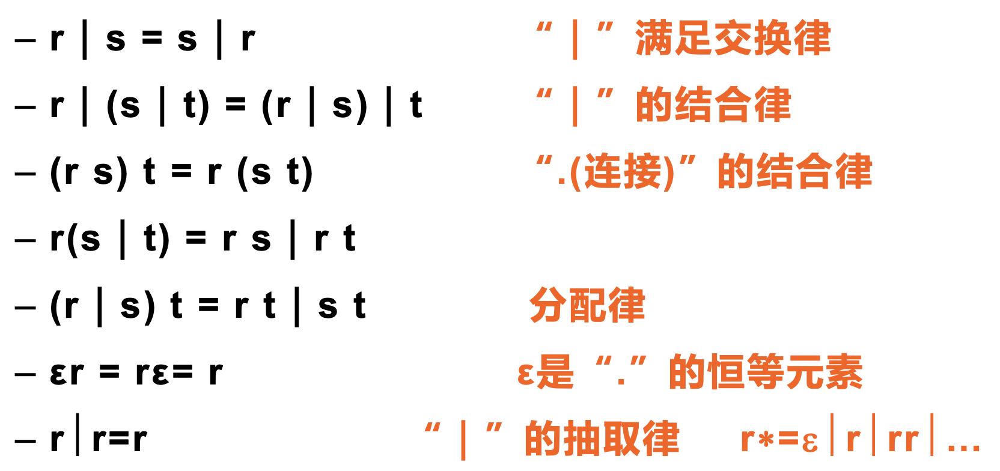

### 常用表达

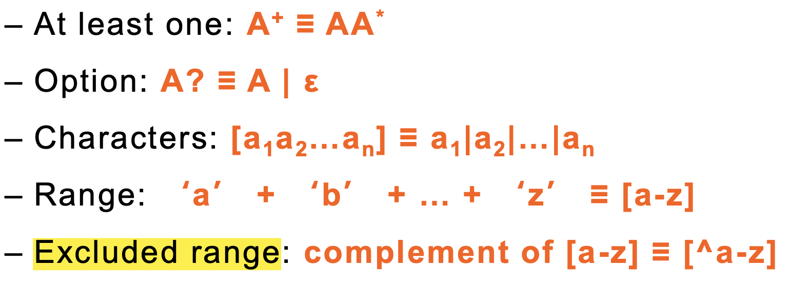

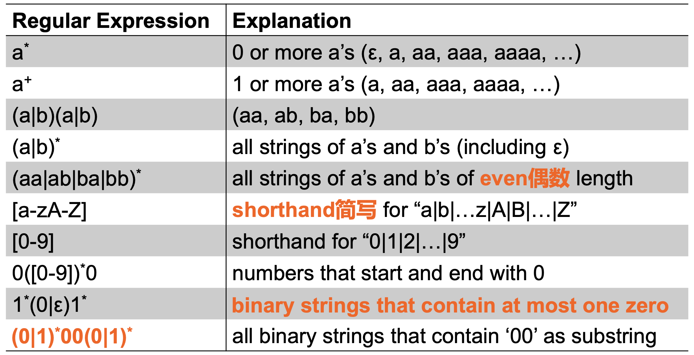

> [!IMPORTANT]
>
> 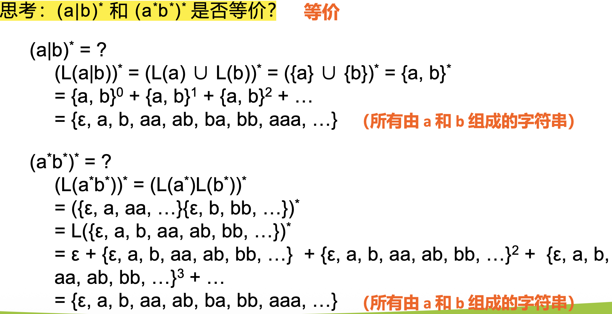

##### Example

1. 写出C语言中标识符的正则表达式：

（C语言中标识符由字母、数字和下划线组成，只能由字母或下划线开头）

2. 写出C语言中十进制数字的正则表达式
3. 写出2的倍数的二进制表示的正则表达式

###### Answer

1. `[a-zA-Z_][a-zA-Z0-9_]*`
2. `0|[1-9]([0-9])*`
3. `(0|1)*0`

## 有穷自动机 (Finite Automata, FA)

> **有穷自动机(Finite Automata, FA)**：
>
> 有穷自动机是一个对字符串进行分类（接受、拒绝）的程序

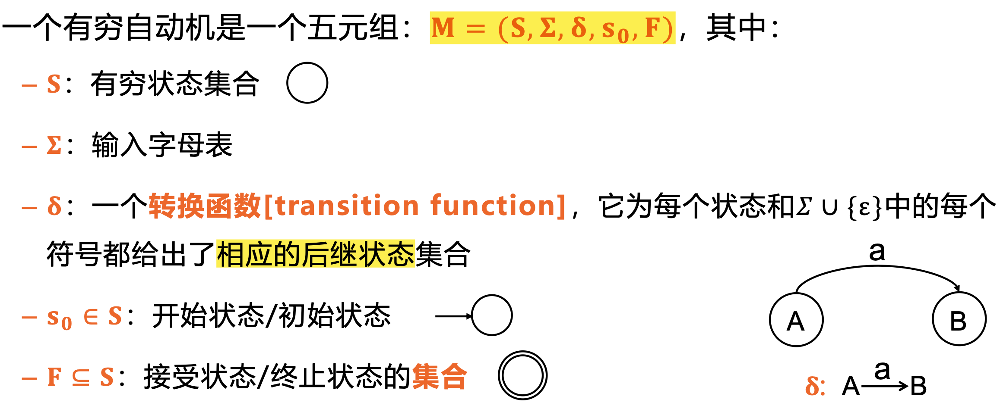

### 工作机制

对于给定的字符串x，如果存在一条从FA的**初始结点**到某一个**最终结点**的通路，且该通路上所有边上的符号连接成的**字符串等于x**，则称x被FA识别，或称x被FA接受；

否则，称x被FA拒绝。

例如：

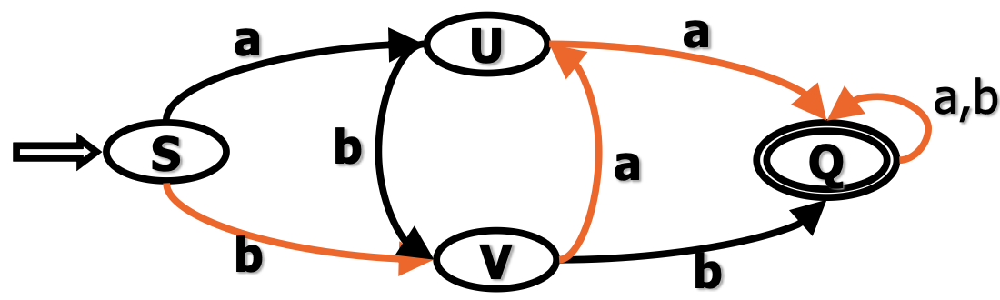

在上图中，baab被FA接受，abcd被FA拒绝

### FA表达的语言

**FA**所能表达的语言即为该**FA**接受的字符串集合

##### Example

FA如下图所示：

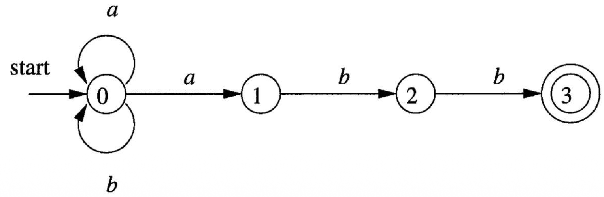

（1）在字母表$\Sigma = \{a,b \}$上，这个FA的语言是什么？

（2）用正则表达式来表达这个语言

###### Answer

（1）一个以任意数量的a和b组成的串，后面跟着‘aab’的字符串

（2）L(RE) = (a|b)*aab

### DFA

> **DFA(Deterministic Finite Automata)**: 
>
> 机器在任何给定时间只能以**一种**状态存在(确定)

特点：

- 每个状态对于每个输入只对应**一个转换**
- 没有$\varepsilon$转移
- 只通过状态图的一条路径

因此，对于给定的字符串，**只有一种**可能的转移序列，要么接受，要么拒绝。

例如：

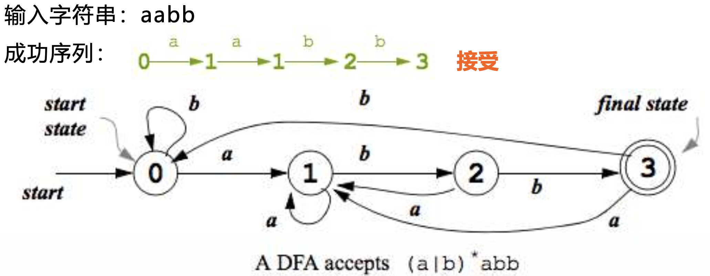

### NFA

> **NFA(Nondeterministic Finite Automata)**：
>
> 机器可以同时以**多种**状态存在(非确定)

特点：

- 在给定状态下，对同一个输入可以有多个转移
- 可以有$\varepsilon$转移
- 多条路径：可以选择采取哪条路径

因此，对于给定的字符串，有**多个**可能的转移序列，只要有一个转移序列到达最终状态，即认为接受。

例如：

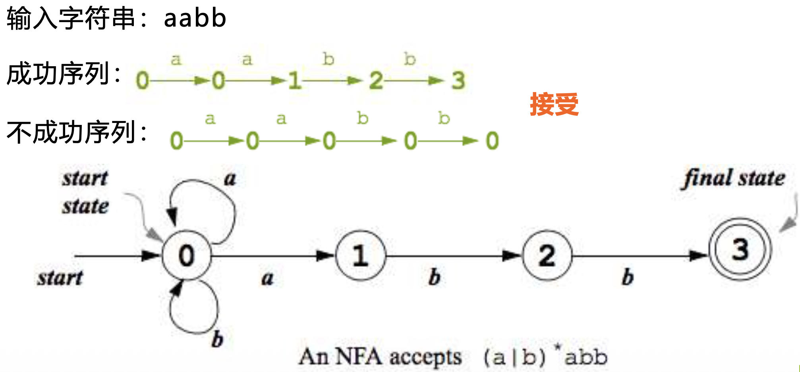

## 转换流程

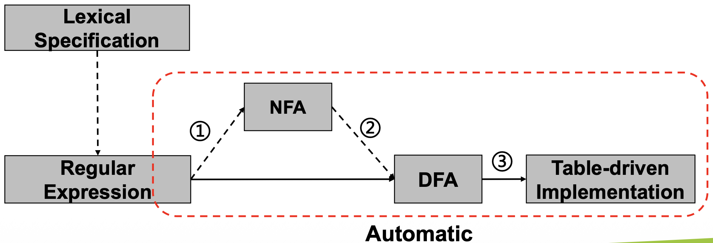

流程：RE→NFA→DFA→Table-drive Implementation

总共有3步：

1. RE→NFA
2. NFA→DFA
3. DFA→Table-drive Implementation

### RE→NFA

对于表达式 r=s|t

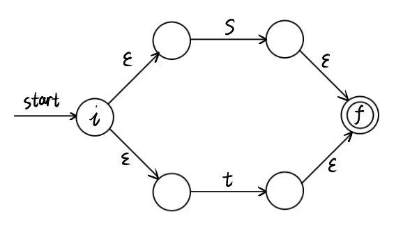

对于表达式r=st

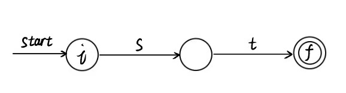

对于表达式r=s*

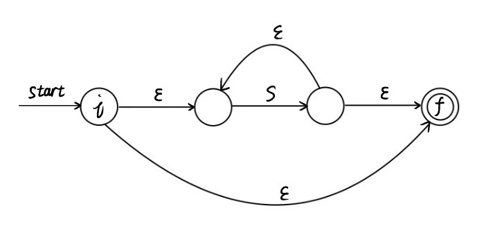

##### Example1!

将正则表达式 `(a|b)*abb`转换成NFA

###### Answer

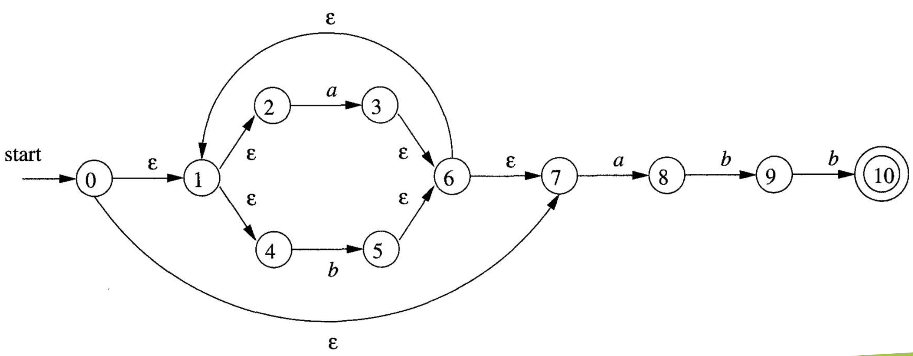

##### Example2!

将正则表达式`1*(0|01)*`转成NFA

###### Answer

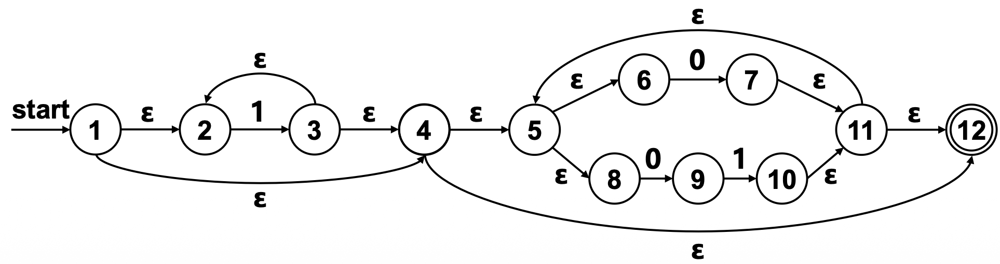

### NFA→DFA

> 为什么需要将NFA转换成DFA？
>
> 因为NFA的转移是不确定的，难以用机器模拟。

可以转化的关键保证：对于每个NFA，都存在一个与之等价的DFA

#### ε闭包构造(ε-closure construction)算法

> 针对于**含有ε转移**的NFA

算法介绍：

从集合S的状态出发，只通过**ε转移**就能够到达的**所有状态（包含该状态自身）**（称为ε-closure集合），合成为DFA中的一个**新状态**；

在刚开始，这个集合S就只是初始结点；之后不断产生新集合（即DFA中的新状态），以新集合为S，不断迭代，直至没有新集合产生。

只要 ε-closure 集合中**包含原来NFA的终止状态**，那么在DFA中相应的状态就是**终止状态**。

##### Example1

将下图ε-**NFA**转换成等价的DFA

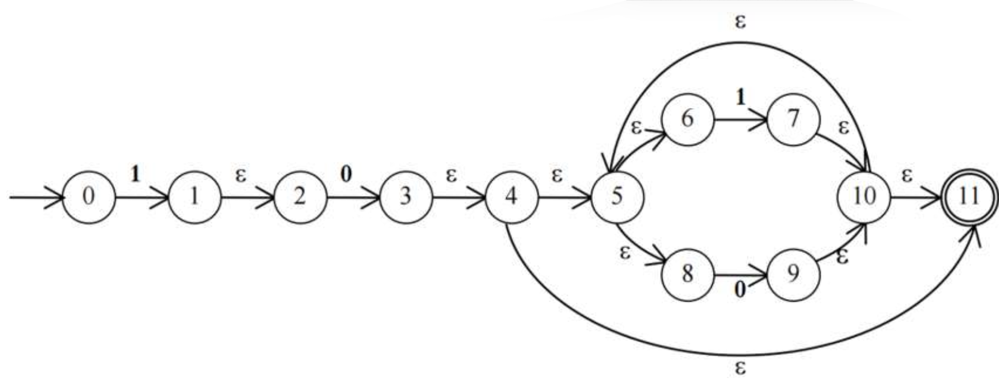

###### Answer

Step1: 计算初始状态的ε-closure：

- ε-closure({0}) = {0}=A

Step2：计算状态转移的ε-closure：

- (A,1) = ε-closure({1}) = {1,2} = B
- (B,0) = ε-closure({3}) = {3,4,5,6,8,11} = C
- (C,0) = ε-closure({9}) = {5,6,8,9,10,11}=D
- (C,1) = ε-closure({7}) = {5,6,7,8,10,11}=E
- (D,0) = ε-closure({9}) = D
- (D,1) = ε-closure({7}) = E
- (E,0) = ε-closure({9}) = D
- (E,1) = ε-closure({7}) = E

> [!CAUTION]
>
> 直至没有新集合产生

Step3：根据新的状态集合画出DFA

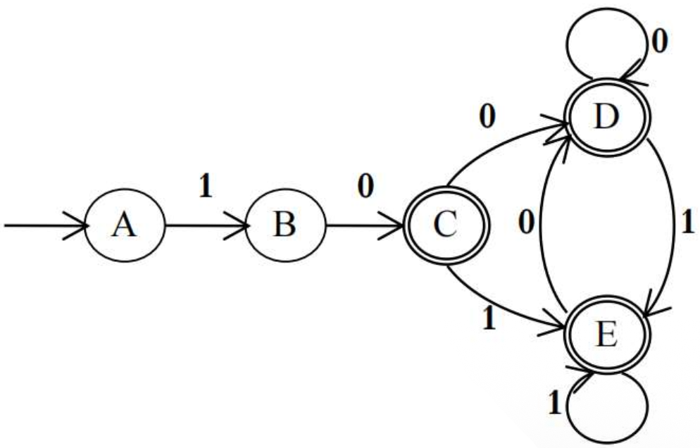

> [!CAUTION]
>
> 注意**终止状态**
>
> 只要 ε-closure 集合中**包含原来NFA的终止状态**，那么在DFA中相应的状态就是终止状态
>
> 比如：这里的C、D、E，它们的ε-closure集合中包含原来NFA的终止状态 11，所以C、D、E在DFA中是终止状态。

##### Example2

将下图ε-**NFA**转换成等价的DFA

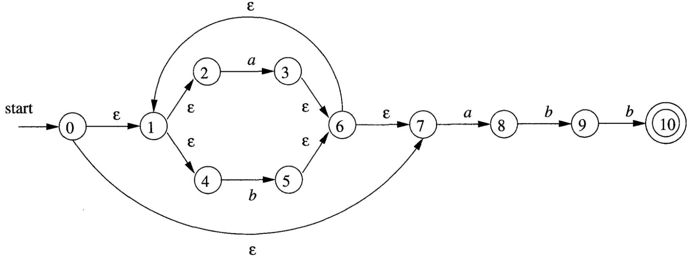

###### Answer

Step1: 计算初始状态的ε-closure：

- ε-closure({0}) = {0,1,2,4,7} = A

Step2：计算状态转移的ε-closure：

- (A,a) = ε-closure({3,8}) = {1,2,3,4,6,7,8} = B
- (A,b) = ε-closure({5}) = {1,2,4,5,6,7} = C
- (B,a) = ε-closure({3,8}) =B
- (B,b) = ε-closure({5,9}) = {1,2,4,5,6,7,9} = D
- (C,a) = ε-closure({3,8}) = B
- (C,b) = ε-closure({5}) = C
- (D,a) = ε-closure({3,8}) = B
- (D,b) = ε-closure({5,10}) = {1,2,4,5,6,7,10} = E
- (E,a) = ε-closure({3,8}) = B
- (E,b) = ε-closure({5}) = C

Step3：根据新的状态集合画出DFA

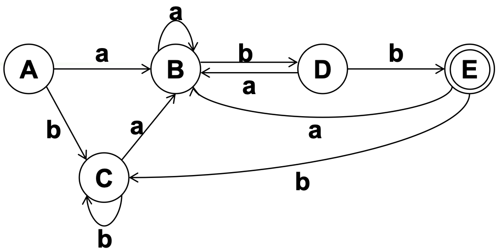

#### 子集构造(subset construction)算法

> 针对于**不含ε转移**的NFA

算法介绍：借助状态转移矩阵来进行

##### Example1

将下图NFA**(**不含ε转移**)**转换成等价的DFA

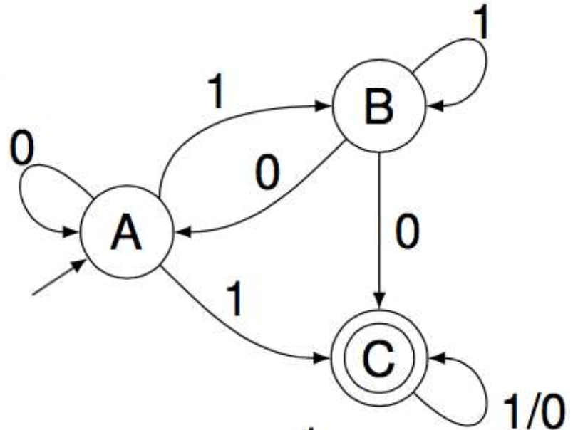

Step1：子集构造

|      | 0    | 1    |
| ---- | ---- | ---- |
| A    | A    | BC   |
| BC   | AC   | BC   |
| AC   | AC   | BC   |

>[!CAUTION]
>
>直至没有新集合产生

Step 2：根据新的状态集合画出DFA

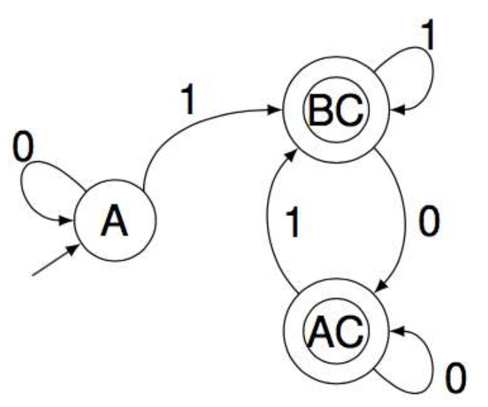

>[!CAUTION]
>
>注意**终止状态**
>
>只要新的状态集合中**包含原来NFA的终止状态**，那么在DFA中相应的状态集合就是终止状态
>
>比如：这里的AC、BC都包含原来NFA的终止状态C，所以它们在DFA中都是终止状态。

##### Example2

将下图NFA**(**不含ε转移**)**转换成等价的DFA

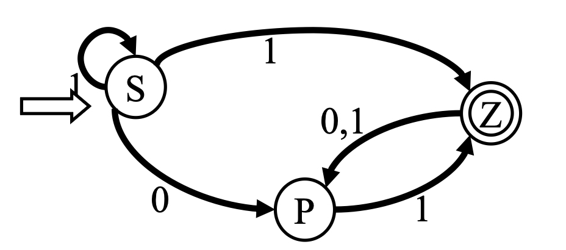

###### Answer

Step1：子集构造

|      | 0    | 1    |
| ---- | ---- | ---- |
| S    | P    | SZ   |
| P    | /    | Z    |
| SZ   | P    | SPZ  |
| Z    | P    | P    |
| SPZ  | P    | SPZ  |

Step 2：根据新的状态集合画出DFA

令A=SZ，B=SPZ,得到DFA

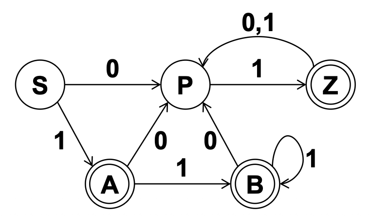

### DFA化简

任务：去掉多余状态，合并等价状态

> **多余状态**：
>
> 从开始状态出发，**无法到达**的状态

> **等价状态**：
>
> 两个状态s和t等价的条件是：
>
> 1. 一致性条件：状态s和t必须同为**可接受状态**或**不可接受状态**
> 2. 蔓延性条件：对于所有输入符号，状态s和状态t必须**转换到等价的状态**里

例如：

分析：

1. BC和AC都是可接受状态

2. BC和AC对所有输入符号都转移到等价

   的状态里

因此，BC和AC是等价状态，可以合并。合并后如下图所示

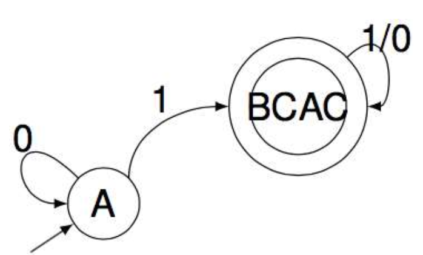

> [!CAUTION]
>
> 弧也要合并

##### Example1

将下图的DFA化简

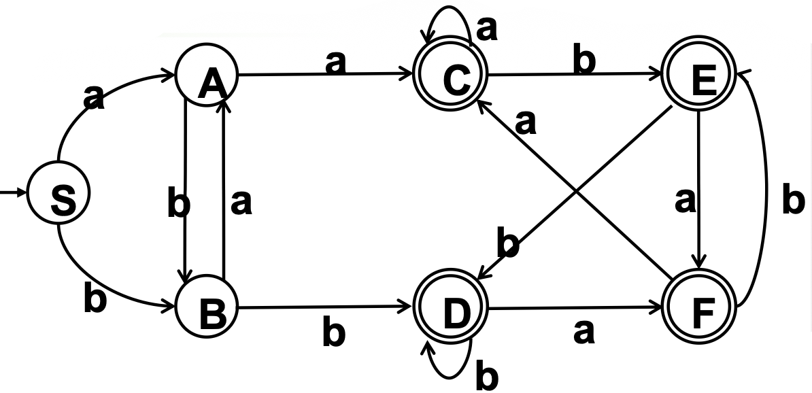

###### Answer

Step1: 将状态分成**非终态集**和**终态集**

$\textcolor{blue}{\{S,A,B\}}, \textcolor{green}{\{C,D,E,F\}}$

Step 2：寻找子集中**不等价状态**

画出状态转移矩阵

|      | a                      | b                      |
| ---- | ---------------------- | ---------------------- |
| S    | $\textcolor{blue}{A}$  | $\textcolor{blue}{B}$  |
| A    | $\textcolor{green}{C}$ | $\textcolor{blue}{B}$  |
| B    | $\textcolor{blue}{A}$  | $\textcolor{green}{D}$ |
| C    | $\textcolor{green}{C}$ | $\textcolor{green}{E}$ |
| D    | $\textcolor{green}{F}$ | $\textcolor{green}{D}$ |
| E    | $\textcolor{green}{F}$ | $\textcolor{green}{D}$ |
| F    | $\textcolor{green}{C}$ | $\textcolor{green}{E}$ |

从表中可见：

对于所有输入符号，$\textcolor{blue}{\{S,A,B\}}$并没有转移到相同的集合里。所以要分开

{S,A,B} => $\textcolor{blue}{\{S\}} \textcolor{red}{\{A\}} \textcolor{orange}{\{B\}}$

对于所有输入符号，$\textcolor{green}{\{C,D,E,F\}}$转移到相同的集合$\textcolor{green}{\{C,D,E,F\}}$里，所以不用变。

根据新的划分，继续通过状态转移矩阵来分析

|      | a                      | b                       |
| ---- | ---------------------- | ----------------------- |
| S    | $\textcolor{red}{A}$   | $\textcolor{orange}{B}$ |
| A    | $\textcolor{green}{C}$ | $\textcolor{orange}{B}$ |
| B    | $\textcolor{red}{A}$   | $\textcolor{green}{D}$  |
| C    | $\textcolor{green}{C}$ | $\textcolor{green}{E}$  |
| D    | $\textcolor{green}{F}$ | $\textcolor{green}{D}$  |
| E    | $\textcolor{green}{F}$ | $\textcolor{green}{D}$  |
| F    | $\textcolor{green}{C}$ | $\textcolor{green}{E}$  |

现在每个集合内，每个状态都是等价的。可以终止。

所以最后划分为：{S}{A}{B}{C,D,E,F}

Step3:

用D代表{C,D,E,F}，可以得到化简后的DFA

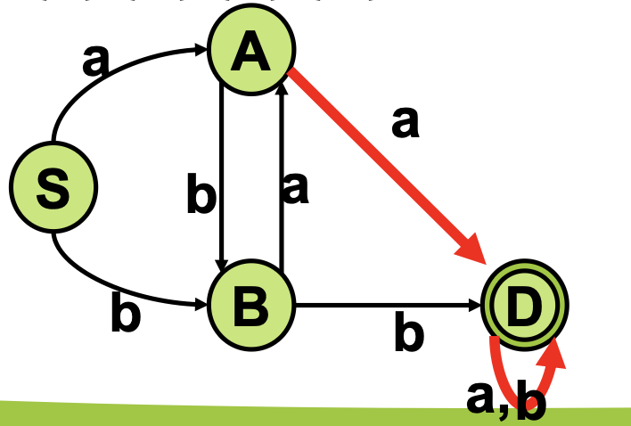

##### Example2

将下图的DFA化简

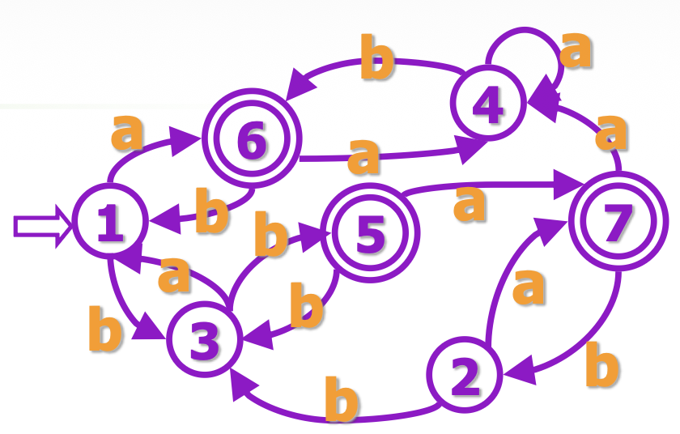

Step1: 将状态分成**非终态集**和**终态集**

$\textcolor{blue}{\{1,2,3,4\}}, \textcolor{green}{\{5,6,7\}}$

Step2: 寻找子集中**不等价状态**

画出状态转移矩阵

|      | a                      | b                      |
| ---- | ---------------------- | ---------------------- |
| 1    | $\textcolor{green}{6}$ | $\textcolor{blue}{3}$  |
| 2    | $\textcolor{green}{7}$ | $\textcolor{blue}{3}$  |
| 3    | $\textcolor{blue}{1}$  | $\textcolor{green}{5}$ |
| 4    | $\textcolor{blue}{4}$  | $\textcolor{green}{6}$ |
| 5    | $\textcolor{green}{7}$ | $\textcolor{blue}{3}$  |
| 6    | $\textcolor{blue}{4}$  | $\textcolor{blue}{1}$  |
| 7    | $\textcolor{blue}{4}$  | $\textcolor{blue}{2}$  |

从上表发现：{1,2,3,4} 当中{1,2}{3}{4}不等价；{5,6,7}当中{5}{6,7}不等价

所以进一步划分为：

- {1,2,3,4} => $\textcolor{blue}{\{1,2\}} \textcolor{red}{\{3,4\}}$
- {5,6,7} => $\textcolor{brown}{\{5\}} \textcolor{green}{\{6,7\}}$

根据新的划分，继续通过状态转移矩阵来分析

|      | a                      | b                      |
| ---- | ---------------------- | ---------------------- |
| 1    | $\textcolor{green}{6}$ | $\textcolor{red}{3}$   |
| 2    | $\textcolor{green}{7}$ | $\textcolor{red}{3}$   |
| 3    | $\textcolor{blue}{1}$  | $\textcolor{brown}{5}$ |
| 4    | $\textcolor{red}{4}$   | $\textcolor{green}{6}$ |
| 5    | $\textcolor{green}{7}$ | $\textcolor{red}{3}$   |
| 6    | $\textcolor{red}{4}$   | $\textcolor{blue}{1}$  |
| 7    | $\textcolor{red}{4}$   | $\textcolor{blue}{2}$  |

从上表发现：{3,4}当中{3}{4}不等价

所以进一步划分为：

- {3,4} => $\textcolor{red}{\{3\}} \textcolor{orange}{\{4\}}$

根据新的划分，继续通过状态转移矩阵来分析

|      | a                       | b                      |
| ---- | ----------------------- | ---------------------- |
| 1    | $\textcolor{green}{6}$  | $\textcolor{red}{3}$   |
| 2    | $\textcolor{green}{7}$  | $\textcolor{red}{3}$   |
| 3    | $\textcolor{blue}{1}$   | $\textcolor{brown}{5}$ |
| 4    | $\textcolor{orange}{4}$ | $\textcolor{green}{6}$ |
| 5    | $\textcolor{green}{7}$  | $\textcolor{red}{3}$   |
| 6    | $\textcolor{orange}{4}$ | $\textcolor{blue}{1}$  |
| 7    | $\textcolor{orange}{4}$ | $\textcolor{blue}{2}$  |

现在每个集合内，每个状态都是等价的。可以终止。

所以最后划分为：{1,2} {3} {4} {5} {6,7}

Step3: 

用1代表{1,2}，用6代表{6,7}，则最后的划分可表示为：{1} {3} {4} {5} {6}

对应状态转移矩阵为：

|      | a                       | b                      |
| ---- | ----------------------- | ---------------------- |
| 1    | $\textcolor{green}{6}$  | $\textcolor{red}{3}$   |
| 3    | $\textcolor{blue}{1}$   | $\textcolor{brown}{5}$ |
| 4    | $\textcolor{orange}{4}$ | $\textcolor{green}{6}$ |
| 5    | $\textcolor{green}{7}$  | $\textcolor{red}{3}$   |
| 6    | $\textcolor{orange}{4}$ | $\textcolor{blue}{1}$  |

对应化简后的DFA为：

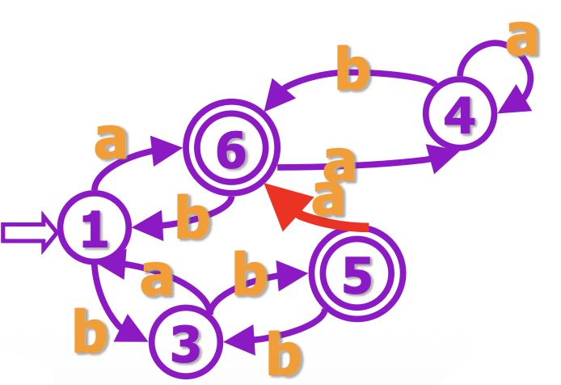

### DFA→Table-drive Implementation

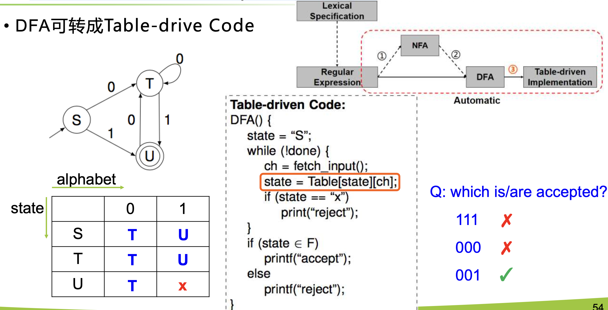
