# Chapter 4: Syntax Analysis 语法分析

> **重点**：
>
> （全是重点）
>
> 1. [改写文法（4种方法）](#改写文法)
> 2. [求FIRST集](#FIRST集（开始符号集）)
> 3. [求FOLLOW集](#FOLLOW集（后跟符号集）)
> 4. [判断一个文法是否为LL(1)文法](#LL(1)文法)
> 5. 构造预测分析表
> 6. [LR(0)分析](#LR(0) 分析过程)
> 7. [SLR(1)分析](#SLR(1)分析)
> 8. [LR(1)分析](#LR(1)分析)
> 9. LALR(1)分析
> 10. LALR(1)中不存在移进-归约冲突，但可能存在归约-归约冲突；LR(0)、SLR(1)、LR(1)中可能两种冲突均存在

[TOC]

语法分析类型：

- 自顶向下分析
- 自底向上分析

## 自顶向下分析 Top-Down parsing

### 对文法的要求

自顶向下分析 对文法有以下3个要求：

1. 产生式不能存在**左公因子**，否则无法唯一确定选用哪一个产生式往下推导。（推导过程是不确定的）
2. 文法中不能存在**左递归**的产生式，否则会导致对该产生式的无限调用。（推导过程进入无限循环，也可能导致推导过程不确定）
3. 文法不能存在**二义性**，否则推导过程不唯一。（推导过程是不确定的）

### 改写文法 

目的：通过改写文法，消除不确定性/无限循环

有4种改写文法的方式：

1. 提取左公因子
2. 消除左递归
   - 消除直接左递归
   - 消除间接左递归
3. 消除二义性
4. 消除$\varepsilon$产生式

#### 提取左公因子

##### 规则

对于产生式 $A \rightarrow \alpha\beta | \alpha \gamma$，提取左公因子得$A \rightarrow \alpha (\beta|\gamma)$

然后引入新的非终结符$A^\prime$, $A^\prime \rightarrow \beta|\gamma$

最终将文法改写为：$A \rightarrow \alpha A^\prime, \; A^\prime \rightarrow \beta|\gamma$

##### 一般形式

> 对于产生式 $A \rightarrow \alpha\beta_1 | \alpha \beta_2 | \cdots | \alpha \beta_n$，提取左公因子得 $A \rightarrow \alpha (\beta_1|\beta_2|\cdots|\beta_n)$
>
> 引进新的非终结符$A^\prime$, $A^\prime \rightarrow \beta_1|\beta_2|\cdots|\beta_n$
>
> 最终将文法改写为：$A \rightarrow \alpha A^\prime, \; A^\prime \rightarrow \beta_1|\beta_2|\cdots|\beta_n$

##### Example

对于文法G[S]: S→if E then S | if E then S else S | other, E →bool 提取左公因子

###### Answer

**提取左公因子**
$$
S \rightarrow \text{if E then S} (\varepsilon|\text{else S})|\text{other}
$$
**引入新的非终结符**$S^\prime$, 得到改写后的文法
$$
S \rightarrow \text{if E then S} S^\prime \\
S^\prime \rightarrow \varepsilon|\text{else S} \\
E \rightarrow bool
$$

#### 消除直接左递归

##### 规则

对于产生式 $A \rightarrow A \alpha | \beta$, 它对应的语言是 $\beta, \beta \alpha, \beta \alpha \alpha,\cdots$

引入新的非终结符$A^\prime$, $A^\prime \rightarrow \alpha A^\prime | \varepsilon$

最终将文法改写为：$A \rightarrow \beta A^\prime, \; A^\prime \rightarrow \alpha A^\prime | \varepsilon$

##### 一般形式

> 对于产生式 $A \rightarrow A \alpha_1 | A \alpha_2| \cdots | A \alpha_m | \beta_1 | \beta_2 | \cdots | \beta_n|$, 
>
> 引入新的非终结符$A^\prime$, 
>
> 最终将文法改写为：
> $$
> A \rightarrow \beta_1 A^\prime | \beta_2 A^\prime|\cdots |\beta_n A^\prime \\
> A^\prime \rightarrow \alpha_1 A^\prime | \alpha_2 A^\prime | \cdots | \alpha_m A^\prime | \varepsilon
> $$

##### Example

------

###### Answer

对于$E \rightarrow E + T | T$, 引入 $E^\prime$ 消除左递归得： $E \rightarrow TE^\prime, \; E^\prime \rightarrow +T E^\prime| \varepsilon$

对于$T \rightarrow T*F|F$, 引入 $T^\prime$ 消除左递归得：$T \rightarrow FT^\prime, \; T^\prime \rightarrow *F T^\prime| \varepsilon $

最终将文法改写为：
$$
E \rightarrow TE^\prime \\
E^\prime \rightarrow +T E^\prime| \varepsilon \\
T \rightarrow FT^\prime \\
T^\prime \rightarrow *F T^\prime| \varepsilon \\
F \rightarrow (E)|n
$$

#### 消除间接左递归

##### 规则

**将间接左递归变成直接左递归**，然后再用直接左递归的方法消除

##### 具体步骤

##### Example

------

###### Answer1:

**Step1: 将所有非终结符按任一顺序排列**  

R，Q，S

**Step2: 逐个处理非终结符（代入产生式，消除直接左递归）**

对于R：产生式(3)不含直接左递归，不处理

对于Q：把(3)式代入(2)式，得 $(4) Q \rightarrow Sab | ab |b$，无直接左递归，不处理

对于S：把(4)式代入(1)式，得 $S \rightarrow Sabc | abc |bc | c$，有直接左递归，消除直接左递归得$S \rightarrow abcS^\prime | bc S^\prime | cS^\prime, \; S^\prime \rightarrow abcS^\prime|\varepsilon$

**Step3: 去掉无用产生式**

由于Q，R是**不可到达**的非终结符，所以**删除它们的产生式**，即删除(2),(3)

最终得文法 $G^\prime[S]$
$$
S \rightarrow abcS^\prime | bc S^\prime | cS^\prime \\ 
S^\prime \rightarrow abcS^\prime|\varepsilon
$$

------

###### Answer2:

**Step1: 将所有非终结符按任一顺序排列**  

S, Q, R

**Step2: 逐个处理非终结符（代入产生式，消除直接左递归）**

对于S：产生式(1)不含直接左递归，不处理

对于Q：产生式(2)不含直接左递归，不处理

对于R：把(1)式代入(3)式，得 $(4)R \rightarrow Qca|ca|a$ ;

再把 (2)代入(4)式，得 $R \rightarrow Rbca|bca|ca|a$ ;

有直接左递归，消除直接左递归得$R \rightarrow bca R^\prime | ca R^\prime | aR^\prime, \; R^\prime \rightarrow bcaR^\prime|\varepsilon$

**Step3: 去掉无用产生式**

由于Q，R是不可到达的非终结符，所以删除它们的产生式，即删除(1),(2)

最终得文法 $G^\prime[R]$
$$
R \rightarrow bca R^\prime | ca R^\prime | aR^\prime \\
R^\prime \rightarrow bcaR^\prime|\varepsilon
$$

> [!NOTE]
>
> 在 **Step1** 中，顺序是**任意**的

#### 消除二义性

#### 消除$\varepsilon$产生式

##### 规则

如果产生式右边含有 $\varepsilon$, 则把它替换成实际可能出现的结果

##### Example1 !

###### Answer

$A \rightarrow Ac|Sd|\varepsilon$ 中含有 $\varepsilon$, 因此：

根据$A \rightarrow Ac$ 和 $A \rightarrow \varepsilon$ ,可得 $A \rightarrow c$

根据 $S \rightarrow Aa$ 和 $A \rightarrow \varepsilon$, 可得 $S \rightarrow a$

综上，文法可改写为：
$$
S \rightarrow Aa|b|a \\
A \rightarrow Ac|Sd|c 
$$

##### Example2 !

###### Answer

$S \rightarrow aSbS|bSaS|\varepsilon$ 中含有 $\varepsilon$, 因此：

根据 $S \rightarrow aSbS$ 和 $S \rightarrow \varepsilon$, 可得 $S \rightarrow ab|aSb|abS$

根据 $S \rightarrow bSaS$ 和 $S \rightarrow \varepsilon$, 可得 $S \rightarrow ba|bSa|baS$

注意到这里 $S$ 还是开始符号，由开始符号有$S \rightarrow \varepsilon$,所以要另外补充 $S^\prime \rightarrow S|\varepsilon$

综上，文法可改写为：
$$
S^\prime \rightarrow S|\varepsilon \\
S \rightarrow ab|aSb|abS|aSbS|ba|bSa|baS|bSaS
$$

### FIRST集（开始符号集）

文法符号串 $\beta$ 的开始符号集 $FIRST(\beta)$ 是由 $\beta$ 推导出的开头的**终结符**（**包括 $\varepsilon$**）组成的.

计算方法:

> 简而言之，如果X是终结符，那么FIRST(X)={X}
>
> 如果X是非终结符，那么FIRST(X)就等于所有由X能推导出的**首个非终结符的集合**

##### Example

###### Answer

### FOLLOW集（后跟符号集）

计算方法：

##### Example1!

求出FOLLOW集。

###### Answer

前面已经求出了FIRST集:

- FIRST(S) = {a, b, ε}
- FIRST(A) = {b, ε}
- FIRST(B) = {a, ε}
- FIRST(C) = {a, b, c, ε}
- FIRST(D) = {a, c}

下面开始求FOLLOW集：

| FOLLOW集 | 初始化 | 第1次迭代 |
| -------- | ------ | --------- |
| S        | $      | $         |
| A        |        | a, $, c   |
| B        |        | $         |
| C        |        | $         |
| D        |        | $         |

##### Example2!

###### Answer

### LL(1)文法

#### 含义

第一个L：从左到右扫描输入串

第二个L：分析过程用最左推导

1: 只需**向前看1个符号**便可以决定选哪个产生式进行推导；类似地，LL(k)文法需要向前看K个符号才可以确定选用哪个产生式。

#### 充分必要条件

一个上下文无关文法是LL(1)文法的**充分必要条件**是：若存在产生式 $A \rightarrow \alpha | \beta$，则有：

- $FIRST(\alpha) \cap FIRST(\beta) = \empty$

- 若$\varepsilon \in FIRST(\beta) \Rightarrow FIRST(\alpha) \cap FOLLOW(A) = \emptyset$

注意：两个条件要同时满足

#### 预测分析表

特点：

- 二维表
- 每行表示非终结符，每列表示输入符号(终结符或结束符$)

含义：元素**M[A,a]**的内容是当非终结符**A**面临输入符号**a**(终结符或结束符$)时应选

取的产生式；当无产生式时，元素内容为转向出错处理

##### 构造算法

对于文法G的**每个产生式** $A \rightarrow \alpha$:

1. 对于$FIRST(\alpha)$ 中的每个终结符$a$，$A \rightarrow \alpha$将填入表$M[A,a]$中；
2. 如果ε$\in FIRST(\alpha)$，则对于 $FOLLOW(A)$ 中的每个终结符 $a$，将$A \rightarrow \alpha$填入表$M[A,a]$中；如果 $\text{\$} \in FOLLOW(A)$ ，也将$A \rightarrow \alpha$填入表$M[A,\$]$中。

##### Example

###### Answer

#### Table-Driven Parser

> 通过表格驱动来分析

##### Example

利用上面得到的预测分析表

(1) 对字符串`n+n*n`进行分析

(2) 对字符串`n+*n`进行分析

(3) 对字符串`nn*n`进行分析

###### Answer

> [!CAUTION]
>
> 分析栈中的符号是 **反序压栈** 的

(1) 对字符串`n+n*n`进行分析

| 步骤 | 分析栈  | 剩余输入字符串 | 动作         |
| ---- | ------- | -------------: | ------------ |
| 1    | $E      |         n+n*n$ | 输出E→TE’    |
| 2    | $E'T    |         n+n*n$ | 输出T→FT’    |
| 3    | $E'T'F  |         n+n*n$ | 输出F→n      |
| 4    | $E'T'n  |         n+n*n$ | n匹配        |
| 5    | $E'T'   |          +n*n$ | 输出 T’→ ε   |
| 6    | $E'     |          +n*n$ | 输出 E’→+TE’ |
| 7    | $E'T+   |          +n*n$ | \+ 匹配      |
| 8    | $E'T    |           n*n$ | 输出T→FT’    |
| 9    | $E'T'F  |           n*n$ | 输出F→n      |
| 10   | $E'T'n  |           n*n$ | n匹配        |
| 11   | $E'T'   |            *n$ | 输出T’→*FT’  |
| 12   | $E'T'F* |            *n$ | \* 匹配      |
| 13   | $E'T'F  |             n$ | 输出F→n      |
| 14   | $E'T'n  |             n$ | n匹配        |
| 15   | $E'T'   |              $ | 输出 T’→ ε   |
| 16   | $E'     |              $ | 输出 E’→ ε   |
| 17   | $       |              $ | ACCEPT       |

(2) 对字符串`n+*n`进行分析

| 步骤 | 分析栈 | 剩余输入字符串 | 动作        |
| ---- | ------ | -------------: | ----------- |
| 1    | $E     |          n+*n$ | 输出E→TE’   |
| 2    | $E'T   |          n+*n$ | 输出T→FT’   |
| 3    | $E'T'F |          n+*n$ | 输出F→n     |
| 4    | $E'T'n |          n+*n$ | n匹配       |
| 5    | $E'T'  |           +*n$ | 输出 T’→ ε  |
| 6    | $E'    |           +*n$ | 输出E'→+TE' |
| 7    | $E'T+  |           +*n$ | +匹配       |
| 8    | $E'T   |            *n$ | ERROR       |

因为预测表中[T,*]为空，所以ERROR

(3) 对字符串`nn*n`进行分析

| 步骤 | 分析栈 | 剩余输入字符串 | 动作      |
| ---- | ------ | -------------: | --------- |
| 1    | $E     |          nn*n$ | 输出E→TE’ |
| 2    | $E'T   |          nn*n$ | 输出T→FT’ |
| 3    | $E'T'F |          nn*n$ | 输出F→n   |
| 4    | $E'T'n |          nn*n$ | n匹配     |
| 5    | $E'T'  |           n*n$ | ERROR     |

因为预测表中[T',n]为空，所以ERROR

##### Example: LL(1)预测分析!

对文法G[S]：S→aBa，B→bB|ε，构造预测分析表，并对输入符号串abba及aabb分别进行LL(1)预测分析，写出分析的全过程（表格形式）

###### Answer

FIRST集：

- FIRST(S) = {a}
- FIRST(B) = {b, ε}

FOLLOW集：

- FOLLOW(S) = {$}
- FOLLOW(B) = {a}

预测分析表

| Non-terminal | Lookahead | Lookahead | Lookahead |
| ------------ | --------- | --------- | --------- |
|              | a         | b         | $         |
| S            | S→aBa     |           |           |
| B            | B→ε       | B→bB      |           |

(1) 分析abba

| 步骤 | 分析栈 | 剩余输入字符串 | 动作      |
| ---- | ------ | -------------: | --------- |
| 1    | $S     |          abba$ | 输出S→aBa |
| 2    | $aBa   |          abba$ | a匹配     |
| 3    | $aB    |           bba$ | 输出B→bB  |
| 4    | $aBb   |           bba$ | b匹配     |
| 5    | $aB    |            ba$ | 输出B→bB  |
| 6    | $aBb   |            ba$ | b匹配     |
| 7    | $aB    |             a$ | 输出B→ε   |
| 8    | $a     |             a$ | a匹配     |
| 9    | $      |              $ | ACCEPT    |

(2) 分析aabb

| 步骤 | 分析栈 | 剩余输入字符串 | 动作      |
| ---- | ------ | -------------: | --------- |
| 1    | $S     |          aabb$ | 输出S→aBa |
| 2    | $aBa   |          aabb$ | a匹配     |
| 3    | $aB    |           abb$ | 输出B→ε   |
| 4    | $a     |           abb$ | a匹配     |
| 5    | $      |            bb$ | ERROR     |

#### ERROR类型

- 终结符不匹配
- 预测分析表中 M[A,a]为空，即无候选产生式
- 栈为空，但是输入符号仍有剩余

#### 恐慌模式

> 思路：遇到错误时，不尝试精确修复错误，**直接跳过**

##### 规则

**修改预测分析表**：对于a∈FOLLOW(A)，预测分析表中M[A, a]处均填写**synch**

在分析时：

- 如果**M[top, lookahead]==empty**，则**跳过lookhead字符**，栈保持不变

- 如果**M[top, lookahead]==synch**，则跳过栈顶top，将**栈顶弹出**，输入字符串不变

- 如果**top!=lookahead**，则同样跳过栈顶top，将**栈顶弹出**，输入字符串不变

##### Example: 恐慌模式!

对于以下文法，写出预测分析表， 然后对字符串`*n*+n`进行分析

###### Answer

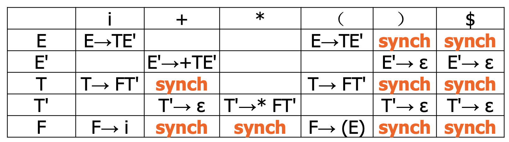

对字符串`*n*+n`进行分析

| 步骤 | 分析栈  | 剩余输入字符串 | 动作                             |
| ---- | ------- | -------------: | -------------------------------- |
| 1    | $E      |       `*n*+n`$ | **empty**, skip input, 输出error |
| 2    | $E      |          n*+n$ | 输出 E→TE’                       |
| 3    | $E’T    |          n*+n$ | 输出 T→ FT’                      |
| 4    | $E’T’F  |          n*+n$ | 输出 F→ n                        |
| 5    | $E’T’n  |          n*+n$ | n匹配                            |
| 6    | $E’T’   |           *+n$ | 输出 T'→*FT'                     |
| 7    | $E’T’F* |           *+n$ | *匹配                            |
| 8    | $E’T’F  |            +n$ | **synch**, skip top, 输出error   |
| 9    | $E’T’   |            +n$ | 输出 T'→ ε                       |
| 10   | $E’     |            +n$ | 输出 E'→+TE’                     |
| 11   | $E’T+   |            +n$ | +匹配                            |
| 12   | $E’T    |             n$ | 输出 T→ FT’                      |
| 13   | $E'T'F  |             n$ | 输出F→n                          |
| 14   | $E'T'n  |             n$ | n匹配                            |
| 15   | $E'T'   |              $ | 输出 T’→ ε                       |
| 16   | $E'     |              $ | 输出 E’→ ε                       |
| 17   | $       |              $ | END                              |

## 自底向上分析 Bottom-Up Parsing

> 定义：从输入符号串开始，逐步进行归约，直至归约到文法的开始符号。

自底向上与自顶向下的关系

- 自底向上分析的归约过程是自顶向下推导的逆过程。
- **最右推导**为**规范推导**，所以**自左向右的归约**称为**规范归约**

> 自底向上分析的主要问题：
>
> 如何确定选用哪个产生式（即，如何确定可归约串）
>
> 答案是：**句柄**就是可归约串

### 移进-归约分析 Shift-Reduce Parsing

> 移进-归约分析与LL(1)分析方向相反，但是都是table- driven，都需要用栈和输入串

##### Example1: 移进-归约分析

文法G[S]: S→aBcDe，B→Bb|b，D→d，对输入串abbcde进行移进-归约分析

###### Answer

| 步骤 | 符号栈 | 输入符号串 | 动作        |
| ---- | ------ | ---------: | ----------- |
| 1    | $      |    abbcde$ | 移进a       |
| 2    | $a     |     bbcde$ | 移进b       |
| 3    | $ab    |      bcde$ | 归约B→b     |
| 4    | $aB    |      bcde$ | 移进b       |
| 5    | $aBb   |       cde$ | 归约B→Bb    |
| 6    | $aB    |       cde$ | 移进c       |
| 7    | $aBc   |        de$ | 移进d       |
| 8    | $aBcd  |         e$ | 归约D→d     |
| 9    | $aBcD  |         e$ | 移进e       |
| 10   | $aBcDe |          $ | 归约S→aBcDe |
| 11   | $S     |          $ | ACCEPT      |

##### Example2: 移进-归约分析

根据文法
$$
G[E]: E→E+E|E×E|(E)|n
$$
对输入串$n+n×n$，进行移进-归约分析

###### Answer

| 步骤 | 符号栈             |         输入字符串 | 动作                                    |
| ---- | ------------------ | -----------------: | --------------------------------------- |
| 1    | $\$ $              | $n+n \times n \$ $ | 移进                                    |
| 2    | $\$ n$             |  $+n \times n \$ $ | 归约 $E \rightarrow n$                  |
| 3    | $\$ E$             |  $+n \times n \$ $ | 移进                                    |
| 4    | $\$ E+$            |   $n \times n \$ $ | 移进                                    |
| 5    | $\$ E+n$           |    $ \times n \$ $ | 归约 $E \rightarrow n$                  |
| 6    | $\$ E+E$           |    $ \times n \$ $ | 归约 $E \rightarrow E+E$                |
| 7    | $\$ E$             |    $ \times n \$ $ | ERROR   |
| 6'   | $ \$ E+E$          |    $ \times n \$ $ | 移进                                    |
| 7'   | $ \$ E+E \times$   |           $ n \$ $ | 移进                                    |
| 8    | $ \$ E+E \times n$ |             $ \$ $ | 归约 $E \rightarrow n$                  |
| 9    | $ \$ E+E \times E$ |             $ \$ $ | 归约 $E \rightarrow E \times E$         |
| 10   | $ \$ E+E$          |             $ \$ $ | 归约 $E \rightarrow E+E$                |
| 11   | $\$ E$             |             $ \$ $ | ACCEPT |

> [!NOTE]
>
> 步骤7的ERROR是因为：符号栈中**已经得到了开始符号E**，但是输入字符串里面还有字符，所以ERROR
>
> 为此，**步骤6‘ 就恢复到了步骤6**，然后继续分析

### 算符优先分析 Operator-Precedence Parsing

> **算法文法**：
>
> 设有上下文无关文法G，如果G中产生式的右部没有**两个非终结符**相连，则称G为算符文法
>
> 算符文法中不含$\varepsilon$产生式

例如：

$G[E]：E→E+E|E×E|(E)|i $ 是算符文法

$G[E]：E→EAE|(E)|−E|id$ **不是**算符文法 （因为 $EAE$ 有两个非终结符相连）

##### Example

#### 优先函数

算符优先关系表又叫优先矩阵

算符的优先关系除了使用优先矩阵来表示之外，还可以使用**优先函数**来表示。

##### 优先函数构造方法

#### 优先矩阵 VS 优先函数

### LR(k)语法分析

目前最流行的自底向上语法分析器都是基于LR(k)语法分析，其中

- **L**表示从左到右扫描输入串

- **R**表示最左归约（即最右推导的逆过程）

- **k**表示向前查看输入串符号的个数

  - 当k=1时，能满足当前绝大多数高级语言编译程序的需要，所以着重介绍 LR(0), SLR(1), LR(1), LALR(1)方法

  - 省略(k)时，一般指k=1

> **LR(k) ** *VS* **LL(k)**
>
> LR(k)：只要在一个最右句型中看到某个产生式右部，再向前看k个符号就可以决定是否使用这个产生式进行归约
>
> LL(k)： 要向前查看某个产生式右部推导出的串的前k个符号，才能决定是否使用这个产生式进行推导

### LR(0)分析

> **LR(0)分析**
>
> 根据当前符号栈中的符号串和向前顺序查看输入串的**0**个符号就可**唯一地**确定句柄以进行归约，即，仅凭符号栈中的符号串即可确定句柄，做出归约决定，不需要向前查看输入符号

#### 项目 Item

> 在文法G中每个产生式右部的适当位置添加一个**圆点**构成项目

简单地说，在产生式右部的 *字母前* 或 *字母后* 或 *字母之间* 加上一个圆点，就构成一个项目

##### Example

对于产生式 $A \rightarrow XYZ$，有4个项目：
$$
A \rightarrow \vdot XYZ \\
A \rightarrow X \vdot YZ \\
A \rightarrow XY \vdot Z \\
A \rightarrow XYZ \vdot \\
$$
注意：产生式$A \rightarrow \varepsilon$，只有1个项目 $A \rightarrow \vdot$ 

##### 项目的含义

- 圆点的**左边**是分析过程中**已经识别**的部分。例如：$A \rightarrow X \vdot YZ$ 说明$X$已经被识别，$A \rightarrow XYZ \vdot $说明产生式的右部都已经被识别，说明句柄已形成，可以归约成$A$
-  圆点的**右边**是分析过程中**未被识别**的部分。例如：$A \rightarrow XY \vdot Z$说明还有$Z$未被识别， $A \rightarrow \vdot XYZ$ 说明全部都未被识别

#### LR(0) 分析表

- 动作表**(ACTION)** ：表示当前状态下面临输入符（**终结符和$**）应做的动作是移进、归约、接受或出错

- 转换表**(GOTO)**：表示在当前状态下面临文法符号 （可能是**终结符或非终结符**）时应转向的下一个状态

- 把关于终结符部分的GOTO表和ACTION表重叠，也就是把当前状态下面临终结符应做的移进-归约动作和转向动作表示在一起

#### LR(0) 分析过程

① **拓广文法**：对文法G[S]，**增加一条产生式S’→S**，拓广为文法G’[S’]

② 根据产生式**构造LR(0)项目集**：CLOSURE函数和GOTO函数

③ 根据项目集**构造LR(0)DFA** （②和③可以合并）

④ 根据LR(0)DFA**构造LR(0)分析表**

⑤ 根据LR(0)分析表进行**LR(0)分析**

##### CLOSURE函数求法

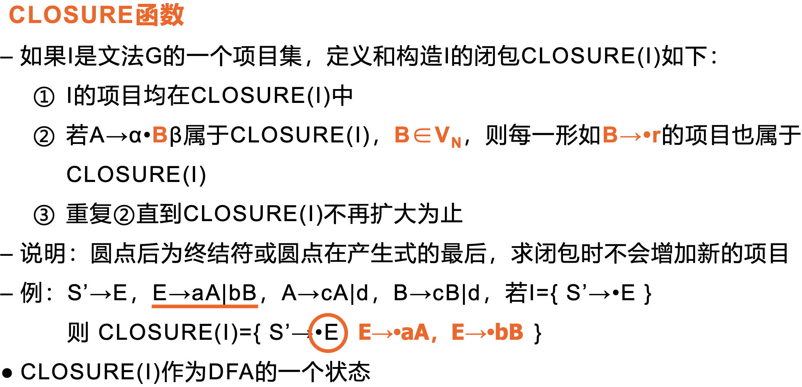

##### GOTO函数求法

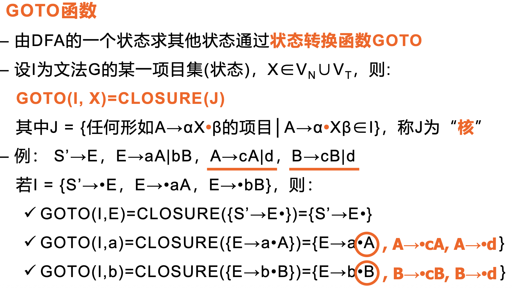

##### Example: LR(0)

对以下文法进行LR(0)分析：
$$
G[E]: \; E→aA|bB, A→cA|d, B→cB|d
$$

###### Step 1: 拓广文法

$$
G'[S']: \; S'→E, E→aA|bB, A→cA|d, B→cB|d
$$

###### Step2: 构造LR(0)DFA

> [!CAUTION]
>
> 注意：
>
> - 这里的每一个绿色框就是一个CLOSURE函数，也是DFA的一个状态
>
> - 状态之间的转换关系就是一个GOTO函数

###### Step3: 根据LR(0)DFA构造LR(0)分析表

对产生式进行编号

> [!NOTE]
>
> 构造LR(0)分析表方法：看着DFA图来填
>
> 对于一个转移的项目$I_i \xrightarrow{X} I_j $ ($i,j$是项目编号)
>
> If: X是终止符(即，$X \in V_{T}$)，则在 $ACTION[i, X]$ 处填写 $S_j$
>
> If: X是非终止符(即，$X \in V_{N}$)，则在 $GOTO[i,X]$ 处填写 $j$
>
> 对于一个可归约的项目(即，圆点在最右边)，则在$ACTION$表的第$i$行填写用于归约的产生式（全行都写！）
>
> 对于含有开始符号，并且圆点在最右边的项目（说明已经归约完成了），则在$ACTION[i,\$]$处填写 **acc** (接受)

> [!CAUTION]
>
> 注意：状态**从0开始**编号

###### Step4: 根据LR(0)分析表进行LR(0)分析

| 步骤 | 状态栈   | 符号栈 | 输入串 | ACTION | GOTO | 解释（不用写在答案中）                                       |
| ---- | -------- | ------ | -----: | ------ | ---- | ------------------------------------------------------------ |
| 1    | 0        | `$` | `bccd$` | $S_3$  |      |$ACTION[0,b]=S_3$|
| 2    | 03       | `$b` |  `ccd$` | $S_8$  |      |$ACTION[3,c]=S_8$|
| 3    | 038      | `$bc` |   `cd$` | $S_8$  |      |$ACTION[8,c]=S_8$|
| 4    | 0388     | `$bcc` | `   d$` | $S_9$  |      |$ACTION[8,d]=S_9$|
| 5    | 03889    | `$bccd` |     `$` | $r_6$  | 11   |$ACTION[9,\$]=r_6$, 从两个栈弹出1个元素，并且进行归约$B \rightarrow d$, 将B入符号栈；然后$GOTO[8,B]=11$|
| 6    | 0388(11) | `$bccB` |    ` $` | $r_5$  | 11   |$ACTION[11,\$]=r_5$, 从两个栈弹出2个元素，并且进行归约$B \rightarrow cB$, 将B入符号栈；然后$GOTO[8,B]=11$|
| 7    | 038(11)  | `$bcB` |    ` $` | $r_5$  | 7    |$ACTION[11,\$]=r_5$, 从两个栈弹出2个元素，并且进行归约$B \rightarrow cB$, 将B入符号栈；然后$GOTO[3,B]=7$|
| 8    | 037      | `$bB` |     `$` | $r_2$  | 1    |$ACTION[7,\$]=r_2$, 从两个栈弹出2个元素，并且进行归约$E \rightarrow cB$, 将E入符号栈；然后$GOTO[0,E]=1$|
| 9    | 01       | `$E ` |     `$` | acc    |      |$ACTION[1,E]=acc$|

#### LR(0)分析存在的问题

- 移进-归约冲突：移进项目A→α•aβ和归约项目B→r•同在一个项目集中，当面临输入符a时，不能确定移进a还是把r归约为B；
- 归约-归约冲突：归约项目A→β•和归约项目B→r•同在一个项目集中，不管面临什么输入符都不能确定把β归约为A还是把r归约为B。

例如：

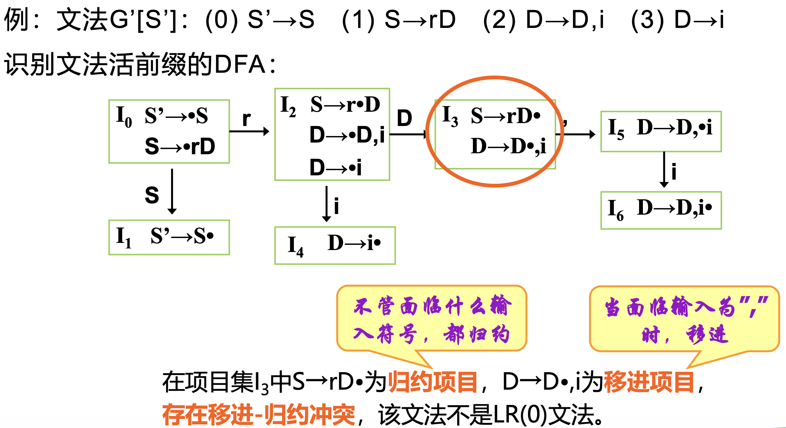

### SLR(1)分析

基本思想：对于LR(0)**有冲突**的项目集用向前查看输入符号串的**1**个符号的办法加以解决

解决方法：对归约项目$A→r \vdot$，只有当输入符号$a \in \text{FOLLOW}(A)$才进行归约，缩小归约范围，有可能解决冲突

> SLR(1)分析(Simple LR(1)分析)，之所以Simple是因为：只对有冲突的状态才向前查看一个符号，以确定动作。

> 简而言之，SLR(1)分析只有在遇到**FOLLOW集中的符号**时，才会归约

##### Example：SLR(1)分析

文法G’[S’]：(0) S’→S (1) S→rD (2) D→D,i (3) D→i

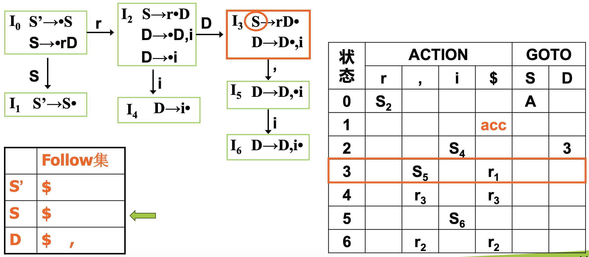

#### SLR(1)分析存在的问题

同一个项目集里，**FOLLOW集与移进符号集的交集不为空**，SLR(1)分析无法解决冲突

例如：

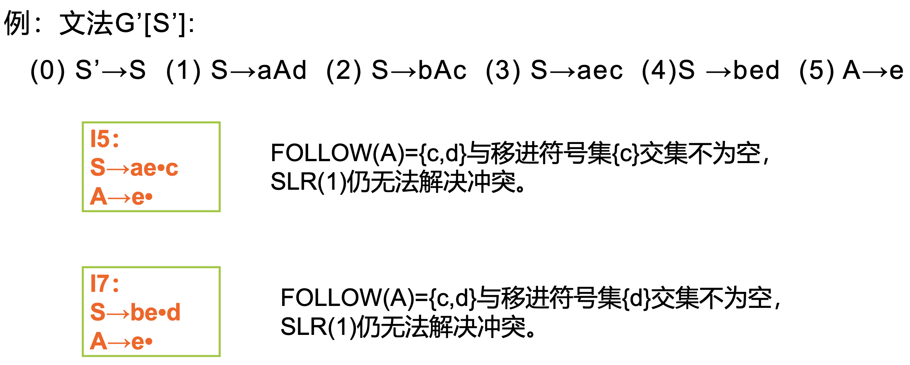

### LR(1)分析

#### LR(1)项目

形式：$[A \rightarrow \alpha \vdot \beta, a]$

在LR(0)项目的基础上增加一个终结符，这个终结符称为**向前搜索符（lookahead）**

> **向前搜索符（lookahead）**：
>
> 表示产生式的右部完整匹配后，允许在**剩余符号串**中的**下一个**终结符

对于一个形如$[A \rightarrow \alpha \vdot \beta, a]$的LR(1)项目，只有当下一个输入符号是a时才能归约。

例如：

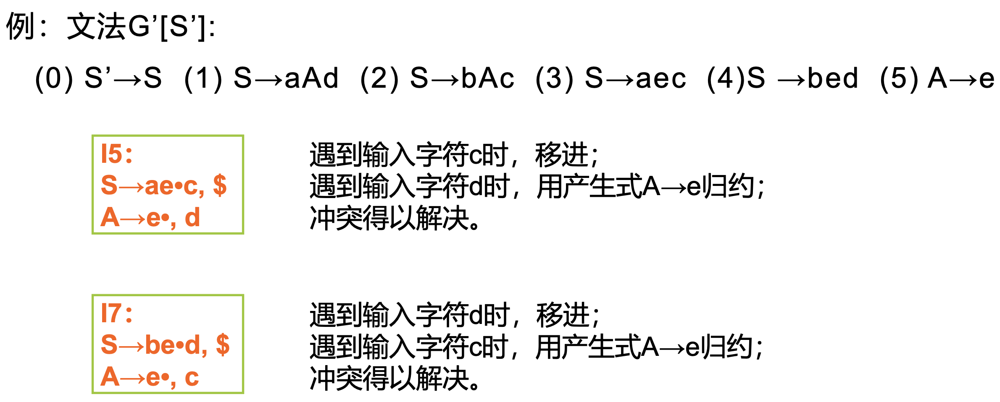

##### 如何确定向前搜索符（lookahead）？

Step1: **初始化**：首先，规定初始项目集[S’→•S, $]，向前搜索符就是`$`

Step2: 对于项目集I，计算它的CLOSURE(I)

> 若有项目 $[A \rightarrow \alpha \vdot B \beta, a]$ 属于CLOSURE(I)，$B \rightarrow \gamma$是文法的产生式，$\gamma \in V^{*}$，
>
> $b \in FIRST( \beta a)$，则$[B \rightarrow \gamma, b]$也属于CLOSURE(I)

Step3: 重复Step2，直至CLOSURE(I)不再扩大为止。

##### Example: 确定向前搜索符

对于以下文法G'[S']:

(0) S'→E

(1) E→E+T 

(2) E→T 

(3) T→T*digit

(4) T→digit

确定项目集$I_0$以及其中的向前搜索符。

###### Answer

确定项目集$I_0$以及其中的向前搜索的整体流程如下图

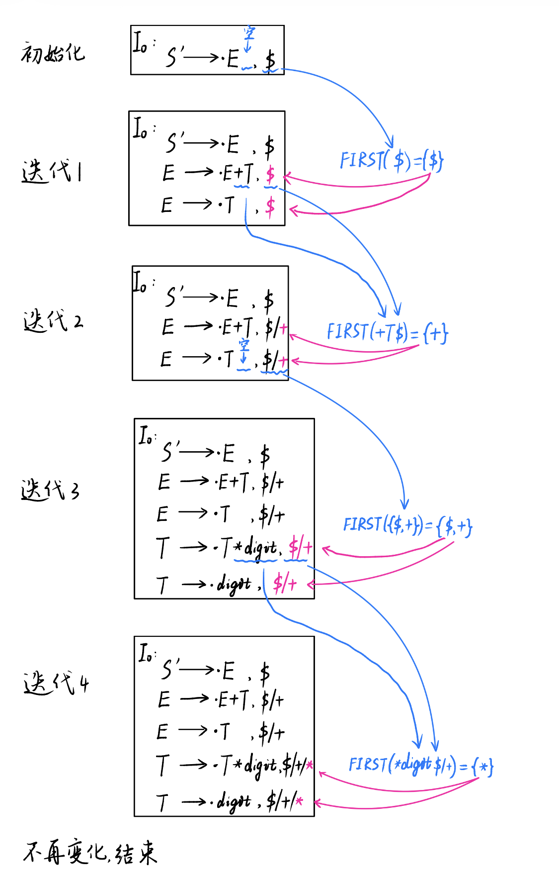

##### Example: LR(1)分析!

若文法G’[S']为：

(0) S’→S 

(1) S→BB 

(2) B→aB 

(3) B→b

请画出其对应的LR(1)DFA，构造LR(1)分析表，然后对输入串ab进行分析。

###### Answer

画出其对应的LR(1)DFA

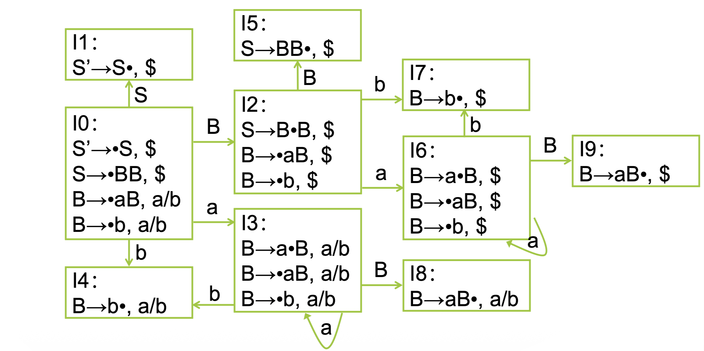

构造LR(1)分析表

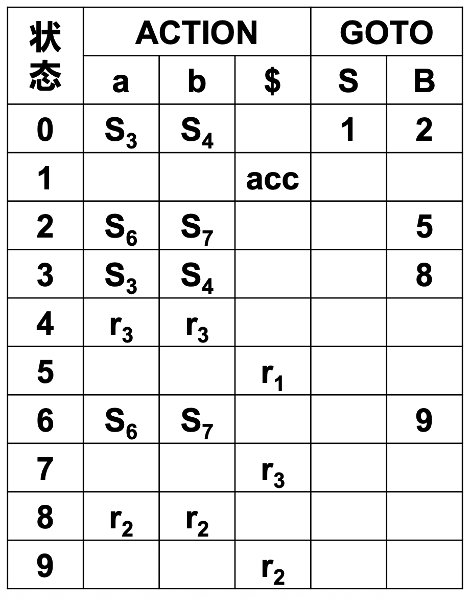

对输入串ab进行分析

| 步骤 | 状态栈 | 符号栈 | 输入串 | ACTION | GOTO |
| ---- | ------ | ------ | -----: | ------ | ---- |
| 1    | 0      | `$`    |  `ab$` | S3     |      |
| 2    | 03     | `$a`   |   `b$` | S4     |      |
| 3    | 034    | `$ab`  |    `$` | ERROR  |      |

### LALR(1)分析

对于LR(1)分析，合并同心集后，可以得到LALR(1)分析

##### Example: LALR(1)分析

若文法G’[S']为：

(0) S’→S 

(1) S→BB 

(2) B→aB 

(3) B→b

根据前面得到的LR(1)分析DFA（如下图所示），合并同心集，得到LALR(1)分析的DFA，然后写出LALR(1)预测分析表，最后对输入串ab进行分析。

###### Answer

发现以下同心集可以合并

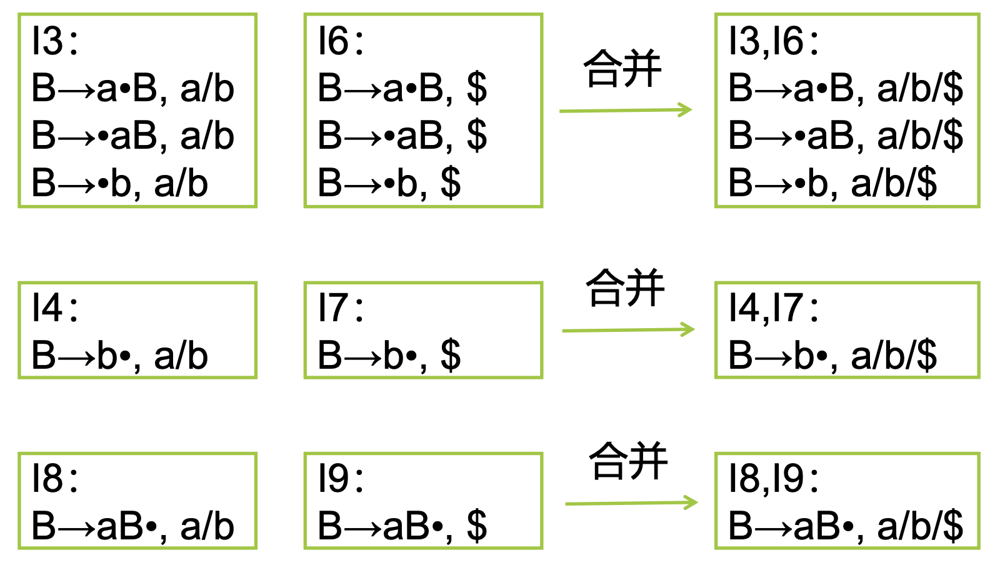

合并后得到LALR(1)分析的DFA，如下所示。

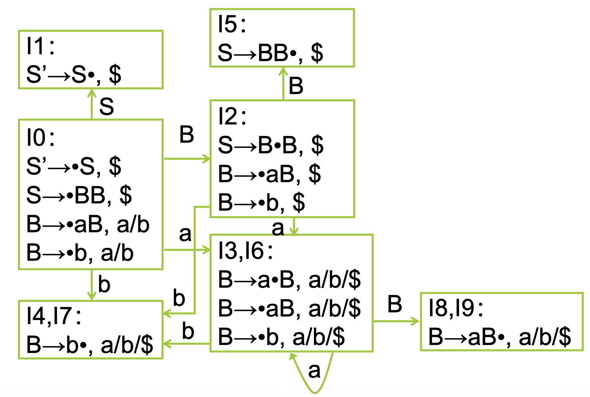

对应的LALR(1)预测分析表为：

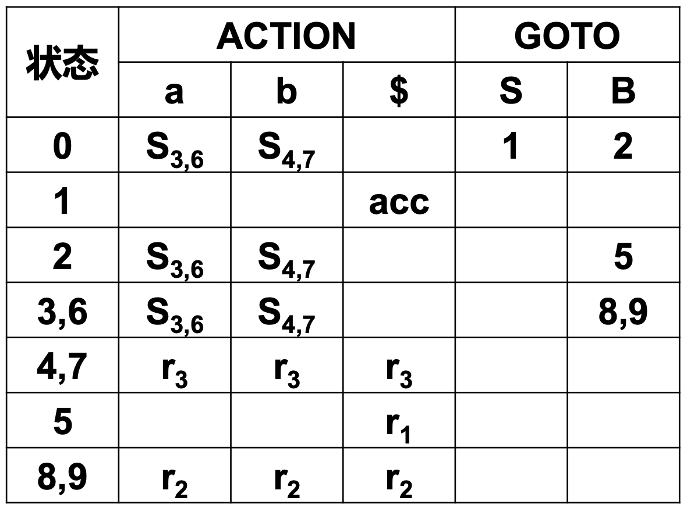

对输入串ab进行分析

| 步骤 | 状态栈      | 符号栈 | 输入串 | ACTION    | GOTO |
| ---- | ----------- | ------ | -----: | --------- | ---- |
| 1    | 0           | `$`    |  `ab$` | $S_{3,6}$ |      |
| 2    | 0(3,6)      | `$a`   |   `b$` | $S_{4,7}$ |      |
| 3    | 0(3,6)(4,7) | `$ab`  |    `$` | r3        | 8,9  |
| 4    | 0(3,6)(8,9) | `$aB`  |    `$` | r2        | 2    |
| 5    | 02          | `$B`   |    `$` | ERROR     |      |

> [!NOTE]
>
> 对比LR(1)分析和LALR(1)分析：
>
> - LR(1)分析在第**3**步就发现错误
> - LALR(1)分析在第**5**步才发现错误
>
> 原因：**LALR(1)**分析合并同心集后，向前搜索符集合扩大了，因此推迟发现错误

### 验证文法是否为某一个文法

##### Example!

请验证以下文法是LR(0)文法或SLR(1)文法或LR(1)文法或LALR(1)文法

文法G’[S’]:

(0) S’→S 

(1) S→aAd

(2) S→bBd 

(3) S→aBe 

(4) S→bAe 

(5) A→c 

(6) B→c

###### Answer

1.验证是否为**LR(0)**文法：

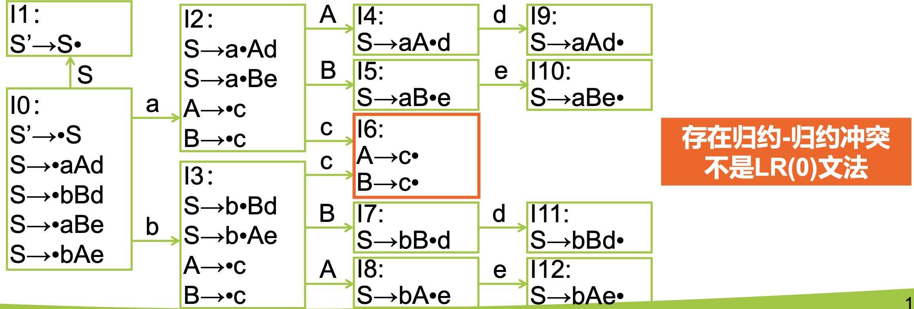

2.验证是否为**SLR(1)**文法：

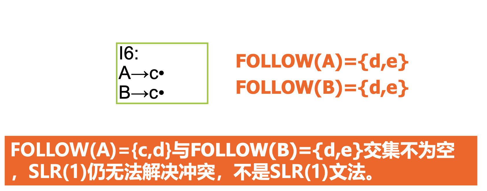

3.验证是否为**LR(1)**文法

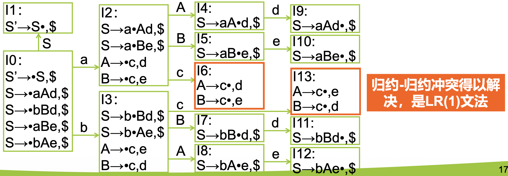

4.可再进一步验证是否为**LALR(1)**文法：

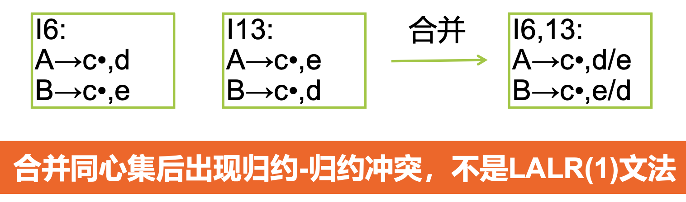

### 各个LR文法之间的关系

一个文法是LR(0)文法，就一定也是SLR(1)文法，也是LR(1)文法，反之则不一定成立

**LR(0)文法**：利用LR(0)分析时，没有移进-归约冲突，也没有归约-归约冲突

若有冲突，则尝试利用SLR(1)分析

**SLR(1)分析**：只有当出现冲突时，才向后看一个符号。

**SLR(1)文法**：利用SLR(1)分析时，没有移进-归约冲突（即，移进集 和 FOLLOW集 的交集为空），也没有归约-归约冲突（即，两个FOLLOW集的交集为空）

若有冲突，则尝试利用LR(1)分析

**LR(1)分析**：引入向前搜索符

**LR(1)文法**：利用LR(1)分析时，没有移进-归约冲突，也没有归约-归约冲突

若有冲突，则尝试利用LR(k)分析 ($k \geq 2$)

如果一个文法时**LR(1)文法**，则可以进一步判断是不是**LALR(1)文法**

**LALR(1)分析**：在LR(1)分析的基础上，合并同心集

**LALR(1)文法**：合并同心集后，没有归约-归约冲突。
