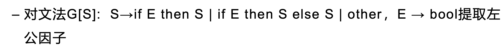

# Chapter 4 Syntax Analysis 语法分析

自顶向下分析

自底向上分析

## 自顶向下分析 Top-Down parsing

### 改写文法 

目的：通过改写文法，消除不确定性/无限循环

有3种改写文法的方式：

1. 提取左公因子
2. 消除左递归
   - 消除直接左递归
   - 消除间接左递归
3. 消除二义性
4. 消除$\varepsilon$产生式

#### 提取左公因子

##### 规则

对于产生式 $A \rightarrow \alpha\beta | \alpha \gamma$，提取左公因子得$A \rightarrow \alpha (\beta|\gamma)$

然后引入新的非终结符$A^\prime$, $A^\prime \rightarrow \beta|\gamma$

最终将文法改写为：$A \rightarrow \alpha A^\prime, \; A^\prime \rightarrow \beta|\gamma$

##### 一般形式

> 对于产生式 $A \rightarrow \alpha\beta_1 | \alpha \beta_2 | \cdots | \alpha \beta_n$，提取左公因子得 $A \rightarrow \alpha (\beta_1|\beta_2|\cdots|\beta_n)$
>
> 引进新的非终结符$A^\prime$, $A^\prime \rightarrow \beta_1|\beta_2|\cdots|\beta_n$
>
> 最终将文法改写为：$A \rightarrow \alpha A^\prime, \; A^\prime \rightarrow \beta_1|\beta_2|\cdots|\beta_n$

##### Example

------

Answer:

**提取左公因子**
$$
S \rightarrow \text{if E then S} (\varepsilon|\text{else S})|\text{other}
$$
**引入新的非终结符**$S^\prime$, 得到改写后的文法
$$
S \rightarrow \text{if E then S} S^\prime \\
S^\prime \rightarrow \varepsilon|\text{else S} \\
E \rightarrow bool
$$

#### 消除直接左递归

##### 规则

对于产生式 $A \rightarrow A \alpha | \beta$, 它对应的语言是 $\beta, \beta \alpha, \beta \alpha \alpha,\cdots$

引入新的非终结符$A^\prime$, $A^\prime \rightarrow \alpha A^\prime | \varepsilon$

最终将文法改写为：$A \rightarrow \beta A^\prime, \; A^\prime \rightarrow \alpha A^\prime | \varepsilon$

##### 一般形式

> 对于产生式 $A \rightarrow A \alpha_1 | A \alpha_2| \cdots | A \alpha_m | \beta_1 | \beta_2 | \cdots | \beta_n|$, 
>
> 引入新的非终结符$A^\prime$, 
>
> 最终将文法改写为：
> $$
> A \rightarrow \beta_1 A^\prime | \beta_2 A^\prime|\cdots |\beta_n A^\prime \\
> A^\prime \rightarrow \alpha_1 A^\prime | \alpha_2 A^\prime | \cdots | \alpha_m A^\prime | \varepsilon
> $$

##### Example

------

Answer

对于$E \rightarrow E + T | T$, 引入 $E^\prime$ 消除左递归得： $E \rightarrow TE^\prime, \; E^\prime \rightarrow +T E^\prime| \varepsilon$

对于$T \rightarrow T*F|F$, 引入 $T^\prime$ 消除左递归得：$T \rightarrow FT^\prime, \; T^\prime \rightarrow *F T^\prime| \varepsilon $

最终将文法改写为：
$$
E \rightarrow TE^\prime \\
E^\prime \rightarrow +T E^\prime| \varepsilon \\
T \rightarrow FT^\prime \\
T^\prime \rightarrow *F T^\prime| \varepsilon \\
F \rightarrow (E)|n
$$

#### 消除间接左递归

##### 规则

将间接左递归变成直接左递归，然后再用直接左递归的方法消除

##### 具体步骤

##### Example

------

Answer1:

**Step1: 将所有非终结符按任一顺序排列**  

R，Q，S

**Step2: 逐个处理非终结符（代入产生式，消除直接左递归）**

对于R：产生式(3)不含直接左递归，不处理

对于Q：把(3)式代入(2)式，得 $(4) Q \rightarrow Sab | ab |b$，无直接左递归，不处理

对于S：把(4)式代入(1)式，得 $S \rightarrow Sabc | abc |bc | c$，有直接左递归，消除直接左递归得$S \rightarrow abcS^\prime | bc S^\prime | cS^\prime, \; S^\prime \rightarrow abcS^\prime|\varepsilon$

**Step3: 去掉无用产生式**

由于Q，R是不可到达的非终结符，所以删除它们的产生式，即删除(2),(3)

最终得文法 $G^\prime[S]$
$$
S \rightarrow abcS^\prime | bc S^\prime | cS^\prime \\ 
S^\prime \rightarrow abcS^\prime|\varepsilon
$$

------

Answer2:

**Step1: 将所有非终结符按任一顺序排列**  

S, Q, R

**Step2: 逐个处理非终结符（代入产生式，消除直接左递归）**

对于S：产生式(1)不含直接左递归，不处理

对于Q：产生式(2)不含直接左递归，不处理

对于R：把(1)式代入(3)式，得 $(4)R \rightarrow Qca|ca|a$ ;

再把 (2)代入(4)式，得 $R \rightarrow Rbca|bca|ca|a$ ;

有直接左递归，消除直接左递归得$R \rightarrow bca R^\prime | ca R^\prime | aR^\prime, \; R^\prime \rightarrow bcaR^\prime|\varepsilon$

**Step3: 去掉无用产生式**

由于Q，R是不可到达的非终结符，所以删除它们的产生式，即删除(1),(2)

最终得文法 $G^\prime[R]$
$$
R \rightarrow bca R^\prime | ca R^\prime | aR^\prime \\
R^\prime \rightarrow bcaR^\prime|\varepsilon
$$

#### 消除二义性

#### 消除$\varepsilon$产生式

##### 规则

如果产生式右边含有 $\varepsilon$, 则把它替换成实际可能出现的结果

##### Example1

------

Answer：

$A \rightarrow Ac|Sd|\varepsilon$ 中含有 $\varepsilon$, 因此：

根据$A \rightarrow Ac$ 和 $A \rightarrow \varepsilon$ ,可得 $A \rightarrow c$

根据 $S \rightarrow Aa$ 和 $A \rightarrow \varepsilon$, 可得 $S \rightarrow a$

综上，文法可改写为：
$$
S \rightarrow Aa|b|a \\
A \rightarrow Ac|Sd|c 
$$

##### Example2

------

Answer：

$S \rightarrow aSbS|bSaS|\varepsilon$ 中含有 $\varepsilon$, 因此：

根据 $S \rightarrow aSbS$ 和 $S \rightarrow \varepsilon$, 可得 $S \rightarrow ab|aSb|abS$

根据 $S \rightarrow bSaS$ 和 $S \rightarrow \varepsilon$, 可得 $S \rightarrow ba|bSa|baS$

注意到这里 $S$ 还是开始符号，由开始符号有$S \rightarrow \varepsilon$,所以要另外补充 $S^\prime \rightarrow S|\varepsilon$

综上，文法可改写为：
$$
S^\prime \rightarrow S|\varepsilon \\
S \rightarrow ab|aSb|abS|aSbS|ba|bSa|baS|bSaS
$$

### FIRST集（开始符号集）

文法符号串 $\beta$ 的开始符号集 $FIRST(\beta)$ 是由 $\beta$ 推导出的开头的终结符（**包括 $\varepsilon$**）组成的.

计算方法

##### Example

Answer

### **FOLLOW**集（后跟符号集）

计算方法

##### Example

Answer

### LL(1)文法

#### 含义

第一个L：从左到右扫描输入串

第二个L：分析过程用最左推导

1: 只需**向前看1个符号**便可以决定选哪个产生式进行推导；类似地LL(k)文

法需要向前看K个符号才可以确定选用哪个产生式。

#### 充分必要条件

一个上下文无关文法是LL(1)文法的充分必要条件是：若存在产生式 $A \rightarrow \alpha | \beta$，则有：

- $FIRST(\alpha) \cap FIRST(\beta) = \empty$

- $\varepsilon \in FIRST(\beta) \Rightarrow FIRST(\alpha) \cap FOLLOW(A) = \emptyset$

注意：两个条件要同时满足

#### 预测分析表

特点：

- 二维表
- 每行表示非终结符，每列表示输入符号(终结符或结束符$)

含义：元素**M[A,a]**的内容是当非终结符**A**面临输入符号**a**(终结符或结束符$)时应选

取的产生式；当无产生式时，元素内容为转向出错处理

##### 构造算法

对于文法G的**每个产生式** $A \rightarrow \alpha$:

1. 对于$FIRST(\alpha)$ 中的每个终结符$a$，$A \rightarrow \alpha$将填入表$M[A,a]$中；
2. 如果ε$\in$ FIRST(A)，则对于 $FOLLOW(A)$ 中的每个终结符 $a$，将$A \rightarrow \alpha$填入表$M[A,a]$中；如果 $\text{\$} \in FOLLOW(A)$ ，也将$A \rightarrow \alpha$填入表$M[A,\$]$中。

##### Example

Answer

#### Table-Driven Parser

LL(1)预测分析算法

恐慌模式