# Chapter 4: Syntax Analysis 语法分析

类型：

- 自顶向下分析
- 自底向上分析

## 自顶向下分析 Top-Down parsing

### 对文法的要求

自顶向下分析 对文法有以下3个要求：

1. 产生式不能存在**左公因子**，否则无法唯一确定选用哪一个产生式往下推导。
2. 文法中不能存在**左递归**的产生式，否则会导致对该产生式的无限调用。
3. 文法不能存在**二义性**，否则推导过程不唯一

### 改写文法 

目的：通过改写文法，消除不确定性/无限循环

有3种改写文法的方式：

1. 提取左公因子
2. 消除左递归
   - 消除直接左递归
   - 消除间接左递归
3. 消除二义性
4. 消除$\varepsilon$产生式

#### 提取左公因子

##### 规则

对于产生式 $A \rightarrow \alpha\beta | \alpha \gamma$，提取左公因子得$A \rightarrow \alpha (\beta|\gamma)$

然后引入新的非终结符$A^\prime$, $A^\prime \rightarrow \beta|\gamma$

最终将文法改写为：$A \rightarrow \alpha A^\prime, \; A^\prime \rightarrow \beta|\gamma$

##### 一般形式

> 对于产生式 $A \rightarrow \alpha\beta_1 | \alpha \beta_2 | \cdots | \alpha \beta_n$，提取左公因子得 $A \rightarrow \alpha (\beta_1|\beta_2|\cdots|\beta_n)$
>
> 引进新的非终结符$A^\prime$, $A^\prime \rightarrow \beta_1|\beta_2|\cdots|\beta_n$
>
> 最终将文法改写为：$A \rightarrow \alpha A^\prime, \; A^\prime \rightarrow \beta_1|\beta_2|\cdots|\beta_n$

##### Example

对于文法G[S]: S→if E then S | if E then S else S | other, E →bool 提取左公因子

###### Answer

**提取左公因子**
$$
S \rightarrow \text{if E then S} (\varepsilon|\text{else S})|\text{other}
$$
**引入新的非终结符**$S^\prime$, 得到改写后的文法
$$
S \rightarrow \text{if E then S} S^\prime \\
S^\prime \rightarrow \varepsilon|\text{else S} \\
E \rightarrow bool
$$

#### 消除直接左递归

##### 规则

对于产生式 $A \rightarrow A \alpha | \beta$, 它对应的语言是 $\beta, \beta \alpha, \beta \alpha \alpha,\cdots$

引入新的非终结符$A^\prime$, $A^\prime \rightarrow \alpha A^\prime | \varepsilon$

最终将文法改写为：$A \rightarrow \beta A^\prime, \; A^\prime \rightarrow \alpha A^\prime | \varepsilon$

##### 一般形式

> 对于产生式 $A \rightarrow A \alpha_1 | A \alpha_2| \cdots | A \alpha_m | \beta_1 | \beta_2 | \cdots | \beta_n|$, 
>
> 引入新的非终结符$A^\prime$, 
>
> 最终将文法改写为：
> $$
> A \rightarrow \beta_1 A^\prime | \beta_2 A^\prime|\cdots |\beta_n A^\prime \\
> A^\prime \rightarrow \alpha_1 A^\prime | \alpha_2 A^\prime | \cdots | \alpha_m A^\prime | \varepsilon
> $$

##### Example

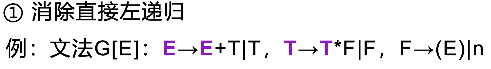

------

###### Answer

对于$E \rightarrow E + T | T$, 引入 $E^\prime$ 消除左递归得： $E \rightarrow TE^\prime, \; E^\prime \rightarrow +T E^\prime| \varepsilon$

对于$T \rightarrow T*F|F$, 引入 $T^\prime$ 消除左递归得：$T \rightarrow FT^\prime, \; T^\prime \rightarrow *F T^\prime| \varepsilon $

最终将文法改写为：
$$
E \rightarrow TE^\prime \\
E^\prime \rightarrow +T E^\prime| \varepsilon \\
T \rightarrow FT^\prime \\
T^\prime \rightarrow *F T^\prime| \varepsilon \\
F \rightarrow (E)|n
$$

#### 消除间接左递归

##### 规则

**将间接左递归变成直接左递归**，然后再用直接左递归的方法消除

##### 具体步骤

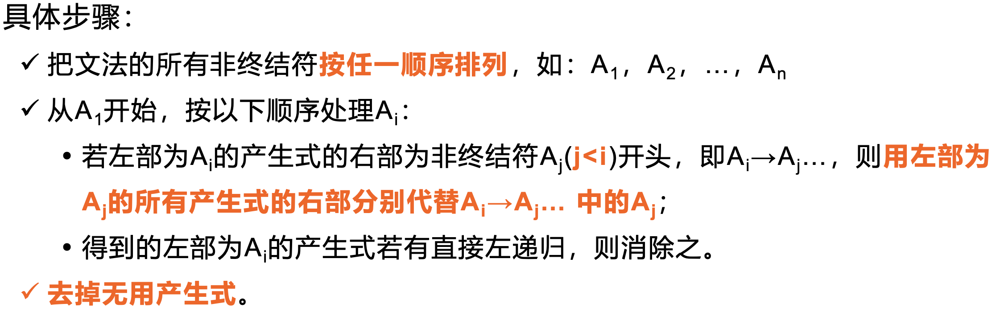

##### Example

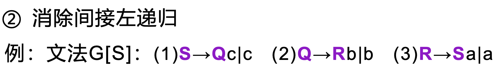

------

###### Answer1:

**Step1: 将所有非终结符按任一顺序排列**  

R，Q，S

**Step2: 逐个处理非终结符（代入产生式，消除直接左递归）**

对于R：产生式(3)不含直接左递归，不处理

对于Q：把(3)式代入(2)式，得 $(4) Q \rightarrow Sab | ab |b$，无直接左递归，不处理

对于S：把(4)式代入(1)式，得 $S \rightarrow Sabc | abc |bc | c$，有直接左递归，消除直接左递归得$S \rightarrow abcS^\prime | bc S^\prime | cS^\prime, \; S^\prime \rightarrow abcS^\prime|\varepsilon$

**Step3: 去掉无用产生式**

由于Q，R是**不可到达**的非终结符，所以**删除它们的产生式**，即删除(2),(3)

最终得文法 $G^\prime[S]$
$$
S \rightarrow abcS^\prime | bc S^\prime | cS^\prime \\ 
S^\prime \rightarrow abcS^\prime|\varepsilon
$$

------

###### Answer2:

**Step1: 将所有非终结符按任一顺序排列**  

S, Q, R

**Step2: 逐个处理非终结符（代入产生式，消除直接左递归）**

对于S：产生式(1)不含直接左递归，不处理

对于Q：产生式(2)不含直接左递归，不处理

对于R：把(1)式代入(3)式，得 $(4)R \rightarrow Qca|ca|a$ ;

再把 (2)代入(4)式，得 $R \rightarrow Rbca|bca|ca|a$ ;

有直接左递归，消除直接左递归得$R \rightarrow bca R^\prime | ca R^\prime | aR^\prime, \; R^\prime \rightarrow bcaR^\prime|\varepsilon$

**Step3: 去掉无用产生式**

由于Q，R是不可到达的非终结符，所以删除它们的产生式，即删除(1),(2)

最终得文法 $G^\prime[R]$
$$
R \rightarrow bca R^\prime | ca R^\prime | aR^\prime \\
R^\prime \rightarrow bcaR^\prime|\varepsilon
$$

> [!NOTE]
>
> 在 **Step1** 中，顺序是**任意**的

#### 消除二义性

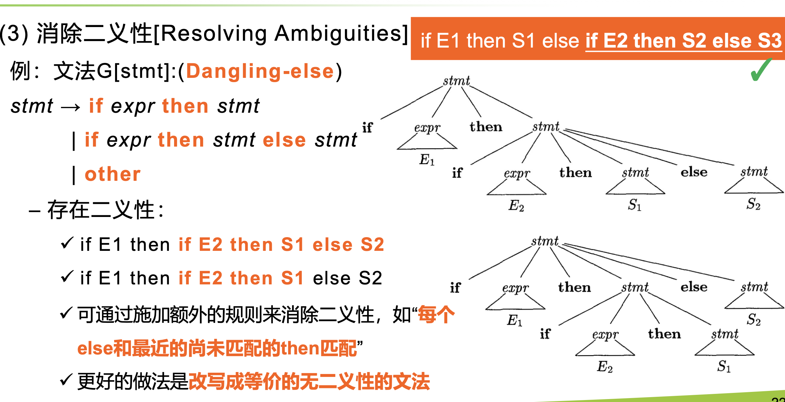

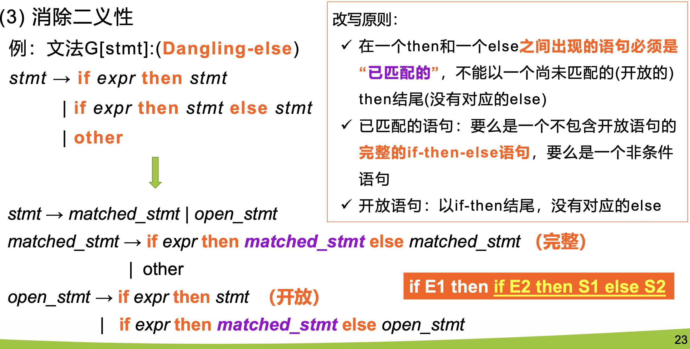

#### 消除$\varepsilon$产生式

##### 规则

如果产生式右边含有 $\varepsilon$, 则把它替换成实际可能出现的结果

##### Example1

###### Answer

$A \rightarrow Ac|Sd|\varepsilon$ 中含有 $\varepsilon$, 因此：

根据$A \rightarrow Ac$ 和 $A \rightarrow \varepsilon$ ,可得 $A \rightarrow c$

根据 $S \rightarrow Aa$ 和 $A \rightarrow \varepsilon$, 可得 $S \rightarrow a$

综上，文法可改写为：
$$
S \rightarrow Aa|b|a \\
A \rightarrow Ac|Sd|c 
$$

##### Example2 !

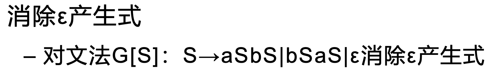

------

###### Answer

$S \rightarrow aSbS|bSaS|\varepsilon$ 中含有 $\varepsilon$, 因此：

根据 $S \rightarrow aSbS$ 和 $S \rightarrow \varepsilon$, 可得 $S \rightarrow ab|aSb|abS$

根据 $S \rightarrow bSaS$ 和 $S \rightarrow \varepsilon$, 可得 $S \rightarrow ba|bSa|baS$

注意到这里 $S$ 还是开始符号，由开始符号有$S \rightarrow \varepsilon$,所以要另外补充 $S^\prime \rightarrow S|\varepsilon$

综上，文法可改写为：
$$
S^\prime \rightarrow S|\varepsilon \\
S \rightarrow ab|aSb|abS|aSbS|ba|bSa|baS|bSaS
$$

### FIRST集（开始符号集）

文法符号串 $\beta$ 的开始符号集 $FIRST(\beta)$ 是由 $\beta$ 推导出的开头的**终结符**（**包括 $\varepsilon$**）组成的.

计算方法:

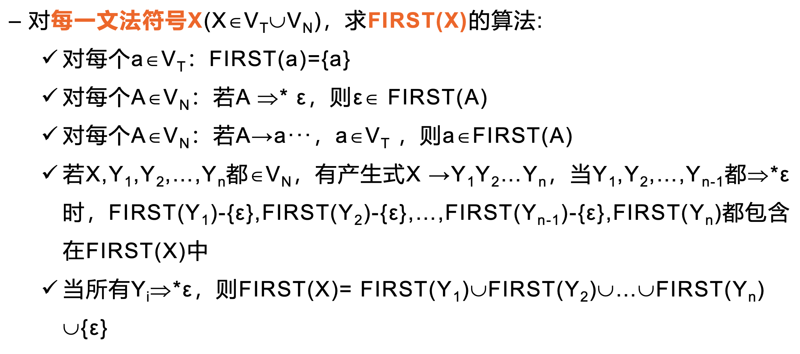

> 简而言之，如果X是终结符，那么FIRST(X)={X}
>
> 如果X是非终结符，那么FIRST(X)就等于所有由X能推导出的**首个非终结符的集合**

##### Example

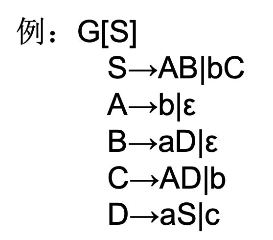

###### Answer

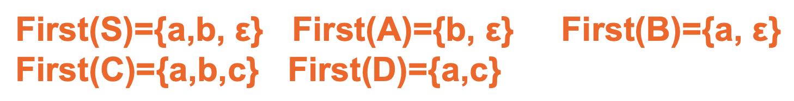

### **FOLLOW**集（后跟符号集）

计算方法：

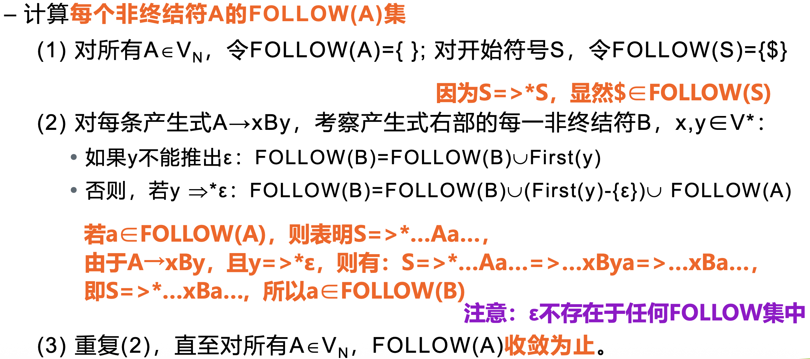

##### Example1!

求出FOLLOW集。

###### Answer

前面已经求出了FIRST集:

- FIRST(S) = {a, b, ε}
- FIRST(A) = {b, ε}
- FIRST(B) = {a, ε}
- FIRST(C) = {a, b, c, ε}
- FIRST(D) = {a, c}

下面开始求FOLLOW集：

| FOLLOW集 | 初始化 | 第1次迭代 |
| -------- | ------ | --------- |
| S        | $      | $         |
| A        |        | a, $, c   |
| B        |        | $         |
| C        |        | $         |
| D        |        | $         |

##### Example2!

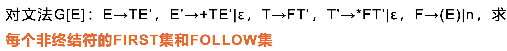

###### Answer

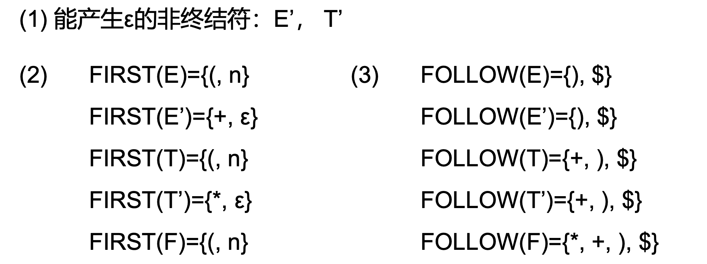

### LL(1)文法

#### 含义

第一个L：从左到右扫描输入串

第二个L：分析过程用最左推导

1: 只需**向前看1个符号**便可以决定选哪个产生式进行推导；类似地LL(k)文

法需要向前看K个符号才可以确定选用哪个产生式。

#### 充分必要条件

一个上下文无关文法是LL(1)文法的充分必要条件是：若存在产生式 $A \rightarrow \alpha | \beta$，则有：

- $FIRST(\alpha) \cap FIRST(\beta) = \empty$

- $\varepsilon \in FIRST(\beta) \Rightarrow FIRST(\alpha) \cap FOLLOW(A) = \emptyset$

注意：两个条件要同时满足

#### 预测分析表

特点：

- 二维表
- 每行表示非终结符，每列表示输入符号(终结符或结束符$)

含义：元素**M[A,a]**的内容是当非终结符**A**面临输入符号**a**(终结符或结束符$)时应选

取的产生式；当无产生式时，元素内容为转向出错处理

##### 构造算法

对于文法G的**每个产生式** $A \rightarrow \alpha$:

1. 对于$FIRST(\alpha)$ 中的每个终结符$a$，$A \rightarrow \alpha$将填入表$M[A,a]$中；
2. 如果ε$\in$ FIRST(A)，则对于 $FOLLOW(A)$ 中的每个终结符 $a$，将$A \rightarrow \alpha$填入表$M[A,a]$中；如果 $\text{\$} \in FOLLOW(A)$ ，也将$A \rightarrow \alpha$填入表$M[A,\$]$中。

##### Example

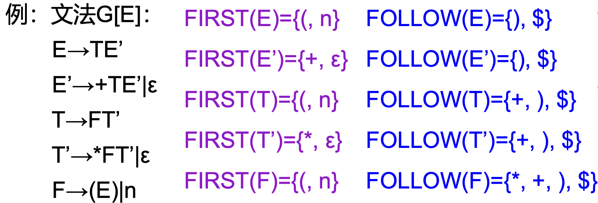

Answer

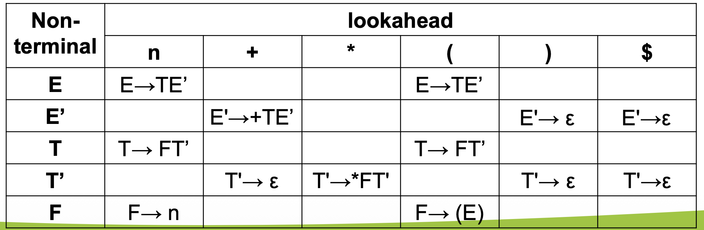

#### Table-Driven Parser

LL(1)预测分析算法

恐慌模式

## 自底向上分析 Bottom-Up Parsing

> 定义：从输入符号串开始，逐步进行归约，直至归约到文法的开始符号。

自底向上与自顶向下的关系

- 自底向上分析的归约过程是自顶向下推导的逆过程。

- **最右推导**为**规范推导**，所以**自左向右的归约**称为**规范归约**

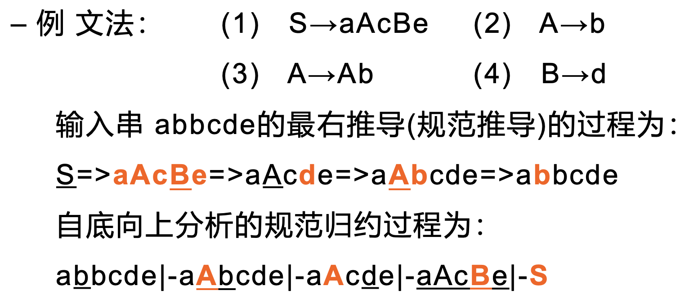

### 移进-归约分析 Shift-Reduce Parsing

##### Example

根据文法
$$
G[E]: E→E+E|E×E|(E)|n
$$
对输入串$n+n×n$，进行移进-归约分析

Answer：

| 步骤 | 符号栈             | 输入字符串         | 动作                                    |
| ---- | ------------------ | ------------------ | --------------------------------------- |
| 1    | $\$ $              | $n+n \times n \$ $ | 移进                                    |
| 2    | $\$ n$             | $+n \times n \$ $  | 归约 $E \rightarrow n$                  |
| 3    | $\$ E$             | $+n \times n \$ $  | 移进                                    |
| 4    | $\$ E+$            | $n \times n \$ $   | 移进                                    |
| 5    | $\$ E+n$           | $ \times n \$ $    | 归约 $E \rightarrow n$                  |
| 6    | $\$ E+E$           | $ \times n \$ $    | 归约 $E \rightarrow E+E$                |
| 7    | $\$ E$             | $ \times n \$ $    | ERROR   |
| 8    | $ \$ E+E$          | $ \times n \$ $    | 移进                                    |
| 9    | $ \$ E+E \times$   | $ n \$ $           | 移进                                    |
| 10   | $ \$ E+E \times n$ | $ \$ $             | 归约 $E \rightarrow n$                  |
| 11   | $ \$ E+E \times E$ | $ \$ $             | 归约 $E \rightarrow E \times E$         |
| 12   | $ \$ E+E$          | $ \$ $             | 归约 $E \rightarrow E+E$                |
| 13   | $\$ E$             | $ \$ $             | ACCEPT |

### 算符优先分析 Operator-Precedence Parsing

> **算法文法**：
>
> 设有上下文无关文法G，如果G中产生式的右部没有**两个非终结符**相连，则称G为算符文法
>
> 算符文法中不含$\varepsilon$产生式

例如：

$G[E]：E→E+E|E×E|(E)|i $ 是算符文法

$G[E]：E→EAE|(E)|−E|id$ **不是**算符文法 （因为 $EAE$ 有两个非终结符相连）

##### Example

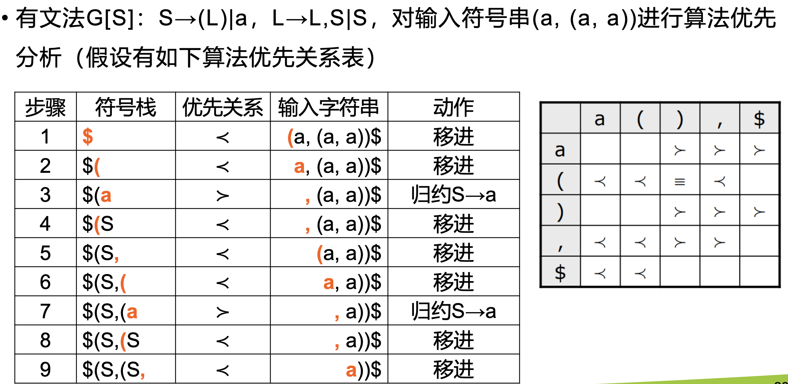

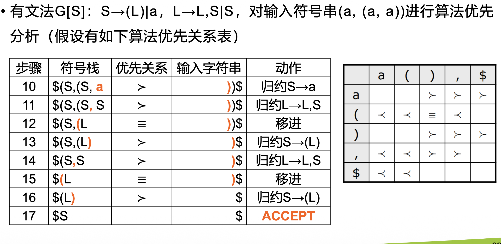

#### 优先函数

算符优先关系表又叫优先矩阵

算符的优先关系除了使用优先矩阵来表示之外，还可以使用**优先函数**来表示。

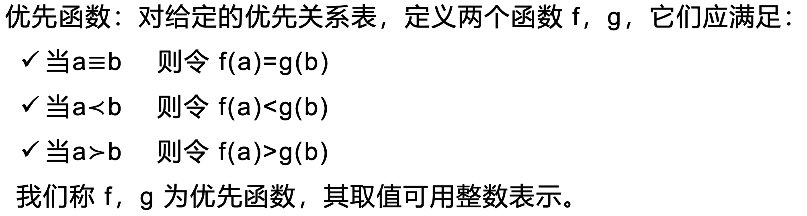

##### 优先函数构造方法

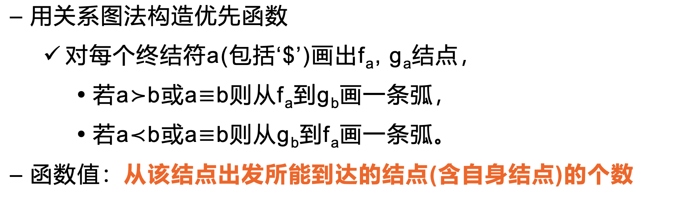

#### 优先矩阵 VS 优先函数

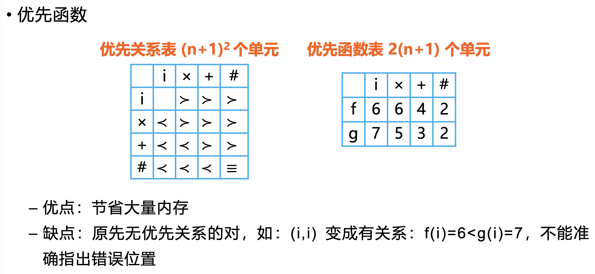

### LR(k)语法分析

目前最流行的自底向上语法分析器都是基于LR(k)语法分析，其中

- **L**表示从左到右扫描输入串

- **R**表示最左归约（即最右推导的逆过程）

- **k**表示向前查看输入串符号的个数

  - 当k=1时，能满足当前绝大多数高级语言编译程序的需要，所以着重介绍 LR(0), SLR(1), LR(1), LALR(1)方法

  - 省略(k)时，一般指k=1

> **LR(k) ** *VS* **LL(k)**
>
> LR(k)：只要在一个最右句型中看到某个产生式右部，再向前看k个符号就可以决定是否使用这个产生式进行归约
>
> LL(k)： 要向前查看某个产生式右部推导出的串的前k个符号，才能决定是否使用这个产生式进行推导

### LR(0)分析

> **LR(0)分析**
>
> 根据当前符号栈中的符号串和向前顺序查看输入串的**0**个符号就可**唯一地**确定句柄以进行归约，即，仅凭符号栈中的符号串即可确定句柄，做出归约决定，不需要向前查看输入符号

#### 项目 Item

> 在文法G中每个产生式右部的适当位置添加一个**圆点**构成项目

简单地说，在产生式右部的 *字母前* 或 *字母后* 或 *字母之间* 加上一个圆点，就构成一个项目

##### Example

对于产生式 $A \rightarrow XYZ$，有4个项目：
$$
A \rightarrow \vdot XYZ \\
A \rightarrow X \vdot YZ \\
A \rightarrow XY \vdot Z \\
A \rightarrow XYZ \vdot \\
$$
注意：产生式$A \rightarrow \varepsilon$，只有1个项目 $A \rightarrow \vdot$ 

##### 项目的含义

- 圆点的**左边**是分析过程中**已经识别**的部分。例如：$A \rightarrow X \vdot YZ$ 说明$X$已经被识别，$A \rightarrow XYZ \vdot $说明产生式的右部都已经被识别，可以归约成$A$
-  圆点的**右边**是分析过程中**未被识别**的部分。例如：$A \rightarrow XY \vdot Z$说明还有$Z$未被识别， $A \rightarrow \vdot XYZ$ 说明全部都未被识别

#### LR(0) 分析表

- 动作表**(ACTION)** ：表示当前状态下面临输入符（终结符和$）应做的动作是移进、归约、接受或出错

- 转换表**(GOTO)**：表示在当前状态下面临文法符号 （可能是终结符或非终结符）时应转向的下一个状态

- 把关于终结符部分的GOTO表和ACTION表重叠，也就是把当前状态下面临终结符应做的移进-归约动作和转向动作表示在一起

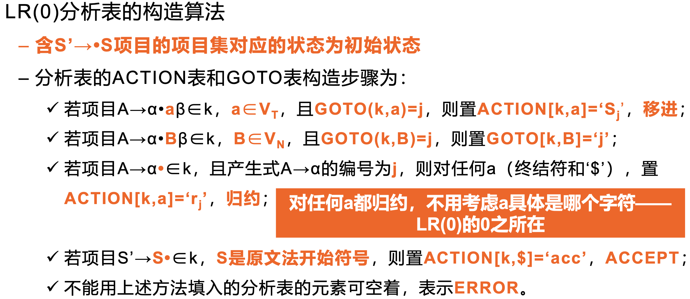

#### LR(0) 分析过程

① 拓广文法：对文法G[S]，增加一条产生式S’→S，拓广为文法G’[S’]

② 根据产生式构造LR(0)项目集：CLOUSRE函数和GOTO函数

③ 根据项目集构造LR(0)DFA （②和③可以合并）

④ 根据LR(0)DFA构造LR(0)分析表

⑤ 根据LR(0)分析表进行LR(0)分析

##### Example

对以下文法进行LR(0)分析：
$$
G[E]: \; E→aA|b, A→cA|d, B→cB|d
$$

###### Step 1: 拓广文法

$$
G'[S']: \; S'→E, E→aA|bB, A→cA|d, B→cB|d
$$

###### Step2: 构造LR(0)DFA

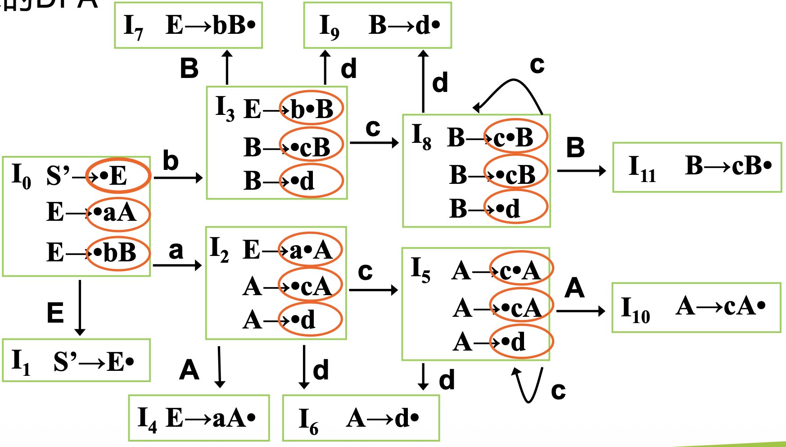

注意：

- 这里的每一个绿色框就是一个CLOSURE函数，也是DFA的一个状态

- 状态之间的转换关系就是一个GOTO函数

###### Step3: 根据LR(0)DFA构造LR(0)分析表

对产生式进行编号

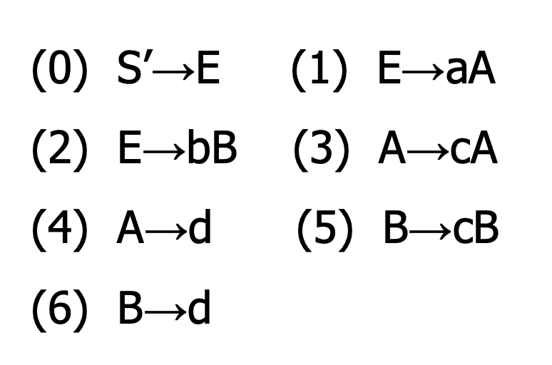

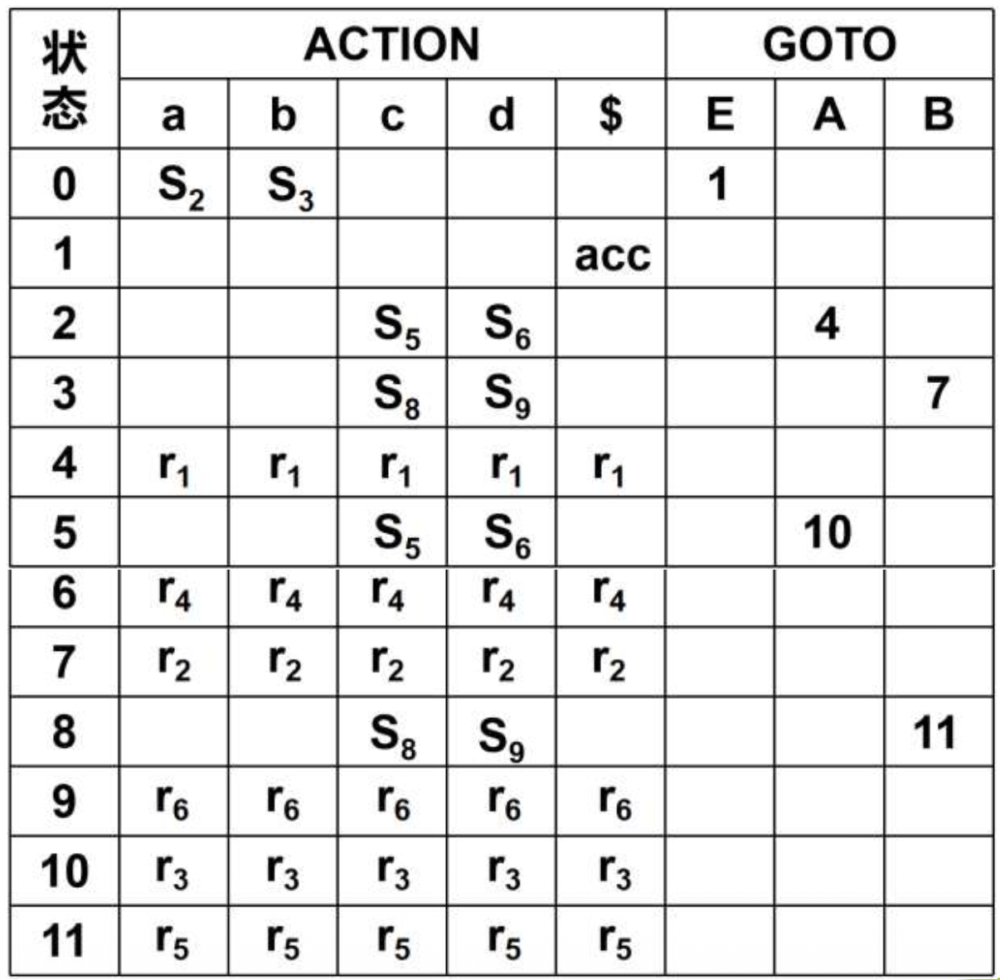

注意：

状态从0开始编号

###### Step4: 根据LR(0)分析表进行LR(0)分析

| 步骤 | 状态栈   | 符号栈 | 输入串 | ACTION | GOTO | 解释（不用写在答案中）                                       |
| ---- | -------- | ------ | -----: | ------ | ---- | ------------------------------------------------------------ |
| 1    | 0        | $      |  bccd$ | $S_3$  |      | $ACTION[0,b]=S_3$                                            |
| 2    | 03       | $b     |   ccd$ | $S_8$  |      | $ACTION[3,c]=S_8$                                            |
| 3    | 038      | $bc    |    cd$ | $S_8$  |      | $ACTION[8,c]=S_8$                                            |
| 4    | 0388     | $bcc   |     d$ | $S_9$  |      | $ACTION[8,d]=S_9$                                            |
| 5    | 03889    | $bccd  |      $ | $r_6$  | 11   | $ACTION[9,\$]=r_6$, 从两个栈弹出1个元素，并且进行归约$B \rightarrow d$, 将B入符号栈；然后$GOTO[8,B]=11$ |
| 6    | 0388(11) | $bccB  |      $ | $r_5$  | 11   | $ACTION[11,\$]=r_5$, 从两个栈弹出2个元素，并且进行归约$B \rightarrow cB$, 将B入符号栈；然后$GOTO[8,B]=11$ |
| 7    | 038(11)  | $bcB   |      $ | $r_5$  | 7    | $ACTION[11,\$]=r_5$, 从两个栈弹出2个元素，并且进行归约$B \rightarrow cB$, 将B入符号栈；然后$GOTO[3,B]=7$ |
| 8    | 037      | $bB    |      $ | $r_2$  | 1    | $ACTION[7,\$]=r_2$, 从两个栈弹出2个元素，并且进行归约$E \rightarrow cB$, 将E入符号栈；然后$GOTO[0,E]=1$ |
| 9    | 01       | $E     |      $ | acc    |      | $ACTION[1,E]=acc$                                            |

#### LR(0)分析存在的问题

### SLR(1)分析

基本思想：对于LR(0)**有冲突**的项目集用向前查看输入符号串的**1**个符号的办法加以解决

解决方法：对归约项目$A→r \vdot$，只有当输入符号$a \in \text{FOLLOW}(A)$才进行归约，缩小归约范围，有可能解决冲突

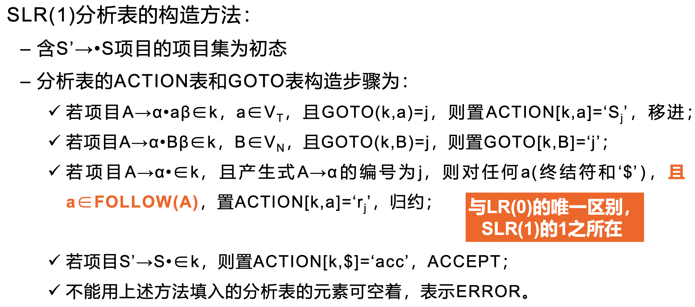

### LR(1)分析

#### LR(1)项目

形式：$[A \rightarrow \alpha \vdot \beta, a]$

在LR(0)项目的基础上增加一个终结符，这个终结符称为**向前搜索符（lookahead）**

> **向前搜索符（lookahead）**：
>
> 表示产生式的右部完整匹配后，允许在**剩余符号串**中的**下一个**终结符

