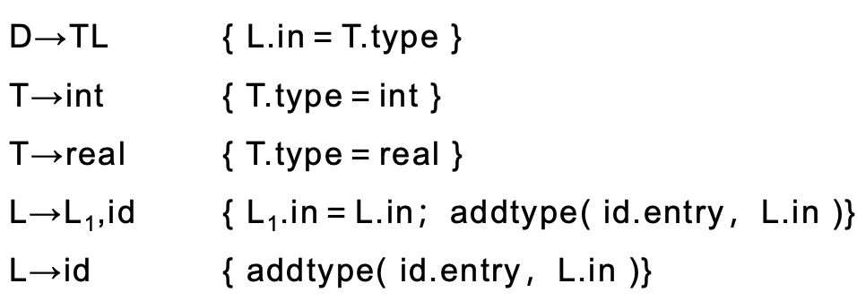
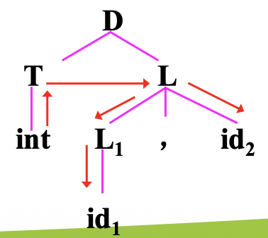

# Chapter 5: Syntax-Directed Translation 语法制导翻译

覆盖2个编译过程：

- 语义分析（Semantic Analysis）
- 中间代码生成

## 语义分析（Semantic Analysis）

在语义分析的同时产生中间代码，在这种模式下，语义分析的主要功能：

- **语义审查**

- 在扫描声明部分时构造标识符的**符号表**

- 在扫描语句部分时产生**中间代码**

分析方法：

- **语法制导翻译方法**

- 使用**属性文法**为工具来说明程序设计语言的语义

## 语法制导定义（Syntax-Directed Definition，SDD）

> 语法制导定义（Syntax-Directed Definition，SDD）是一个**上下文无关文法**、**属性**、**语义规则**的结合
>
> 语法制导定义又称为**属性文法**（Attribute Grammar）

> [!NOTE]
>
> 概念解释：
>
> 1. 上下文无关文法
> 2. 属性：对文法的每一个符号，引进相关属性，来代表与文法符号相关的信息（如：类型、值、存储位置等）
> 3. 语义规则：为文法的每一个产生式配备的计算属性的规则，称为语义规则。用于描述**属性计算、静态语义检查、符号表的操作、代码生成**等

### 属性

属性分为2类：

- 综合属性(Synthesised attribute)
- 继承属性(Inherited attribute)

> **综合属性(Synthesised attribute):**
>
> 从语法树的角度来看，若一个结点的某一属性值是由它的**子结点**的属性值计算来的，则称该属性为“综合属性”。
>
> 用于 **自下而上** 传递信息

> **继承属性(Inherited attribute):**
>
> 从语法树的角度来看，若一个结点的某一属性值是由它的**兄弟结点和（或）父结点**的属性值计算来的，则称该属性为“继承属性”。
>
> 用于 **自上而下** 传递信息

##### Example

对应的语法树如下：

###### Answer

- T.type 是综合属性（依赖于子结点）
- L.in是继承属性（依赖于兄弟结点或父结点）

> [!NOTE]
>
> T.type 由子结点`int`或`real`决定
>
> L.in 由兄弟结点 T.type 决定，L1.in由父结点 L.in 决定

#### 特别情况

##### (1) 只包含综合属性

一个只包含综合属性的SDD称为：**S-属性的SDD** 或 **S-属性文法**，该SDD与LR分析过程相对应

##### (2) 不同符号含有的属性

- 终结符只有综合属性，它们由**词法分析器**提供
- 非终结符既有综合属性，也有继承属性
- 文法开始符没有继承属性（文法开始符没有兄弟结点和父结点）

### 注释语法分析树(Annotated Parse Tree)

> **注释语法分析树(Annotated Parse Tree)**:
>
> 显示各个属性的值的语法分析树

> [!EXAMPLE]
>
> shouxianranhou 

