# Chapter 5: Syntax-Directed Translation 语法制导翻译

覆盖2个编译过程：

- 语义分析（Semantic Analysis）
- 中间代码生成

> **重点**：
>
> 1. [综合属性、继承属性（知道定义，能指出来）](#属性)
> 2. [S-属性、L-属性](#辨析：S-属性的SDD和L-属性的SDD)
> 3. [注释语法分析树](#注释语法分析树(Annotated Parse Tree))
> 4. [依赖图](#依赖图(Dependency Graph))
> 5. [L-属性SDD ->SDT](#L-属性的SDD转换为 SDT)
> 6. 中缀 ->后缀的SDT （去年）
> 7. 写出递归下降预测解析器

## 语义分析（Semantic Analysis）

在语义分析的同时产生中间代码，在这种模式下，语义分析的主要功能：

- **语义审查**

- 在扫描声明部分时构造标识符的**符号表**

- 在扫描语句部分时产生**中间代码**

分析方法：

- **语法制导翻译方法**

- 使用**属性文法**为工具来说明程序设计语言的语义

## 语法制导定义（Syntax-Directed Definition，SDD）

> 语法制导定义（Syntax-Directed Definition，SDD）是一个**上下文无关文法**、**属性**、**语义规则**的结合
>
> 语法制导定义又称为**属性文法**（Attribute Grammar）

> [!NOTE]
>
> 概念解释：
>
> 1. 上下文无关文法
> 2. 属性：对文法的每一个符号，引进相关属性，来代表与文法符号相关的信息（如：类型、值、存储位置等）
> 3. 语义规则：为文法的每一个产生式配备的计算属性的规则，称为语义规则。用于描述**属性计算、静态语义检查、符号表的操作、代码生成**等

### 属性

属性分为2类：

- 综合属性(Synthesised attribute)
- 继承属性(Inherited attribute)

> **综合属性(Synthesised attribute):**
>
> 从语法树的角度来看，若一个结点的某一属性值是由它的**子结点**的属性值计算来的，则称该属性为“综合属性”。
>
> 用于 **自下而上** 传递信息

> **继承属性(Inherited attribute):**
>
> 从语法树的角度来看，若一个结点的某一属性值是由它的**兄弟结点和（或）父结点**的属性值计算来的，则称该属性为“继承属性”。
>
> 用于 **自上而下** 传递信息

##### Example

对应的语法树如下：

###### Answer

- T.type 是综合属性（依赖于子结点）
- L.in是继承属性（依赖于兄弟结点或父结点）

> [!NOTE]
>
> T.type 由子结点`int`或`real`决定
>
> L.in 由兄弟结点 T.type 决定，L1.in由父结点 L.in 决定

#### 特别情况

##### (1) 只包含综合属性——**S-属性的SDD** 

一个只包含综合属性的SDD称为：**S-属性的SDD** 或 **S-属性文法**，该SDD与LR分析过程相对应

##### (2) 不同符号含有的属性

- **终结符只有综合属性**，它们由**词法分析器**提供
- 非终结符既有综合属性，也有继承属性
- 文法开始符**没有继承属性**（文法开始符没有兄弟结点和父结点）

### 注释语法分析树(Annotated Parse Tree)

> **注释语法分析树(Annotated Parse Tree)**:
>
> 显示各个属性的值的语法分析树

##### Example1

对以下简单算术表达式求值的属性文法，给出`4*(5+6)n`的注释语法分析树（`n`表示表达式的结尾标记）
$$
\begin{array}{ll ll}
& L \rightarrow E n  & \{L.val = E.val,Print(L.val)\} \\
& E \rightarrow E_1+T & \{E.val = E_1.val+T.val\} \\
& E \rightarrow T & \{E.val=T.val\} \\
& T \rightarrow T_1 * F & \{T.val=T_1.val * F.val \} \\
& T \rightarrow F & \{T.val=F.val\} \\ 
& F \rightarrow (E) & \{F.val=E.val\} \\
& F \rightarrow digit & \{F.val=digit.lexval\}
\end{array}
$$

###### Answer

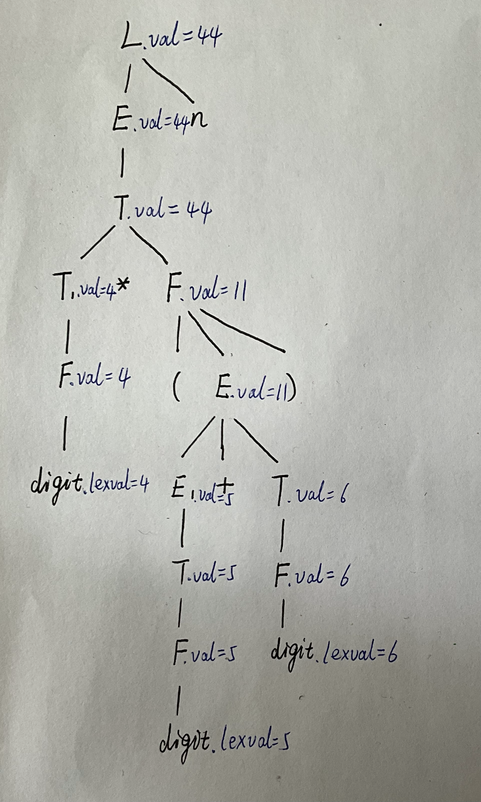

##### Example2

对以下属性文法，给出3*5的注释语法分析树
$$
\begin{array}{ll ll}
& T \rightarrow FT'  & \{T'.inh=F.val, \; T.val=T'.syn \} \\
& T' \rightarrow *FT_1' & \{T_1'.inh = T'.inh \times F.val, \; T'.syn=T_1'.syn\} \\
& T' \rightarrow \varepsilon & \{T'.syn=T'.inh \} \\
& F \rightarrow digit & \{F.val=digit.lexval\}
\end{array}
$$

###### Answer

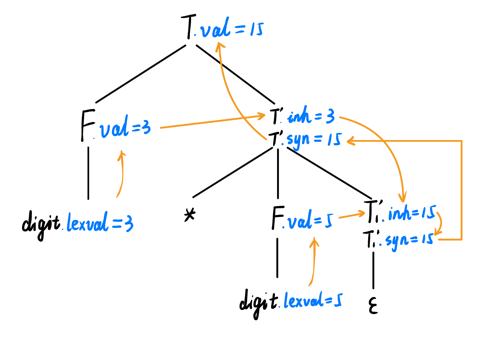

##### Example3

对以下属性文法，给出`int[2][3]`的注释语法分析树
$$
\begin{array}{ll ll}
& T \rightarrow BC  & \{T.type=C.type, \; C.base=B.type \} \\
& B \rightarrow int & \{B.type=int \} \\
& B \rightarrow float & \{B.type=float \} \\
& C \rightarrow [num]C_1 & \{C.type=array(num.val,C_1.type),\; C_1.base=C.base\} \\
& C \rightarrow \varepsilon & \{C.type=C.base \}
\end{array}
$$

###### Answer

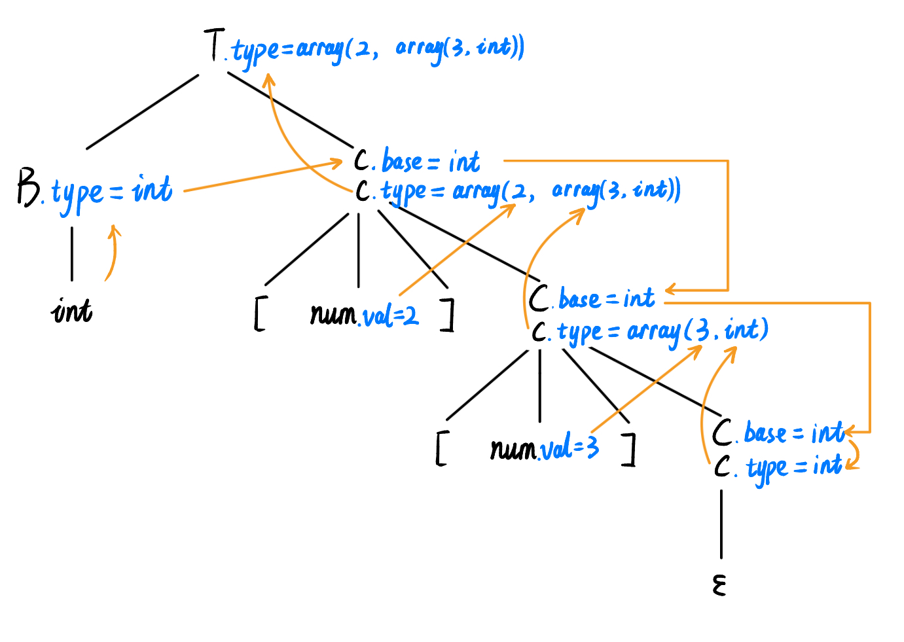

> [!CAUTION]
>
> 对于**仅有综合属性的SDD**，可以按照**自底向上**的顺序计算出属性值。（比如[Example1](#Example1)）
>
> 对于有继承属性和综合属性的SDD，属性的计算不按自底向上的顺序，需要确定一个求值顺序——**依赖图** （比如[Example2](#Example2), [Example3](#Example3)） 

### 属性求值顺序

#### 依赖图(Dependency Graph)

作用：

- 确定一棵语法分析树中各个属性的求值顺序
- 描述了某个语法分析树中属性之间的信息流
- 从一个属性到另一个属性的边，表示计算第二个属性时需要依赖第一个属性的值

> 可行的求值顺序就是依赖图的**拓扑排序**

##### Example

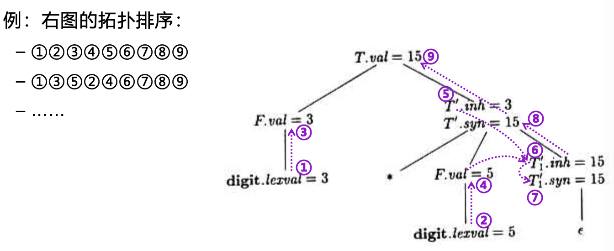

#### 抽象语法树(Abstract Syntax Tree, AST)

抽象语法树比语法分析树（Parse Tree）更简洁，直接反映了源代码的语法结构，同时剔除了无关的语法细节（如分号、括号等）

##### Example

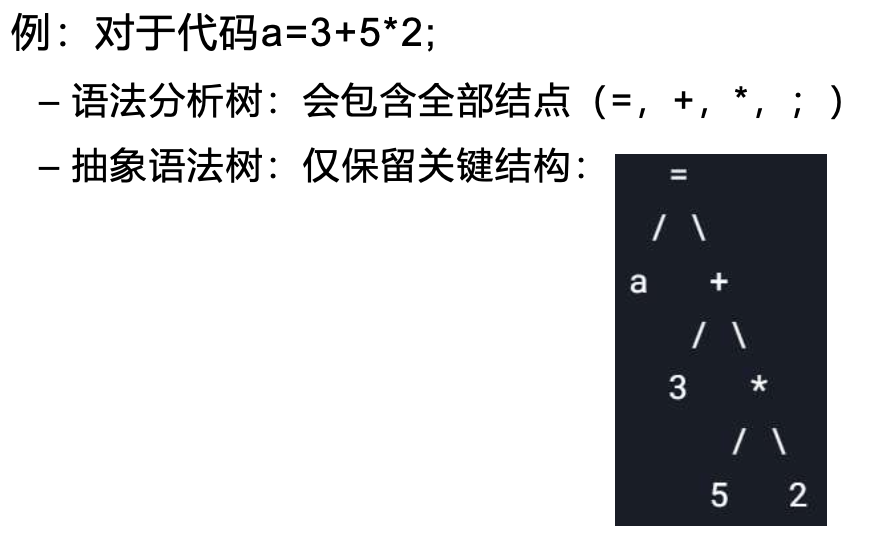

#### S-属性的SDD

> 一个**仅包含综合属性**(Synthesized attribute)的SDD称为**S-属性的SDD**，或称**S-属性文法**

特点：

- 每个属性都必须是**综合属性**
- 每个节点的属性值仅由其**子结点**的属性值计算而来（自底向上传递信息）
- 可以按照语法分析树的**任何自底向上顺序**来计算属性值
- 求值顺序与**LR分析的输出顺序**相同

##### Example

对于以下属性文法，写出算术表达式`3+5`的LR分析和S属性求值顺序：
$$
\begin{array}{ll ll}
& E \rightarrow E_1 + T & \{E.val=E_1.val+T.val \} \\
& E \rightarrow T & \{E.val=T.val \} \\
& T \rightarrow num & \{T.val=num.val \}
\end{array}
$$

###### Answer

| 符号栈 | 输入串 | LR分析过程                   | S属性求值顺序                   |
| ------ | -----: | ---------------------------- | ------------------------------- |
| `$  `    |   `3+5$` | 扫描3，归约$T \rightarrow 3$ | 计算$T.val=3$                   |
| `$T`     |    `+5$` | 归约$E \rightarrow T$        | 计算$E.val=T.val=3$             |
| `$E `    |    `+5$` | 扫描+，移进                  |                                 |
| `$E+`    |     `5$` | 扫描5，归约$T \rightarrow 5$ | 计算$T.val=5$                   |
| `$E+T`   |      `$` | 归约$E \rightarrow E_1+T$    | 计算$E.val=E_1.val+T.val=3+5=8$ |
| `$E`     |      `$` | 结束                         | 结束                            |

#### L-属性的SDD

>一个SDD的产生式右部所关联的各个属性之间，依赖图的边总是**从左到右(Left-to-right)**，则称该SDD为**L-**属性**(L-attribute)**的SDD

对每个属性的**要求**：

1. 要么是一个综合属性

2. 要么是一个继承属性，但有以下约束：

   假设存在产生式$A \rightarrow X_1X_2 \cdots X_n$,其中$X_i$的继承属性$X_i.a$的计算规则只能依赖于：

   - **产生式左部**A的继承属性
   - $X_i$**左边**的文法符号 $X_1,X_2,\cdots,X_{i-1}$ 的继承属性或综合属性（即：已经计算过的兄弟结点）
   - $X_i$本身的属性，且由$X_i$的属性组成的依赖图中**不存在环**

以上要求总结起来就是：

- 继承属性不能依赖右边符号（只能依赖左边符号或自身的其他属性）
- 不能有循环依赖，否则无法确定计算顺序

这样做的**目的：确保属性计算可以按从左到右的顺序进行**

适用于：

- 自顶向下分析方法：递归下降、LL(1)、……
- 自底向上分析方法：LR(1)

#### 辨析：S-属性的SDD和L-属性的SDD

|             | 是否含有综合属性 | 是否含有继承属性                                  |
| ----------- | ---------------- | ------------------------------------------------- |
| S-属性的SDD | ✅                | ❌                                                 |
| L-属性的SDD | ✅                | ✅，继承属性的值只能依赖于左边符号或自身的其他属性 |

##### Example

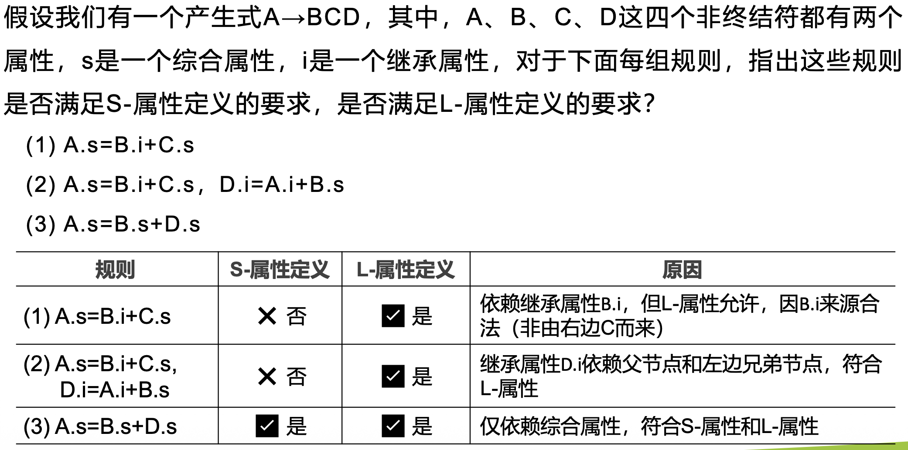

## 语法制导的翻译方案(Syntax-Directed Translation Schemes, SDT)

### 工作步骤

语法制导翻译的工作步骤：

1. 向语法符号**引入属性**
2. 为每个产生式**定义语义规则**
3. 根据注释语法分析树**绘制依赖图**
4. 依赖图的拓扑排序**确定评估顺序**
5. 按照求值顺序**执行语义规则**

### 辨析：SDD VS. SDT

SDD(语法制导定义)：上下文无关文法（CFG）+属性+语义规则

语义规则中的属性计算没有顺序

SDT(语法制导翻译方案): SDD的补充，具体翻译实施方案

语义规则中的属性计算顺序很重要

### S-属性翻译方案

> **自底向上**分析对应**S-**属性翻译方案

##### Example: S-属性翻译方案!

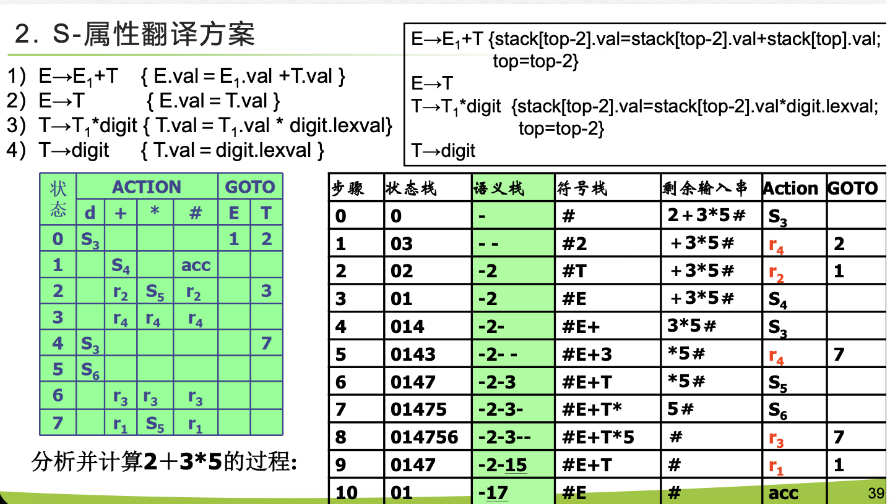

> [!NOTE]
>
> 只需要在LR(1)分析表的基础上，补一列“**语义栈**”

> [!CAUTION]
>
> 语义栈中的 `-` 表示**占位符**，而不是减号

### L-属性翻译方案

#### L-属性的SDD转换为 SDT

对于**L-属性定义 SDD** 转换成 **语法制导翻译方案 SDT**。

核心原则：

- 计算某个符号的**继承属性**，动作放在**该符号之前**。
- 计算产生式左部的**综合属性**，动作放在**产生式末尾**。

##### Example

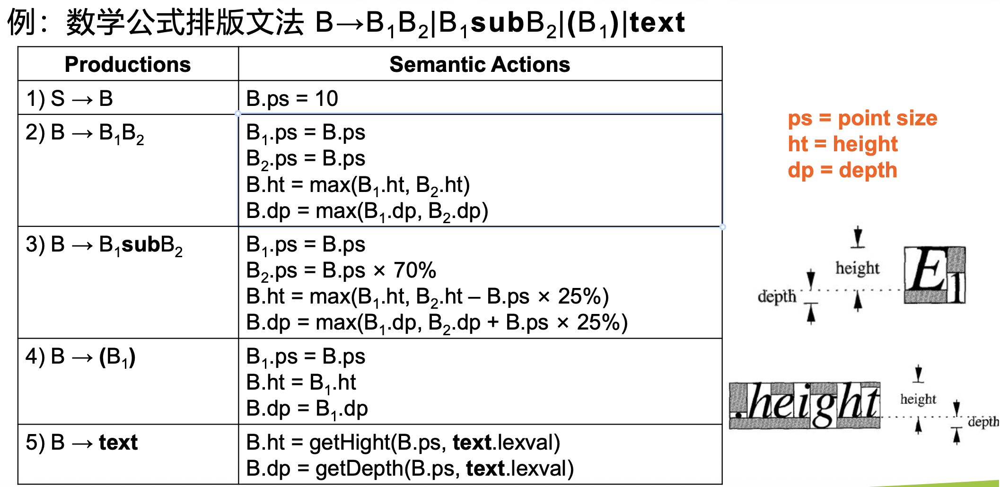

###### Answer

根据Semantic Actions，不难发现：

- `ps`是继承属性 → 在符号之前要计算出来
- `ht`,`dp`是综合属性 → 放在产生式末尾

据此，易得：

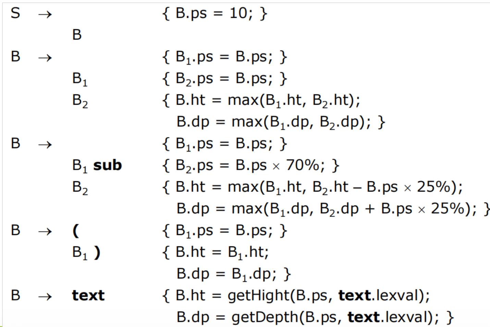

#### 在预测分析中实现L-属性定义

进行递归下降预测翻译的步骤：

1. 为语法规则编写一个LL(1)语法
2. 通过附加语义规则定义L-属性定义
3. 将L-属性定义转换为翻译方案
4. 消除翻译方案中的左递归（因为带有左递归的文法无法进行确定的自顶向下语法分析）
5. 编写一个递归下降预测解析器（翻译器）

##### Example1: 给定LL(1)文法，写出递归下降预测翻译程序

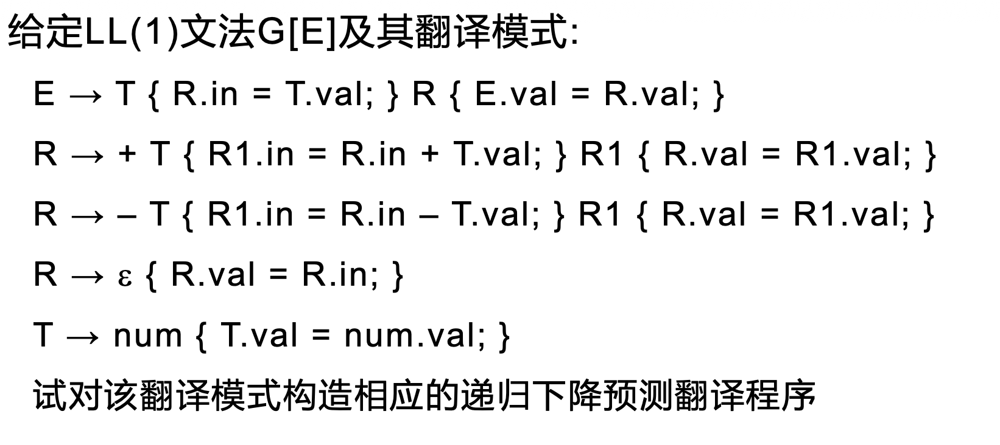

###### Answer

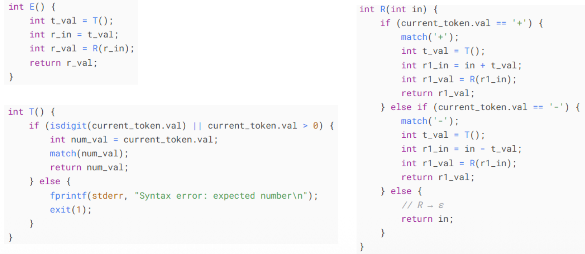

### 在LR分析中实现L-属性定义

