# Chapter 6: Intermediate Code Generation 中间代码生成

## 中间表示(Intermediate Representation, IR)

类型：

- [高级中间表示](#高级中间表示)：抽象语法树、有向无环图
- [低级中间表示](#低级中间表示)：3-地址码

### 高级中间表示

形式：

- 抽象语法树 (Abstract Syntax Tree, AST) 

- 有向无环图 (Directed Acyclic Code, DAG)

适用范围：适用于**静态类型检查**等任务

##### Example

算术表达式 `a+a*(b-c)+(b-c)*d`的AST和DAG

###### Answer

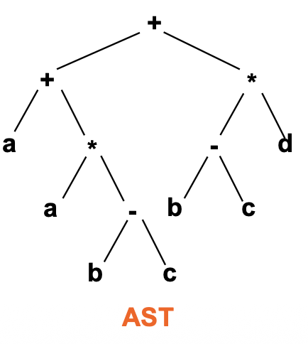

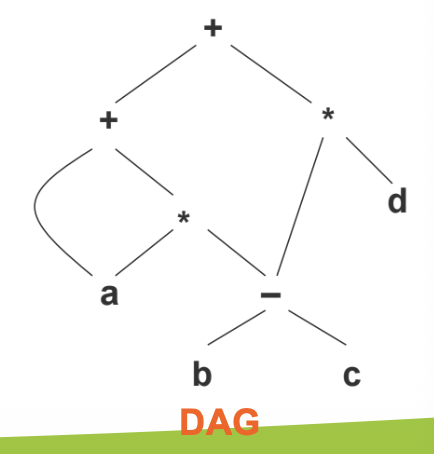

> [!NOTE]
>
> 相比于AST，DAG就是把AST中重复的部分**复用**了

#### 构造DAG的值编码

用一个记录数组来存放DAG的每个结点

数组的每一行表示一个记录，即一个结点

每个记录由结点编号、操作符、附加字段构成

对于叶子结点，只有1个附加结点

对于内部结点，有2个附加字段

##### Example

画出`i=i+10`的DAG和值编码

###### Answer

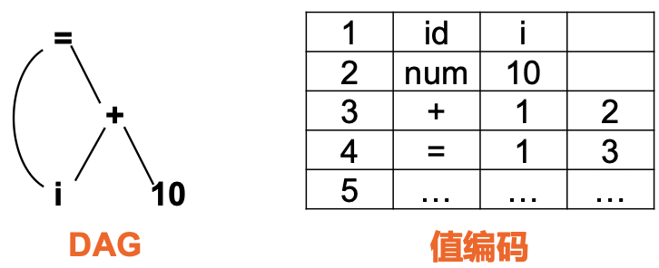


##### Example

为下列表达式**构造DAG**，并指出其**值编码**

(1) a+b+(a+b)

(2) a+b+a+b

(3) a+a+(a+a+a+(a+a+a+a)）

###### Answer

// TODO


### 低级中间表示

形式：三地址码 (Three-Address Code, TAC)

适用于依赖于机器的任务，如寄存器分配和指令选择等

#### 三地址码 (Three-Address Code, TAC)

> 三地址码由**地址**和**指令**构成

要求：一条指令右侧最多只有1个运算符


##### 编号方式：

- 带符号标号的三地址码
- 带位置号的三地址码

对于源码

```
do i=i+1;
while(a[i]>v);
```

带**符号标号**的三地址码如下：

```
L: t1 = i+1
	 i = t1
	 t2 = i*8 //假设数组中每个元素占8个存储单元
	 t3 = a[t2]
	 if t3>v goto L 
```

带**位置号**的三地址码如下：

```
100: t1 = i+1
101: i = t1
102: t2 = i*8 //假设数组中每个元素占8个存储单元
103: t3 = a[t2]
104: if t3>v goto 100 
```


##### 指令

| 运算                                                        | 指令形式           | 备注                                    |
| ----------------------------------------------------------- | ------------------ | --------------------------------------- |
| 双目运算或逻辑运算                                          | `x = y op z`       | `x`,`y`,`z`为地址                       |
| 单目运算：单目减(取负)、逻辑非、转换运算(整数转成浮点数等） | `x = op y`         |                                         |
| 赋值运算                                                    | `x=y`              |                                         |
| 无条件跳转                                                  | `goto L`           |                                         |
| 有条件跳转                                                  | `if x goto L`      |                                         |
| 有条件跳转                                                  | `ifFalse x goto L` |                                         |
| 关系运算跳转                                                | `if x op y gotoL`  |                                         |
| 取地址                                                      | `x = &y`           |                                         |
| 取值（取内容）                                              | `x = *y`           |                                         |
| 带下标的赋值指令                                            | `x = y[i]`         | 注意`i`代表内存单元位置，不是数组的位置 |

函数调用相关的指令

假设有函数`f`有n个参数，则调用`f`的一系列指令为：

- param $x_1$ //参数传递
- param $x_2$
- ...
- param $x_n$
- call f,n // 过程调用
- y= call f,n //函数调用
- return y // 返回值


##### 三地址指令序列

例如：`x+y*z`会翻译成如下三地址指令序列：

- `t1=y*z`
- `t2=x+t1`


##### 具体存储方式：

- 三元式 (triple)
- 间接三元式 (indirect triple)
- 四元式 (quadruple)

> [!NOTE]
>
> 三地址码与三元式、间接三元式、四元式的关系？
>
> 三地址码是**抽象形式**；
>
> 三元式、间接三元式、四元式是三地址码的**具体存储方式**


#### 三元式

含有3个字段：op, arg1, arg2

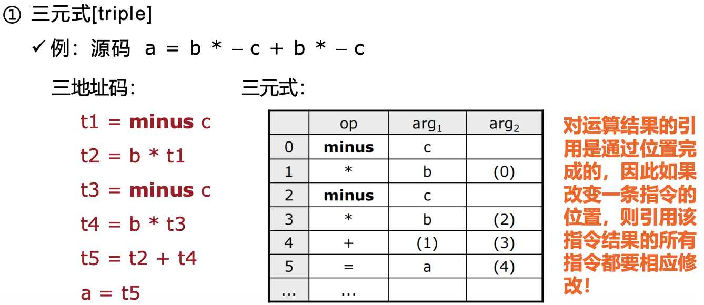


#### 间接三元式

与三元式相同，都是有3个字段：op, arg1, arg2

另外还有一个指向三元式的指针列表，从而可以解决三元式由于指令改变所引起的问题、

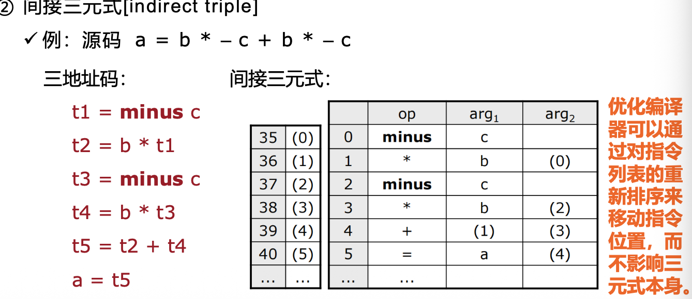

#### 四元式

含有4个字段：op, arg1, arg2, result

如果只有1个参数，则arg2为空

比如：t1 = minus c,则arg2为空

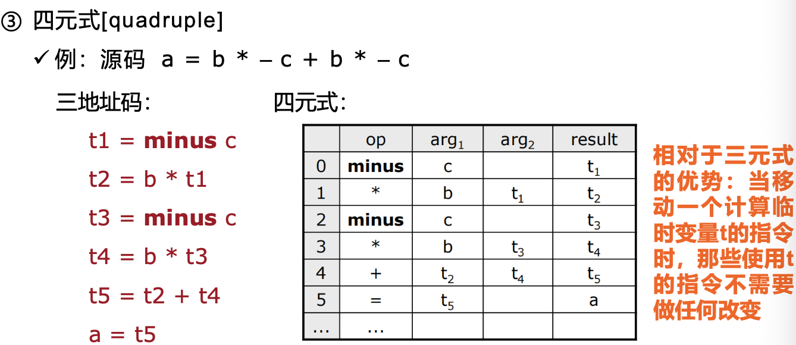


##### Example

对于以下的表达式，分别给出三元式和四元式序列:

(1) a=b[i]+c[j]

(2) a[i]=b*c-b*d

(3) x=f(y+1)+2

(4) x=*p+&y

(5) -(a+b)*(c+d)-(a+b+c)

###### Answer

// TODO


## 类型和声明

### 类型表达式(type expression)

类型表达式包括：

- 基本类型
- 类名
- 类型构造算子array
- 类型构造算子 record
- 类型构造算子 `->`, 如 `s->t`表示从类型s到类型t的函数
- 笛卡尔积
- 取值为类型表达式的变量


### 声明 (declaration)


## 布尔表达式

### 布尔表达式的用途

- 计算逻辑值
- 控制流：作为控制语句的（如：if-then,while）条件表达式

### 形式

E→E or E | E and E | not E | (E) | id rop id | true | false

其中，关系运算符rop：<=, <, =, !=, >, >=

### 优先级

- 关系运算符的优先级都相同
- 布尔运算符的优先级（从高到低）：not, and, or
- 运算符优先级（从高到低）：任何算术运算符，任何关系运算符，任何布尔运算符

### 布尔表达式的计算方式

1. 数值表示的**直接计算**
2. 逻辑表示的**短路计算**：布尔表达式计算到某一部分就可以得到结果，而无需对布尔表达式进行完整计算

#### 直接计算的翻译

##### Example1

将 A or B and not C 翻译成四元式

###### Answer

> 计算顺序为：
>
> 1. not C
> 2. B and (not C)
> 3. A or (B and (not C))

根据计算顺序，可知四元式为：

1. (not, C, -, t1)
2. (and, B, t1, t2)
3. (or, A, t2, t3)


##### Example2

将关系表达式 a<b, 翻译成三地址码

###### Answer

> a<b 等价于 `if a<b then 1 else 0`

对应的**三地址码**为：

(1) if a<b then goto (4)

(2) t := false

(3) goto (5)

(4) t := true

(5) ... (其他的代码)


对应的**四元式**为：

(1) (j<, a, b, (4))

(2) (:=, 0, -, t)

(3) (jump, -, -, (5))

(4) (:=, 1, -, t)

(5) ... (其他的代码)


##### 翻译规则

根据以上两个example，可以总结出以下的翻译规则：

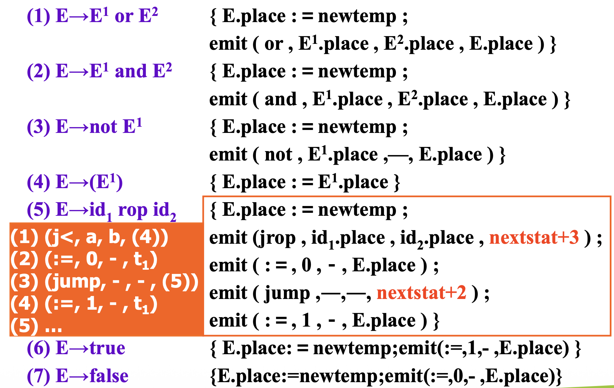


##### Example3

将布尔表达式`a<b or c<d and e>f` 翻译成四元式

###### Answer

根据关系运算符与布尔运算符的优先级，对应的语法抽象树为：

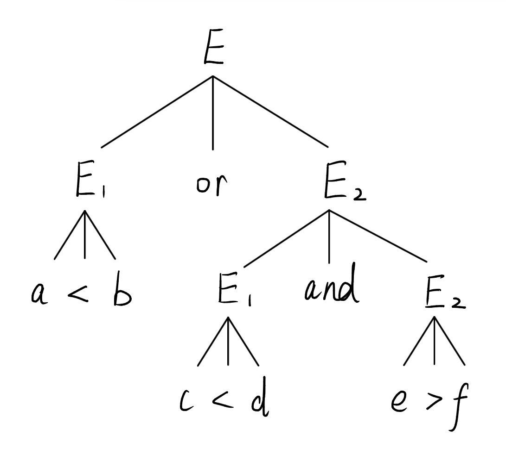

又根据翻译规则：

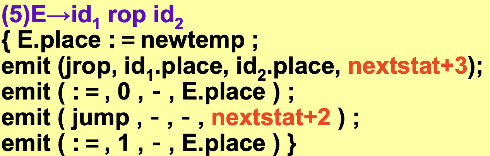

`a<b`可以写为以下四元式：

(1) (j<, a, b, (4))

(2) (:=, 0, -, t1)

(3) (jump, -, -, (5))

(4) (:=, 1, -, t1)

`c<d`可以写为以下四元式：

(5) (j<, c, d, (8))

(6) (:=, 0, -, t2)

(7) (jump, -, -, (9))

(8) (:=, 1, -, t2)

`e>f`可以写为以下四元式：

(9) (j>, e,f, (12))

(10) (:=, 0, -, t3)

(11) (jump, -, -, (13))

(12) (:=, 1, -, t3)

根据抽象语法树，先进行`and`运算，再进行`or`运算

(13) (and, t2, t3, t4)

(14) (or, t1, t4, t5)

综上，翻译得到的完整四元式序列为

(1) (j<, a, b, (4))

(2) (:=, 0, -, t1)

(3) (jump, -, -, (5))

(4) (:=, 1, -, t1)

(5) (j<, c, d, (8))

(6) (:=, 0, -, t2)

(7) (jump, -, -, (9))

(8) (:=, 1, -, t2)

(9) (j>, e,f, (12))

(10) (:=, 0, -, t3)

(11) (jump, -, -, (13))

(12) (:=, 1, -, t3)

(13) (and, t2, t3, t4)

(14) (or, t1, t4, t5)


#### 短路计算的翻译

由于不需要对完整的布尔表达式进行求值，只需要计算一部分即可，所以需要对布尔表达式B引入两个新的属性：

- B.true: 表达式为真的出口
- B.false: 表达式为假的出口

如果计算了布尔表达式的一部分就知道结果为真或假，就直接利用这两个出口进行跳转，不用执行剩余的布尔表达式计算。

布尔表达式B在常见控制流语句中的使用：

##### if 语句

S $\rightarrow$ if(B) S1

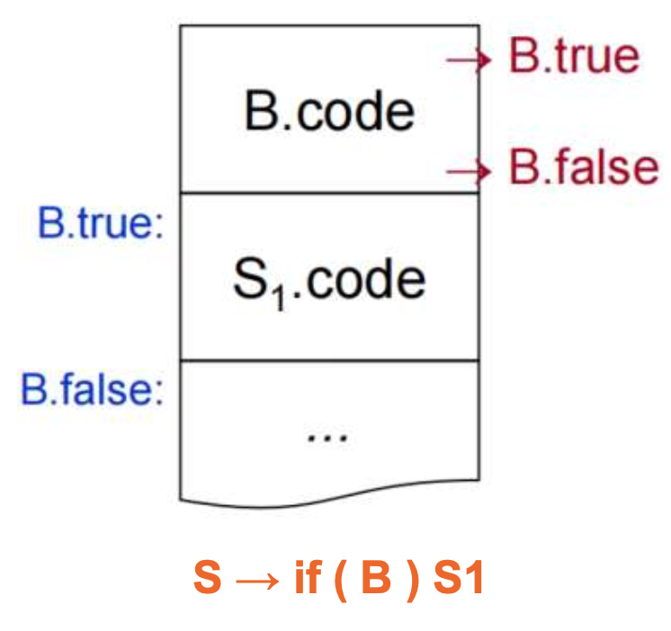

##### if else语句

S $\rightarrow$ if(B) S1 else S2

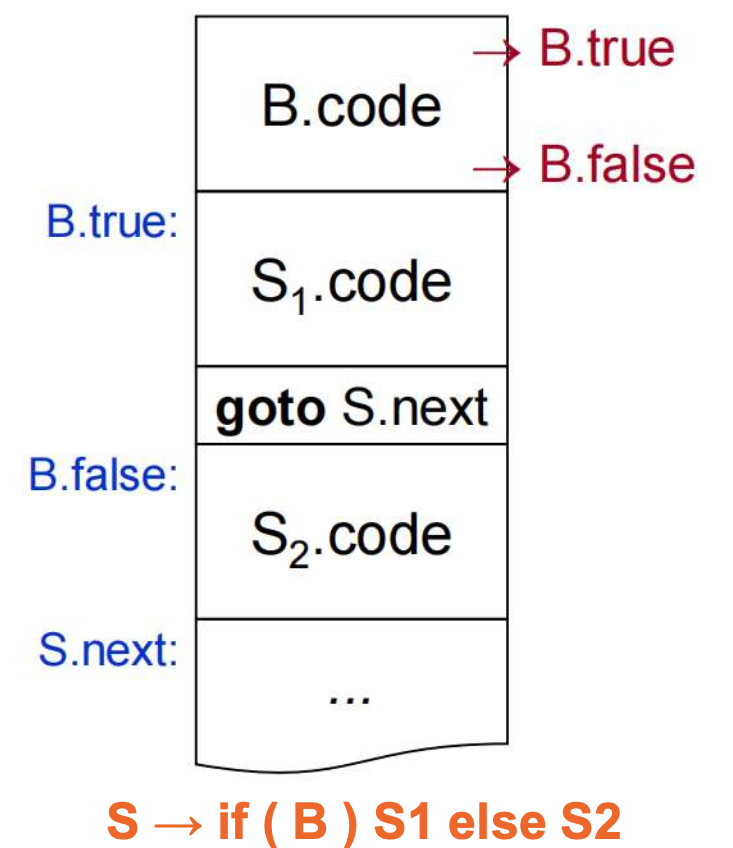

##### while 语句

S $\rightarrow$ while(B) S1 

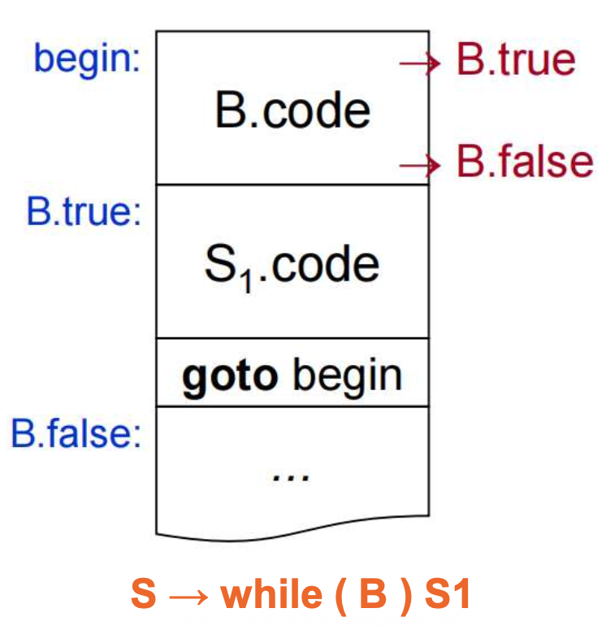


##### Example1

将条件控制语句 `a<b or c<d and e>f` 按照短路计算的方式，翻译成四元式

###### Answer

(1) (j<, a, b, B.true)

(2) (jump, -, -, (3))

(3) (j<, c, d, (5))

(4) (jump, -, -, B.false)

(5) (j>, e, f, B.true)

(6) (jump, -, -, B.false)


## 回填技术

> 为什么需要回填技术？
>
> 在把布尔表达式翻译成一串四元式时，真假出口未能在产生四元式时确定，要等到将来目标明确时再回填。

解决方法：真假出口的**拉链**与**回填**

### 拉链

把需要回填`E.true`的四元式拉成一条真链，

把需要回填`E.false`的四元式拉成一条假链

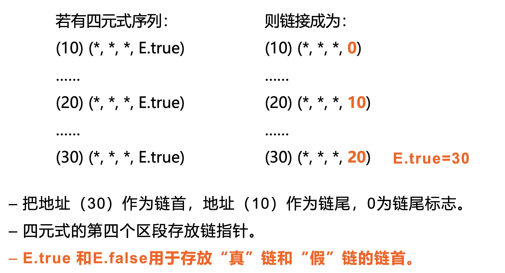

### 回填

需要使用2个函数：

- `merge(p1,p2)`函数：用于把`p1`,`p2`为链首的两条链合并为1条，返回合并后的链首值。
  - 当`p2`为空链时，返回`p1`;
  - 当`p2`不为空链时，把`p2`的链尾第四区段改为`p1`，返回`p2`
- `backpatch(p,t)`函数：用于把链首`p`所链接的每个四元式的第4区段都填成转移目标`t`

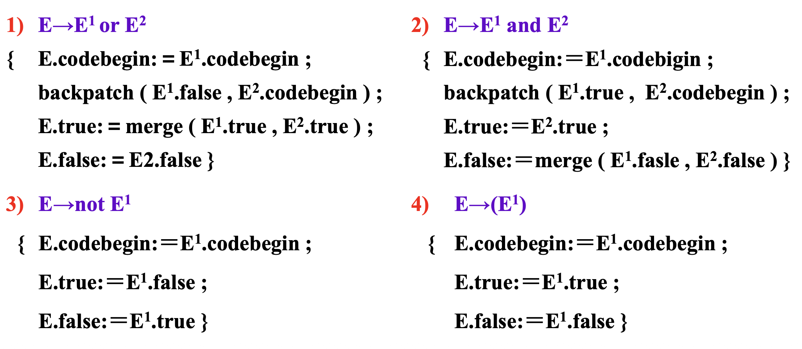

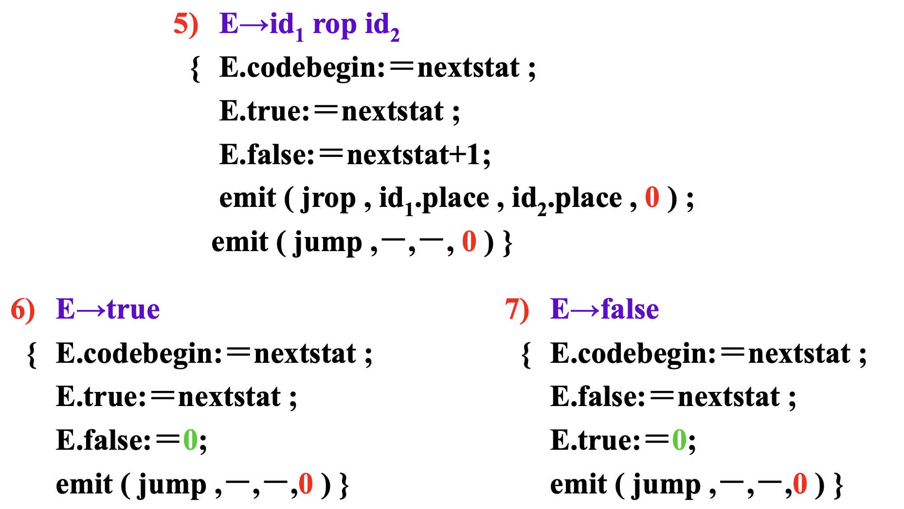

