# Chapter 7: Code Optimization 代码优化

[TOC]


## 代码优化定义

对代码进行等价变换，使得变换后的代码效率更高（比如：节省运行时间、减少存储空间）

需要权衡的方面：

- 时间效率 VS. 空间效率
- 编译器效率 VS. 目标代码效率，比如：
  - 高级别的优化可以生成高效的目标代码，但是编译时间更长
  - 复杂的优化，会占用更多的编译内存

## 优化级别

共有3种优化级别

- 源代码优化
- **中间代码优化**（不依赖于具体计算机）← 编译器中重点关注的
- 目标代码优化（依赖于具体计算机）

## 通用技术

共有3种通用的优化技术：

1. 删除公共子表达式
2. 常量折叠及复写传播
3. 消除死代码（删除无用赋值）

### 删除公共子表达式(Common Subexpressions)

> 若子表达式E在前面过，且之后E中的**变量值都未改变**，则E的重复出现称为公共子表达式，可将其删除，避免重复计算

##### Example

```
(1) T1 := 4*I
(2) T2 := addr(A)-4
(3) T3 := T2[T1]
(4) T4 := 4*I  // 改成：T4 := T1
(5) ...
```

解释：在以上代码中，(1)和(4)中都出现了子表达式`4*I`，其中的变量`I`的值没有改变，所以是**公共子表达式**，故将(4)改成`T4 := T1`


### 常量折叠及复写传播(Copy Propagation)

> **常量折叠**：如果运算量都是已知量，则在编译时就算出它的值

> **复写传播**：对于`A:=B`，称为把`B`值复写到`A`。如果其后有引用`A`的地方，且在这之间`A`和`B`的值都未改变，则可以把对`A`的引用改为对`B`的引用，这就称为复写传播。

##### Example

```
(1) I:=1
(2) T1:=4*I 	 // 改成：（2）T1:=4 常量折叠
(3) T4:=T1  	 // 改成：（3）T4:=4 常量传播
(4) T6:=T5[T4] // 改成：（4）T6:=T5[T1] 复写传播（用T1代替T4）
```


### 消除死代码（删除无用赋值）

> **死代码/无用赋值**是什么：
>
> - 变量被赋值，但在程序中**从未被引用**
> - 变量赋值后**未被引用，又重新赋值**，则前面的赋值是无用的
> - 变量的赋值**仅仅被这个变量自己引用**

##### Example

原始代码：

```
(1) I:=1				// I被赋值之后仅仅被它自己引用，可以删去
(2) T1:=4
(3) T3:=T2[T1]
(4) T4:=T1			// T4后面没有用过，可以删去
(5) I:=I+1			// I后面没有用过，可以删去
(6) T1:=T1+4
(7) if T1≤80 goto (3)
```

消除死代码后得到：

```
(2) T1:=4
(3) T3:=T2 [T1]
(6) T1:=T1+4
(7) if T1≤80 goto (3)
```

## 优化分类

根据优化涉及的程序范围，可以分为：

- **局部优化**（在只有一个入口、一个出口的**基本块**上进行优化）

- **循环优化**（对循环中的代码进行优化，基于控制流分析）
- **全局优化**（在整个程序范围内进行优化，基于数据流分析）
- **窥孔优化**（对一个**滑动窗口内的代码**进行优化）

### 局部优化

局部优化是指在基本块内进行优化

> **基本块**:
>
> 基本块是指程序中一个顺序执行的语句序列，其中**只有一个入口语句和一个出口语句**。
>
> 执行时只能从入口语句进入，从其出口语句退出。

局部优化的常见步骤：

1. 划分基本块
2. 构造基本块的DAG
3. 利用DAG进行优化

#### 划分基本块

Step1：划分基本块需要先找到基本块的**入口语句**，一般是：

- 程序的**第一个语句**
- 条件转移或无条件转移语句的**转移目标语句**
- 紧跟在**条件转移语句后**的语句

Step2：找到入口语句后，就能划分出基本块。一般划分依据是：

- 入口→入口：从一个入口语句到下一个入口语句前一个语句 （注意：**不包含下一个入口语句**）
- 入口→转移语句（包含该转移语句）
- 入口→停止语句（包含该停止语句） 

##### Example

对于以下程序

```
(1) read X
(2) read Y
(3) R := X mod Y
(4) if R=0 goto (8)
(5) X := Y
(6) Y:= R
(7) goto (3)
(8) write Y
(9) halt
```

这里的基本块入口语句有：

- (1) ← 因为是程序的第一个语句
- (3) ← 因为(3)是(7)的转移目标语句
- (5) ← 因为(5)是紧跟在条件转移语句(4)后面的语句
- (8) ← 因为(8)是(4)的转移目标语句

由此可以划分出基本块：

- B1 {(1), (2)}  ← 从入口到入口
- B2 {(3), (4)}  ← 从入口到转移语句
- B3 {(5), (6), (7)} ← 从入口到转移语句
- B4 {(8), (9)} ← 从入口到停止语句

#### 基本块的DAG表示

DAG表示：

1. 被赋值的变量（`:=`左边的变量），放在DAG节点**右边**
2. 赋值的变量（`:=`右边的变量），放在DAG节点**下边**
3. 若有`op`，则画线

下表为常见的表达式类型及其对应的四元式、DAG表示。

| 类型 | 表达式        | 四元式        | DAG表示                                                      |
| ---- | ------------- | ------------- | ------------------------------------------------------------ |
| 0型  | `A := B`      | (:=, B, -, A) | 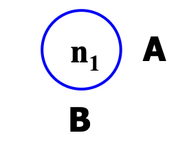 |
| 1型  | `A := op B`   | (op, B, -, A) | 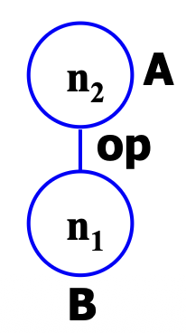 |
| 2型  | `A := B op C` | (op, B, C, A) | 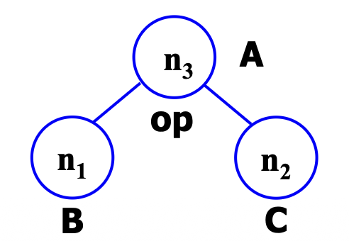 |

##### Example

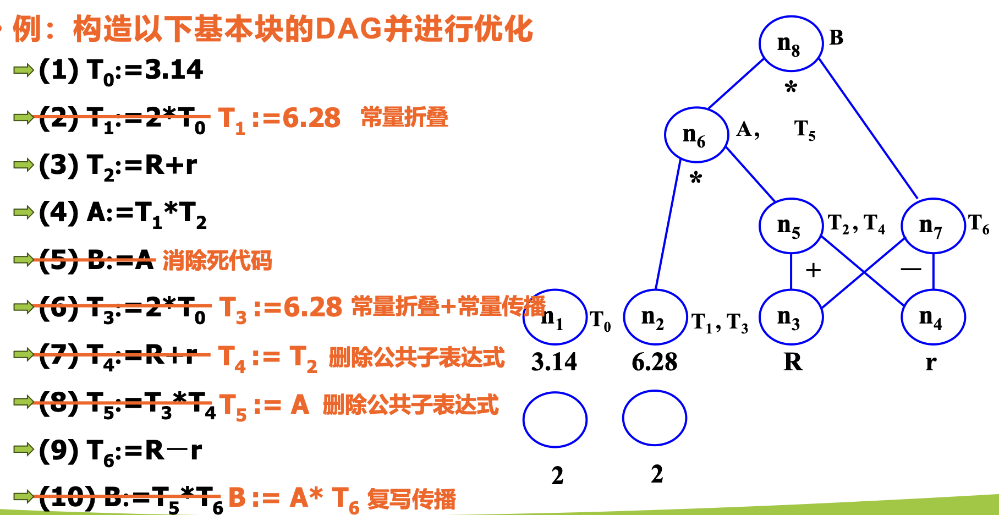


假如T0，T1，…，T6 在基本块后都不被引用，则这些符号可在DAG附加标识符删去

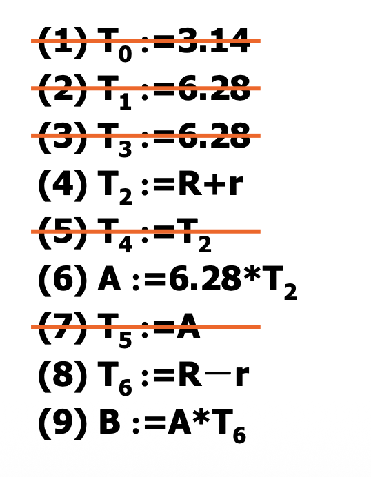

#### 局部优化的Example

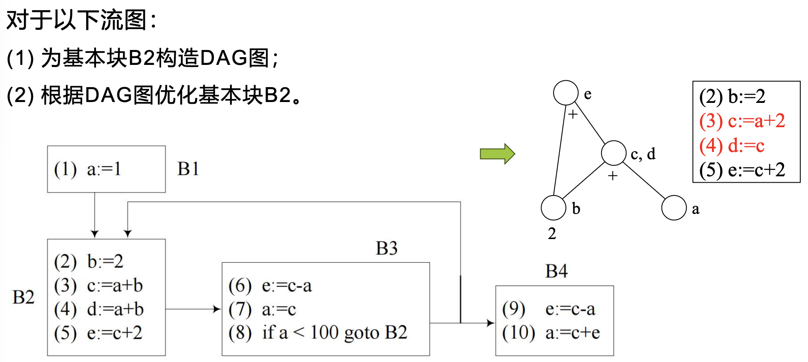


### 循环优化

#### 优化技术

循环优化的技术有：

- ***代码外提***：把循环不变运算提到循环的前面，使之只在循环外计算一次
- ***强度削弱***：把程序中强度大的运算替换成强度小的运算。（例如把乘法替换为加法）
- ***变换循环控制条件***：通过将循环控制条件更换为等价的另一个循环控制条件，使得变换后可以**删减代码，或减少执行次数**

##### 代码外提

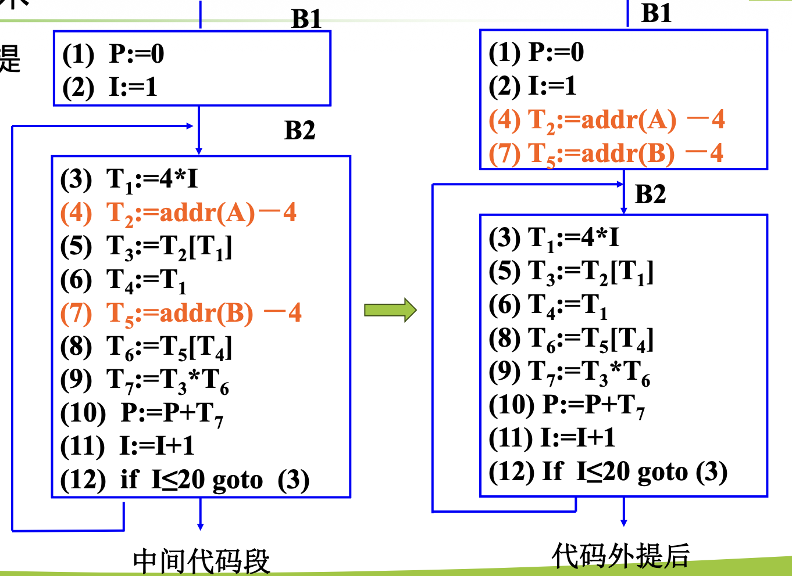

分析：(4)(7)的结果在每次循环中都不改变，所以可以外提

##### 强度削弱

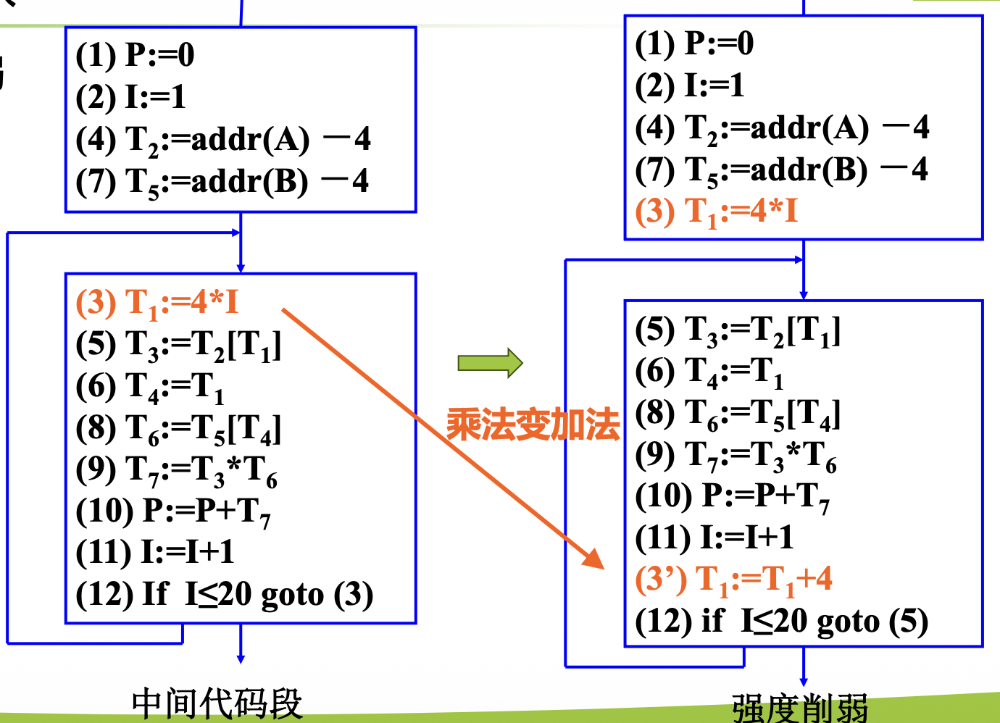

分析：将乘法变加法

##### 变换循环控制条件

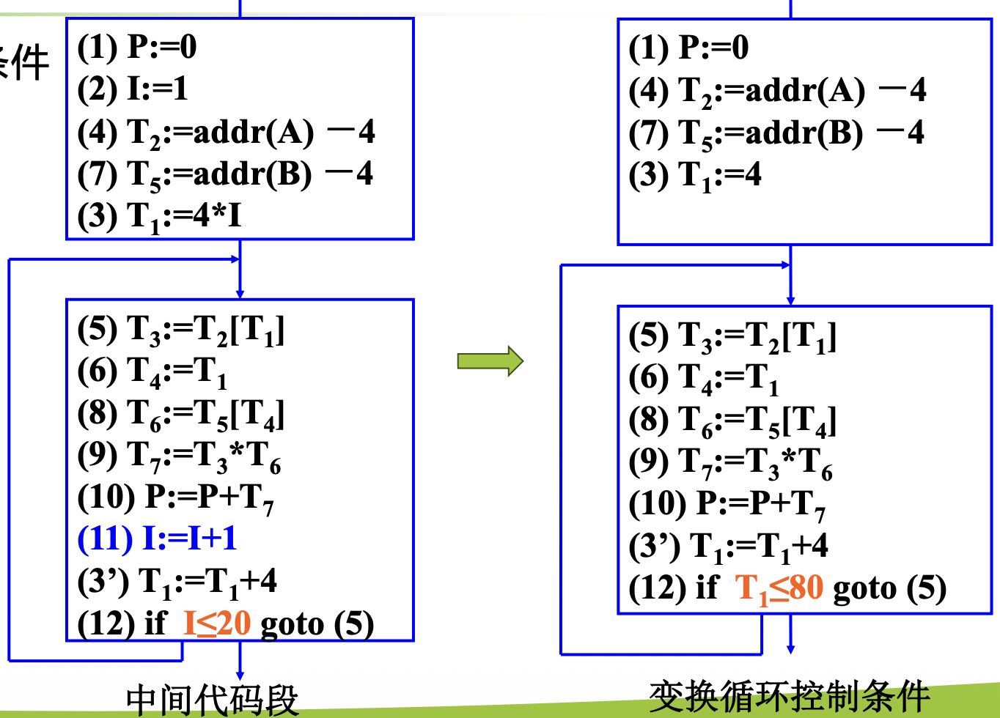

解释：由于`I`和`T1`始终保持`T1:=4*I`的线性关系。通过把(12)的循环控制条件`I≤20`变换成`T1≤80`，程序的运行结果不变，而且可以删去(11)，使得代码更加简洁

#### 确定循环

循环优化的一个难点是确定流图中的循环

基本思路：

1. 计算支配结点集
2. 得到回边
3. 确定循环

下面以这个流图为例说明如何确定循环

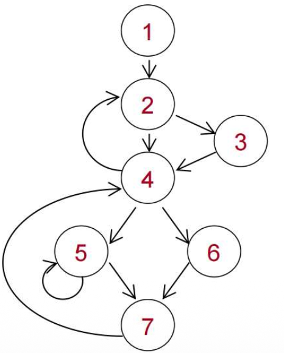

##### 计算支配结点集

> **支配结点**：
>
> 从流图的**首结点**出发，到达结点n的**任一通路**都必需经过结点m，则称为m是n的支配结点，记为 m DOM n

> **支配结点集**：
>
> 流图中结点n的所有支配结点的集合，称为结点n的支配结点集，记为 D(n) = {m| m DOM n}

对于流图中任意结点a，记首结点为n0，都有：

- a DOM a (每个结点都支配自己)
- n0 DOM a （首结点支配任意一个结点）

对于以上流图，所有结点的支配结点集分别为：

D(1) = {1}

D(2) = {1,2}

D(3) = {1,2,3}

D(4) = {1,2,4}

D(5) = {1,2,4,5}

D(6) = {1,2,4,6}

D(7) = {1,2,4,7}

##### 得到回边

>**回边 (back edge)**：
>
>假设 a→b是流图中的一条有向边，如果b DOM a，则称 a→b是流图中的一条回边
>
>(简单地说，如果有向边的**指向关系与支配关系相反**，则是回边)

对于以上流图：

4→2是一条有向边，而且2 DOM 4，所以4→2是回边；

7→4是一条有向边，而且4 DOM 7，所以7→4是回边；

5→5是一条有向边，而且5 DOM 5，所以5→5是回边。

> [!CAUTION]
>
> 从某个结点出发，回到自身的有向边，都是回边。比如这里的5→5

##### 确定循环

> 不难发现，每一条回边，都对应一个循环。

若给定一条回边 n→d，如何确定对应的循环？

记集合`loop`，用来存放属于该循环的结点；

记栈`stack`，用来存放前驱结点

1. 初始：由于已知n→d，所以初始时 `loop={n,d}`；将`n`入栈。
2. 循环：将栈里面的一个结点出栈，找到它所有的直接前驱结点，放入集合`loop`中（已经在`loop`中的结点就不会重复插入），并将它所有的直接前驱结点入栈。重复直至集合`loop`不再变化，并且栈为空
3. 集合`loop`中的结点就是循环中的结点，返回即可。

对于以上流图：

回边4→2对应的循环是：{2, 3, 4, 5, 6, 7}

回边7→4对应的循环是：{4, 5, 6, 7}

回边5→5对应的循环是：{5}

##### Example

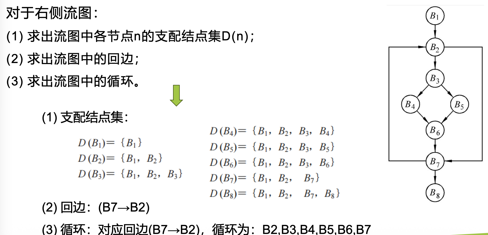


### 全局优化

全局优化的关键在于**数据流分析**，比如：检测变量、赋值、寄存器分配等

关于数据流的信息：

- 变量如何被赋值/定义，即左值 (L-value)
- 变量如何被引用/使用，即右值 (R-value)


数据流分析的类型：

1. **到达-定值**数据流分析 (Reaching Definition Analysis)
2. **活跃变量**数据流分析 (Live Variable Analysis)


#### 到达-定值数据流分析 (Reaching Definition Analysis)

符号说明：

- B: 基本块
- P[B]: B的所有**前驱**基本块
- IN[B]：到达B入口处的各个变量的所有定值点集合;
- OUT[B]：到达B出口处的各个变量的所有定值点集合;
- GEN[B]：在B中定值，并且可到达B出口处的所有定值点集合；
- KILL[B]：B之外的能够到达B入口处，且B之外定值的变量**在B中又重新定值**的所有定值点集合。（简单地说：在B中定值，**覆盖**了B之外的定值）

计算关系：

- (1) $IN[B] = \cup OUT[b], b \in P[B]$

- (2) $ OUT[B] = GEN[B] \cup (IN[B]-KILL[B])$

  

##### Example

假设仅考虑变量`i`和`j`，对下图进行数据流分析

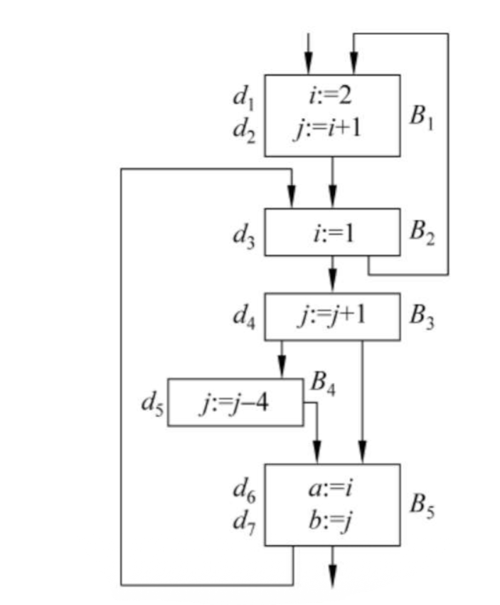

###### Answer

**初始状态**

|      | GEN      | KILL         | IN   | OUT      |
| ---- | -------- | ------------ | ---- | -------- |
| B1   | {d1, d2} | {d3, d4, d5} | {}   | {d1, d2} |
| B2   | {d3}     | {d1}         | {}   | {d3}     |
| B3   | {d4}     | {d2, d5}     | {}   | {d4}     |
| B4   | {d5}     | {d4}         | {}   | {d5}     |
| B5   | {}       | {}           | {}   | {}       |

注意：由于仅考虑变量`i`和`j`，所以GEN[B5]={}

>[!WARNING]
>
>KILL[B4]={d4}，而不是KILL[B4]={d2, d4}
>
>因为d2中 j 的值已经被d4覆盖，而不是被d5覆盖，所以KILL[B4]不包含d2；
>
>而d4中 j 的值是被d5覆盖的，所以KILL[B4]包含d4


**第1次迭代**

计算IN[B1]：根据(1)式，因为B1的前驱基本块只有B2。OUT[B2]={d3}，所以 IN[B1]={d3}

计算OUT[B1]：根据(2)式，OUT[B1] = {d1, d2}

|      | GEN      | KILL         | IN   | OUT      |
| ---- | -------- | ------------ | ---- | -------- |
| B1   | {d1, d2} | {d3, d4, d5} | {d3} | {d1, d2} |
| B2   | {d3}     | {d1}         | {}   | {d3}     |
| B3   | {d4}     | {d2, d5}     | {}   | {d4}     |
| B4   | {d5}     | {d4}         | {}   | {d5}     |
| B5   | {}       | {}           | {}   | {}       |


计算IN[B2]： 根据(1)式，因为B2的前驱基本块有B1、B5。OUT[B1]={d1, d2}，而OUT[B5]={}，所以IN[B2]={d1,d2}

计算OUT[B2]：根据(2)式，OUT[B2] = {d2, d3}

|      | GEN      | KILL         | IN       | OUT      |
| ---- | -------- | ------------ | -------- | -------- |
| B1   | {d1, d2} | {d3, d4, d5} | {d3}     | {d1, d2} |
| B2   | {d3}     | {d1}         | {d1, d2} | {d2, d3} |
| B3   | {d4}     | {d2, d5}     | {}       | {d4}     |
| B4   | {d5}     | {d4}         | {}       | {d5}     |
| B5   | {}       | {}           | {}       | {}       |


计算IN[B3]： 根据(1)式，因为B3的前驱基本块有B2。OUT[B2]={d2, d3}，所以IN[B3]={d2,d3}

计算OUT[B3]：根据(2)式，OUT[B3] = {d3, d4}

|      | GEN      | KILL         | IN       | OUT      |
| ---- | -------- | ------------ | -------- | -------- |
| B1   | {d1, d2} | {d3, d4, d5} | {d3}     | {d1, d2} |
| B2   | {d3}     | {d1}         | {d1, d2} | {d2, d3} |
| B3   | {d4}     | {d2, d5}     | {d2, d3} | {d3, d4} |
| B4   | {d5}     | {d4}         | {}       | {d5}     |
| B5   | {}       | {}           | {}       | {}       |


计算IN[B4]： 根据(1)式，因为B4的前驱基本块有B3。OUT[B3]={d3, d4}，所以IN[B4]={d3, d4}

计算OUT[B4]：根据(2)式，OUT[B4] = {d3, d5}

|      | GEN      | KILL         | IN       | OUT      |
| ---- | -------- | ------------ | -------- | -------- |
| B1   | {d1, d2} | {d3, d4, d5} | {d3}     | {d1, d2} |
| B2   | {d3}     | {d1}         | {d1, d2} | {d2, d3} |
| B3   | {d4}     | {d2, d5}     | {d2, d3} | {d3, d4} |
| B4   | {d5}     | {d4}         | {d3, d4} | {d3, d5} |
| B5   | {}       | {}           | {}       | {}       |


计算IN[B5]： 根据(1)式，因为B5的前驱基本块有B3,B4。OUT[B3]={d3, d4}，OUT[B4]= {d3, d5}，所以IN[B5]={d3, d4, d5}

计算OUT[B5]：根据(2)式，OUT[B4] = {d3, d4, d5}

|      | GEN      | KILL         | IN           | OUT          |
| ---- | -------- | ------------ | ------------ | ------------ |
| B1   | {d1, d2} | {d3, d4, d5} | {d3}         | {d1, d2}     |
| B2   | {d3}     | {d1}         | {d1, d2}     | {d2, d3}     |
| B3   | {d4}     | {d2, d5}     | {d2, d3}     | {d3, d4}     |
| B4   | {d5}     | {d4}         | {d3, d4}     | {d3, d5}     |
| B5   | {}       | {}           | {d3, d4, d5} | {d3, d4, d5} |


**第2次迭代**

重复上述步骤，对每个基本块逐个计算，逐个更新。

|      | GEN      | KILL         | IN                   | OUT              |
| ---- | -------- | ------------ | -------------------- | ---------------- |
| B1   | {d1, d2} | {d3, d4, d5} | {d2, d3}             | {d1, d2}         |
| B2   | {d3}     | {d1}         | {d1, d2, d3, d4, d5} | {d2, d3, d4, d5} |
| B3   | {d4}     | {d2, d5}     | {d2, d3, d4, d5}     | {d3, d4}         |
| B4   | {d5}     | {d4}         | {d3, d4}             | {d3, d5}         |
| B5   | {}       | {}           | {d3, d4, d5}         | {d3, d4, d5}     |


**第3次迭代**

重复上述步骤，对每个基本块逐个计算，逐个更新。

|      | GEN      | KILL         | IN                   | OUT              |
| ---- | -------- | ------------ | -------------------- | ---------------- |
| B1   | {d1, d2} | {d3, d4, d5} | {d2, d3, d4, d5}     | {d1, d2}         |
| B2   | {d3}     | {d1}         | {d1, d2, d3, d4, d5} | {d2, d3, d4, d5} |
| B3   | {d4}     | {d2, d5}     | {d2, d3, d4, d5}     | {d3, d4}         |
| B4   | {d5}     | {d4}         | {d3, d4}             | {d3, d5}         |
| B5   | {}       | {}           | {d3, d4, d5}         | {d3, d4, d5}     |

**直至所有基本块的 IN 和 OUT 都不再变化**（以上例子在第3次迭代后就不再变化，可以停止，所以上表就是最后结果）

> [!NOTE]
>
> 迭代计算时，先算 IN 再算 OUT ，或者先算 OUT 再算 IN 都可以。
>
> 只要迭代直至所有值都不变，就都能得到正确结果，就能结束。

##### UD链(Use-Definition Chaining, 引用-定值链)

> **UD链(Use-Definition Chaining, 引用-定值链)**：
>
> 在程序中某点u引用了变量A的值，则把能到达u的A的所有定值点的全体，称为A在引用点u的引用-定值链，简称UD链。

> [!NOTE]
>
> 所谓“**引用**”，就是变量出现在等号右边。
>
> 比如：`x = A`,则这里引用了变量`A`

计算方法：

- 如果在基本块B中，变量A的引用点u之前**有**A的定值点d，并且A在点d的定值到达u，那么A在点u的UD链就是｛d｝；
- 如果在基本块B中，变量A的引用点u之前**没有**A的定值点d，则 IN[B] 中**A的所有定值点**均到达u，它们就是A在点u的UD链。


在上述例子中，UD链有：

- i 在引用点d2的UD链为{d1} ：因为在基本块B1中，变量 i 的引用点d2之前有 i 的定值点d1，并且 i 在点d1的定值到达d2，所以 i 在引用点d2的UD链为{d1}
- i 在引用点d6的UD链为{d3}：因为在基本块B5中，变量 i 的引用点d6之前没有 i 的定值点。IN[B5] = {d3, d4, d5}中，i 的定值点只有d3，所以 i 在引用点d6的UD链为{d3}
- j 在引用点d4的UD链为{d2, d4, d5}：因为在基本块B3中，变量 j 的引用点d4之前没有 j 的定值点。IN[B3] = {d2, d3, d4, d5}中，j 的定值点有d2、d4、d5，所以 j 在引用点d4的UD链为{d2, d4, d5}
- j 在引用点d5的UD链为{d4}：因为在基本块B4中，变量 j 的引用点d5之前没有 j 的定值点。IN[B4] = {d3, d4}中，j 的定值点只有d4，所以 j 在引用点d5的UD链为{d4}
- j 在引用点d7的UD链为{d4, d5}：因为在基本块B5中，变量 j 的引用点d7之前没有 j 的定值点。IN[B5] ={d3, d4, d5}中，j 的定值点有d4、d5，所以 j 在引用点d7的UD链为{d4, d5}


#### 活跃变量数据流分析 (Live Variable Analysis)

符号说明：

- B: 基本块
- S[B]: B的所有**后继**基本块
- LiveUse[B]：B中被定值之前要引用变量的集合；
- Def[B]：在B中定值的且定值前未曾在B中引用过的变量集合;
- LiveIn[B]：B入口 为活跃的变量的集合;
- LiveOut[B]：B出口处为活跃的变量的集合。

计算关系：

- (3) $LiveIn[B] = LiveUse[B] \cup (LiveOut[B] - Def[B])$
- (4) $LiveOut[B] = \cup LiveIn[s], s \in S[B]$


##### Example

假设仅考虑变量`i`和`j`，对下图进行数据流分析


###### Answer

**初始状态**

|      | Def    | LiveUse | LiveOut | LiveIn |
| ---- | ------ | ------- | ------- | ------ |
| B1   | {i, j} | {}      | {}      | {}     |
| B2   | {i}    | {}      | {}      | {}     |
| B3   | {}     | {j}     | {}      | {}     |
| B4   | {}     | {j}     | {}      | {}     |
| B5   | {}     | {i, j}  | {}      | {}     |


**第1次迭代**

（先计算LiveIn,在计算LiveOut）

计算LiveIn[B1]：根据(4), 显然为{}

计算LiveOut[B1]：根据(3), 显然为{}

计算LiveIn[B2]：根据(4), 显然为{}

计算LiveOut[B2]：根据(3), 显然为{}

计算LiveIn[B3]：根据(4), 因为LiveUse[B3]={j}，所以可计算得到LiveIn[B3]={j}

计算LiveOut[B3]：根据(3), 显然为{}

计算LiveIn[B4]：根据(4), 因为LiveUse[B4]={j}，所以可计算得到LiveIn[B4]={j}

计算LiveOut[B4]：根据(3), 显然为{}

计算LiveIn[B5]：根据(4), 因为LiveUse[B5]={i, j}，所以可计算得到LiveIn[B5]={i, j}

计算LiveOut[B5]：根据(3), 显然为{}

|      | Def    | LiveUse | LiveOut | LiveIn |
| ---- | ------ | ------- | ------- | ------ |
| B1   | {i, j} | {}      | {}      | {}     |
| B2   | {i}    | {}      | {}      | {}     |
| B3   | {}     | {j}     | {}      | {j}    |
| B4   | {}     | {j}     | {}      | {j}    |
| B5   | {}     | {i, j}  | {}      | {i, j} |


**第2次迭代**

先计算LiveIn,在计算LiveOut

|      | Def    | LiveUse | LiveOut | LiveIn |
| ---- | ------ | ------- | ------- | ------ |
| B1   | {i, j} | {}      | {}      | {}     |
| B2   | {i}    | {}      | {j}     | {}     |
| B3   | {}     | {j}     | {i, j}  | {j}    |
| B4   | {}     | {j}     | {i, j}  | {j}    |
| B5   | {}     | {i, j}  | {}      | {i, j} |


**第3次迭代**

先计算LiveIn,在计算LiveOut

|      | Def    | LiveUse | LiveOut             | LiveIn |
| ---- | ------ | ------- | ------------------- | ------ |
| B1   | {i, j} | {}      | {}                  | {}     |
| B2   | {i}    | {}      | {j}                 | {j}    |
| B3   | {}     | {j}     | {i, j}              | {i, j} |
| B4   | {}     | {j}     | {i, j}              | {i, j} |
| B5   | {}     | {i, j}  | {} // 不应该是{j} ? | {i, j} |


**第4次迭代**

先计算LiveIn,在计算LiveOut

|      | Def    | LiveUse | LiveOut | LiveIn |
| ---- | ------ | ------- | ------- | ------ |
| B1   | {i, j} | {}      | {j}     | {}     |
| B2   | {i}    | {}      | {i, j}  | {j}    |
| B3   | {}     | {j}     | {i, j}  | {i, j} |
| B4   | {}     | {j}     | {i, j}  | {i, j} |
| B5   | {}     | {i, j}  | {j}     | {i, j} |

>[!NOTE]
>
>迭代计算时，先算 LiveIn 再算 LiveOut ，或者先算 LiveOut 再算 LiveIn 都可以。
>
>只要迭代直至所有值都不变，就都能得到正确结果，就能结束。

##### DU链(Definition-Use Chaining, 定值-引用链)

对于以上例子，

i 在定值点d1 的DU链为｛d2｝

i 在定值点d3 的DU链为｛d6｝

j 在定值点d2 的DU链为｛d4｝

j 在定值点d4 的DU链为｛d4, d5, d7｝

j 在定值点d5 的DU链为｛d4, d7｝

> [!NOTE]
>
> DU链主要还是通过看流图来确定，与Def-LiveUse-LiveOut-LiveIn表的关系不大
