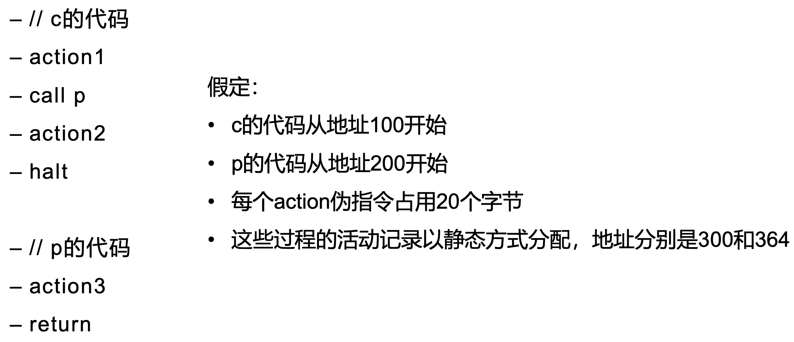
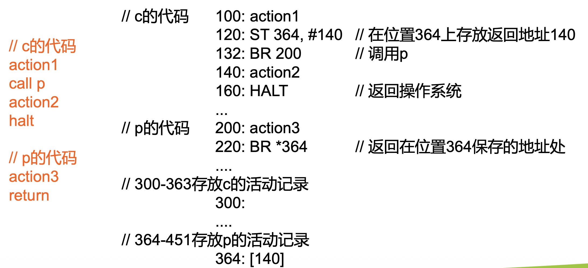
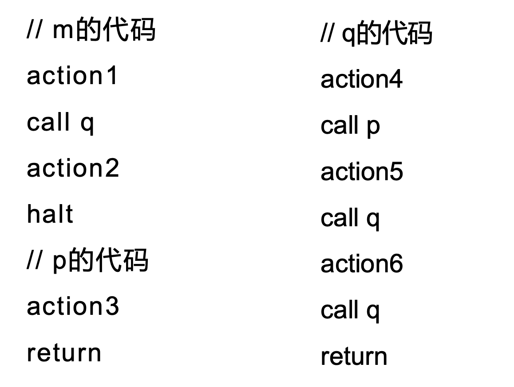
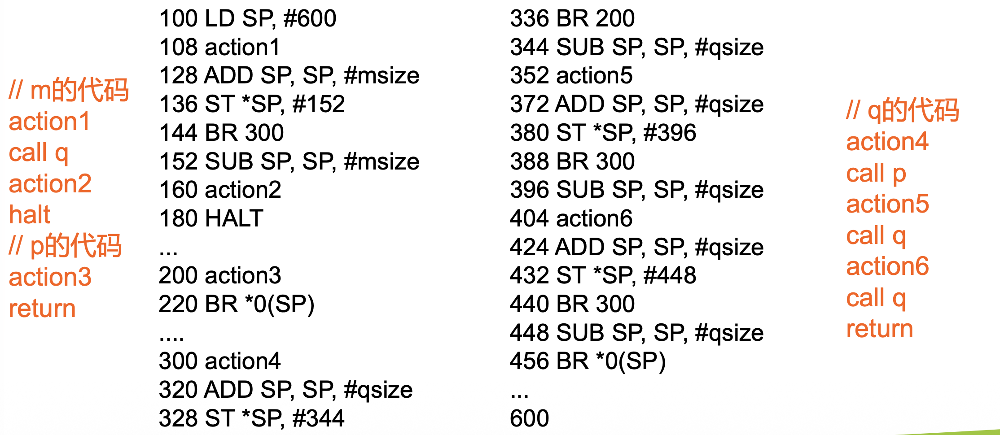
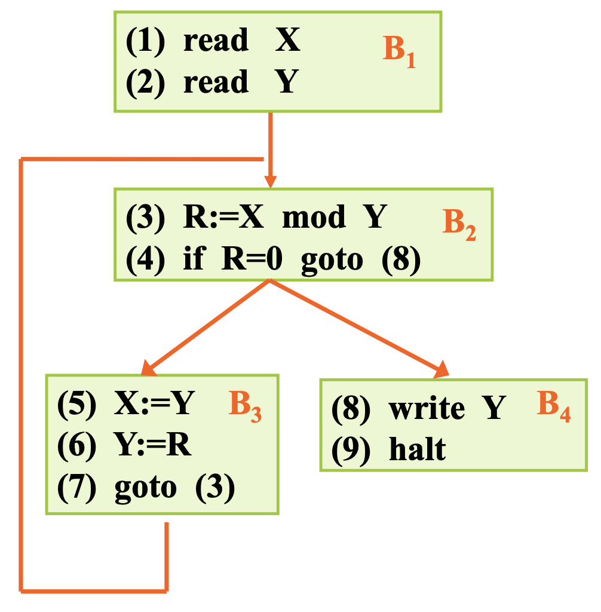
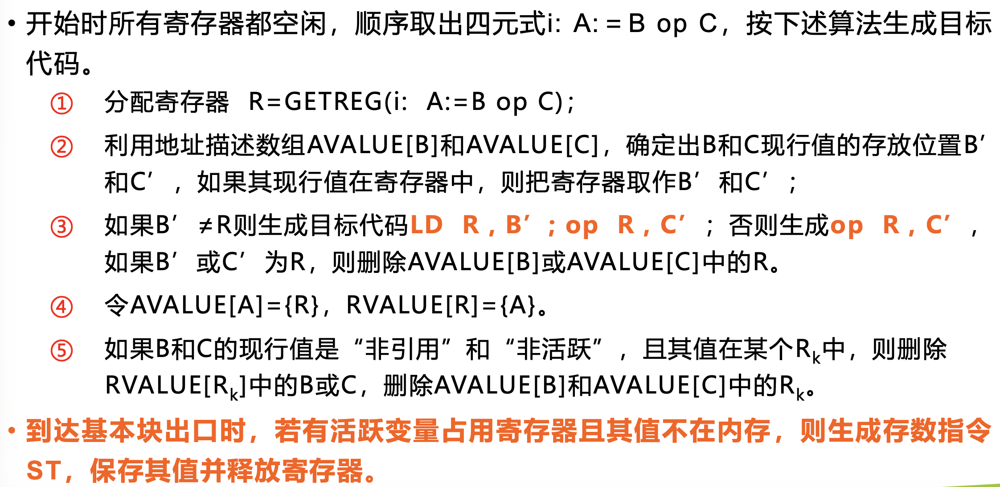
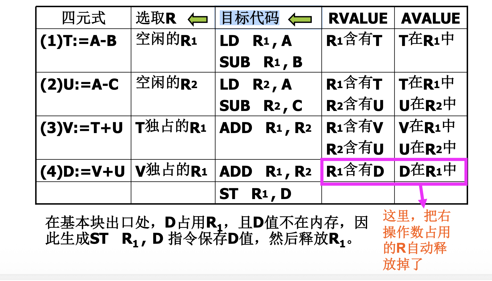
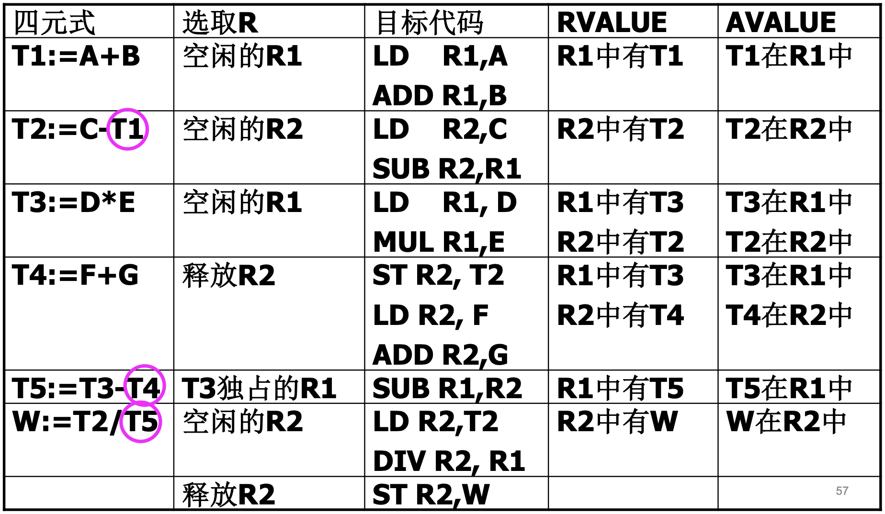

# Chapter 8: Target Code Generation 目标代码生成

> **重点**：
>
> 1. [活跃的定义](#待用信息链表法)
> 2. [寄存器分配原则](#算法流程)

[TOC]


## 代码生成简介

任务概述：把中间代码（经过优化或未经过优化）作为输入，将其转换成**特定机器语言**或**汇编语言**作为输出，这样的转换程序称为代码生成器( Code Generator)。

输入：（优化后的）IR

输出：特定机器的目标代码

需要考虑的基本问题：

- 如何使生成的**目标代码较短**（占用的空间小）
- 如何**充分利用计算机的寄存器**，减少目标代码访问存储单元的次数（执行速度快，用时短）

### 主要操作

代码生成器的主要操作有：

- **指令选取** (Instruction selection) : 选择合适的目标机器指令来实现中间表示（IR）语句
- **寄存器分配与指派** (Register allocation and assignment)：充分利用寄存器
- **指令调度** (Instruction scheduling，又称为指令排序，Instruction ordering)：决定指令执行的顺序
- **做与机器有关的优化**：比如寄存器及访存优化（上面3个操作中也包含了一部分优化）

#### 指令选取

##### Example1

为以下代码选取合适的指令

```
a=a+1
```

###### Answer

**方案一：**

```
LD R0, a
ADD R0, R0, #1
ST a, R0
```

更通用，但是代码长（3行），内存访问开销大，效率较低

**方案二：**

```
INC a
```

代码简洁（只有1行），但某些架构可能不支持内存直接操作（依赖硬件支持）


##### Example2

将寄存器R0设置为0，为此操作选取合适的指令

###### Answer

**方案一：**

```
LD R0 #0
```

方案评价：

- 无需内存访问
- 需要编码：操作码LD、目标寄存器R0、立即数0

**方案二：**

```
XOR R0, R0
```

方案评价：

- 无需内存访问
- 代码体积更小（针对特定指令集），因为只需要编码：操作码LD、寄存器R0，不用编码立即数。


#### 寄存器分配与指派

目的：高效利用寄存器资源，减少内存访问开销

难点：

- 寄存器数量有限
- 最优分配算法复杂
- 不同架构的寄存器约定（如调用约定、保留寄存器）不同，因此不同架构之间无法使用相同的寄存器分配与指派算法


#### 指令调度

目的：通过重新排列指令顺序，最大化利用CPU流水线，减少因依赖关系导致的停顿（Bubble），提升指令级并行性（ILP）

> **CPU流水线中的停顿——数据冲突**
>
> 产生数据冲突的原因：数据在尚未写入寄存器时，流水线后面的某一级就需要使用这个数据
>
> 后果：写入寄存器的值会在其后的几个时钟周期内不可用，导致浪费了这些时钟周期
>
> 优化方法：通过指令调度，让不依赖于该值的指令占用这些时钟周期，同时保持原始语义


## RISC架构指令集

### 基本操作

| 指令格式             | 作用                                              |
| -------------------- | ------------------------------------------------- |
| `LD dst, addr 	`  | 加载（从内存addr地址处，读取数据到目标寄存器dst） |
| `ST x, Ri `          | 存储（将寄存器`Ri`的数据写入内存`x`）             |
| `OP dst, src1, src2` | 二元运算（如加、减等）                            |
| `OP dst, src1`       | 一元运算                                          |
| `BR L `              | 无条件跳转（跳转到标签L）                         |
| `Bcond r, L `        | 条件跳转（根据寄存器r的值决定是否跳转到标签L）    |


### 指令中的寻址方式

| 寻址方式 | 含义                                                   | 开销 | 备注              |
| -------- | ------------------------------------------------------ | ---- | ----------------- |
| `#C`     | 立即数常量                                             | 1    | 不写`#`也可以     |
| `x`      | 绝对地址                                               | 1    | `x`代表任意变量   |
| `*x`     | 间接内存寻址                                           | 1    | `x`代表任意变量   |
| `R`      | 直接寄存器寻址                                         | 0    | `R`代表任意寄存器 |
| `*R`     | 间接寄存器寻址                                         | 0    | `R`代表任意寄存器 |
| `a(Ri)`  | 直接变址寻址（取出的内容为`contents(a+contents(Ri))`） | 1    | `a`为变量或常量   |
| `*a(Ri)` | 间接变址寻址                                           | 1    | `a`为变量或常量   |

> [!TIP]
>
> 除了与寄存器相关的寻址方式（直接寄存器寻址、间接寄存器寻址）的开销是0之外，其余寻址方式的开销都是1

> [!IMPORTANT]
>
> **直接变址寻址**
>
> Example：`LD R1, a(R2)`
>
> 含义：R1 = contents(a + contents(R2))，将寄存器R2中的值加上a的值，得到的和所指向位置中的内容（即`a(R2)`）加载进寄存器R1
>
> Example：`LD R1, 100(R2)`
>
> 含义：R1 = contents(100 + contents(R2))，将寄存器R2中的值加上100，得到的和所指向位置中的内容（即`100(R2)`）加载进寄存器R1
>
> **间接变址寻址**
>
> Example：`LD R1, *100(R2)`
>
> 含义：寄存器R2中的值加上100，得到的和所指向位置中的内容（即`100(R2)`）所代表的位置中的值（即`*100(R2)`）加载进寄存器R1


##### Example1

把以下代码语句写成汇编指令

```c
x = y - z
```

###### Answer

```
LD R1, y    		// R1 ← y
LD R2, z				// R2 ← z
SUB R1, R1, R2	// R1 ← R1-R2
ST x, R1				// x ← R1
```

##### Example2

把以下代码语句写成汇编指令，假设`a`是一个元素为**8字节**的数组 ，下标从0开始

```c
b = a[i]
```

###### Answer

```
LD R1, i			// R1 ← i
MUL R1, R1, 8 // R1 ← R1*8
LD R2, a(R1)	// R2 ← contents(a + contents(R1))
ST b, R2			// b ← R2
```

##### Example3

把以下代码语句写成汇编指令，假设`a`是一个元素为**8字节**的数组 ，下标从0开始

```c
a[j] = c
```

###### Answer

```
LD R1, c
LD R2, j
MUL R2, R2, 8
ST a(R2), R1
```

##### Example4

把以下代码语句写成汇编指令

```c
x = *p
```

###### Answer

```
LD R1, p
LD R2, 0(R1) 
ST x, R2
```

// To ASK: 为什么不是直接`LD R1, *p`?

##### Example5

把以下代码语句写成汇编指令，假设M是标号为L的三地址码的第一个指令的标号

```c
if x<y goto L
```

###### Answer

```
LD R1, x
LD R2, y
SUB R1, R1, R2 
BLTZ R1, M			// if R1<0, then jump to M
```

##### Example6

把以下代码语句写成汇编指令

```c
x = b*c
y = a+x
```

###### Answer

方案一：

```
LD R1, b
LD R2, c
MUL R3, R1, R2
ST x, R3

LD R4, a
ADD R5, R4, R3
ST y, R5
```

以上做法不太好，因为**没有复用寄存器**

方案二：（更好）

```
LD R1, b
LD R2, c
MUL R1, R1, R2
ST x, R1

LD R2, a
ADD R2, R2, R1
ST y, R2
```

##### Example7!

把以下代码语句写成汇编指令，假设a和b是元素为4字节值的数组

```c
x = a[i]
y = b[j]
z = x*y
```

###### Answer

方案一：没有限定寄存器的数量

```
LD R1, i
MUL R1, R1, 4
LD R2, a(R1)
ST x, R2

LD R1, j
MUL R1, R1, 4
LD R3, b(R1)
ST y, R3

MUL R1, R2, R3 // R1 ← R2*R3, z=x*y
ST z, R1
```

方案二：

如果限定只有2个寄存器，则要重新加载一次`x`

```
LD R1, i
MUL R1, R1, 4
LD R2, a(R1)
ST x, R2

LD R1, j
MUL R1, R1, 4
LD R2, b(R1)
ST y, R2

LD R1, x			 // 重新加载 x
MUL R1, R1, R2 // R1 ← R1*R2, z=x*y
ST z, R1
```

##### Example8!

把以下代码语句写成汇编指令

```c
y = *q
q = q+4
*p = y
p = p+4
```

###### Answer 

```
LD R1, q
LD R2, 0(R1)
ST y, R2

ADD R1, R1, 4 // q = q+4
ST q, R1

LD R1, p
// LD R2, y 			// y 前面已经在R2里面了，k可以不用再次load
ST 0(R1), R2 	// *p = y 

ADD R1, R1, 4 // p = p+4
ST p, R1
```

##### Example9!

把以下代码语句写成汇编指令

```
		if x<y goto L1
		z=0
		goto L2
L1: z=1
```

###### Answer

```
    LD R1, x
    LD R2, y
    SUB R1, R1, R2
    BLTZ R1, L1 
		LD R1, 0
		ST z, R1
		BR L2					 // goto L2

L1: 
		LD R1, 1
		ST z, R1
L2: 
		...
```


### 程序和指令的代价

- 一条指令的代价 = 1 + 操作数寻址代价
- 一个程序的代价 = 所有指令代价的总和

##### Example

确定下列指令序列的代价

(1)

```
LD R0, y				// 2
LD R1, z				// 2
ADD R0, R0, R1	// 1
ST x, R0				// 2
```

总代价：7

(2)

```
LD R0, i				// 2（i的寻址代价为1）
MUL R0, R0, 8		// 2（8的寻址代价为1）
LD R1, a(R0)		// 2（a(R0)的寻址代价为1）
ST b, R1				// 2（b的寻址代价为1）
```

总代价：8


## 存储分配 (Storage Allocation)

存储分配主要有：

- 静态分配 (Static Allocation)
- 栈分配 (Stack Allocation)
- 堆分配 (Heap Allocation)

符号说明：

- call 表示过程调用
- callee 是被调用的过程或函数

### 静态分配

call callee 的实现：

1. 保存返回地址：`ST callee.staticArea, #here+20`

> `#here` 表示当前指令的地址
>
> `+20`假设调用序列需占用20字节
>
> `#here+20` 表示返回地址

2. 跳转到被调用过程的目标代码`BR callee.codeArea`

return 的实现：

1. 跳转到记录下的返回地址上：`BR *callee.staticArea` 

##### Example





### 栈分配

初始化栈指针：

```
LD SP, #stackStart	// 在寄存器SP中存放栈指针

... 								// main函数的代码

HALT								// 程序终止
```

call callee 的实现：

```
ADD SP, SP, #caller.recordSize	// 扩展栈空间
ST 0(SP), #here+16							// 保存返回地址
BR callee.codeArea							// 跳转到被调用程序(calee)
SUB SP, SP, #caller.recordSize	// 恢复栈指针（当程序返回到调用者时执行）
```

return 的实现：

```
BR *0(SP)												// 返回到调用者(caller)
```

##### Example






## 基于基本块的代码生成器

### 基于基本块的寄存器分配原则

- 当生成某变量的目标代码时，尽量**让变量的值或中间结果保留在寄存器中**。直到寄存器不够分配为止，这样引用变 值时可减少对 存的存取次数 ，提高运行速度
- 进入基本块时所有寄存器是空闲的，当到基本块出口时，应将变量的有用值存回内存，**释放所有寄存器**
- 在基本块 ，后面**不再被引用的变量**占用的寄存器应**尽早释放**，以提高寄存器的利用效率

### 待用信息链表法

#### 基本定义

**定值、引用、活跃**：

在形如` i: A:=B+C `的代码中，

出现在`:=`**左边**的变量，被称为对变量的**定值**（对变量`A`定值）

出现在`:=`**右边**的变量，被称为对变量的**引用**（对变量`B`和`C`引用）

$i$被称为变量的**定值点**或**引用点**。

若定值变量的值在$i$之后的代码序列**被引用**，则称变量在$i$点是**活跃**的。

> [!WARNING]
>
> 定值、引用、活跃**没有要求**一定要在一个基本块中

**待用信息**：

在基本块中，变量`A`在四元式$i$中被定值，在$i$后面的四元式$j$中引用`A`值，且从$i$到$j$之间没有其他对`A`的定值点，称$j$是$i$中对变量 `A`的**待用信息**（下次引用信息）。

所有这样的待用信息$j_k(k=1,2,…)$构成待用信息链。

例如：

```
i:  A := ...
...
j1: x := A+1
...
j2: y := A*10
...
```

$j_1,j_2$是$i$中对变量`A`的待用信息。

##### Example



1. 在基本块B2中，`R`在(3)处定值，在(4)处被引用，所以(4)是(3)中`R`的**待用信息**
2. 在流程B3->B2，`X`在(5)处定值，在(3)处被引用，所以`X`在(5)处是**活跃**的

> [!WARNING]
>
> 待用信息要求在同一个基本块内
>
> 活跃就不要求在同一个基本块内

#### 基本块内求待用信息的算法

##### 表示方法

在**符号表**中添加关于所有变量的**待用信息**和**活跃信息**；

在**四元式表**中也添加关于结果变量、左右操作数变量的**待用信息**和**活跃信息**。

用一个二元组表示待用情况和活跃情况，形如：`(待用情况,活跃情况)`，具体如下：

1. 第一个元表示待用情况：
   - 如果**非待用**，则填 F
   - 如果**待用**，则填**被引用的四元式序号**

2. 第二个元表示活跃情况：
   - 如果**非活跃**，则填 F
   - 如果**活跃**，则填 L

例如:

- (F, F)：表示非待用，非活跃
- (F, L)：表示非待用，活跃
- (4, L)：表示在第4条四元式被引用，活跃

##### 算法流程

下面以一个例子进行介绍：

有如下基本块：

```
(1) T:=A-B
(2) U:=A-C
(3) V:=T+U
(4) D:=V+U
```

其中，

- A,B,C,D是用户变量（说明在基本块出口活跃）

- T,U,V是临时变量（说明在基本块出口不活跃）


###### Step1: 列四元式表和符号表

**四元式表**

> **四元式表**中添加关于结果变量、左右操作数变量的**待用信息**和**活跃信息**

| 序号 | 四元式 | 结果 | 左操作数 | 右操作数 |
| ---- | ------ | ---- | -------- | -------- |
| 1    | T:=A-B |      |          |          |
| 2    | U:=A-C |      |          |          |
| 3    | V:=T+U |      |          |          |
| 4    | D:=V+U |      |          |          |

**符号表**

> **符号表**中添加关于所有变量的**待用信息**和**活跃信息**
>
> 每个四元式写一列（**逆序**）
>
> 初值另外写一列

| 变量名 | 初值 | (4)  | (3)  | (2)  | (1)  |
| ------ | ---- | ---- | ---- | ---- | ---- |
| A      |      |      |      |      |      |
| B      |      |      |      |      |      |
| C      |      |      |      |      |      |
| D      |      |      |      |      |      |
| T      |      |      |      |      |      |
| U      |      |      |      |      |      |
| V      |      |      |      |      |      |

###### Step2: 填写初值

在符号表中的初值一列，将各变量的待用信息全部填 F （非待用）；活跃信息根据变量在基本块出口是否活跃来填L或F（假定**用户变量**都是**活跃**的，**临时变量**都是**非活跃**的）

| 变量名 | 初值   | (4)  | (3)  | (2)  | (1)  |
| ------ | ------ | ---- | ---- | ---- | ---- |
| A      | (F, L) |      |      |      |      |
| B      | (F, L) |      |      |      |      |
| C      | (F, L) |      |      |      |      |
| D      | (F, L) |      |      |      |      |
| T      | (F, F) |      |      |      |      |
| U      | (F, F) |      |      |      |      |
| V      | (F, F) |      |      |      |      |

四元式表保持不变

###### Step3: 逐条四元式进行分析

从基本块出口的四元式开始**由后向前**依次处理各个四元式 `i: A:=B op C `，直到处理完为止：

1. 在四元式表中填写结果信息：
   - 找到行号为$i$，列名为“结果”的位置，把符号表中变量`A`的最新待用、活跃情况填入该位置
2. 在符号表中填写结果信息：
   - 找到变量名为`A`,列名为“$(i)$”的位置
   - 填入(F, F) ——因为变量`A`在四元式$i$中的定值只能在之后的四元式中引用，不可能被之前的四元式引用，所以对于四元式$i$以前的四元式来说，变量`A`是非待用、非活跃的。
3. 在四元式表中填写左右操作数信息：
   - 找到行号为$i$，列名为“左操作数”的位置，把符号表中变量`B`的最新待用、活跃情况填入该位置
   - 找到行号为$i$，列名为“右操作数”的位置，把符号表中变量`C`的最新待用、活跃情况填入该位置
4. 在符号表中填写左右操作数信息：
   - 找到变量名为`B`,列名为“$(i)$”的位置和变量名为`C`,列名为“$(i)$”的位置，均填入 ($i$, L)

> [!WARNING]
>
> 谨记处理四元式的顺序是：**从后向前**


下面对上述例子逐一处理其中的四元式：

**处理(4)**

| 序号 | 四元式 | 结果   | 左操作数 | 右操作数 |
| ---- | ------ | ------ | -------- | -------- |
| 1    | T:=A-B |        |          |          |
| 2    | U:=A-C |        |          |          |
| 3    | V:=T+U |        |          |          |
| 4    | D:=V+U | (F, L) | (F, F)   | (F, F)   |

| 变量名 | 初值   | (4)    | (3)  | (2)  | (1)  |
| ------ | ------ | ------ | ---- | ---- | ---- |
| A      | (F, L) |        |      |      |      |
| B      | (F, L) |        |      |      |      |
| C      | (F, L) |        |      |      |      |
| D      | (F, L) | (F, F) |      |      |      |
| T      | (F, F) |        |      |      |      |
| U      | (F, F) | (4, L) |      |      |      |
| V      | (F, F) | (4, L) |      |      |      |


**处理(3)**

| 序号 | 四元式 | 结果   | 左操作数 | 右操作数 |
| ---- | ------ | ------ | -------- | -------- |
| 1    | T:=A-B | (3, L) |          |          |
| 2    | U:=A-C | (3, L) |          |          |
| 3    | V:=T+U | (4, L) |          |          |
| 4    | D:=V+U | (F, L) |          |          |

| 变量名 | 初值   | (4)    | (3)    | (2)  | (1)  |
| ------ | ------ | ------ | ------ | ---- | ---- |
| A      | (F, L) |        |        |      |      |
| B      | (F, L) |        |        |      |      |
| C      | (F, L) |        |        |      |      |
| D      | (F, L) | (F, F) |        |      |      |
| T      | (F, F) |        | (3, L) |      |      |
| U      | (F, F) | (4, L) | (3, L) |      |      |
| V      | (F, F) | (4, L) | (F, F) |      |      |


**处理(2)**

| 序号 | 四元式 | 结果   | 左操作数 | 右操作数 |
| ---- | ------ | ------ | -------- | -------- |
| 1    | T:=A-B | (3, L) | (2, L)   |          |
| 2    | U:=A-C | (3, L) | (F, L)   |          |
| 3    | V:=T+U | (4, L) | (F, F)   |          |
| 4    | D:=V+U | (F, L) | (F, F)   |          |

| 变量名 | 初值   | (4)    | (3)    | (2)    | (1)  |
| ------ | ------ | ------ | ------ | ------ | ---- |
| A      | (F, L) |        |        | (2, L) |      |
| B      | (F, L) |        |        |        |      |
| C      | (F, L) |        |        | (2, L) |      |
| D      | (F, L) | (F, F) |        |        |      |
| T      | (F, F) |        | (3, L) |        |      |
| U      | (F, F) | (4, L) | (3, L) | (F, F) |      |
| V      | (F, F) | (4, L) | (F, F) |        |      |


**处理(1)**

| 序号 | 四元式 | 结果   | 左操作数 | 右操作数 |
| ---- | ------ | ------ | -------- | -------- |
| 1    | T:=A-B | (3, L) | (2, L)   | (F, L)   |
| 2    | U:=A-C | (3, L) | (F, L)   | (F, L)   |
| 3    | V:=T+U | (4, L) | (F, F)   | (4, L)   |
| 4    | D:=V+U | (F, L) | (F, F)   | (F, F)   |

| 变量名 | 初值   | (4)    | (3)    | (2)    | (1)    |
| ------ | ------ | ------ | ------ | ------ | ------ |
| A      | (F, L) |        |        | (2, L) | (1, L) |
| B      | (F, L) |        |        |        | (1, L) |
| C      | (F, L) |        |        | (2, L) |        |
| D      | (F, L) | (F, F) |        |        |        |
| T      | (F, F) |        | (3, L) |        | (F, F) |
| U      | (F, F) | (4, L) | (3, L) | (F, F) |        |
| V      | (F, F) | (4, L) | (F, F) |        |        |

处理完毕！


### 代码生成算法

#### 符号说明

##### 寄存器描述数组 RVALUE

> 记录每个寄存器当前的使用情况。

- RVALUE[Ri]={A}: 表示Ri里的值是变 A的值，或说A独占Ri。
- RVALUE[Ri]={B, C}：表示Ri里的值是变 B和C的值，或说B, C共占Ri。（比如在复写B:=C时，就会出现此情况）
- RVALUE[Ri]={ }：表示Ri是空闲的。

##### 变量地址描述数组AVALUE

> 记录变量的地址（寄存器或者内存单元）

- AVALUE[A]={Ri}: 表示变量`A`的值在寄存器 Ri 中
- AVALUE[B]={Ri, B}: 表示变量`B`的值既在寄存器 Ri 中，又在内存单元（用变量名来表示）
- AVALUE[C]={C}: 表示变量`C`的值在内存单元（用变量名来表示）

##### 寄存器分配函数 GETREG

以形如`i: A:=B op C`的四元式为输入，返回一个寄存器R，用于存放A的运算结果值。

其中的寄存器分配算法为：

###### Step1（**复用已有寄存器**）

若遇到情况1或2，则选用Ri作为R，跳转至Step4

- 情况1：B独占Ri，且B与A是同一标识符（例如：`x=x+y`）；
- 情况2：B独占Ri，且B不再被引用。

###### Step2（**用空闲寄存器**）

否则，若有空闲的寄存器，就选用它为R，跳转至Step4

###### Step3（**释放寄存器再使用**）

否则，需要先释放一个寄存器Ri。

释放的寄存器Ri最好是下面两种之一：

- Ri的变量值已经**在内存中**。
- Ri的变量值在基本块中**引用的位置最远**。

如果Ri中的变量不是A，而是M，且M的值不在内存中，则做如下处理：

1. 把Ri的值存回变量M所在的内存的地址：`ST Ri, M`
2. 修改变量地址描述：
   - 若M不是B，则 AVALUE[M]={M}
   - 若M是B，则 AVALUE[M]={M, Ri}
3. 修改寄存器描述：删除RVALUE{Ri}中的M。

###### Step4：给出R，返回


#### 算法流程



##### Example1

设只有R1和R2**两个**寄存器，利用基本块代码生成算法生成目标代码

```
(1) T:=A-B
(2) U:=A-C
(3) V:=T+U
(4) D:=V+U
```



##### Example2

设只有R1和R2**两个**寄存器，利用基本块代码生成算法生成目标代码


