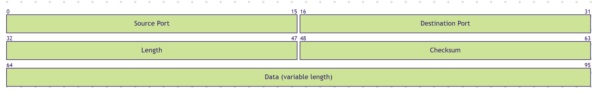
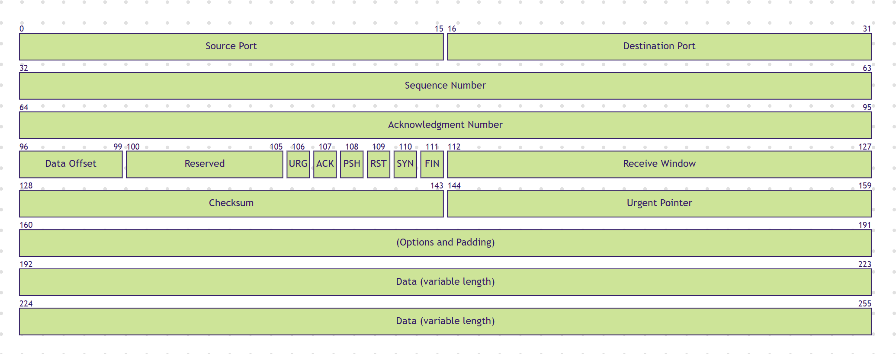
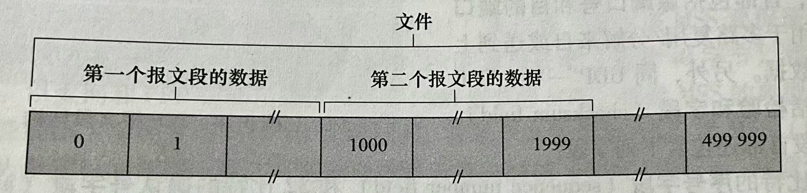
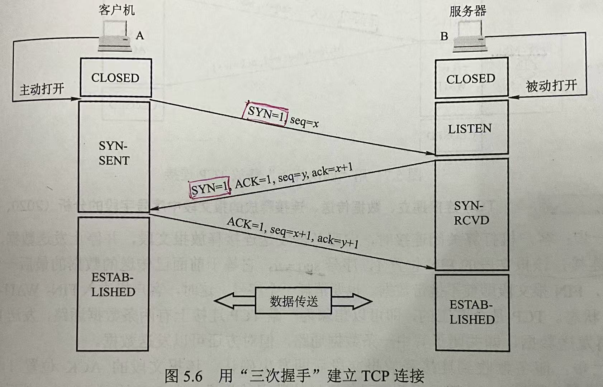
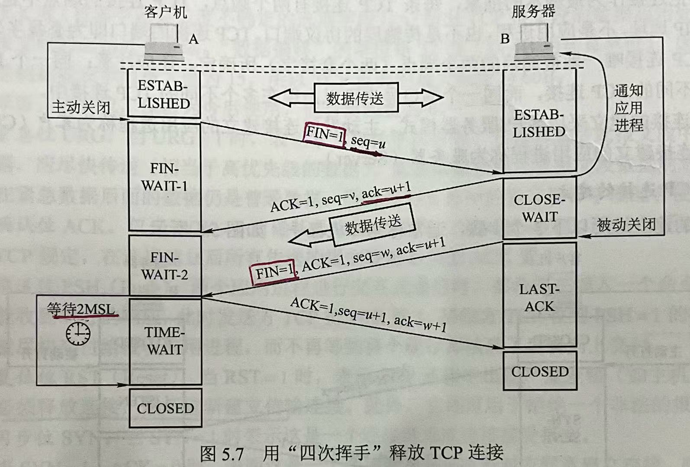
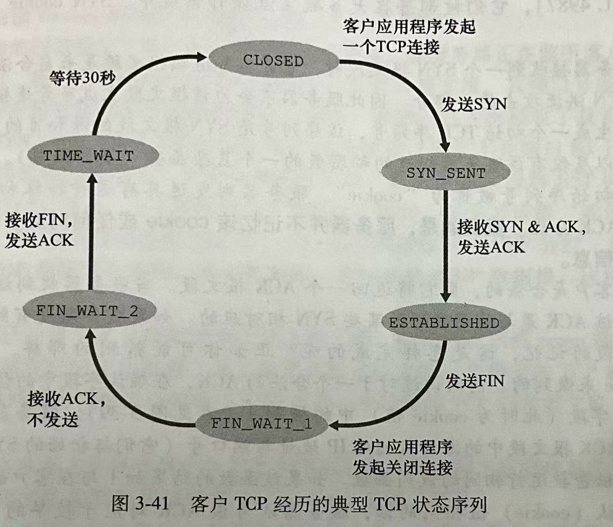
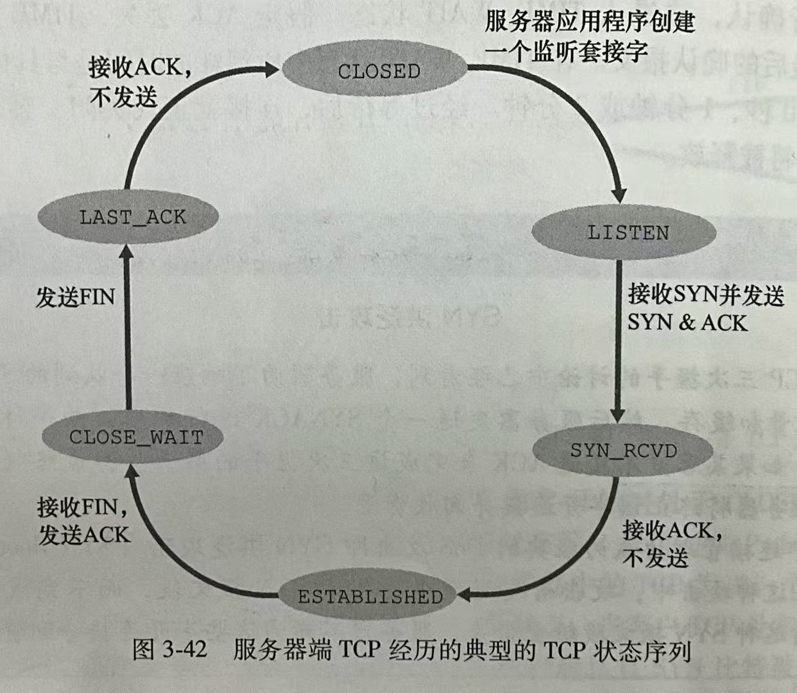
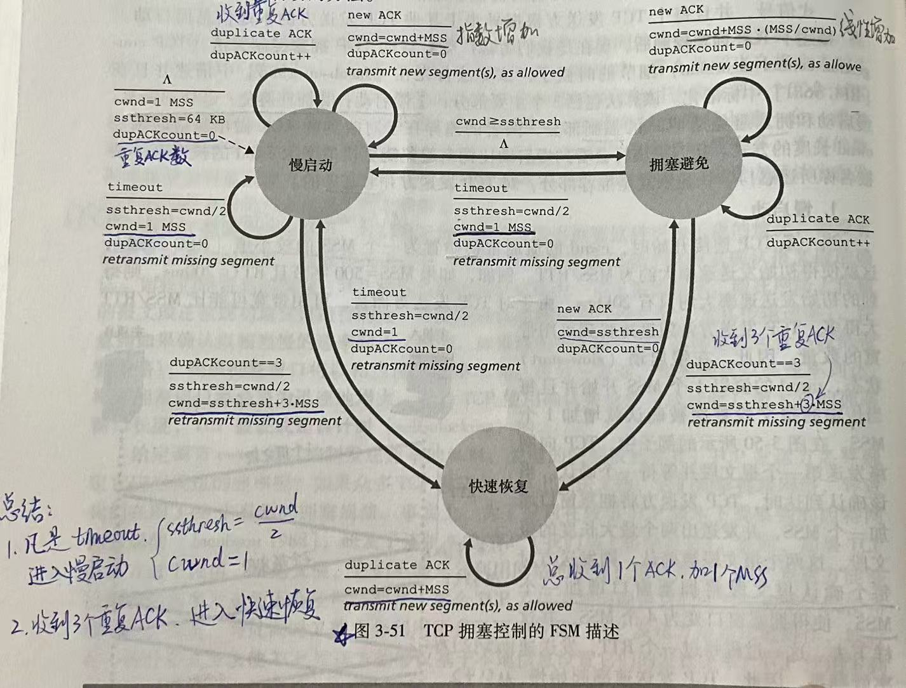

# 传输层的作用

提供进程之间的通信（称为：**端到端**连接）

注意：是“端到端”，不是“点到点”！

# 传输层的多路复用与多路分解

> **多路复用**：源主机从不同套接字中收集数据块，并为每个数据块封装上首部信息，从而生成报文段（segment），然后将报文段传递给网络层
>
> **多路分解**：在接收端，传输层检查报文段的相应字段，标识出接收套接字，进而将报文段定向到对应的套接字。

> **端口号**：
>
> 一个16比特的数，范围：0~65535
>
> 0~1023范围内的端口号是**周知端口号**，保留给周知的应用层协议使用。
>
> 其余的端口号可以随便使用，只要不重复就行。

## 无连接的多路复用与多路分解

UDP套接字由一个二元组来全面标识，该二元组包含一个目的IP地址和一个目的端口号
$$
<dest \; IP,\; dest \; port>
$$
如果两个UDP报文段拥有**相同的目的IP地址和目的端口号**，它们会通过相同的目的套接字定向到相同的目的进程。

> [!CAUTION]
>
> UDP套接字中并非没有源IP地址和源端口号，只是它们没有用来标识UDP套接字而已。
>
> UDP套接字中**源IP地址和源端口号的作用**：
>
> 作为返回地址。比如：A向B发送了一个UDP报文段，当B要向A回发一个UDP报文段时，则B可以从A到B报文段中取出源IP和源端口号的值作为从B到A报文段的目的IP和目的端口号。

## 面向连接的多路复用与多路分解

TCP套接字由一个四元组来全面标识，该四元组包含一个源IP地址，一个源端口号，一个目的IP地址和一个目的端口号
$$
<src \; IP,\; src \; port, \; dest \; IP,\; dest \; port>
$$
如果两个TCP报文段拥有**相同的目的IP地址和目的端口号**，但是拥有**不同的源IP地址或源端口号**，它们会被定向到两个不同的套接字。

# 可靠数据传输协议

## 流水线可靠数据传输协议

### 回退N步 Go Back N steps, GBN

> **累积确认**：
>
> 发送方收到`ACK n`，就表示接收方已经正确收到序号为n以及之前的所有分组。

**工作原理**：

GBN采用**累积确认**

发送方维护一个窗口[`base`, `base + N`] 以及 `nextseqnum`（`nextseqnum`用于分隔窗口内 已经发送但未被确认的分组 与 未发送的分组）；接收方按顺序接收分组，只有按顺序到达的分组才发ACK，乱序到达的分组会被丢弃，**不会被缓存**。

对于乱序到达的分组`n`($n>i+1$)，接收方将它丢弃，并返回最近成功接收（有序接收）的分组`i`的`ACK i`；（正因为这个机制，**发送方收到的ACK必然是按顺序的**，即使出现了丢包等情况）

对于顺序到达的分组`i+1`，接收方返回该分组的`ACK i+1`；

由于采用**累积确认**，发送方接收到`ACK j`后，即使未收到`ACK k`(k<j)，也认为分组`j`及其之前的分组已被收到，因此不会再重传这些分组，而是发送分组`j+1`及窗口内后面的分组。只有当`base`的分组被确认后，窗口才能后移1格。

### 选择重传 Selective Repeat, SR

**工作原理**：

发送方维护一个窗口[`send_base`, `send_base + N`] ，接收方维护一个窗口[`rcv_base`, `rcv_base + N`] 。

发送方可以标记乱序到达的ACK，**接收方也可以缓存乱序到达的分组**。

当接收方收到乱序到达的分组`n`时，如果该分组在接收窗口[`rcv_base`, `rcv_base + N`] 内，则会缓存下来，并返回该分组的`ACK n`；如果该分组在接收窗口[`rcv_base - N`, `rcv_base - 1`]内，则 返回该分组的`ACK n`；其余情况，忽略该分组。

当接收方收到顺序到达的分组时，该分组的序号就等于`rcv_base`，则将该分组及其以前缓存连续的分组交付给上层，只有这时，接收窗口才会向后移至未接收的最小序号处。

当发送方收到乱序到达的`ACK n`时，如果该分组在发送窗口[`send_base`,`send_base + N`]内，则会标记该分组已成功被接收；

当发送方收到顺序到达的分组时，该分组的序号就等于`send_base`，只有这时，发送窗口才会向后移至未确认的最小序号处。

# 传输层两大协议

## UDP

提供的服务：

- 不可靠
- 无连接

UDP相比于TCP的优点：

- 关于发送数据的内容以及何时发送的**应用控制更精细**：TCP由于有拥塞控制机制和重传机制，导致其可靠交付的时间不确定，可能会比较长。而UDP一旦收到应用层的数据，就会将此数据打包进UDP报文段并立即传递给网络层，速度更快。
- **无须建立连接**：TCP在开始数据传输之前需要通过三次握手建立连接，而UDP则可以直接进行数据传输。
- **无连接状**态：TCP需要在端系统中维护连接状态，连接状态包括接收和发送缓存、拥塞控制参数、序号、确认号参数。由于UDP不维护连接状态，因此也不需要维护这些参数。
- 分组**首部开销小**：TCP的首部有20字节，UDP的首部仅有8字节。

考虑到这些优点，部分应用没有选择用TCP，而是用UDP。

使用UDP的应用：

- 域名转换 DNS
- 网络管理 SNMP协议
- 流式多媒体、因特网电话等注重实时性能的应用
- QUIC
- DHCP：自动获取IP地址

### UDP报文段结构

UDP首部由8字节组成，之后的是数据部分。

> [!CAUTION]
>
> UDP报文段的长度字段是指UDP数据报的长度，包含**UDP首部和数据部分**。

### UDP检验和

> UDP检验和提供了**差错检测**功能 （只是差错检测，不能纠错）

#### 关键计算：UDP检验和

UDP检验和的计算方法：

1. 将UDP报文段分成16比特的字，
2. 对UDP报文段中所有16比特的字求和，求和时遇到**任何溢出都被回卷（即：把溢出的数字加到最低位）**
3. 将最后的求和结果取反码，得到UDP检验和

#### 利用UDP检验和检测差错的方法

接收方将所有16比特字（包括检验和）全部加在一起，

若求和结果为 $1111 1111 1111 1111$（16个比特全是1），则没有差错；

否则，分组出错。

> [!CAUTION]
>
> 如果同时有2个比特出错，可能就检验不出来了。

## TCP

提供的服务：

- 可靠数据传输
- 面向连接
- 拥塞控制
- 全双工
- 点对点：单个发送方与单个接收方之间的连接，“多播”对于TCP而言不可能

使用TCP的应用：

- HTTP
- SMTP
- Telnet：用于远程登录的应用层协议。

### TCP报文段结构

序号：32bit，序号范围是0~$2^{32}-1$

> [!CAUTION]
>
> TCP报文段中的接收窗口是**流量控制的接收窗口**，不是拥塞控制的拥塞窗口！

### 序号

> TCP把数据看成一个无结构的、有序的字节流。

TCP的序号是建立在传送的字节流上的，而不是建立在传送的报文段的序列之上。

假设数据流由一个500000字节的文件组成，其MSS(最大报文段长)为1000字节，数据流的首字节编号为0，则TCP会将该数据流构建成500个报文段。第1个报文段分配序号0，第2个报文段分配序号1000（注意：不是1！），第3个报文段分配序号2000（注意：不是2！），以此类推。

### 确认号

> TCP的确认号是期望接收到的**下一字节**的序号

> [!CAUTION]
>
> TCP的确认号与前面讨论的可靠数据传输协议中的确认号不同！
>
> 前面讨论的可靠数据传输协议中，确认号是当前接收到的分组序号。
>
> 但是TCP的确认号是期望接收到的**下一字节**的序号！

比如：主机A已经收到一个来自主机B的包含字节0~535的报文段，以及一个包含字节900~1000的报文段，但还未收到字节536~899的报文段。

这时主机A还在等待字节536。因此，主机A会在确认号字段中包含536（即：ACK 536）

### 往返时间的估计

> **样本RTT (SamepleRTT)**:
>
> 报文段从被交给IP到该报文确认被收到之间的时间

SamepleRTT的均值EstimatedRTT：

采用**指数加权移动平均**的方式计算
$$
EstimatedRTT = (1-\alpha)\cdot EstimatedRTT + \alpha \cdot SamepleRTT
$$
$\alpha$的推荐值$\alpha = \frac{1}{8} =0.125$​​.

> [!CAUTION]
>
> 当只有**第一个**SamepleRTT到来时，$EstimatedRTT = SamepleRTT$ &#10004;​
>
> 而不是$EstimatedRTT = \alpha \cdot SamepleRTT$ &#10006;

RTT的偏差DevRTT：
$$
DevRTT = (1-\beta) \cdot DevRTT + \beta \cdot \left| SampleRTT - EstimatedRTT \right|
$$
$\beta$的推荐值：0.25

### 超时重传间隔

超时间隔设置为
$$
TimeoutInterval = EstimatedRTT + 4\cdot DevRTT
$$
推荐初始的TimeoutInterval值为1秒

### TCP的可靠数据传输

TCP与GBN类似，都是**累积确认**，接收方对于正确接收但乱序到达的报文段`n`是不会发送`ACK n`的，而是发送最近未被确认的报文段序号的ACK。

不同的是TCP**会缓存**乱序到达的分组。

### 流量控制

> **流量控制（Flow Control）**：
>
> 流量控制是为了消除发送方使**接收方缓存溢出**的可能性。

假设主机A通过一个TCP连接向主机B发送一个大文件。

主机B会为该连接分配一个接收缓存，其大小记为$RcvBuffer$,

记主机B中：

- $LastByteRead$ 表示被应用程序读出缓存的最后一个字节编号。
- $LastByteRcvd$​ 表示从网络中到达且放入主机B接收缓存中的数据流的最后一个字节编号。
- 接收窗口大小为$rwnd$.

则主机B的接收缓存中未读的TCP数据大小为$LastByteRcvd - LastByteRead$。

由于TCP不允许已分配的缓存溢出，所以有
$$
LastByteRcvd - LastByteRead \leq RcvBuffer
$$
接收缓存中剩余空闲的空间就是接收窗口的大小
$$
rwnd = RcvBuffer -\left[LastByteRcvd - LastByteRead\right]
$$
主机B将$rwnd$放入它发给主机A的报文段的**接收窗口字段**中，以告知主机A，自己剩余的缓存空间大小。在开始时，主机B就设定$rwnd = RcvBuffer$​

主机A轮流跟踪两个变量：$LastByteSent$ 和 $LastByteAcked$

显然，主机A发送到TCP连接中但是未被确认的数据量为$LastByteSent - LastByteAcked$

只要将未确认的数据量控制在$rwnd$之内，
$$
LastByteSent - LastByteAcked \leq rwnd
$$
主机B的接收缓存就不会溢出。

#### 小问题

假设主机B的接收缓存已满，即$rwnd = 0$。而且假设主机B在发送$rwnd = 0$的报文段给主机A后，不再发送任何数据给主机A。

在这种情况下，主机A就永远不知道什么时候主机B的接收缓存有新的空间，导致主机A被阻塞而不能再发送数据！

#### 解决方法

TCP规范要求：当主机B的$rwnd = 0$时，主机A会继续发送只含有**1个字节**数据的报文段（用来试探何时主机B有缓存）

### TCP连接

#### 创建连接：三次握手

第一次握手：客户端发送连接请求报文段。`SYN=1`,`seq=client_isn`

> [!CAUTION]
>
> 注意：`SYN=1`的报文段**不能携带数据**，但是要**消耗1个序号**。

第二次握手：服务器如果同意建立连接，则向客户端发送确认。确认报文段中，`STN=1`,`ACK=1`,确认号`ack=client_isn+1`，序号`seq=server_isn`

> [!CAUTION]
>
> 与第一次握手同理，该报文段由于`SYN=1`，所以**不能携带数据**，但是要**消耗1个序号**。

第三次握手：客户端对确认报文做出确认。`SYN=0`,`ACK=1`,确认号`ack=server_isn+1`，序号`seq=client_isn+1`

> [!CAUTION]
>
> 注意：该报文段可以携带数据，也可以不携带数据。**若不携带数据，则不消耗序号！**若携带数据，必然是会消耗序号的

#### 关闭连接：四次挥手

第一次挥手：客户端发送 `FIN=1` 的报文段，`seq=x `,`ack=y`.

> [!CAUTION]
>
> 注意：这时的TCP报文段中不含任何数据，但是仍会**消耗1个序号**

第二次挥手：服务器发送对连接释放报文段的确认，报文段中`ACK=1`,确认号`ack=x+1`（因为客户端发送的 `FIN=1` 的报文段中，占用了1个序号）,`seq=v`（v$\geq$​​y，因为服务器在收到客户端发送的 `FIN=1` 的报文段之前可能还发送了数据）

> [!CAUTION]
>
> 注意：
>
> - 第二次挥手时，服务器可以在该报文段中包含数据。（假设发送了k字节数据）
>
> - 客户端收到确认后，客户端到服务器的连接就释放了

第三次挥手：服务器发送 `FIN=1` 的报文段，`seq=w `（w=v+k）,`ack=x+1`.

第四次挥手：客户端发送对连接释放报文段的确认，报文段中`ACK=1`,确认号`ack=w+1`,序号`seq=x+1`

服务器收到确认后，服务器也关闭连接。

注意：

- 若Server在CLOSE_WAIT阶段没有数据要发，则可以将它的ACK和FIN合并在一起发给Client。（即：将第二次挥手和第三次挥手的报文合并起来）

- 若Client和Server都不再发数据，则可以同时发送FIN给对方来结束连接。

#### 客户TCP状态序列

#### 服务器TCP状态序列

### 拥塞控制!

TCP拥塞控制算法包含3部分：

1. 慢启动
2. 拥塞避免
3. 快速恢复（TCP Reno版本才有，早期的TCP Tahoe中没有）

#### 慢启动

在一条TCP连接开始时，拥塞窗口$cwnd$通常初始化为1个MSS的较小值。

当第一个TCP报文段被确认后，发送方会将拥塞窗口增加1个MSS，变成$cwnd = 2MSS$

这时TCP发送方就能够发出一次2个最大长度的报文段。

这两个报文段都被确认时，每一个确认会使拥塞窗口增加1个MSS，变成$cwnd = 4MSS$

这样下去，每过1个RTT就会将$cwnd$翻倍，发送速度就会以指数增长。

结束时间：

1. 如果存在一个超时指示的丢包事件，则将$cwnd$设为1，重新开始慢启动。
2. 如果$cwnd$达到了**慢启动阈值 ssthresh**，则会结束慢启动，进入拥塞避免状态。

> [!CAUTION]
>
> 注意：
>
> 假如$ssthresh = 12MSS，cwnd=1MSS$，
>
> 在慢启动阶段，经过3个RTT，$cwnd = 8MSS$，再经过1个RTT（假如没有出现丢包和超时），那么$cwnd$应该变成多少？
>
> 假如没有$ssthresh$的限制，$cwnd$应该变为$16MSS$；
>
> 但是现在$ssthresh = 12MSS$，$cwnd$只能变为$12MSS$。
>
> 总而言之，在慢启动阶段，$cwnd$不能超过$ssthresh$，若$cwnd$翻倍后会导致它超过了$ssthresh$，则$cwnd$就等于$ssthresh$，而不是等于翻倍后的值。

#### 拥塞避免

在拥塞避免状态，每1个RTT只将$cwnd$的值加1个$MSS$。

实现方法：TCP发送方在当前的$cwnd$值下，可以发送n个大小为$MSS$的报文段，每一个到达的ACK就使得$cwnd$ 增加$\frac{MSS}{n}$字节。对这n个报文段都确认后，$cwnd$就增加了1个$MSS$

结束时间：

1. 如果出现**超时**，则将$cwnd$​设为1，进入慢启动阶段，并且令$ssthresh=\frac{cwnd}{2}$。
2. 如果收到3个冗余的ACK，则令$ssthresh=\frac{cwnd}{2}$，$cwnd = \frac{cwnd}{2} + 3MSS$ （因为已经收到了3个冗余的ACK，所以加3$MSS$）。然后进入快速恢复状态。

#### 快速恢复

> 快速恢复是TCP Reno版本才有的。
>
> 在早期的TCP Tahoe版本中，没有快速恢复，无论是发生超时，还是3个冗余的ACK指示的丢包事件，都无条件地将$cwnd$减少为$1MSS$

在快速恢复状态，每收到1个冗余ACK，就将$cwnd$的值加1个$MSS$。

结束时间：

1. 如果出现**超时**，则将$cwnd$​设为1，进入慢启动阶段，并且令$ssthresh=\frac{cwnd}{2}$。
2. 如果有新的ACK到来，就令$cwnd = ssthresh$​，进入拥塞避免状态。

#### TCP拥塞控制小结

TCP拥塞控制算法工作机制

出现拥塞的做法：

1. 凡是超时，都进入慢启动阶段，令$ssthresh=\frac{cwnd}{2}$，且$cwnd=1$
2. 如果收到3个重复ACK，就进入快速恢复阶段，令$ssthresh=\frac{cwnd}{2}$，$cwnd = \frac{cwnd}{2} + 3MSS$ 

没有拥塞的做法：

1. 在慢启动阶段，$cwnd$ 在每个RTT翻倍，以指数增长
2. 在拥塞避免阶段，$cwnd$ 在每个RTT加1MSS，以线性增长
3. 在快速恢复阶段，$cwnd$​ 在每收到1个冗余ACK，就加1MSS

综上，TCP拥塞控制常被称为"加性增，乘性减"（AIMD）拥塞控制方式

