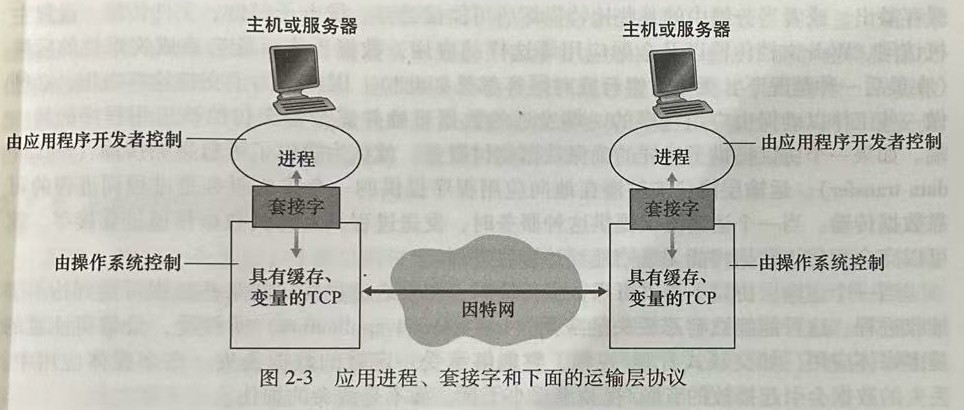
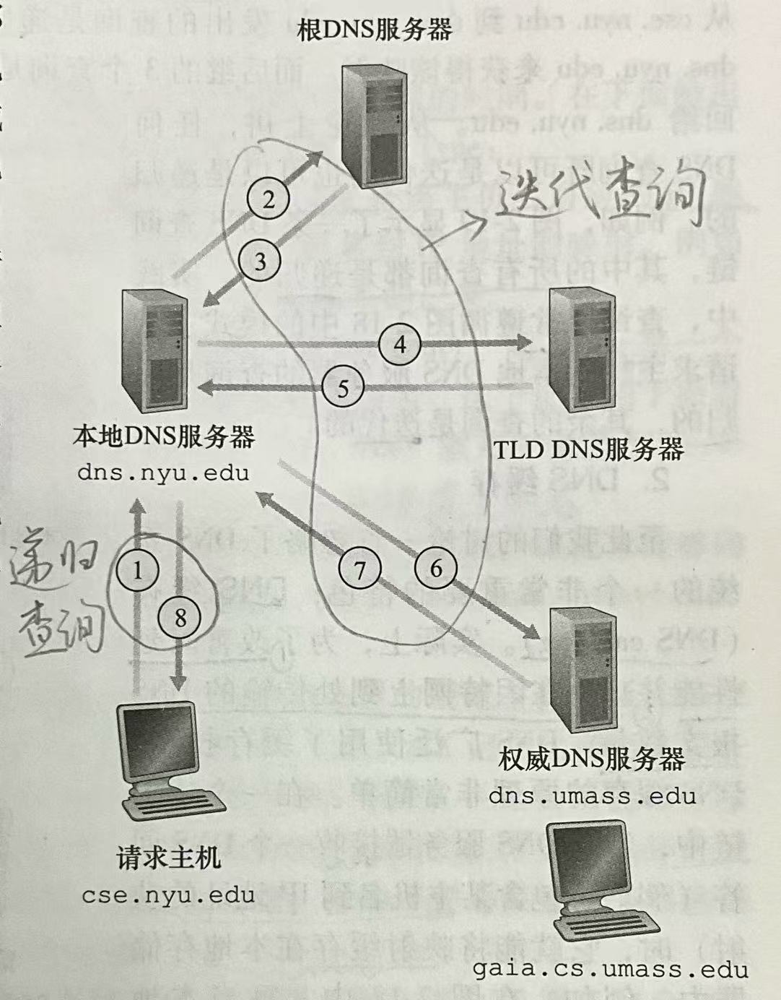
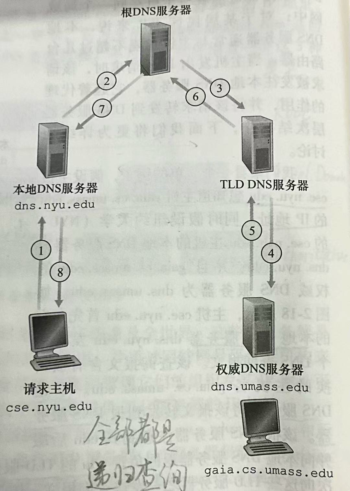

# 网络应用体系结构

两种主流的体系结构：

| 网络应用体系结构                                  | 含义                                                         | 优缺点     | 常见协议              | 常见应用                                          |
| ------------------------------------------------- | ------------------------------------------------------------ | ---------- | --------------------- | ------------------------------------------------- |
| 客户-服务器体系结构（client-server architecture)  | 服务器是一个总打开的主机，它服务于来自其他称为客户的主机的请求 | 可扩展性差 | HTTP, FTP, IMAP, DHCP | 搜索引擎，因特网商务，基于Web的电子邮件，社交网络 |
| P2P体系结构（Peer-to-peer architecture, i.e. P2P) | 应用程序在间断连接的**主机对之间直接通信**，这些主机对称为"对等方" | 自扩展性   | 无                    | 文件共享应用BitTorrent                            |

# 进程通信

> 应用程序之间通信的本质是进程之间的通信

每一对通信进程之中，两个进程分别被标记为：

- 发起通信的进程：客户
- 在会话开始时等待联系的进程：服务器

## 进程与计算机网络之间的接口

一台主机内，进程与传输层的接口为**套接字 socket**,

通过套接字，进程可以向网络发送报文，和从网络接收报文。

## 进程寻址

为了指明接收进程是哪一个，在报文中需要标识接收进程，标识信息有2种：

1. 主机地址，由 **IP 地址**标识。
2. 在目的主机中接收进程的标识符，由**端口号（port number）**标识。

# 可供应用程序使用的运输服务

## 应用程序服务要求

主要有以下4类

1. 可靠数据传输
2. 吞吐量
3. 定时
4. 安全性

在实际应用程序中，开发者根据上述的全部或部分要求，选择合适的传输层协议。

# 常用应用程序及其应用层协议

## Web and HTTP

> Web 的应用层协议是HTTP（超文本传输协议，HyperText Transfer Protocol）

特点：

- Web使用**客户-服务器**应用程序体系结构
- HTTP本身是一个无状态协议，因为HTTP服务器不保存关于客户的状态信息。

HTTP使用的传输层协议：TCP

HTTP服务器进程的端口号：80  

而客户端进程的端口号是**动态规定**的。

### Web页面的组成

Web页面由对象组成。

这些对象可以是：

- HTML文件
- 图片
- 视频片段
- Javascript文件
- CCS文件
- ...

一般而言，一个Web页面含有1个HTML基本文件，在HTML中可能还引用了若干个对象。

### 非持续连接和持续连接

>**非持续连接**：每个请求/响应对是经过一个单独的TCP连接发送（每个TCP连接不同）
>
>**持续连接**：所有请求/响应经过相同的TCP连接发送

> **往返时间（Round-Trip Time, RTT）**：
>
> 一个短分组从客户到服务器然后再返回客户所需的时间。
>
> 包括了：
>
> - 分组传播时延
> - 分组再中间路由器和交换机上的排队时延
> - 分组处理时延

#### TCP连接建立流程

(具体介绍请见 [传输层关于TCP连接的介绍](传输层.md))

**TCP连接建立流程**（三次握手）：

1. 客户向服务器发送一个小TCP报文段。（**第一次握手**）
2. 服务器用一个小TCP报文段做出确认和响应。（**第二次握手**）
3. 客户向服务器返回确认，并且通过该TCP连接向服务器发送一个HTTP请求报文。（注意：确认和HTTP请求报文是一起发送的）（**第三次握手**）

#### 非持续连接的HTTP

每当客户需要向服务器获取一个对象（比如：HTML基本文件、图片等），都需要先建立一个TCP连接。

> **非持续连接的HTTP请求2个对象的流程**
>
> 首先通过三次握手建立TCP连接，
>
> 注意：在第三次握手时，HTTP请求报文是连同确认一起发送给服务器（已经包含了HTTP请求报文！）
>
> 然后，服务器通过该TCP连接向客户发送第1个对象。
>
> 服务器通知TCP断开该连接。（实际断开的时机是在TCP确认客户已经完整地收到响应报文之时）
>
> 当要请求第2个对象时，**重复上述所有步骤**。

所需时间：$(2RTT + 传输1个对象的时间) \;+\; (2RTT + 传输1个对象的时间) =4RTT + 传输2个对象的时间$

#### 持续连接的HTTP

每当客户需要向服务器获取一个对象（比如：HTML基本文件、图片等），

如果先前未建立TCP连接，则需要先建立一个TCP连接。

如果已经建立了TCP连接，则客户直接通过该TCP连接向服务器发送一个HTTP请求报文，然后服务器通过该TCP连接向客户发送HTML文件

>**持续连接的HTTP请求2个对象的流程**
>
>首先通过三次握手建立TCP连接，
>
>注意：在第三次握手时，HTTP请求报文是连同确认一起发送给服务器（已经包含了第一个HTTP请求报文！）
>
>然后，服务器通过该TCP连接向客户发送第1个对象。
>
>当请求第2个对象时，由于已经建立了TCP连接，因此：
>
>直接通过该TCP连接向服务器发送一个HTTP请求报文
>
>然后，服务器通过该TCP连接向客户发送第2个对象。

所需时间：$(2RTT + 传输1个对象的时间) \;+\; (1RTT + 传输1个对象的时间) = 3RTT + 传输2个对象的时间$

上述均隐含地假设请求对象是串行的。

实际上，当客户需要向服务器请求一个Web页面，首先会向服务器请求一个HTML基本文件，然后就可以获知其中所引用的所有对象，然后可以通过并行或串行的方式请求引用的这些对象。

下面针对非持续连接与持续连接，并行方式与串行方式的RTT计算进行讨论。

#### 关键计算：非持续连接与持续连接的RTT

下面考虑请求1个HTML文件，其中含有n个引用对象所需的时间，**忽略文件传输时间**。

**情况1：非持续连接，串行**

先用$2RTT$去请求HTML文件，获知引用对象后，逐个串行地请求这n个引用对象，需要$n \cdot 2RTT$

总时间：$2RTT + n \cdot2RTT\;=\;(1+n)\cdot 2RTT$

**情况2：非持续连接，并行**

先用$2RTT$去请求HTML文件，获知引用对象后，并行地请求这n个引用对象，需要$2RTT$

总时间：$2RTT + 2RTT\;=\;4RTT$

**情况3：持续连接，串行**

先用$2RTT$去请求HTML文件，获知引用对象后，逐个串行地请求这n个引用对象，需要$n \cdot RTT$

总时间：$2RTT + n \cdot RTT\;=\;(2+n)RTT$

**情况4：持续连接，并行**

先用$2RTT$去请求HTML文件，获知引用对象后，并行地请求这n个引用对象，需要$1RTT$

总时间：$2RTT + 1RTT\;=\;3RTT$​

### Web缓存

> Web缓存器，又称代理服务器，能够代表初始Web服务器来满足HTTP请求的网络实体。

#### 工作原理

Web缓存器会在存储空间中保存最近请求过的对象的副本。

当客户浏览器请求某个对象时，

1. 浏览器会创建一个到Web缓存器的TCP连接，并向Web缓存器发送一个HTTP请求报文，请求所需的对象。
2. Web缓存器接收到报文后，检查本地是否存储了该对象的副本。如果有，则用HTTP响应报文向客户浏览器返回该对象。
3. 如果没有，Web缓存器会打开一个与该对象的初始服务器的TCP连接，并向初始服务器发送一个HTTP请求报文，请求所需的对象。
4. 收到请求后，初始服务器会向该Web缓存器发送具有该对象的HTTP响应报文。
5. Web缓存器收到该对象后，在本地存储空间存储一份副本，并向客户浏览器用HTTP响应报文返回该对象副本。

#### 条件GET方法

> Web缓存器中存储的对象可能是旧的，为了查询所存储的对象是否为最新的，需要使用条件GET

##### 条件GET请求报文

使用GET方法，并且请求报文中包含一个**"If-modified since"的首部行**，其值为Web缓存中最后修改这个对象的时间。

##### 条件GET响应报文

如果在"If-modified since"首部行中对应时间之后，对象被修改了，则在响应报文中返回该对象。

否则，服务器返回的响应报文中**不会包含所请求的对象**，在状态行中会显示“304 Not Modified”

## 电子邮件 and SMTP

> SMTP是因特网电子邮件中主要的应用层协议

电子邮件系统的3个主要组成部分：

- 用户代理
- 邮件服务器
- 简单邮件传输协议（Simple Mail Transfer Protocol, SMTP）

> [!CAUTION]
>
> 邮件服务器在网络通信中并不总是服务器的角色。它既是客户，又是服务器。
>
> 比如：当邮件服务器A向邮件服务器B发邮件时，A就作为SMTP客户，B就作为SMTP服务器。

SMTP使用的传输层协议：TCP

SMTP使用的端口号：25

## DNS

> **域名系统（Domain Name System, DNS）**
>
> 有两部分组成：
>
> 1. 由分层DNS服务器实现的分布式数据库
> 2. 一个使主机能够查询分布式数据库的应用层协议

DNS使用的传输层协议：UDP

DNS使用的端口号：53

### 提供的服务

主要服务：进行**主机名到IP地址转换**的目录服务。（识别主机的方式有2种：主机名或IP地址，人类喜欢主机名，但是路由器只能处理定长的IP地址，因此需要从主机名转换到IP地址）

其他服务：

- 主机别名
- 邮件服务器别名
- 负载分配：一个规范主机名对应着一个IP地址集合（由多个IP地址构成），当客户对该主机名发出请求时，DNS服务器在回答中依次循环这些IP地址，从而向不同的主机分配了负载。

### DNS服务器的层次结构

由上层至下层依次为：

- 根DNS服务器（Root）
- 顶级域DNS服务器（Top Level Domain, TLD）
- 权威DNS服务器（Authoritative）

还有一类不在该层次结构中的DNS服务器：本地DNS服务器

### DNS查询过程

DNS查询有2种方式：迭代查询和递归查询

如上图，主机与本地DNS服务器之间的查询是递归查询，本地DNS服务器与根DNS服务器、TLD DNS服务器、权威DNS服务器之间的查询是迭代查询。

如上图，所有都是递归查询。

### DNS缓存

#### 作用

- 减少时延
- 减少在因特网上到处传输的DNS报文数量

#### 工作原理

与Web缓存类似，当某DNS服务器接收一个DNS回答，它就会将映射缓存在本地存储器中。

## 文件分发

### 关键计算：CS和P2P的文件分发时间

假设文件大小为$F$bit

#### 1. 客户-服务器体系结构（CS）的文件分发时间

考虑服务器上传文件，假设服务器向$N$个对等方分别传输一个文件副本，则共要传输 $NF$ bit，服务器的上传速率为$u_s$，则分发该文件的时间至少为$\frac{NF}{u_s}$

考虑对等方下载文件，$N$个对等方的下载速率分别为$d_1,d_2, \cdots, d_N$，它们的最小值为$d_{min} = min\{ d_1,d_2, \cdots, d_N \}$，则分发该文件的时间至少为$\frac{F}{d_{min}} $

所以最小分发时间为
$$
D_{CS} = max\{ \frac{NF}{u_s}, \frac{F}{d_{min}} \}
$$

#### 2. P2P体系结构的文件分发时间

最初，只有服务器拥有这个文件，服务器至少要向链路总发送这个文件1次，发送一次该文件的时间为$\frac{F}{u_s}$，则分发该文件的时间至少为$\frac{F}{u_s}$

考虑对等方下载文件，与CS体系结构类似可推知，分发该文件的时间至少为$\frac{F}{d_{min}} $

另外注意到，在P2P体系结构中，对等方也能上传文件，所以系统整体的总上传速率等于 服务器的上传速率加上每个单独的对等方的上传速率，即$u_{total} = u_s + u_1 + u_2 + \cdots + u_N = u_s + \sum_{i=1}^{N} u_i$，则分发该文件的时间至少为$\frac{NF}{u_s + \sum_{i=1}^{N} u_i}$

所以最小分发时间为
$$
D_{P2P}=max\{ \frac{F}{u_s}, \frac{F}{d_{min}}, \frac{NF}{u_s + \sum_{i=1}^{N} u_i} \}
$$
