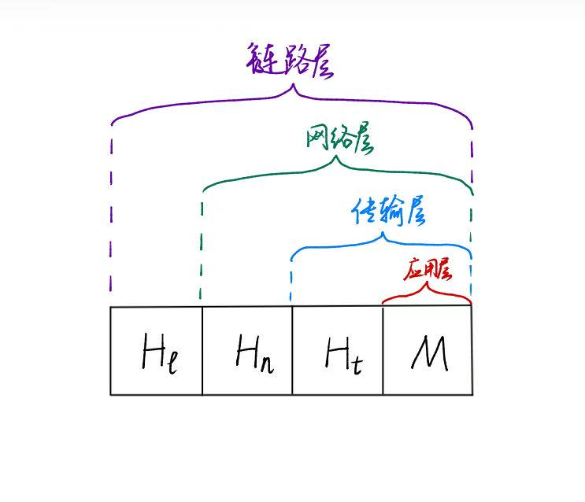

# 网络核心 Networks Core

## 网络链路和交换机移动数据的方法（2种）

### 电路交换

在两台主机之间预留一条专用的端到端连接

电路交换中的复用：TDM，FDM

### 分组交换！

> **分组**：
>
> 为了从源端系统向目的端系统发送一个报文，源将长报文划分为较小的数据块，称为“分组”

#### 分组交换机

> [!WARNING]
>
> 分组交换机 $\neq$ 交换机

分组交换机主要有2类：

- 路由器
- 链路层交换机（简称交换机）

分组交换机中，每条链路有输出缓存（又称输出队列），用于存储发往该条链路的分组。

当分组到达输出队列后，

- 若正在由分组传输，则还需要等待，这部分时间称为“**排队时延**”

- 若输出队列已经满，则分组交换机会选择刚到达的分组or已经排队的分组之一丢弃，即**分组丢失（丢包）**

#### 存储转发传输

> **存储转发传输**：
>
> 在分组交换机开始向它的输出链路传输该分组的第一个比特之前，必须先接收到**整个**分组。
>
> 换言之，当且仅当分组交换机接收完一个分组的所有比特后，才能开始向输出链路传输（即“转发”）该分组

##### 关键计算：存储转发传输的传输时间

> [!CAUTION]
>
> 注意：以下推导均是在传播时延、处理时延、排队时延可以忽略的情况下讨论，仍考虑这些时延，分析方法也类似。

1.设源端系统向链路中发送一个$L$ bit的分组，链路的传输速率为$R$ bps，则传输该分组的时间为$\frac{L}{R}$ s

2.两个端系统经过一个路由器的网络，即共有2条链路，每条链路的传输速率为$R$ bps，传输1个分组的时间是多少？
$$
src \rightarrow router \rightarrow dest
$$
因为使用存储转发传输机制，先用$\frac{L}{R}$的时间从src发到router,然后再用$\frac{L}{R}$的时间从router发到dest，共$\frac{2L}{R}$的时间

3.$m$个大小为$L$的分组在2条链路组成的路径上（两个端系统经过1个路由器的网络）传输的总时间，每条链路的传输速率为$R$ bps。

因为使用存储转发传输机制，总共需要$\frac{(m+1)L}{R}$的时间

4.1个大小为$L$的分组 $h+1$ 条链路组成的路径上（两个端系统之间有$h$个路由器的网络）传输的总时间，每条链路的传输速率为$R$ bps。
$$
src \rightarrow router_{1} \rightarrow router_{2} \rightarrow \cdots \rightarrow router_{h} \rightarrow dest
$$
因为使用存储转发传输机制，总共需要$\frac{(h+1)L}{R}$的时间

5.m个大小为$L$的分组在 $h+1$ 条链路组成的路径上（两个端系统之间有$h$个路由器的网络）传输的总时间，每条链路的传输速率为$R$ bps。
$$
src \rightarrow router_{1} \rightarrow router_{2} \rightarrow \cdots \rightarrow router_{h} \rightarrow dest
$$
因为使用存储转发传输机制，共需时间为 
$$
d_{src \rightarrow dest} = \frac{hL}{R} + \frac{mL}{R} = \frac{(h+m)L}{R} 
$$

#### 时延

主要有4类时延：

| 时延类型            | 含义                                                         | 是否确定 | 数量级             |
| ------------------- | ------------------------------------------------------------ | -------- | ------------------ |
| 处理时延$d_{proc}$  | ***检查分组首部和决定该分组导向何处*** 所需的时间            | 确定     | 微秒或更低的数量级 |
| 排队时延$d_{queue}$ | ***在输出队列中排队等待传输*** 的时间                        | 不确定   | 毫秒级~微秒级      |
| 传输时延$d_{trans}$ | ***所有分组的比特被推向链路*** 的时间。对于$L$ bit的分组，传输速率为$R$ bps的链路，传输时延为$\frac{L}{R}$ | 确定     | 毫秒级~微秒级      |
| 传播时延$d_{prop}$  | ***一个比特从链路的起点传播到链路的终点*** 所需的时间。取决于链路的**物理媒介**。若链路长度为$d$，链路的传播速率为$s$,则传播时延为$\frac{d}{s}$ | 确定     | 毫秒级             |

总时延：
$$
d_{nodal} =d_{proc} + d_{queue} + d_{trans} + d_{prop}
$$

##### 关键计算：排队时延

> **流量强度**：
>
> 设分组大小为$L$bit，传输速率为$R$ bps，比特到达队列的平均速率是$a$，
>
> 则流量强度为$\frac{La}{R}$
>
> if $\frac{La}{R}>1$, 排队时延$d_{queue} \rightarrow \infin$​
>
> if $\frac{La}{R} \leq 1$， 流量强度越接近1，平均排队时延迅速增加，逐渐趋于无穷  

##### 关键计算：时延带宽积 Bandwitch-delay product

> **时延带宽积** = 传播时延 $\times$ 带宽（链路传输速率）
>
> 即，$d_{prop} \times R$
>
> 单位： [bit] = [s] $\times$ [bps] 
>
> 含义：链路上所能承载的最大比特数量

##### 关键计算：比特宽度

> **比特宽带** = 传播速率 / 带宽（链路传输速率）
>
> 即，$\frac{v_{prop}}{R}$
>
> 单位：[m/bit] = [m/s] / [bps]
>
> 含义：链路上一个比特所占的宽度

### 电路交换与分组交换比较

| 比较项目         | 电路交换                           | 分组交换                   |
| ---------------- | ---------------------------------- | -------------------------- |
| 资源是否共享使用 | 每两台主机之间有一条**专用**的电路 | 资源共享                   |
| 资源使用率       | 低                                 | 高                         |
| 时延             | 可预测                             | 可变，不可预测             |
| 其他             | 需要先建立连接                     | 不需要先建立连接，实现简单 |

# 协议层次

因特网的协议栈由5个层次组成（从上至下）：

| 层次                  | 作用                                                         | 典型协议                                         | 分组的名称      |
| --------------------- | ------------------------------------------------------------ | ------------------------------------------------ | --------------- |
| 应用层 Application    | 网络应用程序以及应用层协议                                   | HTTP, SMTP, FTP, DNS，DHCP                       | 报文 message    |
| 传输层 Transportation | 在应用进程之间传送应用层报文                                 | TCP, UDP                                         | 报文段  segment |
| 网络层 Network        | 把数据报从一台主机移动到另一台主机                           | IP, ICMP                                         | 数据报 datagram |
| 链路层 Link           | 将网络层的数据报分成帧，然后从一个节点(主机or路由器)移动到下一个节点 | 以太网，WiFi(802.11协议)，电缆接入网的DOCSIS协议 | 帧 frame        |
| 物理层 Physics        | 将帧中的每一个比特从一个节点(主机or路由器)移动到下一个节点   | 略                                               | 比特            |

每一层的封装形式：

首部字段+有效载荷字段(来自上一层的分组)

