# 概述

网络层可以分为两个相互作用的部分，数据平面和控制平面

- 数据平面：功能是**转发**，即从输入链路向输出链路**转发**数据报。
- 控制平面：功能是**路由选择**，即协调本地路由器的转发操作，使得数据报沿着从源主机到目的主机之间的路由器路径，进行端到端传送。

# 路由器工作原理

## 路由器体系结构

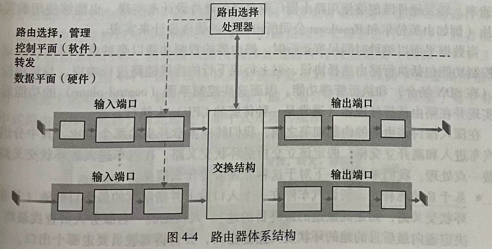

路由器主要包括以下4个组件：

- **输入端口**：主要有3方面功能：
  - 执行终结入物理链路的物理层功能（见输入端口的最左侧方框）；
  - 与位于入链路远端的数据链路层交互，执行数据链路层功能（见输入端口的中间方框）；
  - 执行**查找功能**，查询转发表以决定数据报在路由器中的输出端口（见输入端口的最右侧方框）。

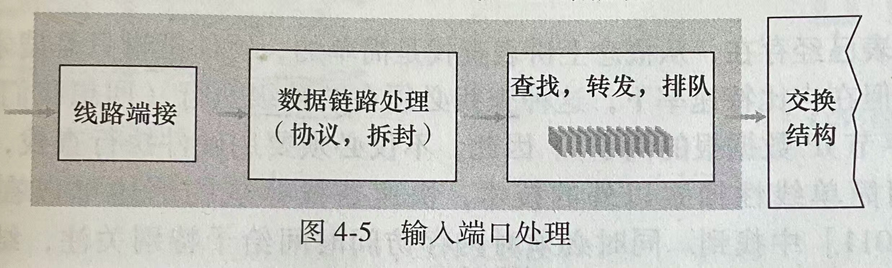

- **交换结构**：交换结构将路由器的输入端口连接到它的输出端口
- **输出端口**：输出端口存储从交换结构接收的分组（见输出端口的最左侧方框），并通过执行必要的链路层功能（见输出端口的中间方框）和物理层功能（见输出端口的最右侧方框）在输出链路上传输这些分组。（这与输入端口刚好对称）

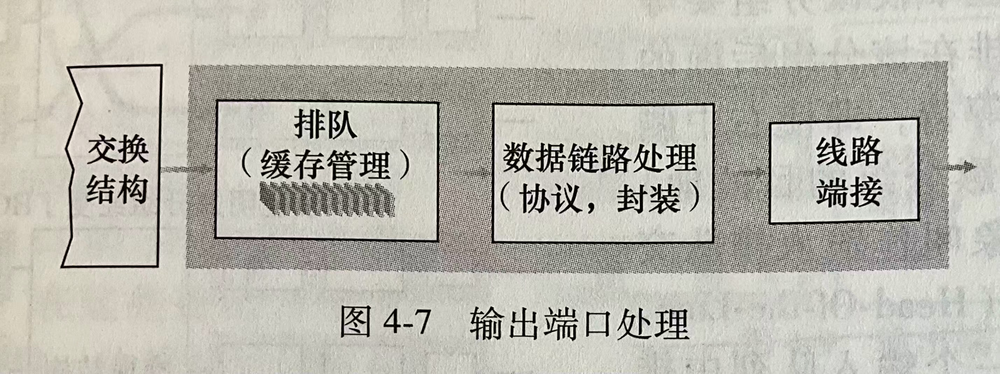

- **路由选择处理器**：路由选择处理器执行控制平面功能：
  - 在传统路由器中，它执行路由选择协议，维护路由选择表与关联链路状态信息，并为该路由器计算转发表。
  - 在SDN路由器中，它负责与远程控制器通信，接收有远程控制器计算的转发表项，并在该路由器上的输入端口安装这些表项。

> [!CAUTION]
>
> 对于**控制分组**（如携带路由选择协议信息的分组），并不是转发到输出端口，而是**转发到路由选择处理器**。

## 转发

转发功能是在输入端口中执行的。在输入端口中，通过查询转发表，寻找匹配项，以决定数据报在路由器中的输出端口

### 基于目的地转发

工作原理：

1. 路由器利用分组的目的地址前缀与转发表中的表项进行匹配，如果存在一个匹配项，就向该匹配项相关联的链路转发分组。
2. 若有多个匹配时，则使用**最长前缀匹配规则**，即寻找最长的匹配项，向与最长匹配项相关联的链路转发分组。

实现方式：通过**硬件**逻辑实现。

### 泛化转发

> **泛化转发（Generalized Forwarding）**:
>
> 与传统的基于目的地转发不同，泛化转发还可以基于目的IP地址之外的其他字段进行转发。

实现方式：通过**软件**逻辑实现。

由于泛化转发的转发策略可能使用网络层或链路层的源地址和目的地址，所以这种转发设备被更准确地描述为“分组交换机”，而不是“路由器”。

每台分组交换机中都有一张 匹配加操作表（称为“**流表**”），该表由**远程控制器**进行计算、安装和更新。

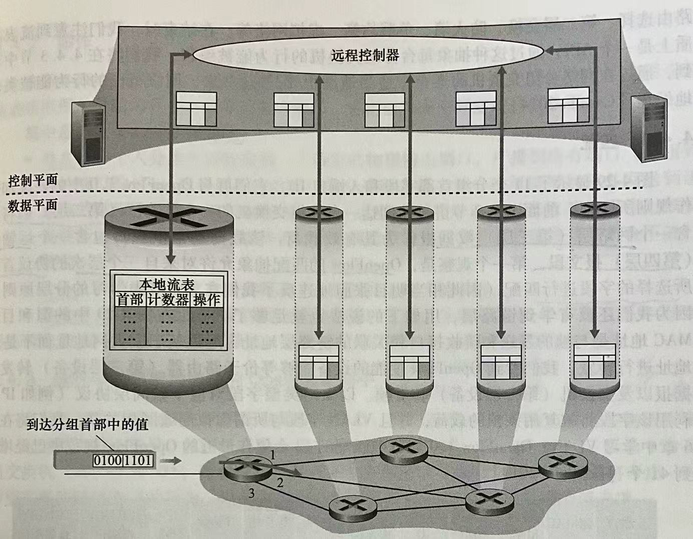

#### 流表

> **流表（Flow Table）**：在Openflow标准中，匹配加操作表称为流表

流表的每个表项包括3部分：

- 首部字段值的集合：入分组会与该集合中的首部字段进行匹配，匹配后根据操作集合执行相应操作。

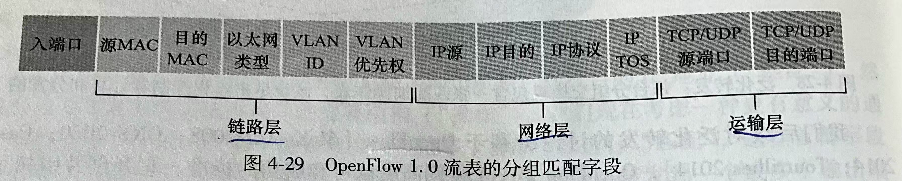

- 计数器集合：记录统计信息。
- 操作集合：当分组与首部字段值集合匹配时，所采取的操作，比如：转发、丢弃、复制、发送到多个端口、修改所选的首部字段……

通过设置流表项，可以实现的功能：

- 简单转发
- 负载均衡
- 充当防火墙
- ……

## 交换

交换结构使得分组从一个输入端口交换（转发）到一个输出端口。

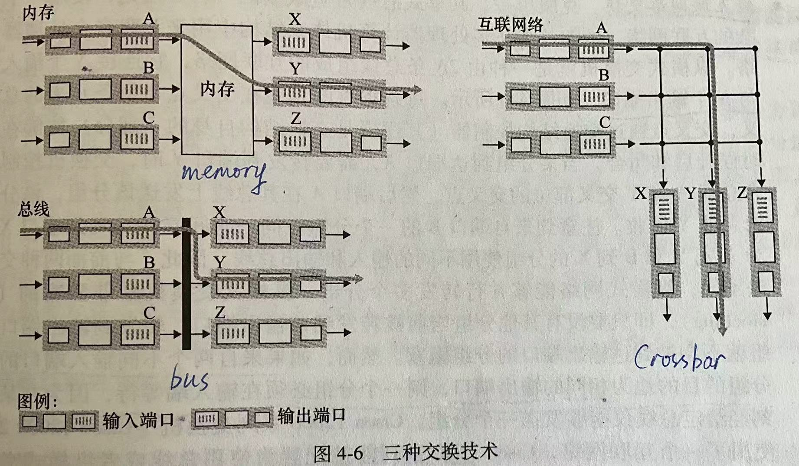

有3种交换方式：

- 经内存（memory）交换
- 经总线（bus）交换
- 经互联网络（crossbar）交换

### 经内存（memory）交换

> **经内存（memory）交换**：
>
> 分组从输入端口出被复制到处理器内存中，路由选择器从其首部提取目的地址，在转发表中查找相应的输出端口，并将该分组复制到输出端口的缓存中。

吞吐量：如果内存带宽为每秒可以写入或读出最多B个分组，则转发吞吐量（分组从输入端口传送到输出端口的总速率）小于$\frac{B}{2}$。（因为共享系统总线一次仅能进行1个内存读或写）

### 经总线（bus）交换

> **经总线（bus）交换**：
>
> 输入端口经过一根共享总线将分组直接传送到输出端口没不需要路由选择器的干预。

缺点：一次只能有1个分组跨越总线，其他分组只能等待。

### 经互联网络（crossbar）交换

> **经互联网络（crossbar）交换**：
>
> 由$2N$根总线组成的互联网络，连接$N$个输入端口和$N$​个输出端口。
>
> 采用这种交换方式的交换机叫“**纵横式交换机**”。

优点：与经内存交换和经总线交换两种方式相比，经互联网络交换可以并行地转发多个分组。

缺点：当来自两个不同输入端口的两个分组有着相同的输出端口时，则其中一个分组就必须在输入端等待。

## 排队

### 输入排队

出现原因：*输入线路速度* 比 *交换结构使所有到达分组无时延地通过它的速度* 更快，就会在输入端口出现排队

#### 队列首部（Head-Of-the-Line, HOL）阻塞

在一个输入队列中，排队的分组必须等待通过交换结构发送，因为它被位于队列首部的另一个分组所阻塞。

例如下图的浅色阴影分组

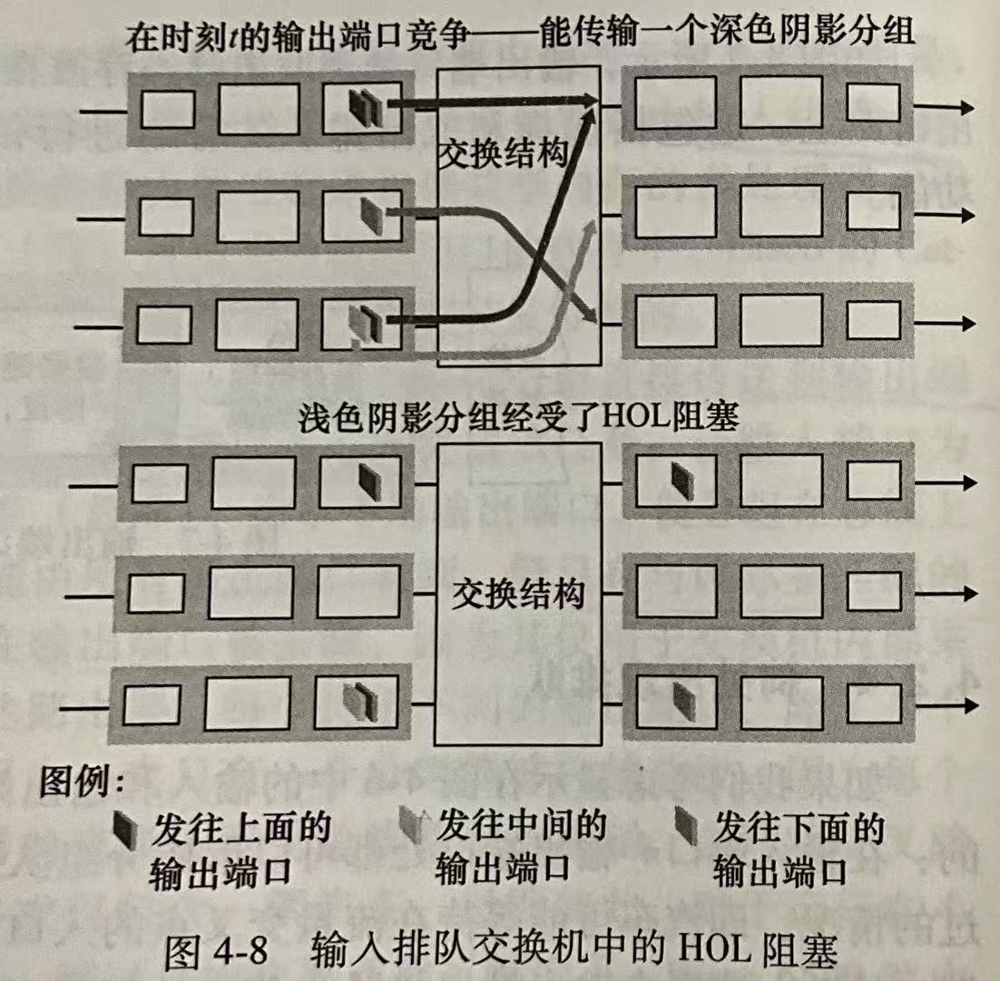

### 输出排队

出现原因：*交换结构的线路速率* 比 *输出端口的线路速率* 更快，导致分组在输出端口中排队。

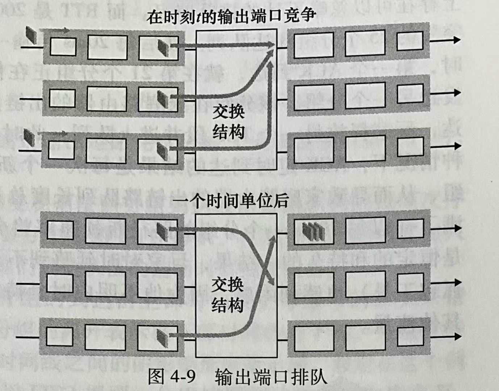

### 丢包

> **丢包**：当排队的分组数量耗尽了端口的可用内存时，就会没有足够的内存再缓存一个入分组，这时就会出现分组丢失（丢包）

丢包有2种策略：

1. 丢弃到达的分组。（弃尾）
2. 删除一个或多个已排队的分组，为新的分组腾出空间。

常见策略：在缓存填满之前就丢弃一个分组（或在其首部加上标记），这样可以向发送方提供一个拥塞信号。

### 缓存量

对于少量TCP流经过的链路：缓存量B应当等于平均往返时延RTT乘链路的容量C
$$
B = RTT \cdot C
$$
对于大量TCP流(假设有N条)经过的链路：
$$
B = RTT \cdot \frac{C}{\sqrt{N}}
$$

> [!IMPORTANT]
>
> 误区：缓存越大越好  &#10006;
>
> 更大的缓冲区可以使路由器有能力承受分组到达率的更大波动，从而降低路由器的分组丢失率，
>
> 但是可以缓存的分组数量增加，可能会导致**更长的排队时延**。

## 分组调度

分组调度算法主要有：

- 先进先出 FIFO
- 优先权排队 
- 循环排队
- 加权公平排队（Weighted Fair Queuing, WFQ）

# 网际协议(IP)

## IPv4

### IPv4数据报格式

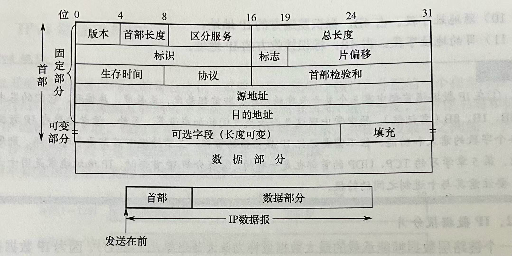

**版本**：IPv4数据报中，该字段的值为4

**首部长度**：IPv4的首部长度为20B（不包含可选字段，一般情况下都不包含）

> [!NOTE]
>
> 首部长度以4B为单位，所以最大可以表示的首部长度为：$15 \times 4 = 60$B.
>
> 一般的首部长度为20B（$5 \times 4$​B），这时该字段的值为5。
>
> 结合版本号可知，IP首部一般以 0x45 开头

**服务类型（TOS）**：又称为”区分服务“，用于区分不同类型的IP数据报。

**总长度**：IP数据报的总长度，包括首部和数据部分。以1B为单位。

**标识**：标识一个IP分组。IP协议利用1个计数器，每产生1个IP分组，计数器加1

**标志位**：标志位占3 bit，分别是

| 保留 | DF   | MF   |
| ---- | ---- | ---- |

它们的内涵是：

- DF (Don't Fragment)
  - DF=1：禁止分片
  - DF=0：允许分片
- MF (More Fragment)
  - MF=1：非最后1片
  - MF=0：最后1片（或未分片）

**片偏移**：当前分片在原来IP数据报中的偏移量。以8B为单位。

**生存时间（Time-To-Live, TTL）**：又称为”寿命“，每当一台路由器处理数据报时，该字段的值就减1，当TTL字段减为0时，就丢弃该数据报。作用：确保数据报永远不会在网络中循环。

**协议**：协议字段指示了IP数据报的数据部分应该交给哪个特定的协议。

- 值为6，则交给TCP
- 值为17，则交给UDP
- 值为1，则交给ICMP（注意：ICMP是网络层协议，而不是传输层协议）

**首部检验和**：只对IP首部计算检验和。每经过一台路由器处理，TTL就会改变一次，导致首部检验和就要重新计算一次。

> [!CAUTION]
>
> IP数据报中的首部检验和**只针对IP首部**
>
> 而TCP/UDP的检验和是针对整个TCP/UDP报文段计算的。

**源IP地址和目的IP地址**：由于使用IPv4协议，所以IP地址都是32bit

### IP分片

网络中链路层数据帧可封装数据的上限称为**最大传输单元（MTU）**，不同链路的MTU不同。

> **IP分片**：当大的IP数据报从大的MTU链路向小的MTU链路转发时，需要被**分片（fragmented）**，将1个IP数据报分为多片IP分组。
>
> **重组**：当IP分片到达**目的主机**后，进行**重组（reassembled）**，在中间的路由器不重组

通常，在分片时，每个分片的标识复制原IP数据报的标识。除了最后一个分片，其余分片都分为MTU允许的最大分片。

> [!CAUTION]
>
> IP分组在哪里分片、重组？
>
> |            | 在哪里分片 | 在哪里重组 |
> | :--------: | :--------: | :--------: |
> |   源主机   |  &#10004;  |  &#10006;  |
> | 中间路由器 |  &#10004;  |  &#10006;  |
> |  目的主机  |  &#10006;  |  &#10004;  |
>
> 此表仅仅针对于IPv4协议

#### 关键计算：片偏移字段

> **片偏移**：当前分片在原来IP数据报中的偏移量，以8B为单位

> [!CAUTION]
>
> **片偏移字段以8B为单位**，而不是以1B为单位。
>
> 而数据报长度字段以1B为单位。
>
> 这是因为数据报长度字段占16bit，但片偏移字段只占13bit，少了3 bit。
>
> 如果片偏移字段也以1B为单位，则有可能会溢出。
>
> 所以片偏移字段以8B为单位！

假设原来的IP数据报总长度为$L$，待转发链路的MTU记为$M$ ($L>M$)

若已知$DF=0$，则可以分片。

1.求一个最大分片可以封装的数据量d
$$
d=\lfloor \frac{M-20}{8} \rfloor \cdot 8
$$

> [!CAUTION]
>
> $-20$是因为IP首部占了20B

2.求原来总长度为$L$的IP数据报需要分成多少片？
$$
n=\lceil \frac{L-20}{d} \rceil
$$
3.第$i$个分片的片偏移字段取值：
$$
F_i = \frac{d}{8} (i-1), \quad 1 \leq i \leq n
$$
4.第$i$个分片的总长度字段为：
$$
L_i =
\begin{cases}
d+20 , \quad 1 \leq i < n\\
L-(n-1)d, \quad i=n 
\end{cases}
$$
5.第$i$个分片的MF标志位：

除了最后1片MF=0之外，其余均为MF=1
$$
MF_i = 
\begin{cases}
1, \quad 1 \leq i < n \\
0, \quad i=n
\end{cases}
$$

### IPv4编址

表示方法：点分十进制记法

> **点分十进制记法**：
>
> 地址中的每个字节都用它的十进制书写，每个字节之间用英文句点（.）隔开

比如：

对于IP地址 193.32.216.9

193 对应的二进制为 11000001 

  32 对应的二进制为 00100000

216 对应的二进制为 11011000

​    9 对应的二进制为  00001001

所以IP地址 193.32.216.9的二进制记法为：11000001 00100000 11011000 00001001

#### 子网

> **子网掩码**：IP地址的最左侧的24位定义了子网地址，称为”子网掩码“
>
> 记法：xxx.xxx.xxx.0/24
>
> 比如：主机接口223.1.1.1，223.1.1.2，223.1.1.3，路由器接口223.1.1.4之间的子网的子网掩码是223.1.1.0/24

根据子网地址的概念，IP地址就可以被分为NetID（子网标识），HostID（主机标识）两部分。即

| NetID | HostID |
| ----- | ------ |

> **子网（subset）**：
>
> 子网是多台主机到一个路由器接口的网段，或者是一个路由器接口与另一个路由器接口之间的网段。

下图中灰色阴影部分就是子网。

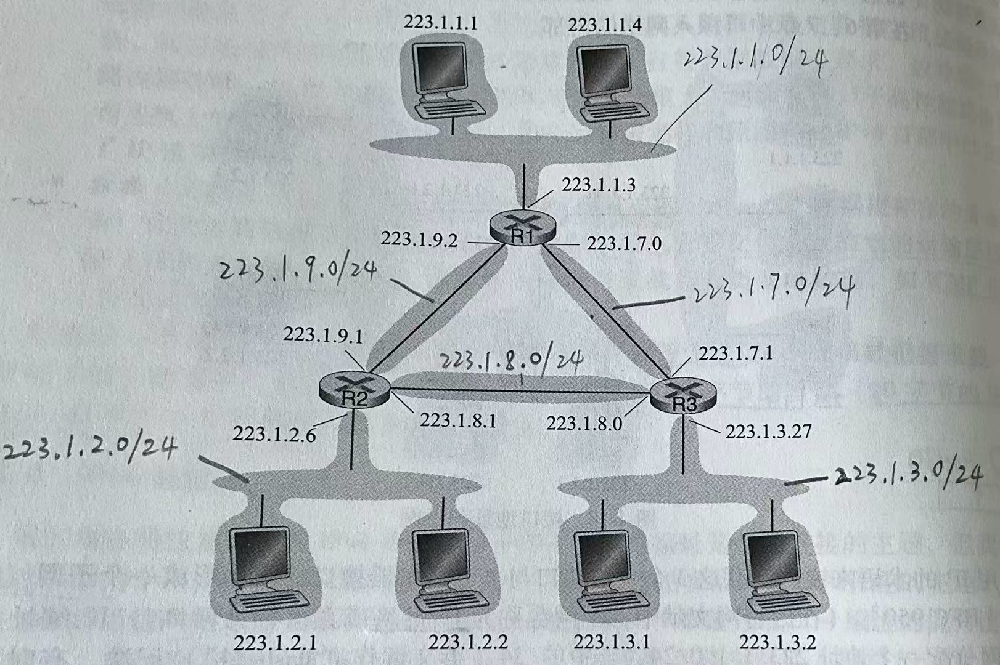

#### 无类别域间路由选择 

> **无类别域间路由选择（Classless Interdomain Routing, CIDR）**： 
>
> 将32比特的IP地址分为两部分，用点分十进制记法记为：`a.b.c.d/x`
>
> 其中前x比特是网络部分，后面的32-x比特是用于区分内部设备的。
>
> | NetID | HostID     |
> | ----- | ---------- |
> | x bit | (32-x) bit |
>
> 正因此，就可以使用最长前缀匹配规则进行转发。

#### 有类编址

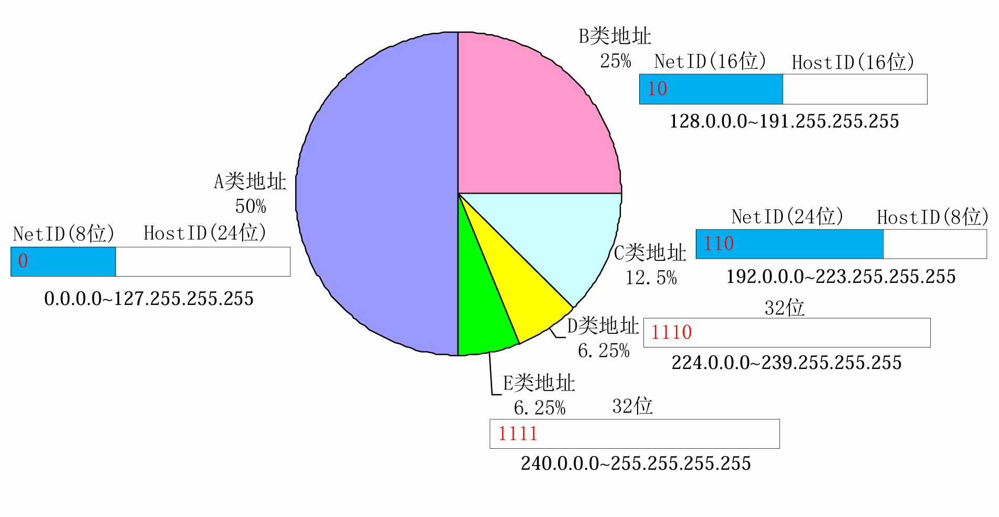

##### **特殊地址**

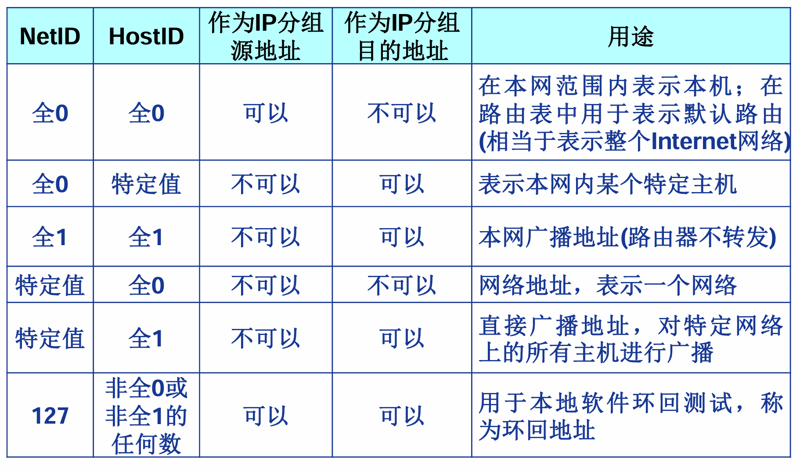

##### **私有（Private）IP地址**

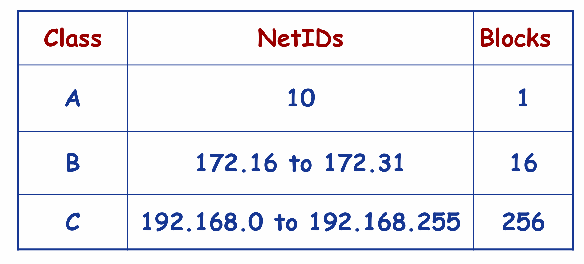

#### 动态主机配置协议 DHCP！

> **动态主机配置协议（Dynamic Host Configuration Protocol, DHCP）**：
>
> 用于自动为主机分配IP地址

特点：

- 即插即用协议，零配置协议
- 客户-服务器协议。客户是新到达的主机，服务器是每个子网内的一台DHCP服务器

DHCP建立在**UDP**之上。

DHCP服务器端口号：67

> [!CAUTION]
>
> DHCP协议是**应用层协议**！
>
> 虽然DHCP协议是用来获取IP地址的，但是它不是网络层协议。
>
> 

##### 主机向DHCP获取IP地址的流程

分为4个步骤：

1. DHCP服务器发现：新到达的客户主机发送**DHCP发现报文**，由于主机还未被分配IP地址，所以**源IP为0.0.0.0**（这是一个特殊的IP地址，表示”本主机“）；由于主机也不知道DHCP服务器的IP地址，所以**目的IP为广播地址255.255.255.255**（这是一个特殊的IP地址）
2. DHCP服务器提供：服务器用一个**DHCP提供报文**向客户做出响应，在报文中，`yiaddr`就是DHCP服务器分配给客户主机的IP地址。源IP为DHCP服务器的IP；由于客户主机还未被分配IP地址，所以服务器不知道应该发给谁，所以**目的IP为广播地址255.255.255.255**。
3. DHCP请求：新到达的客户主机可能会收到一个或多个DHCP服务器发送的DHCP提供报文，客户从中选择一个，并向选中的服务器发送**DHCP请求报文**，回显配置的参数（`yiaddr`）。此时，源IP为0.0.0.0，目的IP为广播地址255.255.255.255，原因同上”DHCP服务器发现“。
4. DHCP ACK：服务器用**DHCP ACK报文**对DHCP请求报文进行响应，证实客户所要求的参数（`yiaddr`）可以使用。 此时，源IP为DHCP服务器的IP，目的IP为广播地址255.255.255.255，原因同上”DHCP服务器提供“。

通过这4步，客户主机就获得了`yiaddr`中指定的IP地址了，然后就以该IP地址为客户主机在该子网中的IP地址。

除了IP地址，DHCP还会给主机其他信息：

- 子网掩码
- 默认网关路由器的IP地址（第一跳路由器的IP地址）
- DNS服务器地址

##### 主机离开子网再返回子网时 获取IP地址的流程

如果客户主机离开该子网，之后再进回该子网。由于在缓存中仍有之前在该子网的IP地址，所以可以直接执行第3、4步。

如果DHCP服务器确认该IP地址还可以使用，则客户主机继续使用该IP地址；

如果不可再使用，则重新依次执行这4个步骤，获取一个新的IP地址。

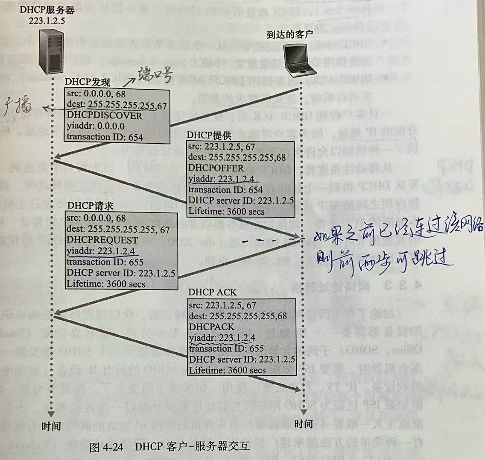

##### DHCP的缺陷

因为每当节点连接到一个新子网时，就要从DHCP服务器得到一个新的IP地址，那么当一个移动节点在子网之间移动时，就不能维持与远程应用之间的TCP连接。

### 网络地址转换

> **网络地址转换（Network Address Translation, NAT）**:
>
> 对外如同一个具有单一IP地址的单一设备，对内的不同主机实际上有不同的IP地址。IP地址的转换是通过NAT转换表实现的。

NAT作用：

1. 解决IP地址空间不够的问题
2. 对内隐藏专用网络的细节

#### 工作原理

NAT转换表维护在WAN端和LAN端之间的 **IP地址以及端口号的映射**。

NAT使能路由器根据NAT转换表，对数据报中的IP地址和端口号进行转换。

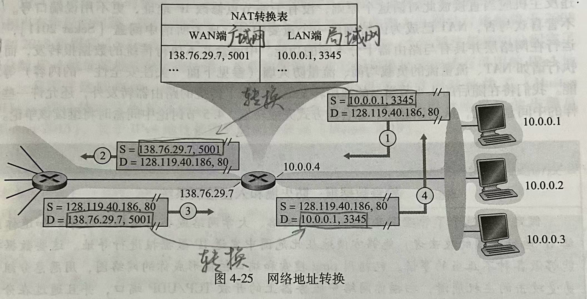

## IPv6

首要动机：32比特的IPv4地址即将用尽

### IPv6数据报格式

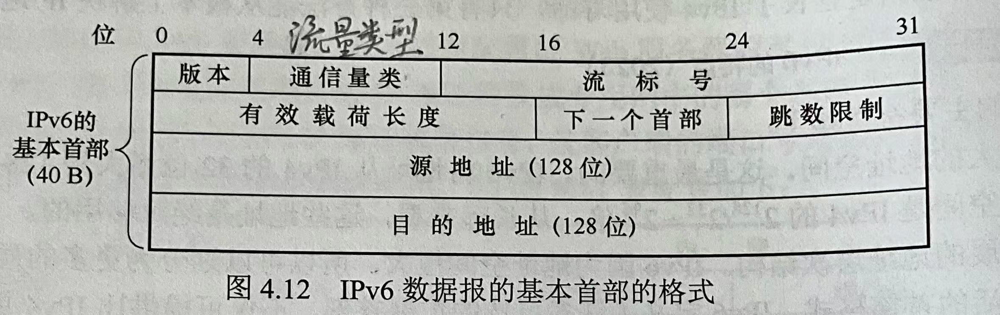

**版本**：用于标识IP的版本号，置为6.

> [!CAUTION]
>
> 将该字段置为4并不能创建一个合法的IPv4数据报！

**流量类型（通信量类）**：区分IPv6数据报的类别或优先级。与IPv4中的服务类型（TOS）字段的含义类似。

**流标签**：又称为”流标号“，标识一条数据报中的流。能够对一条流中的某些数据报给出优先权，或者给来自某些应用（如IP话音）的数据报给出更高的优先权

**有效载荷长度**：指出IPv6数据报中数据部分的字节数量。（***不包括IPv6的首部***）

**下一个首部**：指出数据报中的数据部分需要交付给哪个上层协议（TCP or UDP)

**跳数限制**：转发数据报的路由器将该字段减1，如果该字段变为0，则丢弃该数据报。类似于IPv4中的TTL。

**源地址和目的地址**：都是128bit

#### IPv4 与 IPv6 数据报格式对比

| 对比项目                    | IPv4                        | IPv6                             |
| --------------------------- | --------------------------- | -------------------------------- |
| 地址容量                    | 32 bit                      | 128 bit                          |
| 检验和                      | 有首部检验和                | **无**                           |
| 有无选项字段                | 有                          | **无**                           |
| 首部是定长or变长            | 变长（没有选项的情况下20B） | 定长，固定40B                    |
| 流标签                      | 无                          | 有                               |
| 中间路由器能否分片/重新组装 | 能                          | **不能**，只可以由源与目的地进行 |

### IPv4 到 IPv6 的迁移

当遇到IPv4路由器时，**将IPv6数据报放进IPv4数据报内**，并将协议字段置为41，用于指示该IPv4数据报的有效载荷是IPv6数据报。

# 路由选择算法

> **路由选择算法**：
>
> 目的是从发送方到接收方的过程中确定一条通过路由器网络的好路径
>
> 何为好路径？
>
> - 最低开销
> - 最快
> - 最不拥塞

路由选择算法的种类：

**分类标准1：按照集中式还是分散式划分**

- 集中式路由选择算法：链路状态（Link State, LS)算法（需要全局的状态信息）
- 分散式路由选择算法：距离向量（Distance-Vector, DV）算法

**分类标准2：按照静态还是动态划分**

- 静态路由选择算法：路由随时间变化缓慢，通常由网络管理员根据个人经验来配置
- 动态路由选择算法：随着网络流量负载变化或拓扑发生变化而改变路由选择路径。

## 链路状态（Link State, LS)算法

常见：Dijkstra算法

特点：需要使用全局信息，但是在每个路由器中分别计算最优路径

## 距离向量（Distance-Vector, DV）算法

特点：

- 迭代的
- 异步的
- 分布式的

通知相连邻居的时机：只有当距离向量发生变化时才通知，而不是任何链路开销的变化都通知。

## LS vs DV

  假设$N$是节点（路由器）的集合，$E$是边（链路）的集合

| 比较项目   | LS                                                           | DV                                                           |
| ---------- | ------------------------------------------------------------ | ------------------------------------------------------------ |
| 报文复杂性 | LS算法要求每个节点都知道网络中每条链路的开销，这要求总共要发送$O(|N|,|E|)$个报文。而且无论何时一条链路的开销改变时，必须向所有节点都发送新的链路开销。 | DV算法要求每次迭代时，两个直接相连的邻居之间交换报文。当链路开销改变时，仅当在新的链路开销导致与该链路相连节点的最低开销路径发生改变时，才传播已改变的链路开销。 |
| 收敛速度   | $O(|N|^2)$                                                   | 收敛较慢，且在收敛时会遇到路由选择环路，还会遇到无穷计数的问题。 |
| 健壮性     | **更强**。路由器能向其连接的链路广播不正确的开销。作为LS广播的一部分，一个节点也可损坏或丢弃它收到的任何LS广播分组。LS算法下，路由计算是分离的，提供了一定程度的健壮性 | **更弱**。DV算法中，一个不正确的节点计算值会扩散到整个网络。 |

## 自治系统内部的路由选择协议：OSPF

> **自治系统（Autonomous System, AS）**：
>
> 一组处在相同管理控制下的路由器以及互联它们的链路构成一个AS
>
> AS解决的问题：
>
> 1. **减小规模**：随着路由器数量增多，路由选择信息的通信、计算和存储带来巨大开销。如今的因特网中由数亿台主机，在主机中存储大量路由选择信息会耗费大量内存。而且在所有路由器之间进行广播和链路开销更新所要求的负担巨大。划分自治系统可以分而治之，减小规模。
> 2. **管理自治**：不同ISP或者不同组织希望按照自己的意愿运行和管理路由器

在自治系统内运行的路由选择算法就叫**自治系统内部路由选择协议**

对于位于相同AS内的目的地，它们在路由转发表中的表项由自治系统内部路由选择协议决定

> **开放最短路优先（Open Shortest Path First, OSPF）**：
>
> 是一种自治系统内部路由选择协议，属于**链路状态协议**，使用洪泛链路状态信息和Dijkstra最低开销路径算法。

### OSPF工作原理

每当链路状态发生改变时，路由器就会广播链路状态信息。即使链路状态未发生变化，它也要周期性地（至少每隔30min一次）广播链路状态。

### OSPF优点

- 安全
- 允许使用多条相同开销的路径，无须仅选择单一路径承载所有流量
- 对单播与多播路由选择都支持
- 支持在单个AS中形成层次结构。一个OSPF自治系统内可以层次化配置多个区域，每个区域内都运行自己的OSPF链路状态路由选择算法。

## 自治系统之间的路由选择协议：BGP

在自治系统之间运行的路由选择算法就叫**自治系统间路由选择协议**

对于位于不同AS的目的地，它们在路由转发表中的表项由自治系统间路由选择协议决定

> **边界网关协议（Broder Gateway Protocol, BGP）**:
>
> 在因特网中，所有AS运行**相同**的AS间路由选择协议，称为边界网关协议（Broder Gateway Protocol, BGP）

### BGP的作用

将分组路由到一个**CIDR化的前缀**

比如：目的地可以采用138.16.68/22的形式，

### BGP连接

> **BGP连接**：每条直接连接以及所有通过该连接发送的BGP报文，称为BGP连接。

BGP连接有2类：

- 外部BGP（eBGP）：跨越两个AS的BGP连接
- 内部BGP（iBGP）：在相同AS中的两台路由器之间的BGP会话

对于网关路由器：既运行eBGP，又运行iBGP

对于内部路由器：只运行iBGP

### 通告BGP路由信息

例如：

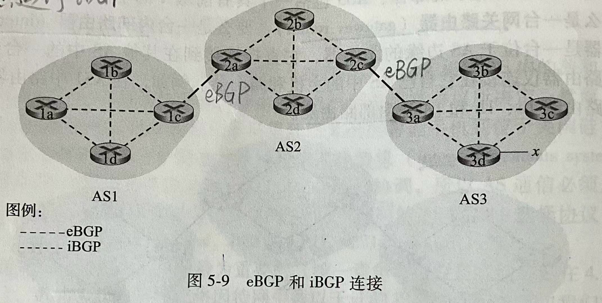

如上图所示，假设要向AS1和AS2中的所有路由器通告前缀x的可达性信息。

首先，网关路由器3a向网关路由器2c发送一个eBGP报文“AS3 x”.

然后，网关路由器2c向AS2中所有其他路由器发送iBGP报文“AS3 x”.

接着，网关路由器2a向网关路由器1c发送一个eBGP报文“AS2 AS3 x”.

最后，网关路由器1c向AS1中所有其他路由器发送iBGP报文“AS2 AS3 x”.

至此，所有路由器都获知了x的存在并且知道了通往x的AS路径

### BGP属性

两个比较重要的BGP属性：

- AS-PATH：通告已经通过的AS的列表，比如上文中的 AS2 AS3。可以用于检测和防止通告环路。
- NEXT-HOP：AS-PATH列表中**起始的路由器接口** 的IP地址

每条BGP路由包含3个组件：NEXT-HOP; AS-PATH; 目的地前缀。

对于上述例子，AS1中的每台路由器都知道了到前缀x的1个BGP路由：

- 路由器2a最左侧接口的IP地址：AS2 AS3；x

（在实践当中，一条BGP路由还会包括其他属性。）

### BGP路由选择算法

#### 热土豆路由选择

> **热土豆路由选择**:
>
> 热土豆路由选择是BGP路由选择算法中最简单的一个。

算法思想：尽可能快（尽可能用最小开销）将分组送出其AS，而不考虑 AS外部到目的地 剩余部分的开销。

具体做法：选择具有最靠近NEXT-HOP路由器的路由。

#### 实际的BGP路由器选择算法

按照以下选择依据进行路由选择。如果仅有一条合适的路由，则BGP选择该路由，如果有2条及以上合适的路由，则按顺序调用改选择依据进行消除，直至剩下一条路由。

1. 路由被指派一个**本地偏好值**作为其属性之一（除了AS-PATH和NEXT-HOP以外的属性）。
2. 从余下的路由中选择具有**最短AS-PATH**的路由。
3. 从余下的路由中，使用**热土豆路由选择**，即选择具有最靠近NEXT-HOP路由器的路由。
4. 从余下的路由中，使用**BGP标识符**来选择路由。

# ICMP

> **因特网控制报文协议（Internet Control Message Protocol, ICMP）**：
>
> ICMP被主机和路由器用来彼此沟通网络层的信息。

ICMP的作用：

- 差错报告：ICMP典型的用途
- 拥塞控制：利用源抑制报文，令源主机减小发送速率，从而实现拥塞控制。

ICMP报文作为IP数据报的有效载荷（TCP/UDP报文段也是作为IP数据报的有效载荷）

承载ICMP报文的IP数据报中，上层**协议**字段为1

## Ping 程序

Ping 程序使用ICMP报文实现

### 工作原理

Ping程序发送一个ICMP**类型8**编码0的ICMP回显请求报文（即 **ICMP ECHO REQUEST**）到指定主机；

目的主机看到回显请求后，发回一个**类型0**编码0的ICMP回显回答（即 **ICMP ECHO REPLY**）到源主机。

## Traceroute 程序

> **Traceroute程序**：
>
> Traceroute程序用于跟踪一台主机到另一台主机之间的路由

Traceroute程序使用ICMP报文实现

### 工作原理

源主机发送一系列IP数据报，这些IP数据报中携带着一个具有**不可达UDP端口号**的UDP报文段。

第一个数据报的TTL=1，第二个数据报的TTL=2，依次类推。

每次发出IP数据报时，就启动定时器。

当第$i$个数据报到达第$i$台路由器时，它的TTL正好减为0。根据IP协议规则，路由器丢弃该数据报，并发送一个ICMP告警报文给源主机。该ICMP告警报文中包含了路由器的名字和路由器的IP地址。

当ICMP告警报文到达源主机时，源主机就可以从定时器中得到往返时延，从ICMP告警报文中得到第$i$台路由器的名字和IP地址。