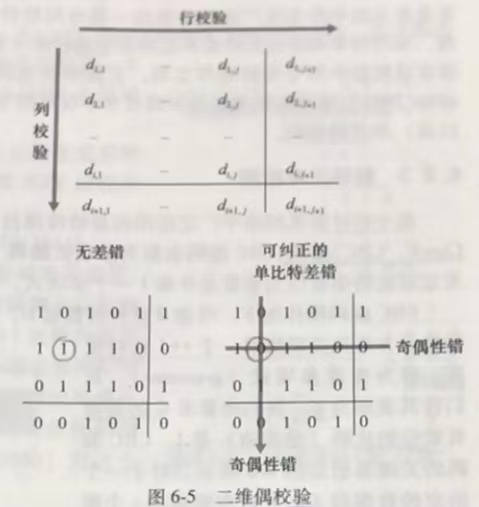
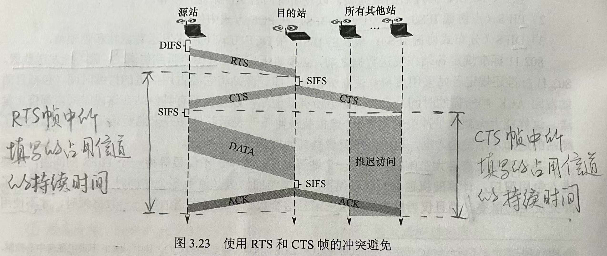
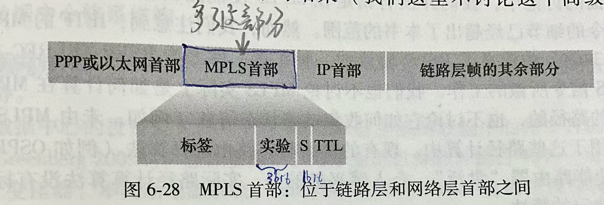
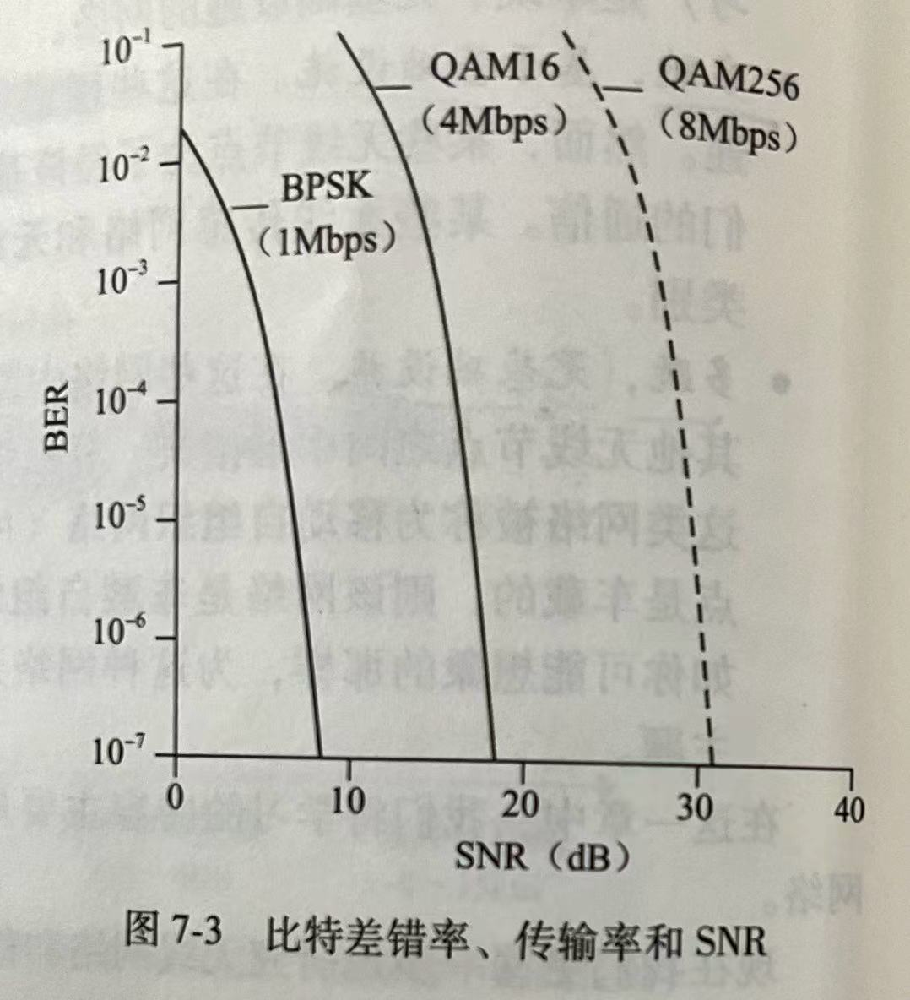
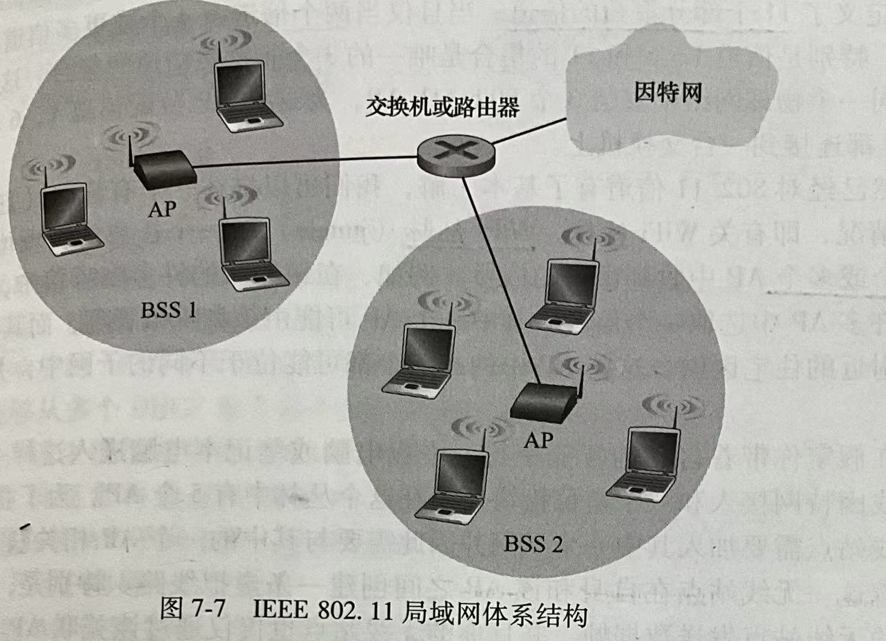
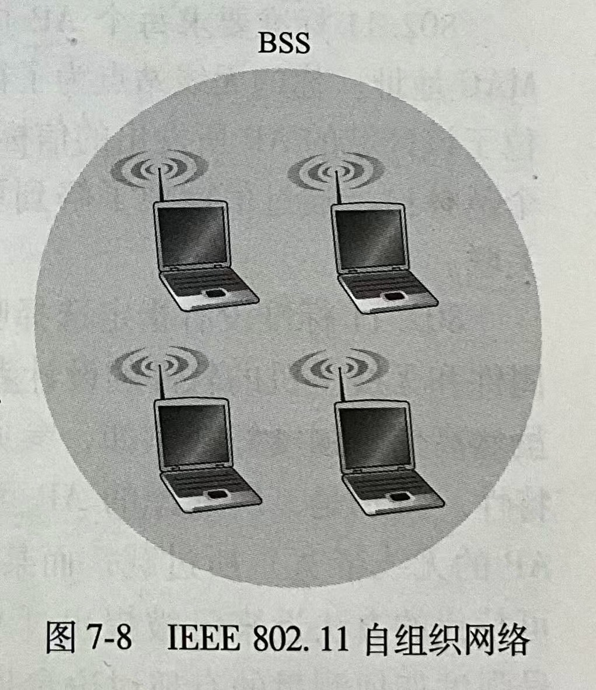
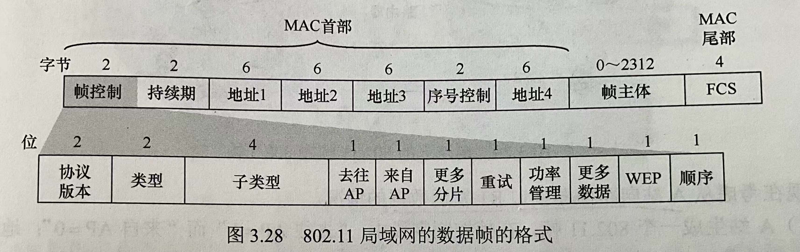

# 概述

## 网络链路类型

网络链路有两种类型：

- 点对点链路：单个发送方和单个接收方
- 广播链路：多个发送方和接收方节点都连接到相同的、单一的、共享的广播信道上。

## 链路层服务
- 成帧：网络层数据包 -- 封装-> 链路层帧
- 链路接入：介质访问控制(Medium Acess Control,MAC)协议规定了帧在链路上传输的规则。
- 可靠交付：确认、重传
- 差错检测和纠正。

链路层服务实现方式：

在网路适配器的芯片(网卡)上实现
硬件（大部分）+软件

# 差错检测和纠正技术
检测差错的3种技术：

- 奇偶校验
- 检验和方法
- 循环冗余检测CRC

## 奇偶校验
假设有 d bit的数据D
奇校验方案：使得d+1个比特中，1的个数为奇数
偶校验方案：使得d+1个比特中，1的个数为偶数

### 二维奇偶校验

可以检测并纠正的错误：

- 单个比特差错
- 不在同一行也不在同一列的差错

可以检测但无法纠正的错误：

当在同一行或同一列出现2个比特差错时，可以检测出错误，但是无法纠正

## 检验和

（与TCP、UDP的方法相同）

## 循环冗余检测 Cyclic Redundancy Check, CRC
假设有 d bit的数据D
发送方和接收方先协商一个$(r+1)$ bit 的生成多项式G，要求其最高有效位的比特为1
除了发送数据D之外，还要发送附加r bit 的CRC比特R。
R 的计算：

1. D左移r位，得到$D'$
2. $D'$​除以G的余数，得到R

最后发送D左移r位+R， 总共 $(d+r)$ bit数据

> [!CAUTION]
>
> CRC的计算中，所有计算均采用模2算术来做，即**加法不进位，减法不借位**，相当于异或
>
> “所有计算”包括发送方求R时，以及接收方检验时

检验方法：接收方用收到的d+r bit数据 除以G,得到余数
- 若余数为0：数据正确，被接受
- 否则：出现了差错

# 多路访问协议

> **多路访问问题**：
>
> 如何协调多个发送和接收节点对一个共享广播信道的访问？

多路访问协议正是用于解决多路访问问题。
有3种类型：

- 信道划分协议：TDMA，FDMA, CDMA
- 随机接入协议: 时隙ALOHA, Pure ALOHA, CSMA, CSMA/CD（用于有线网络），CSMA/CA（用于无线网络）
- 轮流协议：轮询协议，令牌传递协议

## 信道划分协议

### 时分复用 TDMA

假设有N个节点，将时间划分为时间帧（frame），并进一步将每个时间帧划分为N个时隙（slot），将每个时隙分配给N个节点。

传输速率：每个节点在每个帧内分到的传输速率是$R/N $ bps

### 频分复用 FDMA

假设有N个节点，将$R$ bps信道划分为N个频段，每个频段有$R/N$​的带宽

传输速率：每个节点的传输速率是$R/N $ bps

### 码分复用 CDMA

> **码分复用（CDMA）**：是采用不同的编码来区分各路原始信号的一种复用方式。
>
> 与FDMA（只共享频率）和TDMA（只共享时间）不同，CDMA既共享信道的频率，有共享时间。

#### 原理

将每个比特时间再划分为m个短的时间槽，称为**码片(Chip)**，每个站点指派一个唯一的m位码片序列。

下面假设$m=8$，来讲解CDMA如何工作。

假设A站的码片序列为 00011011，则A站发送 00011011 就表示发送比特1，发送码片序列的反码 11100100 就表示发送比特0。

为了数学计算的方便，将码片中的0写为-1，1写为+1。那么A站的码片序列可以写为(-1,  -1,  -1, +1, +1, -1, +1, +1)，将此记为A站的码片向量$\mathbf{S}=(-1,\ -1,\ -1,\ +1,\ +1,\ -1,\ +1,\ +1)$，假设B站的码片向量为$\mathbf{T}=(-1,\ -1,\ +1,\ -1,\ +1,\ +1,\ +1, \ -1)$

所以对于A站，比特1经过编码后得到$\mathbf{S}$，比特0经过编码后得到$\mathbf{\bar{S}}$；B站同理。

为了实现码分复用，码片序列（码片向量）满足以下性质：

1. 不同站的码片序列相互正交，即不同站的码片向量的规格化内积为0
   $$
   \mathbf{S} \cdot \mathbf{T} = \frac{1}{m} \sum_{i=1}^{m} S_i \cdot T_i = 0
   $$

2. 同一个站的码片向量与该码片向量*自身*规格化内积为1
   $$
   \mathbf{S} \cdot \mathbf{S} = \frac{1}{m} \sum_{i=1}^{m} S_i \cdot S_i = \frac{1}{m} \sum_{i=1}^{m} (S_i)^2 = \frac{1}{m} \sum_{i=1}^{m} (\pm 1)^2 =1
   $$

3. 同一个站的码片向量与该码片*反码* 的向量规格化内积为-1
   $$
   \mathbf{S} \cdot \mathbf{\bar{S}} = \frac{1}{m} \sum_{i=1}^{m} S_i \cdot \bar{S_i} = - \frac{1}{m} \sum_{i=1}^{m} (S_i)^2 = -1
   $$

利用性质1和性质2，可以得到 *一个站的码片向量* 与*另一个站的码片反码的向量* 的规格化内积也为0
$$
\mathbf{S} \cdot \mathbf{\bar{T}} = \mathbf{S} \cdot (\mathbf{T} \cdot \mathbf{T}) \cdot \mathbf{\bar{T}} = (\mathbf{S} \cdot \mathbf{T}) \cdot (\mathbf{T} \cdot \mathbf{\bar{T}}) = 0 \cdot (-1)=0
$$
作为一个例子，我们假设此时A站发送比特1，B站发送比特0，那么在信道上叠加后的信号为$\mathbf{S}+\mathbf{\bar{T}}$

在**接收方**，收到这个信号后要先进行解码。

要获取A站的数据，就要用A站的码片向量与收到的信号做规格化内积
$$
\mathbf{S}\cdot (\mathbf{S}+\mathbf{\bar{T}}) = \mathbf{S}\cdot \mathbf{S} + \mathbf{S}\cdot \mathbf{\bar{T}}=1+0=1
$$
要获取A站的数据，就要用B站的码片向量与收到的信号做规格化内积
$$
\mathbf{T}\cdot (\mathbf{S}+\mathbf{\bar{T}}) = \mathbf{T}\cdot \mathbf{S} + \mathbf{T}\cdot \mathbf{\bar{T}}=0+(-1) =-1
$$

#### 小结

##### 发送方：

- 要发送比特1，就要编码成它的码片向量$\mathbf{S}$再发送；
- 要发送比特0，就要编码成它的码片反码向量$\mathbf{\bar{S}}$​再发送.

##### 信道叠加：

在公共信道上，不同站点发送的数据会**叠加（线性相加）**在一起，形成一个复杂的信号。

##### 接收方：

接收方收到信道上叠加的信号后，想要解码出哪个站点的数据，就用那个站点的码片向量与收到的信号做规格化内积，内积结果就是站点发送的原始比特。

## 随机接入协议

### 时隙ALOHA

基本假设：

- **所有帧等长**：所有帧都是由 $L$ bit组成
- **时隙等于传输一帧的时间**：时间被划分成 $L/R$ s的时隙（也就是说，一个时隙等于传输一帧的时间）
- **只在时隙起点开始传输**：节点只在时隙起点才能开始传输帧
- **同步**：节点是同步的，每个节点都知道时隙何时开始
- **碰撞可被所有节点检测**：如果在一个时隙中由2个及以上的帧碰撞，则所有节点在该时隙结束之前都能检测到该碰撞事件。

#### 工作原理：

- 当一个节点要发送新帧时，需要等到下一个时隙开始并在该时隙传输整个帧

- 若无碰撞，该节点成功传输该帧
- 若有碰撞，该节点在时隙结束之前检测到这次碰撞，以概率$p$​在后续的每个时隙中重传它的帧，直至该帧被无碰撞地传输出去

#### 关键计算：传输成功概率和时隙ALOHA的效率

假设有$N$个节点，每个节点传输的概率为$p$，不传输的概率为$1-p$​

对于给定的一个节点，它在一个时隙内传输成功的概率为$p (1-p)^{N-1}$，那么它不成功的概率就是 $1- p(1-p)^{N-1}$

因为总共有$N$个节点，所以一个时隙内任意1个节点传输成功的概率为$ N p (1-p)^{N-1}$，

所以时隙ALOHA的效率为$ N p (1-p)^{N-1}$

当$N \rightarrow +\infin$时，取$ N p (1-p)^{N-1}$的极限

得到最大效率：$\frac{1}{e} =0.37 $

> [!NOTE]
>
> 拓展：
>
> 很容易得到，一个时隙内没有任何一个节点传输成功的概率就是 $1- N p (1-p)^{N-1}$​
>
> 那么在第 $T$ 个时隙出现首次传输成功的概率为 $\left[ 1- N p (1-p)^{N-1} \right]^{T-1} \cdot [N p (1-p)^{N-1} ]$​
>
> 对于给定的一个节点，在第 $T$ 个时隙首次传输成功的概率为 $\left[ 1- p(1-p)^{N-1} \right]^{T-1} \cdot [p (1-p)^{N-1}]$

### Pure ALOHA 

#### 工作原理

没有划分时隙。

当一个帧首次到达时，节点立即将该帧**完整地传输**进广播信道。

如果发生了碰撞，则这个节点立即以概率$p$重传该帧。若重传，则在等待一个帧传输时间后，以概率$p$​​重传该帧，直至成功。

#### 关键计算：Pure ALOHA的效率

假设有$N$个节点，节点$i$在$t_0$时刻开始传输，

为了避免该帧的起始部分与其他帧碰撞，则在$\left[t_0 -1 , t_0 \right]$内不能有其他节点的帧传输，概率为$(1-p)^{N-1}$

为了避免该帧在传输时与其他帧的起始部分碰撞，则在$\left[t_0, t_0 + 1\right]$内不能有其他节点的帧开始传输，概率为$(1-p)^{N-1}$​

所以一个给定节点传输成功的概率为$p (1-p)^{2(N-1)}$​

因为总共有$N$个节点，所以任意1个节点传输成功的概率为$Np (1-p)^{2(N-1)}$

所以Pure ALOHA的效率为$Np (1-p)^{2(N-1)}$

当$N \rightarrow +\infin$时，取极限可得最大效率：$\frac{1}{2e} $

### CSMA

> 载波侦听多路访问（Carrier Sense Multiple Access, CSMA）

### CSMA/CD

> 具有碰撞检测的CSMA（CSMA with Collision Detection, CSMA/CD）

注意：用于有线网络

#### 工作流程

1. 适配器从网络层获得一个数据报，准备链路层帧，并将其放入帧适配器缓存中。
2. 如果适配器侦听到信道空闲，则开始传输帧；如果信道正在忙，则等待，直到没有信道能量才开始传输帧。
3. 在传输过程中，适配器监视广播信道中是否有来自其他适配器的信号能量。
4. 若传输完整个帧，且检测到其他适配器的信号能量，则传输完成。但若传输时检测到其他适配器的信号能量，则中止传输。
5. 中止传输后，适配器等待一个**随机时间量**，然后返回2.

#### 二进制指数回退

中止传输后，适配器等待的随机时间量使用二进制指数回退法来确定。

首先确定一个基本退避时间，也就是能够检测到碰撞要求的时间$2 d_{prop}$​

假设一个帧已经经历了连续的$n$次碰撞，则节点随机地从$[0, 2^n-1 ]$中选一个整数 $K$​​ 值，$n$最大取10。

则适配器等待的随机时间量为$2K d_{prop}$

##### 关键计算：能够检测到碰撞要求的时间

假设帧的长度为$L$，链路层传输速率为$R$，信道传播时延为$d_{prop}$

则要求
$$
\frac{L}{R} \geq 2 d_{prop}
$$

> [!NOTE]
>
> 以太网规定的最短帧长$L_{min}$是512 bit = 64B，所以$2d{prop}=\frac{L_{min}}{R}=\frac{512 \; bit}{R}$​
>
> 所以，对于以太网，节点实际等待的时间为$2 K d_{prop}$，即$K \cdot 512$ 比特时间（发送512 bit 进入以太网所需时间的$K$倍）

#### 效率

CSMA/CD的效率为$\frac{1}{1+5d_{prop}/d_{trans}}$

### CSMA/CA

> 具有碰撞避免的CSMA（CSMA with Collision Avoidance, CSMA/CA）

注意：用于无线网络

> [!IMPORTANT]
>
> **为什么无线网络不使用碰撞检测的CSMA/CD？**
>
> 1. 信号衰减严重。在无线网络中，信号强度随着传播距离的增大而衰弱的速度很快，导致适配器接收到的信号强度往往远小于发送信号的强度。因此，要实现冲突检测，在硬件上的成本较大。
> 2. 隐藏终端问题。在无线通信中，并非所有站点都能听见对方，从而使得冲突检测机制并不能检测所有冲突。

基于上述问题，802.11 标准定义了用于无线局域网的CSMA/CA协议。

由于无线信道的通信质量远不如有线信道，因此 802.11 标准使用**链路层 确认和重传 机制**，即站点每通过无线局域网发送完一帧，就要在收到对方的确认帧后才能发送下一帧。所以， 802.11 标准无线局域网采用的停止-等待协议是一种可靠传输协议

#### 工作流程

1. 假设站点最初有数据要发送，且检测到信道空闲，那么在等待分布式帧间间隔（Distributed Inter-Frame Space, DIFS）后，就发送**整个**数据帧。
2. 若信道忙，则执行CSMA/CA退避算法，选取一个随机退避值。当侦听到信道忙，该计数值保持不变；当侦听到信道空闲，则该计数值减1.
3. 当计数值减少到0时，就发送整个帧并等待确认。
4. 发送站若收到确认，就知道已发送的帧已经被目的站正确接收了。这时要发送第二帧，就要从步骤2开始。
5. 若未收到确认，发送站就要重传该帧，再一次进入步骤2，并且从一个更大的范围内选取随机退避值。经过若干次重传失败后就会放弃发送。

#### 处理隐藏终端问题

 802.11 标准使用**预约**的方式来处理隐藏终端问题

## 轮流协议

### 轮询协议

#### 缺点：

1. 引入了轮询时延
2. 如果主节点故障，则整个信道都会不可用

### 令牌传递协议

#### 工作原理：

没有主节点，把一个称为令牌的小的特殊帧在节点之间以某种固定次序交换。

当一个节点拿到令牌时，如果它没有帧要发送，则立即向下一个节点转发该令牌；只有当它有数据要发送时，才持有这个令牌，并发送最大数目的帧数。

#### 缺点：

一个节点的故障可能会使整个信道崩溃

# 交换局域网

## MAC地址！

> **链路层地址**：
>
> 链路层地址有多种称呼：LAN地址、物理地址、MAC地址
>
> 常用的是MAC地址

### MAC地址形式

MAC地址长度为**6B（48 bit）**，共可表示$2^{48}$​个MAC地址，常用十六进制表示。

MAC地址的前24位是由生产适配器的公司固定的，不同公司不同；后24位是公司自己为每个适配器唯一生成的。

因此，**没有两块适配器有相同的地址！**

> [!CAUTION]
>
> 主机和路由器有链路层地址，但是交换机没有！
>
> 更准确地说，不是主机和路由器有链路层地址，而是它们的**适配器接口**（即网络接口）具有链路层地址

### MAC广播地址

广播地址是48位全是1组成的字符串，以十六进制表示就是FF-FF-FF-FF-FF-FF

## ARP协议！

作用：IP地址到MAC地址的转换

> [!CAUTION]
>
> 注意区分：
>
> DNS是用于主机名到IP地址的转换
>
> ARP是用于IP地址到MAC地址的转换

> **ARP表**：
>
> 在每台主机或路由器的内存中有一个**ARP表**，表中包含从IP地址到MAC地址的映射关系

### 换取MAC地址的流程

#### 相同子网内

假设主机A要向位于相同子网内的 主机B发送IP数据报，需要经过以下步骤：

1. 主机A向它的适配器传递一个ARP查询分组，并指示适配器应该用**MAC广播地址**（FF-FF-FF-FF-FF-FF）来发送这个分组
2. **封装、发送**：适配器在链路层帧封装这个ARP分组，以广播地址（FF-FF-FF-FF-FF-FF）为帧的目的地址，然后将帧传输进子网
3. 包含该ARP查询的帧被子网内其他适配器收到，每个适配器将该帧中的ARP分组向上传递给ARP模块。
4. **检查IP地址是否匹配**：ARP模块检查它的IP地址与ARP分组中的目的IP地址是否匹配
5. **匹配者返回响应ARP分组**：与之匹配的模块（也就是主机B的模块）就给查询主机A发送回一个 *带有IP地址对应的MAC地址* 的响应ARP分组。
6. **更新ARP表**：查询主机A就能更新它的ARP表
7. 主机A利用得到的MAC地址，就能向主机B的适配器发送帧了

#### 不同子网

假设主机A要向位于不同子网的 主机B发送IP数据报，需要经过以下步骤：

1. 主机A先通过ARP协议查出路由器左侧接口的MAC地址
2. 主机A发出IP数据报。其中源IP为主机A的IP，目的IP为主机B的IP；源MAC为主机A适配器的MAC地址，目的MAC为路由器左侧接口的MAC地址
3. 路由器左侧接口收到该IP数据报，转发给它的右侧接口
4. 路由器右侧接口先通过ARP协议查出主机B适配器的MAC地址
5. 路由器右侧接口发出IP数据报。其中源IP仍为主机A的IP，目的IP为主机B的IP；源MAC为路由器右侧接口的MAC地址，目的MAC为主机B适配器的MAC地址

## 交换机！

交换机对于子网中的主机和路由器是**透明**的。

交换机特点：

- 自学习
- 即插即用
- 双工

### 交换机表

交换机表项包含：

- 一个MAC地址
- 通向该MAC地址的交换机接口
- 表项放置在表中的时间

### 转发和过滤原理

当一个目的MAC地址的帧从交换机接口x到达时，交换机用该MAC地址到交换机表中匹配，有3种可能的情况：

1. 表中没有该MAC地址的表项，则交换机向**除了接口x之外的所有接口**转发该帧的副本，即广播该帧。（洪泛）
2. 表中有该MAC地址与接口x关联的表项，说明该帧是从包含该MAC地址对应适配器的局域网网段过来的，所以无须转发，丢弃该帧。（过滤）
3. 表中有该MAC地址与接口$y \neq x$​关联的表项，说明该帧需要被转发到与接口y相连的局域网网段，所以将该帧放到接口y前面的输出缓存。（转发）

3种情况的总结：

|        匹配情况        |     操作     |
| :--------------------: | :----------: |
|       无匹配选项       |     洪泛     |
|  匹配，但接口为入接口  | 过滤（丢弃） |
| 匹配，且接口不是入接口 |     转发     |

### 自学习

交换机是**自学习**的，因此交换机是即插即用的设备

实现方式：

1. 交换机表初始为空
2. 对于每个接口收到的每个入帧，在交换机表中存储：源MAC地址字段的MAC地址、该帧到达的接口、当前时间（到达时间）
3. 如果一段时间（老化期）后，交换机没有收到以该MAC地址为源MAC地址的帧，就在表中删除这个MAC地址。

> [!NOTE]
>
> 在方式2下，如果局域网上的每一个主机都发送了一个帧，则每个主机最终将在交换机表中留有记录（在不过老化器的情况下）

### 交换机与路由器的对比

|            | 交换机                       | 路由器                         |
| ---------- | ---------------------------- | ------------------------------ |
| 层次       | 链路层设备                   | 网络层设备                     |
| 处理的地址 | MAC地址                      | IP地址                         |
| 维护的表   | 交换机表（通过洪泛来自学习） | 转发表（通过路由选择算法来学） |
| 即插即用   | 是                           | 否                             |

## VLAN

> **虚拟局域网（Virtual LAN, VLAN）**：
> 支持VLAN的交换机允许经一个单一的物理局域网基础设施定义**多个虚拟局域网**。

### 基于端口的VLAN

交换机的端口由网络管理员划分为组，每个组构成一个VLAN，在每个VLAN中的端口形成一个广播域

### 基于MAC的VLAN

根据MAC地址划分的VLAN

### VLAN干线连接

每台交换机上的一个特殊端口被配置为**干线端口**，用于互联两台VLAN交换机

## MPLS

> **多协议标签交换（Multi-Protocol Label Switching, MPLS）**:
>
> 使用**固定长度**标签，根据该标签进行转发

MPLS使能的路由器称为标签交换路由器，根据标签进行转发。

不需要提取目的IP地址，不需要在转发表中执行最长前缀匹配查找

改进点：最长前缀匹配由于不是定长的，匹配时间长，效率低。改用定长的标签，可以加快匹配效率

# 无线网络

## 概述

无线网络的要素：

- 无线主机
- 无线链路
- 基站：
  - 基于基础设施的网络：无线主机与基站相连
  - 自组织网络：无线主机没有基础设施与之相连
- 网络基础设施

无线链路和网络特征：

- 递减的信号强度
- 来自其他源的干扰
- 多路径传播

### 信噪比

> **信噪比(Signal-to-Noise Ratio, SNR)**：
>
> 所收到信号和噪声强度的比值。$SNR = \frac{Signal}{Noise}$
>
> 单位：分贝（dB)

> **比特差错率(Bit Error Rate, BER)**：
>
> 指接收方收到的有错传输比特的概率

SNR、BER、传输率的关系：

- 对于给定的调制方案，SNR越高，BER越低。SNR越高，即噪声越小，那么误码率越小，即BER越小
- 对于给定的SNR，调制技术的比特传输率越高，BER越大。
- 物理层调制技术的动态选择能用于适配对信道条件的调制技术。当环境中的噪声变大（即SNR变小）时，BER会变大，这时会动态选择传输率更小的调制方式，来使得BER减小。

## 802.11 无线局域网

### 802.11 无线局域网体系结构

部署AP的无线局域网被称作**基础设施无线局域网**（这里主要讨论的是这种）

没有基础设施的网络称为**自组织网络**

### 802.11 MAC协议

802.11 采用的随机接入协议是CSMA/CA，在前文已经介绍过。

### 802.11 帧格式

其中，最重要的是4个地址字段（都是MAC地址！）：

地址1：接收该帧的站点的MAC地址

地址2：发出该帧的站点的MAC地址

地址3：路由器接口的MAC地址

地址4：用于自组织网络
