# **第一部分** 数据库基本原理

[TOC]

# **第一章 引言**

## 1.1 数据库系统的应用

数据库管理系统(DataBase-Management System, DBMS)由**一个互相关联的数据集合**和**一组用来访问这些数据的程序**组成。这个数据集合通常称为数据库

主要目标：提供一种**方便、高效地**存取数据库信息的途径

## 1.2 数据库系统的目标

文件处理系统中存储组织信息的主要弊端：

- 数据的冗余和不一致
- 数据访问困难
- 数据孤立
- 完整性问题，一致性约束
- 原子性问题
- 并发访问异常
- 安全性问题

## **1.3 数据视图**

### **1.3.1 数据模型**

> **数据模型**：
>
> 一个描述**数据、数据联系、数据语义以及一致性约束**的概念工具的集合。
>
> 数据模型是数据库结构的基础

数据模型可以分为4类：

- **关系模型**：用表的集合来表示数据和数据间的关系
- **实体-联系模型(E-R)**：现实世界由一组称作实体的基本对象以及这些对象间的联系构成
- **半结构化数据模型**
- **基于对象的数据模型**

### **1.3.3 数据抽象**

- **视图层**：最高层次抽象,只描述整个数据库的某个部分。
- **逻辑层**：描述数据库中存储了什么数据以及这些数据间存在什么关系。逻辑层用户不必知道物理层结构，保证了物理数据独立性。
- **物理层**：最低层次的抽象,描述数据是怎样存储的。

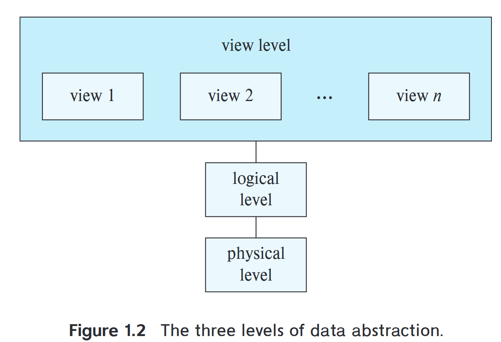

### **1.3.4 实例和模式**

**实例(instance)**：特定时刻数据库中的信息集合

**模式(schema)**：数据库的**总体设计**(不频繁发生改变)

**物理模式**：在物理层描述数据库的设计,可以在应用程序不受影响的情况下被更改。

**逻辑模式**：在逻辑层描述数据库的设计。程序员用逻辑模式来构造数据库应用程序。

## **1.4 数据库语言**

数据定义语言(Data-Definition Language, DDL)：定义数据库模式

数据操纵语言(Data-Manipulation Language, DML)：表达数据库的查询和更新

### **1.4.1 数据定义语言(DDL)**

数据库中的数据值必须满足某些**一致性约束**

- 域约束：每个属性都有**值域**

- 参照完整性（引用完整性）：一个关系中属性集上的取值也在另一关系的某一属性集的取值中出现
- 断言：数据库需要时刻满足的某一条件
- 授权：对用户加以区别(读权限、插入权限、更新权限、删除权限)

DDL的输出放在**数据字典**中,数据字典包含了**元数据**,元数据是关于数据的数据。

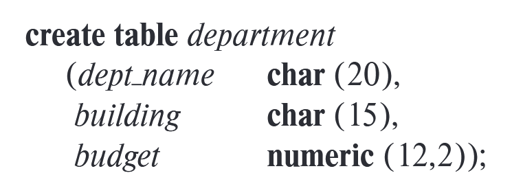

### **1.4.2 数据操纵语言(DML)**

基本上有两种类型的数据操纵语言：

- **过程化DML**：要求用户指定需要什么数据以及如何获得这些数据 
- **声明式DML(非过程化DML)**：只要求用户指定需要什么数据，不必指明如何获得这些数据。比如：MySQL，SQL

**查询(query)**：对信息进行检索的语句

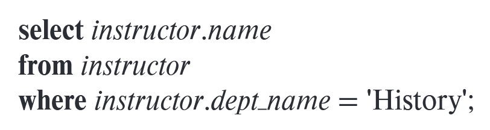

## **1.5 数据库设计**

数据库设计的主要内容是数据库模式的设计

### **1.5.1 设计过程**

1. 制定出用户需求的规格文档
2. 概念设计阶段,将需求转换为数据库的概念模式
3. 逻辑设计阶段
4. 物理设计阶段

### 1.5.2 实体-联系模型(E-R模型)

实体通过**属性**集合来描述

**联系**是几个实体之间的关联

**实体集、联系集**：同一类型所有 实体 */* 联系 的集合

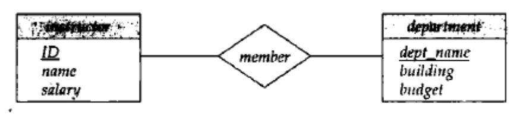

### 1.5.3 规范化

目标：

- 没有不必要的冗余
- 能轻易地检索数据

使用**函数依赖**设计**范式**

## **1.6 数据存储和查询**

数据库系统的功能部件可分为 存储管理器 和 查询处理部件

### **1.6.1 存储管理器**

存储管理部件包括：

- 权限及完整性管理器
- 事务管理器
- 文件管理器
- 缓冲区管理器

数据结构：

- **数据文件**：存储数据库本身

- **数据字典**：存储关于数据库结构的元数据(数据库模式)

- **索引**：提供对数据项的快速访问

### **1.6.2 查询处理器**

查询处理器组件包括：

- **DDL解释器**：解释DDL语句并将定义记录在数据字典中
- **DML编译器**：将查询语言翻译为一个执行方案
- **查询执行引擎**：执行由DML编译器产生的低级指令

### 1.6.3 事务

**事务**是数据库应用中完成单一逻辑功能的操作集合

其具有原子性、一致性、持久性

**恢复管理器**保证数据库系统的原子性和持久性

**并发控制管理器**控制并发事务间的相互影响,保证数据库的一致性

**事务管理器**包括并发控制管理器和恢复管理器

## 1.7 数据库和应用体系结构

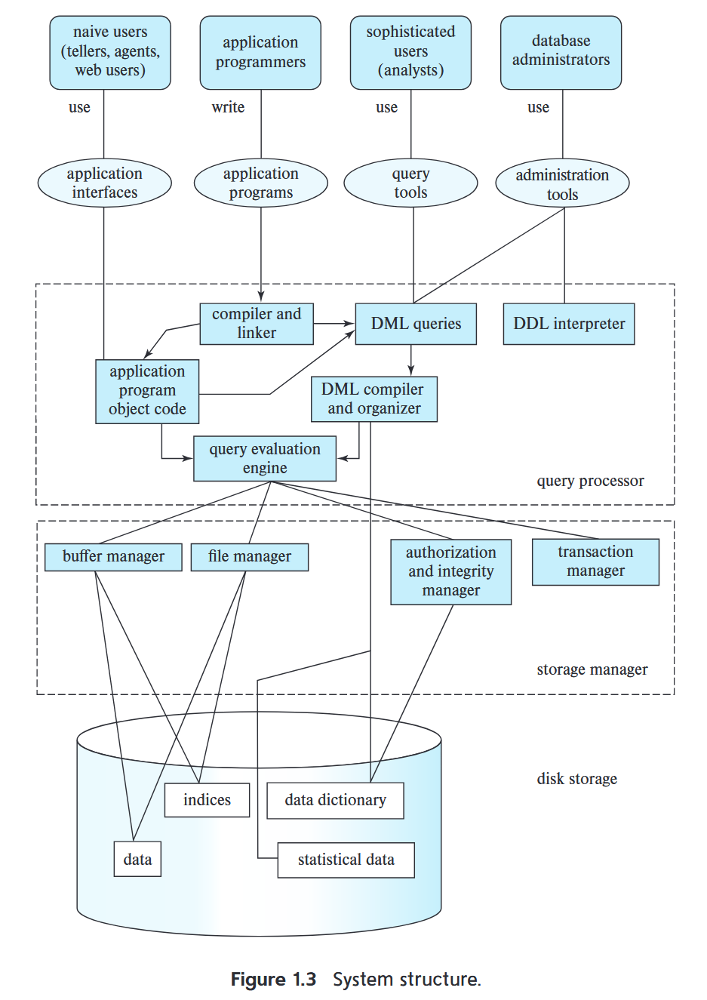

数据库应用系统可以分为两层体系结构（早期）和三层体系结构（现代）。

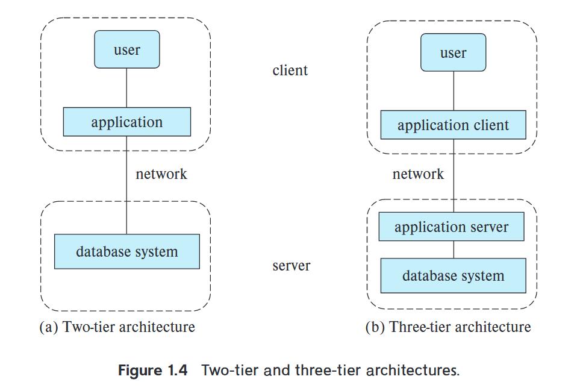

## 1.8 数据库用户和管理员

### **1.8.1 数据库用户**

数据库系统的用户可以分为四种不同类型：

- 无经验的用户
- 应用程序员
- 老练的用户
- 专门的用户

### **1.8.2 数据库管理员**

数据库管理员(DataBase Administrator, DBA)的作用包括：

- 模式定义
- 存储结构及存取方法定义
- 模式及物理组织的修改
- 数据访问授权
- 日常维护

# **第二章 关系模型介绍**

## **2.1 关系数据库的结构**

关系数据库由**表**的集合构成

**重要术语：**

**关系（relation）** 用来指代**表**

**元组（tuple）** 用来指代行

**属性（attribute）** 用来指代表中的列

**关系实例（relation instance）** 指代一个关系的特定实例，也就是说关系实例包含一组特定的行。

**域**：关系中的属性允许取值的集合。若域中元素被看作是不可再分的单元,则域是**原子的**

**空值(null)**：一个特殊的值,表示值未知或不存在

## **2.2 数据库模式**

**数据库模式**是数据库的逻辑设计

**数据库实例**是在给定时刻数据库中数据的一个快照

**关系模式**：对应于程序设计中的类型定义

## **2.3 码**

一个元组的属性值必须能够**唯一区分**元组。

**超码**：一个或多个属性的集合,可以使我们在一个关系中**唯一**地标识一个元组

**候选码**：**最小的超码**,可以有多个

**主码**：被设计者选中用来在一个关系中区分不同元组的候选码。（主码的属性要加下划线）

**外码**：$r_1$在属性中包括 $r_2$ 的主码，这个属性在$r_1$ 上被称作参照（或引用）$r_2$ 的**外码**

关系$r_1$ 称为外码依赖的**参照（引用）关系**, 关系r$r_2$称作外码的**被参照（引用）关系**

**参照（引用）完整性约束**：要求参照关系的元组在特定属性上的取值等于被参照关系中某个元组在该属性上的取值

## 2.4 模式图

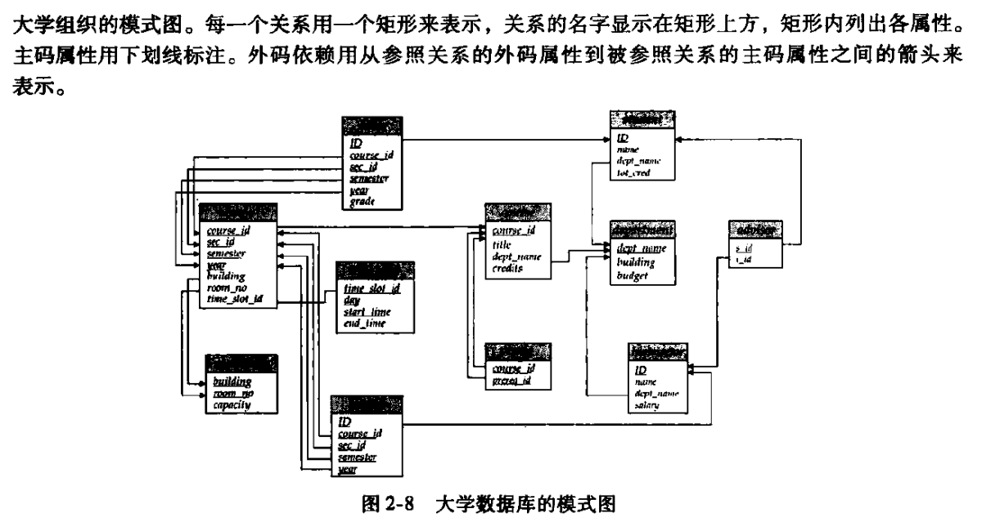

## 2.5 关系查询语言

**查询语言**：请求获取数据库信息的语言

查询语言可以分为：

- 命令式
- 函数式
- 声明式


# **第三章 初级SQL**

## **3.1 SQL查询语言概览**

SQL语言有以下几个部分：

- 数据定义语言(DDL)：SQL DDL提供定义关系模式、删除关系、修改关系模式的命令

- 数据操纵语言(DML)：SQL DML提供从数据库中查询信息、在数据库中插入元组、删除元组、修改元组的能力

- 完整性：完整性约束

- 视图定义

- 事务控制

- 嵌入式SQL和动态SQL

- 授权： DDL可以定义对关系和视图的访问权限


## **3.2 SQL数据定义**

### **3.2.2 基本模式定义**

#### create

**create table**命令的通用形式：

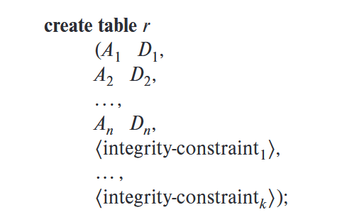

**create table**命令的例子：

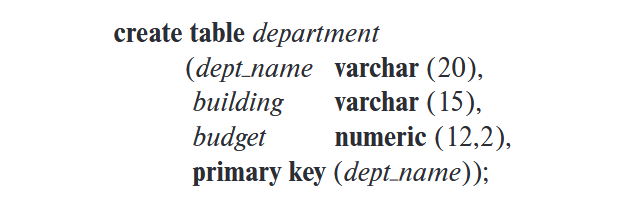

三个基本的完整性约束：

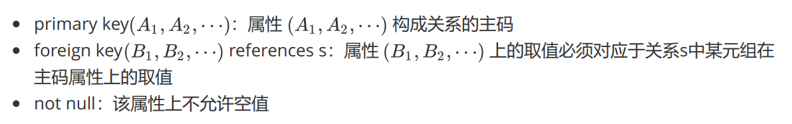

#### drop

删除一个关系，不仅删除r中所有元组，**还删除r的模式**

```sql
drop table r;
```

#### delete

只删除r中所有元组

```sql
delete from r;
```

#### alter

在已有关系中增加属性

```sql
alter table r add A D; -- A是添加的属性名称，D是待添加的属性类型
```

在已有关系中删除属性

```sql
alter table r drop A
```


## **3.3 SQL查询的基本结构**

### 3.3.1 单关系查询

从关系R中查询属性A

```sql
select A
from R;
```

比如：

```sql
select dept_name
from instructor
```

#### distinct

希望查询的结果中没有重复，则用`distinct`

```sql
select distinct dept_name
from instructor
```

> [!CAUTION]
>
> SQL语句中默认不去重
>
> 但是关系代数中默认是去重的

#### all

默认情况下是不会去重的，但可以使用`all`来显式地指明不去重

```sql
select all dept_name
from instructor
```

#### where

用where子句来指定选出满足特定谓词的元组

```sql
select A
from R
where P; -- P是一个谓词
```

### 3.3.2 多关系查询

```sql
select A1,A2,...,An
from r1,r2,...,rn
where P;
```


## **3.4 附加的基本运算**

### **3.4.1 更名运算**

#### as

```sql
select distinct T.name
from instructor as T, instrctor as S
where T.salary > S. salary and S.dept_name = 'Biology';
```

这种用**as**实现的重命名,被称作**表别名**或者是**相关名称**

### 3.4.2 字符串运算！

> [!WARNING]
>
> SQL标准中，字符串的相等运算是大小写敏感的，但是一些数据库系统中是不敏感的。

#### like

字符串使用**like**操作符来实现模式匹配。

```sql
select dept_name
from department
where building like '% Watson%';
-- 找出任意所在建筑名称中包含子串'Watson'的所有系名
```

用两个特殊字符来描述模式：

- **百分号(%)**：匹配任意 *字符串* 
- **下划线(_)**：匹配任意 *一个字符*

#### escape

escape关键字用来定义转义字符，比如：

- `like 'ab\%cd%' escape '\'` 匹配以"ab%cd"开头的所有字符串
- `like 'ab\\cd%' escape '\'` 匹配以"ab\cd"开头的所有字符串

### 3.4.3 属性说明

#### *

星号 `*` 用来在select子句中表示“*所有属性*”

例如：

```sql
select instuctor.*
from instructor,teaches
where instructor.ID = teaches.ID;
```

又例如：

```sql
select *
from instructor;
```

### 3.4.4 排列元组的显示次序

#### order by

默认使用**升序**排序

```sql
select name 
from instructor
where dept_name = 'Physics'
order by name;
```

说明排序的顺序：

- **asc**：升序（默认就是升序，所以也可以不写）
- **desc**：降序

```sql
select *
from instructor
order by salary desc, name asc; -- 先按salary降序排列，若有salary相同的，则再按name升序排列
```

### 3.4.5 where子句谓词

where子句谓词中可以使用**between**，**not between**，元组等方式

## **3.5 集合运算**

**union, intersect, except**运算分别对应于集合论中的 (并) (交), (差)运算

> [!CAUTION]
>
> **union, intersect, except**运算都会自动去除输入中的重复项
>
> 如果想要保留重复项，则要加上**all**


## **3.6 空值**

空值给关系运算带来了特殊的问题,包括算数运算、比较运算和集合运算

- 算术运算：如果算数表达式任一输入为空,则该算数表达式结果为空
- 比较运算
  - 1 < null = unknown
- 布尔运算

| 运算符 | true R unknown | false R unknown | unknown R unknown |
| ------ | -------------- | --------------- | ----------------- |
| and    | unknown        | false           | unknown           |
| or     | true           | unknown         | unknown           |

**not** unknown 的结果是 unknown

## **3.7 聚集函数**

**聚集函数**是以值的一个集合为输入、返回单个值的函数

常见聚集函数：avg, min, max, sum, count

### **3.7.2 分组聚集** group by

```sql
select dept_name, avg(salary) as avg_salary
from instructor
group by dept_name;
-- 找出每个系的平均工资
```

查询结果：

| dept_name  | avg.salary |
| ---------- | ---------- |
| Biology    | 72000      |
| Comp. Sci. | 77333      |
| Elec. Eng. | 80000      |
| Finance    | 85000      |
| History    | 61000      |
| Music      | 40000      |
| Physics    | 91000      |

出现在**select**语句中但没有被聚集的属性只能是出现在**group by**子句中的那些属性

### **3.7.3 having子句**

**having**子句中的谓词 **仅针对group by子句构成的分组**，在形成分组后才起作用。

```sql
select dept_name, avg(salary) as avg_salary
from instructor
group by dept_name
having avg(salary) > 42000
-- 找出每个平均工资大于42000的系
```

## **3.8 嵌套子查询**

子查询是嵌套在另一个查询中的**select-from-where**表达式。

### **3.8.1 集合成员资格**

连接词**in/not in**测试元组是否是集合中的成员

### **3.8.2 集合的比较**

集合的比较需要用到比较运算符以及**some/all**关键字

`>some`表示：至少比某一个大

`>all`表示：比所有的都大

> [!CAUTION]
>
> 注意：
>
> `=some `等价于`in`，但是`<>some`不等价于`not in`
>
> `<>all`等价于`not in`，但是`=all`不等价于`in`，

### **3.8.3 空关系测试**

**exists**结构在作为参数的子查询非空时返回**true**值

可以用 **not exists** 结构来模拟集合包含运算($\subseteq,\supseteq$)

#### 关键：集合包含运算!

对于“关系A包含关系B”，即$A \supseteq B$，可以写成“**not exists (B except A)**”，即$ \neg (B-A)$

若“**not exists (B except A)**”为 True，则说明“关系A包含关系B”为True

例如：找出选修了Biology系开设的所有课程的所有学生

```sql
select S.ID,S.name
from student as S
where not exists ((select course_id 
					from course
					where dept_name='Biology')
					except
					(select T.course_id
					from takes as T
					where S.ID = T.ID))
```

### 3.8.4 重复元组存在性测试

#### unique

如果没有重复的元组，则返回True

例如：找出在2017年最多开设一次的所有课程

```sql
select T.course_id
from course as T
where unique (select R.course_id
				from section as R
				where T.course_id = R.course_id and R.year=2017);
```

#### not unique

反过来，**not unique**就可以找出有重复的元组，即如果有重复的元组，则返回True

例如：找出在2017年至少开设两次的所有课程

```sql
select T.course_id
from course as T
where not unique (select R.course_id 
					from section as R
					where T.course_id = R.course_id and R.year=2017);
```

### 3.8.5 from子句中的子查询

任何**select-from-where**表达式返回的结果都是关系,因而可以被插入到另一个**select-from-where**中 任何关系可以出现的位置

### **3.8.6 with子句**

**with**子句提供定义临时关系的方法,这个定义只对包含**with**子句的查询有效

## **3.9 数据库的修改**

### **3.9.1 删除**

```sql
delete from r
where P;
```

### **3.9.2 插入**

```sql
insert into course
values('CS-437','C++','CS',4);
```

或者指定属性

```sql
insert into course(course_id, title, dept_name, credits)
values('CS-437','C++','CS',4);
```

### **3.9.3 更新**

```sql
update instructor
set salary = salary * 1.05;
```


# **第四章 中级SQL**

## **4.1 连接表达式**

### 4.1.1 自然连接 natural join

自然连接只考虑 在两个关系的模式中**都出现**的那些属性上 **取值相同**的元组对。

例如：student 关系和takes关系有**共同属性**ID

因此以下查询

```sql
select name,course_id
from student, takes
where student.ID = takes.ID;
```

可以用自然连接写为

```sql
select name,course_id
from student natural join takes
```

#### join using

**join ... using**需要指定一个属性列表，只根据属性列表中的属性进行自然连接。

例如：

```sql
r1 join r2 using(A1,A2)
```

只会根据A1,A2来进行自然连接，即使r1,r2有共同属性A3，也不管。

### 4.1.2 连接条件

#### on

**on** 可以指定任何的连接条件.

**on**和**where**在外连接中的表现是不同的,**on**条件是外连接声明的一部分,但**where**子句却不是


#### **on** 与 **join ... using** 和 **natural join**的一个区别

例如：

```sql
select *
from student join takes on student.ID = takes.ID;
```

> [!CAUTION]
>
> 注意：在上述语句的结果中，`ID`会出现两次：
>
> 一次是`student.ID `，另一次是` takes.ID` 
>
> 在**join ... using** 和 **natural join**中，`ID`只会出现1次。
>
> 这是 **on** 与 **join ... using** 和 **natural join**的一个区别。


### **4.1.3 外连接**

**外连接**通过在结果中创建包含空值的元组，来保留那些在连接中会丢失的元组。

与之相对的，不保留未匹配元组的连接运算称为**内连接**

外连接的三种形式：

1. **左外连接(left outer join)**：只保留出现在左边的关系中的元组。（即，允许左边关系中不匹配的元组保留在结果中。）连接后，右边关系的属性可能有空值
1. **右外连接(right outer join)**：只保留出现在右边的关系中的元组。（即，允许右边关系中不匹配的元组保留在结果中。）连接后，左边关系的属性可能有空值
1. **全外连接(full outer join)**：保留出现在两个关系中的元组。（即，允许两边关系中不匹配的元组保留在结果中。）连接后，两边关系的属性都可能有空值


### 4.1.4 连接类型和条件

自然连接不保留未匹配元组，所以又称为**自然内连接**

**join**子句可以使用 **inner**来显式指定内连接，用**outer**来指定外连接。缺省时默认内连接。

综上所述，连接类型有：

- inner join
- left outer join
- right outer join
- full outer join

连接条件有：

- natural
- using (A1, A2, ...)
- on + predicate

不同连接条件的比较如下：

|                     | 含义                                                       | 结果                |
| ------------------- | ---------------------------------------------------------- | ------------------- |
| natural             | 按照两个表**所有**的**共同**属性进行连接                   | 共同属性只出现1次   |
| using (A1, A2, ...) | 按照**指定**的**共同**属性进行连接                         | 共同属性只出现1次   |
| on + predicate      | 按照任何指定的属性进行连接（不一定是两个关系都共有的属性） | 指定的属性会出现2次 |


## **4.2 视图**

**视图**：不是逻辑模型的一部分，但作为**虚拟**关系对用户可见

视图**不会预先计算和存储**，数据库系统存储的是与视图关系相关联的查询表达式，每当访问视图关系的时候，通过执行查询计算出来其中的元组。

> [!NOTE]
>
> **视图与基本表的比较**：
>
> 数据库系统中只存放视图的定义，而不存放视图对应的数据。这些数据都在基本表中，一旦基本表中的数据变化，从视图中查询出来的数据也会随之改变。
>
> 视图一经定义就可以像基本表一样被查询、删除，也可以在视图之上再定义一个视图。但是视图的更新操作有限制。


### **4.2.1 视图定义**

**create view**命令的格式为：

```
create view v as <query expression>;
-- <query expression> 可以是任何合法的查询表达式,v表示视图名
```

### **4.2.2 SQL查询中使用视图**

在查询中,视图名可以出现在关系名可以出现的任何地方。

### **4.2.3 物化视图**

**物化视图**：如果用于定义视图的实际关系改变，视图也跟着修改。

如果视图是物化的，则其结果将**存储在数据库**中，从而允许使用该视图的查询 可以通过使用与计算的视图结果 来更快地运行，而不是重新计算该视图的结果。

保持物化视图一直在最新状态的过程称为 *物化视图维护* 或 *视图维护*。

> [!CAUTION]
>
> 物化视图与普通视图的区别之一在于：物化视图会**预先计算和存储**，而普通视图不会预先计算和存储


### **4.2.4 视图更新**

一个视图是**可更新的**,如果其满足以下条件：

- from子句中只有**一个**数据库关系
- select子句只包含关系的属性名，不包含表达式、聚集或`distinct`声明
- 任何没有出现在select子句中的属性都没有`not null`约束,同时也不是主码的一部分
- 查询中不含有`group by`或`having`子句


## **4.3 事务**

**事务**由查询和更新语句的序列组成

事务结束标志：

- **Commit work**：提交当前事务 
- **Rollback work**：回滚当前事务

## **4.4 完整性约束**

### **4.4.2 not null 约束**

**not null**声明禁止在该属性上插入空值

### **4.4.3 unique 约束**

unique(A1,A2, ... ,Am)

unique声明指出属性A1,A2,…Am形成了一个候选码

### **4.4.4 check 子句**

**check(P)**子句指定一个谓词P，关系中的每个元组都必须满足谓词P

```
create table department
(dept_name varchar (20),
budget int,
check (budget>0));
```

### **4.4.5 参照完整性**

**参照完整性**：保证在一个关系中给定属性集上的取值也在另一关系的特定属性集的取值中出现

### **4.4.7 断言**

一个**断言**就是一个谓词,它表达了我们希望数据库总能满足的一个条件

断言为如下形式： `create assertion <assertion-name> check <predicate>`;

## **4.5 SQL的数据类型与模式**

### **4.5.1日期和时间类型**

- data 年月日
- time 时分秒 。变量time(p)表示秒的小数点后的数字位数
- timestamp 时间戳： data和time的组合

### **4.5.3 默认值**

SQL允许为属性指定默认值

### **4.5.4 大数据类型**

大对象数据类型：clob

二进制数据大对象数据类型：blob(binary Large OBject)


## 4.6 索引

**索引**：创建在关系的属性上,允许数据库高效地找到关系中那些在属性上取给定值的元组,而不用扫描 关系中的所有元组

创建索引的形式为：

```sql
create index <index_name> on <relation_name>(<attribute list>)
```

创建索引示例： 

```sql
create index student_id_index on student(ID);
```


## **4.7 授权**

对数据的授权包括：

- 授权读取数据


- 授权插入新数据
- 授权更新数据
- 授权删除数据

每种类型的授权都称为一个**权限**

SQL包括 select, insert, update, delete 权限

grant语句用来授予权限,revoke语句用来收回权限

例如：

授权

```sql
grant update(budget)  	-- 对属性budget的更新权限
on department			-- 在department关系上
to Amit, Satoshi;		-- 授权给这两个用户
```

授权

```sql
revoke update(budget)
on department
from Amit, Satoshi;
```


权限转移：在授权语句末尾加`with grant option`

比如：

```sql
grant select 
on department
to Amit
with grant option;
```


级联收回：`cascade` 默认

不级联收回：`restrict`

比如：

```sql
revoke select
on department
from Amit, Satoshi
restrict;
```

收回授权选项，但是不收回选择权限

```sql
revoke grant option for select
on department
from Amit;
```


# **第五章 高级SQL**

## 5.2 函数和过程

### 函数

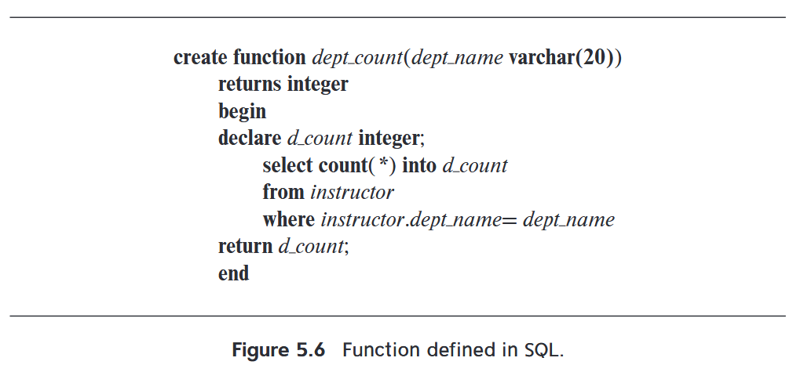

### 过程

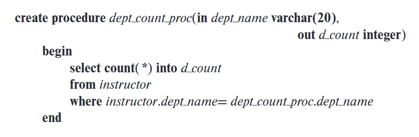

### 函数和过程的比较

|                      | 过程 procedure    | 函数 function        |
| -------------------- | ----------------- | -------------------- |
| 返回值 return        | 0个或多个         | 必有1个              |
| 事务中可否使用       | 可用              | 不可用               |
| 相互调用关系         | 可以调用 function | 不可以调用 procedure |
| 可否被select语句使用 | 不可以            | 可以                 |


## **5.3 触发器**

**触发器**是一条语句,当对数据库做修改时,它自动被系统执行 设置触发器机制的要求：

- 指明什么条件下执行触发器
  - 一个引起触发器被检测的事件
  - 一个触发器执行必须满足的条件
- 指明触发器执行的动作

基本格式：

```sql
create trigger trigger_name [before/after] [update/insert/delete] on table_name
referencing old row as orow
referencing new row as nrow
for each row 
when ( ... ) -- a predicate
begin atomic
	... -- some operations, such as rollback, insert, update, and so on
end;
```

例如：

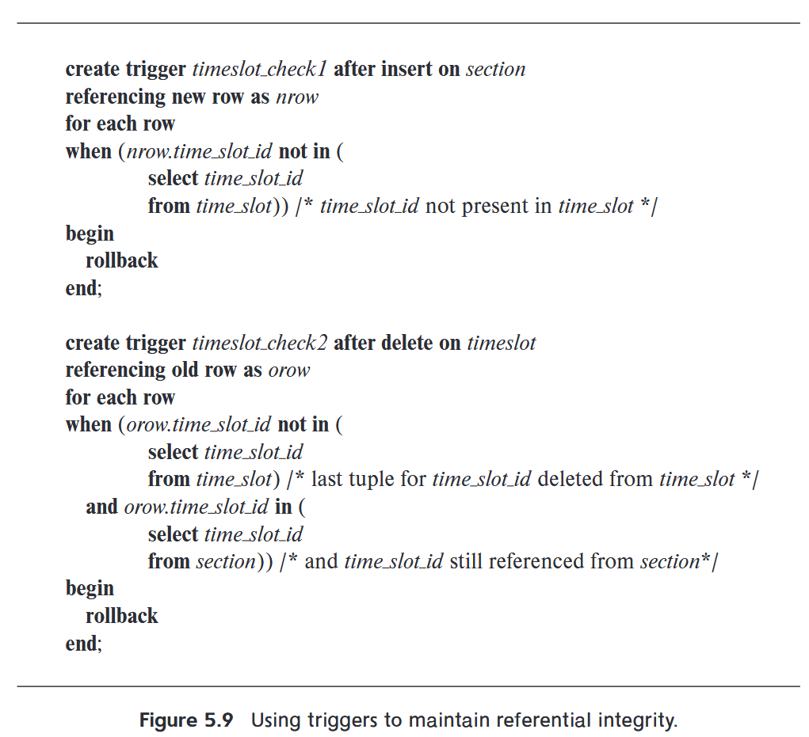


# 第六章 形式化关系查询语言

## 6.1 关系代数

关系代数是一种**过程化**查询语言

关系代数的基本运算有：选择$\sigma$、投影$\Pi$、并$\cup$、集合差$-$、笛卡尔积$\times$、更名$\rho_x(E)$

其它运算：集合交$\cap$、自然连接$\bowtie$、赋值$\leftarrow$

### **6.1.1 选择运算**

选择运算 $\sigma$​ ：选出满足给定谓词的元组

用法：$\sigma_{p}(r)$ 表示：在关系r中，选出满足谓词p的元组

通常,我们允许在选择谓词中使用$=,\neq,<,\leq,>,\geq$进行比较

另外可以用连词 $\land, \lor,\neg$ 将多个谓词合并为一个较大的谓词
$$
\sigma_{\left(\text{dept\_name} = \text{"Physics"}\right) \land \left( \text{salary} > 90\ 000 \right)} (\text{instructor})
$$

### **6.1.2 投影运算**

投影运算 $\Pi$：返回参数关系，滤掉特定的属性

用法：$\Pi_{L}(r)$ 表示：在关系r中，返回列表L内的属性

$$\prod_{ID, name, solary} (instructor)$$

### 6.1.3 关系运算的组合

由于关系代数运算的结果类型仍为**关系**，因此可以把多个关系代数运算组合成一个**关系代数表达式**
$$\prod_{name} (\sigma_{\text{dept\_name} = \text{Physics}} (instructor))$$

### 6.1.4 笛卡尔积运算

笛卡尔积运算$\times$：可以将任意两个关系的信息组合在一起

用法：$r_1 \times r_2$表示：将$r_1$和$r_2$中的元组$t_1$和$t_2$​拼接成单个元组

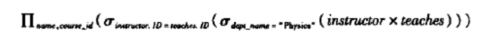

> [!CAUTION]
>
> 集合的笛卡尔积在数学上的定义是：
>
> $r_1 \times r_2$ 将$r_1$和$r_2$中的元组$t_1$和$t_2$组成元组对$(t_1,t_2)$
>
> 可见，数据库中关系的笛卡尔积运算与数学上定义的不同

因为可能出现两个关系的属性同名的情况,因此我们把关系名称附加在属性名前：

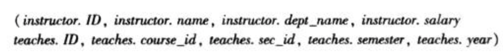

可以用选择操作从笛卡尔积中选择出满足特定要求的元组。

### 6.1.5 连接运算

连接运算 $\bowtie$ 将 *选择* 与 *笛卡尔积* 合并到单个运算中。

 连接运算的定义：
$$
r \bowtie_{\theta} s = \sigma_{\theta} (r \times s)
$$
比如：
$$
\sigma_{\text{instructor.ID}=\text{teacher.ID}} (instructor \times teacher) = {instructor} \bowtie_{\text{instructor.ID}=\text{teacher.ID}} {teacher}
$$

### 6.1.6 集合运算

#### 6.1.6.1 集合的并

$r,s$两个集合的并$r \cup s$

集合运算会自动去除重复值,只留下单个元组。

要使**并**运算有意义(相容)，必须满足以下两个条件：

1. 关系r和s必须是同元的,即它们的**属性数目必须相同**
2. 对所有的i,r的第i个属性的域必须和s的第i个属性的**域相同**

例如：在2024年秋季开课或在2025年春季开课的课程

$\prod_{\text{course\_id}}(\sigma_{semester=\text{"Fall"} \land year=2024}(section)) \cup \prod_{\text{course\_id}}(\sigma_{semester=\text{"Spring"} \land year=2025}(section))$

#### 6.1.6.2 集合的交

$r,s$两个集合的交$r \cap s$

同样地，必须确保两个关系相容，才能做交运算

例如：在2024年秋季开课且在2025年春季开课的课程

$\prod_{\text{course\_id}}(\sigma_{semester=\text{"Fall"} \land year=2024}(section)) \cap \prod_{\text{course\_id}}(\sigma_{semester=\text{"Spring"} \land year=2025}(section))$

#### **6.1.6.3 集合差运算**

**集合差**运算$r-s$，表示在关系$r$中而不在关系$s$中的那些元组

同样地，必须确保两个关系相容，才能做集合差运算

例如：只在2024年秋季开课，而不在2025年春季开课的课程

$\prod_{\text{course\_id}}(\sigma_{semester=\text{"Fall"} \land year=2024}(section)) - \prod_{\text{course\_id}}(\sigma_{semester=\text{"Spring"} \land year=2025}(section))$

### 6.1.7  赋值运算

赋值运算 $\leftarrow$：可以给临时关系变量赋值

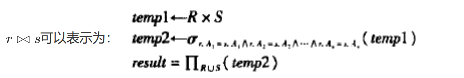

### 6.1.8  更名运算

更名运算可以给关系赋予名字

用法：$\rho_{x}(E)$返回以 $x$ 命名的表达式 $E$ 的结果

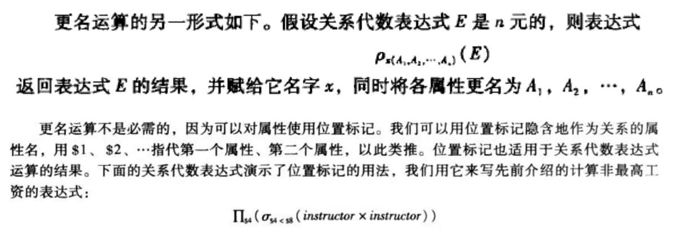