# **第二部分 数据库设计**

[TOC]

# **第七章 数据库设计和E-R模型**

## **7.1 设计过程概览**

### **7.1.1 设计阶段**

设计阶段主要由以下5个阶段：

1. **需求分析**：完整刻画用户的数据需求
2. **概念设计**：选择数据模型，采用所选数据模型的概念将需求转化为数据库的概念模式。
   - 使用**实体-联系模型**（**E-R 图**）进行概念设计。
   - **概念模式**规定了数据库中表示的 *实体、实体的属性、实体之间的联系，以及实体和联系上的约束*。
3. **功能需求规格说明**：完善概念模式,指明功能需求
4. **逻辑设计阶段**：将实体-联系模型定义的概念模式映射到**关系模式**。
5. **物理设计阶段**：具体说明数据库的物理特性，包括文件组织形式和索引结构的选择

### **7.1.2 设计选择**

**实体**：指示所有可以明确的个体

设计数据库模式时,必须避免两个主要缺陷:

1. **冗余**：不好的设计可能会导致重复信息 最大的问题是，当对一条信息进行更新时,这条信息的拷贝可能会与其不一致
2. **不完整**：某些方面可能难以甚至无法建模

## **7.2 实体-联系模型**

E-R数据模型采用三个基本概念：**实体集、联系集、属性**

### **7.2.1 实体集**

**实体**是现实世界中可区别于所有其他对象的一个"事物"或"对象"

**实体集**是相同类型具有相同性质(属性)的一个实体集合

实体通过一组**属性**来表示

每个实体的每个属性都有一个**值**

### **7.2.2 联系集**

**联系**是指 *多个实体间* 的相互关联

**联系集**是相同类型联系的集合

实体集$E_1,E_2,\cdots,E_n$ **参与**联系集R

实体在联系中扮演的功能称为实体的**角色**

联系也可以具有**描述性属性**

*参与联系集的实体集的数目* 称为联系集的**度**(二元联系集的度为2,三元联系集的度为3)

## 7.3 复杂属性

> **域(值集)**：每个属性可取值的集合

### 属性类型描述:

- **简单**和**复合**属性:
  - 简单属性不能被划分为子部分
  - 复合属性可以被划分为子部分（即其他属性）

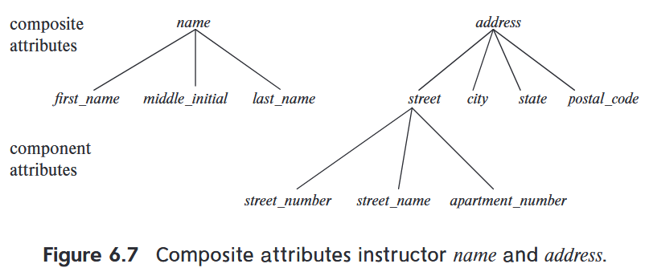

- **单值**和**多值**属性：
  - 单值属性：一个属性只有单独的一个值
  - 多值属性：一个属性可能对应于一组值
- **派生属性**：这类属性的值可以从别的相关属性或实体派生出来

> [!NOTE]
>
> 派生属性的值**并不存储**，只在需要时被计算出来

### 相应的E-R图表示法：

- 复合属性：用层次化的开头空格来表示（像python的语法那样）
- 多值属性：用花括号 { } 包起来
- 派生属性：在属性名后加圆括号 ( )

如下图，name是复合属性；address是复合属性；phone_number 是多值属性；age 是派生属性，可以用 date_of_birth 和当前日期推算出来。

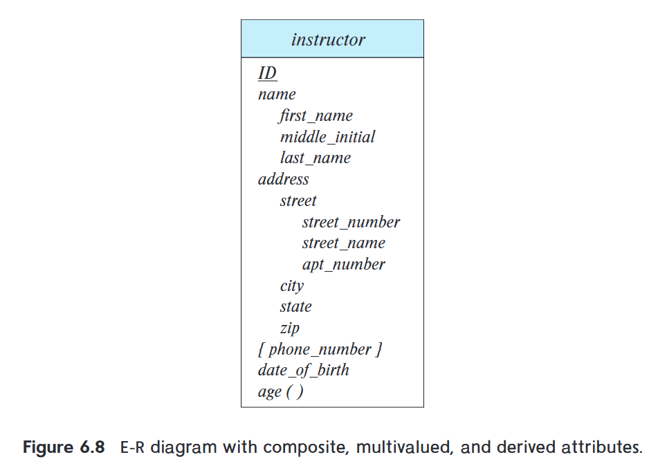

## 7.4 映射基数

**映射基数（或基数比率）**:表示一个实体通过一个联系集能关联的实体的个数

- 一对一
- 一对多
- 多对一
- 多对多

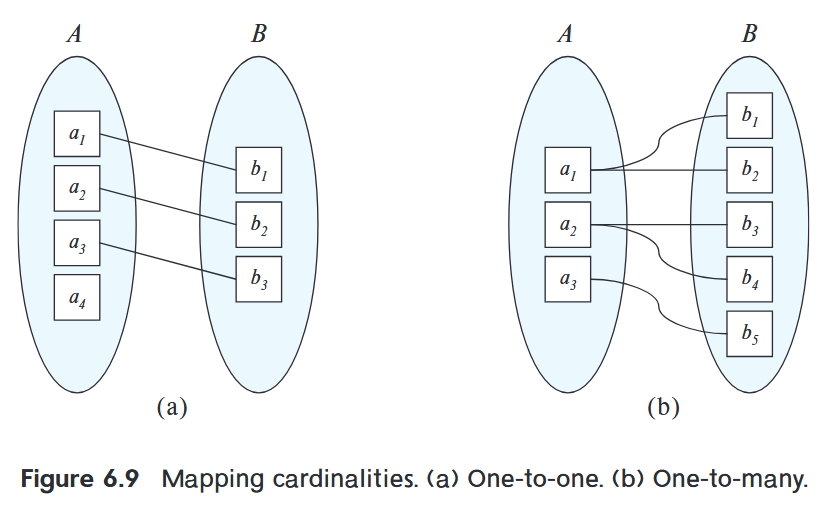

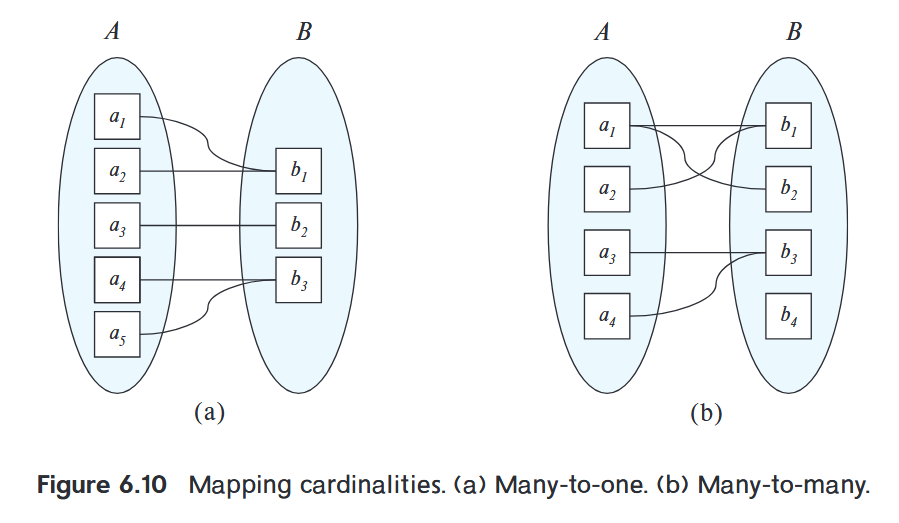

### 相应的E-R图表示法：

- 有向线段：参与度为1
- 无向线段：参与度$\geq 0$​
- 双线：表示一个实体在联系集中的**全部参与**

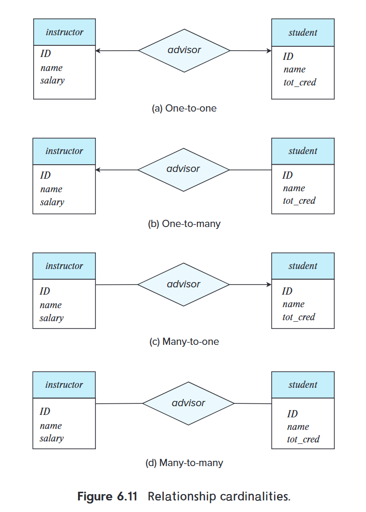

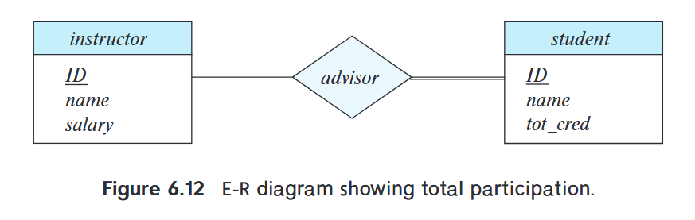

## 7.5 主码

### 7.5.1 实体集

关系模式中的超码、候选码、主码的概念同样适用于实体集。

### 7.5.2 联系集

假设$R$是一个涉及实体集$E_1,E_2,\cdots,E_n$的联系集。

因为联系集是联系实例的集合，并且每个实例都由其中的实体唯一标识，所以联系集$R$​所涉及的实体集的主码 的**并集**
$$
\text{primary-key}(E_1) \cup \text{primary-key}(E_2) \cup \cdots \cup \text{primary-key}(E_n)
$$
就构成了联系集$R$的一个**超码**。

据此，找到最小的超码，就可以被选作主码。

对于**多对多**的联系集：联系集$R$的主码由 *所涉及的实体集的主码 的**并集*** 构成

对于**一对多**和**多对一**的联系集：*“多”方的主码* 是最小的超码，可被用作联系集的主码

对于**一对一**的联系集：任一实体集的主码都构成最小超码，可以从中**任选一个**作为联系集的主码。

### **7.5.3 弱实体集**

**弱实体集**:没有足够的属性以形成主码的实体集

**强实体集**:有主码的实体集

弱实体集必须与另一个称作**标识**或**属主实体集**的实体集关联才能有意义 弱实体集**存在依赖**于标识实体集;

标识实体集**拥有**它所标识的弱实体集

弱实体集与其标识实体集相连的联系称为**标识性联系**

弱实体集的**分辨符**可以区分其中的实体

#### 相应的E-R图表示法：

在 E-R 图中，用**双边框的矩形**描述 ***弱实体集***，其分辨符要加**虚下划线**

关联弱实体集和标识性强实体集的***标识性联系集*** 用 **双边框的菱形** 表示。

通常，弱实体集必须**全部参与**其标识性联系集（所以标识性联系集sec_course和弱实体集section之间用双线），并且该联系是到标识性实体集的**多对一**联系（所以标识性联系集sec_course到标识性实体集course之间用有向箭头，且指向course）。

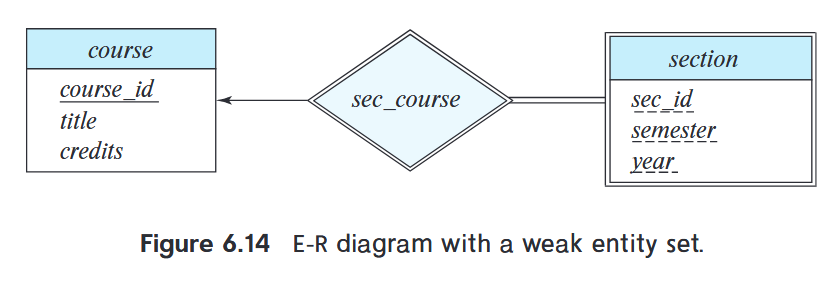

## 7.6 从实体集中删除冗余属性

##### **何时存在冗余？**

如果**两个相互联系**的实体集中存在**相同的属性**，则存在冗余

##### **对于冗余的处理：**

若冗余的属性在一个实体集中构成主码，则在另一个实体集中移除该冗余属性

**大学的E-R图**

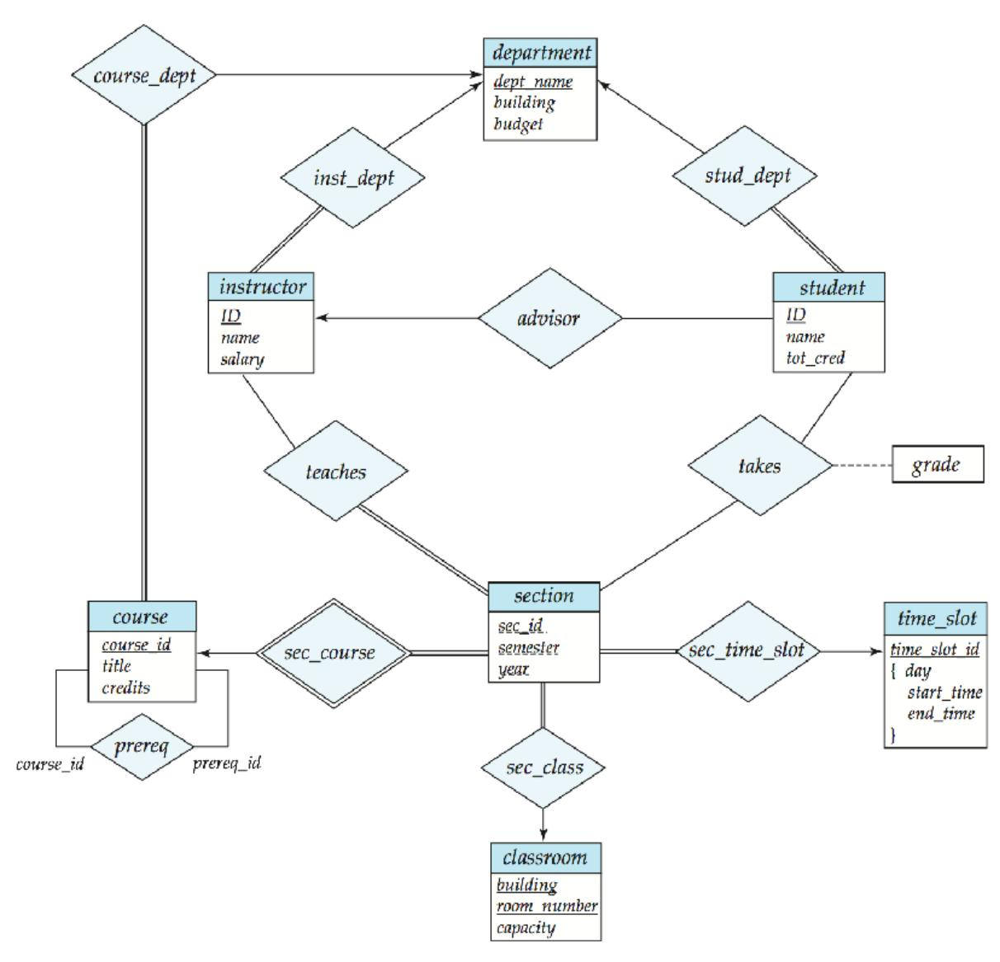

## 7.7 将E-R图转换为关系模式

### 7.7.1 强实体集的表示

强实体集的主码直接作为其关系模式的主码

### 7.7.2 具有复杂属性的强实体集的表示

#### 复合属性

将复合属性展开为简单属性，然后放入模式中。

例如：

name 展开为 first_name, middle_name, last_name；

address 展开为 street, city, state, postal_code，注意到street也是一个复合属性，进一步展开为 street_number, street_name, apt_number。然后放入以下的关系模式中。

#### 多值属性

对于多值属性M，需要另外构建关系模式R（单值属性构建一个关系模式，每个多值属性又要另外构建一个关系模式）。

在关系模式R中，除了多值属性M之外，还有一个对应于M所在的实体集或联系集的**主码的属性**

例如：phone_number是多值属性，它跟所在实体集合的主码（ID）一起构成另一个关系模式

### 7.7.3 弱实体集的表示

假设弱实体集转换而来的关系模式为A，强实体集转换而来的关系模式为B.

则A的主码由其**强实体集的主码与弱实体集的分辨码**组合而成。

除了创建主码之外，还要在A上创建**外码约束**，指明它的某些属性是来自B的主码。

### 7.7.4 联系集的表示

联系集R对应的关系模式$R'$的主码属性就是联系集R的主码属性

除了创建主码之外，还要在$R'$上创建**外码约束**，从$R'$上的属性引用对应实体集E所产生的关系模式的主码。

### 7.7.5 模式的冗余

一般而言，连接弱实体集与其对应强实体集的**标识性联系集的模式** 是***冗余的***，在基于E-R图的关系数据库设计中**不必给出**。

### 7.7.6 模式的合并

假设从实体集$A$到实体集$B$由**多对一**的联系集$AB$，它们对应得到3个模式$A, B, AB$，

假如$A$在该联系中是**全部参与**的，那么可以将$A$和$AB$合并成1个模式，新模式中的属性是$A$和$AB$的属性的并集。

假如$A$在该联系中是**部分参与**的，那么可以通过使用**空值**来合并$A$和$AB$，但这时合并后的模式中存在空值。

假如$A$和$B$是**一对一**的联系，那么联系集的关系模式可以和参与联系的**任何一个**实体集的模式进行合并。

> [!NOTE]
>
> 如果实体集$A$与实体集$B$是**多对多**的联系，那么这两个实体集和它们的联系集都要保留，不能合并

## **7.8 扩展的E-R特性**

扩展E-R特性：特化、概化、高层和低层实体集属性继承、聚集

### **7.8.1 特化**

在实体集内部进行分组的过程称为**特化**(e.g. person->employee,student)

- **重叠特化**：一个实体集**可能属于多个**特化实体集（如下图的 emploee 和 student 到 person）

- **不相交特化**：一个实体集属于**至多一个**特化实体集（如下图的 instructor 和 secretary 到 emploee）

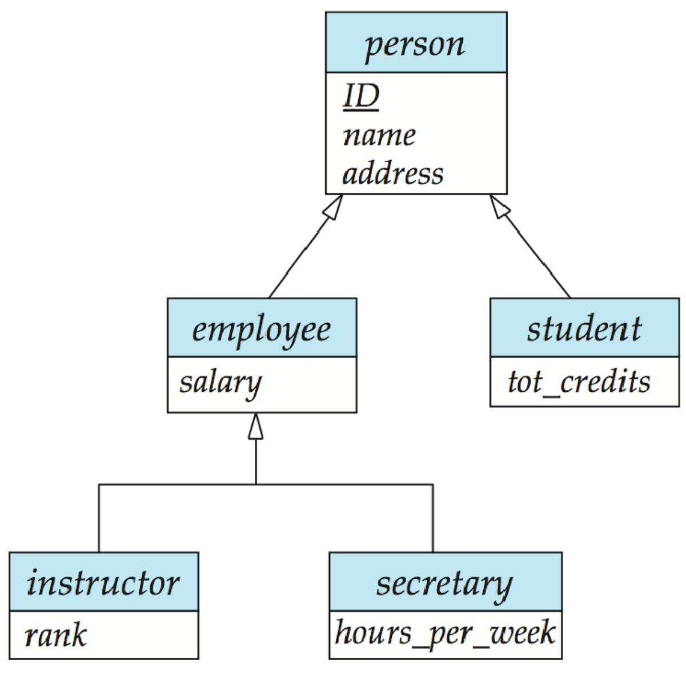

### **7.8.2 概化**

实体集间包含相同的属性可以通过**概化**来表达，概化是高层实体集与一个或多个实体集间的包含关系 

高层与低层实体集也可以分别称作**超类**和**子类**

**概化**本质上是**特化**的逆过程

### **7.8.3 属性继承**

由特化和概化所产生的高层和低层实体的一个重要特性是**属性继承**

- 高层实体集所具有的属性和联系适用于它的所有低层实体集
- 低层实体集所具有的独有特征仅适用于特定的低层实体集

### **7.8.4 特化/概化上的约束**

#### **完全性约束**:

- **全部概化**或**特化**：每个高层实体必须属于一个低层实体集 
- **部分概化**或**特化**：一些高层实体不属于任何低层实体集

### **7.8.5 聚集**

E-R模型的一个局限性在于它不能表达联系间的联系

**聚集**是一种抽象,通过这种抽象,联系被视为高层实体

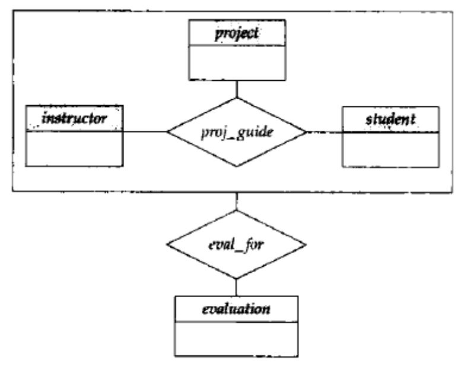

## 7.9 实体-联系设计问题

### 7.9.1 E-R图的常见错误

1. 使用一个实体集的主码作为另一个实体集的属性，但应该用联系来表达这一信息
2. 将相关实体集的主码属性作为联系集的属性。因为在联系集中以及隐含了这些主码属性
3. 在需要多值属性的情况下，采用了具有单值属性的联系

### 7.9.2 **用实体集还是用属性**

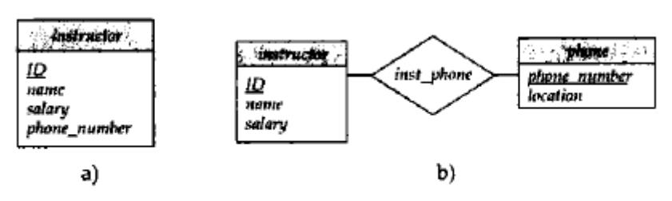

如图，若把phone_number作为Instructor的属性，则暗示每个老师恰好有1个电话号码

若把电话作为一个另外的phone实体，则说明每个老师可以由若干个（$\geq 0$个）电话号码。（具体见前文多值属性的关系模式表示）

### **7.9.3 用实体集还是用联系集**

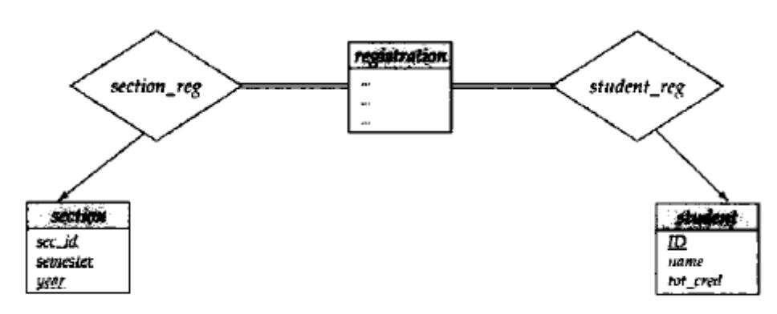

指导原则：当描述发生在实体间的行为时采用联系集

### **7.9.4 二元还是n元联系集**

数据库中的联系通常都是二元的,一些看来非二元的联系也可以用多个二元联系表示

# **第八章 关系数据库设计**

## **8.1 好的关系设计的特点**

### 8.1.1 分解

避免一个模式中信息重复问题的唯一方式是将其分解为两个模式

如果分解后有信息丢失，则称为**有损分解**

如果没有信息丢失，则称为**无损分解**

一个有损分解如下图所示，分解完再自然连接后，得到的结果比原来更多了，说明这个分解丢失了部分信息，导致无法还原回去。

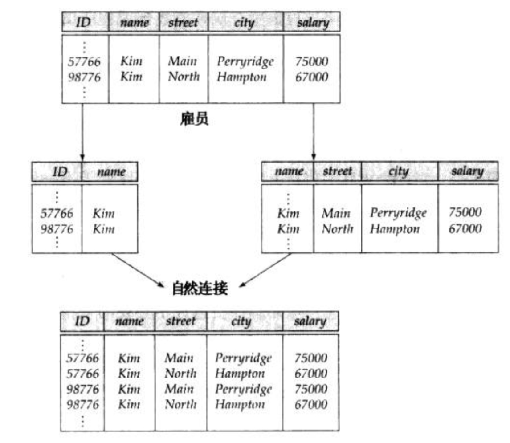

## **8.2 使用函数依赖进行分解**

### 8.2.1 符号惯例

属性集: $\alpha$

关系模式：r(R) 该模式是关系r的，R是属性集

超码：K

一个关系模式是一个属性集,但是并非所有的属性集都是模式

### **8.2.2 码和函数依赖**

一个关系的满足所有这种现实世界约束的实例,称为关系的**合法实例**

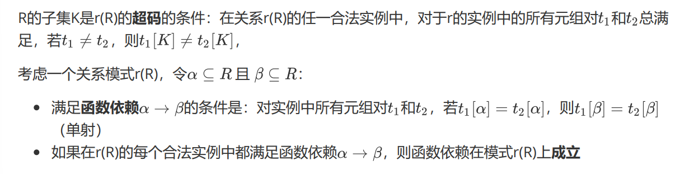

两种方式使用函数依赖:

- 判定关系的实例是否满足给定函数依赖集F

- 说明合法关系集上的约束

在下图的例子中，函数依赖$A \rightarrow C$ 是满足的，但$D \rightarrow A$是不满足的

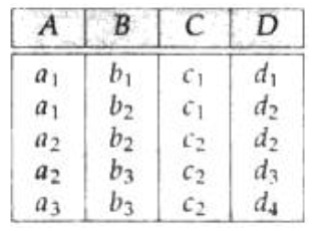

有些函数依赖被称为是**平凡的**，因为它被所有关系满足。

例如：$A \rightarrow A$被包含属性$A$​​的所有关系满足。如果 $\beta \subseteq \alpha$,则函数依赖$\alpha \rightarrow \beta$是平凡的。

符号$F^{+}$表示 $F$ 集合的**闭包**，表示 $F$ 集合推导出的所有函数依赖的集合

### 8.2.3 无损分解与函数依赖的关系

$R_1$和$R_2$构成 $R$ 的一个无损分解的条件是：

以下函数依赖中至少一个是在$F^{+}$中：

- $R_1 \cap R_2 \rightarrow R_1$
- $R_1 \cap R_2 \rightarrow R_2$

换句话说，如果$R_1 \cap R_2$构成$R_1$的超码或者构成$R_2$的超码，则$R$的分解就是一个无损分解。

## 8.3 范式

范式之间的关系：
$$
1NF \supset 2NF \supset 3NF \supset BCNF \supset 4NF \supset 5NF   
$$

### **8.3.1 Boyce-Codd 范式(BCNF)**

BCNF消除了基于函数依赖能够发现的所有冗余，但是可能还保留其他类型的冗余。

#### 8.3.1.1 定义

关于函数依赖集$F$的关系模式$R$属于BCNF的条件是:

对于$F^{+}$中所有形如$\alpha \rightarrow \beta$的函数依赖（其中$\alpha \subseteq R$且$\beta \subseteq R$​）

以下至少一项成立：

- $\alpha \rightarrow \beta$ 是平凡的函数依赖（即$\beta \subseteq \alpha$）
- $\alpha$ 是模式$R$ 的一个超码

一个数据库属于BCNF的条件是：构成该设计的关系模式集中的每个模式都属于BCNF

#### 8.3.1.2 非BCNF模式转换为BCNF的分解规则

由于模式R不是BCNF，说明至少存在一个非平凡的函数依赖$\alpha \rightarrow \beta$，使得$\alpha$不是$R$的超码。

使用以下两个模式去取代$R$:

- $(\alpha \cup \beta)$
- $(R-(\beta - \alpha))$​

> [!CAUTION]
>
> BCNF设计是非依赖保持的，
>
> 而3NF是依赖保持的

### 8.3.2 第三范式

具有函数依赖集F的关系模式R属于**第三范式**的条件是：

对于$F^{+}$中所有形如$\alpha \rightarrow \beta$的函数依赖（其中$\alpha \subseteq R$且$\beta \subseteq R$）,以下至少一项成立：

- $\alpha \rightarrow \beta$ 是平凡的函数依赖（即$\beta \subseteq \alpha$）
- $\alpha$ 是模式$R$ 的一个超码
- $\beta - \alpha$中的每个属性A都包含于R的一个候选码中(可以包含于不同的 **候选码)** 

注意：任何满足BCNF的模式也满足3NF

## **8.4 函数依赖理论**

### **8.4.1 函数依赖集的闭包**

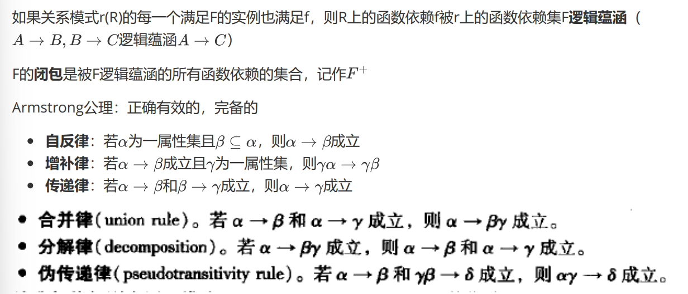

#### 关键计算：计算函数依赖集的闭包

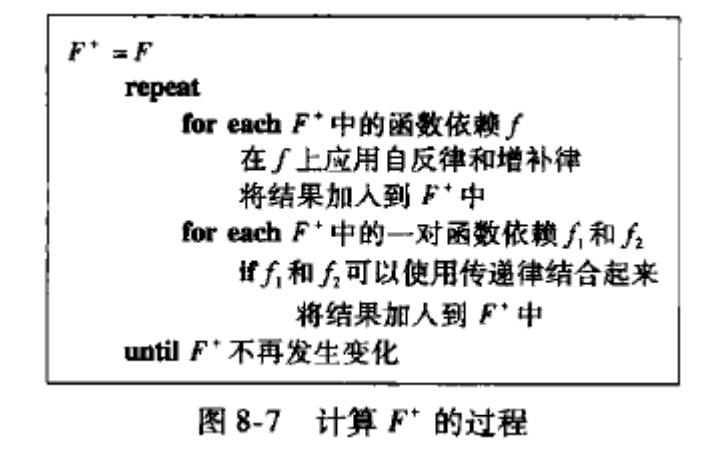

### **8.4.2 属性集的闭包**

如果$\alpha \rightarrow \beta$ ,我们称属性B被$\alpha$ **函数决定**

令 $\alpha$ 为一个属性集，将函数依赖集$F$下被$\alpha$ 函数决定的所有属性的集合称为 $F$ 下 $\alpha$ 的闭包,记为$\alpha^{+}$​

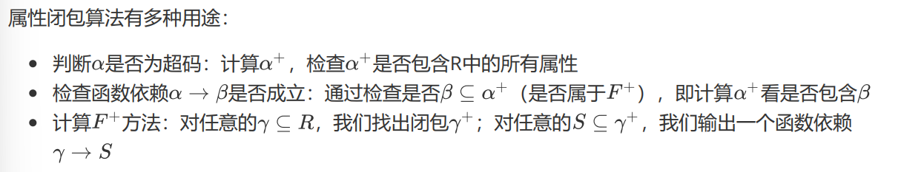

#### 关键计算：计算属性集的闭包!

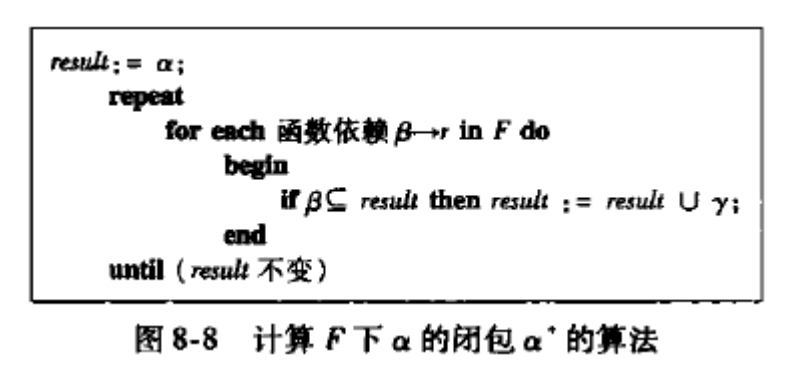

> 例题：给定一个关系模式$r(A,B,C,G,H,I)$及函数依赖集$F=\{A \rightarrow B,A \rightarrow C,CG \rightarrow H, CG \rightarrow  I, B \rightarrow H\}$
>
> 求$(AG)^{+}$

初始$result=AG$

因为$A \rightarrow B$, 所以将$B$加入result，得到$result=ABG$

因为$A \rightarrow C$,所以将$C$加入result，得到$result=ABCG$

因为$CG \rightarrow H$,所以将$H$加入result，得到$result=ABCGH$

因为$CG \rightarrow I$,所以将$I$加入result，得到$result=ABCGHI$

之后，没有新的属性被加入result中，所以算法终止。

#### 关键计算：判断属性集是否是候选码!

> 上述例题中发现$(AG)^{+} = ABCGHI$包含了$R$中所有属性，所以$AG$是超码。
>
> 进一步探究$AG$是不是候选码（最小超码）？

思路：

1. 先证明$AG$是超码
2. 再证明$A,G$分别都不是超码。
   - 若$A,G$分别都不是超码，则说明$AG$是最小超码，即候选码
   - 否则，$AG$不是候选码

### 8.4.3 正则覆盖

#### 8.4.3.1 无关属性

如果去除函数依赖中的一个属性不改变该函数依赖集的闭包,则称该属性是**无关的**

**无关属性**的形式化定义如下：

考虑函数依赖集F及F中的函数依赖$\alpha \rightarrow \beta$

- **从左侧移除**：如果$A\in \alpha$ 并且$F \rightarrow (F-\{\alpha\rightarrow  \beta\}) \cup \{ (\alpha -A) \rightarrow \beta\}$，则属性$A$在$\alpha$中是无关的
- **从右侧移除**：如果$A\in \beta$ 并且函数依赖集$(F-\{\alpha\rightarrow  \beta\}) \cup \{\alpha \rightarrow (\beta-A) \} \rightarrow F$，则属性$A$在$\beta$中是无关的

##### 关键计算：检验属性是否是无关的!

有效检验一个属性是否无关的方法：

考虑函数依赖 $\alpha \rightarrow \beta$ 中的一个属性$A$:

- 如果 $A \in \beta$，为了检验$A$是否是无关的，考虑集合 $F' = (F-\{\alpha\rightarrow  \beta\}) \cup \{\alpha \rightarrow (\beta-A) \}$，检验$\alpha \rightarrow A$是否能够由$F'$推出。为此，计算$F'$下$\alpha$的闭包$\alpha^{+}$，如果$\alpha^{+}$包含$A$，则$A$在$\beta$中是无关的，可以将$A$从右侧移除。
- 如果 $A \in \alpha$，为了检验$A$是否是无关的，令 $\gamma = \alpha - \{ A \}$，检查$\gamma \rightarrow \beta$ 是否可以由 $F$ 推出。为此，计算$F$下$\gamma$的闭包$\gamma^{+}$，如果$\gamma^{+}$包含$\beta$中所有属性，则$A$在$\alpha$中是无关的，可以将$A$从左侧移除。

> [!TIP]
>
> 简而言之（用我个人的话来讲）：
>
> 函数依赖集$F' = (F-\{\alpha\rightarrow  \beta\}) \cup \{\alpha \rightarrow (\beta-A) \}$就是在函数依赖 $\alpha \rightarrow \beta$ 右侧移除了$A$后的函数依赖集。
>
> 如果要想在**右侧移除**$A$，则计算$F'$下$\alpha$的闭包$\alpha^{+}$
>
> 如果$\alpha^{+}$包含$A$，则$A$在$\beta$中是无关的，可以将$A$​从右侧移除。
>
> 
>
> 函数依赖$\gamma \rightarrow \beta$ 就是在函数依赖 $\alpha \rightarrow \beta$ 左侧移除了$A$后的函数依赖。
>
> 如果要想在**左侧移除**$A$，则计算$F$下$\gamma$的闭包$\gamma^{+}$
>
> 如果$\gamma^{+}$包含$\beta$中所有属性，则$A$在$\alpha$中是无关的，可以将$A$从左侧移除。

> 例题：
>
> 假设$F$包含$AB \rightarrow CD, A \rightarrow E, E \rightarrow C$. 
>
> 检验$C$在$AB \rightarrow CD$中是否是无关的?

只需要检验 $F' =  \{AB \rightarrow D, A \rightarrow E, E \rightarrow C \}$下$AB$的属性闭包是否包含属性$C$​

#### 8.4.3.2 正则覆盖

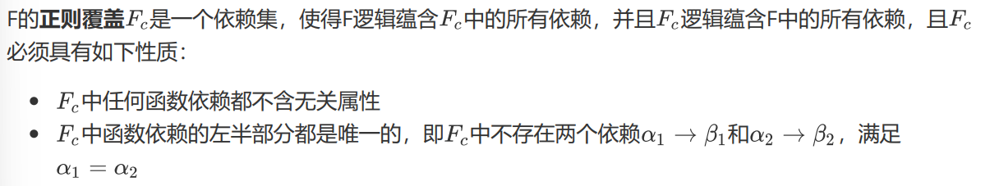

##### 关键计算：计算正则覆盖!

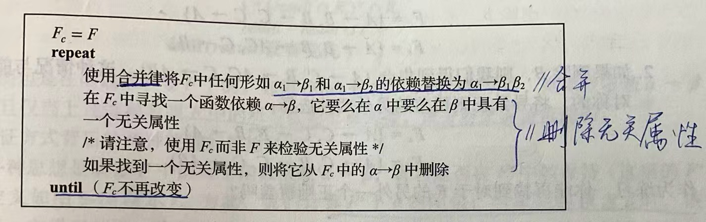

> [!CAUTION]
>
> 注意：函数依赖集的正则覆盖**可能不唯一**

> 例题：
>
> 假设在模式$(A,B,C)$上给定函数依赖集$F=\{A \rightarrow BC, B \rightarrow C, A \rightarrow B, AB \rightarrow C\}$
>
> 求$F$的一个正则覆盖$F_c$​

初始化：$F_c = F$

发现存在两个**函数依赖的左侧** 有**相同**的属性集
$$
A \rightarrow BC \\
A \rightarrow B
$$
所以合并为
$$
A \rightarrow BC
$$
这时，$F_c = \{A \rightarrow BC, B \rightarrow C, AB \rightarrow C\}$

然后，发现$C$在$A \rightarrow BC$中是无关的，移除$C$后得到$A \rightarrow B$​。这时，$F_c = \{A \rightarrow B, B \rightarrow C, AB \rightarrow C\}$

又发现$A$在$AB \rightarrow C$中是无关的，移除$A$后得到$B \rightarrow C$

最后，正则覆盖$F_c$为
$$
A \rightarrow B \\
B \rightarrow C
$$

### 8.4.4 保持依赖

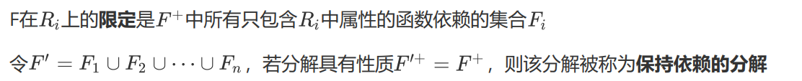

验证方法1：

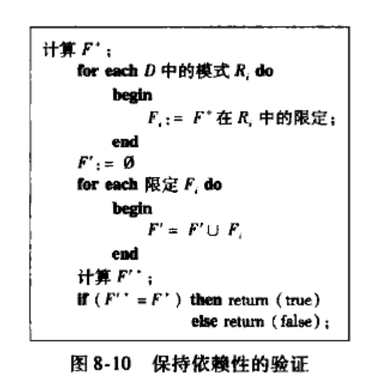

验证方法2：对$F$中的每一个函数依赖$\alpha \rightarrow \beta$ 都使用下面的过程

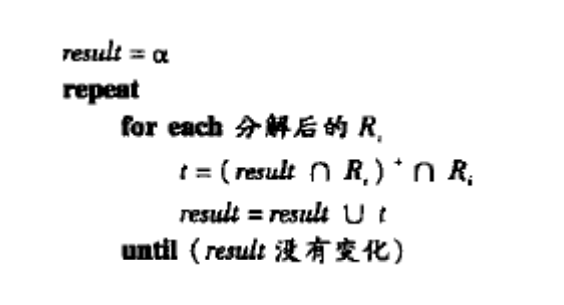

如果result中包含了$\beta$中的所有属性，则函数依赖$\alpha \rightarrow \beta$ 被保持

## 8.5 使用函数依赖的分解算法

### **8.5.1 BCNF分解**

#### 8.5.1.1 BCNF 的检测方法!

方法一：

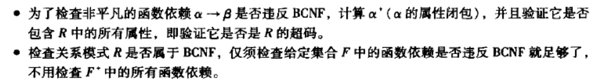

方法二：

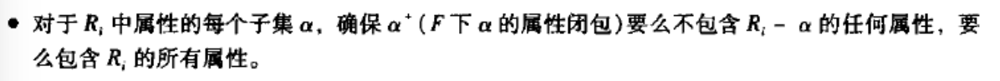

换句话说，$\alpha^{+}$只能包含$\alpha$本身，或者包含$R_i$中的全部属性，否则就不是BCNF。

#### 8.5.1.2 BCNF 分解算法!

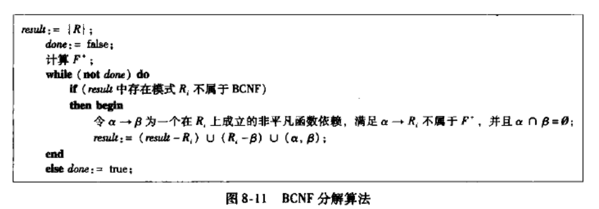

> [!CAUTION]
>
> 注意：BCNF分解算法需要考虑$F^{+}$ （可以不用计算出来，因为太大了，但是一定要记得考虑！）

例题：

### 8.5.2 3NF分解

#### 关键计算：3NF分解算法!

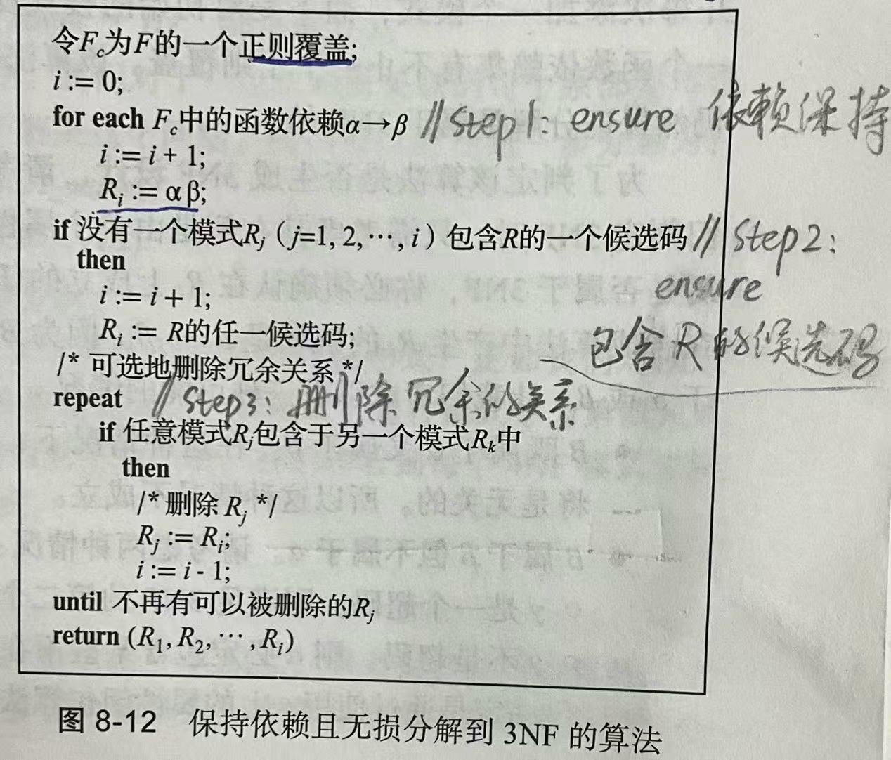

> [!CAUTION]
>
> 3NF分解需要先求 $F$ 的正则覆盖 $F_c$

#### BCNF分解与3NF分解的对比

BCNF分解：无损，但不是依赖保持的

3NF分解：无损，且是依赖保持的

## 8.6 使用多值依赖的分解

### 8.6.1 多值依赖

令r(R)为一关系模式,并令$\alpha \subseteq R$ 且 $\beta \subseteq R$ .

**多值依赖**$\alpha \twoheadrightarrow \beta $ 在R上成立的条件是:

在关系r(R)的任意合法实例中,对于r中任意一对满足 $t_1[\alpha] = t_2[\alpha]$的元组对 $t_1$和 $t_2$ ,r中都存在元组$t_3$ 和$t_4$ ,使得
$$t_1[\alpha] = t_2[\alpha] = t_3[\alpha] = t_4[\alpha]$$

$$t_3[\beta] = t_1[\beta]$$

$$t_3[R - \beta] = t_2[R - \beta]$$

$$t_4[\beta] = t_2[\beta]$$

$$t_4[R - \beta] = t_1[R - \beta]$$​

用表格表示

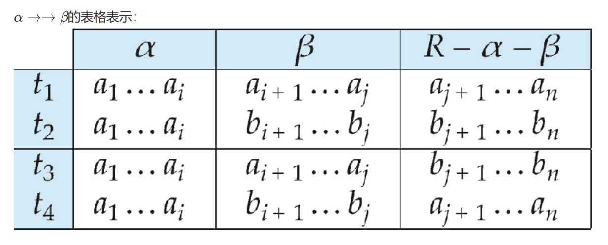

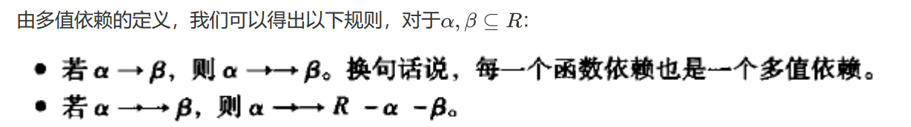

### 8.6.2 第四范式

一个关系模式$R$是关于一个函数依赖和多值依赖集合$D$的第四范式的条件是：

对于$D^{+}$中所有形如$\alpha \twoheadrightarrow \beta $的多值依赖（其中$\alpha \subseteq R$ 且 $\beta \subseteq R$ ），至少有如下之一成立：

- $\alpha \twoheadrightarrow \beta $是一个平凡的多值依赖
- $\alpha$是$R$的一个超码
