# 第三部分 数据存储和查询

[TOC]

# **第十章 存储和文件结构**

## **10.1 物理存储介质概述**

- 高速缓冲存储器 (cache)：贵
- 主存储器 (main memory)：断电容易丢
- 快闪存储器 (flash memory)：非易失性

- 磁盘存储器 (磁盘)：长期存储数据

- 光学存储器 (光盘)

- 磁带存储器

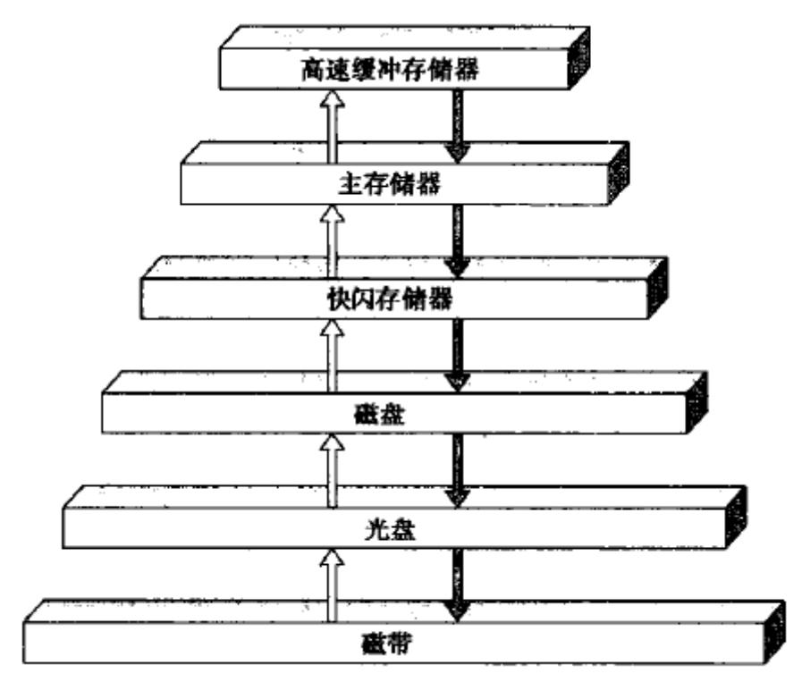

## **10.2 磁盘和快闪存储器**

### **10.2.2 磁盘性能的度量**

- 访问时间：发出读写请求到数据开始传输之间的时间

- 寻道时间：磁盘臂重定位的时间

- 旋转等待时间：等待访问的扇区出现在读写头下所花费的时间

- 数据传输率：磁盘获取数据或者向磁盘存储数据的速率

- 平均故障时间：磁盘可靠性的度量标准

## **10.5 文件组织**

一个**文件**在逻辑上组织成为记录的一个序列

每个文件分成定长的存储单元,称为**块**

### **10.5.1 定长记录**

在文件开始处,分配一定数量的字节作为**文件头**,包含有关文件的各种信息 被删除的记录形成链表,被称为**空闲链表**

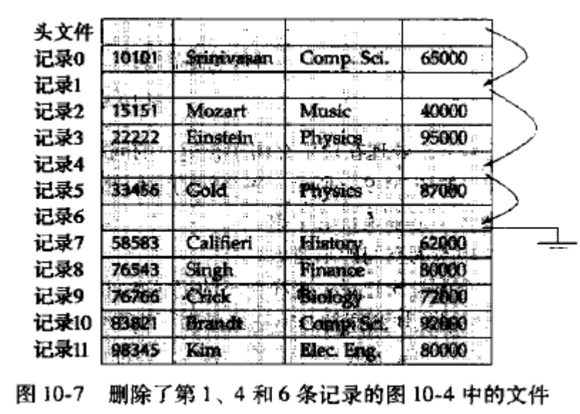

### **10.5.2 变长记录**

变长记录有两个部分：

- 初始部分是定长属性
- 后面是变长属性

对于定长属性,存储它们的值所需的字节数

对于变长属性,在记录的初始部分中表示为一个对 ***(偏移量,长度)*** 值

**空位图**：用来表示记录的哪个属性是空值

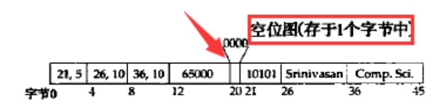

**分槽的页结构**,一般用于在块中组织记录,包含以下信息：

- 块头中记录项的个数
- 块中空闲空间的末尾处
- 一个由包含记录位置和大小的记录条目组成的数组

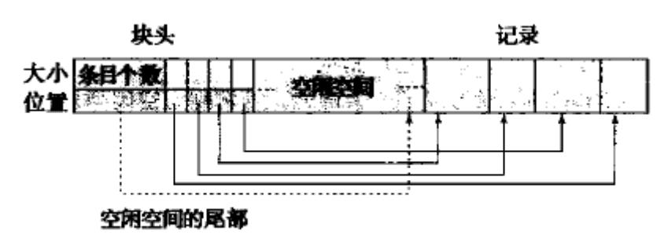

实际记录从块的尾部开始连续 排列,块中的空闲空间是连续的

## **10.6 文件中记录的组织**

- 堆文件组织：一条记录可以放在文件中的任何地方
- 顺序文件组织：记录根据"搜索码"的值顺序存储
- 多表聚簇文件组织：一种在每一块中存储两个或者更多个关系的相关记录的文件结构
- $B^{+}$树文件组织
- 散列文件组织：散列函数的结果去定了记录应该放到文件的哪个块中

### 10.6.2 顺序文件组织

**顺序文件**按某个搜索码的顺序排序

**搜索码**是任何一个属性或者属性的集合

## **10.7 数据字典存储**

**元数据**：关于数据的数据(如关系的模式)

元数据存储在称为**数据字典**或**系统目录**中的结构中

系统必须存储的信息类型有：

## 10.8 数据库缓冲

缓冲区替换策略：

- LRU，最近最少使用

- MRU，最近最常使用

##### MRU优于LRU的例子：

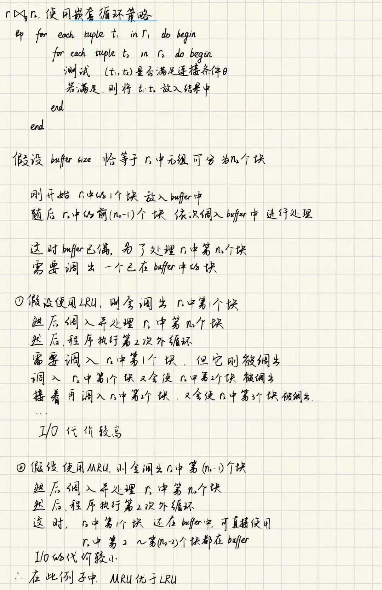

##### LRU优于MRU的例子：

# **第十一章 索引与散列**

## **11.1 基本概念**

两种基本索引类型：

- **顺序索引**：基于值的顺序排序

- **散列索引**：基于将值平均分布到若干散列桶中,一个值所属的散列桶是由一个函数决定的,这个函 数称为散列函数

对每种技术的评价基于以下因素：

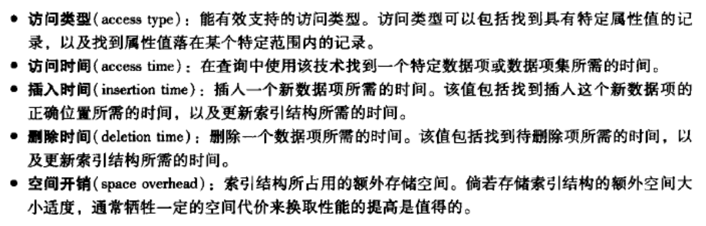

> **搜索码**：
>
> 用于在文件中查找记录的属性或属性集称为**搜索码**。
>
> 通俗的说，搜索码就是搜索数据库内容时用的，通常就是索引

## 11.2 顺序索引

关键概念：

> **聚集索引**：
>
> 如果 ***文件按照某个搜索码指定的顺序排序***，那么该搜索码对应的索引称为**聚集索引**,也称为**主索引**
>
> **非聚集索引**：
>
> ***搜索码制定的顺序与文件中记录的物理顺序不同*** 的索引称为**非聚集索引**或**辅助索引**
>
> **索引顺序文件**：
>
> 搜索码上有聚集索引的文件

小结：

聚集索引=主索引：文件的物理顺序与某个搜索码的顺序**相同**

非聚集索引=辅助索引：文件的物理顺序与某个搜索码的顺序**不同**

### 11.2.1 稠密索引和稀疏索引

**索引项**或**索引记录**由一个**搜索码值和指向具有该搜索码的一条或多条记录的指针**构成

其实就是外部的指针,可以快速的找到对应搜索码值的记录。

可以使用的顺序索引有2类：

- 稠密索引
- 稀疏索引

> **稠密索引**：
>
> 在稠密索引中，文件中的**每个搜索码值都有一个索引项**
>
> **稀疏索引**：
>
> 在稀疏索引中，只为**某些搜索码值**建立索引项
>
> 使用前提：关系按照搜索码的顺序存储（也就是聚集索引）

> [!CAUTION]
>
> 只有索引是聚集索引（主索引）时，才使用稀疏索引！
>
> **非聚集索引（辅助索引）不适合稀疏索引**，也就是说：非聚集索引（辅助索引）只能使用稠密索引！

#### 优缺点比较：

|                | 稠密索引   | 稀疏索引   |
| -------------- | ---------- | ---------- |
| 定位记录的速度 | 快（优点） | 慢（缺点） |
| 占用空间       | 多（缺点） | 少（优点） |

### **11.2.2 多级索引**

具有两级或两级以上的索引称为**多级**索引

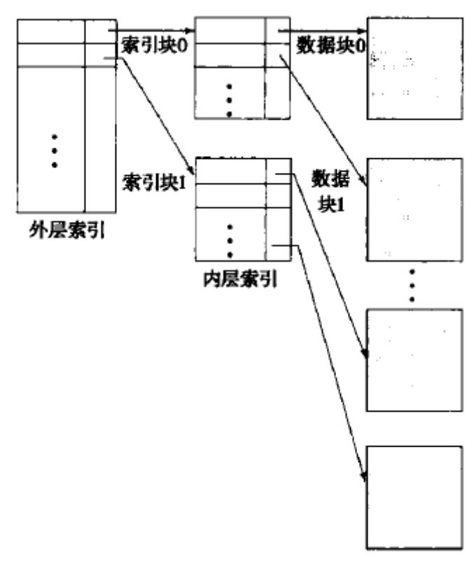

### **11.2.3 索引的更新**

每当文件有记录更新时，索引都需要更新

#### 11.2.3.1 插入

系统首先用出现在待插入记录中的搜索码值进行查找，并根据索引是稠密索引还是稀疏索引而进行下一个操作。

##### 稠密索引：

1. 如果该搜索码值不在索引中,系统就在索引中合适的位置插入具有该搜索码值的索引项。
2. 否则进行如下操作：
   - a. 如果索引项存储的是指向具有相同搜索码值的所有记录的指针,系统就在索引项中增加一个指向新记录的指针。
   - b. 否则,索引项存储一个仅指向具有相同搜索码值的第一条记录的指针,系统把待插入的记录放到具有相同搜索码值的其他记录之后。

##### 稀疏索引：

我们假设索引为每个块保存一个索引项。如果系统创建一个新的块,它会将新块中出现的第一个搜索码值(按照搜索码的顺序)插入到索引中。另一方面,如果这条新插入的记录含有块中的最小搜索码值,那么系统就更新指向该块的索引项;否则,系统对索引不做任何改动。

#### 11.2.3.2 删除

为删除一条记录,系统首先查找要删除的记录,然后下一步的操作取决于索引是稠密索引还是稀疏索引

##### 稠密索引：

1. 如果被删除的记录是具有这个特定搜索码值的唯一的一条记录,系统就从索引中删除相应的索引项。

2. 否则采取如下操作：

   a. 如果索引项存储的是指向所有具有相同搜索码值的记录的指针,系统就从索引项中删除指向被删除记录的指针。

   b. 否则,索引项存储的是指向具有该搜索码值的第一条记录的指针。在这种情况下,如果被删除的记录是具有该搜索码值的第一条记录,系统就更新索引项,使其指向下一条记录。

##### 稀疏索引：

1. 如果索引不包含具有被删除记录搜索码值的索引项,则索引不必做任何修改。

2. 否则系统采取如下操作：

   a. 如果被删除的记录是具有该搜索码值的唯一记录,系统用下一个搜索码值(按搜索码顺序)的索引记录替换相应的索引记录。如果下一个搜索码值已经有一个索引项,则删除而不是替换该索引项。

   b. 否则,如果该搜索码值的索引记录指向被删除的记录,系统就更新索引项,使其指向 且有相同搜索码值的下一各记录。

### 11.2.4 辅助索引

辅助索引必须是稠密索引,对每个搜索码值都有一个索引项

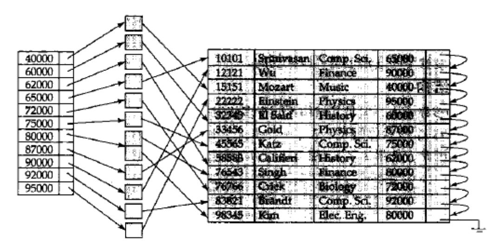

## 11.3 $B^{+}$​树索引文件

> [!CAUTION]
>
> B+ 树是一种索引结构，**本身不决定稀疏或稠密，也不决定是否聚集**。
>
> 在实际数据库中，B+ 树常用于：
>
> - 聚集索引 → 稀疏索引
> - 非聚集索引 → 稠密索引

$B^{+}$树索引是一种**多级索引**。

假设没有重复的搜索码值。

### 11.3.1  $B^{+}$树的结构

##### 典型的$B^{+}$​树节点：

最多包含 $n-1$个搜索码值$K_1,K_2,\cdots,K_{n-1}$，以及$n$个指针$P_1,P_2,\cdots,P_{n-1},P_{n}$

| $P_1$ | $K_1$ | $P_2$ | ...  | $P_{n-1}$ | $K_{n-1}$ | $P_n$ |
| ----- | ----- | ----- | ---- | --------- | --------- | ----- |

##### 叶节点：

叶节点的结构如下图所示。

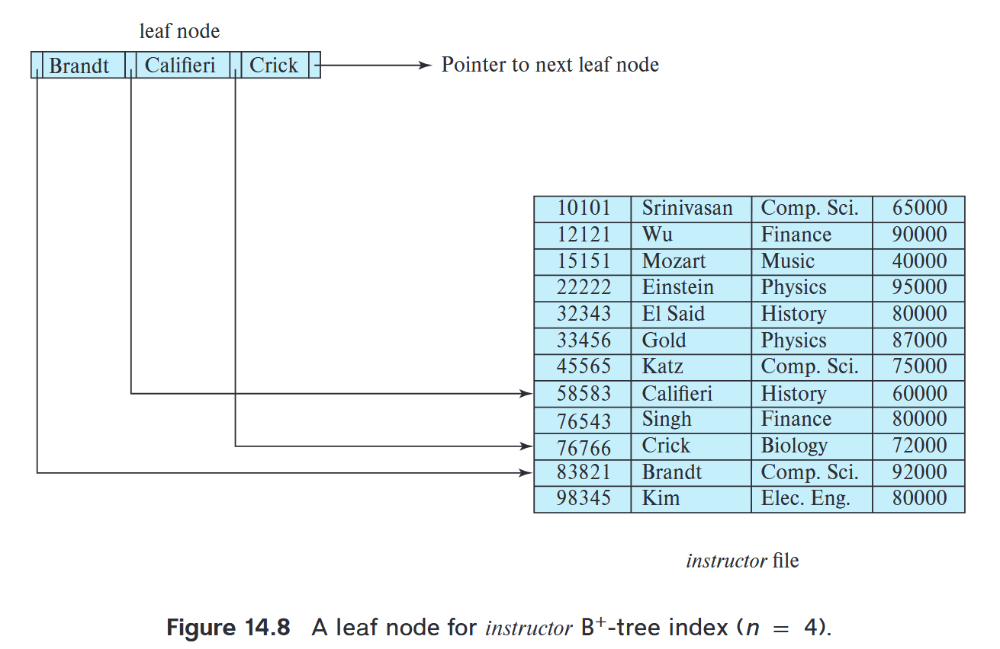

叶节点中，搜索码值个数要求：

- 每个叶节点最多有 $n-1$个搜索码值$K_1,K_2,\cdots,K_{n-1}$
- 最少含有$\lceil (n-1)/2 \rceil$个搜索码值

对于上述例子，$n=4$​，所以叶节点的搜索码值个数最多为3，最少为2

##### 非叶节点（内部节点）：

非叶节点的结构与叶节点相同。

非叶节点中，指针个数要求：

- 每个叶节点最多有 $n$个指针
- 最少含有$\lceil n/2 \rceil$个指针

对于上述例子，$n=4$​​，所以非叶节点的指针个数最多为4，最少为2

##### 根节点：

若根节点不是叶节点，则：

**最多**：有n个指针，$n-1$个搜索码值（索引项）

**最少**：有2个指针，1个搜索码值（索引项）

####  $B^{+}$树的特点：

 **平衡**：从根到叶节点的每条路径的长度都相同

正是因为 $B^{+}$树的这一平衡性质，保证了对于查找、插入和修改的良好性能。

### 11.3.2 $B^{+}$​树的查询

#### 普通查询

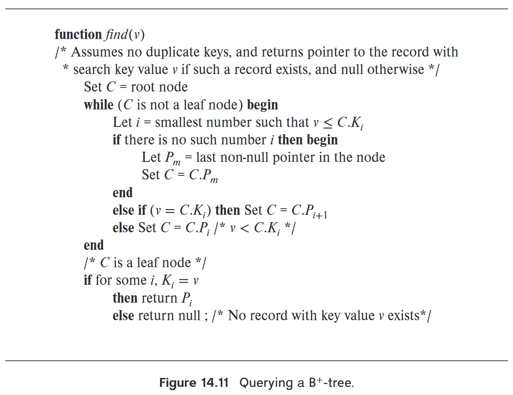

用简单的话来说，开始时以根节点为当前节点。

重复以下步骤直至到达一个叶节点。

1. 检查当前节点，查找最小的$i$使得搜索码值$K_i\geq v$​
2. 若$K_i = v$，则将当前节点置为由$P_{i+1}$指向的节点；否则若$K_i > v$，则将当前节点置为由$P_{i}$指向的节点。
3. 若没有使得$K_i\geq v$的$K$值，则$v > K_{m-1}$,其中$P_m$是节点中的最后一个非空指针，然后将当前节点置为由$P_m$指向的节点。
4. 重复上述步骤，向下遍历树，直至到达叶节点为止。

​	在叶节点处，若存在$K_i=v$的搜索码值，则沿着指针$P_i$找到对应的记录并返回；若不存在等于$v$的搜索码值，则说明该关系中不存在具有码值为$v$的记录。

#### 范围查询

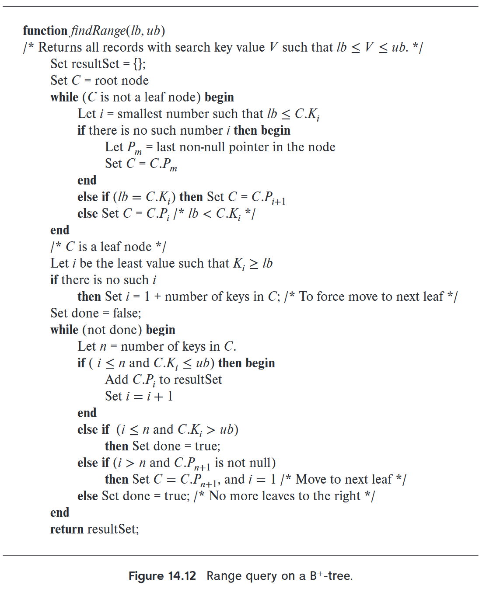

用简单的话来说：

先以类似于$find(lb)$的方式遍历至一个叶节点，

然后遍历该叶节点及其随后的叶节点中的记录，收集满足$lb \leq K_i \leq ub$ 的搜索码值对应的指针，放入resultSet结果集。

当$K_i > ub$ 或者树中没有更多码时，此过程停止。

### 11.3.3  $B^{+}$树的更新

这部分比较复杂，三言两语难以讲清，看书，略

## **11.5 多码访问**

### **11.5.1 使用多个单码索引**

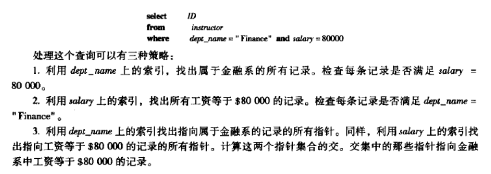

### **11.5.2 多码索引**

在复合的搜索码上建立和使用索引

### **11.5.3 覆盖索引**

**覆盖索引**存储一些属性(但不是搜索码属性)的值以及指向记录的指针

## 11.6 静态散列

基于散列技术的文件组织使我们能够避免访问索引结构

**桶**：表示能存储一条或多条记录的一个存储单位

**散列文件组织**中,我们通过计算所需记录搜索码值上的一个函数直接获得包含该记录磁盘快地址

**散列索引组织**中,我们把搜索码以及与它们相关联的指针组织成一个散列文件结构

### **11.6.1 散列函数**

我们希望搜索码值分配到桶中并且具有以下分布特性的散列函数：分布是均匀的、随机的

### **11.6.2 桶溢出处理**

如果桶没有足够的空间,就会发生**桶溢出**,有以下几个可能原因：

- **桶不足**

- **偏斜** (某些桶分配到的记录比其它的桶多)

  偏斜发生的原因：

  - 多条记录可能具有相同的搜索码
  - 所选的散列函数可能会造成搜索码的分布不均

我们用**溢出桶**来处理溢出问题,这种链接列表的溢出处理称为**溢出链**

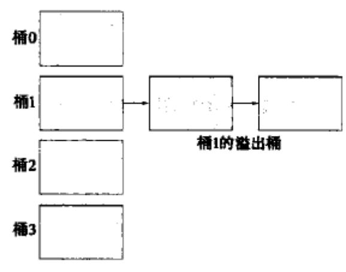

上面这种形式的散列结构称为**闭地址**,下面这种方法称为**开地址**

桶集合是固定的,没有溢出链

当一个桶满了以后,系统将记录插入到其它桶中

该方法在数据库系统不使用,因为删除操作太麻烦

### **11.6.3 散列索引**

**散列索引**将搜索码及其相应的指针组织成散列文件结构。

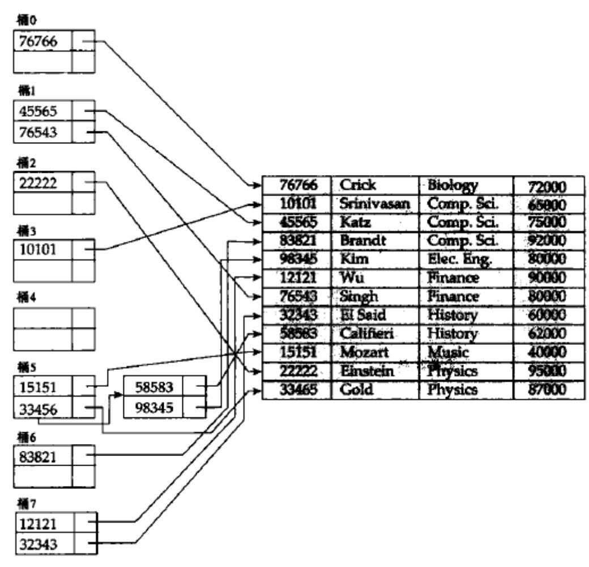

## **11.7 动态散列**

**动态散列**技术允许散列函数动态改变,以适应数据库增大或缩小的需要

### **11.7.1 数据结构**

选择一个具有均匀性和随机性的散列函数h,h可以产生值的范围较大,是b位二进制整数 开始时我们不使用b位,而是使用i位,i会随着文件增长而变化

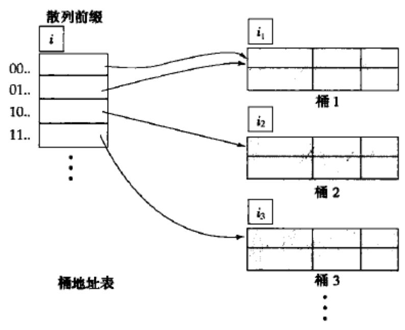

## **11.7.2 查询和更新**

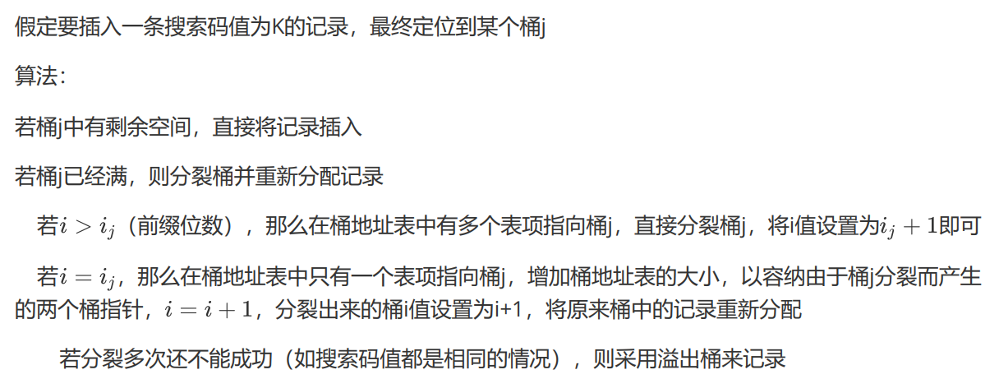

Example：

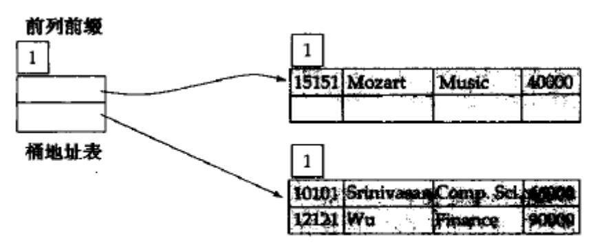

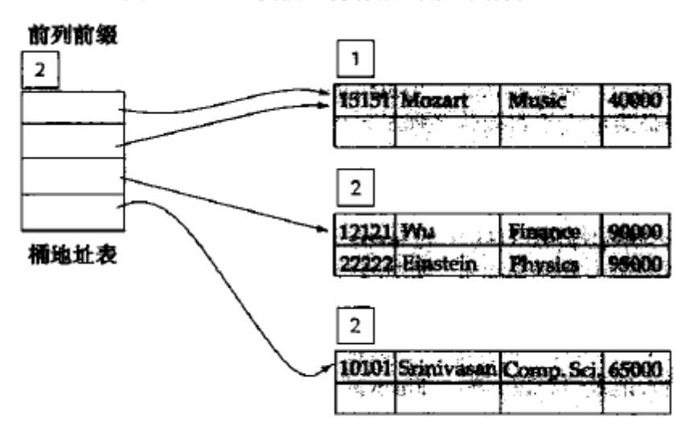

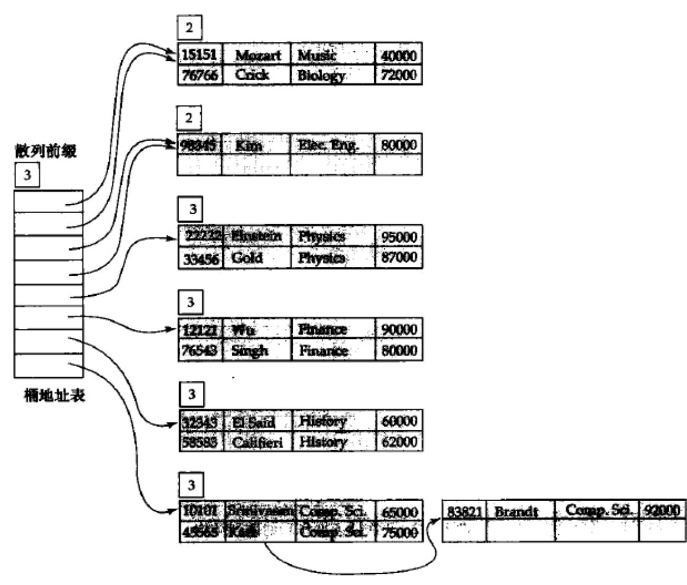

### 11.7.3 静态散列与动态散列比较

#### 可扩充散列

优点：

- 性能不随文件的增长而降低

- 空间开销是最小的,尽管桶地址表带来了额外的开销,但该表较小

缺点：

- 查找涉及一个附加的间接层,对性能有微小的影响

## **11.8 顺序索引和散列的比较**

普通查询，散列更有优势

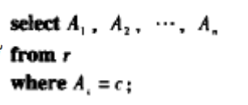

范围查询，顺序索引更可取

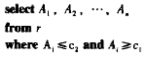

# 第十二章 查询处理

**查询处理**：从数据库中提取数据时涉及的一系列活动

## **12.1 概述**

查询处理步骤如图所示。

基本步骤包括：

- 语法分析与翻译
- 优化
- 执行

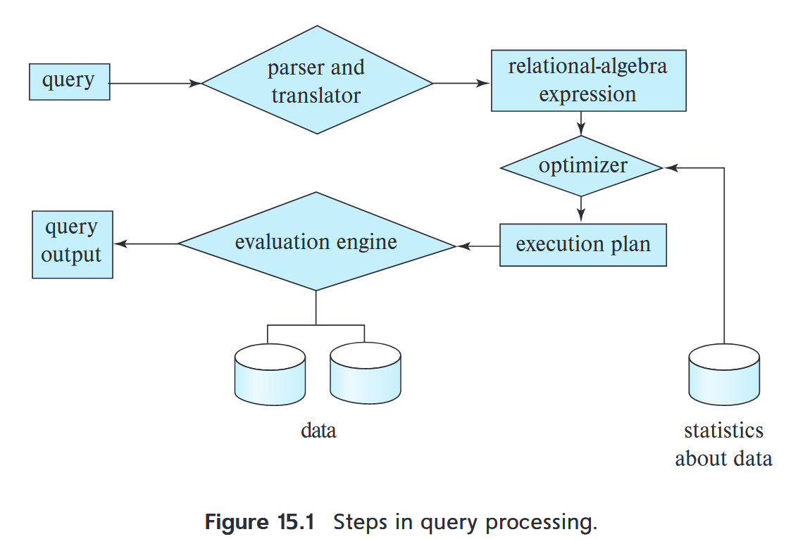

查询处理开始之前,系统必须将查询语句翻译成可使用的形式

给定一个查询，一般会有多种计算结果的方法

**执行原语**：加了"如何执行"注释的关系代数运算

**查询执行计划**：执行一个查询的原语操作序列

**查询执行引擎**：接受一个查询执行计划,执行该计划并把结果返回给查询。

示例：

该查询可以翻译成以下两个关系代数表达式中的任意一个：

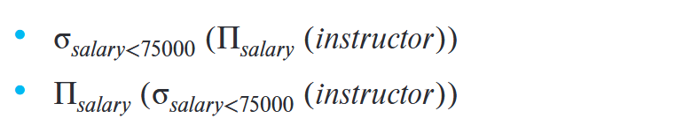

一种查询执行计划如下图所示。

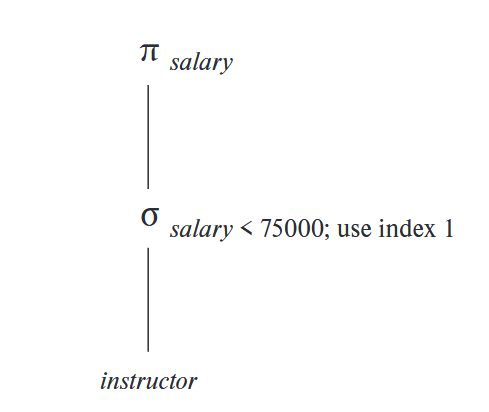

## **12.2 查询代价的度量**

在数据库系统中,最主要的代价是在磁盘上存取数据的代价， 传送磁盘块数 以及 搜索磁盘次数 被用来度量查询执行计划的代价

- 传输一个块的数据平均消耗$t_T$ 秒
- 磁盘块平均访问时间$t_S$秒

显然，一次传输$b$块且执行$S$次磁盘搜索将消耗$b \cdot t_T + S \cdot t_S$秒

一个查询计算计划**响应时间**就是所有的这些开销,并且可以作为计划的代价的度量

## 12.3 选择运算

在查询处理中，**文件扫描**是存取数据最低级的操作

### 12.3.1 使用文件扫描和索引的选择

- **A1(线性搜索)**:系统扫描每一个文件块,对所有记录都进行测试

使用索引的搜索算法称为**索引扫描**

- **A2(主索引,码属性等值比较)**:使用索引检索到满足相应等值条件的唯一一条记录
- **A3(主索引,非码属性等值比较)**:利用主索引检索到多条记录,与A2相比需要取多条记录
- **A4(辅助索引,等值比较)**:
  - 若等值条件是码属性上的,则该策略可检索到唯一一条记录，这种情况下代价与A2相似
  - 若索引字段是非码属性的,则可能检索到多条记录，这种情况下每检索一条记录都需要一次I/O操作(搜索+磁盘块传输)

- (A5, A6不重要不管)

|      | 算法                               | 开销                                       | 原因                                                         |
| ---- | ---------------------------------- | ------------------------------------------ | ------------------------------------------------------------ |
| A1   | 线性搜索                           | $t_S + b_r \cdot t_T$                      | 一次初始搜索加上 $b_r$ 个块传输,  $b_r$ 表示在文件中的块数量 |
| A1   | 线性搜索,码属性等值比较            | 平均情形 $ t_S +(br/2) \cdot t_T$          | 因为最多一条记录满足条件，所以只要找到所需的记录、扫描就可以终止。在最坏的情形下，仍需要 $b_r$ 个块传输 |
| A2   | $B^{+}$树主索引,码属性等值比较     | $(h_i+1) \cdot (t_T+t_S)$                  | （其中 $h_i$  表示索引的高度。）索引查找穿越树的高度,再加上一次I/O来取记录;每个这样的I/O操作需要一次搜索和一次块传输 |
| А3   | $B^{+}$树主索引, 非码属性等值比较  | $h_i \cdot (t_T + t_S) +t_S + b \cdot t_T$ | 树的每层一次搜索,第一个块一次搜索。b 是包含具有指定搜索码记录的块数。假定这些块是顺序存储(因为是主索引)的叶子块并且不需要额外搜索 |
| A4   | $B^{+}$树辅助索引,码 属性等值比较  | $(h_i+1) \cdot (t_T+t_S)$                  | 这种情形和主索引相似                                         |
| A4   | $B^{+}$树辅助索引,非码属性等值比较 | $(h_i+n) \cdot (t_T+t_S)$                  | (其中 n 是所取记录数。) 在这里，索引查找的代价和 A3 相似,但是每条记录可能在不同的块上,这需要每条记录一次搜索。如果 n 值比较大,代价可能会非常高 |
| A5   | $B^{+}$树主索引,比较               | $h_i \cdot (t_T + t_S) +t_S + b \cdot t_T$ | 和 A3, 非码属性等值比较情形一样                              |
| A6   | $B^{+}$树辅助索引, 比较            | $(h_i+n) \cdot (t_T+t_S)$                  | 和 A4, 非码属性等值比较情形一样                              |

## **12.4 排序**

数据排序有重要作用,有两个原因:

1. SQL查询会指明对结果进行排序

2. 当输入的关系已经排序时,关系运算中的一些运算(如连接运算)能够得到高效实现

> **外排序**:
>
> 不能全部放在内存中的关系的排序

### 12.4.1 外部排序-归并算法

$M$表示内存缓冲区中可以用于排序的块数，即内存的缓冲区能容纳的磁盘块数

1. 第一阶段,**建立多个排好序的归并段**，每个归并段都是排序过的,但仅包含关系中的部分记录。

   注意：得到多个归并段之间是无序的，但是每个归并段内是有序的。（***段间无序，段内有序***）

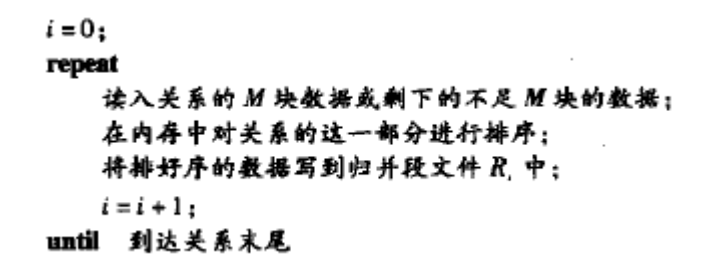

2. 第二阶段,**对归并段进行归并**。假定归并段总数N<M,为N个归并段文件$R_i$各分配一个内存缓冲块,并分别读入一个数据块.

   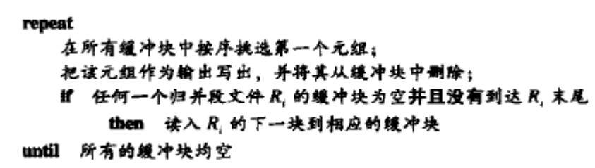

3. 重复第二阶段，直至**只剩下1个**归并段。

该算法对N个归并段进行归并,因此它被称为**N路归并**。

Example: 假设内存大小$M=3$，进行2路归并。$B_r$代表包含关系r中记录的磁盘块数

将内存中2个块作为输入缓冲，1个块作为输出缓冲。

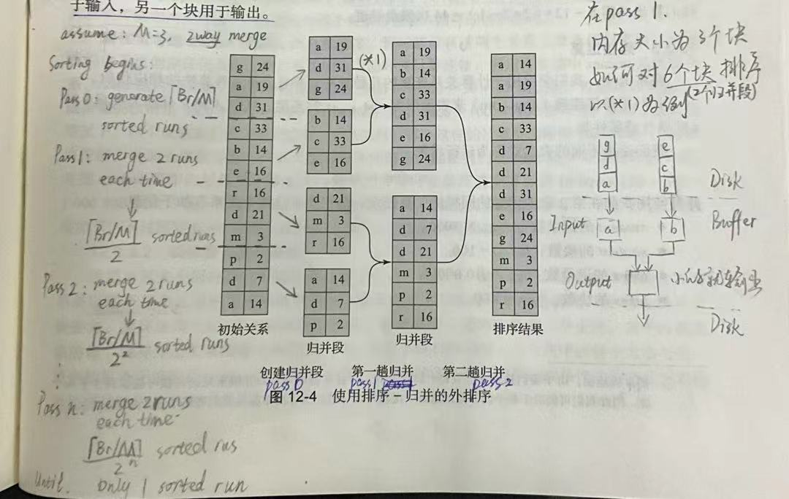

以上是$N<M$​的情况。

假如$N \geq M$，则在内存中，有$M-1$个块作为输入缓冲，剩下1个块作为输出缓冲

总趟数为：$\lceil \log_{M-1} (b_r/M)\rceil+1$

总的块传输次数为：$(2\lceil \log_{M-1} (b_r/M)\rceil+1) \cdot b_r$​

### **12.4.2 外部排序归并的代价分析**

下面讨论一般情况下，外部排序归并的代价。

$b_r$代表包含关系r中记录的磁盘块数，$b_b$是一次读取或写出的块数

#### 磁盘块传输总数!

第一阶段（Pass 0）:

- 磁盘块传输: $2b_r$​ 次（$\because$ 读一次，写一次）
- 得到初始归并段的数量为$\lceil b_r/M \rceil$

第二阶段（Pass 1 及之后）:

- 每一趟最多可以归并$\lfloor M/b_b \rfloor-1$个归并段。（留一个位置作为输出缓冲，所以要$-1$）

- 所需归并趟数: $\lceil \log_{\lfloor M/b_b \rfloor-1} (b_r/M)\rceil$ （计算方法见下方的 Tip）
- 每一趟归并读写各一次
- 最后一趟归并可以产生结果后就用于其他操作，不写入磁盘。所以最后一趟就只计从磁盘读取的块传输次数，不计写入磁盘的次数。
- 所以在第二阶段总共的磁盘块传输次数为：$ b_r(2\lceil \log_{\lfloor M/b_b \rfloor-1} (b_r/M)\rceil-1)$ （$-1$是因为最后一趟不用写入磁盘）

使用磁盘块传输总次数：
$$
2 b_r + b_r(2\lceil \log_{\lfloor M/b_b \rfloor-1} (b_r/M)\rceil -1) =  b_r(2\lceil \log_{\lfloor M/b_b \rfloor-1} (b_r/M)\rceil +1)
$$
回到前面2路归并的例子，

令$b_b=1$,$b_r=12$,$M=3$,可得
$$
\begin{aligned}
 & b_r(2\lceil \log_{\lfloor M/b_b \rfloor-1} (b_r/M)\rceil +1)\\
=\;& 12 \times (2 \times \log_{2}(4)+1)\\
=\;& 60
\end{aligned}
$$

> [!TIP]
>
> 所需归并趟数: $\lceil \log_{\lfloor M/b_b \rfloor-1} (b_r/M)\rceil$ 如何求？
>
> 由上述分析得知，初始归并段的数量为$\lceil b_r/M \rceil$
>
> 因为每一趟最多可以归并$\lfloor M/b_b \rfloor-1$个归并段，所以第一趟归并之后，剩余的归并段数量为
> $$
> \frac{ \lceil b_r/M \rceil}{\lfloor M/b_b \rfloor-1}
> $$
> 第二趟归并之后，剩余的归并段数量为
> $$
> \frac{ \lceil b_r/M \rceil}{\left(\lfloor M/b_b \rfloor-1 \right)^2}
> $$
> 以此类推，第$n$趟归并之后，剩余的归并段数量为
> $$
> \frac{ \lceil b_r/M \rceil}{\left(\lfloor M/b_b \rfloor-1 \right)^n}
> $$
> 算法的终止条件是，最后一趟归并后，剩余的归并段数量为1
>
> 所以令
> $$
> \frac{ \lceil b_r/M \rceil}{\left(\lfloor M/b_b \rfloor-1 \right)^n}=1
> $$
> 即
> $$
> \left(\lfloor M/b_b \rfloor-1 \right)^n =\lceil b_r/M \rceil
> $$
> 两边取对数，可得
> $$
> n=\log_{\lfloor M/b_b \rfloor-1 }(\lceil b_r/M \rceil)
> $$
> 将向上取整符号移到外面，就得到
> $$
> n=\lceil \log_{\lfloor M/b_b \rfloor-1 }( b_r/M ) \rceil
> $$

#### 磁盘寻道总次数!

第一阶段:

- 读取写回归并段：$2\lceil b_r/M \rceil$

第二阶段：

- 每次从一个归并段读取$b_b$块数据，每趟归并需要作$\lceil b_r/b_b \rceil$次磁盘搜索以读取数据
- 写数据同样需要$\lceil b_r/b_b \rceil$次寻道，最后一趟除外（因为假定最终结果不写回磁盘）
- 所以在第二阶段总共的磁盘搜索次数为：$\lceil b_r/b_b \rceil(2\lceil \log_{\lfloor M/b_b\rfloor -1} (b_r/M )\rceil - 1)$

磁盘搜索总次数:
$$
2\lceil b_r/M \rceil + \lceil b_r/b_b \rceil(2\lceil \log_{\lfloor M/b_b\rfloor -1} (b_r/M )\rceil - 1)
$$
回到前面2路归并的例子，

令$b_b=1$,$b_r=12$,$M=3$,可得
$$
\begin{aligned}
& 2\lceil b_r/M \rceil + \lceil b_r/b_b \rceil(2\lceil \log_{\lfloor M/b_b\rfloor -1} (b_r/M )\rceil - 1)\\
=& 2 \times 4 + 12 \times(2 \times \log_2 (4) -1)\\
=& 44
\end{aligned}
$$

## **12.5 连接运算**

**等值连接**:表示形如 $r \bowtie_{r.A=s.B} s$ 的连接,其中A,B分别为r与s的属性或属性组

### **12.5.1 嵌套循环连接**

该算法主要由两个嵌套的for循环构成,因此被称为**嵌套循环连接**

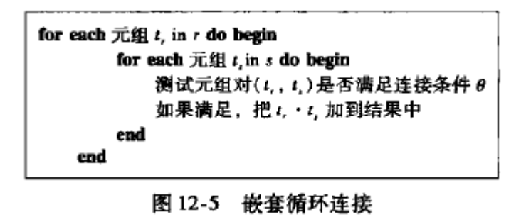

对于 $r \bowtie s$,r被称为连接的**外层关系**,s被称为连接的**内层关系**

- r,s中元组数：$n_r \,,\; n_s$
- 包含关系r,s中元组的磁盘块数：$b_r \,,\; b_s$
- 需要考虑的元组对数目：$n_r \times n_s$
- 对关系r中的每一条记录,我们必须对s作一次完整的扫描

|                                  | 块传输                | 寻道      |
| -------------------------------- | --------------------- | --------- |
| 最坏                             | $n_r \cdot b_s + b_r$ | $n_r+b_r$ |
| 最好（两个关系都能全部放入内存） | $ b_s+b_r$            | $2 $      |

如果一个关系能够完全放入内存，则把这个关系作为内层关系会更好，

因为这时，内层关系只需读入内存一次，它的块传输次数就只有$b_s$次了，

那么总块传输次数为$b_s+b_r$，总寻道次数为$2$，与最好情况下相同。

### **12.5.2 块嵌套循环连接**

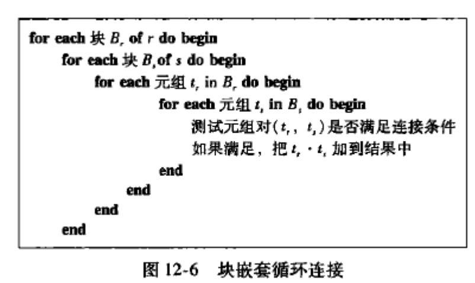

**块嵌套循环连接**是嵌套循环连接的一个变种,内层关系的每一块与外层关系的每一块形成一对

|                                  | 块传输                | 寻道               |
| -------------------------------- | --------------------- | ------------------ |
| 最坏                             | $b_r \cdot b_s + b_r$ | $b_r + b_r = 2b_r$ |
| 最好（两个关系都能全部放入内存） | $ b_s+b_r$            | $ 2$               |

假设内存有$M$个块，分配1个块给输出缓冲，分配1个块给内层关系，剩下$M-2$​个块分配给外层关系，

这样的话，对内层关系的扫描次数就从 $b_r$次减少为$\lceil \frac{b_r}{(M-2)} \rceil$​次

这时，块传输次数为$\lceil \frac{b_r}{(M-2)} \rceil \cdot b_s + b_r$，寻道次数为 $2\lceil \frac{b_r}{(M-2)} \rceil$

### 12.5.3 索引嵌套-循环连接

略

### 12.5.4 归并连接

#### 关系已经排序

若关系已经排序，则直接使用归并连接

##### 块传输次数

假如关系已经排序，块传输次数为：$b_r + b_s$ （最好最坏都是这样）​

##### 寻道次数

假设为每个输入缓冲和输出缓冲都分配了$b_b$个块：

需要$(\lceil b_r/b_b \rceil + \lceil b_s/b_b \rceil)$次寻道

最坏情况下，$b_b=1$，则寻道次数为：$b_r + b_s$​

最好情况下，输入缓冲能够容纳所有的块，则寻道次数为：2

#### 关系未排序

若关系未排序，则有2种思路：

1. 改进前的归并连接：先使用排序方法分别对两个关系进行排序，然后再用归并连接。
   - 这里的排序方法可以使用外部排序-归并算法。（$\star$）
2. 改进后的归并连接：先使用外部排序-归并算法的*第一阶段* **对每个归并段内进行排序**，再进行归并连接。（注意：只用了外部排序-归并算法的 ***第一阶段***，所得到的只是一系列归并段，归并段内部已经排序，但是归并段之间未排序；而（$\star$）处的方法是用了***所有阶段***，所得到的是全部排好序的整个关系）

##### 思路1：改进前的归并连接

###### **块传输次数**

假如关系未排序，则要先对两个表进行排序，记排序所需的块传输次数为$T_{sort}$，再用归并连接，总的块传输次数为：$T_{sort}+b_r + b_s$

假如这里的排序方法使用外部排序-归并算法，由于要分别对两个关系排序，则
$$
T_{sort} = b_r(2\lceil \log_{\lfloor M/b_b \rfloor-1} (b_r/M)\rceil +1) + b_s(2\lceil \log_{\lfloor M/b_b \rfloor-1} (b_s/M)\rceil +1)
$$
（具体分析见前文的”外部排序归并的代价分析“）

所以总的块传输次数为：
$$
\begin{aligned}
 & T_{sort}+b_r + b_s  \\
 =\;& b_r(2\lceil \log_{\lfloor M/b_b \rfloor-1} (b_r/M)\rceil +1) + b_s(2\lceil \log_{\lfloor M/b_b \rfloor-1} (b_s/M)\rceil +1) + b_r + b_s
\end{aligned}
$$

###### **寻道次数**

假如关系未排序，则要先对两个表进行排序，记排序所需的寻道次数为$S_{sort}$，再用归并连接，总的块传输次数为：$S_{sort}+(\lceil b_r/b_b \rceil + \lceil b_s/b_b \rceil)$

假如这里的排序方法使用外部排序-归并算法，由于要分别对两个关系排序，则
$$
S_{sort} = 
\left[ 2\lceil b_r/M \rceil + \lceil b_r/b_b \rceil(2\lceil \log_{\lfloor M/b_b\rfloor -1} (b_r/M )\rceil - 1) \right] 
+  \left[ 2\lceil b_s/M \rceil + \lceil b_s/b_b \rceil(2\lceil \log_{\lfloor M/b_b\rfloor -1} (b_s/M )\rceil - 1) \right]
$$
（具体分析见前文的”外部排序归并的代价分析“）

所以总的寻道次数为：
$$
\begin{aligned}
& S_{sort}+(\lceil b_r/b_b \rceil + \lceil b_s/b_b \rceil) \\
=\;&  \left[ 2\lceil b_r/M \rceil + \lceil b_r/b_b \rceil(2\lceil \log_{\lfloor M/b_b\rfloor -1} (b_r/M )\rceil - 1) \right] + \left[ 2\lceil b_s/M \rceil + \lceil b_s/b_b \rceil(2\lceil \log_{\lfloor M/b_b\rfloor -1} (b_s/M )\rceil - 1) \right] \\
&+ \left(\lceil b_r/b_b \rceil + \lceil b_s/b_b \rceil \right) \\
=\;& 2\lceil b_r/M \rceil + 2 \lceil b_r/b_b \rceil \lceil \log_{\lfloor M/b_b\rfloor -1} (b_r/M )\rceil + 2\lceil b_s/M \rceil + 2\lceil b_s/b_b \rceil \lceil \log_{\lfloor M/b_b\rfloor -1} (b_s/M )\rceil 
\end{aligned}
$$

##### **思路2：改进后的归并连接**

###### **块传输次数**

假如使用改进后的归并排序算法，即先使用外部排序-归并算法的第一阶段 **对每个归并段内进行排序**，再进行归并连接，

在外部排序-归并算法的***第一阶段***，需要 $2b_r + 2b_s$ ​次块传输；

归并连接需要 $b_r + b_s$ 次块传输；

则总块传输次数为：$3(b_r + b_s)$

###### **寻道次数**

在外部排序-归并算法的***第一阶段***，需要 $2\lceil b_r/M \rceil+2\lceil b_s/M \rceil$ 次寻道；

归并连接需要 $(\lceil b_r/b_b \rceil + \lceil b_s/b_b \rceil)$次寻道；

则总寻道次数为：$2\lceil b_r/M \rceil+2\lceil b_s/M \rceil + (\lceil b_r/b_b \rceil + \lceil b_s/b_b \rceil)$

### 12.5.5 散列连接

#### 对于不需要递归分区的情况

##### 块传输次数

- 分区阶段：对两个关系进行分区时，需要将两个关系进行*一次完整的读入和写回*。该操作需要$2(b_r + b_s)$次块传输。
- 构造和探查阶段：*每个分区要读入一次*，这时需要 $b_r + b_s$​ 次块传输。

- 再考虑部分满的块，每个关系存取这种部分满的块需要至多$2n_h$的开销。两个关系共需至多$4 n_h$的开销

所以总共需要 $3(b_r + b_s)+4n_h$ 次块传输。

##### 寻道次数

假设为每个输入缓冲和输出缓冲都分配了$b_b$​个块：

- 分区阶段：需要$2(\lceil b_r/b_b \rceil + \lceil b_s/b_b \rceil)$​次寻道。
- 构造和探查阶段：每个关系的$n_h$分区仅需要1次寻道。

所以总共需要$2(\lceil b_r/b_b \rceil + \lceil b_s/b_b \rceil) + 2n_h$​次寻道。

#### 对于需要递归分区的情况

假设为每个输入缓冲和输出缓冲都分配了$b_b$个块，$M$表示主存缓冲区可以容纳的块数

##### 块传输次数

- 分区阶段：对两个关系进行分区时，需要将两个关系进行一次完整的读入和写回。该操作总共需要$2(b_r + b_s) \lceil \log_{\lfloor M/b_b \rfloor - 1} (b_s/M) \rceil$​次块传输。
- 构造和探查阶段：每个分区要读入一次，这时需要 $b_r + b_s$​ 次块传输。

所以总共需要 $2(b_r + b_s) \lceil \log_{\lfloor M/b_b \rfloor - 1} (b_s/M) \rceil+(b_r + b_s)$​ 次块传输。

##### 寻道次数

- 分区阶段：$2(\lceil b_r/b_b \rceil + \lceil b_s/b_b \rceil) \lceil \log_{\lfloor M/b_b \rfloor - 1} (b_s/M) \rceil$
- 构造和探查阶段：寻道次数相对较少，可以忽略。

所以总共大约需要$2(\lceil b_r/b_b \rceil + \lceil b_s/b_b \rceil) \lceil \log_{\lfloor M/b_b \rfloor - 1} (b_s/M) \rceil$​次寻道。

> [!TIP]
>
> 注意到块传输次数和寻道次数的计算中都有$\lceil \log_{\lfloor M/b_b \rfloor - 1} (b_s/M) \rceil$ 这一项，所以$b_s$（即内层关系的块数）越小， 这一项就越小，块传输次数和寻道次数就越小。
>
> 因此，将**块数小的关系作为内层关系**，可以减少块传输次数和寻道次数。

## 12.7 表达式执行

表达式执行有2种方式：

- 物化
- 流水线

Example：假设一个表达式中要进行2种运算。

- 物化：使用物化执行的方式会先对原关系进行运算1，得到中间的临时关系，然后再对临时关系进行运算2，得到最后的结果关系。
- 流水线：使用流水线执行的方式会对关系中的每个记录逐个运算，一个记录做完运算1就立即做运算2，同时下一个记录开始做运算1

### 12.7.1 物化

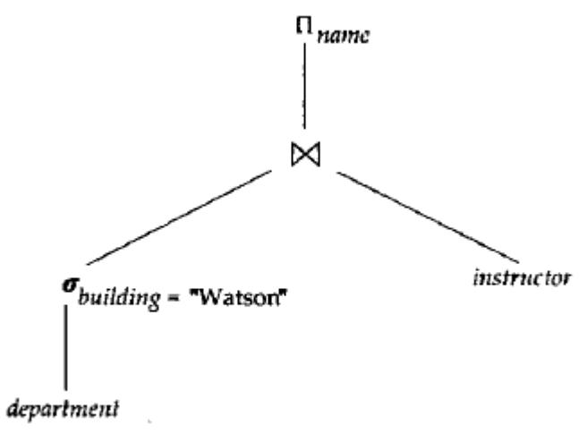

**运算符数**:对表达式做图形化表示

当采用物化方法时,从表达式的最底层的运算(在树的底部)开始

**物化计算**:运算的**每个中间结果被创建(物化)**，然后用于下一层的运算

### 12.7.2 流水线

**流水线计算**：将多个关系操作组合成一个操作的流水线来实现,其中一个操作的结果将传送到下一个操作

优势:

1. 消除读和写临时关系的代价,减少查询计算代价
2. 如果一个查询计算计划的根操作符及其输入合并到流水线中,那么可以迅速开始产生查询结果

#### **12.7.2.1 流水线的实现**

1. 需求驱动的流水线 ,系统不停地向位于流水线顶端的操作发出需要元组的请求
2. 生产者驱动的流水线 ,各操作不等待元组请求,而是积极地产生元组

# **第十三章 查询优化**

**查询优化**:从给定查询的的多种可能策略中找出最有效的查询执行计划的一种处理过程

## **13.1 概述**

Example:

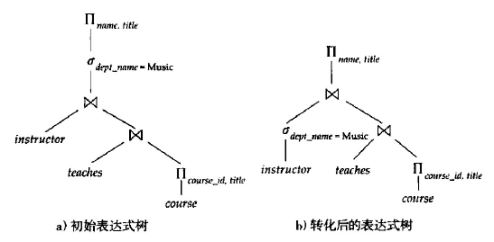

给定一个关系代数表达式，查询优化器的任务是产生一个查询执行计划，该计划能获得与原关系表达式 相同的结果,并且得到结果集的执行代价最小

### 查询执行计划的产生步骤:

1. 产生逻辑上与给定表达式等价的表达式
2. 对所产生的表达式以不同方式作注释，产生不同的查询计划
3. 估计每个执行计划的代价，选择代价最小的一个

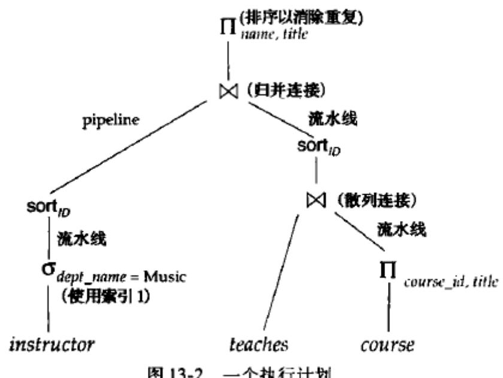

## **13.2 关系表达式的转换**

如果两个关系表达式在每一个有效数据库实例中都会产生相同的元组集,则我们称它们是**等价的**

### **13.2.1 等价规则**

**等价规则**指出两种不同形式的表达式是等价的

1. $\sigma$的级联

$$
\sigma_{\theta_1 \wedge \theta_2}(E) = \sigma_{\theta_1}(\sigma_{\theta_2}(E))
$$

2. 选择运算的交换律

$$
\sigma_{\theta_1}(\sigma_{\theta_2}(E)) = \sigma_{\theta_2}(\sigma_{\theta_1}(E))
$$

3. 一系列投影运算中只有最后一个运算是必需的,其余的可省略。该转换也可称为$\Pi$​的级联:

   前提要求：$L_1 \subseteq L_2 \subseteq \cdots \subseteq L_n$

$$
\Pi_{L_1}(\Pi_{L_2}(...(\Pi_{L_n}(E))...)) = \Pi_{L_1}(E)
$$

4. 选择运算可以与笛卡尔积以及$\theta$结合

   a. $\theta$ 连接的定义：

$$
\sigma_{\theta}(E_1 \times E_2) = E_1 \bowtie_{\theta} E_2
$$

​	b.  等价规则2和4.a的推论：
$$
\sigma_{\theta 1}(E_1 \bowtie_{\theta 2} E_2) = E_1 \bowtie_{\theta 1 \land \theta 2} E_2
$$

5. θ 连接运算满足交换律:
   $$
   E_1 \bowtie_{\theta} E_2 = E_2 \bowtie_{\theta} E_1
   $$
   事实上,左端和右端的属性顺序不同,所以如果考虑属性顺序的话,等式不成立。可以对等价规则的其中一端加入一个投影操作以适当重排属性,但为了简化,我们省略了该投影并且在大部分例子中忽略属性顺序。

6. a. 自然连接运算满足结合律(associative):
   $$
   (E_1 \bowtie E_2) \bowtie E_3 = E_1 \bowtie (E_2 \bowtie E_3)
   $$
   b.  $\theta$​ 连接具有以下方式的结合律:
   $$
   (E_1 \bowtie_{\theta_1} E_2) \bowtie_{\theta_2 \land{\theta_3}} E_3 = E_1 \bowtie_{\theta_1 \land {\theta_3}} (E_2 \bowtie_{\theta_2} E_3)
   $$
   其中  $\theta_2$  只涉及  $E_2$  与  $E_3$  的属性。由于其中的任意一个条件都可为空,因此笛卡儿积(×)运算也满足结合律。连接运算满足结合律、交换律在查询优化中对于重排连接顺序是很重要的。

7. 选择运算在下面两个条件下对 θ 连接运算具有分配律:

   a. 当选择条件  $\theta_0$  中的所有属性**只涉及参与连接运算的表达式之一**(比如  $E_1$ )时,满足分配律：
   $$
   \sigma_{\theta 0}(E_1 \bowtie_{\theta} E_2) = (\sigma_{\theta 0}(E_1)) \bowtie_{\theta} E_2\
   $$
   b. 当选择条件  $\theta_1$  只涉及  $E_1$  的属性,选择条件  $\theta_2$  只涉及  $E_2$  的属性时,满足分配律:
   $$
   \sigma_{\theta 1} \land_{\theta 2} (E_1 \bowtie_{\theta} E_2) = (\sigma_{\theta 1}(E_1)) \bowtie_{\theta} (\sigma_{\theta 2} (E_2))
   $$

8. 投影运算在下面条件下对θ连接运算具有分配律:

   a. 令  $L_1$ 、 $L_2$  分别代表  $E_1$ 、 $E_2$  的属性。假设连接条件  $\theta$  只涉及  $L_1 \cup L_2$​​  中的属性,则:
   $$
   \prod_{L,\cup L} (E_1 \bowtie_{\theta} E_2) = (\prod_{L_1} (E_1)){\bowtie}_\theta (\prod_{L_2} (E_2))
   $$
   

   b.考虑连接  $E_1 \bowtie_{\theta} E_2$ 。令  $L_1$和$ L_2$  分别代表  $E_1 $和$ E_2$  的属性集;令  $L_3$  是  $E_1$  中出现在连接条件  $\theta$  中但不在  $L_1$  中的属性；令  $L_4$  是  $E_2$  中出现在连接条件  $\theta$  中但不在  $ L_2$  中的属性。那么:
   $$
   \prod_{L_1 \cup L_2} (E_1 \bowtie_{\theta} E_2) = \prod_{L_1 \cup L_1} ((\prod_{L_1 \cup L_3} (E_1)) \bowtie_{\theta} (\prod_{L_2 \cup L_4} (E_2)))
   $$
   对于外连接运算，类似的等价规则也成立。

9. 集合的并与交满足交换律。
   $$
   E_1 \cup E_2 = E_2 \cup E_1
   $$

   $$
   E_1 \cap E_2 = E_2 \cap E_1
   $$

   集合的差运算不满足交换律。  

10. 集合的并与交满足结合律。
    $$
    (E_1 \cup E_2) \cup E_3 = E_1 \cup (E_2 \cup E_3)
    $$

    $$
    (E_1 \cap E_2) \cap E_3 = E_1 \cap (E_2 \cap E_3)
    $$

11. 选择运算对并、交、差运算具有分配律:
    $$
    \sigma_{\theta} (E_1 \cup E_2) = \sigma_{\theta} (E_1) \cup \sigma_{\theta} (E_2)
    $$

    $$
    \sigma_{\theta} (E_1 \cap E_2) = \sigma_{\theta} (E_1) \cap \sigma_{\theta} (E_2)
    $$

    $$
    \sigma_{\theta} (E_1 - E_2) = \sigma_{\theta} (E_1) - \sigma_{\theta} (E_2)
    $$

    $$
    \sigma_{\theta} (E_1 \cap E_2) = \sigma_{\theta} (E_1) \cap E_2
    $$

    $$
    \sigma_{\theta} (E_1 - E_2) = \sigma_{\theta} (E_1) - E_2
    $$

    > [!WARNING]
    > $$
    > \sigma_{\theta} (E_1 \cup E_2) = \sigma_{\theta} (E_1) cup E_2
    > $$
    > 不成立！

12. 投影运算对并运算具有分配律：
    $$
    \prod_{L}(E_1 \cup E_2) = (\prod_{L}(E_1)) \cup (\prod_{L}(E_2))
    $$

更多请见书本，总的来说就是不同形式的交换律、结合律、分配律。

### 13.2.2 转换的例子

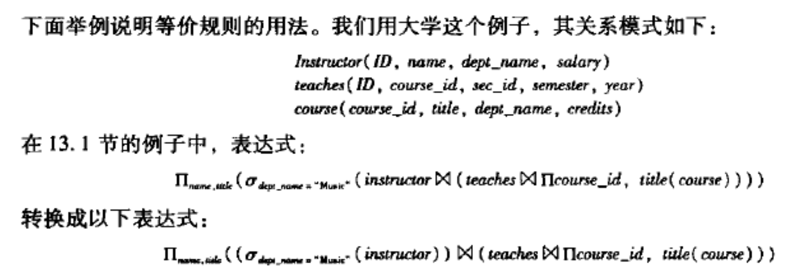

第二个表达式与第一个表达式等价，但是第二个表达式产生了较小规模的中间关系，查询代价更低。

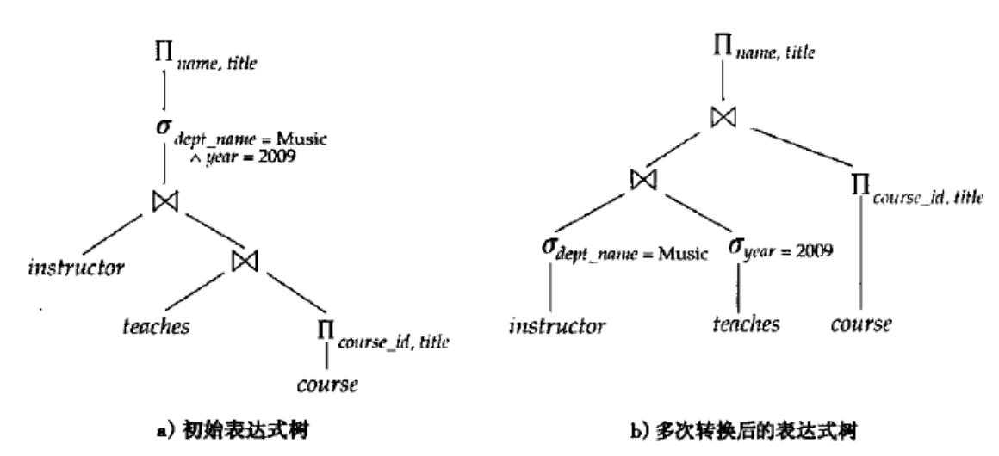

### 13.2.3 连接的次序

一个好的连接运算次序对于减少临时结果的大小是很重要的
$$
(r_1 \bowtie r_2)  \bowtie r_3 = r_1 \bowtie (r_2 \bowtie r_3)
$$
虽然上面这两个表达式等价，但是计算它们的代价可能不同

### 13.2.4 等价表达式的枚举

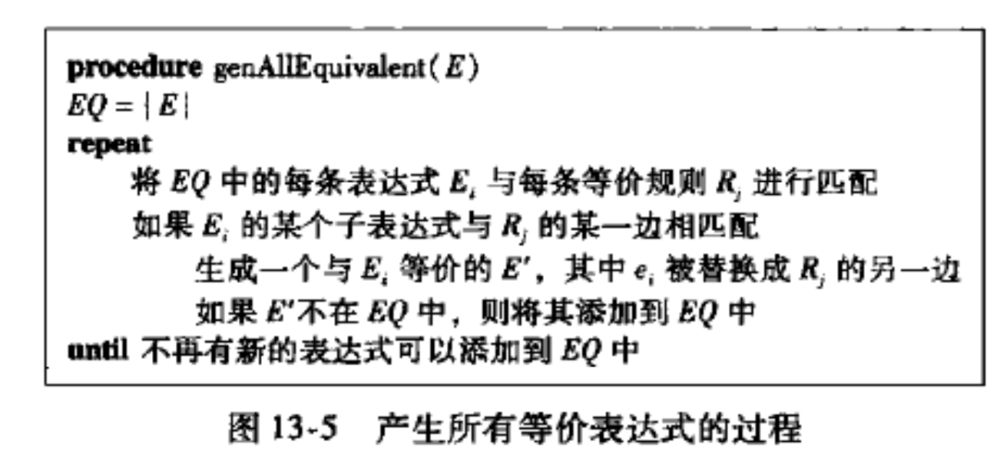

## 13.3 表达式结果集统计大小的估计

### **13.3.1 目录信息**

- $n_r$: 关系r的元组数
- $b_r$: 包含关系r中元组的磁盘块数

- $l_r$: 关系r中每个元组的字节数
- $f_r$: 关系r的块引子——一个磁盘块能容纳关系r中元组的个数
- $V(A,r)$: 关系r中属性A中出现的非重复值个数

显然有等式
$$
b_r= \lceil \frac{n_r}{f_r} \rceil
$$
**等宽直方图**:取值范围分成相等大小的区间

**等深直方图**:每个区间的取值个数相同

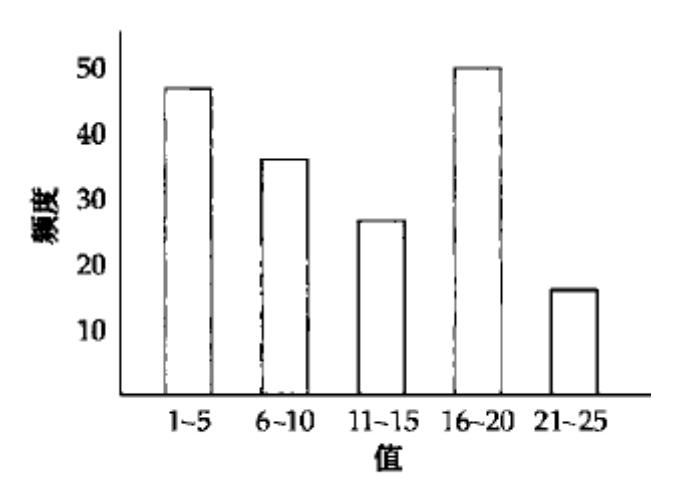

### **13.3.2 选择运算结果大小的估计**

$\sigma_{A = a}(r)$:  $\frac{n_r}{V(A,r)}$个元组
$\sigma_{A \leq a}(r)$:  $n_r \cdot \frac{v - \min(A, r)}{\max(A, r) - \min(A, r)}$ 个元组

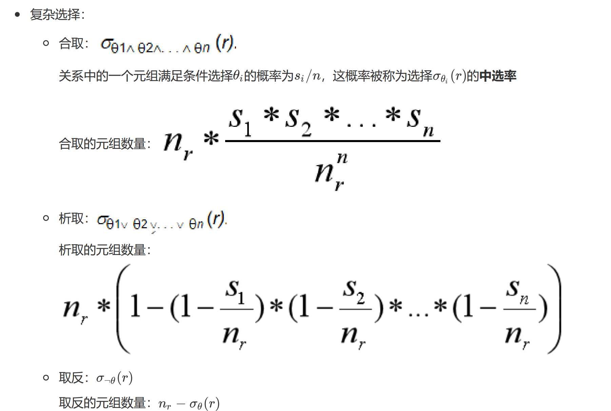

### **13.3.3 连接运算结果大小的估计**

对于 ,令r(R)和s(S)为两个关系

- 若$R\cap S=\varnothing$,则两关系没有共同属性,此时$r\Join s=r\$T_i$mes s$
- 若$R\cap S$是R或S的码,则此时得到元组数与r或s中的元组数相同
- 若$R \cap S$既不是R也不是S的码,假定$R \cap S = \{A\}$,此时应该有$(n_r\times n_s)/V(A,s)$个元组

### 13.3.4 其它运算的结果集大小的估计

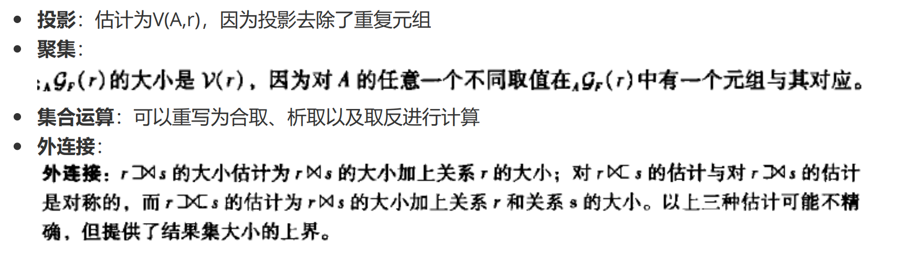

## **13.4 执行计划选择**

**基于代价的优化器**从给定查询等价的所有查询执行计划空间中进行搜索,并选择估计代价最小的一个

### **13.4.1 基于代价的连接顺序选择**

考虑表达式$r_1\Join r_2\Join \dots \Join r_n$,当n=3时,有12种不同的连接顺序

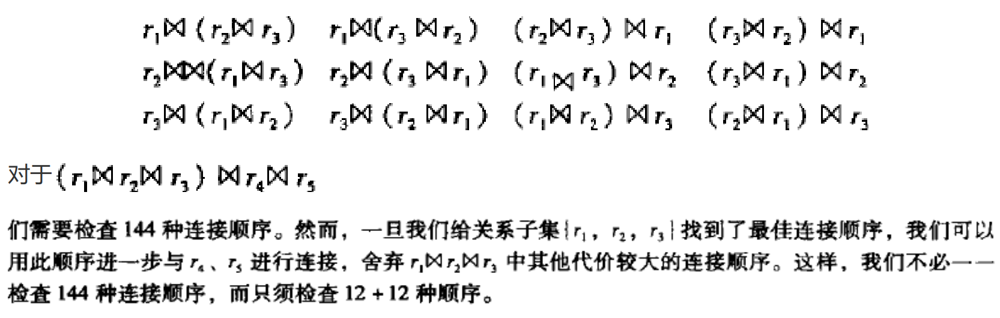

### **13.4.3 启发式优化**

查询优化器使用**启发式方法**来减少优化代价

对关系代数查询进行转换的例子:

- 尽早执行选择运算
- 尽早执行投影运算

**左深连接顺序**用于流水线计算特别方便,因为右操作对象是一个已存储的关系,每个连接只有一个 输入来自流水线

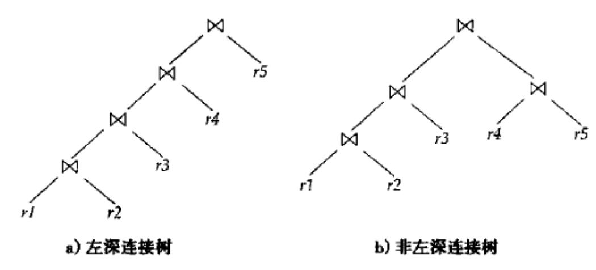

许多优化器允许为查询优化指定**优化成本预算**,当超过预算时停止搜索,返回当前找到的最优计