# 第四部分 事务管理

[TOC]

# 第十四章 事务

**事务**:构成单一逻辑操作单元的操作集合

## 14.1 事务概念

**事务**是访问并可能更新各种数据项的一个程序执行**单元**

### 事务的特性(**ACID特性**)！

事务具有以下特性:

- **原子性(Atomicity)**：事务的所有操作在数据库中要么全部正确反映出来,要么完全不反映。具体而言，数据库系统要么执行整个事务,要么属于该事务的操作一个也不执行。
- **一致性(Consistency)**：隔离执行事务时,保持数据库的一致性
- **隔离性(Isolation)**：每个事务感觉不到系统中有其它事务在并发地执行
- **持久性(Durability)**：一个事务成功完成后,对数据库的改变是永久的,即使出现系统故障

## 14.2 一个简单的事务模型

事务运用以下两个操作访问数据:

- **read(X)**:从数据库把数据库项X传送到执行**read**操作的事务的主存缓冲区的一个也称为X的变量中
- **write(X)**:从执行**write**的事务的主存缓冲区的变量X中把数据项X传回数据库中

## **14.3 存储结构**

- **易失性存储器**：其中的信息在系统崩溃后不会幸存 
- **非易失性存储器**：其中的信息在系统崩溃后幸存
- **稳定性存储器**：其中的信息永远 不会丢失

## 14.4 事务原子性和持久性

> **日志(log)**:
>
> 负责管理事务中止。事务对数据库所做的每个修改都会首先被记录到日志中，然后数据库本身才会改变。
>
> 日志的作用：
>
> 对日志的维护提供了 *通过重做修改* 来保证原子性和持久性的可能，以及在事务执行期间发生故障后 *通过撤销修改* 来保证原子性的可能

事务的相关术语：

**中止(aborted)**：事务没有成功地执行完成

**回滚(rolled back)**：中止事务造成的变更被撤销

**已提交(committed)**：成功完成其执行的事务

#### 事务的状态:

**活动的(active)**：初始状态,事务执行时处于这个状态 

**部分提交的(partially committed)**：最后一条语句执行后

**失败的(failed)**：发现正常的执行不能继续后

**中止的(aborted)**：事务回滚并且数据库已恢复到事务开始执行前的状态后

**提交的(committed)**：成功完成后

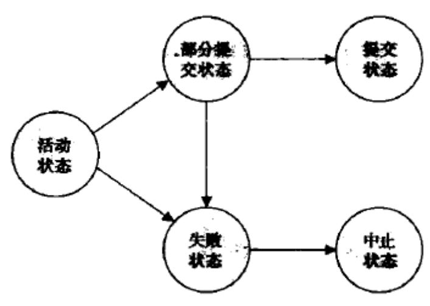

如果事务是**提交**的或**中止**的，它称为**已经结束的(terminated)**

事务进入中止状态后,系统有两种选择:

- 重启(restart)事务：当引起事务中止的是硬件错误,或不是由事务的内部逻辑所产生的软件错误时。重启的事务被看成一个新事务。
- 杀死(kill)事务：事务的内部逻辑造成错误

## **14.5 事务隔离性**

**事务并发的优点:**

- 提高吞吐率和资源利用率
- 减少等待时间

**调度(schedule)**：指令在系统中执行的时间顺序

**串行的(serial)**：每个串行调度由来自各事务的指令序列组成,其中属于同一事务的指令在调度中紧挨 在一起

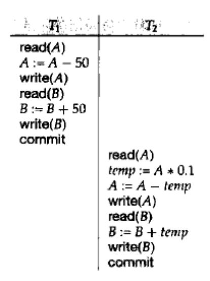

**可串行化调度**：在并发执行中,通过保证所执行的任何调度的效果都与没有并发执行的调度效果一样, 我们可以确保数据库的一致性。调度应该在某种意义上等价于一个串行调度。

## **14.6 可串行化**

假设有事务$T_i$和$T_j$，它们分别由指令$I_i$和$I_j$,

考虑一下4种情况的指令$I_i$和$I_j$:

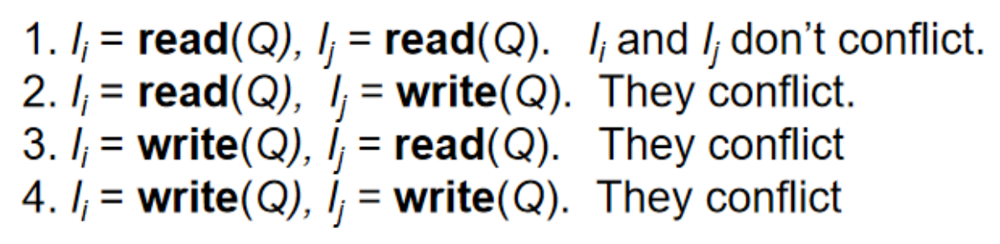

只有都为I与J都为read的时候,执行顺序才是无关紧要的

> **冲突等价**：
>
> 如果调度S可以经过一系列**非冲突**指令交换成S',则S与S'是**冲突等价**的

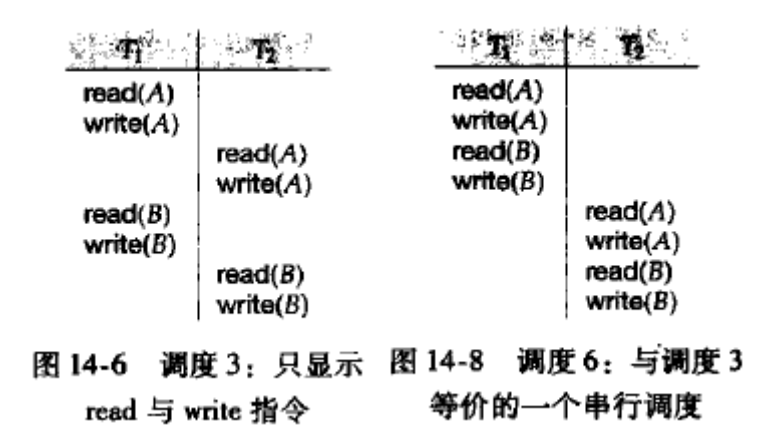

> **冲突可串行化**：
>
> 若一个调度S与一个**串行调度**冲突等价,则称调度S是**冲突可串行化**的

**优先图**：S是一个调度,由S构造一个有向图

根据优先图判断一个调度S是否冲突可串行化：

- 如果关于S的优先图中**有环**，则调度S是**非**冲突可串行化
- 如果关于S的优先图中**无环**，则调度S是**冲突可串行化**

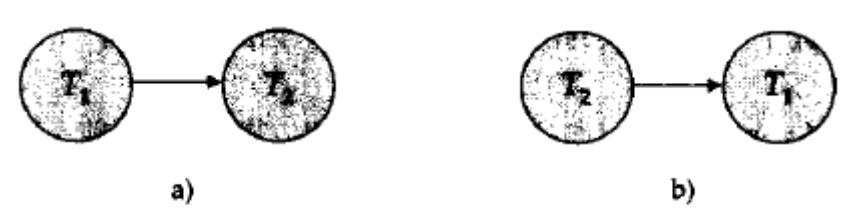

**串行化顺序**可通过**拓扑排序**得到,拓扑排序用于计算与优先图的偏序相一致的线性顺序

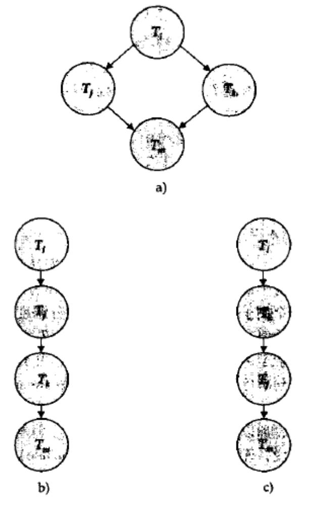

## **14.7 事务隔离性和原子性**

### **14.7.1 可恢复调度**

若$T_j$读取了$T_i$写入的值,则$T_j$**依赖**于$T_i$

> **可恢复调度**：
>
> 对于每对事务$T_i$和$T_j$，如果$T_j$读取了之前由$T_i$所写的数据项，则$T_i$先于$T_j$提交

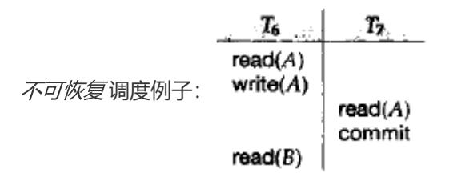

### **14.7.2 无级联调度**

> **级联回滚**：
>
> 因 *单* 个事务故障导致 *一系列事务* 回滚

> **无级联调度**：
>
> 对于每对事务$T_i$和$T_j$，如果$T_j$读取了先前由$T_i$所写的数据项，则$T_i$必须在$T_j$​这一操作前提交

根据无级联调度的定义，不难发现，无级联调度都是可恢复调度。

## **14.8 事务隔离性级别**

SQL标准规定的隔离性级别如下：（级别由高到低）

- **可串行化(serializable)**：保证可串行化调度。然而，一些数据库对该隔离级别的实现在某些情况下允许非可串行化执行。
- **可重复读(repeatable read)**：只允许读取**已提交**的数据，而且在**一个事务两次读取一个数据项期间，其他事务不得更新该数据**。但该事务不要求与其他事务可串行化。
- **已提交读(read committed)**：只允许读取**已提交**的数据，但不要求可重复读。
- **未提交读(read uncommitted)**：允许读取**未提交**的数据，这是SQL允许的最低一致性级别。

以上所有隔离性级别都不允许**脏写**。

> **脏写(Dirty Write)**：
>
> 一个数据项已经被另外一个**尚未提交或中止**的事务 **写入**，则**不允许对该数据项执行写操作**。
>
> 简单地说就是，不允许写 未提交或中止的写入
>
> **脏读(Dirty Read)**：
>
> 一个数据项已经被另外一个**尚未提交或中止**的事务 **写入**，则**不允许对该数据项执行读操作**。
>
> 简单地说就是，不允许读 未提交或中止的写入

> [!WARNING]
>
> 易错题：
>
> 假设事务 $T_1$ 和 $T_2$ 并发执行， $T_1$ 读取了某条数据后， $T_2$ 对该数据进行了更新并提交，随后 $T_1$​ 再次读取该条数据，发现其值已经改变。这种现象属于下列哪种问题？（  ）
>
> A. 脏读
>
> B. 不可重复读
>
> C. 幻读
>
> D. 丢失更新
>
> 
>
> 答案：B
>
> 解释：由“可重复读“的含义即可得知是不可重复读

## 14.9 隔离性级别的实现

- 锁
- 时间戳
- 多版本和快照隔离

## 14.10 事务的SQL语句表示

### 幻象现象

例子：

在执行上述语句的差不多同一时间，另一个用户执行了以下语句

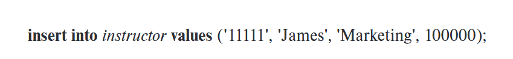

这时，查询结果就取决于数据库中的执行顺序，是先查询后插入，还是先插入后查询。这种情况被称为**幻象现象**。

幻象现象表明：并发控制仅考虑事务要访问的元组（比如例子中的`ID`,`name`）是不够的，还需要考虑事务**用于找到待访问元组的信息**（比如例子中的`salary`）。

解决方法：**谓词锁**，使用索引节点上的锁来实现。

# 第十五章 并发控制

## **15.1 基于锁的协议**

确保隔离性的方法之一是要求对数据项以互斥 的方式进行访问

### 15.1.1 锁

1. **共享型锁**:lock-S(Q),事务$T_i$可读但不能写数据项Q 
2. **排他型锁**:lock-X(Q),事务$T_i$既可读也能写数据项Q

事务根据自己对Q的操作类型**申请**适当的锁,等到并发控制管理器**授予**所需锁才能继续操作 锁相容性矩阵:

|   | S     | X     |
|---|-------|-------|
| S | true  | false |
| X | false | false |

若数据项已被另一事务加上了不相容类型的锁,则$T_i$只好**等待**直到锁被释放

**死锁**：两个事务都不能正常执行的状态

死锁发生时，系统必须回滚两个事务中的一个，一旦某个事务回滚，该事务回滚的数据项就被解锁

**封锁协议**：规定事务何时对每个数据项进行加锁、解锁

封锁协议**保证**冲突可串行性$\iff$所有合法的调度都是冲突可串行化的(关联的$\rightarrow$关系无环)

### **15.1.2 锁的授予**

**饿死**:事务$T_i$永远得不到进展,因为总是得不到锁

避免饿死的加锁方式:

1.  不存在在数据项Q上持有与M型锁冲突的锁的其它事务
2. 不存在等待对数据项Q加锁且先于$T_i$申请加锁的事务

此时一个加锁请求就不会被其后的加锁申请阻塞

### **15.1.3 两阶段封锁协议**

作用：**保证可串行化**

**两阶段封锁协议**要求每个事务分两个阶段提出加锁和解锁申请:

1. **增长阶段**:事务可以获得锁,但不能释放锁 
1. **缩减阶段**:事务可以释放锁,但不能获得锁

**封锁点**:调度中事务获得最后加锁的位置(增长阶段结束点)

**严格两阶段封锁**可以***避免级联回滚***，要求**所有排他锁**必须在**事务提交后才能释放**

**强两阶段封锁**要求事务提交之前**不得释放任何锁**

任何形式的两阶段封锁协议只产生**冲突可串行化**的调度

> [!CAUTION]
>
>  两阶段封锁协议 ***不保证不死锁***

#### 锁转换:

- 升级:共享锁 $\rightarrow$ 排他锁
- 降级:排他锁 $\rightarrow$ 共享锁
- 锁的**升级**只能发生在**增长阶段**
- 锁的**降级**只能发生在**缩减阶段**

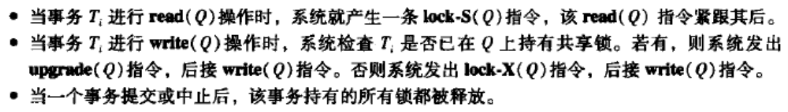

### **15.1.4 封锁的实现**

**锁管理器**可以实现为一个过程,它从事务接收消息并反馈消息

**锁表**:以数据项名称为索引的散列表来查找链表中的数据项

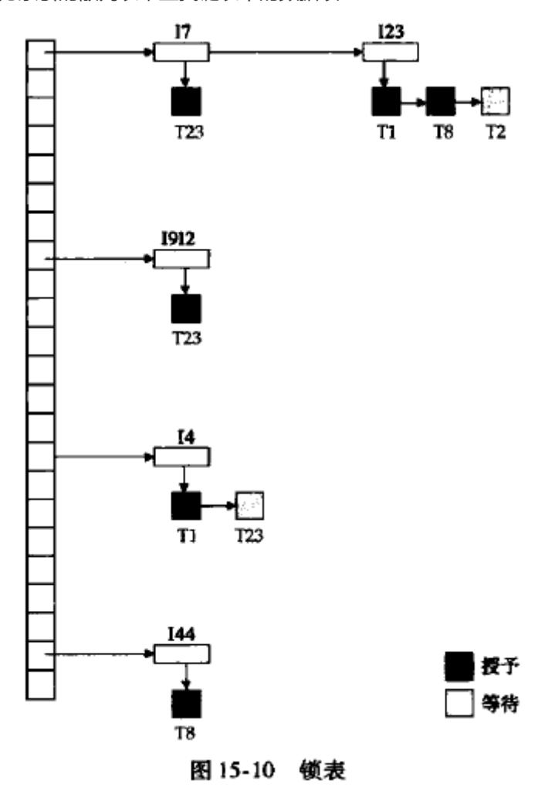

### 15.1.5 基于图的协议

**数据库图**:数据项集合D满足偏序关系,故可以视为一个有向无环图

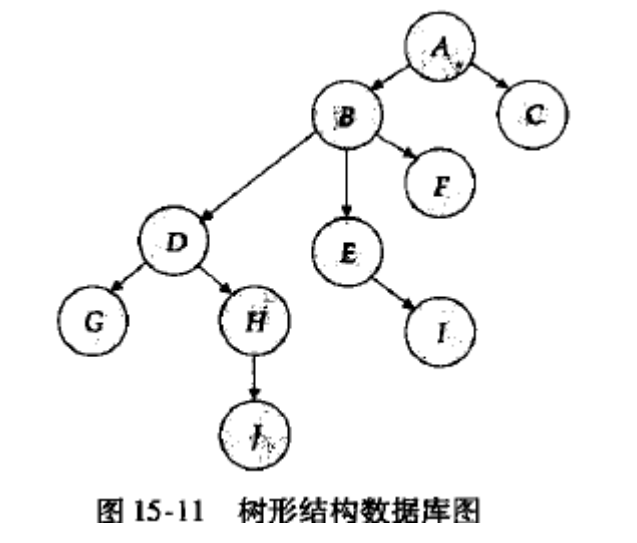

**树形协议**:可用的加锁指令**只有lock-X（排他锁）**，并且要遵循以下规则:

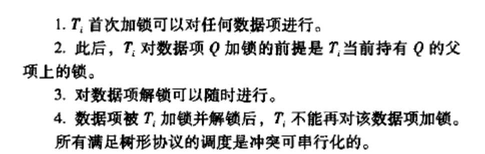

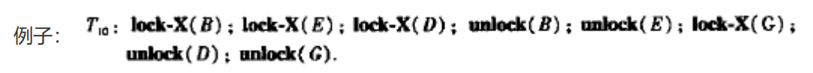

可以通过记录数据项最后被哪个事务修改而保证可恢复性

树形协议**不产生死锁**,因此不需要回滚

树形协议可以在较早时候释放锁,减少等待时间增加了并发性

缺点：事务可能必须为其不需要的数据项加锁

## 15.2 死锁处理

处理死锁问题的两种方法:

1. **死锁预防**:保证系统永不 进入死锁状态

2. 允许系统进入死锁状态,然后试着用**死锁检测**和**死锁恢复**机制进行恢复

### **15.2.1 死锁预防**

预防死锁的两种方法:

1. 对加锁请求进行**排序**或要求**同时获得所有的锁**来保证不会发生循环等待
2. 每当等待有可能导致死锁时,进行回滚而不是等待加锁

#### 第一种方法：排序或同时获得所有锁

机制1：同时获得所有锁

要么一次全部封锁,要么全不封锁

缺点:

- 很难预知哪些数据项要被使用
- 数据项使用率可能很低

机制2：对数据项强加一个次序(树形协议偏序)

#### 第二种方法：抢占与事务回滚

通过回滚事务$T_i$来将抢占其持有的锁,并将其授予$T_j$

通过**时间戳**来决定事务应当等待还是回滚

两种机制:

1. **wait-die**机制基于 ***非抢占*** 技术：当$T_i$时间戳小于$T_j$时($T_i$比$T_j$老),允许$T_i$等待,否则$T_i$回滚(死亡)

2. **wound-wait**机制基于 ***抢占*** 技术：当$T_i$时间戳大于$T_j$时($T_i$比$T_j$年轻),允许$T_i$等待,否则$T_j$回滚($T_j$被$T_i$伤害)

#### 第三种方法：锁超时

申请锁的事务至多等待一段给定的时间,若超时则该事务自己回滚并重启

### **15.2.2 死锁检测与恢复**

为实现检测与恢复机制,系统必须：

- 维护当前将数据项分配给事务的有关信息，以及任何尚未解决的数据项请求信息。
- 提供一个使用这些信息判断系统是否进入死锁状态的算法
- 当检测算法判定存在死锁时，从死锁中恢复。

#### **15.2.2.1 死锁检测**

死锁可以用**等待图**来精确描述

当事务$T_i$申请的数据项当前被$T_j$持有时,边$T_i \rightarrow T_j$被插入等待图中 

系统中存在死锁$\iff$​等待图包含环

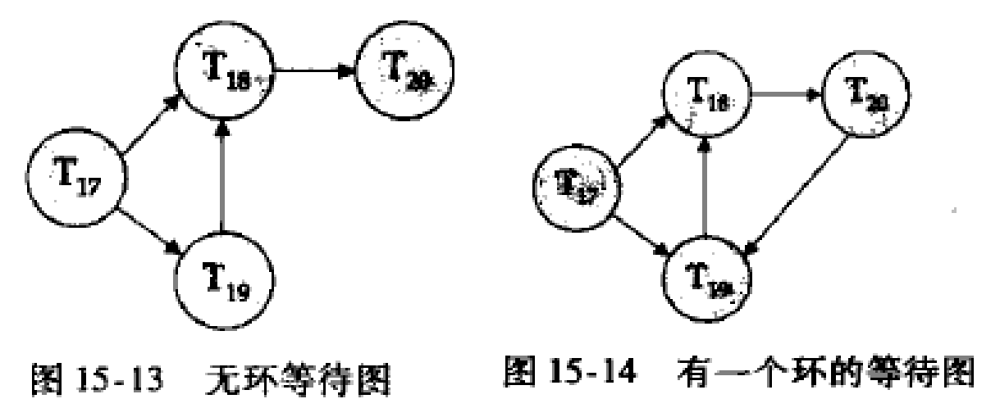

#### **15.2.2.2 从死锁中恢复**

1. **选择牺牲者**：决定回滚哪一个(哪一些)事务以打破死锁,使代价最小

2. **回滚**：必须要决定事务要回滚多远(彻底回滚、部分回滚)

3. **饿死**：保证一个事务被选为牺牲者的次数有限,避免总是被选为牺牲者

## 15.3 多粒度

允许系统定义多级**粒度**的机制,即通过各种大小的数据项定义数据粒度的层次结构

若事务$T_i$给$F_b$**显式**地加排他锁,则$T_i$也给所有属于该文件的记录**隐式**地加排他锁

**意向锁**:一个结点加上了意向锁,则意味着要在树的较低层进行显示加锁；在一个结点显式加锁之前, 该结点的全部祖先结点均加上了意向锁

**共享型意向锁(IS)**:较低层进行显式封锁,但只能加共享锁

**排他型意向锁(IX)**:较低层进行显式封锁,可以加排他锁或共享锁

**共享排他型意向锁(SIX)**:以该结点为根的子树显式地加了共享锁,且树的更底层显式地加排他锁

|     | IS    | IX    | S     | SIX   | X     |
|-----|-------|-------|-------|-------|-------|
| IS  | true  | true  | true  | true  | false |
| IX  | true  | true  | false | false | false |
| S   | true  | false | true  | false | false |
| SIX | true  | false | false | false | false |
| X   | false | false | false | false | false |

**多粒度封锁协议**采用这些锁来保证可串行性

加锁按 *自顶向下* 的顺序(根到叶)，释放锁按 *自底向上* 的顺序(叶到根)

该协议增加了并发性,减少了锁的开销

Example:

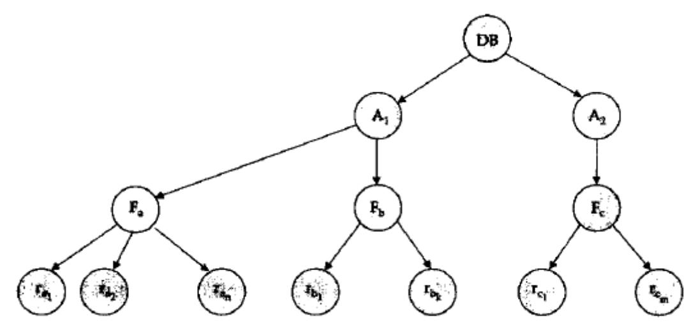

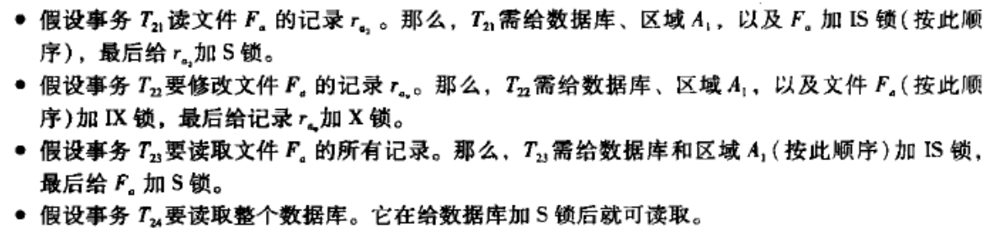

## 15.4 基于时间戳的协议

### **15.4.1 时间戳**

对于系统中的每个事务$T_i$,把时间戳TS($T_i$)与其联系起来

时间戳可以用**系统时钟**或**逻辑计数器**来表示

事务的时间决定了串行化顺序

**W-timestamp(Q)**执行**write(Q)**的所有事务的最大时间戳

**R-timestamp(Q)**执行**read(Q)**的所有事务的最大时间戳

每当有新的read(Q)和write(Q)指令执行时,这些时间戳就更新

### **15.4.2 时间戳排序协议**

**时间戳排序协议**保证任何有冲突的**read**或**write**操作按时间戳顺序执行。

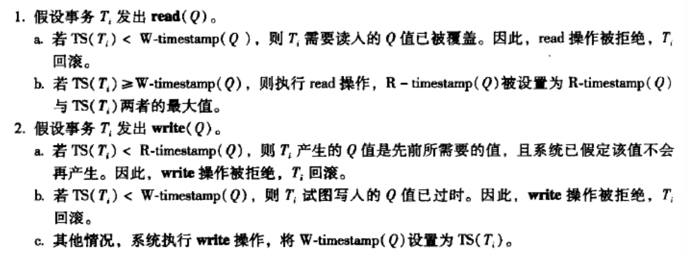

该协议保证无死锁,因为不存在等待的事务

### **15.4.3 Thomas写规则**

修改write(Q)的第二条规则为,若$TS(T_i) < W-timestamp(Q)$,则忽略这个write操作

### **15.4.4 视图可串行化的**

若S与S'是**视图等价**的,则应该满足以下三个条件:

1. 对于每个数据项Q,若$T_i$在调度S中读取了Q的初始值,那么在S'中$T_i$也必须读取Q的初始值
2. 对于每个数据项Q,若在调度S中$T_i$执行了read(Q)并且读取的值是由$T_j$执行write(Q)产生的;则在 S'中,$T_i$的read(Q)也必须是由$T_j$的同一个write(Q)操作产生的
3. 对于每个数据项Q,若在调度S中有事务执行了最后的write(Q)操作,则在调度S'中该事务也必须执 行最后的write(Q)操作

条件1和2保证每个事务读取相同的值,进行相同的计算;条件3保证两个调度得到相同的最终状态

如果某个调度视图等价于一个串行调度,则我们说这个调度是**视图可串行化**的

## **15.5 基于有效性检查的协议**

**有效性检查协议**要求每个事务$T_i$在其生命周期中按两个或三个阶段执行

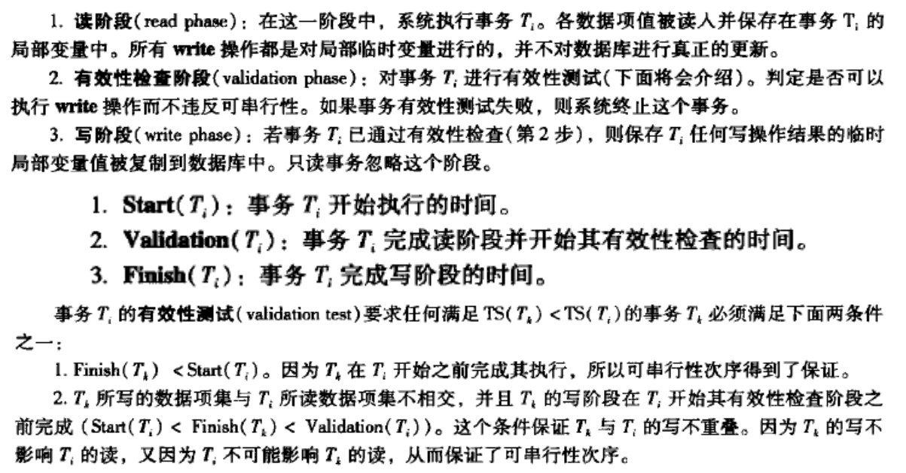

## **15.6 多版本机制**

在**多版本并发控制**机制中,每个write(Q)操作创建Q的一个新版本；

当事务发出一个read(Q)操作时，并发控制管理器选择Q的一个版本进行读取  

## **15.7 快照隔离**

快照隔离在事务开始执行时给它数据库的一份"快照",事务在该快照上操作,和其它并发事务完全隔离

## **15.11 总结**

见P397

# **第十六章 恢复系统**

**恢复机制**负责将数据库恢复到故障发生前的一致的状态

## 16.1 故障分类

- 事务故障：逻辑错误、系统错误

- 系统崩溃(硬件故障)

- 磁盘故障

## **16.2 存储器**

### 16.2.1 稳定存储器的实现

内存和磁盘存储器间进行块传送有以下几种可能结果:

- 成功完成：传送的信息安全地到达目的地

- 部分失败：传送过程中发生故障,目标块有不正确信息

- 完全失败：传送过程中保障发生得足够早,目标块仍完好无缺

### **16.2.2 数据访问**

数据库分成称为**块**的定长存储单位,**块**是磁盘数据传送的单位,可能包含多个数据项

位于**磁盘**上的块称为**物理块**

临时位于**主存**的块称为**缓冲块**

内存用于临时存放块的区域称为**磁盘缓冲区**

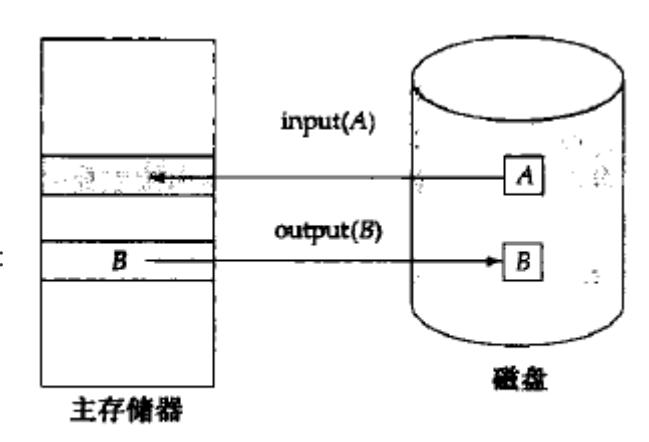

磁盘和主存间的块移动操作：

- input(B)传送物理块至主存
- output(B)传送缓冲块B至磁盘,并替换磁盘上相应的物理块

每个事务$T_i$有一个私有工作区，用于保存$T_i$所访问及更新的所有数据项的拷贝

#### 传送数据的操作

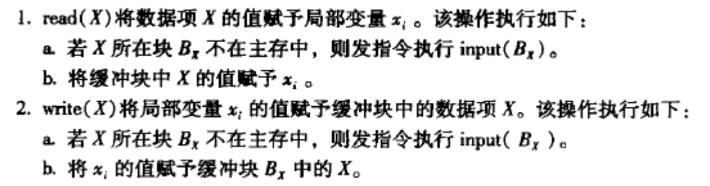

执行output(B)则称为数据库系统对缓冲块B进行**强制输出**

## **16.3 恢复与原子性**

### **16.3.1 日志记录**

**日志**记录数据库中的所有更新活动,它是**日志记录**的序列

**更新日志记录**($<T_i, X_j,V_1, V_2>$)描述一次数据库写操作:

#### 一些日志记录类型:

- $<T_i \; start>$,事务$T_i$开始
- $<T_i \; commit>$,事务$T_i$提交
- $<T_i \; abort>$,事务$T_i$中止

### **16.3.2 数据库修改**

**延迟修改**：一个事务直到它提交时都没有修改数据库

**立即修改**：数据库修改发生在事务仍然活跃时

### **16.3.3 并发控制和恢复**

恢复算法要求如果一个数据项被一个事务修改了，那么在该事务提交或中止前不允许其它事务修改该数据项

### **16.3.5 使用日志来重做和撤销事务**

$redo(T_i)$将事务$T_i$更新过的所有数据项的值都设置成新值

$undo(T_i)$将事务$T_i$更新过的所有数据项的值都恢复成旧值,同时写一个**redo-only**日志($<T_i,X,V>$) 记录，当undo完成时写一个$<T_i \ abort>$日志记录

如果日志包括$<T_i \; start>$记录,但既不包括$<T_i \; commit>$,也不包括$<T_i \; abort>$记录，则需要对事务$T_i$进行**撤销**

如果日志包括$<T_i \ start>$记录,以及$<T_i \ commit>$或$<T_i \ abort>$记录，则需要对事务$T_i$进行**重做**

### 16.3.6 检查点

#### 检查点的执行过程如下:

1. 将当前位于主存的所有日志记录输出到稳定存储器
2. 将所有修改的缓冲块输出到磁盘
3. 将一个日志记录$<checkpoint \; L>$输出到稳定存储器,其中L是执行检查点时正活跃的事务的列表

在系统崩溃发生之后,系统检查日志以找到最后一条$<checkpoint \; L>$记录，只需要对L中的事务以及检 查点后才开始执行的事务进行undo和redo操作

## 16.4 恢复算法

### 16.4.1 事务回滚

#### 正常操作的事务回滚:

1. 从后往前扫描日志，对于所发现的$T_i$的每一个形如$<T_i, X_j,V_1, V_2>$的日志记录:
   - 值$V_1$被写到数据项$X_j$中,
   - 并且往日志中写一个特殊的 **redo-only** 日志记录$<T_i,X_j,V_1>$，其中$V_1$是在本次回滚中数据项$X_j$恢复成的值

2. 一旦发现了$<T_i \; start>$日志记录，就停止从后往前的扫描，并往日志中写一个$<T_i \; abort>$日志记录

### 16.4.2 系统崩溃后的恢复

崩溃发生后当数据库系统重启时,恢复动作分两阶段进行:

1. **重做阶段**,系统从最后一个检查点开始**正向**地扫描日志来重放所有事务的更新

   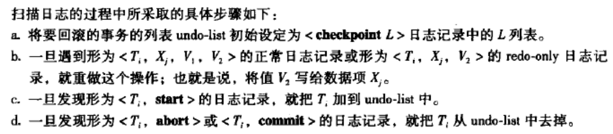

2. **撤销阶段**,系统回滚undo-list中的所有事务，从尾端开始**反向**地扫描日志来执行回滚

   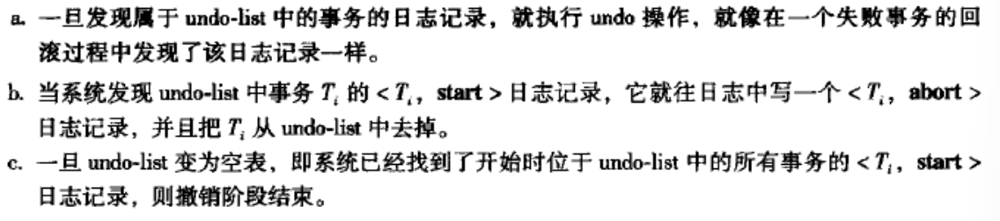

例题：

如下图所示，在$<T_0 \; \text{abort}>$后崩溃

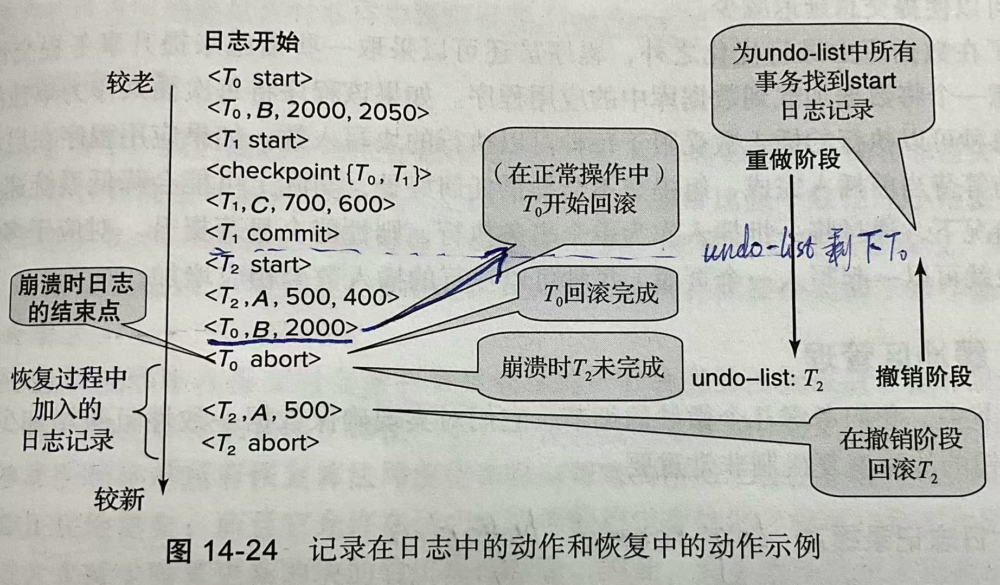

|                log                |                            redo                            |                             undo                             |
| :-------------------------------: | :--------------------------------------------------------: | :----------------------------------------------------------: |
|         $<T_0 \; start>$          |                                                            |                                                              |
|        $<T_0,B,2000,2050>$        |                                                            |                                                              |
|         $<T_1 \; start>$          |                                                            |                                                              |
| $<\text{checkpoint} \{T_0,T_1\}>$ |       从这里开始redo，$\text{undo-list}=\{T_0,T_1\}$       |                                                              |
|         $<T_1,C,700,600>$         |                   redo $<T_1,C,700,600>$                   |                                                              |
|         $<T_1 \; commit>$         | remove $T_1$ from undo-list, so $\text{undo-list}=\{T_0\}$ |                                                              |
|         $<T_2 \; start>$          | add $T_2$ to undo-list, so $\text{undo-list}=\{T_0,T_2\}$  | write $<T_2 \; abort>$ to log, and remove $T_2$ from undo-list. Now, **undo-list is empty**, **stop** |
|         $<T_2,A,500,400>$         |                   redo $<T_2,A,500,400>$                   |               undo write $<T_2,A,500>$ to log                |
|          $<T_0,B,2000>$           |                    redo $<T_0,B,2000>$                     |                          $\uparrow$                          |
|         $<T_0 \; abort>$          | remove $T_0$ from undo-list, so $\text{undo-list}=\{T_2\}$ |                          $\uparrow$                          |
|             **崩溃**              |                redo完成，然后 $\rightarrow$                |                      **从后往前** undo                       |
|           $<T_2,A,500>$           |                                                            |                                                              |
|         $<T_2 \; abort>$          |                                                            |                                                              |

## **16.5 缓冲区管理**

### **16.5.1 日志记录缓冲**

将一个块输出到稳定存储器的开销非常高,因此最好是一次输出多个日志记录

**先写日志（Write-Ahead Logging, WAL）**规则:由于系统崩溃时这种日志记录会丢失,因此我们必须增加要求来保证事务的原子性：

- 在日志记录$<T_i \; commit>$输出到稳定存储器后，事务$T_i$进入提交状态。
- 在日志记录$<T_i \; commit>$输出到稳定存储器前，与事务$T_i$相关的所有日志记录必须已经输出到稳定存储器。
- 在主存中的数据块输出到数据库（非易失性存储器）前，与该块中数据有关的所有日志记录必须已经输出到稳定存储器。

### 16.5.2 数据库缓存

**强制**策略(Force)：事务在提交时强制地将修改过的所有的块都输出到磁盘

**非强制**策略(No force)：即使一个事务修改了某些还没有写回到磁盘的块,也允许它提交

**窃取**策略(Steal)：允许系统将修改过的块写到磁盘,即使做这些修改的事务还没有全部提交

**非窃取**策略(No steal)：一个仍然活跃的事务修改过的块都不应该写出到磁盘

#### 各种策略组合的比较

速度比较

|          | No steal | Steal   |
| -------- | -------- | ------- |
| No force |          | Fastest |
| Force    | Slowest  |         |

恢复时需要执行的操作比较

（&#10004; 表示要执行；&#10006; 表示不用执行）

|          | No steal                    | Steal                       |
| -------- | --------------------------- | --------------------------- |
| No force | undo&#10006; ; redo&#10004; | undo&#10004; ; redo&#10004; |
| Force    | undo&#10006; ; redo&#10006; | undo&#10004; ; redo&#10006; |