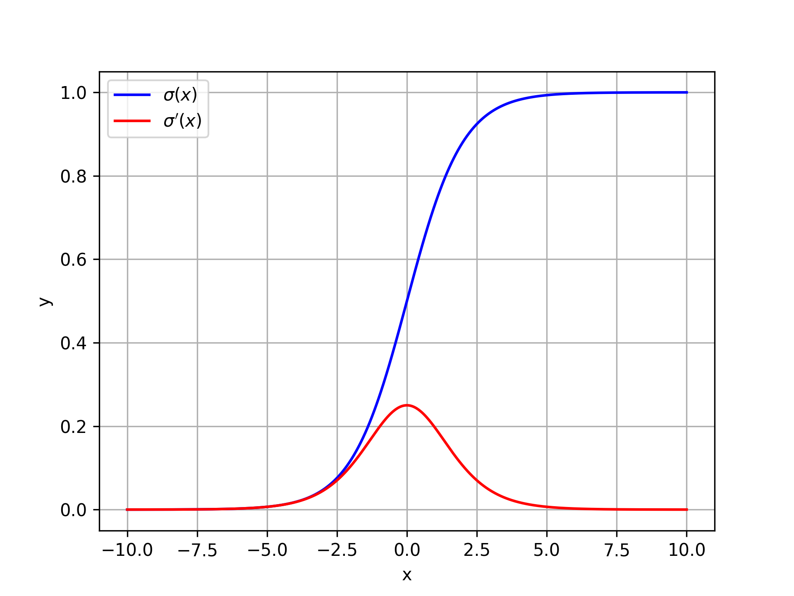

# Sigmoid function

## Instruction

​	Sigmoid 函数在Logistic 回归、神经网络等机器学习算法中频频出现，它在Logistic 回归中用来输出一个概率，在神经网络中作为一个激活函数……

​	总之，Sigmoid 函数在机器学习中非常常见，了解和掌握它的一些重要性质非常有必要。

## 定义

$$
\begin{equation}
\sigma(x) = \frac{1}{1+e^{-x}}
\end{equation}
$$

## 来源

Sigmoid 函数是怎么来的？为什么它是长成$\frac{1}{1+e^{-x}}$这样？为什么它刚好能表示概率？

为了解答这些问题，需要了解Sigmoid 函数的底层含义。

首先，考虑一个二分类问题，有两个类别$\mathcal{C}_0$和$\mathcal{C}_1$，并且给定一个样本$x$，求$x$属于$\mathcal{C}_0$的概率 $p(\mathcal{C}_0|x)$ 是多少?

根据贝叶斯公式，我们可以得到：
$$
\begin{equation}
\label{eq:bayes}
p(\mathcal{C}_0|x) = \frac{p(x|\mathcal{C}_0) p(\mathcal{C}_0)}{p(x)}
\end{equation}
$$
根据全概率公式，有：
$$
\begin{equation}
\label{eq:px}
p(x) = p(x|\mathcal{C}_0) p(\mathcal{C}_0) + p(x|\mathcal{C}_1) p(\mathcal{C}_1) 
\end{equation}
$$
将$\eqref{eq:px}$代入$\eqref{eq:bayes}$得：
$$
\begin{equation}
\label{eq:bayes_sub}
p(\mathcal{C}_0|x) = \frac{p(x|\mathcal{C}_0) p(\mathcal{C}_0)}{p(x|\mathcal{C}_0) p(\mathcal{C}_0) + p(x|\mathcal{C}_1) p(\mathcal{C}_1) }
\end{equation}
$$
等式右边可以化为：
$$
\begin{equation}
\label{eq:bayes_sub2}
p(\mathcal{C}_0|x) = \frac{1}{1 + \frac{p(x|\mathcal{C}_1) p(\mathcal{C}_1)}{p(x|\mathcal{C}_0) p(\mathcal{C}_0)} }
\end{equation}
$$
假设
$$
z= \ln \frac{p(x|\mathcal{C}_0) p(\mathcal{C}_0)}{p(x|\mathcal{C}_1) p(\mathcal{C}_1)}
$$
于是就有
$$
\begin{equation}
\label{eq:bayes_sub3}
p(\mathcal{C}_0|x) = \frac{1}{1 + e^{-z}}
\end{equation}
$$
这就是 Sigmoid 函数。

正因此，Sigmoid 函数求出来的是一个概率。

再来看看$z$代表什么含义，

$z$​其实就是**几率（odds）的对数**
$$
\begin{aligned}
z=& \ln \frac{p(x|\mathcal{C}_0) p(\mathcal{C}_0)}{p(x|\mathcal{C}_1) p(\mathcal{C}_1)} \\
=& \ln \frac{p(x|\mathcal{C}_0) p(\mathcal{C}_0)}{p(x)-p(x|\mathcal{C}_0) p(\mathcal{C}_0)} \\
=& \ln \frac{\frac{p(x|\mathcal{C}_0) p(\mathcal{C}_0)}{p(x)}}{1- \frac{p(x|\mathcal{C}_0) p(\mathcal{C}_0)}{p(x)}}  \\
=& \ln \frac{p(\mathcal{C}_0|x)}{1-p(\mathcal{C}_0|x)}
\end{aligned}
$$
其中$\frac{p(\mathcal{C}_0|x)}{1-p(\mathcal{C}_0|x)}$就是 $p(\mathcal{C}_0|x)$的几率

## 性质

> **对称性**
>
> 在x-y轴上的图像关于点 $(0, 0.5)$对称
> $$
> \begin{equation}
> 1-\sigma(x) = \sigma(-x)
> \end{equation}
> $$

证明：
$$
\begin{equation}
\begin{aligned}
1-\sigma(x) =& 1 - \frac{1}{1+e^{-x}} \\
=& \frac{e^{-x}}{1+e^{-x}} \\
=& \frac{1}{e^x+1}\\
=& \sigma(-x)
\end{aligned}
\end{equation}
$$

> **可微性**
> $$
> \begin{equation}
> \sigma^{\prime}(x)= \sigma(x) \sigma(-x)
> \end{equation}
> $$

证明：
$$
\begin{equation}
\begin{aligned}
\sigma^\prime(x) =& \frac{e^{-x}}{(1+e^{-x})^2} \\
=& \frac{1}{1+e^{-x}} \cdot \frac{e^{-x}}{1+e^{-x}} \\
=& \frac{1}{1+e^{-x}} \cdot \frac{1}{e^{x}+1} \\
=& \sigma(x) \sigma(-x)
\end{aligned}
\end{equation}
$$

> **推论：取对数后的导数**
> $$
> \begin{equation}
> [\ln \sigma(x)]^\prime = \sigma(-x)
> \end{equation}
> $$

证明：
$$
\begin{equation}
\begin{aligned}

\left[\ln \sigma(x) \right]^\prime =& \frac{1}{\sigma(x)} \cdot \sigma^\prime(x) \\
=& \frac{1}{\sigma(x)} \cdot \sigma(x)\sigma(-x) \\
=& \sigma(-x)
\end{aligned}
\end{equation}
$$
