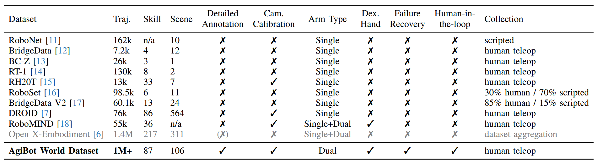
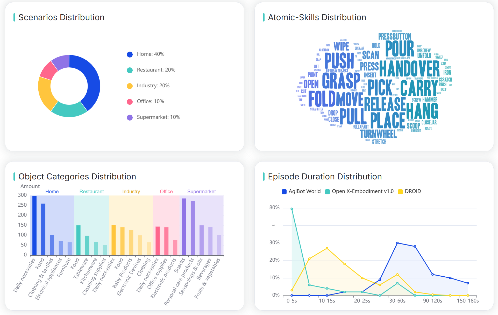
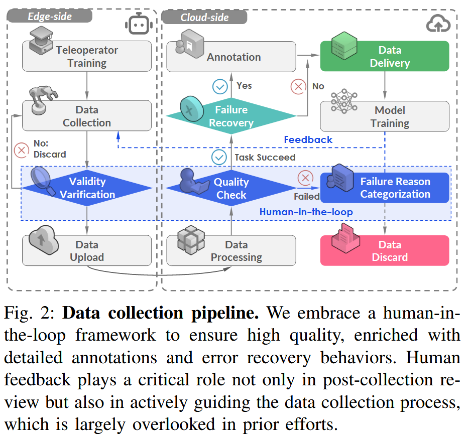

# AgiBot World

首发时间：2025-03-09

论文标题：***AgiBot World Colosseo: A Large-scale Manipulation Platform for Scalable and Intelligent Embodied Systems***

论文网址：https://arxiv.org/abs/2503.06669

代码仓库：https://github.com/OpenDriveLab/AgiBot-World

官网地址：https://agibot-world.com/

任务集：https://agibot-world.com/task-overview

## 研究的问题

How could we resolve the real-world complexity effectively by scaling up real-world robot data?

如何通过对现实世界的机器人数据进行扩展来有效地解决现实世界的复杂性。

> **数据采集工作的必要性**
>
> To achieve general purpose robotic intelligence, it is essential to develop datasets that scale in size and diversity while capturing real-world variability, supported by general-purpose humanoid robots for robust skill acquisition, a standardized data collection pipeline with assured quality, and carefully curated tasks reflecting real-world challenges.

## 现有工作的不足

### DROID

- 硬件设备受限：只有单臂
- 数据质量保证缺失

### Data scaling laws in imitation learning for robotic manipulation

Lin et al.[^1]  explored scaling laws governing generalizability across intracategory objects and environments, albeit limited to a few simple, single-step tasks. These efforts represent a notable advancement toward developing generalist policies, moving beyond the traditional focus on single-task learning within narrow domains

局限于简单的单步任务

### 与现有数据集的对比

## 本文的主要贡献

1. AgiBot World dataset
2. GO-1: a robot foundation policy

### AgiBot World

> **AgiBot World** 
>
> a large-scale platform comprising over 1 million trajectories across **217 tasks** in five deployment scenarios

#### 特点

- 5 major domains: domestic, retail, industrial, restaurant, and office environment
- large-scale: 1 million trajectories collected from 100 real robots
- Dataset is **high-quality** and **reliable**: Unlike prior datasets, AgiBot World dataset collection is carried out with a fully standardized pipeline, ensuring high data quality and scalability, while incorporating human-in-the-loop verification to guarantee reliability.

#### 本体设计

- **mobile** base **humanoid** robots with **whole-body control, dexterous hands, and visuo-tactile sensors (视觉和触觉传感器)**
- bimanual (双手人形)

#### 数据集规模

1,001,552 trajectories, with a total duration of 2976.4 hours, covering **217 specific tasks, 87 skills, and 106 scenes**.

#### 遥操作方式

- VR headset control
- whole-body motion capture control

#### Data Collection Pipeline

##### Failure recovery

> These trajectories, referred to as **failure recovery data**, constitute approximately one percent of the dataset. We consider them invaluable for achieving policy alignment [28] and failure reflection [29], essential for advancing the next generation of robot foundation models.

作者认为：failure recovery data 有利于policy alignment和 failure reflection 

### Model

To Read

## Reference

[^1]: *F. Lin, Y. Hu, P. Sheng, C. Wen, J. You, and Y. Gao, “Data scaling laws in imitation learning for robotic manipulation,” in ICLR, 2025.*

## Tasks List

327_Pickup items in the supermarket

351_Open the wardrobe and hang the clothes

352_Open the fridge to get food

354_Pickup items in the supermarket

356_Packing in the supermarket

357_Wash dishes with dishwasher

358_Toast bread

359_Sort in the warehouse

360_Packing in the supermarket

361_Flatten shorts

362_Fold shorts

363_Open the drawer to store clothes

365_Sort personal care products

366_Sort food

367_Take toast from toaster

368_Cook vegetables with oven

369_Remove clothes from the washing machine

372_Packing in the supermarket

373_Sweep the floor

374_Sort laundry and personal care products

375_Brew tea

376_Sort electronic products

377_Packing in e-commerce

378_Clear table in the restaurant

380_Packing in e-commerce

384_Insert a book into the bookshelf

385_Pickup in the supermarket produce section

388_Pickup in the supermarket

389_Pickup in the supermarket

390_Checkout and scan barcode in the supermarket

392_Brush water bottle

398_Sort clothes

410_Water Pouring in Restaurant

414_Hang clothes with hanger

421_Pick up the item to wipe away the stain

422_Pack items for industrial logistics

424_Clear the countertop waste

425_Prepare oatmeal porridge

428_Open drawer and store items

429_Install memory module

431_Brew coffee with a capsule machine

433_Make instant coffee

434_Remove capsules from the coffee machine

438_Place the pen into the pen holder

440_Iron clothes

444_Fold short sleeve

445_Open the fridge to get fruits and vegetables.

446_Transport table with another robot

451_Make a salad

452_Slice a lemon to make lemon water

453_Make a sandwich

454_Make a sandwich

455_Serve meals

460_Remove the pillowcase from the clothesline and place it in the basket

462_Discard the trash bag into the large bin

463_Clean the microwave and range hood

464_Replace the toilet paper roll

465_Wash clothes in the washing machine

466_Separate dark and light clothes

468_Remove clothes from the drying rack and place them in the basket

470_Tidy the tables at the milk tea shop

471_Organize the condiments on the stove

474_Arrange flowers

475_Ironing Clothes

477_Fold towels on the table

478_Wipe the mirror cabinet

480_Make sandwiches with salad dressing 1213 edition

483_Place items from the meeting room table into the storage box

485_Pick up the scrap paper on the desk and feed it into the shredder for destruction

486_Remove bottled water from the carton and arrange it neatly on the table

487_Remove bottled water from the carton and arrange neatly on the table

491_Iron clothes

492_Pack in the supermarket cashier

494_Organize the kitchen counter seasonings

497_Restock in the supermarket

498_Make milk tea

501_Clean the bathroom faucet

503_Store toys

504_Restock supermarket snacks

505_Sort maternity and baby products

506_Restock supermarket snacks

507_Prepare breakfast

508_Place items in the bag

509_Fold the towel

510_Stack dishcloth on the kitchen countertop

511_Return the showerhead to its holder

512_Wipe the whiteboard

515_Heat the food in the microwave

520_Fold shorts on the bed

521_Dispose of the trash on the desk

522_Replenish tissues in the meeting room

524_Dispose of the takeout box

525_Place cutlery in the restaurant

527_Arrange sofa

528_Boil water in the kettle

529_Wipe the toilet with a cloth

532_Packing permanent magnet ingot

533_Open the curtains

534_Close the curtains

535_Hang hair dryer

536_Pack groceries at the supermarket

537_Make the bed

540_Turn the TV on and off with the remote control

541_Clean toilet with a rag

542_Boil water with a kettle

543_Packing washing detergent

544_Wash the pot and spatula

545_Wash the dishes and silverware

547_Sort light and dark clothes

548_Separate dark and light clothes

549_Boil water with a kettle

550_Peel fruits and vegetables

551_Disinfect the countertop

554_Vacuum crumbs with a handheld vacuum

555_Fold shorts

556_Packing schoolbag

558_Pour water

561_Flatten and fold shorts

563_Remove the baked dessert from the oven

566_Place goods from the material box onto the shelves

567_Place goods from the material box onto the shelves

568_Place goods from the material box onto the shelves

570_Fold the T-shirt on the field

573_Open the drawer to store items

574_Produce ice with an ice maker

575_Store toys

577_Receive the menu

578_Disinfect the shelves with a sanitizing gun

580_Make juice

582_Discard the trash on the coffee table

584_Pack permanent magnet ingots

587_Pick up the pen on the desk and place it in the pen holder

588_Pack the box securely

589_Shred vegetables with a slicer

590_Place the desktop items into the felt bag

591_Untie the curtain ties and draw the curtains

593_Arrange fruits in a fruit bowl

595_Hand the menu

596_Place the inner pot with rice into the rice cooker to cook

597_Restock the hanging basket area

598_Pour the tea

599_Fold the shorts

600_Hang the key on the hook and place the bag in the storage box

602_Restock the hanging basket area

603_Scan the code to pack

604_Chop vegetables into cubes with a dicer

607_Scan and package the goods

608_Water the flowers

609_Restock the hanging basket area

613_Insert the pen cap

616_Fold T-shirts

619_Grab the toy

620_Print documents with a printer

621_Add the seasoning to the pot

622_Pack takeout

658_Fold the shorts

660_Pack the medicine

664_Hammer the toy

666_Close the pen cap

675_Insert the straw

676_Unplug the charger

677_Insert the plug

679_Confirm the meeting room status

681_Fold the shorts

682_Serve the meal

683_Serve the meal

688_Close the curtains

689_Lower the curtain

692_Draw the curtains

694_Twist the bottle cap

695_Turn on the fan

698_Restock tea bags

705_Shoot the basketball

707_Twist the bottle cap

708_Place name tags

709_Pack the medicines

710_Open the red wine

711_Mop the floor

712_Carry bottled water

714_Open the door and turn off the light

715_Insert the key and open the door

716_Stamp the document and place the reimbursement form in the reimbursement box

717_Deliver goods

719_Convey merchandise

722_Tighten the bottle cap

725_Scan security check

726_Lift dumbbells

727_Fetch water

729_Strike the gong

730_Clap hands

731_Wave goodbye

732_Roll the dough

734_Tie the curtain sash

735_Roll away stains with a lint roller

737_Peel the skin

739_Hand the menu

740_Receive the menu

741_Pack the fruits

744_Pack fruits

748_Scan for security check

749_Place the feed box

751_Slice the noodles

753_Knead dough

761_Carry books

762_Paint the wall

764_Move house

765_Adjust product placement

773_Milk the cow

774_Insert the key and open the door

779_Stamp the seal

781_Pass the water

782_Tidy the bar counter

783_Spread the tablecloth

785_Serve the meal

786_Tie the rope

787_Clear the dining table

790_Swipe toy cards
