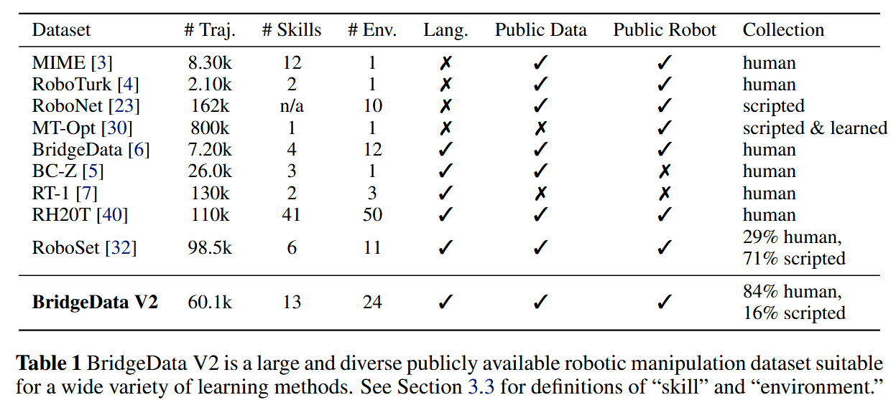
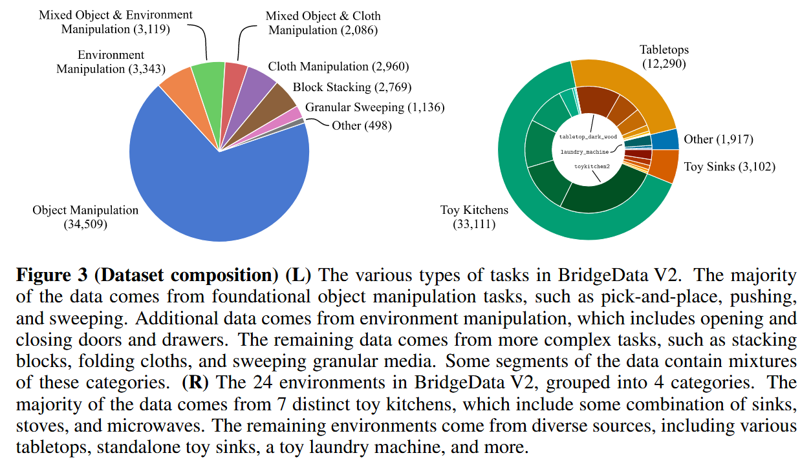

# BridgeData V2

首发时间：2023-12-02

论文标题：***BridgeData V2: A Dataset for Robot Learning at Scale***

论文网址：https://proceedings.mlr.press/v229/walke23a/walke23a.pdf

代码仓库：https://github.com/rail-berkeley/bridge_data_v2

官网地址：https://rail-berkeley.github.io/bridgedata/

任务集：https://rail.eecs.berkeley.edu/datasets/bridge_release/data/

## 现有工作的不足

- 现有的数据集大多都只是集中于单个领域的单个任务

- 多任务的数据集难以被研究者使用

注：这里的**scripted**是指 *通过程序脚本自动完成的行为*

## BridgeData V2

### 数据集规模

- 60,096 trajectories
  - 50,365 teleoperated demonstrations
  - 9,731 rollouts from a **scripted** pick-and-place policy
- 24 environments
- 13 skills

### 数据采集方法

1. 人工遥操作采集
2. 对于 pick-and-place data, 可以用一个高度随机化的脚本实现自动化。尽管这种方法偶尔会失败，但是相比于遥操作可以更快地自动地获取大量pick-and-place data

## 不足之处

1. The tasks in BridgeData V2 dataset are generally **low-precision** and **do not require complex manipulation of forces**.

带来的问题：

> This is reasonable for studying generalization but does **not cover the challenges** that might occur with **more forceful manipulation or more dynamic tasks**, such as throwing, moving heavy objects, or low-tolerance industrial insertion.

2. 需要覆盖更广泛的环境
3. BridgeData V2 dataset only chose an robot arm.

带来的可能方向：

> assemble **multi-robot datasets** that enable some degree of generalization across robot morphology.