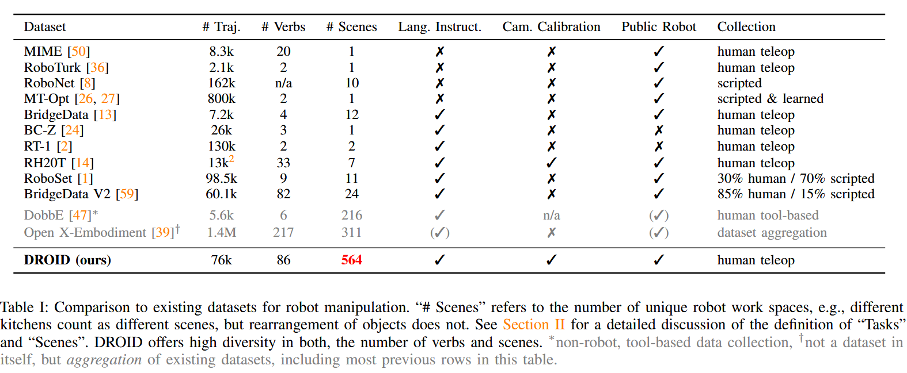
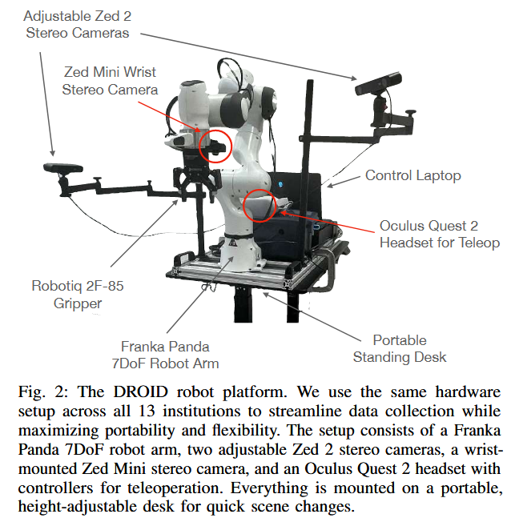
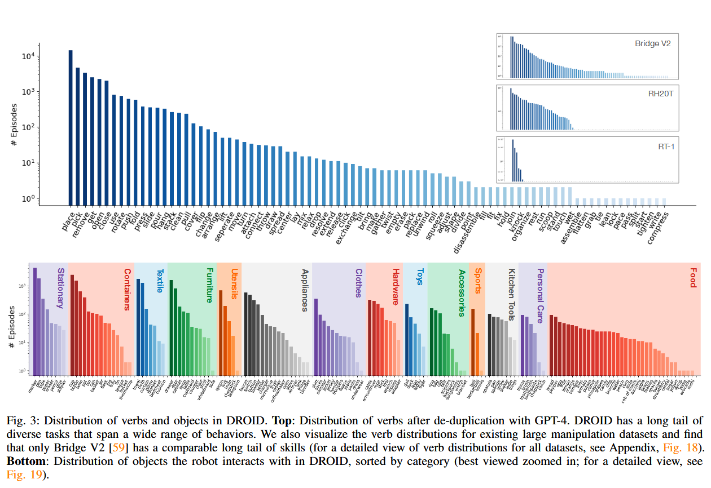
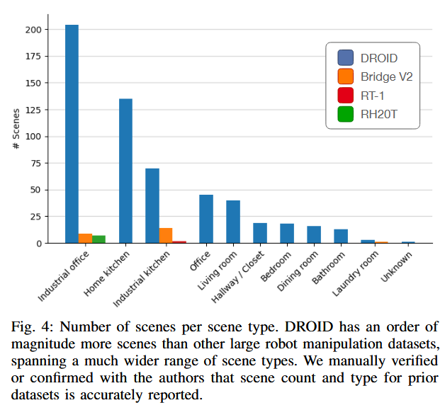
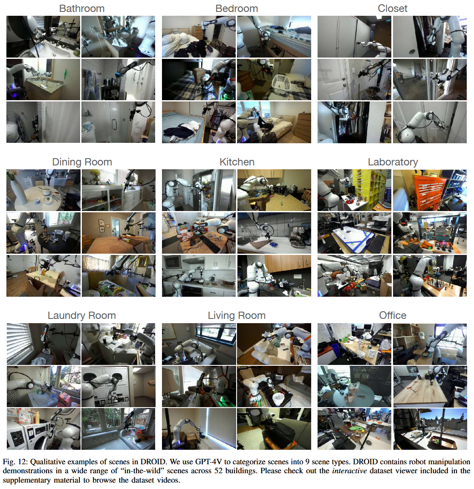
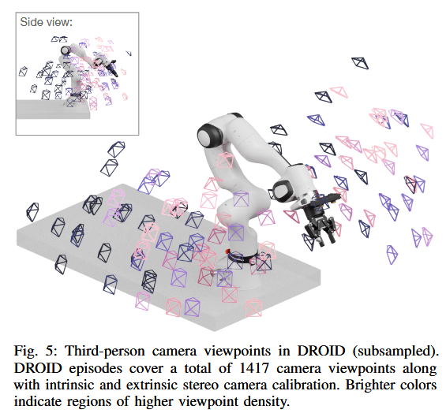
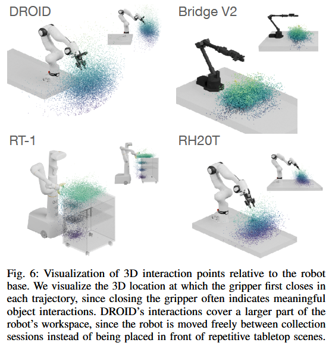
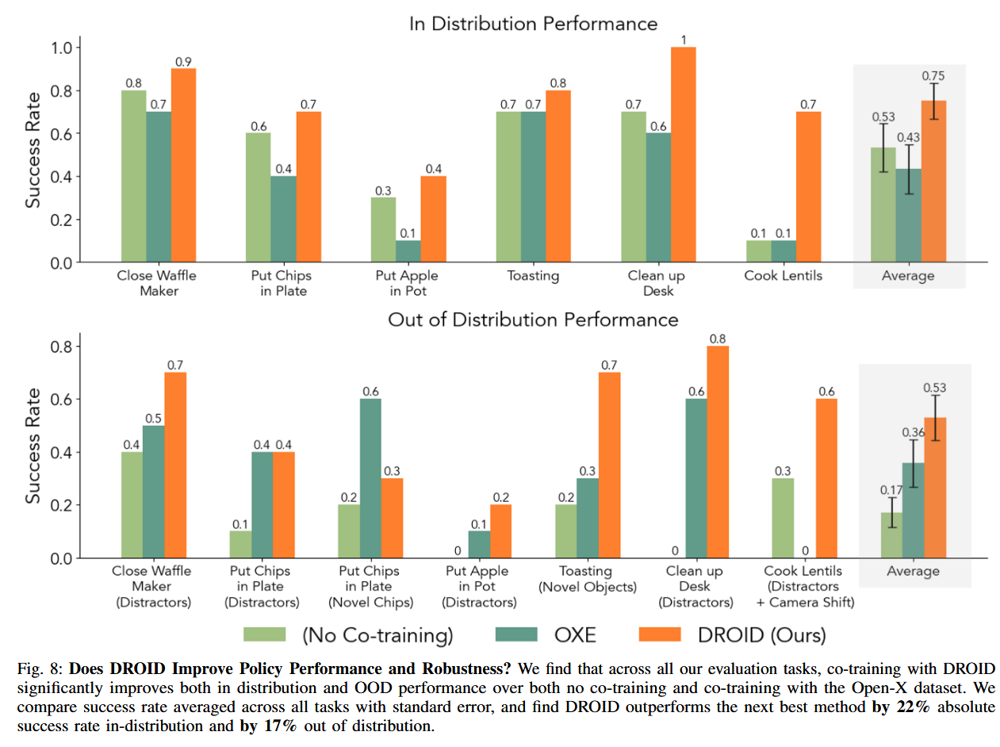
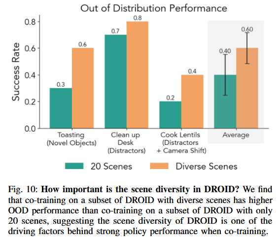
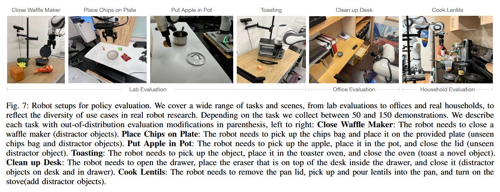

# DROID

首发时间：2024-03-19

论文标题：***DROID: A Large-Scale In-The-Wild Robot Manipulation Dataset***

论文网址：https://arxiv.org/abs/2403.12945

代码仓库：

- Hardware Code: https://github.com/droid-dataset/droid
- Policy Learning Code: https://github.com/droid-dataset/droid_policy_learning

官网地址：https://droid-dataset.github.io/

任务集：https://droid-dataset.github.io/visualizer/

## 与现有数据集的对比

## 本文的主要贡献

提出DROID数据集

## DROID

### 本体设计

### 数据采集

#### 协议

(1) preventing common data collection mistakes like “camera cannot see robot” or “teleoperator in camera view”

(2) encouraging collection of diverse data

(3) allowing data collectors to creatively choose scenes and tasks.

#### 数据集规模

> DROID consists of 76k successful episodes; roughly 16k trajectories in our data collection were labeled as “not successful”, which we include in our dataset release but do not count towards the size of DROID.

successful episodes：76k

not successful trajectories: 16k

#### 数据集特点

**多样性**

> DROID significantly increases diversity in **tasks, objects, scenes, viewpoints and interaction locations** over existing large scale robot manipulation datasets.

在5个方面提升了多样性：

- tasks (任务)
- objects (物品)
- scenes (场景)
- viewpoints (视角)
- interaction locations (交互的位置)

**数据集中动作、物品的分布特点**

##### Tasks and objects diversity

##### Scenes diversity 

下图是每类场景的任务数量

9 scene types

##### Viewpoint diversity

##### Interation locations diversity

下图是交互位置（第一次夹爪闭合的位置）的散点云图

### 结果

#### 评估方法

在2类测试下评估

1. **in-distribution**:  reflects the distribution of tasks in the in-domain demonstrations with noise added to the initial robot and object positions
2. **out-of-distribution (OOD)**: tests policy robustness e.g., by introducing distractor objects or switching the manipulated object.

对于Out of Distribution的测试

比较scene diversity 的作用

方法：使用来自**不同数量的场景**，但**相同数量的轨迹**来训练

- **DROID (7k, 20 Scenes**)：使用7362条轨迹，来自20个场景
- **DROID (7k, diverse Scenes**)：使用7362条轨迹，来自多个场景（从所有类别中**均匀采样**的）

结果发现：用**多个场景**的数据来训练，成功率更高

## 相关问题

> There are many open questions about how to best make use of such diverse data: 
>
> - How should we combine DROID with existing large-scale robot datasets?
> - How can we train policies that perform tasks in new scenes **without any in-domain data**? 
> - Can the diverse interaction data in DROID be used to learn better visual representations for robotic control? 
> - And in what situations is it helpful to train on the full dataset vs. slices of the data?

## Tasks List

详见任务集：https://droid-dataset.github.io/visualizer/

### Evaluation Tasks

