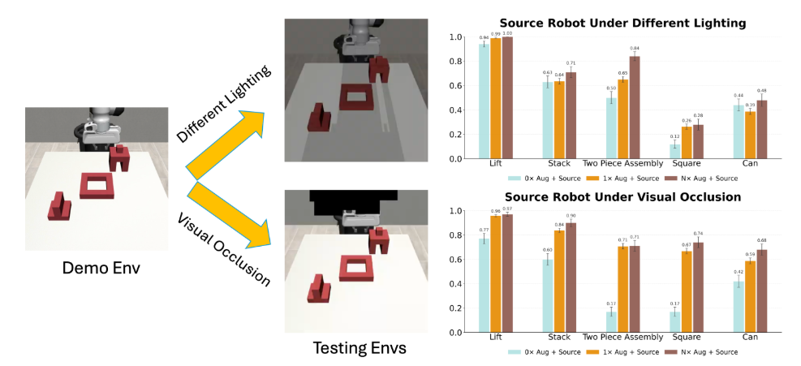
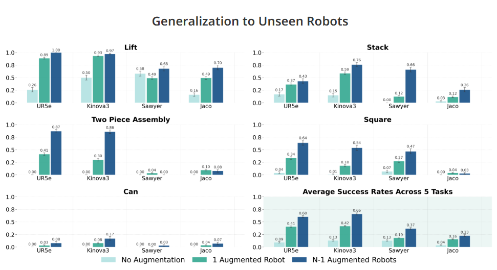
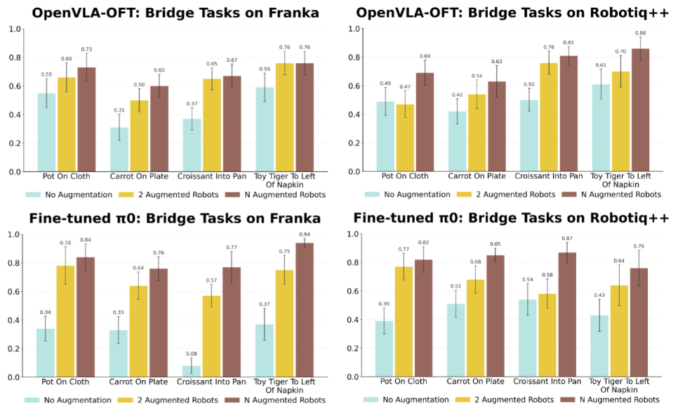
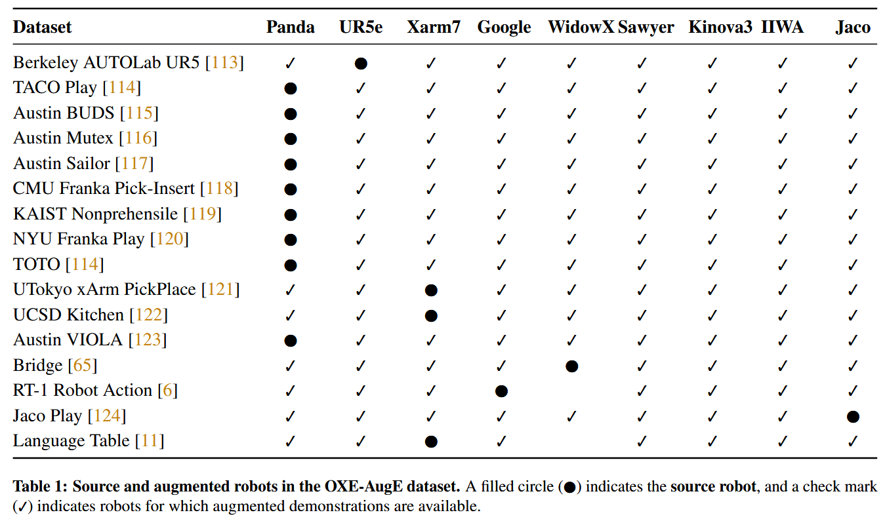
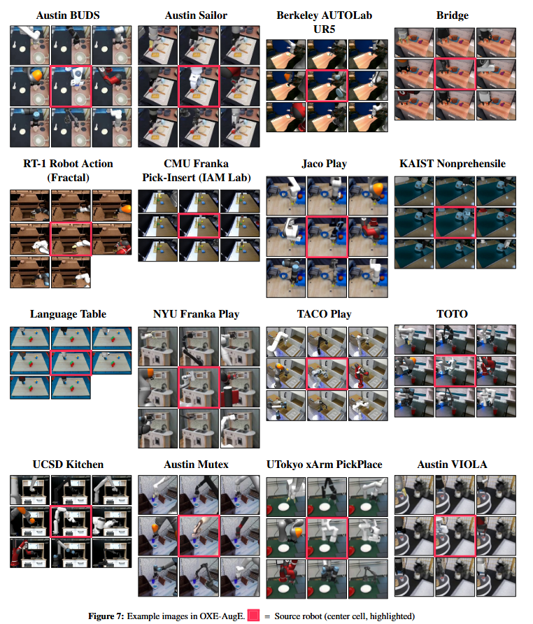

# OXE-AugE

首发时间：2025-12-15

论文标题：***OXE-AugE: A Large-Scale Robot Augmentation of OXE for Scaling Cross-Embodiment Policy Learning***

论文网址：http://arxiv.org/abs/2512.13100

代码仓库：https://github.com/GuanhuaJi/oxe-auge

官网地址：https://oxe-auge.github.io/

## OXE-AugE做了什么

> We conduct a systematic simulation study to examine how robot augmentation scales in terms of **transfer**, **generalization**, and **robustness**. While prior work has shown that augmenting from a source robot to a known target enables zero-shot transfer, our goal is to investigate **whether robot augmentation provides broader benefits when scaled across multiple target robots**

### 基本思路

类似于图像增强的方法，对机器人训练数据进行增强。

### 结果

#### 比较：增强后的数据对不同机器人本体的影响

#### 比较：增强后的数据对不同Policy的影响

结果表明，利用增强后的数据对机器人/Policy进行训练，可以大大提高鲁棒性和成功率。

## Task List

**16** datasets from OXE

