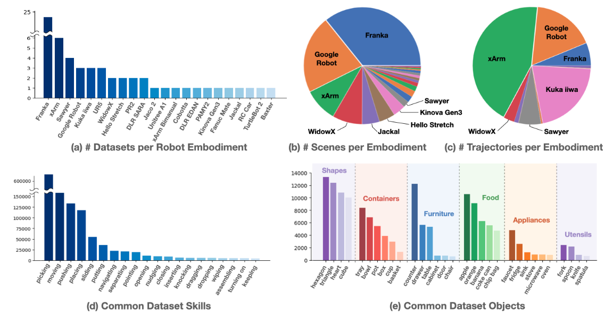

# Open X-Embodiment

首发时间：2025-05-14

论文标题：***Open X-Embodiment: Robotic Learning Datasets and RT-X Models***

论文网址：http://arxiv.org/abs/2310.08864

代码仓库：https://github.com/google-deepmind/open_x_embodiment

官网地址：https://robotics-transformer-x.github.io/

任务集：https://docs.google.com/spreadsheets/d/1rPBD77tk60AEIGZrGSODwyyzs5FgCU9Uz3h-3_t2A9g/edit#gid=0

## 本文贡献

1. 提出 Open X-Embodiment Dataset

2. 在该数据集上训练了**RT-X**模型

> Our empirical contribution is to demonstrate that several recent robotic learning methods, with minimal modification, can utilize X-embodiment data and enable positive transfer. Specifically, we train the RT-1 [8] and RT-2 [9] models on 9 different robotic manipulators. We show that the resulting models, which we call **RT-X,** can improve over policies trained only on data from the evaluation domain, exhibiting **better generalization and new capabilities**.

## Open X-Embodiment Dataset

> We assemble a dataset from 22 different robots collected through a collaboration between 21 institutions, demonstrating 527 skills (160266 tasks).

> Open X-Embodiment Dataset contains 1M+ real robot trajectories spanning 22 robot embodiments, from single robot arms to bi-manual robots and quadrupeds. The dataset was constructed by pooling 60 existing robot datasets from 34 robotic research labs around the world and converting them into **a consistent data format** for easy download and usage.

### 机器人本体

22 different robots，including：

- 单臂
- 双臂
- 四足机器人

### 规模

轨迹数量：1M+ real robot trajectories

任务数量：160266 tasks

技能数量：527 skills

### 来源

从60个**现有**的机器人数据集中**汇集**而成，然后转换成一致的数据格式

### 数据集特点

## RT-X

|                | RT-1                       | RT-2                       |
| -------------- | -------------------------- | -------------------------- |
| 训练数据       | only robotics mixture data | trained via co-fine-tuning |
| 推断时运行位置 | run locally                | on a cloud service         |
| 推断时运行频率 | 3-10Hz                     | 3-10Hz                     |

