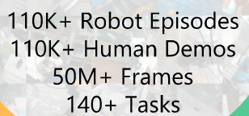

# RH20T

首发时间：2023-09-26

论文标题：***RH20T: A Comprehensive Robotic Dataset for Learning Diverse Skills in One-Shot***

论文网址：https://arxiv.org/pdf/2307.00595

代码仓库：https://github.com/rh20t/rh20t_api

官网地址：https://rh20t.github.io/

任务集：**[Task Description File](https://rh20t.github.io/static/task_description.json)**

## RH20T

### 数据集规模

we selected 48 tasks from RLBench, 29 tasks from MetaWorld, and introduced 70 self-proposed tasks that are frequently encountered and achievable by robots.

- 42 skills