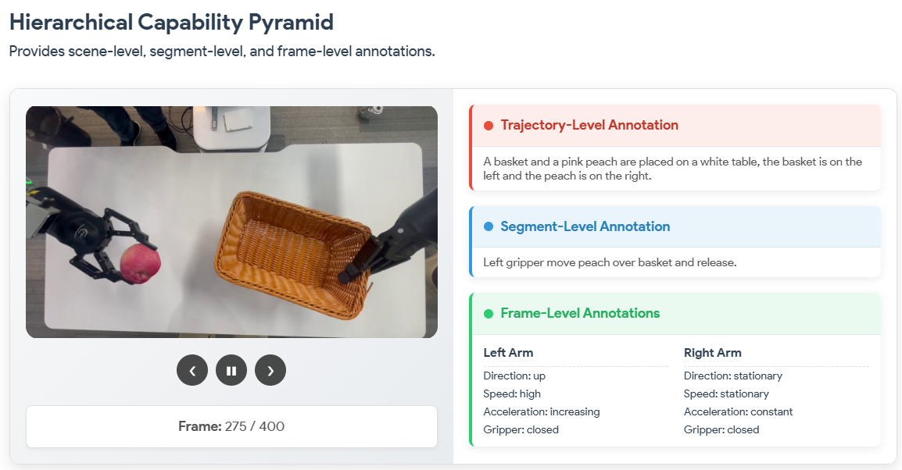
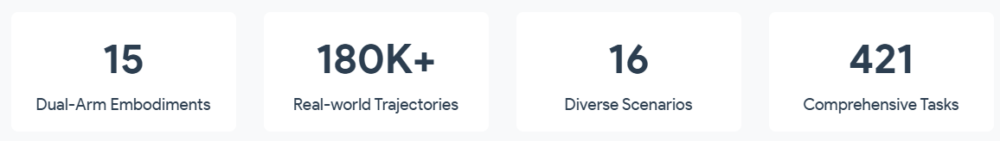
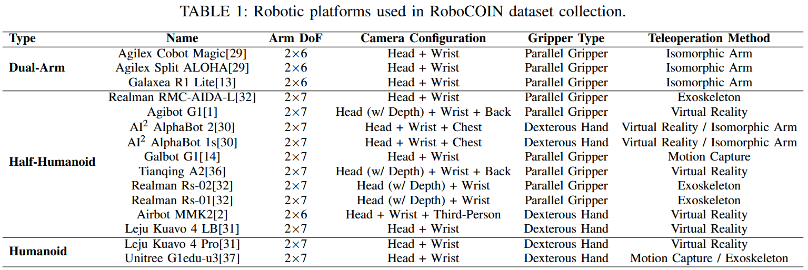
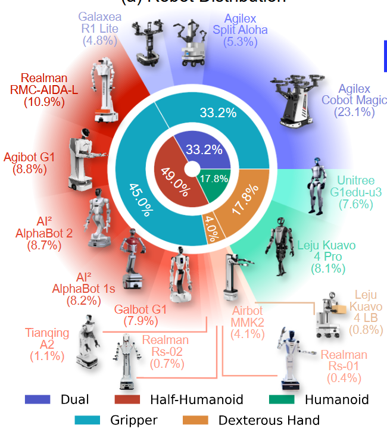
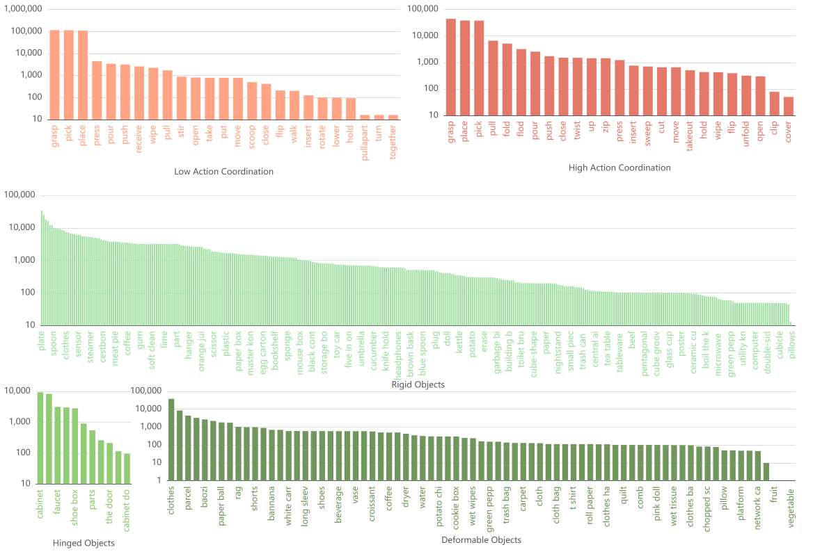
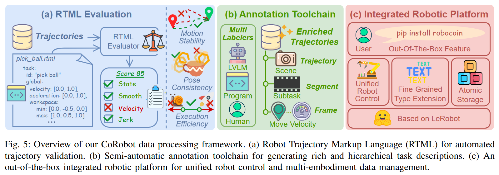
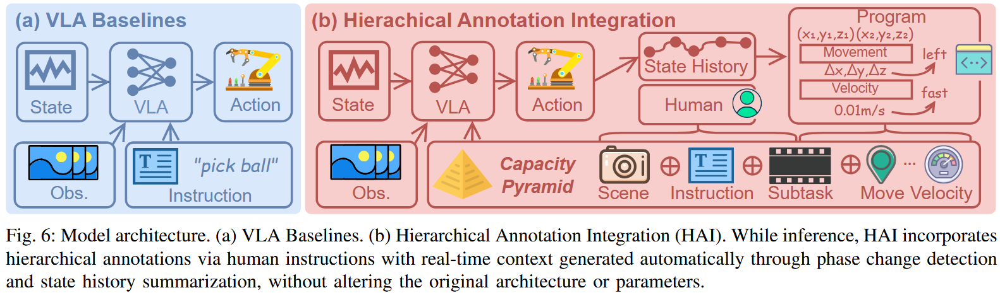

# RoboCOIN

首发时间：2025-12-15

论文标题：***RoboCOIN: An Open-Sourced Bimanual Robotic Data COllection for INtegrated Manipulation***

论文网址：https://arxiv.org/pdf/2511.17441

代码仓库：

- RoboCOIN：https://github.com/FlagOpen/RoboCOIN
- CoRobot：https://github.com/FlagOpen/CoRobot

官网地址：https://flagopen.github.io/RoboCOIN/

任务集：https://flagopen.github.io/RoboCOIN-DataManager/

## 研究的问题

由于硬件平台的异构性，现在缺乏大规模且多样的**双臂**机器人数据集

## 主要贡献

1. 提出RoboCOIN数据集
2. 提出一个综合处理框架CoRobot，采用机器人轨迹标记语言（RTML），用于质量评估、自动标注生成和统一多具身管理。

## RoboCOIN

> RoboCOIN, a comprehensive multi-embodiment bimanual manipulation dataset with over 180,000 demonstrations collected from 15 distinct robotic platforms.

### 关键创新

> Our key innovation is a hierarchical capability pyramid that provides **multi-level annotations**, **spanning trajectory-level concepts**, **segment-level subtasks**, and **frame-level kinematics**.

### 数据集规模

- **180,000 demonstrations** 
- **15 distinct robotic platforms**
- **16 scenarios** including residential, commercial, working environments
- **421 tasks** systematically organized by bimanual coordination patterns and object properties.

### 机器人本体

15 different robot models across **three categories**: 

- dual-arm
- semi-humanoid
- humanoid robots.

### 任务分类

Tasks are organized in a hierarchical grid based on **motion coordination** and **object variability**.

## CoRobot

> CoRobot, a comprehensive processing framework featuring Robot Trajectory Markup Language (RTML) for quality assessment, automated annotation generation, and unified multi-embodiment management.

注：Robot Trajectory Markup Language (RTML) 用于验证轨迹数据有无问题

## Hierarchical Annotation Integration for VLAs

### 基本思想

> Hierarchical annotation integration (HAI) improves robotic policy learning by **adding hierarchical information** to standard Vision-Language-Action (VLA) models.

### 模型架构

