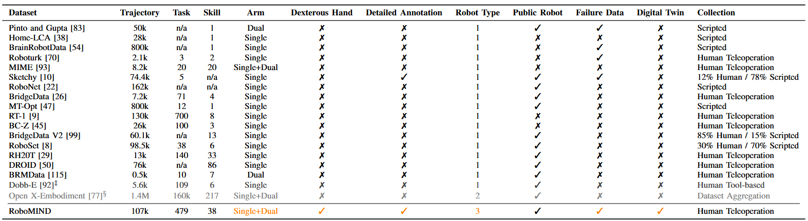
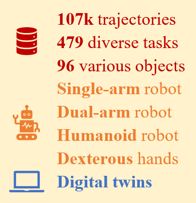
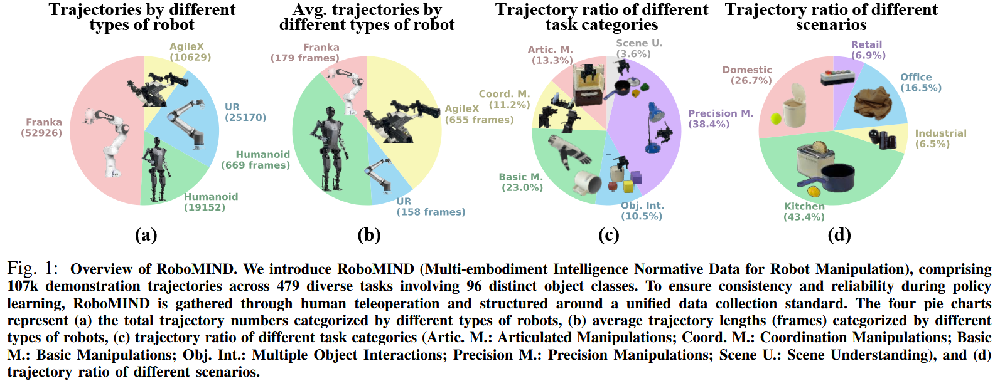
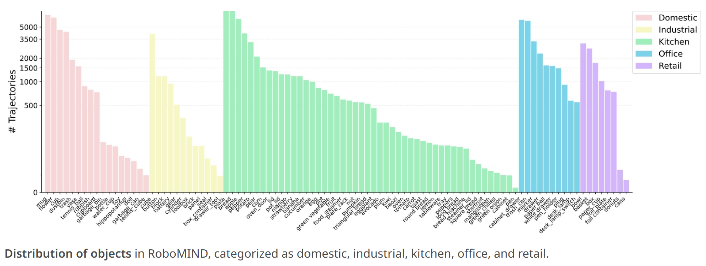
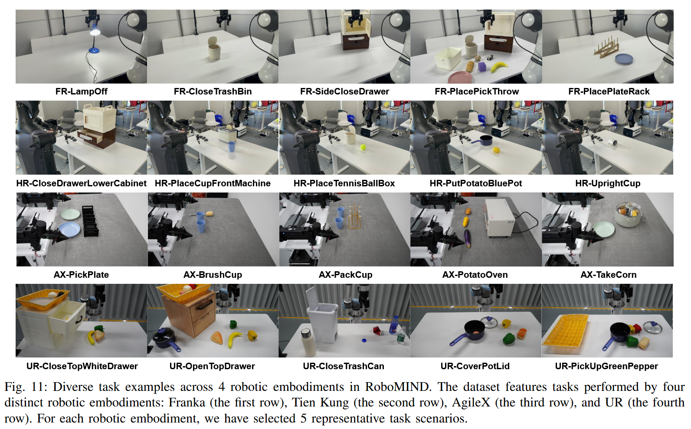

# RoboMIND

首发时间：2025-06-21

论文标题：***RoboMIND: Benchmark on Multi-embodiment Intelligence Normative Data for Robot Manipulation***

论文网址：https://arxiv.org/pdf/2412.13877

代码仓库：https://github.com/Open-X-Humanoid/x-humanoid-training-toolchain

官网地址：https://x-humanoid-robomind.github.io/

任务集：（官网里有，但是打不开）

## 现有工作的不足

与现有数据集合的比较

## RoboMIND 

> RoboMIND (Multi-embodiment Intelligence Normative Data for Robot Manipulation), a dataset containing **107k** demonstration trajectories across **479** diverse tasks involving **96** object classes. RoboMIND is collected through **human teleoperation** and encompasses comprehensive robotic-related information, including multi-view observations, proprioceptive robot state information, and linguistic task descriptions.

### 机器人本体

- single-arm robots (2 type): Franka Emika Panda and UR5e with grippers
- dual-arm robot (1 type): AgileX Cobot Magic V2.0 with grippers
- humanoid robot (1 type): Tien Kung equipped with dexterous hands

### 数据规模

- 38 skills

### 数据特点

Distribution of objects

## Task List

