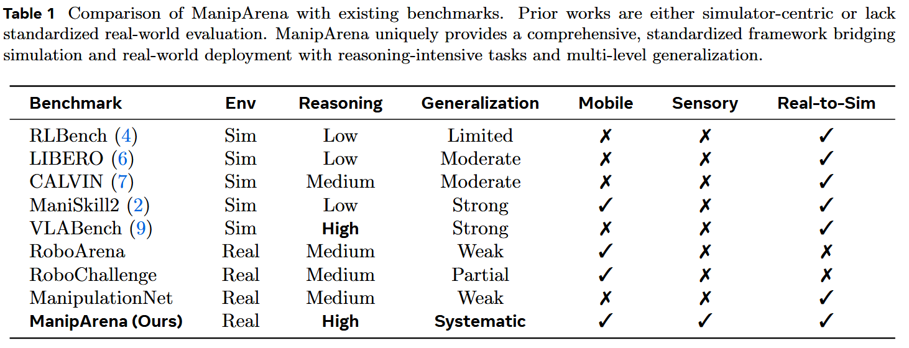
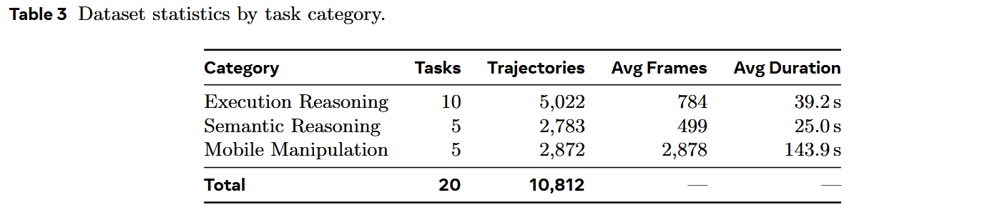
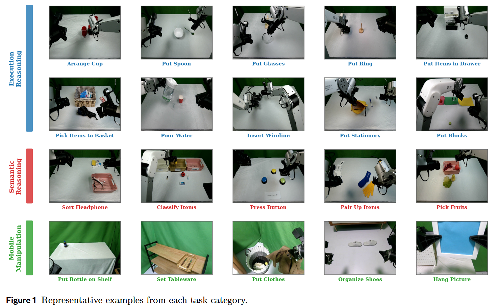
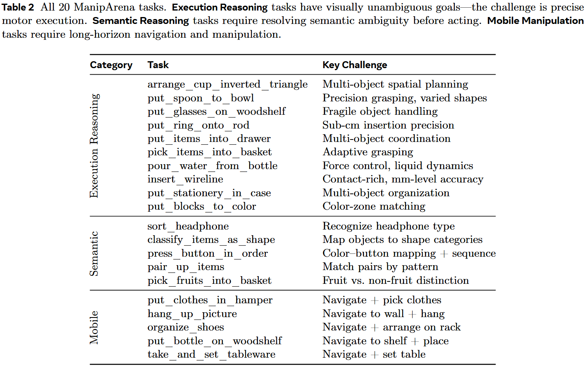
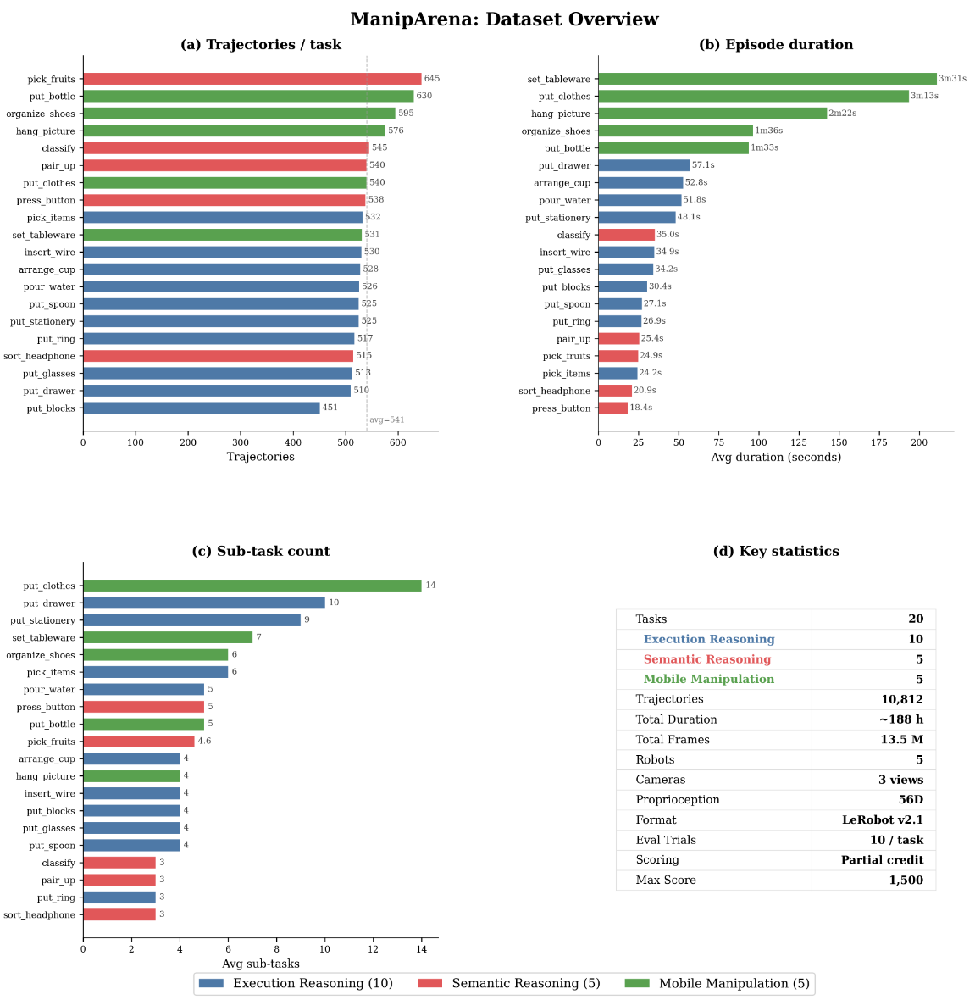
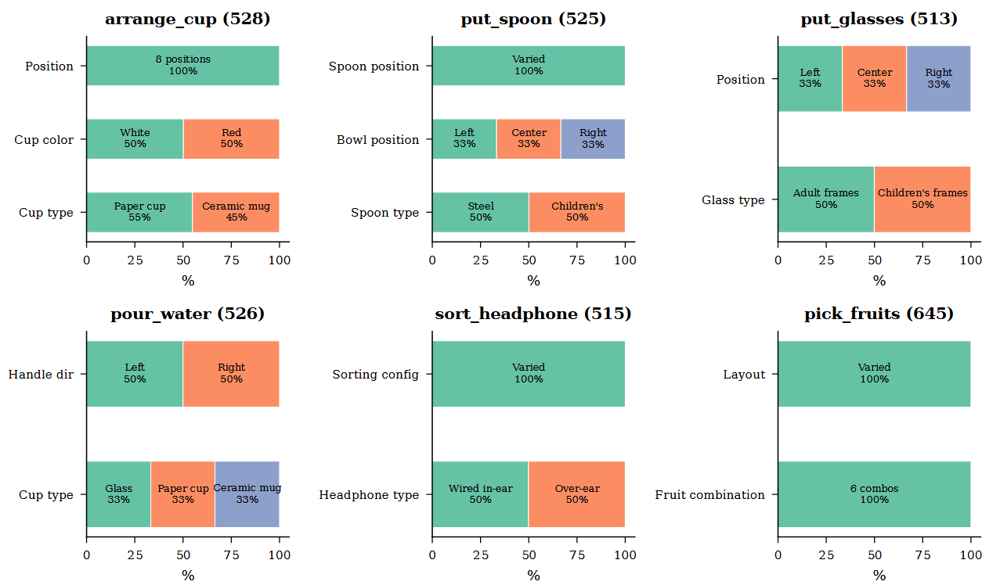
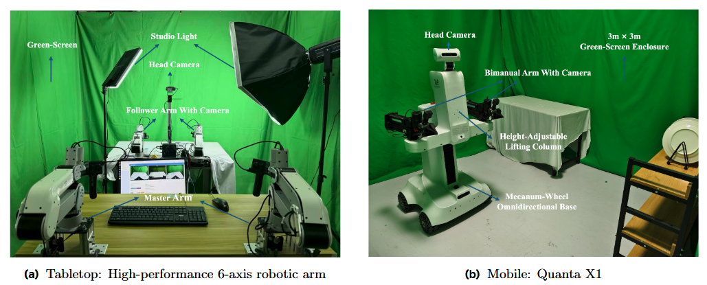
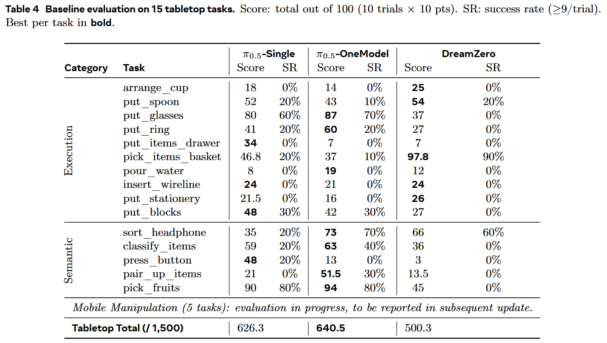
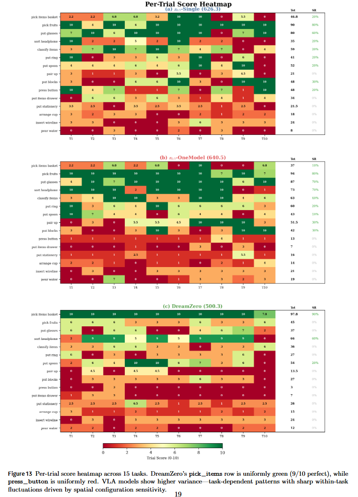

# ManipArena

论文标题：***ManipArena: Comprehensive Real-world Evaluation of Reasoning-Oriented Generalist Robot Manipulation***

论文网址：https://maniparena.x2robot.com/maniparena.pdf

代码仓库：https://github.com/maniparena/maniparena-repo

项目官网：https://maniparena.x2robot.com/

## 现有工作

## ManipArena

> ManipArena comprises 20 diverse tasks across 10,812 expert trajectories emphasizing reasoning-oriented manipulation tasks requiring semantic and spatial reasoning, supports multi-level generalization through controlled out-of-distribution settings, and incorporates long-horizon mobile manipulation beyond tabletop scenarios.

### 特点

1. Reasoning Oriented: incorporating complex spatial constraints, multi-stage bimanual operations, and semantic understanding
2. Multi-Level Generalization: controlled multi-level generalization through **a green-screen enclosed environment** with fixed lighting, systematic diversity guides for data collection, and layered out-of-distribution testing across object materials, appearances, and spatial configurations.
3. Mobile Manipulation:  Beyond tabletop tasks, ManipArena incorporates **long-horizon mobile manipulation** requiring navigation, spatial memory, and sustained whole-body control
4. Rich Sensory Diagnostics
5. Real-to-Sim Synchronization

### 评测协议

> participants expose a single HTTP endpoint that **accepts observation data** (camera images and proprioception) and **returns action commands**. The organizers’ infrastructure handles all robot control, data collection, and scoring.

这样设计的好处：

- **Low barrier to entry**: No specialized hardware required from participants.  
- **Reproducibility**: All trials run on identical hardware under identical conditions. 
- **Fair comparison**: No advantage from hardware optimization or latency. 
- **IP protection**: Model weights and code are never shared with organizers.

### 任务

#### 任务数据规模

- 20 tasks
- 10,812 expert trajectories
- 3 categories: Execution Reasoning (10 tasks), Semantic Reasoning (5 tasks), and Mobile Manipulation (5 tasks)

#### 任务集总览

### 训练

#### 训练集规模

Trained operators collect approximately **500 trajectories per task** (10,812 total across 20 tasks, ∼**188 hours**)

#### 训练多样性

| Level | Diversity                                       | test for what?            |
| ----- | ----------------------------------------------- | ------------------------- |
| 1     | Physical Attribute Diversity (Appearance layer) | perceptual generalization |
| 2     | Spatial Configuration Diversity (Layout layer)  | spatial generalization    |
| 3     | Semantic Composition Diversity (Task layer)     | semantic generalization   |

### 评测设计

#### 评测环境

用绿幕围绕着整个环境

##### 优点

1. Variable isolation 变量隔离：消除了因robot视觉变化带来的影响
2. Controlled illumination 光照可控
3. Reproducibility and portability 可重复性和便携性：可以在任何地方重复

#### 分层次评测

评测次数：10 evaluation trials per task

T1–T4 test **in-domain** competence with training-distribution objects in varied positions;

T5–T8 introduce **visual shifts**—appearance changes (e.g., different shape or color) within the training distribution;

T9–T10 present semantic OOD objects **unseen** during training.

#### 评分机制

分步骤（子任务）评分，完成一个步骤（子任务）就得到1分

## 本体

统一采用：X2Robot bimanual system

**Tabletop setup**: bimanual 6-DOF follower arms, a master-follower teleoperation interface, and 3 camera views (face, left wrist, right wrist)

**Mobile setup**: Quanta X1 mobile robot with bimanual ARX arms mounted on a mecanum-wheel omnidirectional base.

## Baseline Models

- $\pi_{0.5}$-Single (task-specific VLA).
- $\pi_{0.5}$​-OneModel (unified multi-task VLA)
- DreamZero (World Action Model)

### 评测结果

