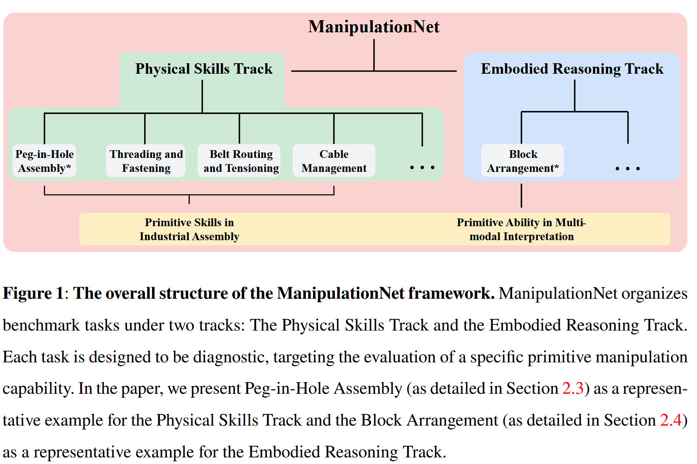
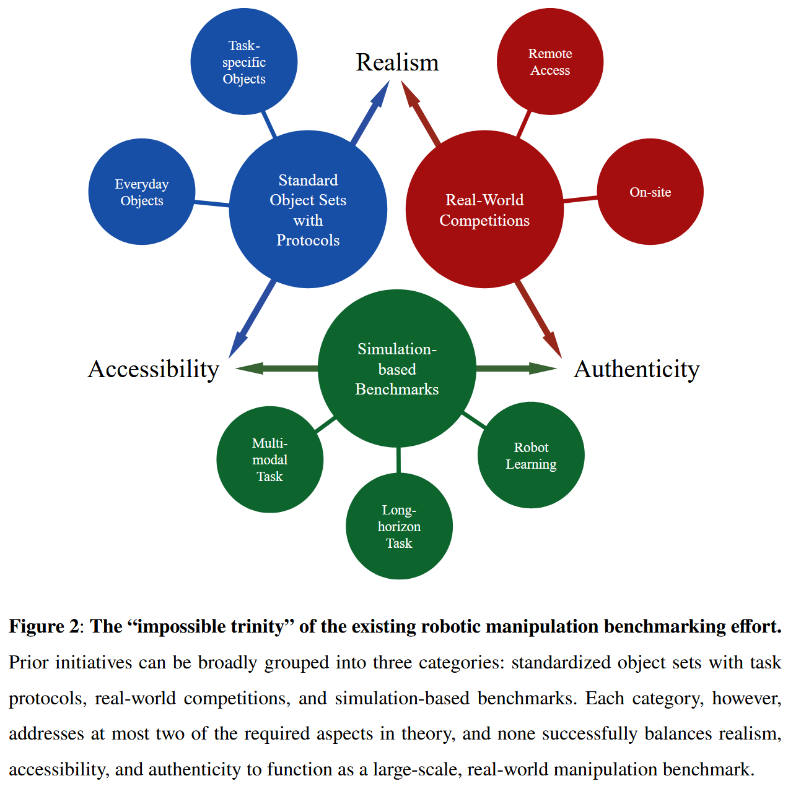
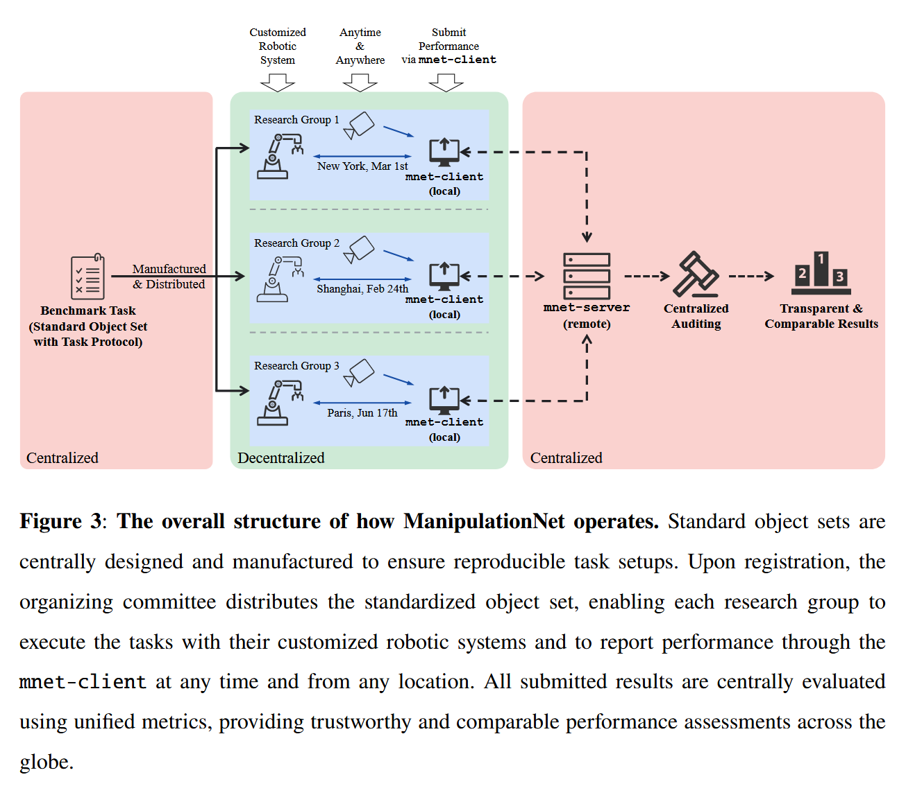
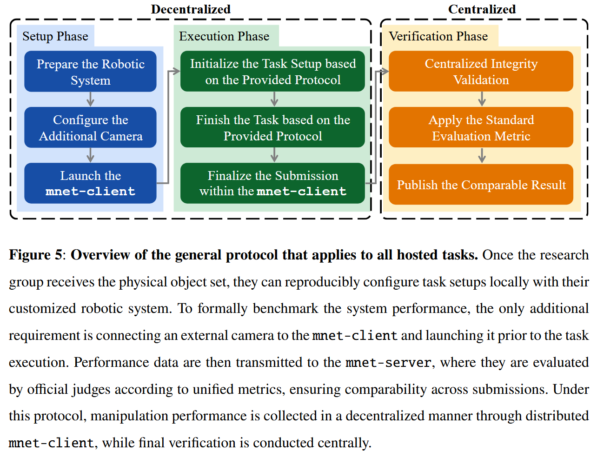
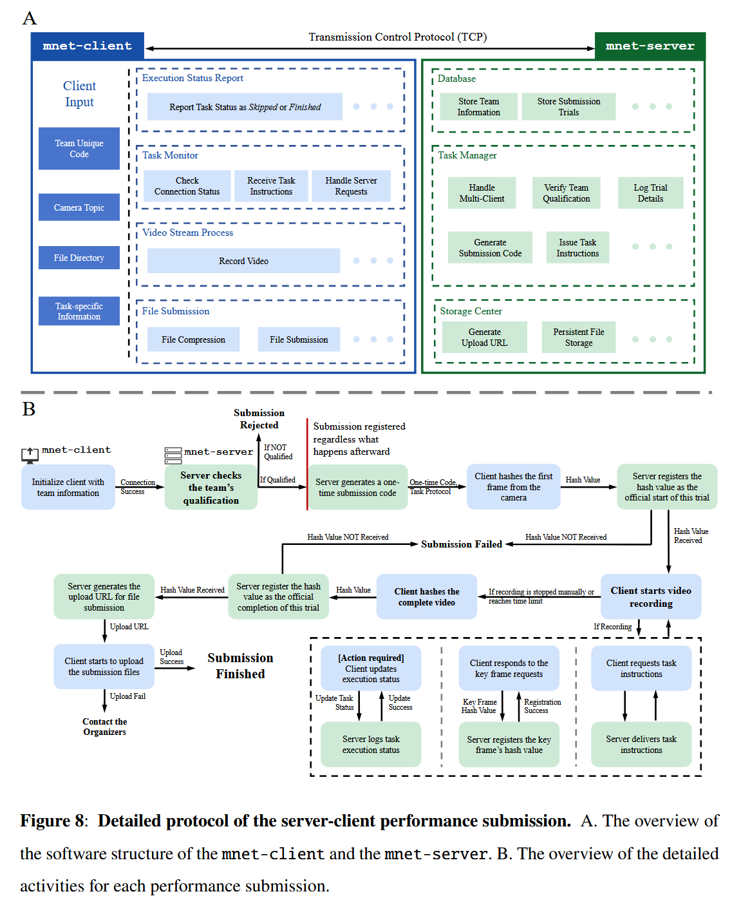

# ManipulationNet

论文标题：***ManipulationNet: Benchmarking Real-World  Robot Manipulation at Scale  through Physical Skill Challenges  and Embodied Multimodal Reasoning***

论文网址：https://manipulation-net.org/MNet_preprint.pdf

代码仓库：https://github.com/ManipulationNet/mnet_client

官方网站：[ManipulationNet - An Infrastructure for Benchmarking Real-World Robotic Manipulation](https://manipulation-net.org/)

## 概述

ManipulationNet delivers reproducible task setups through standardized hardware kits, and enables distributed performance evaluation via a unified software client that delivers real-time task  instructions and collects benchmarking results.

ManipulationNet通过标准化硬件套件提供可复现的任务设置，并通过统一的软件客户端实现分布式性能评估，该客户端可提供实时任务指令并收集基准测试结果。

## 研究的问题

目前的评测体系存在三类局限：

- **仿真基准**（如 RLBench、RoboSuite）虽然可扩展、可复现，但难以反映真实动力学与物理不确定性；
- **真实竞赛**（如 RGMC、Amazon Picking Challenge）虽具真实性，但设置受限、难以大规模开放；
- **标准化协议和对象集**虽推动了部分任务评测，但缺乏统一在线评估与长期可比性。
   这三者之间缺乏一个既具真实性、又易访问、可以全球范围参与的评测框架。

## ManipulationNet 的主要贡献

> ManipulationNet 是什么？
>
> ManipulationNet is a framework designed to host diverse tasks for  benchmarking real-world robotic manipulation at scale.

ManipulationNet 所托管的任务均具有诊断性质，每项任务都针对某一特定技能或能力。如Fig.1所示，该框架将任务划分为两个互补的赛道：

1.物理技能赛道（Physical Skills Track） 用以评估机器人在真实物理约束下的稳健传感–运动能力。

- 代表性任务：Peg-In-Hole Assembly（销钉插入孔）

2.具身推理赛道（Embodied Reasoning Track） 则关注推理与多模态理解，评估机器人如何将自然语言指令与视觉输入转化为适用的操作行为。

- 代表性任务：Block Arrangement（方块排列）

## 具体实现

​	ManipulationNet将**性能收集**与**结果验证**分离：**试验通过mnet - client分散收集，最终验证集中进行**。

​	该过程由一个Internet托管的mnet - server实时连接到分布式的mnet - client来协调。一旦启动mnet - client，试验立即在mnet - server上注册，以防樱桃采摘。在执行过程中，任务状态不断被记录；完成后，mnet - client提交录制的视频和执行元数据。完整性是通过设计来实现的，因为视频不能预先记录或更改，并且执行状态实时绑定到基准协议。 然后，提交的结果由管理委员会进行审计，以确保基准绩效在整个社区中保持可信赖、可复制和可比。

### 工作流程

在执行阶段，mnet - server首先生成随机的一次性提交代码，并传输给mnet - client。参与者必须在摄像头的视野范围内显示这个代码，将录音与会话唯一绑定，以确保所有事件在mnet - client初始化后发生。

从那时起，mnet - client和mnet - server保持安全、稳定的连接，通过这种连接，

1 ) mnet - client实时向mnet - server报告任务执行状态；

2 ) mnet - server向mnet - client传递任务指令，这可能涉及语言/视觉提示、任务特定指令等。当任务执行完毕后，mnet - client将录制的视频和执行日志发送到mnet - server。

### Server-client mechanism

为了平衡分散参与和集中信任，ManipulationNet采用了服务器-客户端机制，以确保任务提交的可访问性和可验证的完整性。每次提交包括完整的视频，涵盖任务初始化、执行和完成，并辅以实时执行日志和传输到mnet - server的选定关键帧。

为了最小化带宽需求，mnet - client在执行过程中**不流化原始视频**。相反，它**只传输轻量级的元数据，如任务事件、状态消息和视频帧的加密哈希**，即使在受限制的网络条件下也能保证可访问性。

为了保证每个试次的真实性，除了要求一次性提交代码在视频中保持可见外，mnet - server在任务执行过程中发出随机请求。对于每个请求，mnet - client在本地提取对应的视频帧，计算其哈希并将哈希值实时传输给mnet - server。同时，mnet - client需要实时地向mnet - server报告任务的执行状态，以便将来在相同时间戳对视频内容与报告的任务事件进行**交叉检查**.

机器人系统和网络客户端之间的通信是通过机器人操作系统( Robot Operation System，ROS )的服务和话题来实现的。在任务完成时，mnet - client计算整个视频的最终哈希，并将哈希传输到mnet - server进行完整性验证，然后才压缩并上传完整的提交包，包括完整的视频、选定的帧和元数据。由于所有与完整性相关的数据都已经实时记录，即使在网络条件差的情况下，上传也可能需要花费尽可能长的时间而不影响保证。

