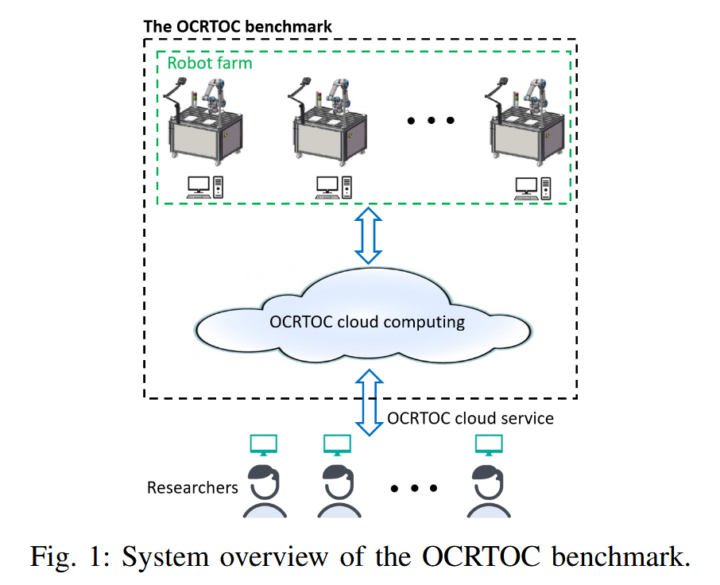

# OCRTOC

论文标题：***RoboArena: Distributed Real-World Evaluation of Generalist Robot Policies***

论文网址：https://arxiv.org/pdf/2104.11446

代码仓库：https://github.com/OCRTOC/OCRTOC_software_package

官网网址：https://www.ocrtoc.org/

## 概述

## 研究的问题

建立公平的性能评估工具和量化机器人操作领域的进展仍然是迄今为止的挑战。在过去的十年中，机器人界通过几个竞赛( e. g . [ 9,10 ])和基准测试协议( e. g . [ 11-13 ])来应对这一挑战。尽管在可重复性实验和性能评估方面取得了重大进展，但实验结果具有平台依赖性，即实验是在不同的平台上进行的，因此不能孤立地评估算法性能。

## OCRTOC 的主要贡献

researchers upload their solution through the OCRTOC cloud service, where their solution is evaluated both in simulation (using cloud computing) and on real robot hardware from the robot farm.

