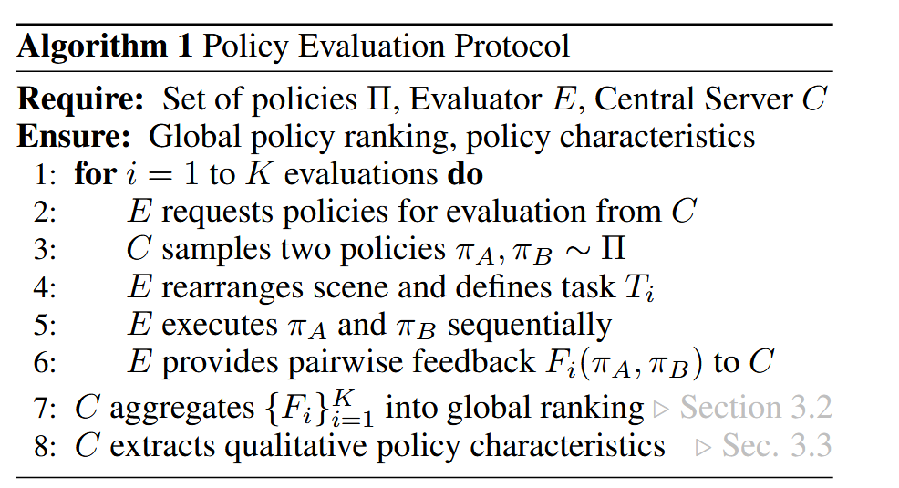
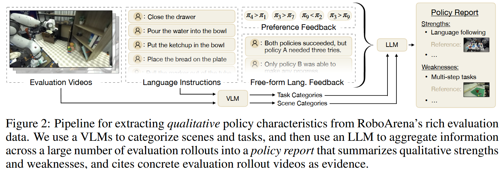
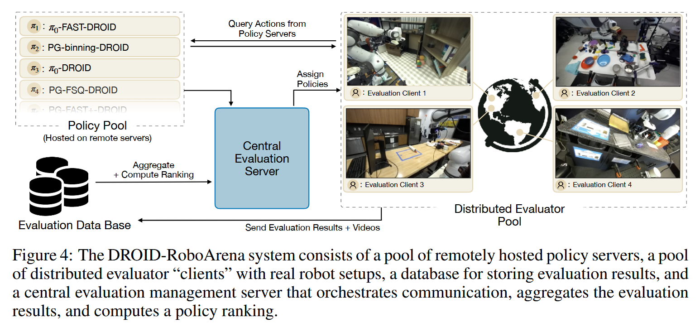

# RoboArena

论文标题：***RoboArena: Distributed Real-World Evaluation of Generalist Robot Policies***

论文网址：https://arxiv.org/pdf/2506.18123

代码仓库：https://github.com/robo-arena/roboarena

## 0 概述

这篇工作提出了一个**分布式真实世界评测平台 **RoboArena，用于系统性评估“通用型机器人策略（Generalist Robot Policies）”在真实环境中的泛化能力和鲁棒性。

作者证明，通过在分散的评估者网络中聚合评估，每个评估者对许多不同的任务和场景进行两两政策比较，RoboArena可以生成比传统的、集中的评估方法更准确的政策绩效排名，同时保留较高的评估样本效率。我们还介绍了用于LLM辅助分析评估结果的原型工具。我们将开源我们的RoboArena评估框架，并让其他研究人员有机会参与政策和评估，以使对通用型机器人政策的评估更具可比性。

## 1 研究背景

近年来，大模型方法在机器人领域迅速发展，比如：

- 视觉-语言-动作（VLA）模型
- 基于大规模数据预训练的通用策略
- 多任务、跨场景机器人控制

代表性工作包括：

- Google DeepMind 提出的 RT 系列模型
- Google Research 的 RT-2
- Stanford University 的 Mobile ALOHA

这些模型声称具备“泛化能力”，但存在一个问题：

> ❗ 评测通常是各家自测，**缺乏统一真实世界基准**。

------

## 2 核心问题

当前机器人评测存在四个痛点：

1️⃣ 数据分布不一致

不同实验室环境、光照、物体、机器人型号都不同。

2️⃣ 任务定义不统一

抓取、放置、操作等任务定义差异大。

3️⃣ 缺乏真实世界验证

很多工作在仿真中验证，现实世界表现未知。

4️⃣ 可重复性差

别人很难复现你的评测条件。

------

## 3 RoboArena 做了什么？

RoboArena 提出了一个：

> 🌍 **跨实验室分布式真实评测系统（a distributed real-world evaluation framework for generalist robot policies.）** 

核心思想是：

- 在多个独立实验室
- 使用不同机器人硬件
- 执行统一任务定义
- 用统一评测协议

来评估同一个通用策略。

### 3.1 主要作用

RoboArena relies on a decentralized network of evaluators that perform  pairwise, double-blind comparisons of policies in whichever scene and on whatever task they deem suitable. The evaluator then **provides a  preference** for which of the two policies performed better, along with a  free-form language explanation. Our evaluation algorithm aggregates a  large number of such pairwise comparisons into **a global policy ranking**,  as well as **a set of qualitative characteristics, strengths and  weaknesses for each policy**.

RoboArena依靠一个分散的评价者网络，在任何场景和任何他们认为合适的任务上对政策进行两两、双盲的比较。然后，评估人员提供了两种政策中**哪种表现更好的偏好**，并提供了自由形式的语言解释。我们的评估算法将大量这样的成对比较聚合成**一个全局的策略排名**，以及**每个策略的定性特征、优势和劣势的集合**。

### 3.2 去中心化评估的优点

This decentralized approach has multiple benefits: it is **open-ended**, since we do not standardize tasks and environments, thus broadening coverage; it is **robust**, since no single entity can easily sway results in double-blind, decentralized evaluations; it is **scalable**, since many institutions can collaborate on the evaluations; and it is **adaptable**, since tasks can naturally adapt to the frontier of policy capabilities.

这种去中心化的方法有多重好处：它是**开放式**的，因为我们没有标准化任务和环境，从而扩大了覆盖范围；它是**稳健**的，因为没有一个单一的实体可以轻易地摇摆结果，进行双盲、分散的评估；它是**可扩展**的，因为许多机构可以在评估方面进行合作；并且**具有适应性**，因为任务可以自然地适应政策能力的前沿。

## 4 系统结构

RoboArena 主要包含：

### 4.1 标准化任务协议

- 统一任务描述
- 明确成功判定标准
- 统一输入输出格式

### 4.2 分布式执行架构

- 每个实验室运行同一个策略
- 通过网络提交结果
- 中央服务器汇总评测数据

### 4.3 硬件多样性

- 不同机械臂
- 不同相机
- 不同工作台布局

用于测试真正的“泛化能力”。

## 5 具体实现

主要包含：

- **distributed evaluation protocol**, including algorithms for aggregating pairwise policy comparisons into global policy rankings, and for extracting qualitative policy characteristics via LLM-assisted analysis of evaluation results
- instantiate RoboArena on the DROID robot platform [1], on which modern policies can out-of-the-box generalize to new scenes and tasks [5].

### 5.1 Policy Evaluation Protocol

> The evaluation procedure

Assumption: 

- a set of policies $\Pi$, including $\pi_1, \cdots, \pi_N$​
- a pool of evaluators $E$​ that asynchronously run real robot evaluations
- a central evaluation server $C$ that manages the decentralized evaluation operation

Main procedure：

During an evaluation session, an evaluator E requests two policies from the central server C. C randomly samples two policies $(\pi_A, \pi_B) \in \Pi$ and assigns them to E. To ensure unbiased evaluation, the evaluators do not know which policies they are evaluating. In practice, we simply provide them with the IP addresses of remotely hosted evaluation servers. After policies are sampled, the evaluator arranges the evaluation scene, e.g., by moving the robot to a new location and rearranging the objects in front of the robot, and defines the evaluation task Ti in form of a natural language instruction. Then, E runs rollouts for policies πA and πB back-to-back until the task is completed or a fixed timeout is reached. Importantly, we require the evaluator E to closely match the initial conditions within this A/B policy comparison (while they can choose to change them between separate pairwise evaluations). This ensures that the comparison of policies πA and πB is fair.  

After both evaluations are complete, E provides feedback F (πA, πB) about the performance of the policies. We ask evaluators to provide three types of feedback: a continuous progress score ∈ [0 . . . 100] that is proportional to the maximum progress a policy achieved on the task (e.g., 0 for no progress, 100 for successfully executing the task, intermediate values for partial success); a binary, pairwise preference label that indicates which policy the evaluator preferred (we leave it to the evaluator to decide how to determine their policy preference); and a free-form, natural language explanation for why they preferred one policy over the other.  

After the task instruction T , pairwise feedback F , and recordings of all observations and actions are sent to the central server C, the evaluator may choose to continue with another evaluation session, or pause and return at a later time. All evaluations outside a single pairwise comparison can run fully asynchronously at any time or place.

### 5.2 Computing Global Policy Rankings

利用 Bradley–Terry model 建模  pairwise preference → ranking 

Extended BT: 让上面的Bradley–Terry model 可以适用于多任务机器人评测

采用 Bradley–Terry MLE 学习ranking 的参数

### 5.3 Extracting Qualitative Policy Characteristics

We pass the first images of each evaluation video and the corresponding task instruction to a VLM (OpenAI GPT-4.5) and ask it to categorize the task (e.g., pick-place vs. open-close vs. tool use) and describe the scene’s lighting, clutter, object visibility, etc.

We instruct the LLM to compare performance to other policies along the task categories, and to extract qualitative policy characteristics from the language feedback.

## 6 The DROID-RoboArena Evaluation System

### 6.1 RoboArena System Design

### 6.2 Open-Sourcing RoboArena: Interfaces, Safety and Incentives

#### Safety

we design multiple safety layers to prevent policies from damaging robot evaluation hardware: first, we test that any newly submitted policy server complies with the expected input and output formats. Then we run said policy in a “test environment” across a few different scenes and tasks with a specifically trained evaluator that is able to quickly intervene if a policy runs the danger of acting unsafely and damaging the robot (akin to a test driver for autonomous vehicles). Only after a policy passed these tests, we add it to the general pool and distribute it to evaluators.

## 7 Limits

### Cross-embodiment

本文的实验评估集中在DROID平台，未来的工作应该研究如何将RoboArena扩展到不同的机器人实施方案，并且仍然支持仅在特定的实施方案上进行评估的政策。

### Controlled experimentation

The design of RoboArena, which is focused on decentralized evaluation without restrictions on tasks or scenes, makes it challenging to perform experiments that only vary a single condition at a time (e.g. only camera angle, or only object position).

### Adversarial evaluators

While RoboArena’s distributed, double-blind evaluation scheme gives it an inherent robustness against individual influencing, we have **not investigated its robustness to intentionally adversarial evaluators that try to temper with evaluation results**, for example by providing random preference ratings or intentionally misleading language feedback. Future work should investigate how distributed robot evaluation approaches can be hardened against such tampering

### Over-optimization and Gotthart’s Law

While in robotics, the current (limited) performance of policies makes such over-optimization less likely, future work should critically examine whether evaluations with approaches like RoboArena remain well-correlated with perceived real-world policy performance.