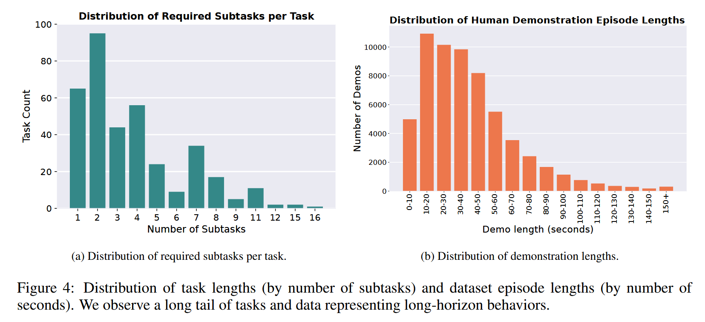

# RoboCasa365

论文标题：***RoboCasa365: A Large-Scale Simulation Framework for Training and Benchmarking Generalist Robots***

论文网址：http://arxiv.org/abs/2603.04356

代码仓库：https://github.com/robocasa/robocasa

官网地址：https://robocasa.ai/

## 概述

## 研究的问题

1. 训练通用机器人需要大量数据。但是现有的数据集缺乏多样性，涵盖的任务较少
2. 真机评估和基准测试消耗大量资源和时间，容易受到环境噪声的影响。

## RoboCasa365做了什么

RoboCasa365, a large-scale **simulation** framework for training and benchmarking generalist robot models. RoboCasa365 provides 2,500 realistic **kitchen** environments, 365 everyday tasks spanning over 50 activity categories, and over 2,000 hours of robot interaction data, making it one of the most diverse simulation resources to date.

RoboCasa365是一个用于训练和基准测试通用机器人模型的大规模**仿真**框架。RoboCasa365提供2500个逼真的**厨房**环境、涵盖50多个活动类别的365项日常任务，以及超过2000小时的机器人交互数据，使其成为迄今为止最多样化的仿真资源之一。

### 特点

- Comprehensive tasks
- Diverse environments
- Large-scale data
- Systematic benchmarking: RoboCasa365 supports rigorous evaluation across three learning settings: massively **multi-task training**, **foundation model training**, and **lifelong learning**.

## 具体细节

### ASSETS

增加物品数量，共有57类

### Scenes

2500个**厨房**场景

> We define each kitchen scene as a combination of **layout** and **style**, where the layout defines the floor plan, and the style defines the specific selection of fixtures, appliances, and textures used in the kitchen.

利用不同的layout 与 style 组合得到不同的scene，即
$$
\text{scene} = \text{layout} \times \text{style}
$$

### Tasks

> Nasiriany et al. (2024) define two broad categories of tasks: **atomic tasks**, which represent the execution of a single skill, and **composite tasks**, which involve executing a sequence of skills.

任务可以分为2类：

- **atomic tasks** 原子任务：共65个
- **composite tasks** 复合任务：共300个

Nasiriany et al 定义了8个atomic tasks，RoboCasa中有25个atomic tasks，本文中拓展到了65个atomic tasks

### Datasets

> Broadly, our datasets are divided into two categories: **pretraining** datasets for data from the pretraining scenes, and **target** datasets from the target scenes.

#### Pretraining datasets

300 tasks ( 65 atomic tasks + 235 composite tasks )

For each of these 300 tasks, we collect ***100 human demonstrations per task*** via robot teleoperation

#### Target datasets

从365个任务中，抽取了50个具有代表性的任务，可以分为3类：

- Atomic: 18 tasks
- Composite-Seen: 16 tasks
- Composite-Unseen: 16 tasks.  These tasks are **unseen in the pretraining data**

For each of these tasks, we collect ***500 human demonstrations*** via robot teleportation

#### Datasets statistics

-  Most tasks **require one or two subtasks**, but there are a few tasks that require **15 or more subtasks to complete**.
- The majority of episodes range from **10 to 60 seconds**, with a long tail end for longer horizon episodes, some going **beyond 3 minutes**.

### 结论

1. Generalist policies trained on large multi-task datasets can **acquire broad competence** but **still face challenges with long-horizon tasks** 
2. Pretraining data significantly **improves downstream learning**, with  both **scale and task diversity** playing key roles
3. **Lifelong  learning** remains an open challenge, with substantial trade-offs between  acquiring new tasks and retaining prior knowledge.

### Limitations

1. The benchmark is currently **limited to kitchen environments**, raise the question of how well findings transfer to other house hold settings or broader domains.
2. The dataset does not capture the full sensory and physical complexity of the real world, and bridging **the gap between simulation and real-world deployment** remains a significant challenge.

### Baseline models

4 种模型：

- Diffusion Policy

-  $\pi_0$ 
-  $\pi_{0.5}$​
-  GR00T N1.5

