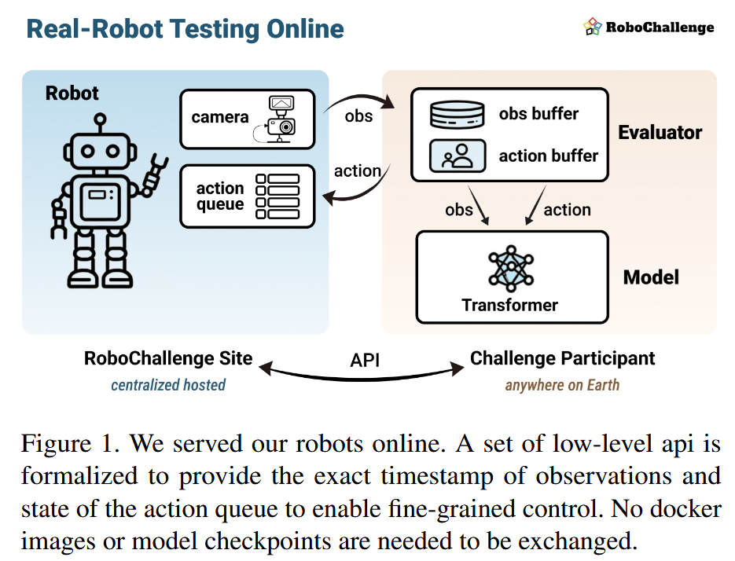
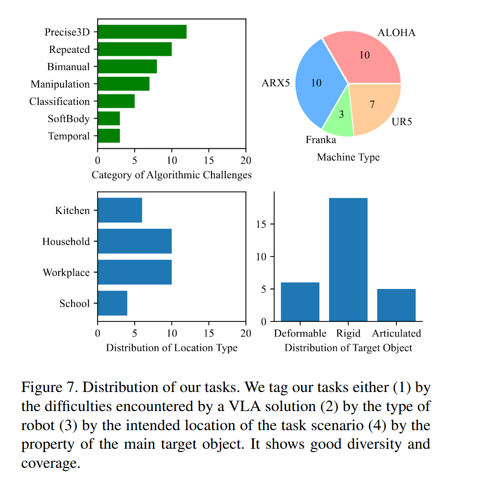
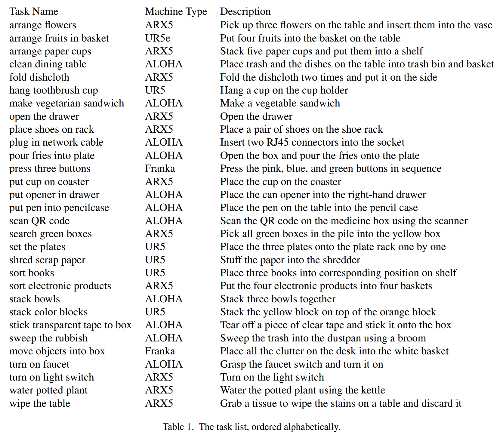

# RoboChallenge

论文标题：***RoboChallenge: Large-scale Real-robot Evaluation of Embodied Policies***

论文网址：https://arxiv.org/abs/2510.17950

代码仓库：https://github.com/RoboChallenge/RoboChallengeInference

## 概述

这篇论文提出了一个**大规模真实机器人评测基准 **(benchmark)，用于系统性评估具身智能（embodied policies）在真实物理环境中的表现。

具体而言，这篇论文并非关注 **某个具体模型如何训练**，而是：

✔ 描述如何构建一个 **真实机器人的基准评测平台**
✔ 定义评测协议与任务集合
✔ 提出远程真实机器人交互范式
✔ 说明评测的标准化、可复现与可扩展性
✔ 给出初期 benchmark 任务与评估指标 

## 研究的问题

在机器人控制和学习领域，**在真实机器人上测试算法是不可或缺的**，因为仿真往往无法完全反映真实世界中的复杂性。特别是当前流行的 **视觉-语言-动作（VLA）模型** 在真实机器人上需要大规模、可重复的评估。

但要做到大规模、可复现的真实机器人评估非常难，包括机器人平台差异、环境设置、测试人员操作带来的噪声等问题。

## RoboChallenge做了什么

### 实现方法

The method we used is called the “**remote robot**” paradigm, illustrated in Fig. 1

#### 工作流程

The user access our camera by sending a capture request, and they will receive a set of precisely timestamped observation (RGB, depth and proprioception). At the same time, the user can post actions (with their corresponding duration time) into our action queue. Our robot will sequentially pop the actions in a FIFO order, and inform the user of the current length of the queue through our API.

#### 优点

In this way, all actions sent to the queue is irrevocable, and access to the camera and the robot can be fully asynchronous. Users never need to provide a publicly accessible API for us to call. Instead, they call ours. This makes life easier for users behind Network Address Translation (NAT).

#### 传输层协议

TCP

### Table30 Benchmark

推出了第一个大规模真实机器人评估基准 **Table30**，包括 **30个围绕固定桌面操作的任务**（例如物体识别、精确 3D 定位、软体操作、双臂协作等），以考察不同能力维度。

任务的多样性如下图所示：

具体的任务名称如下表所示：

设计了 **成功率 + 进度得分（Progress Score）** 的评价体系，使得即便未完成整个任务，也能衡量算法部分完成情况.

对于每次评测，总的得分点数为10。对于每个任务，我们会进行10轮评测，所以一个任务的总得分数为100

### Baseline Model

在 Table30 基准上评估了几种主流 VLA 模型（如 π0、π0.5、CogACT、OpenVLA/OFT）：

- 结果显示 **微调版本 π0.5 的表现最好**，无论是在针对每个任务的专门训练还是泛化设置上。
- 分析说明一些任务（如时间依赖性强或软体处理）对当前 VLA 模型仍然具有显著挑战性