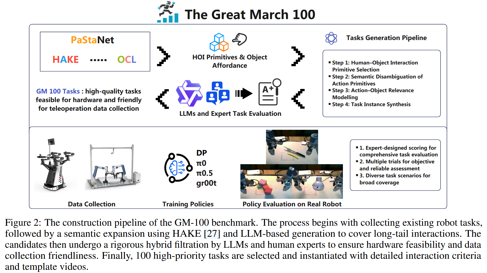
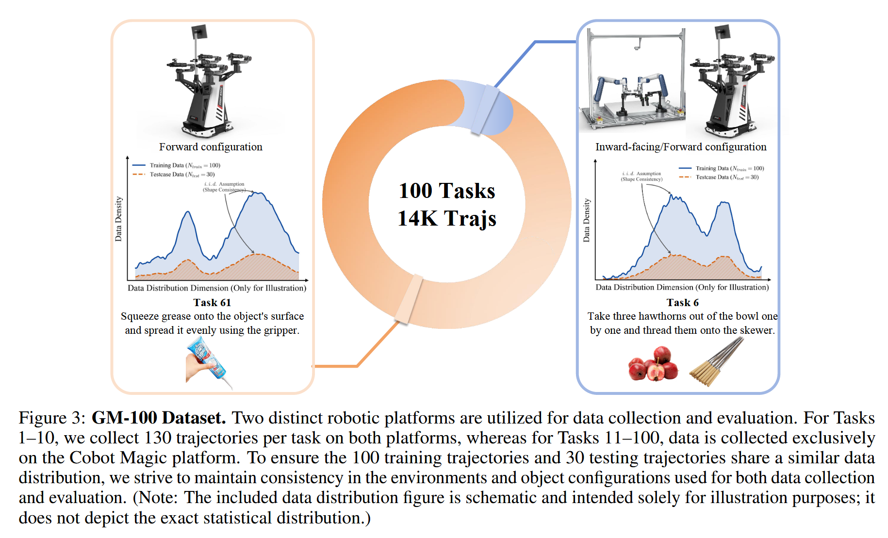

# The Great March 100

论文标题：***The Great March 100: 100 Detail-oriented Tasks for Evaluating Embodied AI Agents***

论文网址：https://arxiv.org/pdf/2601.11421

官网网址：https://rhos.ai/research/gm-100

## 概述

针对当前数据集和任务集中在少数常见任务和行为上，缺乏对复杂和长程任务的覆盖，本文提出The Great March 100。GM - 100由100个精心设计的任务组成，涵盖了广泛的交互和长程行为，旨在提供多样化和具有挑战性的任务集，以全面评估机器人智能体的能力，并促进机器人数据集任务设计的多样性和复杂性。

## 研究的问题

Current datasets and tasks (e.g. Open X-Embodiment, Agibot, RoboCOIN) often focus on a few common tasks and behaviors. After removing duplicates and categorizing them based on their semantic meanings, most tasks concentrate on very common behaviors such as “pick and hold”, while **lacking coverage of complex and long-tail tasks**. This singular task design leads to significant biases in the trained models, limiting their applicability in real-world scenarios as pre-trained models, except for a few common tasks.

当前的数据集和任务 (比如：Open X-Embodiment, Agibot, RoboCOIN) 往往集中在少数常见任务和行为上。在去除重复项并根据语义进行分类后，大多数任务都集中在“拾取并握住”等非常常见的行为上，而**缺乏对复杂和长程任务的覆盖**。这种单一的任务设计导致训练出的模型存在显著偏差，限制了它们作为预训练模型在现实场景中的适用性，仅适用于少数常见任务。

Similarly, current evaluation tasks suffer from analogous issues. Most studies, when proposing new methods, tend to test only on a few common tasks, without a unified task design standard, making fair comparisons across different works difficult.

类似地，当前的评价任务也存在类似的问题。大多数研究在提出新方法时，往往只在几个常见的任务上进行测试，没有一个统一的任务设计标准，使得不同作品之间的公平比较变得困难。

## The Great March 100 的主要贡献

GM-100 consists of 100 carefully designed tasks that cover a wide range of **interactions** and **long-tail behaviors**, aiming to provide a diverse and challenging set of tasks to comprehensively evaluate the capabilities of robotic agents and promote diversity and complexity in robot dataset task designs.

To summarize, in this report, we *make the following contributions*: 

 • We **identify the limitations of existing robot task designs and evaluations**, highlighting the need for more diverse and complex tasks.  

• We propose **GM-100**, a task list consisting of 100 detail-oriented tasks that cover a wide range of interactions and long-tail behaviors.  

• We **collect a medium-sized dataset** on robotic platforms and **evaluate several baseline models**, demonstrating the challenge and effectiveness of GM-100.

## 具体实现

### Hardware platform

目前有两个本体：

- Agilex Cobot Magic: all 100 tasks 
- Dobot Xtrainer: 10 tasks

### Data distribution

For each task, we first collect 100 trajectories with different initial conditions and design perturbations to ensure diversity in position, orientation, and object placement. Then, we collect another 30 trajectories with similar distributions to the first 100 trajectories. These 30 trajectories are used to align the test cases during evaluation, which ensures that the test cases remain consistent across different checkpoints or different models.

对于每个任务，我们首先收集了100条具有不同初始条件和设计扰动的轨迹，以确保位置、方向和物体放置的多样性。然后，我们收集了另外30条与前100条轨迹具有相似分布的轨迹。这30条轨迹用于评估时对齐测试用例，保证了测试用例在不同检查点或不同模型之间保持一致。

即：

- 前100条轨迹用于训练

- 另外30条数据用于测试

### Baseline Model

 including:

- DP
- π0
- π0.5
- GR00T

These models are either trained from scratch (for DP) or fine-tuned (for VLA models) on the collected 100 trajectories for each task until convergence.

### Evaluation Metrics

- Success Rate (SR)
- Partial Success Rate (PSR)
- Action Prediction Error: The mean squared error (**MSE**) and **L1 loss** between the predicted actions and ground truth actions in the specific prediction window on the test trajectories.