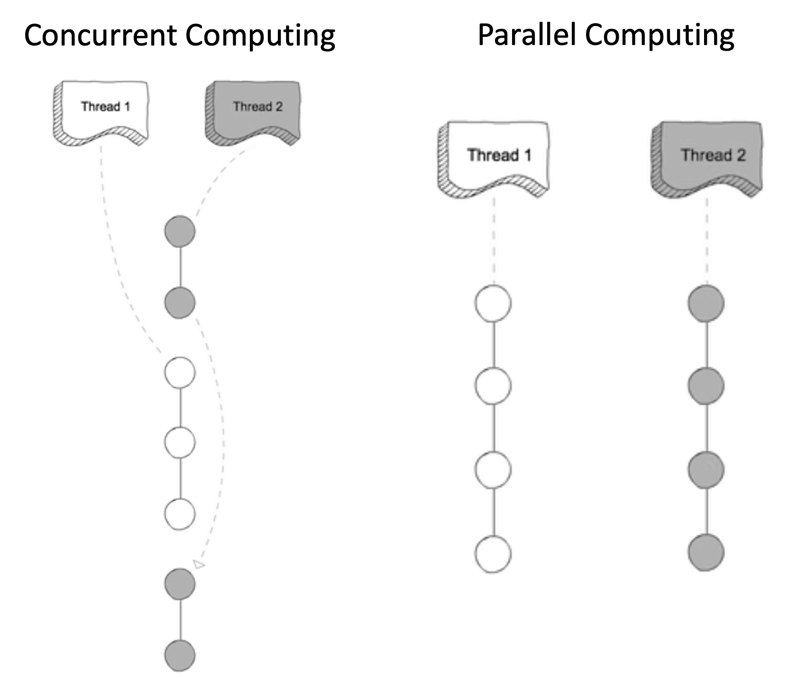
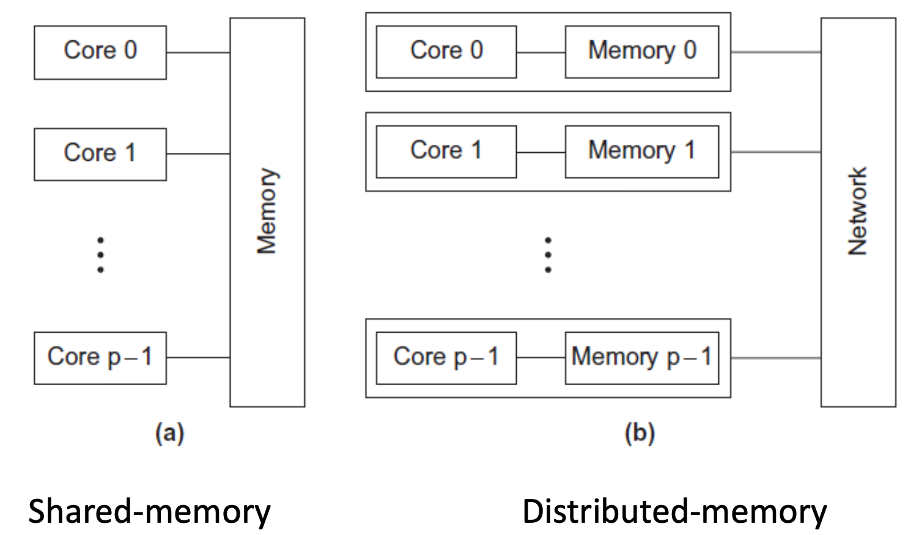
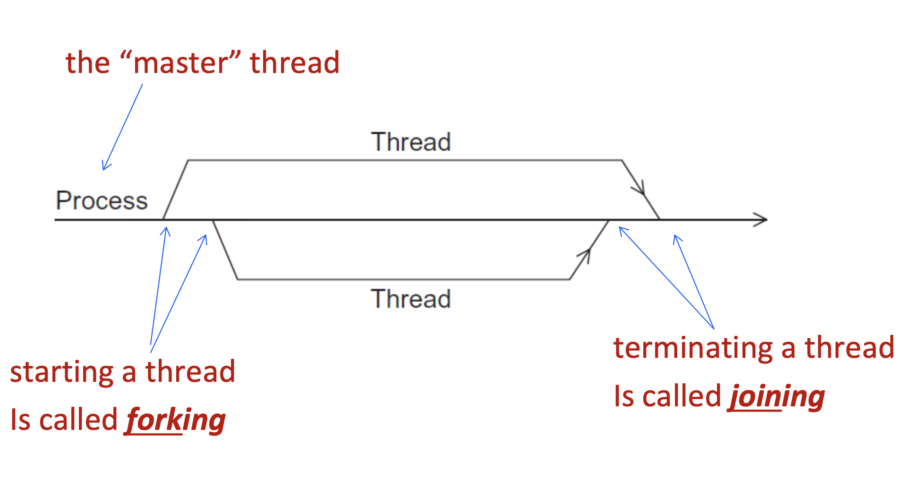

# Chapter 1: Overview

## Terminology 术语

| English name          | 中文名     | 含义                                                         |
| --------------------- | ---------- | ------------------------------------------------------------ |
| Concurrent computing  | 并发计算   | a program is one in which multiple tasks can be **in progress at any instant** |
| Parallel computing    | 并行计算   | a program is one in which multiple tasks **cooperate closely to solve a problem** |
| Distributed computing | 分布式计算 | a program may need to **cooperate with other programs** to solve a problem |

## Types of parallel systems

1. Shared memory 共享内存
2. Distributed memory分布式内存

## Process, thread, multitask

### Process

> An instance of a computer program that is being executed.
>
> **程序的一次运行实例**，是操作系统进行资源分配的基本单位。

特点：

- 每个进程有自己独立的地址空间
- 一个进程崩溃，不会影响其他进程。

#### Components of a process

- The executable machine language program
  - Text Segment (代码段)
- Address space. Different processed have separate address spaces.(isolation)
  - Data Segment (数据段)
  - Text Segment (代码段)
  - Heap (堆)
  - Stack (栈)
- Descriptors of resources the OS has allocated to the process (操作系统分配的资源描述符)
  - File descriptors (打开的文件)
  - Socket (网络连接)
  - I/O设备
  - 共享内存对象
  - 信号量 / 锁 等内核对象
- Security information (安全与权限信息)
  - 用户ID（UID）
  - 组ID（GID）
  - 权限（读/写/执行）
- Information about the state of the process
  - 程序计数器（Program Counter, PC）
  - CPU寄存器状态
  - 进程状态（ready / running / blocked）
  - 调度信息（优先级、时间片）
  - 进程ID（PID）
  - 父进程ID（PPID）

### Thread

> CPU调度的最小单位

特点：

- 一个进程内的线程共享所属进程的地址空间
- Threads are contained within processes.
- They allow programmers to divide their programs into (more or less) independent tasks.
- The hope is that **when one thread blocks** because it is waiting on a resource, **another will have work to do and can run**.
- 一个线程崩溃，可能会导致整个进程崩溃

### Multitask

> Gives the illusion that a single processor system is running multiple programs simultaneously.
>
> 给人感觉像是在“同时运行多个程序” 
>
> Actually, each process takes turns running. (time slice)
>
> After its time is up, it waits until it has a turn again.

