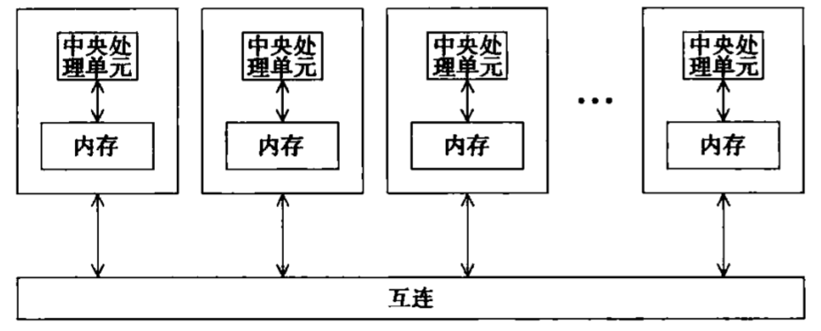
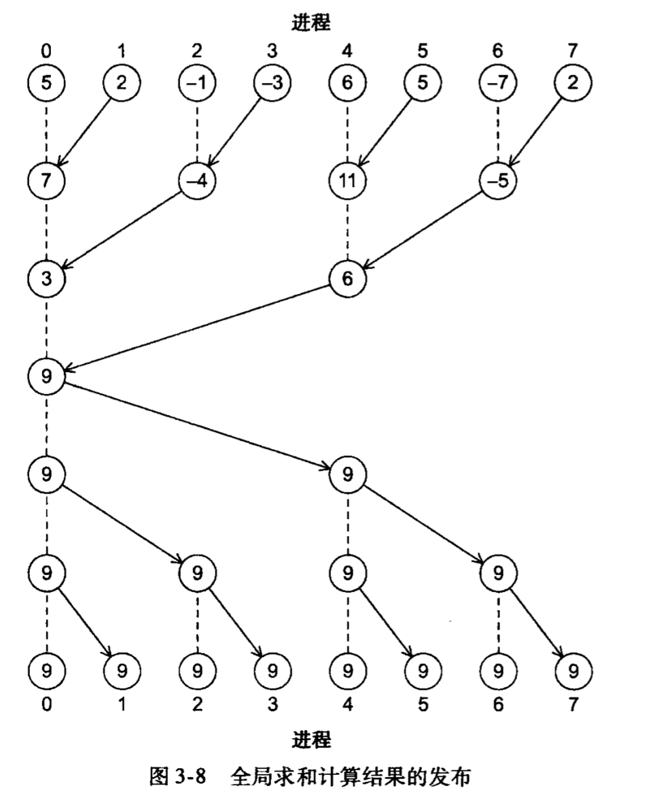
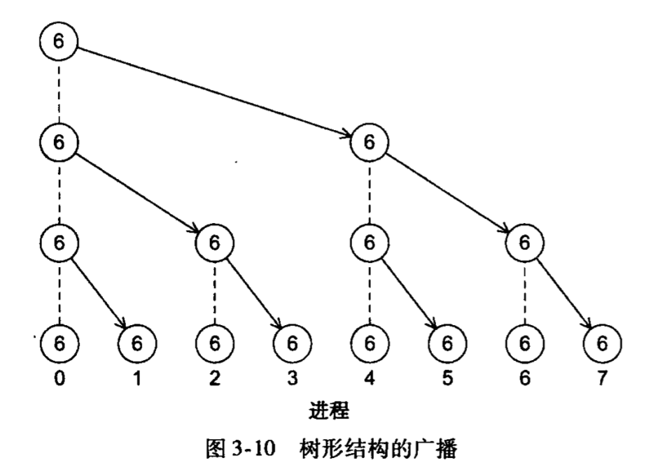
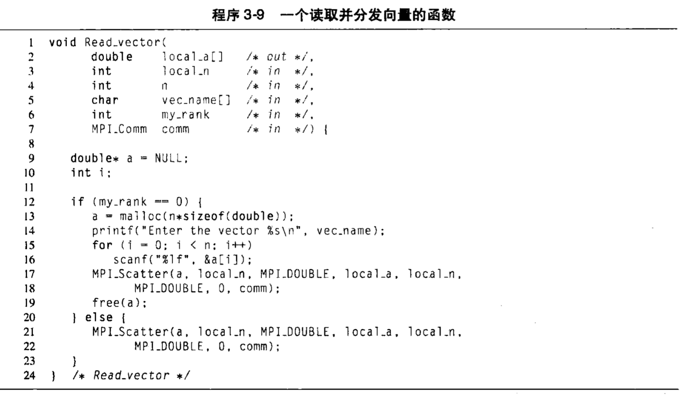

# Chapter3: MPI

> **消息传递接口(Message-Passing Interface, MPI)**
>
> 针对于**分布式**内存系统，角色主要是进程
>
> 使用**消息传递**来对分布式内存系统进行编程，



## 基础使用方法

### `MPI_Init`

用于告知MPI系统进⾏所有必要的**初始化设置**

```c
int MPI_Init(
		int* argc_p,
  	char** argv_p
);
```

当不需要`argc_p`和`argv_p`时，二者均可以设置为`NULL`


### `MPI_Finalize`

用于告知MPI系统MPI已经**使用完毕**，为MPI分配的任何资源都可以释放了。

调用方法`MPI_Finalize();`


### 通信子`MPI_COMM_WORLD`

> **通信子**是一组可以互相发送信息的**进程集合**。
>
> 这个通信子称为 `MPI_COMM_WORLD`

获取关于 `MPI_COMM_WORLD`的信息，可以利用：

- `MPI_Comm_size`：获取通信子的进程总数
- `MPI_Comm_rank`：返回正在调用进程在通信子中的进程号

#### `MPI_Comm_size`

作用：获取通信子的进程总数

```c
int MPI_Comm_size(
		MPI_Comm comm,
		int* 		 comm_sz_p
);
```

调用方法：`MPI_Comm_size(MPI_COMM_WORLD, &comm_sz);`获取的进程数在`comm_sz`中

#### `MPI_Comm_rank`

作用：返回正在调用进程在通信子中的进程号

```c
int MPI_Comm_rank(
		MPI_Comm comm,
		int* 		 my_rank_p
);
```

调用方法：`MPI_Comm_size(MPI_COMM_WORLD, &my_rank);` 正在调用进程对应的进程号在`my_rank`中


### `MPI_Send`

```c
int MPI_Send(
		void*				  msg_buf_p 	 /* 指向包含消息内容的内存块的指针 */,
		int 					msg_size 		 /* 要发送的数据项个数（不是字节数）*/,
		MPI_Datatype 	msg_type 		 /* 要发送数据的MPI数据类型，如：MPI_INT，MPI_FLOAT，MPI_CHAR 等 */,
		int 					dest				 /* 指定了要接受消息的进程的进程号 */,
		int 					tag					 /* 消息标签。用于区分看上去一样的消息,可以填0，1等非负整型数 */,
		MPI_Comm			communicator /* 一般就写 MPI_COMM_WORLD */
);
```


### `MPI_Recv`

```c
int MPI_Recv(
		void*				  msg_buf_p 	 /* 指向包含消息内容的内存块的指针 */,
		int 					msg_size 		 /* 最多接收的数据项个数（不是字节数）*/,
		MPI_Datatype 	msg_type 		 /* 接收数据的MPI数据类型，如：MPI_INT，MPI_FLOAT，MPI_CHAR 等 */,
		int 					source			 /* 指定了要消息来源的进程的进程号，可以用 MPI_ANY_SOURCE 匹配任意的 */,
		int 					tag					 /* 消息标签。用于区分看上去一样的消息,要与MPI_Send的相对应,可以填0，1等非负整型数，可以用MPI_ANY_TAG 匹配任意的 */,
		MPI_Comm			communicator /* 一般就写 MPI_COMM_WORLD */,
  	MPI_Status* 	status_p		 /* 大部分情况下，不需要使用这个参数，赋予MPI常量MPI_STATUS_IGNORE 就行了 */
);
```

`MPI_Recv`的前6个参数与`MPI_Send`的前6个参数是对应的。

特别地，一个进程可以接收多个进程发来的消息，接收进程并不知道消息发送的顺序，这种情况下，可以将`MPI_ANY_SOURCE`传给`MPU_RECV`的`source`参数。

类似地，一个进程可能接收多条来自另一个进程的有着不同标签的消息，并且接收进程并不知道消息发送的顺序，这种情况下，MPI提供了特殊的常量`MPI_ANY_TAG`，可以传给`MPI_Recv` 的`tag`参数。

> [!CAUTION]
>
> 在使用这些“通配符”参数时，要注意：
>
> 1. 只有接收者可以使用通配符参数。这说明MPI使用的是“推(push)”通信机制，而不是“拉(pull)”通信机制。
> 2. 通信子参数没有通配符。发送者和接收者都必须指定通信子。


### 集合通信

`MPI_Send`和`MPI_Recv`都是**点对点**通信的函数

而涉及通信子中所有进程的通信函数，称为“**集合通信**”

#### `MPI_Reduce`

```c
int MPI_Reduce(
		void* 				input_data_p,
		void* 				output_data_p,
		int 					count,
		MPI_Datatype 	datatype,
		MPI_Op 				operator,
		int 					dest_process /* 目标的进程，计算完后最终只会给该进程 */ ,
		MPI_Comm 			comm,
);
```

使用方法：

- 用到标量上，`MPI_Reduce(&local_int, &total_int, 1, MPI_DOUBLE, MPI_SUM, 0, MPI_COMM_WORLD);`

- 用到数组上，

  ```c
  double local_x[N], sum[N];
  ...
  MPI_Reduce(local_x, sum, N, MPI_DOUBLE, MPI_SUM, 0, MPI_COMM_WORLD);
  ```


#### `MPI_Allreduce`

计算结果给到通信子中的**所有进程**

```c
int MPI_Allreduce(
		void* 				input_data_p,
		void* 				output_data_p,
		int 					count,
		MPI_Datatype 	datatype,
		MPI_Op 				operator,
		MPI_Comm 			comm,
);
```

通信过程：先通过树形结构的通信计算出总结果，再通过“反向”的树形结构将数据发送给每个进程。



### 广播`MPI_Bcast`

用于将属于一个进程的数据发送到通信子中的**所有进程**。

```c
int MPI_Bcast(
		void*					data_p,
		int 					count,
		MPI_Datatype 	datatype,
		int 					source_proc,
		MPI_Comm 			comm
);
```



### 散射`MPI_Scatter`

```c
int MPI_Scatter(
		void*					send_buf_p,
		int 					send_count,
		MPI_Datatype 	send_type,
		void* 				recv_buf_p,
		int 					recv_count,
		MPI_Datatype 	recv_type,
		int						src_proc,
		MPI_Comm 			comm
);
```

如果通信子中包含 `comm_sz`个进程，那么`MPI_Scatter` 函数会将`send_buf_p`所引用的数据分成`comm_sz`份，第一份给0号进程，第二份给1号进程，……

使用示例：




### 聚集`MPI_Gather`

与散射`MPI_Scatter`刚好相反，`MPI_Gather`是将所有分出去的数据收集到一个进程上

```c
int MPI_Gather(
		void*					send_buf_p,
		int 					send_count,
		MPI_Datatype 	send_type,
		void* 				recv_buf_p,
		int 					recv_count,
		MPI_Datatype 	recv_type,
		int						dest_proc,
		MPI_Comm 			comm
);
```

### 全局聚集`MPI_Allgather`

将所有分出去的数据收集到所有进程上。相当于`MPI_Gather`+`MPI_Bcast`

```
int MPI_Allgather(
		void*					send_buf_p,
		int 					send_count,
		MPI_Datatype 	send_type,
		void* 				recv_buf_p,
		int 					recv_count,
		MPI_Datatype 	recv_type,
		MPI_Comm 			comm
);
```

