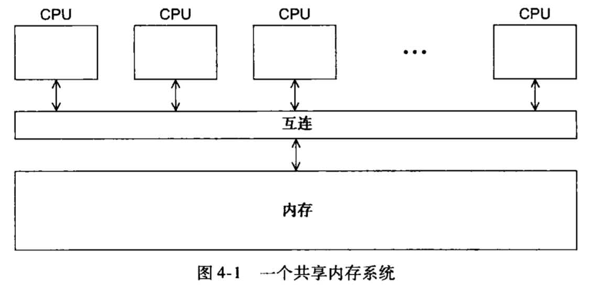
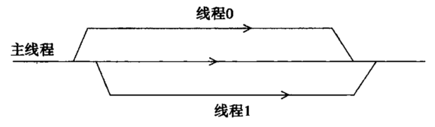
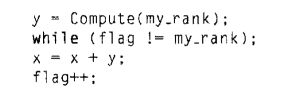
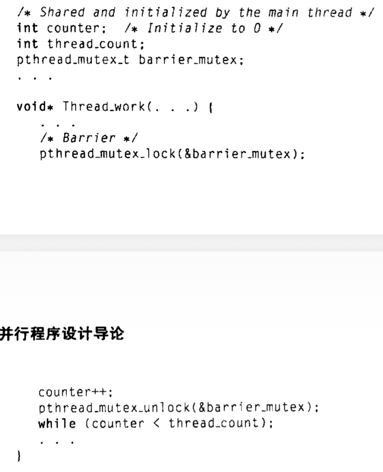
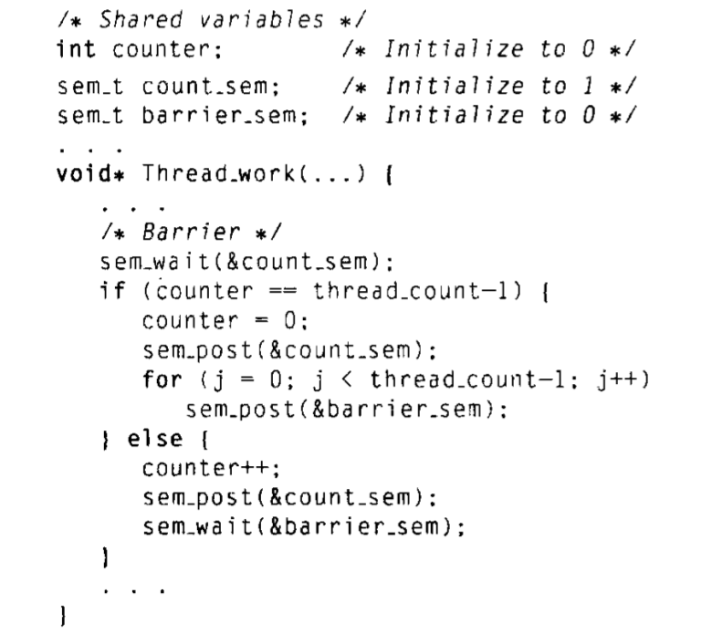
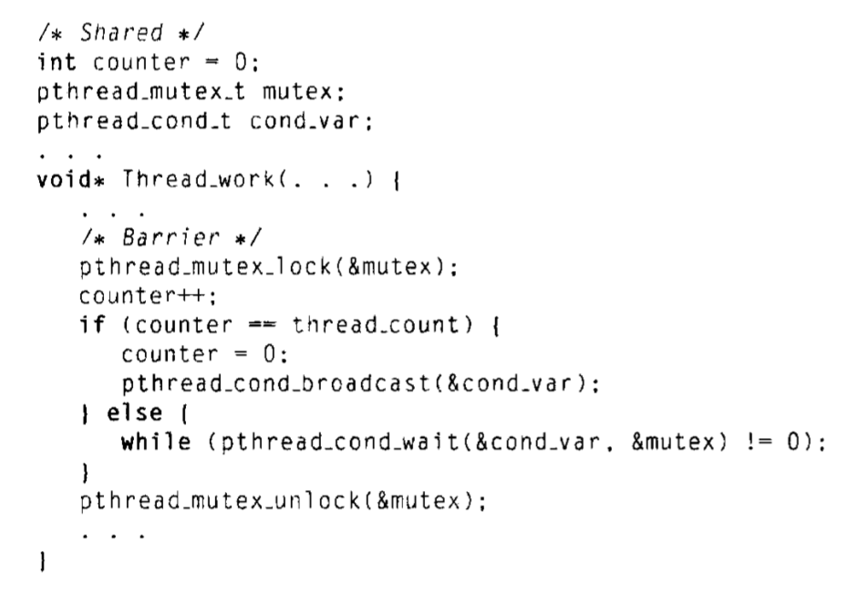

# Chapter 4: Pthreads

实现**共享内存**访问的编程方式有2种：

- Pthreads线程库
- OpenMP




> **为什么需要线程？**
>
> 在⼤多数系统中，在默认状态下，⼀个进程的内存块是私有的：其他进程⽆法直接访问，除⾮操作系统进⾏⼲涉。
>
> 这样做是为了避免不同进程之间互相干扰。在多用户环境下，可以避免一个用户的进程访问其他用户进程拥有的内存。
>
> 但有时却希望进程间共享一些区域，例如对stdout的访问，这样的进程除了**有独立的栈和程序计数器**外，其他所有区域基本上可以共享。这样的进程称为“**轻量级进程**”，又称为“**线程**”


## 基本使用方法

```c
#include<stdio.h>
#include<stdlib.h>
#include<pthread.h>

int thread_count;
void* Hello(void* rank);

int main(int argc, char* argv[]) {
    long thread;
    pthread_t* thread_handles;

    // Get number of threads from command line
    thread_count = strtol(argv[1], NULL, 10); // convert string to long int 

    // allocate memory for every thread handle
    thread_handles = malloc(thread_count * sizeof(pthread_t)); 

    // Create threads
    for (thread = 0; thread < thread_count; thread++) {
        pthread_create(&thread_handles[thread], NULL, Hello, (void*) thread);
    }

    printf("Hello from the main thread\n");

    // Wait for all threads to complete
    for ( thread = 0; thread < thread_count; thread++) {
        pthread_join(thread_handles[thread], NULL);
    }

    free(thread_handles);
    return 0;
}

void* Hello(void* rank) {
    long my_rank = (long) rank;
    printf("Hello from thread %ld of %d\n", my_rank, thread_count);
    return NULL;
}
```

关键点说明：

**分配内存**：`thread_handles = malloc(thread_count * sizeof(pthread_t));` 为每个线程的 `pthread_t` 对象分配内存， `pthread_t` 数据结构用来存储线程的专有信息。

**创建线程**：使用`pthread_create`, 函数原型为

```c
int pthread_create(
		pthread_t*							thread_p	  /* pthread_t 对象的指针 */,
		const pthread_attr_t*		atttr_p		  ,
		void*										thread_func /* 该线程要运行的函数 */,
		void*										arg_p			  /* 指向线程要运行函数thread_func的参数 */
);
```

由 `pthread_create` 创建并运行的函数原型是 

```c
void* thread_func(void* arg_p);
```

> [!CAUTION]
>
> 因为类型`void*`可以转换为C语言中任意指针类型，所以`arg_p`可以指向一个列表，该列表包含一个或多个 `thread_func`函数所需的数值。


**停止线程**：为每个线程调用一次 `pthread_join` ,就能等待`pthread_t`所关联的线程结束。函数原型为

```c
int pthread_join(
		pthread_t thread		 /* pthread_t 对象 */,
		void** 		ret_val_p  /* 接收 thread 产生的返回值 */
)
```


整个过程可以用下图来表示



## 临界区

>**临界区(Critical section)**
>
>对共享内存区域进行更新的代码段，称为临界区
>
>为了避免出现问题，一次只允许一个线程执行该代码段


> **竞争条件 (race condition)**
>
> 当多个线程都要访问共享资源时，如果至少其中一个访问是更新操作，那么这些访问就可能会导致某种错误，称为“竞争条件”


### 控制临界区的方法

- 忙等待
- 互斥量
- 信号量
- ……

### 忙等待

例如：



这里的while循环语句就是忙等待。在忙等待中，线程会不停地测试某个条件，直到某个条件满足之前，这些测试都是徒劳的。

#### 缺点

1. 线程在忙等待时会持续使用CPU
2. 线程不停在等待和运行之间切换，影响性能
3. 使用编译优化可能会把忙等待的代码优化掉，因此不能开优化，也会影响性能

### 互斥量

> **互斥量**
>
> 互斥量是互斥锁的简称，是一个特殊类型的变量
>
> 互斥量可以用来限制每次只有一个线程能进入临界区。
>
> 保证了一个线程独享临界区，其他线程在有线程已经进入该临界区的情况下，不能同时进入。

Pthreads标准为互斥量提供的特殊类型：`pthread_mutex_t`

相关的函数有：

**初始化函数** `pthread_mutex_init`

```c
int pthread_mutex_init(
		pthread_mutex_t* 				   mutex_p,
  	const pthread_mutexattr_t* attr_p /* 一般不使用第二个参数，赋值NULL即可*/
);
```

**销毁函数**`pthread_mutex_destroy`，当程序使用完互斥量后，需要调用这个函数来销毁互斥量。

```c
int pthread_mutex_destroy(
  	pthread_mutex_t* 				   mutex_p
);
```

**加锁函数**`pthread_mutex_lock`，要获得临界区的访问权，线程需要先加锁

```c
int pthread_mutex_lock(
		pthread_mutex_t* 				   mutex_p
);
```

**解锁函数**`pthread_mutex_unlock`，当线程退出临界区时，线程需要解锁

```c
int pthread_mutex_unlock(
		pthread_mutex_t* 				   mutex_p
);
```


#### 缺点

**执行顺序不确定**。哪个线程先进入临界区以及此后的顺序由系统随机选取


### 信号量

> [!CAUTION]
>
> 信号量不是Pthreads线程库的一部分，所以需要加头文件。

相关的函数有：

**初始化函数**`sem_init`

```c
int sem_init(
		sem_t*   semaphore_p,
		int		   shared				/* 一般赋值为0即可 */,
		unsigned initial_val
);
```

**销毁函数**`sem_destroy`

```c
int sem_destroy(
		sem_t*   semaphore_p
);
```

**等待函数**`sem_wait`，在要保护的临界区前调用。当线程执行到`sem_wait`时，如果信号量为0，则线程被阻塞，如果信号量为非0，则减1，然后进入临界区。

```c
int sem_wait(
		sem_t*   semaphore_p
);
```

**发送函数**`sem_post`，在临界区后调用。当线程执行完临界区内的操作后，调用`sem_post`对信号量加1，使得在`sem_wait`中阻塞的其他线程能够继续运行。

```c
int sem_post(
  	sem_t*   semaphore_p
);
```


### 路障

实现路障的方法有：

- 忙等待+互斥量
- 信号量
- 条件变量

#### 忙等待+互斥量



#### 信号量



#### 条件变量

> **条件变量**
>
> 条件变量是一个数据对象，允许线程在某个特定条件或事件发生前都处于**挂起**状态。
>
> 当事件或条件发生时，另一个线程可以通过信号来唤醒挂起的线程。
>
> 一个条件变量总是与一个互斥量相关联。

Pthreads线程库中的条件变量类型为`pthread_cond_t`

相关函数：

**初始化函数** `pthread_cond_init`

```c
int pthread_cond_init(
  	pthread_cond_t* 					cond_p,
  	const pthread_condattr_t* cond_attr_p  /* 一般传递NULL */
);
```

**销毁函数**`pthread_cond_destroy`

```c
int pthread_cond_destroy(
  	pthread_cond_t* 					cond_p
);
```

**通知函数** `pthread_cond_signal`，作用是解锁**一个**被阻塞的线程

```c
int pthread_cond_signal(
		pthread_cond_t* cond_var_p
);
```

**广播函数** `pthread_cond_broadcast`，作用是解锁**所有**被阻塞的函数

```c
int pthread_cond_broadcast(
		pthread_cond_t* cond_var_p
);
```

**等待函数** `pthread_cond_wait`，通过互斥量`mutex_p`来阻塞线程

```c
int pthread_cond_wait(
		pthread_cond_t*   cond_var_p,
		pthread_mutex_t*  mutex_p
);
```

 `pthread_cond_wait`相当于按顺序执行了以下函数：

```c
pthread_mutex_unlock(&mutex_p);
wait_on_signal(&cond_var_p);
pthread_mutex_lock(&mutex_p);
```


利用条件变量实现路障




### 读写锁

使用机制：

多个线程可以通过调用读锁函数而同时获得锁，而只有一个线程能通过写锁函数获得锁。

相关函数：

读加锁

```c
int pthread_rwlock_rdlock(pthread_rwlock_t* rwlock_p);
```

写加锁

```c
int pthread_rwlock_wrlock(pthread_rwlock_t* rwlock_p);
```

解锁

```c
int pthread_rwlock_unlock(pthread_rwlock_t* rwlock_p);
```

