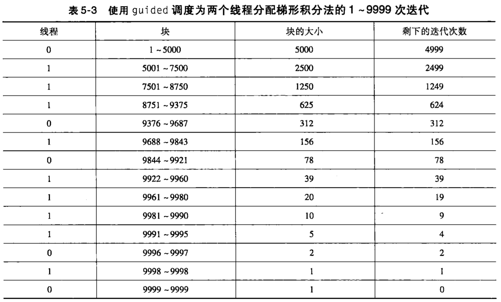

# Chapter 5: OpenMP

与Pthreads一样，OpenMP也是一个针对**共享内存**并行编程的API。

## Pthreads 与 OpenMP的比较

1.使用方式不同

Pthreads 更底层，要求程序员**显式地**明确每个线程的行为，

而OpenMP允许程序员只需要**简单地声明**一块代码应该并行执行，而由**编译器和运行时系统**来决定哪个线程具体执行哪个任务。

2.支持条件不同

Pthreads 是一个能被链接到C程序的函数库，只要系统有Pthreads库，Pthreads程序就能被任意C编译器使用。

而OpenMP要求编译器支持某些操作。

## 基本使用

并行指令

```c
# pragma omp parallel
```

`num_threads`指定执行代码块的线程数

```c
# pragma omp parallel num_threads(thread_count)
```

> [!CAUTION]
>
> 程序可以启动的线程数可能会**受到系统定义的限制**。

临界区

```c
# pragma omp critical
```


## 变量作用域

### `shared` 变量

`shared` 变量表示：该变量在线程组中拥有**共享**作用域

- 所有线程共享同一份变量存储空间
- 一个线程修改变量，其他线程也能看到修改结果
- 类似“公共变量”

### `private` 变量

`private` 变量表示：该变量在线程组中拥有**私有**作用域

- 每个线程都有自己独立的一份副本
- 线程之间互不影响
- 一个线程修改不会影响其他线程

缺省情况下：

- 在parallel指令前已经被声明的变量，拥有在线程组中所有线程间的**共享**作用域。

- 而在块中声明的变量，拥有**私有**作用域。

## 归约

### `reduction`子句

语法：`reduction(<operator>: <variable list>)`

归约操作符`operator`可以是：`+`,`*`,`-`,`&`,`|`,`&&`,`||`,`^`之一。（注意：减法由于不满足交换律和结合律，无法保证正确归约）

例子：

对于以下串行程序

```c
int sum=0;
for (int i=0; i<n; i++) {
  sum+=A[i];
}
```

可以指定一个归约变量来表示归约的结果。

下面的`reduction`子句指明了`global_result`是一个归约变量，`+`是规约操作符。

```c
int global_result=0;
# pragma omp parallel num_threads(thread_count) \
		reduction(+: global_result)
global_result += A[i];
```

### OpenMP的底层操作

归约变量本身是**共享**的。

OpenMP会为每个线程有效地创建一个**私有变量**，运行时系统在这个私有变量中存储每个线程的结果。

OpenMP也创建一个临界区，在这个临界区中，将存储在私有变量中的结果进行相加，整合到这个归约变量中。


## 调度类型

可以添加`schedule`子句来指定如何对线程进行调度。

`schedule`子句的形式：

```c
schedule(<type> [, <chunksize>])
```

共有以下几种调度类型：

- `static`: 迭代能够在循环执行前分配给线程
- `dynamic`或`guided`: 迭代在循环执行时被分配给线程，因此在一个线程完成它当前迭代集合后，它能从运行时系统中请求更多。
- `auto`: 编译器和运行时系统决定调度方式。
- `runtime`: 调度在运行时决定。

`chunksize`：一个正整数。迭代块是在顺序循环中连续执行的一块迭代语句，块中的迭代次数是`chunksize`

> [!CAUTION]
>
> 只有`static`, `dynamic`, `guided`调度有`chunksize`

### `static`调度类型

在static调度中，系统以轮转的方式分配`chunksize`个迭代给每个线程。

假设有12个迭代0、1、...、11.

如果用`(static,1)`，迭代将如下分配：

| 线程     | 分配到的迭代 |
| -------- | ------------ |
| Thread 0 | 0,3,6,9      |
| Thread 1 | 1,4,7,10     |
| Thread 2 | 2,5,8,11     |

如果用`(static,2)`，迭代将如下分配：

| 线程     | 分配到的迭代 |
| -------- | ------------ |
| Thread 0 | 0,1,6,7      |
| Thread 1 | 2,3,8,9      |
| Thread 2 | 4,5,10,11    |

如果用`(static,4)`，迭代将如下分配：

| 线程     | 分配到的迭代 |
| -------- | ------------ |
| Thread 0 | 0,1,2,3      |
| Thread 1 | 4,5,6,7      |
| Thread 2 | 8,9,10,11    |

在`static`调度类型下，`chunksize`可以忽略，如果忽略了，那么`chunksize`就近似等于`total_iterations/thread_count`

### `dynamic`调度类型

在`dynamic`调度中，迭代会被分成`chunksize`个连续迭代的块。每个线程执行一块。当一个线程完成一块时，它就从运行时系统请求另一块，直到所有的迭代完成。

假设有10个迭代和3个线程，

如果用`(dynamic,1)`，则 Thread 0先处理迭代0，Thread 1先处理迭代1，Thread 2先处理迭代2，当Thread 0 处理完迭代0后，就处理迭代3，以此类推。

如果用`(dynamic,2)`，则 Thread 0先处理迭代0和1，Thread 1先处理迭代2和3，Thread 2先处理迭代4和5，当Thread 0 处理完迭代0和1后，就处理迭代6和7，以此类推。

在`dynamic`调度类型下，`chunksize`可以忽略，如果忽略了，那么`chunksize`为1


### `guided`调度类型

在`guided`调度中，每个线程也会执行一块，当这块完成后，将请求新的一块，新的块大小近似等于剩下的迭代数除以线程数。

例如当迭代数为10000，线程数为2时，如果使用`schedule(guided)`,则迭代的分配如下表所示：



在`guided`调度类型下，如果没有指定`chunksize`，那么`chunksize`为1；如果指定了`chunksize`，那么块的大小就是`chunksize`，除了最后一块可以比`chunksize`更小。

Question：没有指定chunksize时，chunksize为1，为什么还会出现上表中的情况呢？

