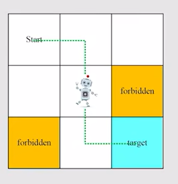
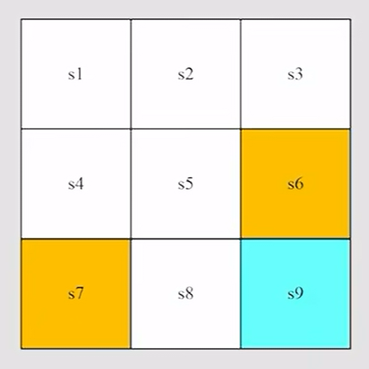
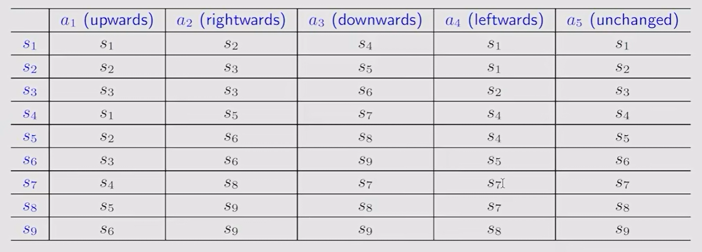
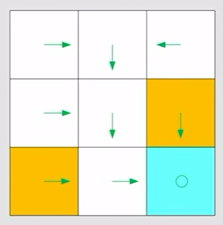
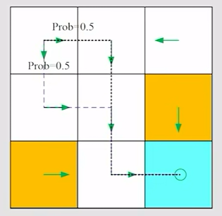
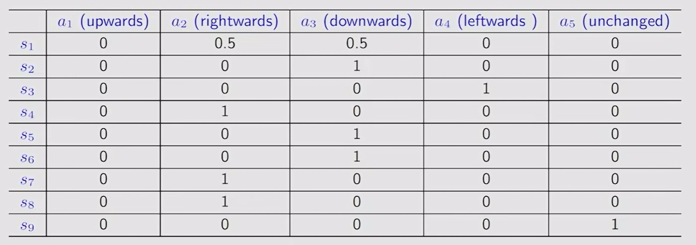
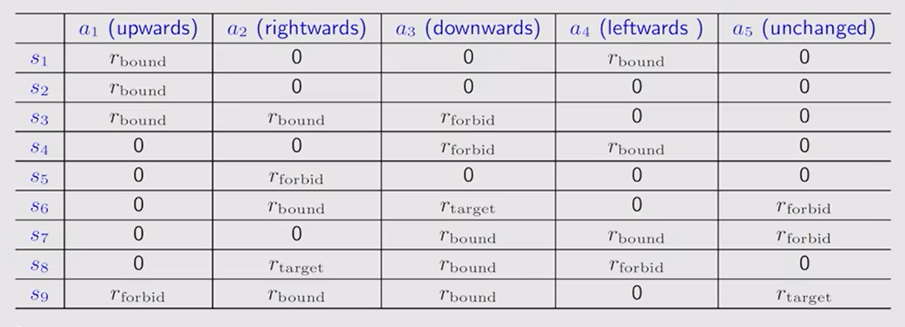
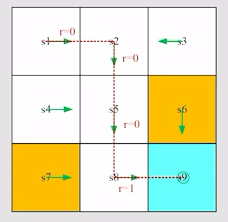
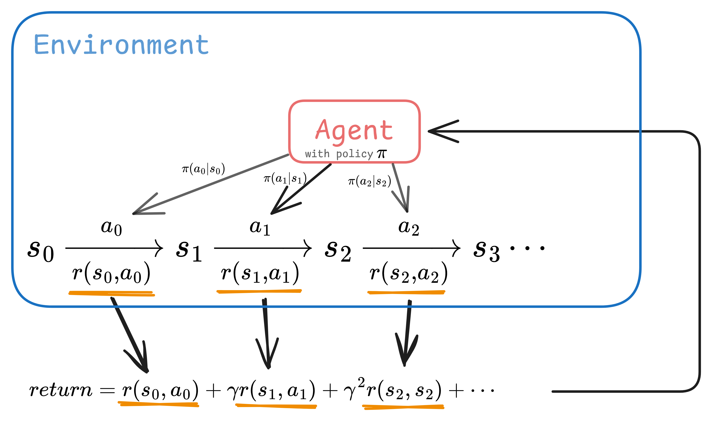

# Chapter 1: Basic Concepts

[TOC]

本章将会从下面一个简单的例子grid world进行切入，介绍强化学习的基本概念，包括：

- State
- Action
- State transition
- Policy
- Reward
- Trajectory, return, episode, discount rate
- Markov decision process, MDP

# A Brief Introduction of the Example

网格含义：

- 白色网格是accessible的；
- 黄色网格是forbidden的；
- 左上角的标有“Start”的网格是起点；
- 右下方的蓝色标有“target”的网格是终点。

任务：

- 机器人只能在这个九宫格中移动，需要找到一条**好**的路径，让机器人从起点走到终点。

关键：如何定义路径的好坏？

- 直观上：避开所有约束，避免走回头路（detour），不超出边界。
- 理性上：如何用数学的方式来建模以上的直观感受，从而衡量路径的好坏？

# State

> **Definition:**
>
> The state of the agent with respect to the environment.
>
> Agent 相对于环境的状态

在这个例子中，状态就是Agent所处的网格位置，标号为$s_1,s_2,\dots,s_9$。

**注意：“forbidden"的网格有两种情况，一种是可以进入的，但是会带来惩罚，另一种是严格地不可以进入的。**这里采取前者。

每个状态可以用其坐标表示为
$$
s_i = \begin{bmatrix} x_i \\ y_i \end{bmatrix} \quad i=1,2,\dots,9 
$$
一般地，机器人的状态可以定义为机器人当前的位姿
$$
s=\begin{bmatrix} x \quad y \quad z \quad \phi \quad \theta \quad \psi \end{bmatrix}^\mathrm{T}
$$
或者加入机器人当前的速度、加速度等。

## State space

> **Definition:**
>
> The set of all states
>
> 所有状态的集合

在这个例子中，一共有9个状态，因此状态空间就是这9个状态的集合，表示为$\mathcal{S} = \left\{ {s_i} \right\}_{i=1}^{9}$

# Action

>**Definition:**
>
>The possible action that  agent cound take.
>
>Agent 可以采取的动作。

在这个例子中，机器人有5种动作，分别是：

- $a_1$: move upwards 向上移动
- $a_2$: move rightwards 向右移动
- $a_3$: move downwards 向下移动
- $a_4$: move leftwards 向左移动
- $a_5$: stay unchanged 不移动

一般地，二维空间中机器人的动作可表示为方向+步长，比如：$a = \begin{bmatrix}\theta \quad l \end{bmatrix}^\mathrm{T}$​

三维空间中的动作则会更加复杂。

## Action space of a state

> **Definition:**
>
> The set of all possible actions of a state
>
> 一个状态下，所有可能的动作的集合

在这个例子中，在$s_i$状态下的动作集为$\mathcal{A}(s_i) = \left\{ a_j\right\}_{j=1}^{5}$

# State transition

>**Definition:**
>
>When taking an action, the agent may move from one state to another state. Such process is called **state transition** 
>
>Agent在采取某个动作时从一个状态转移到另一个状态的过程，就叫**状态转移**

比如：

1. 在状态$s_1$， 采取动作$a_2$，则会到达$s_2$

$$
s_1 \stackrel{a_2}{\longrightarrow}s_2
$$

2. 在状态$s_1$， 采取动作$a_1$，则会到达$s_1$ （被反弹回来，这是由该example的游戏规则而定的，也可以定义为反弹到$s_4$）

$$
s_1 \stackrel{a_1}{\longrightarrow}s_1
$$

一般地，可以将**“在状态$s_i$，采取动作$a_{ij}$，到达状态$s_j$”**的状态转移过程描述为
$$
s_{i}  \stackrel{a_{ij}}{\longrightarrow} s_{j}
$$

## Tabular representation

以起始状态为表的行索引，以采取的动作为表的列索引，以到达的状态为表中内容，可以得到状态转移的表格表示（Tabular representation）

### 表格表示的缺点

> Can only represent deterministic cases 
>
> 只能表示确定性的状态转移

比如：在$s_1$向上走，有可能被反弹到$s_1$，也有可能被反弹到$s_4$，这种情况使用表格就无法很好地表示了。这时候就需要引入下面的概率表示方法。

## State transition probability

为了表示不确定性的状态转移，引入了状态转移概率。

状态转移概率其实是一个**条件概率**，描述了在某个状态$s_i$采取某个动作$a_{ij}$的条件下到达另一个状态$s_j$​的概率。
$$
p(s_j|s_i,a_{ij})
$$
比如：在$s_1$向上走(采取动作$a_1$)，有50%的可能性被反弹到$s_1$，有50%的可能性被反弹到$s_4$，这可以表示为
$$
\begin{cases}
p(s_1| s_1,a_1) = 0.5 \\
p(s_4| s_1,a_1) = 0.5 \\
\end{cases}
$$
不难发现，状态转移概率也可以表示确定性的状态转移，只需要将确定能转移到的状态对应的概率置为1，其他概率置为0。

比如：在状态$s_1$， 采取动作$a_1$，则会到达$s_1$，可表示为
$$
\begin{cases}
p(s_1| s_1,a_1) = 1 \\
p(s_4| s_1,a_1) = 0 \\
\end{cases}
$$

综上，无论是确定性的状态转移，还是不确定性的状态转移，都可以使用状态转移概率（条件概率）来表示。

# Policy

> **Definition:**
>
> Policy tells the agent what actions to take at a state
>
> 策略告诉Agent在某个状态下，应该采取什么动作

## Deterministic Policy

对于确定性策略，比如图中状态$s_1$​的策略，可表示为
$$
\pi(a_1|s_1) = 0\\
\pi(a_2|s_1) = 1\\
\pi(a_3|s_1) = 0\\
\pi(a_4|s_1) = 0\\
\pi(a_5|s_1) = 0\\
$$
采取的动作的策略值为1，不采取的动作则置策略值为0。

## Stochastic Policy

对于不确定性策略，比如下图中状态$s_1$​的策略，可表示为
$$
\pi(a_1|s_1) = 0\\
\pi(a_2|s_1) = 0.5\\
\pi(a_3|s_1) = 0.5\\
\pi(a_4|s_1) = 0\\
\pi(a_5|s_1) = 0\\
$$
这是一个条件概率，表示在状态$a_1$条件下采取某个动作的概率，其总和为1。

**共同点：**不难发现，无论确定性策略，还是不确定性策略，其表示方法本质上就是一个条件概率——在给定状态的条件下采取某个动作的概率。

一般的数学表示为
$$
\pi (a| s_i) \quad \forall a \in \mathcal{A}(s_i)
$$
并且他们的总和为1
$$
\sum_{a \in \mathcal{A}(s_i)} \pi (a| s_i)=1
$$

## Tabular representation

以起始状态为表的行索引，以采取的动作为表的列索引，以对应的条件概率为表中内容，可以得到策略的表格表示（Tabular representation）

由于前文已经讲了确定性策略与不确定性策略的共同点都是条件概率，因此二者都可以使用表格表示。

# Reward

> **Definition:**
>
> The reward that the agent get after taking an action. (It's a real number)
>
> Agent 采取某个动作后得到的奖励，用一个标量来表示。

若奖励是一个正数，则表示鼓励采取这个动作；

若奖励是一个负数，则表示惩罚采取这个动作。

使用“奖励”可以解决“A Brief Introduction of the Example”中的关键问题——如何用数学的方式来建模“避开所有约束”，"避免走回头路（detour）"，"不超出边界"。

比如：

- 若Agent超出边界（即超出这个九宫格），则令$r_{bound}=-1$
- 若Agent进入forbidden网格，则令$r_{forbidden}=-1$

- 若Agent到达目标网格，则令$r_{target}=1$
- 其余情况下，Agent的奖励都是0

## Tabular representation

类似地，可以用表格来表示奖励。

以起始状态为表的行索引，以采取的动作为表的列索引，以获得的奖励为表中内容，可以得到奖励的表格表示（Tabular representation）

### 表格表示的缺点

> Can only represent deterministic cases 
>
> 只能表示确定性的奖励

## Conditional probability

与状态转移的描述类似，可以使用条件概率来表示不确定性的奖励。

在这个例子中，在$s_1$采取动作$a_1$会超出边界，所以奖励为-1，就可以表述为
$$
p(r=-1|s_1,a_1)=1 \\
p(r\neq -1 |s_1,a_1)=0
$$
不难发现，这个例子描述的是确定性的奖励，如果理解了前面“状态转移概率”，则不难理解，奖励的条件概率表示同样如此，既能表示确定性的奖励，又能表示不确定性的奖励。（这里就不再举例）

# Trajectory

> **Definition:**
>
> A state-action-reward chain
>
> 一条状态、动作、奖励链

在这个例子中，从起点到终点的一条状态、动作、奖励链可以表示为
$$
s_1  \xrightarrow[r=0]{a_2} s_2 
\xrightarrow[r=0]{a_3} s_5 
\xrightarrow[r=0]{a_3} s_8
\xrightarrow[r=1]{a_2} s_9
$$

## Return

（在我的理解中，return是Trajectory的一个子概念，因此我将它放在Trajectory的标题下介绍）

> **Definition:**
>
> The return of a trajectory is the sum of all the rewards collected along the trajectory .
>
> 一条轨迹的返回值，就是沿着这条轨迹所能得到的奖励之和。

在上面的轨迹中，返回值就是
$$
return = 0+0+0+1=1
$$
显然，在这种表示方式下，我们希望轨迹的返回值（即总奖励）越大越好，所以就要最大化返回值。返回值越大，则说明路径越好，这就解决了“A Brief Introduction of the Example”中的关键问题——如何衡量路径的好坏。

## Discount rate

如果Agent到达$s_9$后，游戏还没有终止，Agent继续一直呆在$s_9$。
$$
s_1  \xrightarrow[r=0]{a_2} s_2 
\xrightarrow[r=0]{a_3} s_5 
\xrightarrow[r=0]{a_3} s_8
\xrightarrow[r=1]{a_2} s_9
\xrightarrow[r=1]{a_5} s_9
\xrightarrow[r=1]{a_5} s_9
\cdots
$$
他获得的奖励将会趋于$+\infin$，发散了。
$$
return = 0+0+0+1+1+1+\cdots =+\infin
$$
为了解决这个问题，引入Discount rate $\gamma \in [0,1)$

那么return就可以收敛到一个有限的数
$$
Discounted \; return = 0+ \gamma 0 + \gamma^2 0+\gamma^3 1+ \gamma^4 1+\gamma^5 1+\cdots = \gamma^3 \frac{1}{1-\gamma}
$$

### Discount rate 的作用

1. 使得返回值收敛到一个有限的数。

2. 平衡长远利益和短期利益。

   简单来说就是，Discounted return就是给每个奖励赋了权重$1,\gamma,\gamma^2,\gamma^3,\cdots$

   由于$\gamma \in [0,1)$，所以$1 \geq \gamma \geq \gamma^2 \geq \gamma^3 \geq \cdots$​

   也就是说，距离当前比较近的奖励的权重更大，距离当前比较远的奖励的权重更小。

若$\gamma \rightarrow 0$，表示更重视当下。因为越远的奖励的权重会非常趋近于0。

若$\gamma \rightarrow 1$，表示更注重长远。因为每个奖励的权重将会趋于相等。

# Episode

> **Definition:**
>
> When interacting with the environment following a policy, the agent may stop at some terminal states. The resulting trajectory is called an episode (or a trial).
>
> 当Agent根据某个策略与环境交互并最终停止在某个终止状态上，所得到的轨迹就是一个episode（或者一次尝试）

一个episode通常都是有限步的轨迹。这种任务称为“episodic tasks"。

比如在前面的例子中：

$$
s_1  \xrightarrow[r=0]{a_2} s_2 
\xrightarrow[r=0]{a_3} s_5 
\xrightarrow[r=0]{a_3} s_8
\xrightarrow[r=1]{a_2} s_9
$$
然而有些任务并没有终止状态，意味着agent与环境的交互是不会终止的。这种任务称为“continuing tasks”。

### episodic tasks —> continuing tasks

有2种方法将episodic tasks转化为continuing tasks。

1. 将target state视为一种吸收状态，一旦进入便无法离开（只进不出），之后所得的奖励为0。
2. 将target state视为普通的状态，agent可以离开这个状态，每次进入target state时都可以获得正的奖励。（在课程中采取这种方法）

通过以上方法将episodic tasks转化为continuing tasks，我们就可以将所有任务**统一**视为continuing tasks，从而方便研究。

# Markov decision process, MDP

## 3 sets

- **State space $\mathcal{S}$**: the set of all states
- **Action space $\mathcal{A}$**: the set of actions $\mathcal{A}(s)$ is associated for state $s \in \mathcal{S}$
- **Reward**: the set of rewards $\mathcal{R}(s,a)$

##  3 probability distribution

- **State transition probability**: at state $s$, taking action $a$, the probability to transit to state $s'$ is $p(s'|s,a)$
- **Reward probability**：at state $s$, taking action $a$, the probability to get reward $r$ is $p(r|s,a)$

- **Policy $\boldsymbol{\pi}$**:  at state $s$, the probability to choose action $a$ is $\pi(a|s)$

(这里与赵世钰老师的PPT不同，我将状态转移概率、奖励概率、策略三者放在一起，因为他们本质上都可以使用条件概率来表示，都是一个概率分布)

## 1 property

- **Markov property**：memoryless 

$$
p(s_{t+1}|a_{t+1},s_t,\cdots,a_1,s_0)=p(s_{t+1}|a_{t+1},s_t)
$$

 

# 总结

本章节的知识可以总结为上图。

Agent 根据策略$\pi$与环境进行一轮交互：

在状态$s_0$下，采取动作$a_0$到达状态$s_1$，获得了奖励$r(s_0,a_0)$；在状态$s_1$，采取动作$a_1$到达状态$s_2$，获得了奖励$r(s_1,a_1)$；……

这就组成了一条状态、动作、奖励链，也就是Trajectory，

将这条Trajectory中的所有奖励值乘上一个由于discount rate $\gamma$而定的权重，然后求和，得到return。

最后，这个return会给到Agent，用来更新策略$\pi $ （在课程中的Chapter 1还没讲，但为了知识的完整性，我写在这里）
