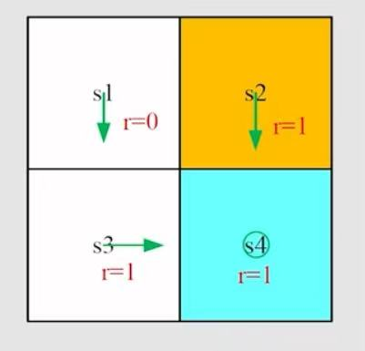
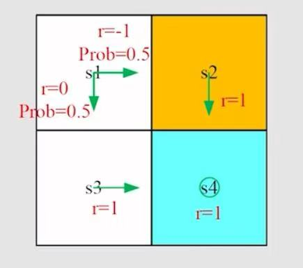

# Chapter 2: Bellman Equation

[TOC]

本章将介绍：

- State Value
- Bellman Equation
- Action Value

## 符号介绍

考虑以下单步过程（Single-step Process）：
$$
S_t \xrightarrow{A_t} R_{t+1}, S_{t+1}
$$
其中：

- $t, t+1$：离散的时间
- $S_t$：t时刻的状态
- $A_t$：在$S_t$状态下采取的动作
- $R_{t+1}$：采取的动作$A_t$后得到的奖励（也可以记为$R_t$）
- $S_{t+1}$：采取的动作$A_t$后转移到的状态

> [!CAUTION]
>
> 注意：这里的 $S_t, A_t, R_{t+1}, S_{t+1}$均为**随机变量**，所以采用大写字母来表示

再考虑含多步的轨迹（Multi-step trajectory）:
$$
S_t \xrightarrow{A_t} R_{t+1}, S_{t+1} \xrightarrow{A_{t+1}} R_{t+2}, S_{t+2} \xrightarrow{A_{t+2}}  R_{t+3}, \cdots
$$
那么Discounted Return 为：
$$
G_t = R_{t+1} + \gamma R_{t+2} + \gamma^2 R_{t+3}+\cdots
$$
其中，$\gamma$是折扣因子（Discount Rate）

### 变量之间的决定关系

在**模型已知**的情况下，变量之间的关系是可以用概率决定的

$S_t \rightarrow A_t$：由 $\pi(A_t =a | S_t =s)$决定，简记为$\pi(a|s)$

$S_t, A_t \rightarrow R_{t+1}$：由 $p( R_{t+1}=r|S_t =s,A_t =a )$决定，简记为$p(r|s,a)$

$S_t,A_t \rightarrow S_{t+1}$：由 $p( S_{t+1}=s'|S_t =s,A_t =a )$决定，简记为$p(s'|s,a)$

## State value

> **Definition:**
>
> The expectation of $G_t$​ is defined as the state value function or simply state value.
>
> $G_t$的期望被定义为状态价值函数，简称状态价值。

$$
v_{\pi}(s) = \mathbb{E}\left[G_t | S_t = s \right]
$$

> [!NOTE]
>
> 内涵：
>
> - 这是一个关于状态$s$的函数。因为这是一个**条件期望**，条件为初始状态$S_t$为$s$​
> - 这个函数是关于策略$\pi$​的，也可以记为$v(s,{\pi})$​
> - 这个函数代表一个状态$s$的价值，如果状态价值越大，说明这个策略$\pi$越好

> [!CAUTION]
>
> 辨析：**Return** V.S. **State value**
>
> **Return**：针对一条轨迹（trajectory）的
>
> **State value**：从状态$s$​开始，所有可能的returns的期望（或者称为平均值）
>
> 如果$\pi(a|s),p(r|s,a),p(s'|s,a)$都是**确定性**的，那么**Return** 就等于 **State value**

##### 例1：$\pi(a|s),p(r|s,a),p(s'|s,a)$都是**确定性**的

采取的策略$\pi_1$如上图的绿色箭头所示，假设统一从$s_1$出发，那么就只有唯一的轨迹，即 $s_1 \rightarrow s_3 \rightarrow s_4$
$$
v_{\pi_1}(s_1) = 0+\gamma 1+\gamma^2 1+ \cdots = \frac{\gamma}{1-\gamma}
$$
这时该轨迹的return就与state value是相等的。其实这是因为state value以100%的概率取该轨迹的return，以0的概率取其他不可能的轨迹的return。

##### 例2：$\pi(a|s)$​不是确定性的

采取的策略$\pi_2$如上图的绿色箭头所示，假设统一从$s_1$出发，有0.5的概率选择向下的动作，有另外0.5的概率选择向右的动作。即$\pi_2(\text{"down"}|s_1) =0.5, \quad \pi_2(\text{"right"}|s_1) =0.5$

对于**Return**，由于两条轨迹 $s_1 \rightarrow s_2 \rightarrow s_4$，和$s_1 \rightarrow s_3 \rightarrow s_4$，所以自然就有两个Return

轨迹1：$s_1 \rightarrow s_2 \rightarrow s_4$
$$
return_{1} = (-1) + \gamma 1 + \gamma^2 1 + \cdots = -1+\frac{\gamma}{1-\gamma}
$$
轨迹2：$s_1 \rightarrow s_3 \rightarrow s_4$
$$
return_{2}=0+\gamma 1+\gamma^2 1+\cdots=\frac{\gamma}{1-\gamma}
$$
对于 **State value**，它是所有可能的returns的期望
$$
v_{\pi_2}(s_1) = 0.5 \times \left(  -1+\frac{\gamma}{1-\gamma} \right) + 0.5 \times \left(\frac{\gamma}{1-\gamma} \right) =-0.5 + \frac{\gamma}{1-\gamma}
$$

比较例1、例2还可以发现：不同策略下得到的状态价值不同，显然状态价值越高，策略越好。

## Bellman equation

如前文所述，对于含多步的轨迹（Multi-step trajectory）:
$$
S_t \xrightarrow{A_t} R_{t+1}, S_{t+1} \xrightarrow{A_{t+1}} R_{t+2}, S_{t+2} \xrightarrow{A_{t+2}}  R_{t+3}, \cdots
$$
那么Discounted Return 为：
$$
G_t = R_{t+1} + \gamma R_{t+2} + \gamma^2 R_{t+3}+\cdots
$$
可以写为
$$
\begin{aligned}
G_t =& R_{t+1} + \gamma R_{t+2} + \gamma^2 R_{t+3}+\cdots \\
	=& R_{t+1} + \gamma (R_{t+2} + \gamma R_{t+3}+\cdots) \\
	=& R_{t+1} + \gamma G_{t+1}
\end{aligned}
$$
其中，$R_{t+1}$被称为**即时奖励（immediate reward）**，$G_{t+1}$是**未来奖励（future reward）**。

对上式两边取期望（在$S_t=s$条件下的期望），得到
$$
\mathbb{E}[G_t | S_t = s] = \mathbb{E}[ R_{t+1} + \gamma G_{t+1} | S_t = s]
$$
化简得
$$
\mathbb{E}[G_t | S_t = s] = \mathbb{E}[ R_{t+1} | S_t = s] + \gamma \mathbb{E}[G_{t+1} | S_t = s]
$$
即
$$
v_{\pi}(s) = \mathbb{E}[ R_{t+1} | S_t = s] + \gamma \mathbb{E}[G_{t+1} | S_t = s]
$$

### 公式推导

1.先看第一项 $\mathbb{E}[ R_{t+1} | S_t = s] $:

可以根据条件期望公式（$\mathbb{E}[B]=\sum_{a}p(A=a) \mathbb{E}[B|A=a]$），对$A_t$求条件期望：
$$
\begin{aligned}
\mathbb{E}[ R_{t+1} | S_t = s] =& \sum_{a} \pi (a|s) \mathbb{E}[R_{t+1} | S_t = s, A_t=a] \\
=&  \sum_{a} \pi (a|s) \sum_{r}p(r|s,a)r
\end{aligned}
$$

> [!NOTE]
>
> $\pi (a|s) $：表示**在状态$s$的条件下**采取动作$a$的概率
>
>  $\mathbb{E}[R_{t+1} | S_t = s, A_t=a] $：表示**在状态$s$时采取动作$a$的条件下**获得奖励的期望
>
> $\sum_{a} \pi (a|s) \mathbb{E}[R_{t+1} | S_t = s, A_t=a] $：表示**在状态$s$的条件下**采取各种可能的动作的总期望

2.再看第二项 $\mathbb{E}[G_{t+1} | S_t = s]$:

同样是根据条件期望公式，对$S_{t+1}$求条件期望：
$$
\begin{aligned}
\mathbb{E}[G_{t+1} | S_t = s] =& \sum_{s'} p(s'|s) \mathbb{E}[G_{t+1}|S_{t+1}=s',S_{t}=s]\\
=& \sum_{s'} p(s'|s) \mathbb{E}[G_{t+1}|S_{t+1}=s']\\
=& \sum_{s'} p(s'|s) v_{\pi}(s') \\
=& \sum_{a} \pi(a|s) \sum_{s'} p(s'|s,a) v_{\pi}(s') \\
\end{aligned}
$$

> [!CAUTION]
>
> 注意：
>
> $ \mathbb{E}[G_{t+1}|S_{t+1}=s',S_{t}=s] =  \mathbb{E}[G_{t+1}|S_{t+1}=s']$是因为**马尔科夫性的无记忆性**

两项合起来，就可以得到**贝尔曼方程（Bellman equation）**:
$$
\begin{aligned}
v_{\pi}(s) 
=& \mathbb{E}[ R_{t+1} | S_t = s] + \gamma \mathbb{E}[G_{t+1} | S_t = s] \\
=& \sum_{a} \pi(a|s) \sum_{r}p(r|s,a)r + \gamma \sum_{a} \pi(a|s) \sum_{s'}p(s'|s,a)v_{\pi}(s') \\
=& \sum_{a} \pi(a|s) \left[ \sum_{r}p(r|s,a)r + \gamma \sum_{s'} p(s'|s,a) v_{\pi}(s') \right], \quad \forall s \in \mathcal{S}
\end{aligned}
$$

> [!NOTE]
>
> - 该公式是针对在状态空间中的**任意一个**$s$，将这些公式联立，可以求得$v_{\pi}(s),\quad s \in \mathcal{S}$
>
> - $p(r|s,a)$ 和 $p(s'|s,a)$代表着动态模型，这是模型已知的情况。若模型未知，则$p(r|s,a)$ 和 $p(s'|s,a)$是未知的，这就是model free的情况。

### 矩阵向量形式

记
$$
r_{\pi}(s) = \sum_{a} \pi(a|s)\sum_{r}p(r|s,a)r
$$

$$
p_{\pi}(s'|s)=\sum_{a}\pi(a|s) p(s'|s,a)
$$

那么贝尔曼方程可以写为
$$
v_{\pi}(s) = r_{\pi}(s) + \gamma \sum_{s'}p_{\pi}(s'|s) v_{\pi}(s'), \quad \forall s \in \mathcal{S}
$$
对每一个状态分别编号为 $s_i,(i=1,2,\cdots,n)$

对每一个$s_i$，根据贝尔曼方程都有：
$$
v_{\pi}(s_i) = r_{\pi}(s_i) + \gamma \sum_{s_j}p_{\pi}(s_j|s_i) v_{\pi}(s_j), \quad \forall s_i \in \mathcal{S}
$$
从而可以写成**矩阵向量的形式**：
$$
\mathbf{v}_{\pi} = \mathbf{r}_{\pi} + \gamma P_{\pi} \mathbf{v}_{\pi}
$$
其中：

- $\mathbf{v}_{\pi}=\begin{bmatrix} v_{\pi}(s_1) & \cdots & v_{\pi}(s_n) \end{bmatrix}^\mathrm{T} \in \mathbb{R}^n$
- $\mathbf{r}_{\pi}=\begin{bmatrix} r_{\pi}(s_1) & \cdots & r_{\pi}(s_n) \end{bmatrix}^\mathrm{T} \in \mathbb{R}^n$
- $P_{\pi} \in \mathbb{R}^{n \times n}$, where $[P_{\pi}]_{ij} = p_{\pi}(s_j,s_i)$, is the state transition matrix (状态转移矩阵)

比如：对于4个状态的情况，矩阵向量形式就可以写为
$$
\underbrace{
\begin{bmatrix}
v_{\pi}(s_1) \\
v_{\pi}(s_2) \\
v_{\pi}(s_3) \\
v_{\pi}(s_4) \\
\end{bmatrix}
}_{\mathbf{v}_{\pi}} 
=
\underbrace{
\begin{bmatrix}
r_{\pi}(s_1) \\
r_{\pi}(s_2) \\
r_{\pi}(s_3) \\
r_{\pi}(s_4) \\
\end{bmatrix}
}_{\mathbf{r}_{\pi}}
+
\underbrace{
\begin{bmatrix}
p_{\pi}(s_1 | s_1) & p_{\pi}(s_2 | s_1) & p_{\pi}(s_3 | s_1) & p_{\pi}(s_4 | s_1)\\
p_{\pi}(s_1 | s_2) & p_{\pi}(s_2 | s_2) & p_{\pi}(s_3 | s_2) & p_{\pi}(s_4 | s_2)\\
p_{\pi}(s_1 | s_3) & p_{\pi}(s_2 | s_3) & p_{\pi}(s_3 | s_3) & p_{\pi}(s_4 | s_3)\\
p_{\pi}(s_1 | s_4) & p_{\pi}(s_2 | s_4) & p_{\pi}(s_3 | s_4) & p_{\pi}(s_4 | s_4)\\
\end{bmatrix}
}_{P_{\pi}}
\underbrace{
\begin{bmatrix}
v_{\pi}(s_1) \\
v_{\pi}(s_2) \\
v_{\pi}(s_3) \\
v_{\pi}(s_4) \\
\end{bmatrix}
}_{\mathbf{v}_{\pi}}
$$

### 贝尔曼方程的简单使用

##### 例3：$\pi(a|s),p(r|s,a),p(s'|s,a)$都是**确定性**的

采取的策略$\pi_1$如上图的绿色箭头所示

根据贝尔曼方程，可以写出每个状态的价值
$$
\begin{aligned}
v_{\pi_1}(s_1) =& 0 + \gamma v_{\pi_1}(s_3) \\
v_{\pi_1}(s_2) =& 1 + \gamma v_{\pi_1}(s_4) \\
v_{\pi_1}(s_3) =& 1 + \gamma v_{\pi_1}(s_4) \\
v_{\pi_1}(s_4) =& 1 + \gamma v_{\pi_1}(s_4) \\
\end{aligned}
$$
联立以上4式，解得4个状态的价值为
$$
\begin{aligned}
v_{\pi_1}(s_1) =& \frac{\gamma}{1-\gamma}  \\
v_{\pi_1}(s_2) =& \frac{1}{1-\gamma} \\
v_{\pi_1}(s_3) =& \frac{1}{1-\gamma} \\
v_{\pi_1}(s_4) =& \frac{1}{1-\gamma} \\
\end{aligned}
$$
可以写成矩阵向量形式
$$
\underbrace{
\begin{bmatrix}
v_{\pi}(s_1) \\
v_{\pi}(s_2) \\
v_{\pi}(s_3) \\
v_{\pi}(s_4) \\
\end{bmatrix}
}_{\mathbf{v}_{\pi}} 
=
\underbrace{
\begin{bmatrix}
0 \\ 1 \\ 1 \\ 1\\
\end{bmatrix}
}_{\mathbf{r}_{\pi}}
+
\underbrace{
\begin{bmatrix}
0 & 0 & 1 & 0 \\
0 & 0 & 0 & 1 \\
0 & 0 & 0 & 1 \\
0 & 0 & 0 & 1 \\
\end{bmatrix}
}_{P_{\pi}}
\underbrace{
\begin{bmatrix}
v_{\pi}(s_1) \\
v_{\pi}(s_2) \\
v_{\pi}(s_3) \\
v_{\pi}(s_4) \\
\end{bmatrix}
}_{\mathbf{v}_{\pi}}
$$

##### 例4：$\pi(a|s)$​不是确定性的

采取的策略$\pi_2$​如上图的绿色箭头所示.

根据贝尔曼方程，可以写出每个状态的价值
$$
\begin{aligned}
v_{\pi_2}(s_1) =& 0.5 \times \left[-1 + \gamma v_{\pi_2}(s_2) \right] + 0.5 \times [0 + \gamma v_{\pi_2}(s_3)] \\
v_{\pi_2}(s_2) =& 1 + \gamma v_{\pi_2}(s_4) \\
v_{\pi_2}(s_3) =& 1 + \gamma v_{\pi_2}(s_4) \\
v_{\pi_2}(s_4) =& 1 + \gamma v_{\pi_2}(s_4) \\
\end{aligned}
$$
联立以上4式，解得4个状态的价值为
$$
\begin{aligned}
v_{\pi_2}(s_1) =& -0.5 + \frac{\gamma}{1-\gamma} \\
v_{\pi_2}(s_2) =& \frac{1}{1-\gamma} \\
v_{\pi_2}(s_3) =& \frac{1}{1-\gamma} \\
v_{\pi_2}(s_4) =& \frac{1}{1-\gamma}\\
\end{aligned}
$$
可以写成矩阵向量的形式
$$
\underbrace{
\begin{bmatrix}
v_{\pi}(s_1) \\
v_{\pi}(s_2) \\
v_{\pi}(s_3) \\
v_{\pi}(s_4) \\
\end{bmatrix}
}_{\mathbf{v}_{\pi}} 
=
\underbrace{
\begin{bmatrix}
0.5 \times (-1) + 0.5 \times 0 \\ 1 \\ 1 \\ 1\\
\end{bmatrix}
}_{\mathbf{r}_{\pi}}
+
\underbrace{
\begin{bmatrix}
0 & 0.5 & 0.5 & 0 \\
0 & 0 & 0 & 1 \\
0 & 0 & 0 & 1 \\
0 & 0 & 0 & 1 \\
\end{bmatrix}
}_{P_{\pi}}
\underbrace{
\begin{bmatrix}
v_{\pi}(s_1) \\
v_{\pi}(s_2) \\
v_{\pi}(s_3) \\
v_{\pi}(s_4) \\
\end{bmatrix}
}_{\mathbf{v}_{\pi}}
$$

### 策略评估

给定一个策略 $\pi$，通过求解贝尔曼方程的矩阵形式，可以得到所有状态价值 $\mathbf{v}_{\pi}$
$$
\mathbf{v}_{\pi} = \left(I - \gamma P_{\pi} \right)^{-1}\mathbf{r}_{\pi},\quad \text{if $\left(I - \gamma P_{\pi} \right)$ is invertible}
$$
这个过程就被称为"**策略评估（policy evaluation）**"

> **策略评估（policy evaluation）**:
>
> 策略评估（policy evaluation）是强化学习的关键，用于评价一个策略的好坏

在实际计算中，一般不使用解析解$\mathbf{v}_{\pi} = \left(I - \gamma P_{\pi} \right)^{-1}\mathbf{r}_{\pi}$ 来求解，因为这里的维度可能很高，导致求导的计算复杂度高。而是采用**迭代逼近的方式**求解：
$$
\mathbf{v}_{k+1}=\mathbf{r}_{\pi} + \gamma P_{\pi} \mathbf{v}_{k}
$$
**随便**取一个$\mathbf{v}_0$，通过反复代入上述公式计算，当 $k \rightarrow \infty$ 时，就能够得到$\mathbf{v}_{\pi}$的近似解

即
$$
\mathbf{v}_{k} \rightarrow \mathbf{v}_{\pi} =\left(I - \gamma P_{\pi} \right)^{-1}\mathbf{r}_{\pi}, \quad k \rightarrow \infty
$$

> **Proof：**
>
> 记 $\boldsymbol{\delta}_k = \mathbf{v}_{k} - \mathbf{v}_{\pi}$
>
> 则 $\mathbf{v}_{k+1}=\mathbf{r}_{\pi} + \gamma P_{\pi} \mathbf{v}_{k}$可以写为：
> $$
> \mathbf{v}_{\pi} + \boldsymbol{\delta}_{k+1} =\mathbf{r}_{\pi} + \gamma P_{\pi} \left( \mathbf{v}_{\pi} +\boldsymbol{\delta}_{k} \right)
> $$
> 又因为
> $$
> \mathbf{v}_{\pi} = \mathbf{r}_{\pi} + \gamma P_{\pi} \mathbf{v}_{\pi}
> $$
> 故
> $$
> \boldsymbol{\delta}_{k+1} = \gamma P_{\pi} \boldsymbol{\delta}_{k}
> $$
> 从而
> $$
> \boldsymbol{\delta}_{k+1} = \gamma P_{\pi} \boldsymbol{\delta}_{k} = \gamma^2 P_{\pi}^2 \boldsymbol{\delta}_{k-1}= \cdots = \gamma^{k+1} P_{\pi}^{k+1} \boldsymbol{\delta}_{0}
> $$
> 由于$P_{\pi}$的每一个元素都是概率，概率具有非负性；而且$P_{\pi}$的每一行之和等于1，即$P_{\pi} \mathbf{1} = \mathbf{1}, \text{where } \mathbf{1}=\begin{bmatrix} 1 & \cdots & 1 \end{bmatrix}^\mathrm{T}$，
>
> 所以$ P_{\pi}^{k}$的每个元素都是小于1的非负数。
>
> 则$0 \leq P_{\pi}^{k} \leq 1$​
>
> 另一方面，由于$\gamma < 1$，所以$\gamma^k \rightarrow 0$，
>
> 所以$\boldsymbol{\delta}_{k+1}={\gamma}^{k+1} P_{\pi}^{k+1} \boldsymbol{\delta}_0 \rightarrow 0, \quad when \; k \rightarrow 0$，得证。

### 小结

Bellman equation为：
$$
v_{\pi}(s) = \sum_{a} \pi(a|s) \left[ \sum_{r}p(r|s,a)r + \gamma \sum_{s'} p(s'|s,a) v_{\pi}(s') \right], \quad \forall s \in \mathcal{S}
$$

矩阵向量形式为：
$$
\mathbf{v}_{\pi} = \mathbf{r}_{\pi} + \gamma P_{\pi} \mathbf{v}_{\pi}
$$
通过求解该方程可以得到状态价值（state value）$\mathbf{v}_{\pi}$，但一般利用迭代求解。

## Action Value

> **Definition:**
>
> The expectation of $G_t$ after taking action $a$ at the starting state $s$ is defined as action value functoin or simply acton value.
>
> 在初始状态$s$时采取动作$a$得到的回报$G_t$被称为动作价值函数，或简称动作价值

$$
q_{\pi}(s,a)=\mathbb{E}[G_t | S_t=s,A_t=a]
$$

> [!NOTE]
>
> 内涵：
>
> - 这是一个关于状态和动作对 $(s,a)$的函数
> - 这个函数依赖于策略$\pi$。不同策略会得到不同动作$a$，从而产生不同价值

根据条件期望公式
$$
\mathbb{E}[G_t | S_t=s]=\sum_{a} \pi(a|s) \mathbb{E}[G_t|S_t=s,A_t=a]
$$
根据state value 和action value的定义，可知：
$$
v_{\pi}(s) = \sum_{a} \pi(a|s) q_{\pi}(s,a)
$$
通过将上式与 $v_{\pi}(s) = \sum_{a} \pi(a|s) \left[ \sum_{r}p(r|s,a)r + \gamma \sum_{s'} p(s'|s,a) v_{\pi}(s') \right]$ 比较，

不难发现，$q_{\pi}(s,a)$可以表示为
$$
q_{\pi}(s,a) = \sum_{r}p(r|s,a)r + \gamma \sum_{s'} p(s'|s,a) v_{\pi}(s')
$$

> [!NOTE]
> $$
> v_{\pi}(s) = \sum_{a} \pi(a|s) q_{\pi}(s,a)
> $$
> 是用动作价值求状态价值。
> $$
> q_{\pi}(s,a) = \sum_{r}p(r|s,a)r + \gamma \sum_{s'} p(s'|s,a) v_{\pi}(s')
> $$
> 是用状态价值求动作价值。

## 总结

本章节主要介绍了：

2种价值（函数）：

- **State value**：$v_{\pi}(s) = \mathbb{E}[G_t | S_t=s]$
- **Action value**：$q_{\pi}(s,a)=\mathbb{E}[G_t|S_t=s, A_t=a]$

两种价值之间有如下关系：
$$
v_{\pi}(s) = \sum_{a} \pi(a|s) q_{\pi}(s,a)
$$

$$
q_{\pi}(s,a) = \sum_{r} p(r|s,a)r + \gamma \sum_{s'} p(s'|s,a) v_{\pi}(s')
$$

Bellman equation：
$$
v_{\pi}(s) = \sum_{a} \pi(a|s) \left[ \sum_{r}p(r|s,a)r + \gamma \sum_{s'} p(s'|s,a) v_{\pi}(s') \right]
$$
矩阵向量形式为：
$$
\mathbf{v}_{\pi} = \mathbf{r}_{\pi} + \gamma P_{\pi} \mathbf{v}_{\pi}
$$
通过求解该方程可以得到状态价值（state value）$\mathbf{v}_{\pi}$

但一般利用**迭代求解**
$$
\mathbf{v}_{k+1}=\mathbf{r}_{\pi} + \gamma P_{\pi} \mathbf{v}_{k}
$$
**随便**取一个$\mathbf{v}_0$，通过反复代入上述公式计算，当 $k \rightarrow \infty$ 时，就能够得到$\mathbf{v}_{\pi}$的近似解
