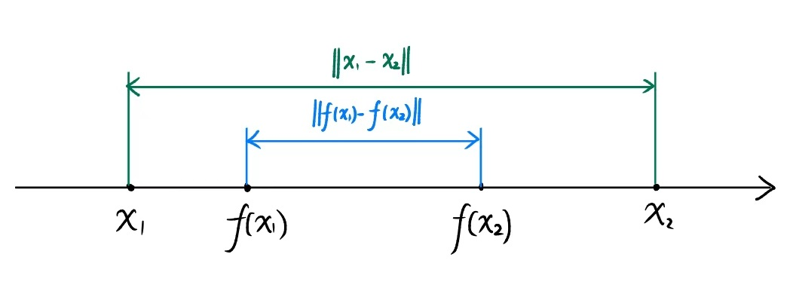

# Chapter 3: Bellman Optimality Equation

本章将介绍：

- Optimal policy
- Bellman Optimality Equation

## Optimal policy

> **Definition** of better policy （策略好坏的定义）：
>
> If $v_{\pi_1}(s) \geq v_{\pi_2}(s), \forall s \in \mathcal{S}$, then $\pi_1$ is better than $\pi_2$

> [!CAUTION]
>
> 要求对**所有**状态$s$都满足$v_{\pi_1}(s) \geq v_{\pi_2}(s)$, 才能认为 $\pi_1$ 比 $\pi_2$​ 更好

> **Definition** of Optimal policy：
>
> A policy $\pi^*$ is optimal if $v_{\pi^*}(s) \geq v_{\pi}(s),\quad \forall s \in \mathcal{S}$, for any other policy $\pi$ 

这个定义会导出以下问题：

- Does the optimal policy exist? 最优策略是否存在？
- Is the optimal policy unique? 最优策略是否唯一？
- Is the optimal policy stochastic or deterministic? 最优策略是随机性的还是确定性的？
- How to obtain the optimal policy? 如何得到最优策略？

为了回答这些问题，需要学习贝尔曼最优公式 (Bellman Optimality Equation)

## Bellman Optimality Equation

回顾Bellman Equation：
$$
\begin{aligned}
v_{\pi}(s) =& \sum_{a} \pi(a|s)\left[\sum_{r}p(r|s,a)r + \gamma \sum_{s'}p(s'|s,a)v_{\pi}(s') \right] \\
=& \sum_{a} \pi(a|s) q_{\pi}(s,a)
\end{aligned}
$$
矩阵向量形式：
$$
\mathbf{v}_{\pi} = \mathbf{r}_{\pi}+\gamma P_{\pi} \mathbf{v}_{\pi}
$$
Bellman Optimality Equation就是在Bellman Equation基础上**对策略$\pi$取最优**：
$$
\begin{aligned}
v(s) =& \max_{\pi}\sum_{a} \pi(a|s)\left[\sum_{r}p(r|s,a)r + \gamma \sum_{s'}p(s'|s,a)v(s') \right] \\
=& \max_{\pi}\sum_{a} \pi(a|s) q(s,a)
\end{aligned}
$$
对应的矩阵向量形式：
$$
\mathbf{v} = \max_{\pi} \left( \mathbf{r}_{\pi} + \gamma P_{\pi} \mathbf{v} \right)
$$
观察 Bellman Optimality Equation 不难发现，方程中包含未知数$v(s),v(s')$，还有一个最优问题$\max_{\pi} (\cdot)$

> [!IMPORTANT]
>
> 现在，我们需要从中求解出状态价值，怎么办？
>
> 解决方法：
>
> 先通过求解最优问题$\max_{\pi} (\cdot)$，得到最优策略 $\pi$；
>
> 再代入方程中，解出未知数，也就是状态价值。

### 求解最优策略$\pi$

问题：如何求解最优策略$\pi$呢？

先看以下例子：

假设给定$q_1,q_2,q_3 \in \mathbb{R}$，寻找$c_1^*,c_2^*,c_3^*$ 使得
$$
\max_{c_1,c_2,c_3} c_1 q_1 + c_2 q_2 + c_3 q_3
$$
要求满足 $c_1 + c_2+c_3=1$以及$c_1,c_2,c_3 \geq 0$

> [!NOTE]
>
> 这里的$c_1,c_2,c_3$其实就是对应着$\pi(a_1|s),\pi(a_2|s),\pi(a_3|s)$ （假设只有3种动作）
>
> 有 $\pi(a_1|s)+\pi(a_2|s)+\pi(a_3|s)=1$和 $\pi(a_1|s),\pi(a_2|s),\pi(a_3|s) \geq 0$

解：不失一般性，假设$q_3 = \max \{q_1,q_2,q_3\}$

那么
$$
q_3 = (c_1+c_2+c_3)q_3 = c_1 q_3 + c_2 q_3 + c_3 q_3 \geq c_1 q_1 + c_2 q_2 + c_3 q_3
$$
所以最优解为$c_1^*=c_2^*=0,\; c_3^*=1$.

对于求解Bellman Optimal Equation中的最优策略
$$
\begin{aligned}
v(s) =& \max_{\pi}\sum_{a} \pi(a|s)\left[\sum_{r}p(r|s,a)r + \gamma \sum_{s'}p(s'|s,a)v(s') \right] \\
=& \max_{\pi}\sum_{a} \pi(a|s) q(s,a)
\end{aligned}
$$
根据这个例子，由于 $\sum_{a} \pi(a|s)=1$

所以有
$$
\max_{\pi}\sum_{a} \pi(a|s) q(s,a) = \max_{a \in \mathcal{A}(s)}q(s,a)
$$
（用一句话来解释此式：一个状态下，最优策略的状态价值等价于最优动作的动作价值）

最优值在
$$
\pi(a|s)=
\begin{cases}
1, \quad a = a^*\\
0, \quad a \neq a^*
\end{cases}
$$
时取到。这里$a^* = \arg\max_{a \in \mathcal{A}(s)} q(s,a)$

最后得到
$$
v(s) = \max_{a \in \mathcal{A}(s)}q(s,a)
$$

### 求解状态价值

在求解之前，需要先了解[*Contraction mapping theorem*](#补充知识：Contraction mapping theorem)，这部分放在下方的补充知识中.

前文已经推导出了Bellman Optimality Equation的矩阵向量形式：
$$
\mathbf{v} = \max_{\pi} \left( \mathbf{r}_{\pi} + \gamma P_{\pi} \mathbf{v} \right)
$$
将等式右边记为$f(\cdot)$​，
$$
f(\mathbf{v}) = \max_{\pi} \left( \mathbf{r}_{\pi} + \gamma P_{\pi} \mathbf{v} \right)
$$
所以等式变为
$$
\mathbf{v} = f(\mathbf{v})
$$
$f(\cdot)$是**contraction mapping**的，满足
$$
\| f(\mathbf{v}_1) - f(\mathbf{v}_2) \| \leq \gamma \| \mathbf{v}_1 - \mathbf{v}_2\|
$$
这里的$\gamma$​就是折扣因子。

> **证明$f(\cdot)$是contraction mapping的**
>
> 证：
>
> 假设
> $$
> \pi_1^* = \arg \max_{\pi} \left( \mathbf{r}_{\pi} + \gamma P_{\pi} \mathbf{v}_1 \right)
> $$
>
> $$
> \pi_2^* = \arg \max_{\pi} \left( \mathbf{r}_{\pi} + \gamma P_{\pi} \mathbf{v}_2 \right)
> $$
>
> 那么
> $$
> f(\mathbf{v}_1) = \max_{\pi} \left( \mathbf{r}_{\pi} + \gamma P_{\pi} \mathbf{v}_1 \right) = \mathbf{r}_{\pi_1^*} + \gamma P_{\pi_1^*} \mathbf{v}_1 \geq \mathbf{r}_{\pi_2^*} + \gamma P_{\pi_2^*} \mathbf{v}_1
> $$
>
> $$
> f(\mathbf{v}_2) = \max_{\pi} \left( \mathbf{r}_{\pi} + \gamma P_{\pi} \mathbf{v}_2 \right) = \mathbf{r}_{\pi_2^*} + \gamma P_{\pi_2^*} \mathbf{v}_2 \geq \mathbf{r}_{\pi_1^*} + \gamma P_{\pi_1^*} \mathbf{v}_2
> $$
>
> 因此
> $$
> \begin{aligned}
> f(\mathbf{v}_1) - f(\mathbf{v}_2) 
> =& (\mathbf{r}_{\pi_1^*} + \gamma P_{\pi_1^*} \mathbf{v}_1) - (\mathbf{r}_{\pi_2^*} + \gamma P_{\pi_2^*} \mathbf{v}_2) \\
> \leq & (\mathbf{r}_{\pi_1^*} + \gamma P_{\pi_1^*} \mathbf{v}_1) - \left( \mathbf{r}_{\pi_1^*} + \gamma P_{\pi_1^*} \mathbf{v}_2 \right)\\
> =& \gamma P_{\pi_1^*}\left(\mathbf{v}_1 - \mathbf{v}_2 \right)
> \end{aligned}
> $$
> 同理可得
> $$
> f(\mathbf{v}_2) - f(\mathbf{v}_1) \leq \gamma P_{\pi_2^*}\left(\mathbf{v}_2 - \mathbf{v}_1 \right)
> $$
> 两式结合，可得
> $$
> \begin{aligned}
> \| f(\mathbf{v}_1) - f(\mathbf{v}_2) \| 
> \leq & \max \{\| \gamma P_{\pi_1^*}\left(\mathbf{v}_1 - \mathbf{v}_2 \right)\|, \|\gamma P_{\pi_2^*}\left(\mathbf{v}_2 - \mathbf{v}_1 \right) \| \} \\
> =& \gamma \max \{ \left|P_{\pi_1^*} \right|, \left|P_{\pi_2^*} \right| \} \cdot \|\mathbf{v}_1 - \mathbf{v}_2 \|
> \end{aligned}
> $$
> 由于状态转移矩阵$P_{\pi_1^*},P_{\pi_2^*}$ 的每个元素均是小于等于1的非负数，所以$0 \leq \left|P_{\pi_1^*} \right|, \left|P_{\pi_2^*} \right| \leq 1$，则 $0 \leq \max \{ \left|P_{\pi_1^*} \right|, \left|P_{\pi_2^*} \right| \} \leq 1$​
>
> 所以
> $$
> \| f(\mathbf{v}_1) - f(\mathbf{v}_2) \| \leq \gamma \|\mathbf{v}_1 - \mathbf{v}_2 \|
> $$
> 得证。

由于$f(\cdot)$是**contraction mapping**的，再利用 [*Contraction mapping theorem*](#补充知识：Contraction mapping theorem) 就可以得到以下结果：

对于
$$
\mathbf{v} = f(\mathbf{v})= \max_{\pi} \left( \mathbf{r}_{\pi} + \gamma P_{\pi} \mathbf{v} \right)
$$
总存在一个不动点$\mathbf{v}^*$，且这个解是**唯一**的。

这个解可以通过 ***迭代*** 计算下式来得到
$$
\mathbf{v}_{k+1} = f(\mathbf{v}_k) = \max_{\pi}(\mathbf{r}_{\pi}+ \gamma P_{\pi} \mathbf{v}_k)
$$
只要给定**任意**初始值$\mathbf{v}_0$，序列$\{\mathbf{v}_k\}$都会收敛到$\mathbf{v}^*$。收敛速度由 $\gamma$ 决定

### 解的最优性

> 这一小节分析Bellman Optimality Equation 的解的最优性

假设$v^*$是Bellman Optimality Equation 的解，满足
$$
\mathbf{v}^*=\max_{\pi} \left(\mathbf{r}_{\pi} + \gamma P_{\pi} \mathbf{v}^* \right)
$$
假设$\pi^*$是最优策略
$$
\pi^* = \arg \max_{\pi} \left(\mathbf{r}_{\pi} + \gamma P_{\pi} \mathbf{v}^* \right)
$$
将$\pi^*$代入Bellman Optimality Equation，那么
$$
\mathbf{v}^*= \mathbf{r}_{\pi^*} + \gamma P_{\pi^*} \mathbf{v}^*
$$
求得
$$
\mathbf{v}^*= \mathbf{v}_{\pi^*} 
$$

## Deterministic greedy policy

Deterministic greedy policy (确定性贪心策略) 就是Bellman Optimality Equation 对应的最优策略$\pi^*$
$$
\pi^*(a|s)=
\begin{cases}
1,\quad a = a^*(s) \\
0,\quad a \neq a^*(s) \\
\end{cases}
$$
其中
$$
a^*(s)=\arg \max_{a} q^*(a,s)
$$

$$
q^*(a,s)=\sum_{r}p(r|s,a)r + \gamma \sum_{s'} p(s'|s,a)v^*(s')
$$

## Optimal Policy Invariance

假设一个马尔可夫决策过程的最优状态价值为$\mathbf{v}^* \in \mathbb{R}^{|\mathcal{S}|}$

假如对每一个奖励 $r$ 都做一个仿射变换 $ar+b \;(a,b \in \mathbb{R}\; \text{and}\; a \neq 0)$，那么对应的状态价值$\mathbf{v}^{\prime}$也是原来状态价值$\mathbf{v}^*$的一个仿射变换
$$
\mathbf{v}^{\prime} = a \mathbf{v}^* + \frac{b}{1-\gamma}\mathbf{1}
$$
其中，$\gamma \in (0,1)$是折扣因子，$\mathbf{1}=\begin{bmatrix}1 & \cdots & 1 \end{bmatrix}^\mathrm{T}$

## 总结

Bellman Optimality Equation：

The elementwise form is
$$
\begin{aligned}
v(s) =& \max_{\pi}\sum_{a} \pi(a|s)\left[\sum_{r}p(r|s,a)r + \gamma \sum_{s'}p(s'|s,a)v(s') \right] \\
=& \max_{\pi}\sum_{a} \pi(a|s) q(s,a)
\end{aligned}
$$
The matrix-vector form is
$$
\mathbf{v} = \max_{\pi} \left( \mathbf{r}_{\pi} + \gamma P_{\pi} \mathbf{v} \right)
$$
关于Bellman Optimality Equation的解

- **存在性**：存在的最优解
- **唯一性**：最优解唯一，但是最优策略可能不唯一
- **计算**：最优解可以通过迭代计算得到

## 补充知识：Contraction mapping theorem

### Fixed point 不动点

> **Definition**:
>
> $x \in X$ is a fixed point of $f: X \rightarrow X$ if
> $$
> f(x) = x
> $$

### Contraction mapping 压缩映射

> **Definition**:
>
> $f$ is a contraction mapping if 
> $$
> \| f(x_1) - f(x_2)\| \leq \gamma \| x_1 - x_2 \|
> $$
> where $\gamma \in (0,1)$.
>
> - $\gamma$ must be strictly less than 1 so that many limits such as $\gamma^k \rightarrow 0$ as $k \rightarrow 0$ hold.
> - Here $\|\cdot \|$​ can be any vector norm.

### Contraction mapping theorem

For any equation that had the form of $x=f(x)$, if $f$ is a contraction mapping, then

- **Existence**: there exists a fixed point $x^*$ satifying $f(x^*)=x^*$.
- **Uniqueness**: The fixed point $x^*$ is unique.
- **Algorithm**: Consider a sequence $\{x_k \}$ where $x_{k+1}=f(x_k)$, then $x_k \rightarrow x^*$ as $k \rightarrow \infty$. Moreover, the convergence rate is exponentially fast.