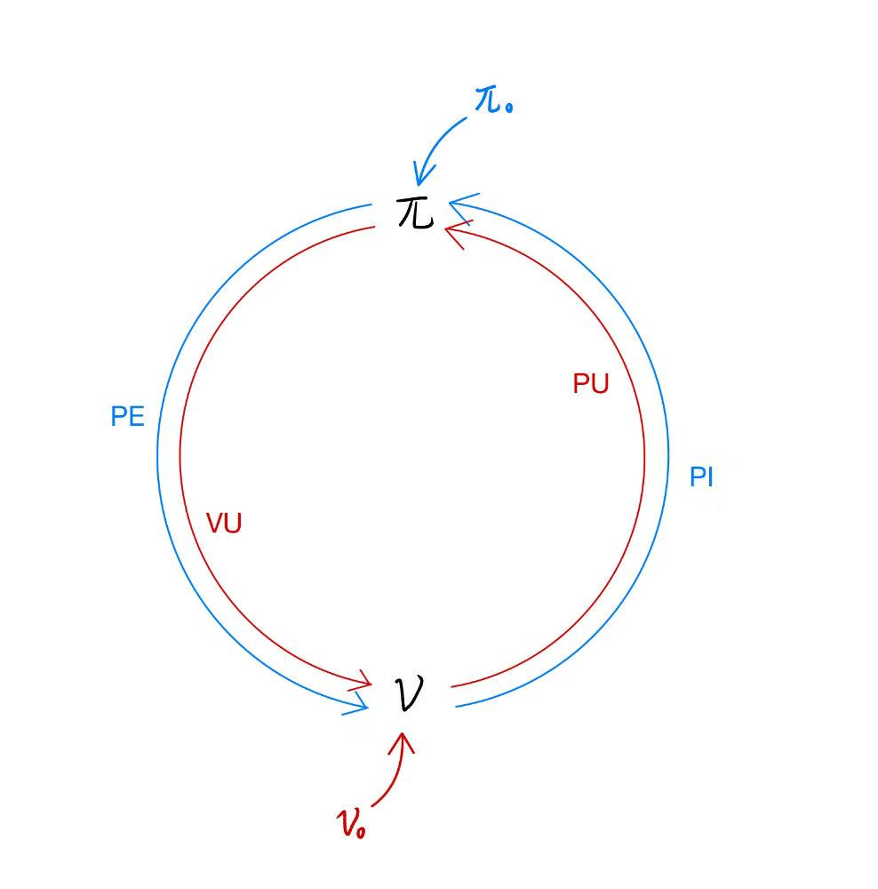
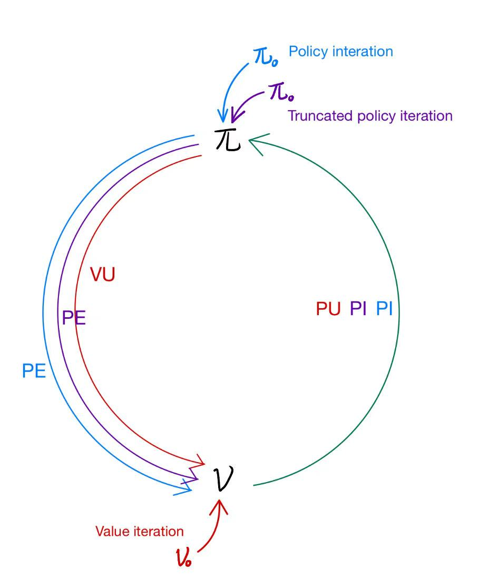
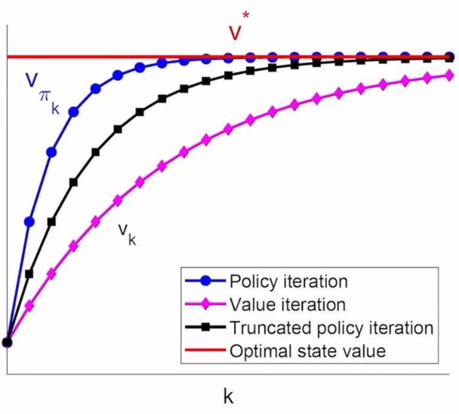

# Chapter 4: Value Iteration and Policy Iteration

本章开始将会陆续介绍强化学习的*算法*，本章会介绍：

- Value iteration algorithm
- Policy iteration algorithm
- Truncated policy iteration algorithm

## Value iteration algorithm

如何求解Bellman optimality equation?
$$
\mathbf{v} = \max_{\pi} (\mathbf{r_{\pi}} + \gamma P_{\pi} \mathbf{v})
$$
在Chapter 3中已经知道，根据 Contraction mapping theorem, 有以下迭代算法：
$$
\mathbf{v}_{k+1} = \max_{\pi} (\mathbf{r_{\pi}} + \gamma P_{\pi} \mathbf{v}_{k})
$$
其中，$\mathbf{v}_0$是任意的。

这个算法就称为 ***Value iteration***，通过这个算法，可以求解出最优状态价值和一个最优策略。

### 算法总览

***Value iteration*** 可以被分为两步：policy update, PU 和 value update, VU
$$
\mathbf{v}_{k+1} = \max_{\pi} (\mathbf{r_{\pi}} + \gamma P_{\pi} \mathbf{v}_{k}),\quad k=1,2,3,\cdots
$$

#### Step 1: Policy update (PU)

$$
\pi_{k+1} = \arg \max_{\pi} (\mathbf{r}_{\pi}+ \gamma P_{\pi}\mathbf{v}_k)
$$

where $\mathbf{v}_k$ is given.

#### Step 2: Value update (VU)

$$
\mathbf{v}_{k+1} = \mathbf{r}_{\pi_{k+1}} + \gamma P_{\pi_{k+1}}\mathbf{v}_k
$$

### 算法细节

***Value iteration*** 可以被分为两步：policy update, PU 和 value update, VU

#### Step 1: Policy update (PU)

$$
\pi_{k+1} = \arg \max_{\pi} (\mathbf{r}_{\pi}+ \gamma P_{\pi}\mathbf{v}_k)
$$

对应的 elementwise form 是：
$$
\pi_{k+1}(s) = \arg \max_{\pi} \sum_{a} \pi(a|s) 
\underbrace{ \left[\sum_{r} p(r|s,a)r + \gamma \sum_{s'}p(s'|s,a) v_{k}(s') \right]}_{q_k(s,a)},\quad s \in \mathcal{S}
$$
其中，对于有模型的情况：

$p(r|s,a)$和$p(s'|s,a) $都是已知的，$v_{k}(s')$是上一次迭代的结果，也已知。那么动作价值$q_k(s,a)=\sum_{r} p(r|s,a)r + \gamma \sum_{s'}p(s'|s,a) v_{k}(s')$是确定的。

所以最优策略$\pi_{k+1}$就可以直接由下式求出
$$
\pi_{k+1}(a|s) = \begin{cases}
1, \quad a=a_k^*(s) \\
0, \quad a \neq a_k^*(s)
\end{cases}
$$
where $a_k^*(s) = \arg \max_{a} q_k(s,a)$

> [!NOTE]
>
> 策略$\pi_{k+1}$是一个**贪心策略**，只是简单地选取了最大动作价值$q_k(s,a)$所对应的动作。

#### Step 2: Value update (VU)

$$
\mathbf{v}_{k+1} = \mathbf{r}_{\pi_{k+1}} + \gamma P_{\pi_{k+1}}\mathbf{v}_k
$$

对应的 elementwise form 是：
$$
v_{k+1}(s)=\sum_{a} \pi_{k+1}(a|s) 
\underbrace{
\left[\sum_{r}p(r|s,a)r + \gamma \sum_{s'}p(s'|s,a)v_k(s') \right]
}_{q_k(s,a)}
, \quad s \in \mathcal{S}
$$
由于策略$\pi_{k+1}$是一个**贪心策略 (greedy policy)**，所以上式就等价于
$$
v_{k+1}(s)=\max_{a} q_k(s,a)
$$

### 算法流程

$$
v_k(s) \rightarrow q_k(s,a) \rightarrow \pi_{k+1}(s) \rightarrow v_{k+1}(s)
$$

由于策略$\pi_{k+1}$是一个**贪心策略**，所以$v_{k+1}(s)$直接等于
$$
v_{k+1}(s)=\max_{a} q_k(s,a)
$$
如此不断迭代，直至状态价值$\mathbf{v}$收敛

## Policy iteration algorithm

### 算法总览

***Policy iteration*** 可以被分为两步：policy evaluation, PE 和 policy improvement, PI

首先，给定一个任意的初始策略$\pi_0$

#### Step 1: Policy evaluation (PE)

这一步求解策略$\pi_k$下的状态价值$\mathbf{v}_{\pi_k}$
$$
\mathbf{v}_{\pi_k} = \mathbf{r}_{\pi_k} + \gamma P_{\pi_k} \mathbf{v}_{\pi_k}
$$

#### Step 2: Policy improvement (PI)

更新策略
$$
\pi_{k+1}=\arg \max_{\pi} \left( \mathbf{r}_{\pi} + \gamma P_{\pi} \mathbf{v}_{\pi_k} \right)
$$

### 算法细节

***Policy iteration*** 可以被分为两步：policy evaluation 和 policy improvement

#### Step 1: Policy evaluation (PE)

如何求解策略$\pi_k$下的状态价值$\mathbf{v}_{\pi_k}$？
$$
\mathbf{v}_{\pi_k} = \mathbf{r}_{\pi_k} + \gamma P_{\pi_k} \mathbf{v}_{\pi_k}
$$

根据[Chapter2中的策略评估](Ch2_Bellman_Equation.md#策略评估)，可知有解析解和迭代解两种方式：

解析解（少用）：
$$
\mathbf{v}_{\pi_k} = (I- \gamma P_{\pi_k} )^{-1} \mathbf{r}_{\pi_k}
$$
迭代解（更常用）：

Matrix-vector form:
$$
\mathbf{v}_{\pi_k}^{(j+1)} = \mathbf{r}_{\pi_k} + \gamma P_{\pi_k} \mathbf{v}_{\pi_k}^{(j)},\quad j=0,1,2,\cdots
$$

Elementwise form:
$$
v_{\pi_k}^{(j+1)}= \sum_{a} \pi(a|s) \left[\sum_r p(r|s,a) r + \gamma \sum_{s'} p(s'|s,a)v_{\pi_k}^{(j)}(s') \right],\quad s \in \mathcal{S}
$$
迭代直至满足收敛条件：$j$足够大（$j \rightarrow \infty$）或者$\| v_{\pi_k}^{(j+1)}- v_{\pi_k}^{(j)}\|$足够小。

#### Step 2: Policy improvement (PI)

更新策略
$$
\pi_{k+1}=\arg \max_{\pi} \left( \mathbf{r}_{\pi} + \gamma P_{\pi} \mathbf{v}_{\pi_k} \right)
$$
具体方法同上[Value iteration 算法细节 Step 1: Policy update](#step-1-policy-update-PU-2)。

### 理论保证

#### 为什么能保证新策略$\pi_{k+1}$比旧策略$\pi_k$更好？

> 推论：
>
> If $\pi_{k+1} = \arg \max_{\pi}(\mathbf{r}_{\pi}+\gamma P_{\pi} \mathbf{v}_{\pi_k})$, then $\mathbf{v}_{\pi_{k+1}} \geq \mathbf{v}_{\pi_{k}}$ for any k

证明：略

#### 为什么Policy iteration algorithm 能够得到一个最优策略？

因为每一次迭代都在改进策略，可知
$$
\mathbf{v}_{\pi_0} \leq \mathbf{v}_{\pi_1} \leq \mathbf{v}_{\pi_2} \leq \cdots \leq \mathbf{v}_{\pi_k} \leq \cdots \leq \mathbf{v}^*
$$
所以，$\mathbf{v}_{\pi_k}$每一次都在增大，并且会收敛。下面证明它会收敛到$\mathbf{v}^*$

> 推论（Convergence of Policy Iteration）：
>
> The state value sequence $\{\mathbf{v}_{\pi_k}\}_{k=0}^{\infty}$ generated by the policy iteration algorithm converges to the optimal state value $\mathbf{v}^*$.
>
> As a result, the policy sequence $\{\pi_{k}\}_{k=0}^{\infty}$ converges to an optimal policy.

证明：略

### 算法流程

$$
\pi_0 \stackrel{PE}{\longrightarrow} \mathbf{v}_{\pi_0} \stackrel{PI}{\longrightarrow} \pi_1  \stackrel{PE}{\longrightarrow} \mathbf{v}_{\pi_1} \stackrel{PI}{\longrightarrow} \pi_2 \stackrel{PE}{\longrightarrow} \mathbf{v}_{\pi_2} \stackrel{PI}{\longrightarrow} \cdots
$$

## Policy iteration 和 Value iteration 两种算法的关系

由[为什么Policy iteration algorithm 能够得到一个最优策略？](#为什么Policy_iteration_algorithm 能够得到一个最优策略)中的推论得知，策略$\pi_k$收敛到最优策略等价于状态价值$\mathbf{v}_{\pi_k}$​收敛到最优的状态价值

两种算法的流程分别如下所示：
$$
\begin{aligned}
\text{Policy iteration: } 
\pi_0 \xrightarrow{PE} & \mathbf{v}_{\pi_0} \xrightarrow{PI} \pi_1 \xrightarrow{PE} \mathbf{v}_{\pi_1} \xrightarrow{PI} \cdots \\
\text{Value iteration: } \quad \qquad & \mathbf{v}_0 \xrightarrow{PU} \pi_1 \xrightarrow{VU} \mathbf{v}_1 \xrightarrow{PU} \pi_2 \xrightarrow{VU} \cdots
\end{aligned}
$$

下面通过一个表格来比较Policy iteration 和 Value iteration

> [!IMPORTANT]
>
> 红色处*是由于$\mathbf{v}_0$可以随机取值，所以就假设了$\mathbf{v}_0$等于$\mathbf{v}_{\pi_0}$*

|            | Policy iteration algorithm                                   | Value iteration algorithm                                    | Comments                                                     |
| ---------- | ------------------------------------------------------------ | ------------------------------------------------------------ | ------------------------------------------------------------ |
| (1) Policy | $\pi_0$                                                      | N/A                                                          |                                                              |
| (2) Value  | $\mathbf{v}_{\pi_0} = \mathbf{r}_{\pi_0}+\gamma P_{\pi_0} \mathbf{v}_{\pi_0}$ | $\color{red}{\mathbf{v}_0:=\mathbf{v}_{\pi_0}}$              |                                                              |
| (3) Policy | $\pi_1=\arg \max_{\pi}(\mathbf{r}_{\pi}+ \gamma P_{\pi}\mathbf{v}_{\pi_0})$ | $\pi_1=\arg \max_{\pi}(\mathbf{r}_{\pi}+ \gamma P_{\pi}\mathbf{v}_0)$ | The two policies are the same                                |
| (4) Value  | $\color{blue}{\mathbf{v}_{\pi_1} = \mathbf{r}_{\pi_1}+ \gamma P_{\pi_1} \mathbf{v}_{\pi_1}}$ | $\color{blue}{\mathbf{v}_1=\mathbf{r}_{\pi_1}+\gamma P_{\pi_1} \mathbf{v}_0}$ | $\mathbf{v}_{\pi_1} \geq \mathbf{v}_1 \text{ since } \mathbf{v}_{\pi_1} \geq \mathbf{v}_0$ |
| (5) Policy | $\pi_2=\arg \max_{\pi}(\mathbf{r}_{\pi}+ \gamma P_{\pi}\mathbf{v}_{\pi_1})$ | $\pi_2'=\arg \max_{\pi}(\mathbf{r}_{\pi}+ \gamma P_{\pi}\mathbf{v}_1)$ | $\pi_2 \neq \pi_2'$                                          |
| $\vdots$   | $\vdots$                                                     | $\vdots$                                                     | $\vdots$                                                     |

由表中可见：

- 前3步是**相同**的
- 从第4步**开始不同**，因为产生了不同的状态价值$v_{\pi_1} \neq v_1$，所以导致了接下来产生的策略和状态价值也变得不同。

下面仔细考虑第4步，即求解$\mathbf{v}_{\pi_1} = \mathbf{r}_{\pi_1}+ \gamma P_{\pi_1} \mathbf{v}_{\pi_1}$(使用***迭代法***求解)
$$
\begin{aligned}
& \color{red}{\mathbf{v}_{\pi_1}^{(0)} = \mathbf{v}_0} \\
\text{Value iteration: }\mathbf{v}_1 \leftarrow \; 
& \color{blue}{\mathbf{v}_{\pi_1}^{(1)} = \mathbf{r}_{\pi_1} + \gamma P_{\pi_1} \mathbf{v}_{\pi_1}^{(0)}} \\
& \mathbf{v}_{\pi_1}^{(2)} = \mathbf{r}_{\pi_1} + \gamma P_{\pi_1} \mathbf{v}_{\pi_1}^{(1)} \\
& \; \vdots \\
\text{Truncated policy iteration: } \bar{\mathbf{v}}_1 \leftarrow \;
& \color{blue}{\mathbf{v}_{\pi_1}^{(j)} = \mathbf{r}_{\pi_1} + \gamma P_{\pi_1} \mathbf{v}_{\pi_1}^{(j-1)}} \\
& \; \vdots \\
\text{Policy iteration: }\mathbf{v}_{\pi_1} \leftarrow \;
& \color{blue}{\mathbf{v}_{\pi_1}^{\infty} = \mathbf{r}_{\pi_1} + \gamma P_{\pi_1} \mathbf{v}_{\pi_1}^{\infty}} \\
\end{aligned}
$$
由此可以很容易发现：

- Value iteration 只是迭代了1步
- Policy iteration 迭代无穷多步，直至收敛，这时能够求出比较准确的$\mathbf{v}_{\pi_1}$
- Truncated policy iteration 迭代$j$步，将此时的$\mathbf{v}_{\pi_1}^{(j)}$ 记为$\bar{\mathbf{v}}_1$，用于Policy improvement。因此被称为“*截断 truncated*”

## Truncated policy iteration algorithm

由[Policy iteration 和 Value iteration 两种算法的关系](#Policy iteration 和 Value iteration 两种算法的关系)可见，Truncated policy iteration algorithm 是 Value iteration algorithm 和 Policy iteration algorithm 的*一般化推广*，而 Value iteration algorithm 和 Policy iteration algorithm 分别是 Truncated policy iteration algorithm 的*两个特殊情况*。

### 算法总览

***Policy iteration*** 可以被分为两步：policy evaluation, PE 和 policy improvement, PI

首先，给定一个任意的初始策略$\pi_0$，设置一个最大的迭代次数 $j_\text{truncated}$

#### Step 1: Policy evaluation (PE)

这一步求解策略$\pi_k$下的状态价值$\mathbf{v}_{\pi_k}$
$$
\mathbf{v}_{\pi_k} = \mathbf{r}_{\pi_k} + \gamma P_{\pi_k} \mathbf{v}_{\pi_k}
$$

当迭代次数达到 $j_\text{truncated}$时，就停止。将这时得到的$\mathbf{v}_{\pi_k}^{(j_\text{truncated})}$用于 Policy improvement

#### Step 2: Policy improvement (PI)

更新策略
$$
\pi_{k+1}=\arg \max_{\pi} \left( \mathbf{r}_{\pi} + \gamma P_{\pi} \mathbf{v}_{\pi_k} \right)
$$

### 理论保证

#### 在迭代中，截断后的状态价值能否保证比初始状态价值更优？

> Proposition (Value Improvement): 
>
> Consider the iterative algorithm for solving the policy evaluation step:
> $$
> \mathbf{v}_{\pi_k}^{(j+1)}=\mathbf{r}_{\pi_k} + \gamma P_{\pi_k} \mathbf{v}_{\pi_k}^{(j)},\quad j=0,1,2,\cdots
> $$
> If the initial guess is selected as $\mathbf{v}_{\pi_k}^{(0)}=\mathbf{v}_{\pi_{k-1}}$ (the initial guess is the result of last policy improvement), it holds that 
> $$
> \mathbf{v}_{\pi_k}^{(j+1)} \geq \mathbf{v}_{\pi_k}^{(j)}, \quad j=0,1,2,\cdots
> $$

根据这个命题，可以得知：
$$
\mathbf{v}_{\pi_k}^{(\infty)} \geq \cdots \mathbf{v}_{\pi_k}^{(j)} \geq \cdots \geq \mathbf{v}_{\pi_k}^{(1)} \geq \mathbf{v}_{\pi_k}^{(0)}
$$
也就是说：截断后的状态价值$\mathbf{v}_{\pi_k}^{(j)}$会劣于Policy iteration 的状态价值 $\mathbf{v}_{\pi_k}^{(\infty)}$，但优于 Value iteration的状态价值 $\mathbf{v}_{\pi_k}^{(1)}$ 和上一次 policy improvement 得到的状态价值 $\mathbf{v}_{\pi_k}^{(0)}$

## 总结

### 算法对比

|                  | Policy iteration                                             | Truncated policy iteration           | Value iteration  |
| ---------------- | ------------------------------------------------------------ | ------------------------------------ | ---------------- |
| 初始值           | $\pi_0$                                                      | $\pi_0$                              | $\mathbf{v}_0$   |
| 更新$\mathbf{v}$ | PE，迭代次数：$j \rightarrow \infty$或 $\|v_{\pi_k}^{(j+1)}- v_{\pi_k}^{(j)}\|$足够小 | PE，迭代次数：$j_\text{truncated}$次 | VU,迭代次数：1次 |
| 更新$\pi$        | PI                                                           | PI                                   | PU               |

> [!NOTE]
>
> 更新策略$\pi$的方法是相同的，
>
> 即：Policy iteration 的 PI = Truncated policy iteration的 PI = Value iteration 的 PU

### 比较：三种算法求出的状态价值

