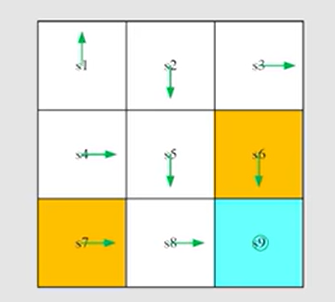
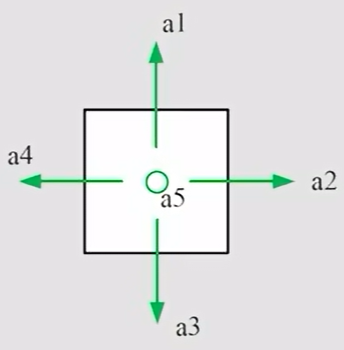

# Chapter 5: Monte Carlo Learning

本章将介绍3个基于蒙特卡洛的强化学习算法：

- MC Basic
- MC Exploring Starts
- MC $\epsilon$-Greedy

## Monte Carlo estimation

> 当模型未知时，如何估计一些量？
>
> -> 使用 蒙特卡洛估计 (Monte Carlo estimation)

### Example：Flip a coin

The result (either head or tail) is denoted as a random variable $X$

- if the result is head, then $X=1$
- if the result is tail, then $X=-1$

The aim is to compute $\mathbb{E}[X]$.

#### Method 1: Model-based

Suppose the probabilistic model is known as 
$$
p(X=1)=0.5, \quad p(X=-1)=0.5
$$
Then by definition
$$
\mathbb{E}[X]=\sum_{x} x p(x) = 1 \times 0.5 + (-1) \times 0.5=0
$$

#### Method 2: Model-free

> Idea: Flip the coin many times (called "sampling"), and then calculate the average of the outcomes.

Suppose we get a sample sequence: $\{x_1,x_2,\cdots,x_N \}$

Then, the mean can be approximated as
$$
\mathbb{E}[X] \approx \bar{x} = \frac{1}{N} \sum_{j=1}^{N} x_j
$$
This is ***the idea of Monte Carlo estimation***

> [!NOTE]
>
> **Question: 能否保证蒙特卡洛估计的值与真实值接近？**
>
> 当采样次数$N$比较小时，无法保证；
>
> 当采样次数$N$非常大时，根据大数定理，蒙特卡洛估计的值与真实值会比较接近

> **大数定理 Law of Large Numbers**
>
> For a random variable $X$. Suppose $\{x_j \}_{j=1}^{N}$ are some independent and identically distributed samples. 
>
> Let $\bar{x}=\frac{1}{N} \sum_{j=1}^{N} x_j$ be the average of the samples. 
>
> Then
> $$
> \mathbb{E}[\bar{x}] = \mathbb{E}[X]
> $$
>
> $$
> Var[\bar{x}]=\frac{1}{N}Var[X]
> $$
>
> As a result, $\bar{x}$ is an unbiased estimate of $\mathbb{E}[X]$ and $Var[\bar{x}] \rightarrow 0$, when $N \rightarrow \infty$

## Convert policy iteration to be Model-free

上一章介绍的 policy iteration algorithm 其实是 Model-based 的算法，现在我们要将它变成 Model-free 的。

Policy iteration 含有两步：

1. Policy evaluation: $\mathbf{v}_{\pi_k}=\mathbf{r}_{\pi_k} + \gamma P_{\pi_k}\mathbf{v}_{\pi_k}$
2. Policy improvement: $\pi_{k+1}=\arg \max_{\pi} \left( \mathbf{r}_{\pi} + \gamma P_{\pi} \mathbf{v}_{\pi_k} \right)$

Policy improvement的elementwise form是
$$
{\pi_{k+1}}(s)=\arg \max_{\pi} \sum_{a} \pi(a|s) \left[ \sum_r p(r|s,a) r + \gamma \sum_{s'} p(s'|s,a)v_{\pi_k}(s') \right],\quad s \in \mathcal{S}
$$
也可以写为
$$
{\pi_{k+1}}(s)=\arg \max_{\pi} \sum_{a} \pi(a|s) q_{\pi_k}(s,a),\quad s \in \mathcal{S}
$$
要将policy iteration algorithm 变成Model-free的，关键就是将动作价值$q_{\pi_k}(s,a)$写成Model-free的。

### 动作价值$q_{\pi_k}(s,a)$的求法

回顾[Ch2_Bellman_Equation.md中Action value的定义](Ch2_Bellman_Equation.md#Action Value),
$$
q_{\pi_k}(s,a) = \mathbb{E}[G_t|A_t=a,S_t=s]
$$
在**模型已知**（即$p(r|s,a), p(s'|s,a)$已知）的情况下，$q_{\pi_k}(s,a)$就能用 $p(r|s,a), p(s'|s,a)$ 来表示
$$
q_{\pi_k}(s,a) = \sum_r p(r|s,a) r + \gamma \sum_{s'} p(s'|s,a)v_{\pi_k}(s')
$$
但是如果**模型未知**，可以像[Example：Flip a coin Method 2: Model-free](#Method 2: Model-free)一样，利用蒙特卡洛方法对$\mathbb{E}[G_t|A_t=a,S_t=s]$进行估计，从而得到$q_{\pi_k}(s,a)$的一个近似值，具体如下所示。

#### 蒙特卡洛法估计动作价值$q_{\pi_k}(s,a)$

- Starting from a pair of state and action $(s,a)$, following a policy $\pi_k$, generate an episode.
- The return of the episode is $g(s,a)$.
-  $g(s,a)$ is a sample of $G_t$ in $\mathbb{E}[G_t|A_t=a,S_t=s]$.

- Suppose we have a set of episodes and hence $\{g^{(j)}(s,a) \}$. So
  $$
  q_{\pi_k}(s,a) = \mathbb{E}[G_t|A_t=a,S_t=s] \approx \frac{1}{N} \sum_{j=1}^{N} g^{(j)}(s,a)
  $$

> [!NOTE]
>
> 综上可见，当有模型时，就利用模型已有的信息；而当没有模型时，就利用数据（data）采样，在强化学习中，这些数据又称为经验experience

## MC Basic Algorithm

利用上文的[蒙特卡洛法估计动作价值](#蒙特卡洛法估计动作价值)，就可以得到 MC Basic Algorithm。

### 算法流程

该算法的具体流程如下：

#### Step 1: Policy evaluation

> This step is to obtain $q_{\pi_k}(s,a)$ for all state-action pair $(s,a)$.

Specifically, for each state-action pair $(s,a)$, run an infinite number of (or sufficiently many) episodes. 

The average of their returns is used to approximate $q_{\pi_k}(s,a)$, according to [蒙特卡洛法估计动作价值](#蒙特卡洛法估计动作价值)

#### Step 2: Policy Improvement

> This step is to solve $\pi_{k+1}(s)=\arg \max_{\pi} \sum_{a} \pi(a|s) q_{\pi_k}(s,a), \quad \forall s \in \mathcal{S}$

To achieve this, we use the greedy optimal policy as [Ch3_Bellman_Optimality_Equation 求解最优策略$\pi$](Ch3_Bellman_Optimality_Equation#求解最优策略$\pi$) :
$$
\pi_{k+1}(a_{k}^*|s)=1
$$
where
$$
a_k^*=\arg \max_{a} q_{\pi_k}(s,a)
$$

> [!CAUTION]
>
> 值得注意的是，这个算法中直接估计$q_{\pi_k}(s,a)$，而没有再求$v_{\pi_k}(s)$

> [!NOTE]
>
> 这个算法与Policy iteration的区别在于Step 1: Policy evaluation，Step 2: Policy Improvement是一样的。

### 算法分析

1. 优点：MC Basic 揭示了Model-free RL的核心
2. 缺点：MC Basic 效率低，不实用
3. MC Basic 与Policy iteration一样也是收敛的，只是计算的方式不同

### Example

任务：初始策略$\pi_0$如上图所示，要求使用MC Basic来寻找最优策略。

其中，$r_{boundary}=-1,r_{forbidden}=-1,r_{target}=1,\gamma=0.9$​

动作的编号如下：

> [!TIP]
>
> 思路：
>
> 按照 MC Basic
>
> Step 1: Policy evaluation, 求出所有的$q_{\pi_k}(s,a)$
>
> 共有9种状态，每种状态有5种动作，所以共有$9 \times 5=45$​个state-action pair
>
> 由于该例子中，策略和环境都是确定性的，所以从给定一个$(s,a)$出发，不管采样多少次，得到的结果均相同，所以只要采样一次就够了。但是若策略或环境是随机性的，就一定要采样多次。
>
> Step 2: Policy Improvement
>
> 利用贪心算法，求出最优动作，从而得到最优策略。

解：

Step 1: Policy evaluation

| 开始的$(s,a)$ | episode                                                      | action value $q_{\pi_0}(s,a)$                                |
| ------------- | ------------------------------------------------------------ | ------------------------------------------------------------ |
| $(s_1,a_1)$   | $s_1 \xrightarrow{a_1} s_1 \xrightarrow{a_1} s_1 \xrightarrow{a_1} \cdots$ | $q_{\pi_0}(s_1,a_1)=-1+\gamma \cdot (-1) + \gamma^2 \cdot (-1)+\cdots$ |
| $(s_1,a_2)$   | $s_1 \xrightarrow{a_2} s_2 \xrightarrow{a_3} s_5 \xrightarrow{a_3} s_8 \xrightarrow{a_2} s_9 \xrightarrow{a_5} \cdots$ | $q_{\pi_0}(s_1,a_2)=0+\gamma \cdot (0) + \gamma^2 \cdot (0)+\gamma^3 \cdot 1 +\gamma^4 \cdot 1 \cdots$ |
| $(s_1,a_3)$   | $s_1 \xrightarrow{a_3} s_4 \xrightarrow{a_2} s_5 \xrightarrow{a_3} s_8 \xrightarrow{a_2} s_9 \xrightarrow{a_5} \cdots$ | $q_{\pi_0}(s_1,a_3)=0+\gamma \cdot (0) + \gamma^2 \cdot (0)+\gamma^3 \cdot 1 +\gamma^4 \cdot 1 \cdots$ |
| $(s_1,a_4)$   | $s_1 \xrightarrow{a_4} s_1 \xrightarrow{a_1} s_1 \xrightarrow{a_1} \cdots$ | $q_{\pi_0}(s_1,a_4)=-1+\gamma \cdot (-1) + \gamma^2 \cdot (-1)+\cdots$ |
| $(s_1,a_5)$   | $s_1 \xrightarrow{a_5} s_1 \xrightarrow{a_1} s_1 \xrightarrow{a_1} \cdots$ | $q_{\pi_0}(s_1,a_5)=0+\gamma \cdot (-1) + \gamma^2 \cdot (-1)+\cdots$ |
| $\vdots$      | $\vdots$                                                     | $\vdots$                                                     |

Step 2: Policy Improvement

对于从$s_1$出发的动作来说，有上表可见，显然$a_2,a_3$都是最优的

所以策略会被更新为
$$
\pi_1(a_2|s_1)=1 \; \text{or} \;\pi_1(a_3|s_1)=1
$$
对于从$s_2$出发的动作来说，……

### Episode length

​	Episode length 是从一个 state-action pair $(s,a)$出发，进行探索的长度。

​	理论上，Episode length 应该要趋近于$\infty$，但是再现实中不可能取到$\infty$，只能取一个尽可能大的值。由于Episode length 取的是一个有限值，Episode length 的大小就会影响action value $q_{\pi_0}(s,a)$的计算。

具体而言：

- 当Episode length 较小时，只有靠近目标的状态才有非零的状态价值
- 随着Episode length 的增大，含有非零状态价值的状态逐渐由目标向周围扩大，
- 当Episode length 足够大时，最终全部状态都有非零的状态价值，而且这些状态价值会收敛到固定值，并保持不变

所以Episode length 要**足够大**

### 思考：如何更高效地利用数据？

对于以下的episode
$$
s_1 \xrightarrow{a_2} s_2 \xrightarrow{a_4} s_1  \xrightarrow{a_2} s_2 \xrightarrow{a_3} s_5 \xrightarrow{a_1} \cdots
$$
如果用 MC Basic算法，就只能够计算一个return ，用来估计$q_{\pi}(s_1,a_2)$。如何更高效地利用数据呢？

> **Visit**
>
> Every time a state-action pair appears in the episode, it is called a **visit** of that state-action pair.
>
> 当一个状态动作对出现在episode中，就称为**访问**了一次这个状态动作对。

 不难发现，上面的episode访问了$(s_2,a_4)$，如果去掉第一个state-action pair $(s_1,a_2)$, 就能得到
$$
s_2 \xrightarrow{a_4} s_1  \xrightarrow{a_2} s_2 \xrightarrow{a_3} s_5 \xrightarrow{a_1} \cdots
$$
这是从$(s_2,a_4)$开始的一个episode，利用它就能估计$q_{\pi}(s_2,a_4)$.

类似地，我们有
$$
\begin{aligned}
s_1 \xrightarrow{a_2} s_2 \xrightarrow{a_4} s_1  \xrightarrow{a_2} s_2 \xrightarrow{a_3} s_5 \xrightarrow{a_1} \cdots & \quad \text{origin episode starting from} (s_1,a_2)\\
 s_2 \xrightarrow{a_4} s_1  \xrightarrow{a_2} s_2 \xrightarrow{a_3} s_5 \xrightarrow{a_1} \cdots & \quad \text{episode starting from} (s_2,a_4) \\
s_1  \xrightarrow{a_2} s_2 \xrightarrow{a_3} s_5 \xrightarrow{a_1} \cdots & \quad \text{episode starting from} (s_1,a_2) \\
s_2 \xrightarrow{a_3} s_5 \xrightarrow{a_1} \cdots & \quad \text{episode starting from} (s_2,a_3) \\
s_5 \xrightarrow{a_1} \cdots & \quad \text{episode starting from} (s_5,a_1) \\
  
\end{aligned}
$$
这样就能估计$q_{\pi}(s_1,a_2),q_{\pi}(s_2,a_4),q_{\pi}(s_2,a_3),q_{\pi}(s_5,a_1),\cdots$

#### Data-efficient methods

- first-visit method: 对于上面的$(s_1,a_2)$,只看第一次出现的
- every-visit method: 对于上面的$(s_1,a_2)$,每一次出现的都要考虑

### 思考：如何更高效地去更新策略？

#### 方法一：

像MC Basic一样，收集从一个state-acition pair出发的所有episodes，然后利用这些episodes的平均return来估计动作价值

缺点：效率低，要等待所有的episodes都收集完，才能计算平均return来估计动作价值

#### 方法二：

使用一个episode的return去估计动作价值，然后直接开始policy improvement

> 方法二是否行之有效？
>
> 类似于 truncated policy iteration， truncated policy iteration虽然在每一次policy evaluation没有得到精确的状态价值，然后就进行policy improvement，但是经过多次policy evaluation 和 policy improvement的迭代，就能得到一个准确的policy。
>
> 这一类算法思想就称为 **Generalized Policy Iteration**

## MC Exploring Starts Algorithm

> MC Exploring Starts 在 MC Basic基础上进行改进，变得更加高效

顾名思义：

exploring 是指要遍历所有的state-action pair

starts 是指 收集的episodes 一定要从某个state-action pair开始， 而不按照[思考：如何更高效地利用数据？](#思考：如何更高效地利用数据？)那样，收集那些在一个episode中间visit过的episodes
