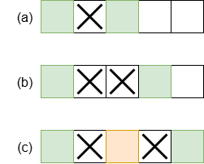
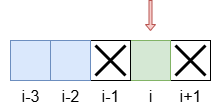

# 打家劫舍

from：leetcode [打家劫舍](https://leetcode.cn/problems/house-robber/)

归类：数组、动态规划

## 题目描述：

你是一个专业的小偷，计划偷窃沿街的房屋。每间房内都藏有一定的现金，影响你偷窃的唯一制约因素就是相邻的房屋装有相互连通的防盗系统，**如果两间相邻的房屋在同一晚上被小偷闯入，系统会自动报警**。

给定一个代表每个房屋存放金额的非负整数数组，计算你 **不触动警报装置的情况下** ，一夜之内能够偷窃到的最高金额。

**示例 1：**

```
输入：[1,2,3,1]
输出：4
解释：偷窃 1 号房屋 (金额 = 1) ，然后偷窃 3 号房屋 (金额 = 3)。
     偷窃到的最高金额 = 1 + 3 = 4 。
```

**示例 2：**

```
输入：[2,7,9,3,1]
输出：12
解释：偷窃 1 号房屋 (金额 = 2), 偷窃 3 号房屋 (金额 = 9)，接着偷窃 5 号房屋 (金额 = 1)。
     偷窃到的最高金额 = 2 + 9 + 1 = 12 。
```

 

## 解答

### 题目条件分析

- “如果**两间相邻**的房屋在同一晚上被小偷闯入，系统会自动报警” --> 小偷选择的房屋不能相邻，即至少相隔1间房屋，如下图(a)(b)
- “最高金额” --> 小偷选择的两间房屋之间不能隔太远，否则中间房屋的钱就无法得到，从而无法达到最高金额，如下图(c),中间黄色的房屋其实可以抢，但是却没有被抢，导致无法达到最高金额



(图中，绿色表示抢劫的房屋，‘X’表示不能抢的房屋，黄色表示可以抢但没有抢的房屋)

### 方法一

#### 思路

遍历所有的可能性不太现实，因此考虑**动态规划**的思想，从左到右计算**从最左边房屋到当前第 *i* 间房屋可以抢到的最高金额**（当前房屋**要抢**）。

由以上的“题目条件分析”可以知道（如下图所示）：

- 如果抢了第 *i* 间房屋，则不能抢第 *i-1* 间房屋和第 *i+1* 间房屋。
- 如果抢了第 *i* 间房屋，则为了得到最高金额，则必须抢第 *i-2* 间房屋或者第 *i-3* 间房屋之一。




记**`dp[i]`是 从最左边房间到第 *i* 间房屋可以抢到的最高金额**（当前房屋**要抢**）。

则有递推公式：
$$
dp[i] = max(dp[i-2],\quad dp[i-3]) + money[i]
$$
当整个数组都计算完时，总的最高金额就是最后两间房的最高金额的最大值

即 
$$
money_{max}= max(dp[n-2], dp[n-1])
$$
 (n为房屋总数量)

#### 边界条件检查

- 如果只有1间房，那么必定会抢这间房，最高金额就是这间房的金额

- 如果只有2间房，那么只能抢二者之一，最高金额就是两间房的金额最大者。

- 如果有大于等于3间房，那么对于第3间房，即 i=2时(注意：i从0开始)，`i-3 = -1`,数组中不存在这一项！所以 i=2时的递推公式为
  $$
  dp[2] = dp[0] + money[2]
  $$
  

#### 完整代码

为了节省存储空间，下面的代码就直接在原来的数组`nums`上计算并存储`dp`(从最左边房间到第 *i* 间房屋可以抢到的最高金额)

```c
int max(int a, int b) {
    return a>b? a: b;
}
int rob(int* nums, int numsSize) {
    if(numsSize==1) {
        return nums[0];
    }
    if(numsSize==2) {
        return max(nums[0],nums[1]);
    }
    nums[2] = nums[0] + nums[2];
    for(int i=3; i<numsSize; i++) {
        nums[i] = max( nums[i-2], nums[i-3]) + nums[i];
    }
    int max_money = max(nums[numsSize-2],nums[numsSize-1]);
    return max_money;
}
```


### 方法二

#### 思路

遍历所有的可能性不太现实，因此考虑**动态规划**的思想，从左到右计算**从最左边房屋到当前第 *i* 间房屋可以抢到的最高金额**（当前房屋**可能不抢**）。

记**`dp[i]`是 从最左边房间到第 *i* 间房屋可以抢到的最高金额**（当前房屋**可能不抢**）

由以上的“题目条件分析”可以知道：

从最左边房屋到当前第 *i* 间房屋可以抢到的最高金额`dp[i]`，要么是第 *i-1* 间房屋的最高金额`dp[i-1]`，要么是第 *i-2* 间房屋的最高金额`dp[i-2]`与当前房屋金额`money[i]`之和。

即有递推公式:
$$
dp[i] = max(dp[i-1], dp[i-2] + money[i])
$$

总的最高金额为
$$
money_{max}= dp[n-1]
$$


#### 边界条件检查

如果只有1间房，那么必定会抢这间房，最高金额就是这间房的金额

如果有大于等于2间房，那么对于第2间房，即 i=1时(注意：i从0开始)，`i-2 = -1`,数组中不存在这一项！

所以 i=1时的递推公式为
$$
dp[1] = max( dp[0],\quad money[1])
$$
又因为
$$
dp[0] = money[0]
$$
所以
$$
dp[1] = max(money[0], \quad money[1])
$$


#### 完整代码

为了节省存储空间，下面的代码就直接在原来的数组`nums`上计算并存储`dp`(从最左边房间到第 *i* 间房屋可以抢到的最高金额)

```c
int max(int a, int b) {
    return a>b? a: b;
}
int rob(int* nums, int numsSize) {
    if(numsSize==1) {
        return nums[0];
    }

    nums[1] = max(nums[0],nums[1]);
    
    for(int i=2; i<numsSize;i++) {
        nums[i] = max(nums[i-1], nums[i-2] + nums[i]);
    }
    return nums[numsSize-1];
}
```

